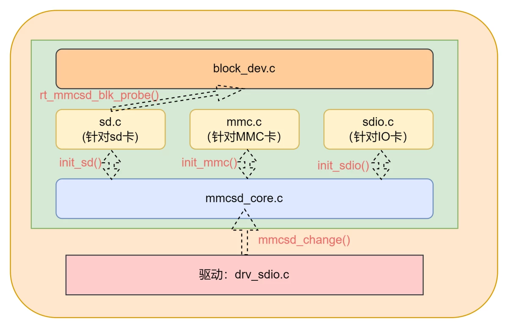
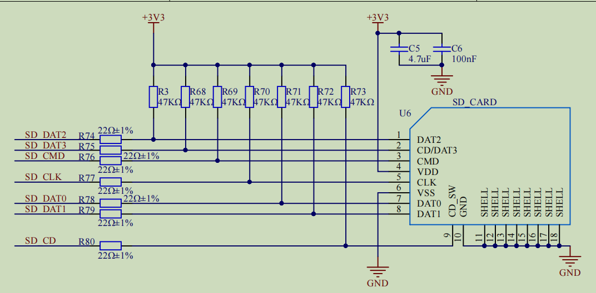
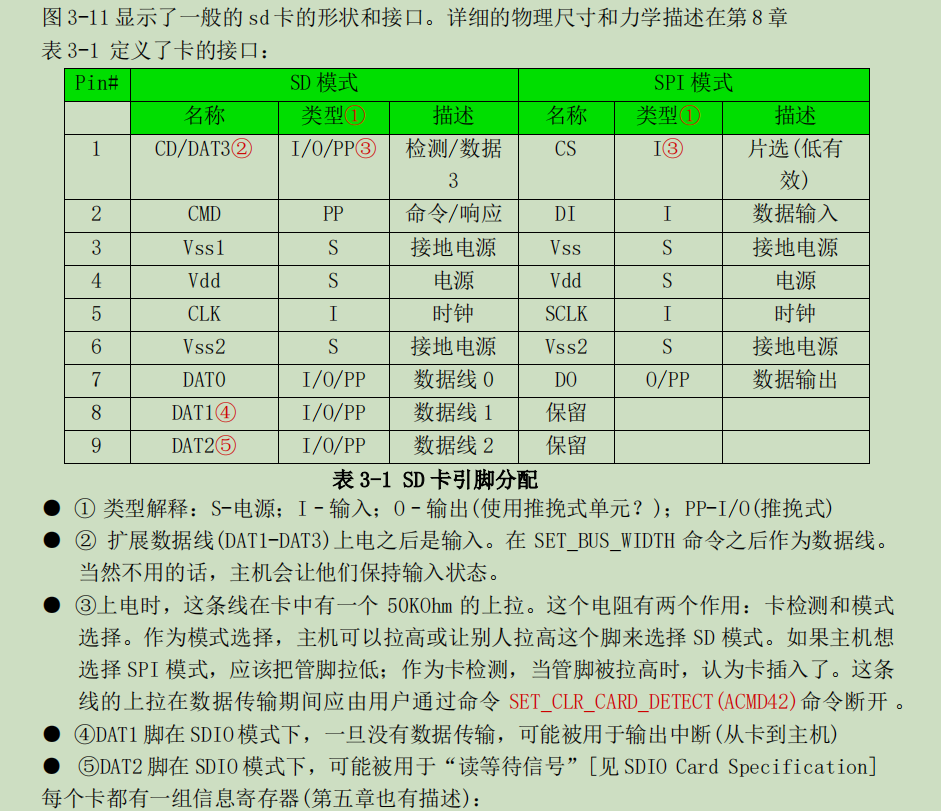
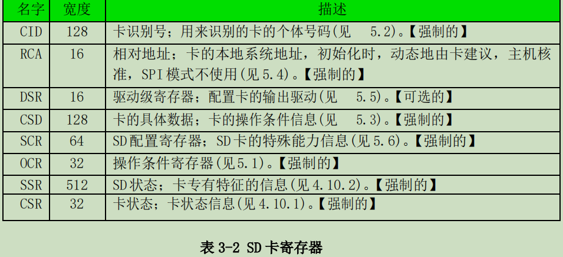
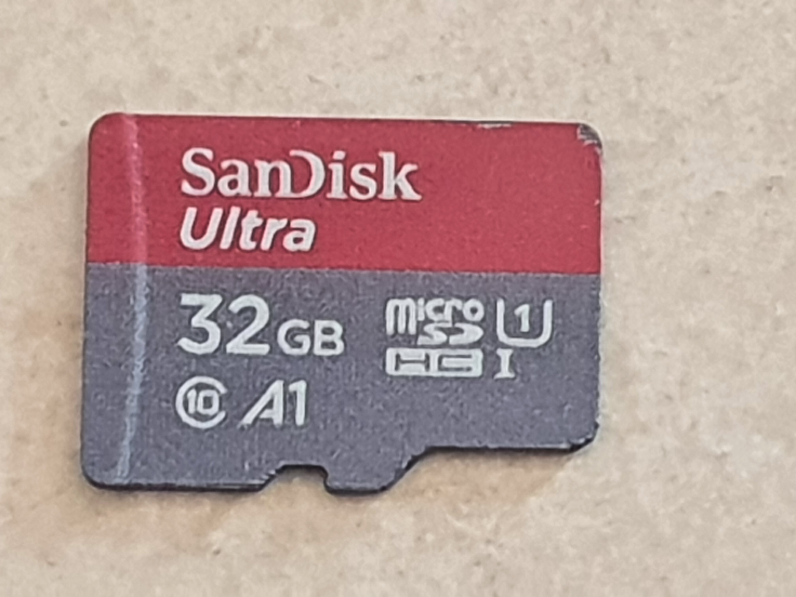
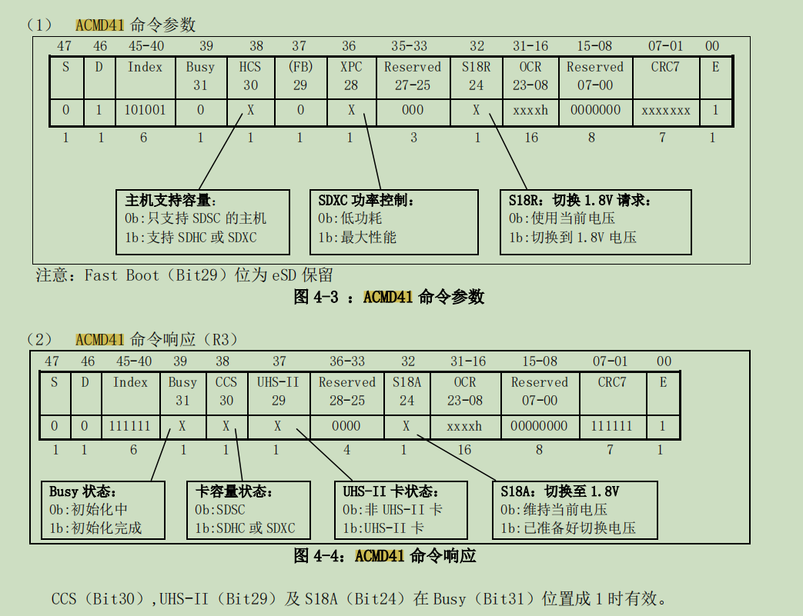
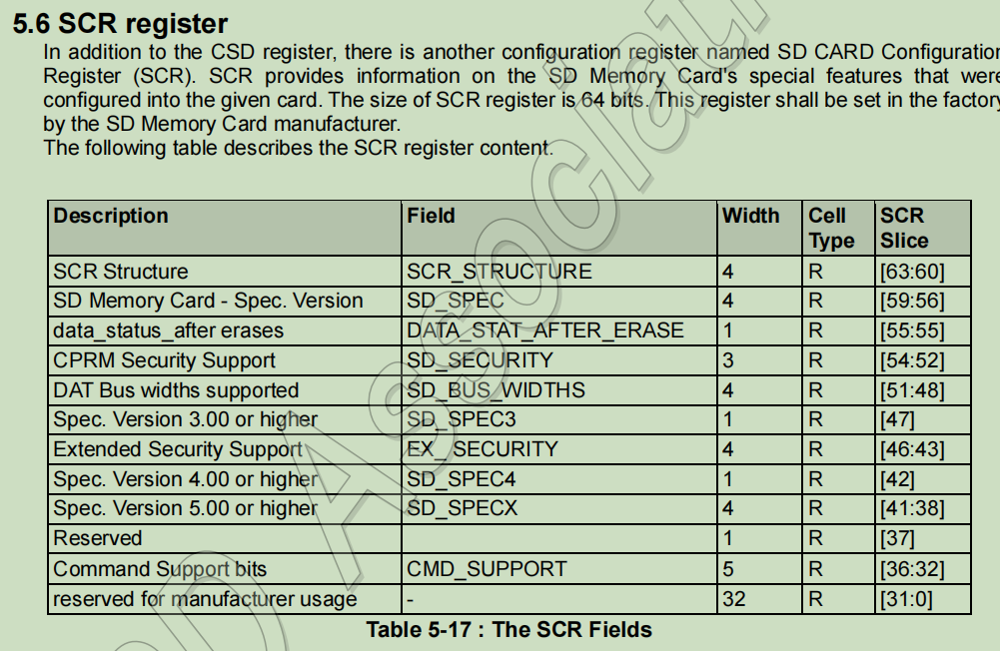

# 41 SDMMC



## 41.0 SD 协议

- SD 卡系统定义了三种通信协议：SD ， SPI 和 UHS-II。主机系统可以选择任意一种。当收到 reset 命令的时候，SD 卡通过主机的信息来决定 使用何种模式，并且之后的通讯都会使用相同的模式。不推荐多卡槽用共同的总线信号。一个单独的 SD 总线应该连接一个单独的 可移除的 SD 卡。UHS-II 支持多个器件通过环形（Ring）或 Hub 拓扑连接
- 在默认速度下，SD 卡总线有一个主(应用),多个从(卡)，同步的星型拓扑结构(图 3-1)。时钟，电源和 地信号是所有卡都有的。在高速模式和 UHS-I 模式下，SD 卡总线有一个主机（应用）一个从（卡），同步的点对点拓扑。命令(CMD)和数据(DAT0-3)信号是根据每张卡的，提供连续地点对点连接到所有卡。
- 在初始化时，处理命令会单独发送到每个卡，允许应用程序检测卡以及分配逻辑地址给物理卡槽。数据总是单独发送(接收)到(从)每张卡。但是，为了简化卡的堆栈操作，在初始 化过

程结束后，所有的命令都是同时发送到所有卡。地址信息包含在命令包中。

- SD 总线允许数据线的动态配置。上电后，SD 卡默认只使用 DAT0 来传输数据。初始化之 后，主机可以改变总线宽度(使用的数据线数目)。这个功能允许硬件成本和系统性能之间的简单交换。注意：当 DAT1-DAT3 没有使用的时候，相关的主机 DAT 先应该被设置为输入模式。SDIO 卡 DAT1 和 DAT2 用于信令。

### 41.0.1 SD总线

1. SD 总线的通信是基于命令和数据流的。由一个起始位开始，由一个停止位终止。

- 命令(Command)：命令就是一个标记，用于发起一个操作。由主机发送到单个卡(寻址命令)或者所有卡(广播命令)。命令在CMD线上是连续传输的。
- 响应(Response)：响应是一个标记，从寻址的卡或者所有卡(同步)发送给主机，作为向前接收到的命令的回答。响应也是在CMD线上连续传输的。
- 数据(Data)：数据可以从主机到卡，也可以从卡到主机。通过数据线传输。

2. 卡片寻址通过使用会话地址来实现，会话地址会在初始化阶段分配给卡。命令，响应和 数据块的结构在第 4 章中描述。SD 总线上的基本交互是命令/响应交互(图 3-4)。这种总线交互直接在命令或者响应的结构里面传输他们的信息。此外，一些操作还有数据内容。
3. SD 卡发送或接收的数据在块(block)中完成。数据块以 CRC 位来保证成功。目前有单块或多块操作。注意：多块操作模式在快速写操作时更好一点。多块传输以命令线上的结束命 令为结束标志。主机端可以配置单线还是多线传输。
4. 块写操作使用简单的busy来表示DAT0数据线上的持续写操作，不管使用几线传输。
5. 命令内容：命令+地址信息/参数+7位CRC校验(48bit)

- 每一个命令标记都是以起始位 bit(0)在最开始，以结束位 bit(1)表示成功。总长度是48Bit。每个命令都使用 CRC 位来保护，这样可以检测到传输错误，并且再次发送命令。
- 。数据块的 CRC 保护算法是一个 16bit 的 CCITT 多项式。

6. 在命令线上最高有效位(MSB)先发送，最低有效位(LSB)后发送(从高位到低位传输)。 当使用宽总线操作的时候，数据每次传 4Bit(见图3-10)。起始位、结束位以及 CRC 位，每条数据线上都要发送。CRC 位每条数据线都要分别检查。CRC 状态反馈和忙碌只是只会从 DAT0 发送到 host 端，DAT1-DAT3 忽略。
7. 上电时，这条线在卡中有一个 50KOhm 的上拉。这个电阻有两个作用：卡检测和模式选择。作为模式选择，主机可以拉高或让别人拉高这个脚来选择 SD 模式。如果主机想选择 SPI 模式，应该把管脚拉低；作为卡检测，当管脚被拉高时，认为卡插入了。这条线的上拉在数据传输期间应由用户通过命令 SET_CLR_CARD_DETECT(ACMD42)命令断开 。DAT1 脚在 SDIO 模式下，一旦没有数据传输，可能被用于输出中断(从卡到主机);DAT2 脚在 SDIO 模式下，可能被用于“读等待信号”;

- 硬件原理图





8. 每个卡都有一组信息寄存器



9. 主机可以通过切换电源开关来实现卡的复位。但是每个卡都有自己的电源检测电路，用来在上电后将卡设置到一个预置状态，所以重启电源并不是必须的，通过发送 GO_IDLE(CMD0)同样可以让卡复位。

### 41.0.2 SD命令

> 查看 <<PhysicalLayerSimplifiedSpecificationVersion9.10>> 4.7.4 Detailed Command Description

#### 41.0.3 命令类型

Sd 卡定义了 4 种命令类型：

- 广播命令(bc)，无响应 — 广播命令只有当所有的 CMD 线都一起连到主机上时才会 用。如果是分开的，

那么每张卡单独处理命令。

- 广播命令，带响应(bcr) — 所有卡同时响应，既然 SD 卡没有开漏模式，这种命令 应该是所有的命令

线都是分开的，命令也会每张卡分开接收和响应。

- 寻址命令(ac，点对点) — 没有数据在 DAT 线上
- 寻址数据传输命令(adtc) — 有数据在 DAT 线上

所有命令和响应都是通过SD卡的CMD线发送的。命令的发送总是从最左边的那一位开始。

### 41.0.3 响应

所有的响应都是通过 CMD 线发送的。响应总是从 bit 串最左边的 bit 开始发送，对应响 应码。响应的长度取决于响应的类型。

响应总是以开始位开始(0)，跟着是传输方向(card=0)。下表中用 x 代替的表明是可变 的。除了 R3 类型之外，所有响应都用CRC7来保护。所有命令以结束位结束(1)。

SD 卡有 5 中响应类型。SDIO 卡支持增加的 R4，R5 类型的响应。

- R1(正常响应命令)
- R1b:R1b 就是 R1 响应命令，同时数据线上有 busy 信号。卡在收到这些命令后可能会变为 busy。主机应该在响应中检查busy。
- R2:作为 CMD2 和 CMD10 的响应发送。CSD 寄存器的内容 作为 CMD9 的响应发送。
- R3:R3 作为 ACMD41 的响应发送。
- R6:发布的 RCA 寄存器响应
- R7:长度 48bit。卡支持的电压信息通过 CMD8 的响应发送。Bit[19:16]表明卡支持的电压范围。卡接受提供的电压范围就返回 R7 响应。卡会在响应的参数中返回电压范围和检查模式

### 41.0.4 超时时间

1. 读:对于标准卡来说，读操作的超时时间是100倍的标准访问时间或者是100ms(取较小的)。 读访问时间是 CSD 的参数 TAAC 和 NSAC 的和(见 5.3)。如果是单独的读操作，这些卡的参数定义了

读命令的结束位和数据块的起始位之间的延时。如果是多块的读操作，他们也定义了 块与块之间的标准延迟。对于高容量卡（SDHC/SDXC）来说，TAAC和 NSAC是写死的值。主机应该使用100ms(最小)作

为超时时间， 而不是使用 TAAC 和 NSAC 的和。

2. 写:对于标准卡来说，超时时间应该是100倍的标准操作时间，或者是250ms(取较小的)。CSD中的R2W_FACTOR区域用来指示标准的操作时间，这个值乘以读访问时间就是写访问时

间。所有的写操作都是这个时间(SET(CLR)_WRITE_PROTECT，PROGRAM_CSD，以及块读命令)。

- 对于高容量卡（SDHC/SDXC）来说，R2W_FACTOR也是一个写死的值。所有写操作 Busy的最大值是250ms。
- 对于 SDXC SDUC卡，卡应尝试维持写操作的 busy 不超过 250ms；如果卡不能在 250ms 内维持 busy，那么卡可以将以下情况中写操作 busy（包括单块和多块写）变为最大 500ms：

  1. 任何写操作（包括单块和多块写）的最后一次 busy 最大 500ms
  2. 当多块写操作被 CMD12 终止，CMD12 响应中的 busy 最大 500ms
  3. 当多块写操作被 CMD23 中断，最后一个数据块之后的 busy 最大 500ms
  4. 多块写操作中各数据块边界 busy 最大 250ms，除非以下情况：当卡执行连续的 2 块写操作（2*512Bytes）,并且跨越了物理块边界，则每块的 busy 最大 500ms

3. 擦除: 如果卡在SD状态支持擦除超时参数，主机应该使用他们来确定擦除超时(见4.10.2)。 如果卡不支持这些参数，擦除超时可以通过块写操作延迟来估算。擦除命令的持续时间，可以通过写的块的数目(WTITE_BL)来估算，乘以 250ms 就行

```c

voidmmcsd_set_data_timeout(struct rt_mmcsd_data       *data,

                            conststruct rt_mmcsd_card *card)

{

    /*

     * SD cards use a 100 multiplier rather than 10

     */

    mult = (card->card_type == CARD_TYPE_SD) ? 100 : 10;

    /*

     * Scale up the multiplier (and therefore the timeout) by

     * the r2w factor for writes.

     */

    if (data->flags & DATA_DIR_WRITE)

        mult <<= card->csd.r2w_factor;


    data->timeout_ns = card->tacc_ns * mult;

    data->timeout_clks = card->tacc_clks * mult;

    /*

     * SD cards also have an upper limit on the timeout.

     */

    if (card->card_type == CARD_TYPE_SD)

    {

        rt_uint32_t timeout_us, limit_us;


        timeout_us = data->timeout_ns / 1000;

        timeout_us += data->timeout_clks * 1000 /

                      (card->host->io_cfg.clock / 1000);


        if (data->flags & DATA_DIR_WRITE)

            /*

             * The limit is really 250 ms, but that is

             * insufficient for some crappy cards.

             */

            limit_us = 300000;

        else

            limit_us = 100000;


        /*

         * SDHC cards always use these fixed values.

         */

        if (timeout_us > limit_us || card->flags & CARD_FLAG_SDHC)

        {

            data->timeout_ns = limit_us * 1000; /* SDHC card fixed 250ms */

            data->timeout_clks = 0;

        }

    }

}

```

## 41.1 mmcsd_core

### 41.1.1 rt_mmcsd_core_init

```c

intrt_mmcsd_core_init(void)

{

    rt_err_t ret;


    /* initialize mailbox and create detect SD card thread */

    ret = rt_mb_init(&mmcsd_detect_mb, "mmcsdmb",

                     &mmcsd_detect_mb_pool[0], sizeof(mmcsd_detect_mb_pool) / sizeof(mmcsd_detect_mb_pool[0]),

                     RT_IPC_FLAG_FIFO);

    RT_ASSERT(ret == RT_EOK);


    ret = rt_mb_init(&mmcsd_hotpluge_mb, "mmcsdhotplugmb",

                     &mmcsd_hotpluge_mb_pool[0], sizeof(mmcsd_hotpluge_mb_pool) / sizeof(mmcsd_hotpluge_mb_pool[0]),

                     RT_IPC_FLAG_FIFO);

    RT_ASSERT(ret == RT_EOK);

    ret = rt_thread_init(&mmcsd_detect_thread, "mmcsd_detect", mmcsd_detect, RT_NULL,

                         &mmcsd_stack[0], RT_MMCSD_STACK_SIZE, RT_MMCSD_THREAD_PREORITY, 20);

    if (ret == RT_EOK)

    {

        rt_thread_startup(&mmcsd_detect_thread);

    }


    return0;

}

```

### 41.1.2 mmcsd_host_init

```c

voidmmcsd_host_init(struct rt_mmcsd_host *host)

{

    rt_memset(host, 0, sizeof(struct rt_mmcsd_host));

    strncpy(host->name, "sd", sizeof(host->name) - 1);

    host->max_seg_size = 65535;

    host->max_dma_segs = 1;

    host->max_blk_size = 512;

    host->max_blk_count = 4096;


    rt_mutex_init(&host->bus_lock, "sd_bus_lock", RT_IPC_FLAG_FIFO);

    rt_sem_init(&host->sem_ack, "sd_ack", 0, RT_IPC_FLAG_FIFO);

}


struct rt_mmcsd_host *mmcsd_alloc_host(void)

{

    struct rt_mmcsd_host *host;


    host = rt_malloc(sizeof(struct rt_mmcsd_host));

    mmcsd_host_init(host);


    return host;

}

```

### 41.1.3 mmcsd_power_up

```c

staticvoidmmcsd_power_up(struct rt_mmcsd_host *host)

{

    //找到最大的支持电压

    host->io_cfg.vdd = __rt_fls(host->valid_ocr) - 1;

    //设置位宽为1,执行上电配置

    /* SD 总线允许数据线的动态配置。上电后，SD 卡默认只使用 DAT0 来传输数据。

    初始化之 后，主机可以改变总线宽度(使用的数据线数目)。

    这个功能允许硬件成本和系统性能之间的简单交换。

    注意：当 DAT1-DAT3 没有使用的时候，相关的主机 DAT 先应该被设置为输入模式。SDIO 卡 DAT1 和 DAT2 用于信令。 */

    host->io_cfg.power_mode = MMCSD_POWER_UP;

    host->io_cfg.bus_width = MMCSD_BUS_WIDTH_1;

    mmcsd_set_iocfg(host);//rthw_sdio_iocfg


    /*

     * This delay should be sufficient to allow the power supply

     * to reach the minimum voltage.

     */

    rt_thread_mdelay(10);

    // 卡初始化的时候，会有一个默认的相对地址(RCA=0x000)，和一个默认的在 400KHz 时钟频率下的驱动强度。

    host->io_cfg.clock = host->freq_min;

    host->io_cfg.power_mode = MMCSD_POWER_ON;

    mmcsd_set_iocfg(host);

}

```

### 41.1.3 mmcsd_detect 检测线程

1. 检测线程通过 `mmcsd_detect_mb`邮箱接收到 `host`后,进行SD卡的检测
2. 如果 `host->card`为空,则进行SD卡的检测,否则进行SD卡的移除
3. 检查到SD卡后发送 `mmcsd_hotpluge_mb`邮箱,移除SD卡后发送 `mmcsd_hotpluge_mb`邮箱

```c

voidmmcsd_detect(void *param)

{

    struct rt_mmcsd_host *host;

    rt_uint32_t  ocr;

    rt_int32_t  err;


    while (1)

    {

        if (rt_mb_recv(&mmcsd_detect_mb, (rt_ubase_t *)&host, RT_WAITING_FOREVER) == RT_EOK)

        {

            if (host->card == RT_NULL)

            {

                mmcsd_host_lock(host);

                mmcsd_power_up(host);   //SD卡上电

                mmcsd_go_idle(host);    //SD卡复位


                mmcsd_send_if_cond(host, host->valid_ocr);//发送CMD8,检测是否为V2.0 SD卡

                err = sdio_io_send_op_cond(host, 0, &ocr);//发送CMD5,检测是否为SDIO卡

                err = mmcsd_send_app_op_cond(host, 0, &ocr);//发送ACMD41,检测是否为SD卡,仅获取电压信息

                if (!err)

                {

                    if (init_sd(host, ocr))                 //初始化SD卡,根据分区表注册块设备

                        mmcsd_power_off(host);

                    mmcsd_host_unlock(host);

                    rt_mb_send(&mmcsd_hotpluge_mb, (rt_ubase_t)host);

                    continue;

                }

                err = mmc_send_op_cond(host, 0, &ocr);//发送CMD1,检测是否为MMC卡

                mmcsd_host_unlock(host);

            }

            else

            {

                /* card removed */

                mmcsd_host_lock(host);

                if (host->card->sdio_function_num != 0)

                {

                    LOG_W("unsupport sdio card plug out!");

                }

                else

                {

                    rt_mmcsd_blk_remove(host->card);

                    rt_free(host->card);


                    host->card = RT_NULL;

                }

                mmcsd_host_unlock(host);

                rt_mb_send(&mmcsd_hotpluge_mb, (rt_ubase_t)host);

            }

        }

    }

}

```

### 41.1.4 mmcsd_select_card

- CMD7 的作用是 选择一张卡，然后把它切换到传输模式，每次只能有一张卡处于传输模式。如果一张处于传 输模式的卡同主机的连接被释放，那么它会回到“Stand-by”状态。当 CMD7 带着参数RCA=0x0000 发送的时候，所有的卡都会回到“Stand-by”状态(注意：发送 RCA=0 来取消卡选择是主机的责任-参考表 4-22，CMD7)
- 重要注意：如果某些卡收到 CMD7(带有不匹配的 RCA)，卡会被取消选择。如果选择到另一张卡并且命令线是通用的，这个会自动发生。因此，在 SD 卡系统中，以通用命令线进行工作(初始化完成后)也是主机的责任，在这种情况下卡的取消选择会自动完成，如果命令线 是单独的，那么主机应该做必要的事情来取消对卡选择
- 这个命令在“stand-by”和“transfer”[15:0]填充位 (已选 状态之间使用，以及“programming”定卡) 和“disconnect”状态之间使用。在这两种情况下，地址匹配就被选中，不匹配就被取消选中。address 0，取消所有卡的选中。当 RCA=0 时，主机可能做下面的事情：-使用其他的 RCA 号来取消卡-重新发送 CMD3 来改变卡的 RCA 号，使它不为 0。然后在用 RCA=0 来取消选择。

```c

staticrt_int32_t_mmcsd_select_card(struct rt_mmcsd_host *host,

                                     struct rt_mmcsd_card *card)

{

    rt_int32_t err;

    struct rt_mmcsd_cmd cmd;


    rt_memset(&cmd, 0, sizeof(struct rt_mmcsd_cmd));


    cmd.cmd_code = SELECT_CARD;


    if (card)

    {

        cmd.arg = card->rca << 16;

        cmd.flags = RESP_R1 | CMD_AC;

    }

    else

    {

        /*address 0，取消所有卡的选中。当 RCA=0 时，主机可能做下面的事情：

        -使用其他的 RCA 号来取消卡

        -重新发送 CMD3 来改变卡的 RCA 号， 使它不为 0。然后在用 RCA=0 来取消选择。

        */

        cmd.arg = 0;

        cmd.flags = RESP_NONE | CMD_AC;

    }


    err = mmcsd_send_cmd(host, &cmd, 3);

    if (err)

        return err;


    return0;

}

```

### 41.1.4 mmcsd_all_get_cid

- 在系统中 ，主机遵照相同 的初始化顺序来 初始化所有的新卡。不兼容的卡会进入“Inactive”状态。主机接着就会发送命令 ALL_SEND_CID(CMD2)给每一个卡，来得到他们的 CID号。未识别的卡(处于Ready 状态的)发送自己的 CID 作为响应。当卡发送了 CID 之后，它就进入“Identification”状态。
- 通过R2响应获取CID信息
- 卡识别(CID)寄存器是一个 128 位的寄存器。包含了卡的识别信息，用于卡识别解析。每个读/写卡都有一个特殊的识别号。

| 名称 | 区域 | 宽度 | CID 位 |

| ---- | ---- | ---- | ------ |

| 制造商 ID | MID | 8 |[127:120] |

|OEM/应用 ID | OID  | 16 | [119:104]    |

|产品名称   | PNM   | 40 | [103:64] |

|产品版本   | PRV   | 8  |  [63:56] |

|产品序列号 | PSN   | 32 |  [55:24] |

|保留       | --    | 4  |  [23:20] |

|生产日期   | MDT   | 12 |  [19:8]  |

|CRC7校验码 | CRC |  7   |  [7:1]   |

|不使用，总是 1 | --    |1|[0:0]|

● MID

8bit的二进制数，表示卡的制造商。MID号，由SD-3C，LLC来控制、定义、以及分配给 SD卡制造商。这个程序是用来保证CID寄存器的唯一性。

- OID

2 个字符的 ASCII 码，表明卡的 OEM 和/或者卡的内容(当用于分发媒体的时候)。OID 同样是由 SD-3C，LLC 来控制、定义和分配的。也是为了保证 CID 的唯一性注：SD-3C，LLC授权给厂家来生产或者销售SD 卡，包含但不限于 Flash存储，ROM，OTP，RAM 和 SDIO 卡。SD-3C，ALL 是由松下电子工业，SanDisk 公司和东芝公司成立的有限责任公司。

- PNM

产品名称，5 个字符的 ASCII 码

- PRV

产品版本，由两个十进制数组成，每个数 4 个 bit，“n.m”，n 表示大版本号，m 表示小版本号。比如，产品版本号是“6.2”，那么 PRV =“0110 0010b”

- PSN

序列号，32位二进制数

- MDT

制造日期由两个 16 进制数组成，一个是 8bit 的年(y)，一个是 4bit 的月(m)。m=bit[11:8]，1= 1 月。n=bit[19:12]，0=2000;比如 2001 年 4 月，MDT=“0000 0001 0100”

- CRC

7 位 CRC 校验码，CID 内容的校验码

The SD Card I'm testing on is a 32 GB SDHC card from SanDisk with a speed class of 10 MB/s.



This card responds to CMD8 and therefore supports V2.X of the SD protocol.

Additionally, it responds with CCS set (= SDHC).

The CID 035344534333324780B90C4E7F0138 is decoded as follows:

| field | value      | interpretation |

| ----- | ---------- | -------------- |

| MID   | 03         | SanDisk        |

| OID   | 5344       | SD             |

| PNM   | 5343333247 | SC32G          |

| PRV   | 80         | 8.0            |

| PSN   | B90C4E7F   | Serial Number  |

| MDT   | 138        | August 2019    |

The CSD 400E00325B590000EDC87F800A4040 is decoded as follows:

| field                  | value | interpretation                 |

| -----                  | ------| --------------                 |

| CSD\_STRUCTURE         |    01 | SDHC                           |

| (TAAC)                 |    0E | 1.0 ms                         |

| (NSAC)                 |    00 | 0 clocks                       |

| (TRAN\_SPEED)          |    32 | 25 Mb/s                        |

| CCC                    |   5B5 | 0, 2, 4, 5, 7, 8, 10           |

| (READ\_BL\_LEN)        |     9 | 512 bytes                      |

| (READ\_BL\_PARTIAL)    |     0 | No                             |

| (WRITE\_BLK\_MISALIGN) |     0 | No                             |

| (READ\_BLK\_MISALIGN)  |     0 | No                             |

| DSR\_IMP               |     0 | DSR not implemented            |

| C\_SIZE                |  EDC8 | 31 GB                          |

| (ERASE\_BLK\_EN)       |     1 | Yes                            |

| (SECTOR\_SIZE)         |    7F | 64 kB                          |

| (WP\_GRP\_SIZE)        |    00 | 1 sector                       |

| (WP\_GRP\_ENABLE)      |     0 | No                             |

| (R2W\_FACTOR)          |     2 | factor 4                       |

| (WRITE\_BL\_LEN)       |     9 | 512 bytes                      |

| (WRITE\_BL\_PARTIAL)   |     0 | No                             |

| (FILE\_FORMAT\_GRP)    |     0 | File format group              |

| COPY                   |     1 | copy flag                      |

| PERM\_WRITE\_PROTECT   |     0 | No                             |

| TMP\_WRITE\_PROTECT    |     0 | No                             |

| (FILE\_FORMAT)         |     0 | Hard disk with partition table |

### 41.1.5 mmcsd_wait_cd_changed

1. 阻塞检测拔插事件

```c

intmmcsd_wait_cd_changed(rt_int32_ttimeout)

{

    struct rt_mmcsd_host *host;

    if (rt_mb_recv(&mmcsd_hotpluge_mb, (rt_ubase_t *)&host, timeout) == RT_EOK)

    {

        if (host->card == RT_NULL)

        {

            return MMCSD_HOST_UNPLUGED;

        }

        else

        {

            return MMCSD_HOST_PLUGED;

        }

    }

    return -RT_ETIMEOUT;

}

```

## 41.2 sd卡

### 41.2.1 mmcsd_send_if_cond

- SEND_IF_COND(CMD8)用于验证 SD 卡接口操作条件。卡会通过分析 CMD8 的参数来检测操作条件的正确性。而主机会通过分析 CMD8 的响应来检查正确性
- SD 卡如果收到CMD8，就会知道主机支持V2.0，就可以使能新的功能。

```c

rt_err_tmmcsd_send_if_cond(struct rt_mmcsd_host *host, rt_uint32_tocr)

{

    struct rt_mmcsd_cmd cmd;

    rt_err_t err;

    rt_uint8_t pattern;


    cmd.cmd_code = SD_SEND_IF_COND;

    if(ocr & VDD_270_360)

    {

        cmd.arg = 1 << 8;

    }

    else

    {

        cmd.arg = 2 << 8;

    }

    cmd.arg |= 0xAA;    //检查模式

    cmd.flags = RESP_SPI_R7 | RESP_R7 | CMD_BCR;

}

```

### 41.2.2 mmcsd_app_cmd

- 特定应用命令—APP_CMD(CMD55)
- 当卡收到这个命令时，卡会把接下来的命令作为特定应用命令(ACMD)来解析，ACMD 命令和标准命令有着相同的结构，甚至相同的 CMD 号。只要一个命令跟在 CMD55 之后，卡就会

把它当作 ACMD。APP_CMD 的唯一影响就是，如果紧跟着的命令序号有一个 ACMD 相对应，那么就会使用非常规(non-regular)的版本。比如，如果卡定义了 ACMD13，但是没有定义 ACMD7，那么对

于紧跟在 APP_CMD 命令后面的命令，CMD13 会被当作非常规的 ACMD13 执行，但是 CMD7 就只作为常规的CMD7来执行。

- 要想使用特定厂家ACMD命令，主机需要按照以下流程：

1. 当发送 APP_CMD 时，响应里有 APP_CMD位设置信号，告诉主机现在要接受 ACMD命令了。
2. ACMD55 不存在。如果多个 CMD55 被连续发送，那么每个响应的 APP_CMD位都会被设置为 1。最后一 个 CMD55 后面紧跟的命令会被当作 ACMD 命令。如果超过一个命令跟在 CMD55 后 (CMD55 除外)，只有第一个命令被当作 ACMD 命令。后面的都作为常规命令。
3. 如果发送的 ACMD 是有定义的并且是合法的，则响应中有 APP_CMD 位，表明当前命令是 ACMD。
4. 如果发送的 ACMD 是未定义的并且是合法的，则响应中 APP_CMD 位被清除，表明当前命令被当作普通 CMD。
5. 如果发送的 ACMD 是有定义或者未定义的，并且是非法的，那么将被当作非法命令，非法命令 error 会在下一个 R1/R6 响应中被置起，主机应忽略响应中的 APP_CMD 状态。下一个命令被当作普通命令。

如果发送了一个无效命令，就会返回常规的命令错误。

6. 从 SD 卡的协议来看，ACMD 号应该由厂家参照某些限制来定义。下面的 ACMD 是保留的，任何厂家都不应该使用它们：ACMD6,ACMD13，ACMD17-25，ACMD38-49，ACMD51。

```c

rt_err_tmmcsd_send_app_cmd(struct rt_mmcsd_host *host,

                            struct rt_mmcsd_card *card,

                            struct rt_mmcsd_cmd  *cmd,

                            int                   retry)

{

    /*

     * We have to resend MMC_APP_CMD for each attempt so

     * we cannot use the retries field in mmc_command.

     */

    for (i = 0; i <= retry; i++)

    {

        err = mmcsd_app_cmd(host, card);

        rt_memset(cmd->resp, 0, sizeof(cmd->resp));


        req.cmd = cmd;

        //cmd->data = NULL;


        mmcsd_send_request(host, &req);

    }

}

```

### 41.2.3 mmcsd_send_app_op_cond

- 如果参数中电压字段（bit23-0）被设为 0，称为“查询 ACMD41”，此时不能启动初始化。该配置被用来获取 OCR 寄存器。“查询 ACMD41”命令不关心参数的其他字段（bit31-24）.
- 如果参数中电压字段（bit23-0）第一次被设为非 0，称为“初始 ACMD41”,此时启动初始化，而参数中其他字段（bit31-24）是有效的。
- 卡初始化应该在第一个ACMD41 发出后 1 秒内完成。主机会在至少 1 秒时间内持续发送 ACMD41
- 注意：ACMD41 是应用特定命令，因此 APP_CMD(CMD55)应该永远在 ACMD41 之前发送。“idle”状态下用于 CMD55的 RCA 寄存器应该是默认的 RCA=0x0000。



```c

rt_err_tmmcsd_send_app_op_cond(struct rt_mmcsd_host *host,

                                mmcsd_vdd_e           ocr,

                                mmcsd_vdd_e          *rocr)

{

    struct rt_mmcsd_cmd cmd;

    rt_uint32_t i;

    rt_err_t err = RT_EOK;


    rt_memset(&cmd, 0, sizeof(struct rt_mmcsd_cmd));


    cmd.cmd_code = SD_APP_OP_COND;

    if (controller_is_spi(host))

        cmd.arg = ocr & (1 << 30); /* SPI only defines one bit */

    else

        cmd.arg = ocr;

    cmd.flags = RESP_SPI_R1 | RESP_R3 | CMD_BCR;

    //卡初始化应该在第一个ACMD41 发出后 1 秒内完成。主机会在至少 1 秒时间内持续发送 ACMD41

    for (i = 1000; i; i--)

    {

        //发送APP_CMD命令

        err = mmcsd_send_app_cmd(host, RT_NULL, &cmd, 3);

        if (err)

            break;


        /* if we're just probing, do a single pass */

        if (ocr == 0)

            break;


        /* otherwise wait until reset completes */

        if (controller_is_spi(host))

        {

            if (!(cmd.resp[0] & R1_SPI_IDLE))

                break;

        }

        else

        {

            if (cmd.resp[0] & CARD_BUSY)

                break;

        }


        err = -RT_ETIMEOUT;


        rt_thread_mdelay(10); //delay 10ms

    }


    if (rocr && !controller_is_spi(host))

        *rocr = cmd.resp[0];


    return err;

}

```

### 41.2.4 mmcsd_get_card_addr

- 卡识别模式 在复位后，查找总线上的新卡的时候，主机会处于“卡识别模式”。卡在复位后会处于识别模式，直到收到 SEND_RCA(CMD3)命令.
- 当卡发送了 CID 之后，它就进入“Identification”状态。之后主机发送 SEND_RELATIVE_ADDR(CMD3)命令，通知卡发布一个新的相对地址(RCA),这个地址比 CID 短，用于作为将来数据传输模式的地址。一旦收到RCA，卡就会变为“Stand-by”状态。这时，如果主机想要分配另一个 RCA 号，它可以再发送一个 CMD3，通知卡重新发布一个 RCA 号。最后一个产生的 RCA 才是有效的。主机会重复识别进程，为系统中的每个卡循环发送“CMD2”和“CMD3”。

### 41.2.5 mmcsd_get_csd

- 主机发送命令SEND_CSD(CMD9)来获得“卡具体数据(Card Specific Data)”，比如“块长度”，“存储容量”数据传输模式所有状态等。
- SD协议版本1.0~3.0;SDHC/SDXC协议版本2.0;SDUC协议版本3.0;容量有所不同,具体查看CSD Register

### 41.2.6 mmcsd_get_scr

- 读取配置寄存器SCR
- 作为 CSD 寄存器的补充，另一个配置寄存器称为 SD 卡配置寄存器(SCR)。SCR 提供了 SD 卡的特殊功能的信息。SCR是一个 64bit 的寄存器，这个寄存器应该由 SD 厂家设置。



### 41.2.7 mmcsd_app_set_bus_width

- 宽总线(4Bit宽)操作模式可以通过命令ACMD6来选定和取消。上电或者GO_IDLE(CMD0)命令后，默认的总线宽度是1Bit.
- 如果想要改变总线宽度，需要具备下面两个条件:

1. 卡处于 transfer 状态
2. 卡没有被锁定 (锁定的卡会认为 ACMD6 是无效命令)

- 定义数据总线的宽度(‘00’=1bit，‘10’=4bit)。接受的数据总线定义在SCR寄存器中。

### 41.2.8 mmcsd_read_sd_status

- SD状态包含了与 sd卡属性功能相关的状态位，可能会用于将来特定的应用命令。SD状态的大小是一个512bit的数据块。这个寄存器的内容会通过DAT总线传递给主机，CRC16。

SD 状态会通过 DAT 总线发送给主机，作为 ACMD13(前面是 CMD55)的响应。ACMD13 只能在“transfer”模式发送给已选定的卡。

### 41.2.9 mmcsd_switch

- 切换命令(CMD6)①用于切换或扩展存储卡功能。现在定义了四种功能组：

1. 访问模式：S D 总线接口速度模式的选择
2. 命令系统：通过一套共有的命令来扩展和控制特定的功能
3. 驱动强度：在 U H S - I 模式下选择合适的输出驱动强度，取决于主机环境
4. 电流/功率限制：U H S - I 卡在 U H S - I 模式下最大电流的选择，取决于主机电源能力和散热能力（h e a t r e l e a s e）。这个字段在 U H S - I I卡中被重新定义为功率限制，因为 UHS - I I 卡具有两种电源电压。这个是从V1.1版本开始定义的。因此之前的版本不支持这个命令。在发送CMD6之前，主机应该检查SCR寄存器的“SD_SPEC”区域来检查卡支持的版本。也可以检查 CSD 中的CCC bit10 来确认是否支持 CMD6。 V1.1之后的版本是强制 要求支持这个命令的

- CMD6 只在“transfer”模式下有效。CMD6 是 SD 卡用的，SDIO 使用 CCCR 来切换功能

```

[31]模式0:查询，1:切换

[30:24]保留，全 0

[23:20]保留给组 6(0h 或 Fh)

[19:16]保留给组 5

[15:12]保留给组 4

[11:8]保留给组 3

[7:4] 功能组 2-命令系统

[3:0] 功能组 1-访问模式

```

```c

staticrt_int32_tmmcsd_switch(struct rt_mmcsd_card *card)

{

    buf = (rt_uint8_t*)rt_malloc(64);

    //SD卡才支持CMD6

    if (card->card_type != CARD_TYPE_SD)

        goto err;

    //V1.1之后的版本是强制要求支持这个命令的

    if (card->scr.sd_version < SCR_SPEC_VER_1)

        goto err;

    //查询命令,组1:访问模式 功能1: 高速/SDR25

    cmd.arg = 0x00FFFFF1;

    //切换命令,组1:访问模式

    cmd.arg = 0x80FFFFF0 | switch_func_timing;

}

```

### 41.2.7 mmcsd_sd_init_card

```c

staticrt_int32_tmmcsd_sd_init_card(struct rt_mmcsd_host *host,

                                     mmcsd_vdd_e           ocr)

{

    mmcsd_go_idle(host);                            //SD卡复位

    mmcsd_send_if_cond(host, ocr);            //发送CMD8,检测是否为V2.0 SD卡

    mmcsd_send_app_op_cond(host, ocr, &ocr);  //发送ACMD41,设置电压

    mmcsd_all_get_cid(host, resp);            //获取CID信息

    mmcsd_get_card_addr(host, &card->rca);    //获取RCA

    mmcsd_get_csd(host, &card->csd);          //获取CSD信息

    mmcsd_parse_csd(card);                    //解析CSD信息

    mmcsd_select_card(card);                  //选择卡,进入传输模式

    mmcsd_get_scr(card, card->resp_scr);      //获取SCR信息

    mmcsd_set_timing(host, card);             //设置时序

    mmcsd_set_clock(host, 25000000);          //设置时钟频率

    /*switch bus width*/

    if ((host->flags & MMCSD_BUSWIDTH_4) && (card->scr.sd_bus_widths & SD_SCR_BUS_WIDTH_4))

    {

        //发送ACMD6,设置总线宽度

        err = mmcsd_app_set_bus_width(card, MMCSD_BUS_WIDTH_4);

        //修改主机总线宽度

        mmcsd_set_bus_width(host, MMCSD_BUS_WIDTH_4);

    }

    /* Read and decode SD Status and check whether UHS mode is supported */

    err = mmcsd_read_sd_status(card, sd_status.status_words);

    /*

     * change SD card to the highest supported speed

     */

    err = mmcsd_switch(card);

}

```

### 41.2.6 init_sd

```c

rt_int32_tinit_sd(struct rt_mmcsd_host *host, mmcsd_vdd_e ocr)

{

    current_ocr = mmcsd_select_voltage(host, ocr);  //设置电压

    err = mmcsd_sd_init_card(host, current_ocr);    //初始化SD卡,发送命令执行流程

    err = rt_mmcsd_blk_probe(host->card);           //识别块设备与分区,注册块设备

}


```

## 41.3 block设备

### 41.3.1 rt_mmcsd_blk_probe

```c

rt_int32_trt_mmcsd_blk_probe(struct rt_mmcsd_card *card)

{

    uint32_t err = 0;


    LOG_D("probe mmcsd block device!");

    if (check_gpt(card) != 0)

    {

        //根据分区执行设备注册

        err = gpt_device_probe(card);

    }

    else

    {

        //根据分区执行设备注册

        err = mbr_device_probe(card);

    }

    return err;

}

```

### 41.3.2 find_valid_gpt

- 检测是否具mbr分区,且分区内容是什么

### 41.3.3 read_lba

- 读取LBA数据块

```c

rt_int32_tread_lba(struct rt_mmcsd_card *card, size_tlba, uint8_t *buffer, size_tcount)

{

    rt_uint8_t status = 0;


    status = mmcsd_set_blksize(card);   //设置数据块大小512Byte

    if (status)

    {

        return status;

    }

    rt_thread_mdelay(1);

    status = rt_mmcsd_req_blk(card, lba, buffer, count, 0); //发送读命令

    return status;

}

```

### 41.3.4 mmcsd_set_blksize

- 如果是标准 SD 卡，数据块的长度是 CMD16 中定义的BLOCK_LEN。如 果是高容量卡，数据块的大小固定为 512Byte。

### 41.3.5 rt_mmcsd_req_blk

- READ_SINGLE_BLOCK(CMD17)代表读取一个块的内容，传输结束后，回到 transfer 状态。READ_MULTIPLE_BLOCK(CMD18) 代 表 读 取 多 个 连 续 的 块 。 块 会 连 续 的 传 输 ， 直 到STOP_TRANSMISSON(CMD12)命令发出。因为连续数据传输，停止命令会有些执行延迟。数据 传输会在停止命令的结束位发送之后停止。当 CMD18 读取最后一个块的用户区时，应忽略 OUT_OF_RANGE 错误，该情况下即使序列是正确的，这种错误也可能会发生。
- 命令参数:SDHC 和 SDXC 卡中，内容访问命令的32bit参数，使用块地址格式。不论 CMD16 怎么设置，块长度都固定为512Byte。 SDSC 中，内容访问命令的32bit参数使用的是字节

地址格式。块长度由CMD16决定。(a) SDSC 卡的 0001h 参数表示字节地址 0001h，SDHC/SDXC 卡表示第 0001h 个block(b) SDSC 卡的 0200h 参数表示字节地址 0200h，SDHC/SDXC 卡表示第 0200h 个

block

1. 从 `sector`执行读取或写入;根据 `blks`判断是否为多块读写,根据 `dir`判断读写,根据 `card->flags`判断是否为SDHC卡
2. 如果是多块读写,则需要发送 `STOP_TRANSMISSION`命令
3. 因为连续数据传输，停止命令会有些执行延迟,所以需要等待停止命令结束

```c

staticrt_err_trt_mmcsd_req_blk(struct rt_mmcsd_card *card,

                                 rt_uint32_t           sector,

                                 void                 *buf,

                                 rt_size_t             blks,

                                 rt_uint8_t            dir)

{

    cmd.arg = sector;

    if (!(card->flags & CARD_FLAG_SDHC))

    {

        cmd.arg <<= 9;//*512

    }

    if (blks > 1)

    {

        if (!controller_is_spi(card->host) || !dir)

        {

            req.stop = &stop;

            stop.cmd_code = STOP_TRANSMISSION;

            stop.arg = 0;

            stop.flags = RESP_SPI_R1B | RESP_R1B | CMD_AC;

        }

        r_cmd = READ_MULTIPLE_BLOCK;

        w_cmd = WRITE_MULTIPLE_BLOCK;

    }

    else

    {

        req.stop = RT_NULL;

        r_cmd = READ_SINGLE_BLOCK;

        w_cmd = WRITE_BLOCK;

    }

    if (!controller_is_spi(card->host) && (card->flags & 0x8000))

    {

        /* last request is WRITE,need check busy */

        card_busy_detect(card, 10000, RT_NULL);

    }


    if (!dir)

    {

        cmd.cmd_code = r_cmd;

        data.flags |= DATA_DIR_READ;

        card->flags &= 0x7fff;

    }

    else

    {

        cmd.cmd_code = w_cmd;

        data.flags |= DATA_DIR_WRITE;

        card->flags |= 0x8000;

    }

}

```

### 41.3.6 mbr_device_probe

1. 根据mbr分区表,获取分区信息,并为每个分区注册块设备

```c

rt_int32_tmbr_device_probe(struct rt_mmcsd_card *card)

{

    status = rt_mmcsd_req_blk(card, 0, sector, 1, 0);

    blk_dev->part.lock = rt_sem_create(sname, 1, RT_IPC_FLAG_FIFO);

    blk_dev->dev.init = rt_mmcsd_init;

    blk_dev->dev.open = rt_mmcsd_open;

    blk_dev->dev.close = rt_mmcsd_close;

    blk_dev->dev.read = rt_mmcsd_read;

    blk_dev->dev.write = rt_mmcsd_write;

    blk_dev->dev.control = rt_mmcsd_control;

    blk_dev->card = card;

    blk_dev->dev.user_data = blk_dev;

    rt_device_register(&(blk_dev->dev), card->host->name,

                        RT_DEVICE_FLAG_RDWR);

    rt_list_insert_after(&blk_devices, &blk_dev->list);

    for (i = 0; i < RT_MMCSD_MAX_PARTITION; i++)

    {

        blk_dev = rt_calloc(1, sizeof(struct mmcsd_blk_device));

        /* get the first partition */

        status = dfs_filesystem_get_partition(&blk_dev->part, sector, i);

        blk_dev->part.lock = rt_sem_create(sname, 1, RT_IPC_FLAG_FIFO);

    }

}

```

## 41.4 stm32 sdmmc

### 41.4.1 rt_hw_sdio_init

```c

|   drv_sdmmc.c                     ||  mmcsd_core.c    |

rt_hw_sdio_init -> sdio_host_create -> mmcsd_alloc_host(分配host空间并初始化配置)

                                    -> mmcsd_change(发送检测邮箱)

```

```c

intrt_hw_sdio_init(void)

{

    struct stm32_sdio_des sdio_des1 = {0};

    sdio_des1.hw_sdio.Instance = SDMMC1;

    HAL_SD_MspInit(&sdio_des1.hw_sdio);

    HAL_NVIC_SetPriority(SDMMC1_IRQn, 2, 0);

    HAL_NVIC_EnableIRQ(SDMMC1_IRQn);

    sdio_des1.clk_get  = stm32_sdio_clock_get;

    host1 = sdio_host_create(&sdio_des1);

}


struct rt_mmcsd_host *sdio_host_create(struct stm32_sdio_des *sdio_des)

{

    host = mmcsd_alloc_host();

    rt_event_init(&sdio->event, "sdio", RT_IPC_FLAG_FIFO);

    rt_mutex_init(&sdio->mutex, "sdio", RT_IPC_FLAG_PRIO);


    rthw_sdio_irq_update(host, RT_TRUE);


    /* ready to change */

    mmcsd_change(host);//rt_mb_send(&mmcsd_detect_mb, (rt_ubase_t)host);

}

INIT_PREV_EXPORT(rt_mmcsd_core_init);

```

### 41.4.2 rthw_sdio_iocfg

```c

staticvoidrthw_sdio_iocfg(struct rt_mmcsd_host *host, struct rt_mmcsd_io_cfg *io_cfg)

{

    //计算clk

    //计算bus_width

    (void)SDMMC_Init(hsd->Instance, Init);

    //控制power

}

```

### 41.4.3 rthw_sdio_request

```c

staticvoidrthw_sdio_request(struct rt_mmcsd_host *host, struct rt_mmcsd_req *req)

{

    struct sdio_pkg pkg;

    struct rthw_sdio *sdio = host->private_data;

    struct rt_mmcsd_data *data;


    RTHW_SDIO_LOCK(sdio);


    if (req->cmd != RT_NULL)

    {

        rthw_sdio_send_command(sdio, &pkg);

    }

    if (req->stop != RT_NULL)

    {

        rthw_sdio_send_command(sdio, &pkg);

    }

    RTHW_SDIO_UNLOCK(sdio);


    mmcsd_req_complete(sdio->host);//    rt_sem_release(&host->sem_ack);

}

```

### 41.4.4 rthw_sdio_send_command

1. 使用中断方式;有 `data`通过 `IDMA`发送,有 `cmd`直接发送;`rthw_sdio_wait_completed`等待事件完成
2. 中断触发后通过事件将状态数据传到线程中;进行数据获取与错误处理

## 41.5 file system

### 41.5.1 sd_mount

1. 创建线程执行SD卡检测,以完成挂载与卸载

```c

staticvoidsd_mount(void *parameter)

{

    rt_uint8_t re_sd_check_pin = 1;

    rt_thread_mdelay(200);


    if (rt_pin_read(SD_CHECK_PIN))

    {

        _sdcard_mount();

    }


    while (1)

    {

        rt_thread_mdelay(200);


        if (!re_sd_check_pin && (re_sd_check_pin = rt_pin_read(SD_CHECK_PIN)) != 0)

        {

            _sdcard_mount();

        }


        if (re_sd_check_pin && (re_sd_check_pin = rt_pin_read(SD_CHECK_PIN)) == 0)

        {

            _sdcard_unmount();

        }

    }

}

```

### 41.5.2 _sdcard_mount

```c

staticvoid_sdcard_mount(void)

{

    rt_device_t device;


    device = rt_device_find("sd");


    if (device == NULL)

    {

        sdcard_change();    //发送要求mmcsd检测线程执行检测程序

        mmcsd_wait_cd_changed(RT_WAITING_FOREVER);//阻塞等待检测结果

        device = rt_device_find("sd");

    }

    if (device != RT_NULL)

    {

        rt_err_t ret = RT_EOK;

        if (dfs_mount("sd0", "/sdcard", "elm", 0, 0) == RT_EOK)

        {

            LOG_I("sd card mount to '/sdcard'");

        }

        else

        {

            dfs_mkfs("elm", "sd0");

            if (dfs_mount("sd0", "/sdcard", "elm", 0, 0) == RT_EOK)

            {

                LOG_I("sd card mkfs to '/sdcard'");

            }

            else

            {

                LOG_W("sd card mount to '/sdcard' failed!");

                ret = -RT_ERROR;

            }

        }

    }

}

```

### 41.5.3 _sdcard_unmount

```c

staticvoid_sdcard_unmount(void)

{

    rt_thread_mdelay(200);

    dfs_unmount("/sdcard");

    LOG_I("Unmount \"/sdcard\"");


    mmcsd_wait_cd_changed(0);

    sdcard_change();

    mmcsd_wait_cd_changed(RT_WAITING_FOREVER);

}

```

### 41.5.4 rt_mmcsd_control

```c

/**

 * block device geometry structure

 */

struct rt_device_blk_geometry

{

    rt_uint64_t sector_count;                           /**< count of sectors */

    rt_uint32_t bytes_per_sector;                       /**< number of bytes per sector */

    rt_uint32_t block_size;                             /**< number of bytes to erase one block */

};

staticrt_err_trt_mmcsd_control(rt_device_tdev, intcmd, void *args)

{

    struct mmcsd_blk_device *blk_dev = (struct mmcsd_blk_device *)dev->user_data;


    switch (cmd)

    {

    case RT_DEVICE_CTRL_BLK_GETGEOME:

        rt_memcpy(args, &blk_dev->geometry, sizeof(struct rt_device_blk_geometry));

        break;

    case RT_DEVICE_CTRL_BLK_PARTITION:

        rt_memcpy(args, &blk_dev->part, sizeof(struct dfs_partition));

        break;

    case RT_DEVICE_CTRL_BLK_SSIZEGET:

        rt_memcpy(args, &blk_dev->geometry.bytes_per_sector, sizeof(rt_uint32_t));

        break;

    case RT_DEVICE_CTRL_ALL_BLK_SSIZEGET:

    {

        rt_uint64_t count_mul_per = blk_dev->geometry.bytes_per_sector * blk_dev->geometry.sector_count;

        rt_memcpy(args, &count_mul_per, sizeof(rt_uint64_t));

    }

        break;

    default:

        break;

    }

    return RT_EOK;

}

```

### 41.5.5 rt_mmcsd_read

```c

staticrt_ssize_trt_mmcsd_read(rt_device_tdev,

                               rt_off_t    pos,

                               void       *buffer,

                               rt_size_t   size)

{

    rt_sem_take(part->lock, RT_WAITING_FOREVER);

    //每次传输一次允许的块大小

    while (remain_size)

    {

        req_size = (remain_size > blk_dev->max_req_size) ? blk_dev->max_req_size : remain_size;

        err = rt_mmcsd_req_blk(blk_dev->card, part->offset + pos + offset, rd_ptr, req_size, 0);

        if (err)

            break;

        offset += req_size;

        rd_ptr = (void *)((rt_uint8_t *)rd_ptr + (req_size << 9));

        remain_size -= req_size;

    }

    rt_sem_release(part->lock);

}

```

### 41.5.6 rt_mmcsd_write

```c

staticrt_ssize_trt_mmcsd_write(rt_device_tdev,

                                rt_off_t    pos,

                                constvoid *buffer,

                                rt_size_t   size)

{

    rt_sem_take(part->lock, RT_WAITING_FOREVER);

    while (remain_size)

    {

        req_size = (remain_size > blk_dev->max_req_size) ? blk_dev->max_req_size : remain_size;

        err = rt_mmcsd_req_blk(blk_dev->card, part->offset + pos + offset, wr_ptr, req_size, 1);

        if (err)

            break;

        offset += req_size;

        wr_ptr = (void *)((rt_uint8_t *)wr_ptr + (req_size << 9));

        remain_size -= req_size;

    }

    rt_sem_release(part->lock);

}

```
