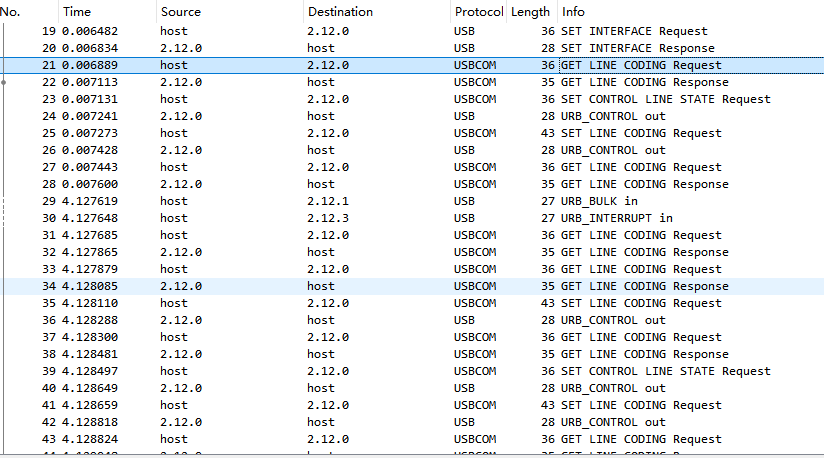

# 42.0 USB

## 42.0.1 USB2.0

### 42.0.1.0 枚举与配置

- 设备被连接到 USB 端口上，并得到检测。
- 集线器通过监控端口的电压来检测设备。集线器的 D+线和 D-线上带有下拉电阻，根据设备的速度，D+或 D-线上会带有上拉电阻。通过监控这些线上的电压变换，集线器检测设备是否得到连接。
- 这部分具体IAD描述符的参考<<iadclasscode_r10.pdf>> 2节 IAD Use Model Example 


- 具体枚举配置过程,wireshark抓包不够准确,可以通过打印日志查看
- 方向分为设备到主机和主机到设备;意思是收到请求后执行的方向

1. 请求类型:Standard Device Request 方向:设备到主机 请求:GET_DESCRIPTOR 
    - wValue 
        - 描述符类型 :1 (设备描述符) 
        - 描述符索引: 0 (第一个描述符)
    - wIndex字段为字符串描述符指定语言ID

```log
[80 06 00 01 00 00 12 00]
[23:29:12 571]Setup: bmRequestType 0x80, bRequest 0x06, wValue 0x0100, wIndex 0x0000, wLength 0x0040
```

2. 回复设备描述符18字节,返回的是IAD描述符
    - bLength: 0x12 
    - bDescriptorType: 0x01 (设备描述符)
    - bcdUSB: 0x0200 (USB2.0)
    - bDeviceClass: 0xef (Miscellaneous Device Class)
    - bDeviceSubClass: 0x02 (Common Class Subclass)
    - bDeviceProtocol: 0x01 (Interface Association Descriptor)
    - bMaxPacketSize0: 0x40 (64 bytes)
    - idVendor: 0xffff (供应商 ID)
    - idProduct: 0xffff (产品 ID)
    - bcdDevice 0x0100 (设备版本号)
    - iManufacturer: 0x01 (制造商字符串描述符索引)
    - iProduct: 0x02 (产品字符串描述符索引)
    - iSerialNumber: 0x03 (序列号字符串描述符索引)
    - bNumConfigurations: 0x01 (配置数量)
```log
[12 01 00 02 ef 02 01 40 ff ff ff ff 00 01 01 02 03 01]
[23:29:12 573]EP0 send 18 bytes, 0 remained
```

3. 请求类型:Standard Device Request 方向:主机到设备 请求:SET_ADDRESS
    - wValue: 0x001d (地址为29)

```log
[23:29:12 631]Setup: bmRequestType 0x00, bRequest 0x05, wValue 0x001d, wIndex 0x0000, wLength 0x0000
[23:29:12 635]EP0 send 0 bytes, 0 remained
```

4. 请求类型:Standard Device Request 方向:设备到主机 请求:GET_DESCRIPTOR
    - wValue 
        - 描述符类型 :1 (设备描述符) 
        - 描述符索引: 0 (第一个描述符)
    - wIndex字段为字符串描述符指定语言ID

```log
[23:29:12 650]Setup: bmRequestType 0x80, bRequest 0x06, wValue 0x0100, wIndex 0x0000, wLength 0x0012
[23:29:12 653]EP0 send 18 bytes, 0 remained
```

5. 请求类型:Standard Device Request 方向:设备到主机 请求:GET_DESCRIPTOR
    - wValue 
        - 描述符类型 :2 (配置描述符)
        - 描述符索引: 0 (第一个描述符)
    - wIndex字段为字符串描述符指定语言ID
    - wLength: 0x004b (75 bytes)

```log
[80 06 00 02 00 00 4b 00]
[23:29:12 670]Setup: bmRequestType 0x80, bRequest 0x06, wValue 0x0200, wIndex 0x0000, wLength 0x004b
```

6. 回复描述符75字节
    1. 配置描述符
    - bLength: 0x09
    - bDescriptorType: 0x02 (配置描述符)
    - wTotalLength: 0x004b (配置描述符及其子描述符的总长度)
    - bNumInterfaces: 0x01 (接口数量)
    - bConfigurationValue: 0x01 (配置值)
    - bmAttributes: 0x80 (配置属性)
        - Bit 6: Self-powered 0:总线供电
        - Bit 5: Remote Wakeup 0:不支持远程唤醒
    - bMaxPower: 0x32 (最大功率 单位2mA) 100mA
    2. 接口描述符
    - bLength: 0x08
    - bDescriptorType: 0x0b (接口描述符)
    - bInterfaceNumber: 0x00 (接口号)
    - bInterfaceCount: 0x02 (接口数量)
    - bFunctionClass: 0x02 (Communication Device Class)
    - bFunctionSubClass: 0x02 (Abstract Control Model)
    - bFunctionProtocol: 0x01 (ITU-T V.250)
    - iFunction: 0x00 (接口描述符索引)
    3. 接口描述符
    - bLength: 0x09
    - bDescriptorType: 0x04 (接口描述符)
    - bInterfaceNumber: 0x00 (接口号)
    - bAlternateSetting: 0x00 (备用设置)
    - bNumEndpoints: 0x01 (端点数量)
    - bInterfaceClass: 0x02 (Communication Device Class)
    - bInterfaceSubClass: 0x02 (Abstract Control Model)
    - bInterfaceProtocol: 0x01 (ITU-T V.250)
    - iInterface: 0x02 (接口描述符索引)
    4. COMMUNICATION DESCRIPTOR
    - bLength: 0x05
    - bDescriptorType: 0x24 (CS_INTERFACE)
    - bDescriptorSubtype: 0x00 (Header Functional Descriptor)
    - bcdCDC: 0x0110 (CDC version 1.10)
    5. COMMUNICATION DESCRIPTOR
    - bLength: 0x05
    - bDescriptorType: 0x24 (CS_INTERFACE)
    - bDescriptorSubtype: 0x01 (Call Management Functional Descriptor)
    - bmCapabilities: 0x00
        - Call Management over Data Class Interface: Not supported
        - Call Management over Communication Class Interface: Not supported
    - bDataInterface: 0x01 (Data Class Interface)
    6. COMMUNICATION DESCRIPTOR
    - bLength: 0x04
    - bDescriptorType: 0x24 (CS_INTERFACE)
    - bDescriptorSubtype: 0x02 (Abstract Control Management Functional Descriptor)
    - bmCapabilities: 0x02
        - Comm Features Combinations: Not supported
        - Line Coding and Serial State: Supported
        - Send Break: Not supported
        - Network Connection: Not supported
    7. COMMUNICATION DESCRIPTOR
    - bLength: 0x05
    - bDescriptorType: 0x24 (CS_INTERFACE)
    - bDescriptorSubtype: 0x06 (Union Functional Descriptor)
    - bControlInterface: 0x00 (Control Class Interface)
    - bSubordinateInterface0: 0x01 (Data Class Interface)
    8. ENDPOINT DESCRIPTOR
    - bLength: 0x07
    - bDescriptorType: 0x05 (ENDPOINT)
    - bEndpointAddress: 0x83 (Endpoint 3 IN)
        - Direction: IN
        - Number: 3
    - bmAttributes: 0x03 (Transfer type: Interrupt)
        - Transactions per microframe: 1 (0)
    - wMaxPacketSize: 0x0008 (8 bytes)
    - bInterval: 0x00 (Polling interval in (micro) frames)
    9. INTERFACE DESCRIPTOR
    - bLength: 0x09
    - bDescriptorType: 0x04 (INTERFACE)
    - bInterfaceNumber: 0x01 (Interface 1)
    - bAlternateSetting: 0x00 (Alternate setting 0)
    - bNumEndpoints: 0x02 (2 endpoints)
    - bInterfaceClass: 0x0a (Data Interface Class)
    - bInterfaceSubClass: 0x00 (No specific subclass)
    - bInterfaceProtocol: 0x00 (No specific protocol)
    - iInterface: 0x00 (No string descriptor)
    10. ENDPOINT DESCRIPTOR
    - bLength: 0x07
    - bDescriptorType: 0x05 (ENDPOINT)
    - bEndpointAddress: 0x02 (Endpoint 2 OUT)
        - Direction: OUT
        - Number: 2
    - bmAttributes: 0x02 (Transfer type: Bulk)
        - Transactions per microframe: 1 (0)
    - wMaxPacketSize: 0x0040 (64 bytes)
    - bInterval: 0x00 (Polling interval in (micro) frames)
    11. ENDPOINT DESCRIPTOR
    - bLength: 0x07
    - bDescriptorType: 0x05 (ENDPOINT)
    - bEndpointAddress: 0x81 (Endpoint 1 IN)
        - Direction: IN
        - Number: 1
    - bmAttributes: 0x02 (Transfer type: Bulk)
        - Transactions per microframe: 1 (0)
    - wMaxPacketSize: 0x0040 (64 bytes)
```log
[09 02 4b 00 02 01 00 80 32]
[08 0b 00 02 02 02 01 00]
[09 04 00 00 01 02 02 01 02]
[05 24 00 10 01]
[05 24 01 00 01]
[04 24 02 02]
[05 24 06 00 01]
[07 05 83 03 08 00 0a]
[09 04 01 00 02 0a 00 00 00]
[07 05 02 02 40 00 00]
[07 05 81 02 40 00 00]
[23:29:12 673]EP0 send 64 bytes, 11 remained
[23:29:12 673]EP0 send 11 bytes, 0 remained
```

7. 请求类型:Standard Device Request 方向:设备到主机 请求:GET_DESCRIPTOR
    - wValue 
        - 描述符类型 :3 (字符串描述符) 
        - 描述符索引: 3 (第3个描述符)
    - wIndex字段为字符串描述符指定语言ID 0x0409 (英文)

```log
[80 06 02 03 09 04 26 00]
[23:29:12 685]Setup: bmRequestType 0x80, bRequest 0x06, wValue 0x0303, wIndex 0x0409, wLength 0x00ff
```

- 回复字符串描述符22字节
    - bLength: 0x16
    - bDescriptorType: 0x03 (字符串描述符)
    - bString: "2022123456"
```log
[16 03 32 00 32 00 32 00 31 00 32 00 33 00 34 00 35 00 36 00]
[23:29:12 685]EP0 send 22 bytes, 0 remained
```

8. 请求类型:Standard Device Request 方向:设备到主机 请求:GET_DESCRIPTOR
    - wValue 
        - 描述符类型 :3 (字符串描述符) 
        - 描述符索引: 0 (第0个描述符)
    - wIndex字段为字符串描述符指定语言ID 0x0000

```log
[23:29:12 695]Setup: bmRequestType 0x80, bRequest 0x06, wValue 0x0300, wIndex 0x0000, wLength 0x00ff
```

- 回复字符串描述符4字节
    - bLength: 0x04
    - bDescriptorType: 0x03 (字符串描述符)
    - bString: 0x0409 (英文)
```log
[04 03 09 04]
[23:29:12 697]EP0 send 4 bytes, 0 remained
```

9. 请求类型:Standard Device Request 方向:设备到主机 请求:GET_DESCRIPTOR
    - wValue 
        - 描述符类型 :3 (字符串描述符) 
        - 描述符索引: 2 (第2个描述符)
    - wIndex字段为字符串描述符指定语言ID 0x0409 (英文)

```log
[23:29:12 706]Setup: bmRequestType 0x80, bRequest 0x06, wValue 0x0302, wIndex 0x0409, wLength 0x00ff
```

- 回复字符串描述符38字节
    - bLength: 0x26
    - bDescriptorType: 0x03 (字符串描述符)
    - bString: "CherryUSB CDC DEMO"
```log
[26 03 43 00 68 00 65 00 72 00 72 00 79 00 55 00 53 00 42 00 20 00 43 00 44 00 43 00 20 00 44 00 45 00 4d 00 4f 00]
[23:29:12 706]EP0 send 38 bytes, 0 remained
```

10. 请求类型:Standard Device Request 方向:设备到主机 请求:GET_DESCRIPTOR
    - wValue 
        - 描述符类型 :06 (设备限定描述符)
        - 描述符索引: 0 (第0个描述符)
- 没有该描述符,回复STALL

```log
[23:29:12 719]Setup: bmRequestType 0x80, bRequest 0x06, wValue 0x0600, wIndex 0x0000, wLength 0x000a
```

11. 请求类型:Standard Device Request 方向:设备到主机 请求:SET_CONFIGURATION
    - wValue: 0x0001 (配置为1)

- 配置对应端点,回复配置状态
    1. 配置0x03端点方向为OUT,类型为中断,最大包大小为8
    2. 配置0x02端点方向为OUT,类型为批量,最大包大小为64
    3. 配置0x01端点方向为IN,类型为批量,最大包大小为64

```log
[23:29:12 773]Setup: bmRequestType 0x00, bRequest 0x09, wValue 0x0001, wIndex 0x0000, wLength 0x0000
[23:29:12 782]Open ep:0x83 type:3 mps:8
[23:29:12 782]Open ep:0x02 type:2 mps:64
[23:29:12 790]Open ep:0x81 type:2 mps:64
[23:29:12 790]EP0 send 0 bytes, 0 remained
```

12. 请求类型: Class Interface Request 方向:设备到主机 请求:GET_LINE_CODING
    - wValue: 0x0000
    - wIndex: 0x0000
    - wLength: 0x0007
    - bRequest 0x21

- 回复波特率:2000000,停止位:1,校验位:0,数据位:8

```log
[a1 21 00 00 00 00 07 00]
[23:29:12 845]Setup: bmRequestType 0xa1, bRequest 0x21, wValue 0x0000, wIndex 0x0000, wLength 0x0007
[23:29:12 849]CDC Class request: bRequest 0x21
[23:29:12 852]Get intf:0 linecoding 2000000 0 0 8
[80 84 1e 00 00 00 08]
[23:29:12 855]EP0 send 7 bytes, 0 remained
```

13.  请求类型: Class Interface Request 方向:设备到主机 请求:SET_CONTROL_LINE_STATE
    - wValue: 0x0000
    - wIndex: 0x0000
    - wLength: 0x0007
    - bRequest 0x20

- 设置DTR和RTS

```log
[21 22 00 00 00 00 00 00]
[23:29:12 877]Setup: bmRequestType 0x21, bRequest 0x22, wValue 0x0000, wIndex 0x0000, wLength 0x0000
[23:29:12 880]CDC Class request: bRequest 0x22
[23:29:12 885]Set intf:0 DTR 0x0,RTS 0x0
[23:29:12 887]EP0 send 0 bytes, 0 remained
```

14. 请求类型: Class Interface Request 方向:主机到设备 请求:SET_LINE_CODING
    - wValue: 0x0000
    - wIndex: 0x0000
    - wLength: 0x0007
    - bRequest 0x20

- 执行接收,配置波特率:2000000,停止位:1,校验位:0,数据位:8

```log
[23:29:12 897]Setup: bmRequestType 0x21, bRequest 0x20, wValue 0x0000, wIndex 0x0000, wLength 0x0007
[23:29:12 901]Start reading 7 bytes from ep0
[80 84 1e 00 00 00 08]
[23:29:12 903]EP0 recv 7 bytes, 0 remained
[23:29:12 912]CDC Class request: bRequest 0x20
[23:29:12 912]Set intf:0 linecoding <2000000 8 N 1>
[23:29:12 914]EP0 send 0 bytes, 0 remained
```

15. 请求类型: Class Interface Request 方向:主机到设备 请求:SET_CONTROL_LINE_STATE
    - wValue: 0x0002
    - wIndex: 0x0000
    - wLength: 0x0000
    - bRequest 0x22

- 设置DTR和RTS(串口助手开启关闭串口发送此命令,MCU可通过该命令实现同步开启输出或关闭)
    - DTR:0
    - RTS:1

```log
[23:29:18 841] [I/USB] Setup: bmRequestType 0x21, bRequest 0x22, wValue 0x0002, wIndex 0x0000, wLength 0x0000
[23:29:18 846] [D/USB] CDC Class request: bRequest 0x22
[23:29:18 849] [D/USB] Set intf:0 DTR 0x0,RTS 0x1
[23:29:18 853] [D/USB] EP0 send 0 bytes, 0 remained
```

### 42.0.1.1 Endpoint

```c
/** Standard Endpoint Descriptor */
struct usb_endpoint_descriptor {
    uint8_t bLength;          /* Descriptor size in bytes = 7 */
    uint8_t bDescriptorType;  /* ENDPOINT descriptor type = 5 */
    uint8_t bEndpointAddress; /* Endpoint # 0 - 15 | IN/OUT */
    uint8_t bmAttributes;     /* Transfer type */
    uint16_t wMaxPacketSize;  /* Bits 10:0 = max. packet size */
    uint8_t bInterval;        /* Polling interval in (micro) frames */
} __PACKED;
```

- bLength: 描述符长度 7 字节
- bDescriptorType: 描述符类型 5(端点描述符)
- bEndpointAddress: 8位,低7位为端点号,最高位为方向,0表示OUT,1表示IN
- bmAttributes: 属性

位1 . .0:传输类型:00 =控制;01 =同步;10 =批量;11 =中断
如果不是等时端点，第5位…2为预留值，必须设置为0。如果是等时的，则定义如下:
位3 . .2:同步类型:00 =不同步;01 =异步;10 =自适应;11 =同步
Bits 5..4:使用类型:00 =数据端点;01 =反馈端点;10 =隐式反馈数据端点;11 =保留
所有其他的位被保留，必须重置为零。保留位必须被主机忽略。

- wMaxPacketSize: 最大包大小
对于所有端点，第10位…0指定最大数据包大小(以字节为单位)。

- bInterval: 传输间隔
数据传输轮询端点的时间间隔。
对于全速/低速中断端点，该字段的取值范围是1 ~ 255。

### 42.0.1.2 Device Requests
- 所有USB设备在设备的默认控制管道上响应来自主机的请求。这些请求是使用控制传输发出的。请求和请求的参数在安装包中发送到设备。主机负责建立表9-2所示字段中传递的值。每个安装包有8个字节

| 偏移 | 字段          | 大小 | 值              | 说明                                                         |
| ---- | ------------- | ---- | --------------- | ------------------------------------------------------------ |
| 0    | bmRequestType | 1    | Bitmap          | D7:数据传输方向<br/>      0 =主机到设备1 =设备到主机<br/>D6……5:类型<br/>      0 =标准<br/>      1 =类别<br/>      2 =供应商<br/>      3 =保留<br/>D4……0:接收方<br/>0 =设备<br/>1 =接口<br/>2 =终端<br/>3 =其他<br/>4…31 =保留 |
| 1    | bRequest      | 1    | Value           | 具体要求(参见表9-3)                                          |
| 2    | wValue        | 2    | Value           |                                                              |
| 4    | wIndex        | 2    | Index or Offset |                                                              |
| 6    | wLength       | 2    | Count           | 如果有数据阶段，要传输的字节数                               |

- 标准设备请求


### 42.0.1.3 描述符

#### 42.0.1.3.1 标准设备描述符

- 参考<<USB2.0.pdf>> 9.6.1节

```c
/** Standard Device Descriptor 
 * @bcdUSB: USB 版本号
 * @bDeviceClass: 设备类代码
 * @bDeviceSubClass: 设备子类代码
 * @bDeviceProtocol: 设备协议代码
 * @bMaxPacketSize0: 最大包大小 8/16/32/64 bytes 0x40 = 64
 * @idVendor: 供应商 ID
 * @idProduct: 产品 ID
 * @bcdDevice: 设备版本号
 * @bNumConfigurations: 配置数量
*/
#define USB_DEVICE_DESCRIPTOR_INIT(bcdUSB, bDeviceClass, bDeviceSubClass, bDeviceProtocol, idVendor, idProduct, bcdDevice, bNumConfigurations) \
    0x12,                       /* bLength */                                                                                              \
    USB_DESCRIPTOR_TYPE_DEVICE, /* bDescriptorType */                                                                                      \
    WBVAL(bcdUSB),              /* bcdUSB */                                                                                               \
    bDeviceClass,               /* bDeviceClass */                                                                                         \
    bDeviceSubClass,            /* bDeviceSubClass */                                                                                      \
    bDeviceProtocol,            /* bDeviceProtocol */                                                                                      \
    0x40,                       /* bMaxPacketSize */                                                                                       \
    WBVAL(idVendor),            /* idVendor */                                                                                             \
    WBVAL(idProduct),           /* idProduct */                                                                                            \
    WBVAL(bcdDevice),           /* bcdDevice */                                                                                            \
    USB_STRING_MFC_INDEX,       /* iManufacturer */                                                                                        \
    USB_STRING_PRODUCT_INDEX,   /* iProduct */                                                                                             \
    USB_STRING_SERIAL_INDEX,    /* iSerial */                                                                                              \
    bNumConfigurations          /* bNumConfigurations */
```


#### 42.0.1.3.2 标准配置描述符

- `bConfigurationValue` 字段指示设备固件中定义的配置编号。客户端驱动程序使用该数字值来选择活动配置。

```c
/*
    * @wTotalLength: 配置描述符及其子描述符的总长度
    * @bNumInterfaces: 接口数量
    * @bConfigurationValue: 配置值
    * @bmAttributes: 配置属性
        * Bit 7: Reserved (set to one)
        * Bit 6: Self-powered 1:设备自供电 0:总线供电
        * Bit 5: Remote Wakeup 1:支持远程唤醒 0:不支持远程唤醒
        * Bits 4..0: Reserved (reset to zero)
    * @bMaxPower: 最大功率 单位2mA
*/
#define USB_CONFIG_DESCRIPTOR_INIT(wTotalLength, bNumInterfaces, bConfigurationValue, bmAttributes, bMaxPower) \
    0x09,                              /* bLength */                                                       \
    USB_DESCRIPTOR_TYPE_CONFIGURATION, /* bDescriptorType */                                               \
    WBVAL(wTotalLength),               /* wTotalLength */                                                  \
    bNumInterfaces,                    /* bNumInterfaces */                                                \
    bConfigurationValue,               /* bConfigurationValue */                                           \
    0x00,                              /* iConfiguration */                                                \
    bmAttributes,                      /* bmAttributes */                                                  \
    USB_CONFIG_P
```

#### 42.0.1.3.3 IAD描述符

```c
/*
    * @bFirstInterface: 第一个接口号
    * @bInterfaceCount: 接口数量
    * @bFunctionClass: 设备类代码
    * @bFunctionSubClass: 设备子类代码
    * @bFunctionProtocol: 设备协议代码
*/
#define USB_IAD_INIT(bFirstInterface, bInterfaceCount, bFunctionClass, bFunctionSubClass, bFunctionProtocol) \
    0x08,                                      /* bLength */                                             \
    USB_DESCRIPTOR_TYPE_INTERFACE_ASSOCIATION, /* bDescriptorType */                                     \
    bFirstInterface,                           /* bFirstInterface */                                     \
    bInterfaceCount,                           /* bInterfaceCount */                                     \
    bFunctionClass,                            /* bFunctionClass */                                      \
    bFunctionSubClass,                         /* bFunctionSubClass */                                   \
    bFunctionProtocol,                         /* bFunctionProtocol */                                   \
    0x00                                       /* iFunction */
```

#### 42.0.1.3.4 标准接口描述符

```c
/*
* @bInterfaceNumber: 接口号 从0开始
* @bAlternateSetting: 备用设置 用于为先前字段中标识的接口选择此备用设置
* @bNumEndpoints: 端点数量 此接口使用的端点数(不包括端点0)。如果该值为零，则该接口只使用默认控制管道。
* @bInterfaceClass: 设备类代码
* @bInterfaceSubClass: 设备子类代码
* @bInterfaceProtocol: 设备协议代码
* @iInterface: 接口描述符索引
*/
#define USB_INTERFACE_DESCRIPTOR_INIT(bInterfaceNumber, bAlternateSetting, bNumEndpoints,                  \
                                      bInterfaceClass, bInterfaceSubClass, bInterfaceProtocol, iInterface) \
    0x09,                          /* bLength */                                                       \
    USB_DESCRIPTOR_TYPE_INTERFACE, /* bDescriptorType */                                               \
    bInterfaceNumber,              /* bInterfaceNumber */                                              \
    bAlternateSetting,             /* bAlternateSetting */                                             \
    bNumEndpoints,                 /* bNumEndpoints */                                                 \
    bInterfaceClass,               /* bInterfaceClass */                                               \
    bInterfaceSubClass,            /* bInterfaceSubClass */                                            \
    bInterfaceProtocol,            /* bInterfaceProtocol */                                            \
    iInterface                     /* iInterface */
```

#### 42.0.1.3.5 标准端点描述符

```c
#define USB_ENDPOINT_DESCRIPTOR_INIT(bEndpointAddress, bmAttributes, wMaxPacketSize, bInterval) \
    0x07,                         /* bLength */                                             \
    USB_DESCRIPTOR_TYPE_ENDPOINT, /* bDescriptorType */                                     \
    bEndpointAddress,             /* bEndpointAddress */                                    \
    bmAttributes,                 /* bmAttributes */                                        \
    WBVAL(wMaxPacketSize),        /* wMaxPacketSize */                                      \
    bInterval                     /* bInterval */
```

#### 42.0.1.3.6 字符串描述符

- 字符串描述符是可选的。如前所述，如果设备不支持字符串描述符，则必须将设备、配置和接口描述符中对字符串描述符的所有引用重置为零。
- 字符串描述符使用由统一码标准定义的统一码编码,所有语言的字符串索引为零返回一个字符串描述符，该描述符包含设备支持的双字节LANGID代码数组。USB设备可以省略所有的字符串描述符。省略所有字符串描述符的USB设备必须不返回LANGID代码数组。

```c
#define USB_LANGID_INIT(id)                           \
    0x04,                           /* bLength */     \
    USB_DESCRIPTOR_TYPE_STRING, /* bDescriptorType */ \
    WBVAL(id)                   /* wLangID0 */
```

# 42.1 cherryUSB

## 42.1.1 杂项

- USB_MEM_ALIGNX: 用于指定内存对齐方式,用`CONFIG_USB_ALIGN_SIZE`配置,默认4字节对齐
```c
#define USB_MEM_ALIGNX __attribute__((aligned(CONFIG_USB_ALIGN_SIZE)))
```

- USB_NOCACHE_RAM_SECTION: 用于指定数据存储在无缓存RAM中,用于DMA传输
```c
/* attribute data into no cache ram */
#define USB_NOCACHE_RAM_SECTION __attribute__((section(".noncacheable")))
```

- `CONFIG_USBDEV_ADVANCE_DESC`: `usbd_desc_register`当前 API 仅支持一种速度，如果需要更高级的速度切换功能，请开启 CONFIG_USBDEV_ADVANCE_DESC，并且包含了下面所有描述符注册功能

# 42.2 dwc2

## 42.2.1 usb_dc_init

- 初始化 usb device controller 寄存器，设置 usb 引脚、时钟、中断等等
1. 软断开
- 供电状态可借助软断开功能通过软件退出。将设备控制寄存器中的软断开位（OTG_DCTL中的 SDIS 位）置 1 即可移除 DP 上拉电阻，此时尽管没有从主机端口实际拔出 USB 电缆， 但主机端仍会发生设备断开检测中断.
2. 关闭全局中断
3. B会话有效覆盖使能
- 由 OTG_HS 模块控制的 DP/DM 集成上拉电阻和下拉电阻，具体使能哪种电阻取决于设备的当前角色。作为外设使用时，只要检测到 VBUS 为有效电平（B 会话有效），立即使能 DP 上拉电阻，以告知全速设备的连接。
- VBUS 输入检测到 B 会话有效电压，就会使 USB 设备进入供电状态（请参见 USB2.0 第 9.1 部分）。
- 如果检测到 VBUS 降至 B 会话有效电压以下（例如，因电源干扰或主机端口关闭引发），OTG_HS 将自动断 开连接并生成检测到会话结束中断（OTG_GOTGINT 中的 SEDET 位），指示 OTG_HS 已 退出供电状态。
4. 全速串行收发器选择
0：USB 2.0 外部 ULPI 高速 PHY。
1：USB 1.1 全速串行收发器。
5. 复位
6. 强制设备模式
- 向该位写入 1 时，可将模块强制为设备模式，而无需考虑 OTG_ID 输入引脚。
- 0：正常模式1：强制设备模式
- 将强制位置 1 后，应用程序必须等待至少 25 ms 后更改方可生效。
7. 重启 PHY 时钟
8. 设备速度配置
- 指示应用程序要求模块进行枚举所采用的速度，或应用程序支持的最大速度。但是，实际总线速度只有在完成 chirp 序列后才能确定，同时此速度基于与模块连接的 USB 主机的速度。
- 00：高速01：使用 HS 进行全速通信;10：保留;11：使用内置 FS PHY 进行全速通信
9. 清除中断标志
10. 配置fifo
- 0X10刷新所有发送FIFO
- 通常建议在重新配置 FIFO 时进行刷新。还建议在设备端点禁止期间进行 FIFO 刷新。应用程序必须等待模块将此位清零，才能执行任意操作。该位需要八个时钟来清零（使用较慢的phy_clk 或 hclk 时钟）。
- 应用程序可使用此位刷新整个 Rx FIFO，但必须首先确保模块当前未在处理事务。只有在确认模块当前未对 Rx FIFO 执行读写操作后，应用程序方可对此位执行写操作。应用程序必须等到此位清零后，方可执行其它操作。通常需要等待 8 个时钟周期（以 PHY 或 
AHB 时钟中最慢的为准）。

11. 使能中断,关闭软断开

```c
int usb_dc_init(uint8_t busid)
{
    memset(&g_dwc2_udc, 0, sizeof(struct dwc2_udc));

    usb_dc_low_level_init();    // 初始化 usb 设备控制器

    USB_OTG_DEV->DCTL |= USB_OTG_DCTL_SDIS;         //软件断开USB连接
    USB_OTG_GLB->GAHBCFG &= ~USB_OTG_GAHBCFG_GINT;  //关闭全局中断
    // STM32 cfg usb
    /* B-peripheral session valid override enable */
    USB_OTG_GLB->GOTGCTL |= USB_OTG_GOTGCTL_BVALOEN;    // 使能VBUS检查
    USB_OTG_GLB->GOTGCTL |= USB_OTG_GOTGCTL_BVALOVAL;
    /* Select FS Embedded PHY */
    USB_OTG_GLB->GUSBCFG |= USB_OTG_GUSBCFG_PHYSEL;     // 选择USB2.0全速PHY
    /* Reset after a PHY select */
    ret = dwc2_reset();
    /* Force Device Mode*/
    dwc2_set_mode(USB_OTG_MODE_DEVICE);
    /* Restart the Phy Clock */
    USB_OTG_PCGCCTL = 0U;
    /* Device speed configuration */
    USB_OTG_DEV->DCFG |= USB_OTG_SPEED_HIGH_IN_FULL;

    //......

    ret = dwc2_flush_txfifo(0x10U); //刷新所有发送FIFO
    ret = dwc2_flush_rxfifo();

    USB_OTG_GLB->GAHBCFG |= USB_OTG_GAHBCFG_GINT;
    USB_OTG_DEV->DCTL &= ~USB_OTG_DCTL_SDIS;
}
```

## 42.2.2 usb_dc_low_level_init

- stm32: cubemx 生成的代码copy msp_init既可
1. 初始化USB时钟
2. 初始化USB引脚
3. 初始化USB中断

## 42.2.3 USBD_IRQHandler

- 要将 rc_w1 类型中断状态位清零，应用程序必须向该位写入 1。

### 42.2.3.1 USB复位 USB_OTG_GINTSTS_USBRST

1. 清除USB复位中断标志
2. 刷新所有FIFO
3. 使能0端点,发送NACK;禁用非0端点,发送NACK
4. 解除0端点中断屏蔽


```c
    USB_OTG_GLB->GINTSTS |= USB_OTG_GINTSTS_USBRST; //清除USB复位中断标志
    USB_OTG_DEV->DCTL &= ~USB_OTG_DCTL_RWUSIG;      //清除远程唤醒信号
    //刷新所有FIFO
    dwc2_flush_txfifo(0x10U);
    dwc2_flush_rxfifo();

    for (uint8_t i = 0U; i < CONFIG_USBDEV_EP_NUM; i++) {
        if (i == 0U) {  //使能0端点,发送ACK
            USB_OTG_INEP(i)->DIEPCTL = USB_OTG_DIEPCTL_SNAK;
            USB_OTG_OUTEP(i)->DOEPCTL = USB_OTG_DOEPCTL_SNAK;
        } else {    //禁用非0端点,发送NACK
            if (USB_OTG_INEP(i)->DIEPCTL & USB_OTG_DIEPCTL_EPENA) {
                USB_OTG_INEP(i)->DIEPCTL = (USB_OTG_DIEPCTL_EPDIS | USB_OTG_DIEPCTL_SNAK);
            } else {
                USB_OTG_INEP(i)->DIEPCTL = 0;
            }
            if (USB_OTG_OUTEP(i)->DOEPCTL & USB_OTG_DOEPCTL_EPENA) {
                USB_OTG_OUTEP(i)->DOEPCTL = (USB_OTG_DOEPCTL_EPDIS | USB_OTG_DOEPCTL_SNAK);
            } else {
                USB_OTG_OUTEP(i)->DOEPCTL = 0;
            }
        }
        USB_OTG_INEP(i)->DIEPTSIZ = 0U;         //清除发送端点传输大小
        USB_OTG_INEP(i)->DIEPINT = 0xFBFFU;     //清除发送端点中断标志
        USB_OTG_OUTEP(i)->DOEPTSIZ = 0U;        //清除接收端点传输大小
        USB_OTG_OUTEP(i)->DOEPINT = 0xFBFFU;    //清除接收端点中断标志
    }

    USB_OTG_DEV->DAINTMSK |= 0x10001U;          //解除0端点中断屏蔽

    USB_OTG_DEV->DOEPMSK = USB_OTG_DOEPMSK_STUPM |  //OUT端点使能SETUP阶段完成中断
                            USB_OTG_DOEPMSK_XFRCM;  //OUT端点使能传输完成中断

    USB_OTG_DEV->DIEPMSK = USB_OTG_DIEPMSK_XFRCM;   //IN端点使能传输完成中断

    memset(&g_dwc2_udc, 0, sizeof(struct dwc2_udc));
    usbd_event_reset_handler(0);        //USB复位事件处理
    /* Start reading setup */
    dwc2_ep0_start_read_setup((uint8_t *)&g_dwc2_udc.setup);
```

### 42.2.3.2 USB OUT端点中断 USB_OTG_GINTSTS_OEPINT

1. 接收到OUT0端点中断
- xfer_len = 0,没接收到,再次接收;`dwc2_ep0_start_read_setup`
- `usbd_event_ep_out_complete_handler`

2. 接收其他OUT端点中断
- 执行`usbd_event_ep_out_complete_handler`处理接收完成事件

3. 接收到setup完成中断 `USB_OTG_DOEPINT_STUP`
- `usbd_event_ep0_setup_complete_handler`
- STUP：SETUP 阶段完成 (SETUP phase done):仅适用于控制 OUT 端点。指示控制端点的 SETUP 阶段已完成，当前控制传输中不再接收到连续的 SETUP 数据包。在此中断上，应用程序可以对接收到的 SETUP 数据包进行解码。

4. setup流程
- 初始化完成触发RESET中断执行`dwc2_ep0_start_read_setup`
- DMA接收或`USB_OTG_GINTSTS_RXFLVL`中断触发接收完成,执行`dwc2_ep_read((uint8_t *)&g_dwc2_udc.setup, read_count);`完成SETUP包接收
- 主机发送SETUP包,触发SETUP中断,执行`usbd_event_ep0_setup_complete_handler`
- 接收完成触发XFRC中断,执行`usbd_event_ep_out_complete_handler`

```c
    ep_idx = 0;
    ep_intr = dwc2_get_outeps_intstatus();
    while (ep_intr != 0U) {
        if ((ep_intr & 0x1U) != 0U) {                       //获取是哪个端点产生的中断
            epint = dwc2_get_outep_intstatus(ep_idx);       //获取端点中断状态
            uint32_t DoepintReg = USB_OTG_OUTEP(ep_idx)->DOEPINT;
            USB_OTG_OUTEP(ep_idx)->DOEPINT = DoepintReg;    //清除中断标志

            if ((epint & USB_OTG_DOEPINT_XFRC) == USB_OTG_DOEPINT_XFRC) {
                if (ep_idx == 0) {
                    if (g_dwc2_udc.out_ep[ep_idx].xfer_len == 0) {
                        /* Out status, start reading setup */
                        dwc2_ep0_start_read_setup((uint8_t *)&g_dwc2_udc.setup);
                    } else {
                        g_dwc2_udc.out_ep[ep_idx].actual_xfer_len = g_dwc2_udc.out_ep[ep_idx].xfer_len - ((USB_OTG_OUTEP(ep_idx)->DOEPTSIZ) & USB_OTG_DOEPTSIZ_XFRSIZ);
                        g_dwc2_udc.out_ep[ep_idx].xfer_len = 0;
                        usbd_event_ep_out_complete_handler(0, 0x00, g_dwc2_udc.out_ep[ep_idx].actual_xfer_len);  //执行usbd_event_ep0_out_complete_handler
                    }
                } else {
                    g_dwc2_udc.out_ep[ep_idx].actual_xfer_len = g_dwc2_udc.out_ep[ep_idx].xfer_len - ((USB_OTG_OUTEP(ep_idx)->DOEPTSIZ) & USB_OTG_DOEPTSIZ_XFRSIZ);
                    g_dwc2_udc.out_ep[ep_idx].xfer_len = 0;
                    usbd_event_ep_out_complete_handler(0, ep_idx, g_dwc2_udc.out_ep[ep_idx].actual_xfer_len);
                }
            }

            if ((epint & USB_OTG_DOEPINT_STUP) == USB_OTG_DOEPINT_STUP) {
                usbd_event_ep0_setup_complete_handler(0, (uint8_t *)&g_dwc2_udc.setup);
            }
        }
        ep_intr >>= 1U;
        ep_idx++;
    }
```

### 42.2.3.3 USB RxFIFO nonempty 中断 USB_OTG_GINTSTS_RXFLVL
1. 屏蔽接收中断
2. 是数据包,传入`xfer_buf`
3. 是SETUP包,传入`g_dwc2_udc.setup`
4. 解除接收中断屏蔽

```c
    USB_MASK_INTERRUPT(USB_OTG_GLB, USB_OTG_GINTSTS_RXFLVL);

    temp = USB_OTG_GLB->GRXSTSP;
    ep_idx = temp & USB_OTG_GRXSTSP_EPNUM;

    if (((temp & USB_OTG_GRXSTSP_PKTSTS) >> USB_OTG_GRXSTSP_PKTSTS_Pos) == STS_DATA_UPDT) {
        //读取数据包
        read_count = (temp & USB_OTG_GRXSTSP_BCNT) >> 4;
        if (read_count != 0) {
            dwc2_ep_read(g_dwc2_udc.out_ep[ep_idx].xfer_buf, read_count);
            g_dwc2_udc.out_ep[ep_idx].xfer_buf += read_count;
        }
    } else if (((temp & USB_OTG_GRXSTSP_PKTSTS) >> USB_OTG_GRXSTSP_PKTSTS_Pos) == STS_SETUP_UPDT) {
        //读取SETUP包
        read_count = (temp & USB_OTG_GRXSTSP_BCNT) >> 4;
        dwc2_ep_read((uint8_t *)&g_dwc2_udc.setup, read_count);
    } else {
        /* ... */
    }
    USB_UNMASK_INTERRUPT(USB_OTG_GLB, USB_OTG_GINTSTS_RXFLVL);
```

### 42.3.4 USB IN端点中断 USB_OTG_GINTSTS_IEPINT

1. USB_OTG_DIEPINT_TXFE 触发,执行`dwc2_tx_fifo_empty_procecss`
2. USB_OTG_DIEPINT_XFRC 触发,执行`usbd_event_ep_in_complete_handler`

```c
    while (ep_intr != 0U) {
        if ((ep_intr & 0x1U) != 0U) {
            epint = dwc2_get_inep_intstatus(ep_idx);
            uint32_t DiepintReg = USB_OTG_INEP(ep_idx)->DIEPINT;
            USB_OTG_INEP(ep_idx)->DIEPINT = DiepintReg;

            if ((epint & USB_OTG_DIEPINT_XFRC) == USB_OTG_DIEPINT_XFRC) {
                if (ep_idx == 0) {
                    g_dwc2_udc.in_ep[ep_idx].actual_xfer_len = g_dwc2_udc.in_ep[ep_idx].xfer_len - ((USB_OTG_INEP(ep_idx)->DIEPTSIZ) & USB_OTG_DIEPTSIZ_XFRSIZ);
                    g_dwc2_udc.in_ep[ep_idx].xfer_len = 0;
                    usbd_event_ep_in_complete_handler(0, 0x80, g_dwc2_udc.in_ep[ep_idx].actual_xfer_len);   //执行usbd_event_ep0_in_complete_handler

                    if (g_dwc2_udc.setup.wLength && ((g_dwc2_udc.setup.bmRequestType & USB_REQUEST_DIR_MASK) == USB_REQUEST_DIR_OUT)) {
                        /* In status, start reading setup */
                        dwc2_ep0_start_read_setup((uint8_t *)&g_dwc2_udc.setup);
                    } else if (g_dwc2_udc.setup.wLength == 0) {
                        /* In status, start reading setup */
                        dwc2_ep0_start_read_setup((uint8_t *)&g_dwc2_udc.setup);
                    }
                } else {
                    g_dwc2_udc.in_ep[ep_idx].actual_xfer_len = g_dwc2_udc.in_ep[ep_idx].xfer_len - ((USB_OTG_INEP(ep_idx)->DIEPTSIZ) & USB_OTG_DIEPTSIZ_XFRSIZ);
                    g_dwc2_udc.in_ep[ep_idx].xfer_len = 0;
                    usbd_event_ep_in_complete_handler(0, ep_idx | 0x80, g_dwc2_udc.in_ep[ep_idx].actual_xfer_len);
                }
            }
            if ((epint & USB_OTG_DIEPINT_TXFE) == USB_OTG_DIEPINT_TXFE) {
                dwc2_tx_fifo_empty_procecss(ep_idx);
            }
        }
        ep_intr >>= 1U;
        ep_idx++;
```

## 42.2.4 usbd_ep_open

- USBAEP：USB 活动端点 (USB active endpoint)
指示此端点在当前配置和接口中是否激活。检测到 USB 复位后，模块会为所有端点（端点0 除外）将此位清零。接收到 SetConfiguration 和 SetInterface 命令后，应用程序必须相应地对端点寄存器进行编程并将此位置 1。
- SNPM：监听模式 (Snoop mode)
此位用于将端点配置为监听模式。在监听模式下，模块不会在将 OUT 数据包传输到应用存储区前检查其是否正确。

```c
int usbd_ep_open(uint8_t busid, const struct usb_endpoint_descriptor *ep)
{
    uint8_t ep_idx = USB_EP_GET_IDX(ep->bEndpointAddress);

    if (ep_idx > (CONFIG_USBDEV_EP_NUM - 1)) {
        USB_LOG_ERR("Ep addr %02x overflow\r\n", ep->bEndpointAddress);
        return -1;
    }

    if (USB_EP_DIR_IS_OUT(ep->bEndpointAddress)) {
        g_dwc2_udc.out_ep[ep_idx].ep_mps = USB_GET_MAXPACKETSIZE(ep->wMaxPacketSize);
        g_dwc2_udc.out_ep[ep_idx].ep_type = USB_GET_ENDPOINT_TYPE(ep->bmAttributes);

        USB_OTG_DEV->DAINTMSK |= USB_OTG_DAINTMSK_OEPM & (uint32_t)(1UL << (16 + ep_idx));  //解除端点中断屏蔽

        if ((USB_OTG_OUTEP(ep_idx)->DOEPCTL & USB_OTG_DOEPCTL_USBAEP) == 0) {   //未激活此端点
            USB_OTG_OUTEP(ep_idx)->DOEPCTL |= (USB_GET_MAXPACKETSIZE(ep->wMaxPacketSize) & USB_OTG_DOEPCTL_MPSIZ) |
                                              ((uint32_t)USB_GET_ENDPOINT_TYPE(ep->bmAttributes) << 18) |
                                              USB_OTG_DIEPCTL_SD0PID_SEVNFRM |  //配置监听模式
                                              USB_OTG_DOEPCTL_USBAEP;   //激活此端点
        }
    } else {
        uint16_t fifo_size;
        if (ep_idx == 0) {
            fifo_size = (USB_OTG_GLB->DIEPTXF0_HNPTXFSIZ >> 16);
        } else {
            fifo_size = (USB_OTG_GLB->DIEPTXF[ep_idx - 1U] >> 16);
        }
        if ((fifo_size * 4) < USB_GET_MAXPACKETSIZE(ep->wMaxPacketSize)) {
            USB_LOG_ERR("Ep addr %02x fifo overflow\r\n", ep->bEndpointAddress);
            return -2;
        }

        g_dwc2_udc.in_ep[ep_idx].ep_mps = USB_GET_MAXPACKETSIZE(ep->wMaxPacketSize);
        g_dwc2_udc.in_ep[ep_idx].ep_type = USB_GET_ENDPOINT_TYPE(ep->bmAttributes);

        USB_OTG_DEV->DAINTMSK |= USB_OTG_DAINTMSK_IEPM & (uint32_t)(1UL << ep_idx);

        if ((USB_OTG_INEP(ep_idx)->DIEPCTL & USB_OTG_DIEPCTL_USBAEP) == 0) {
            USB_OTG_INEP(ep_idx)->DIEPCTL |= (USB_GET_MAXPACKETSIZE(ep->wMaxPacketSize) & USB_OTG_DIEPCTL_MPSIZ) |
                                             ((uint32_t)USB_GET_ENDPOINT_TYPE(ep->bmAttributes) << 18) | (ep_idx << 22) |
                                             USB_OTG_DIEPCTL_SD0PID_SEVNFRM |
                                             USB_OTG_DIEPCTL_USBAEP;
        }
        dwc2_flush_txfifo(ep_idx);
    }
    return 0;
}
```

## 42.2.5 dwc2_ep0_start_read_setup

```c
static void dwc2_ep0_start_read_setup(uint8_t *psetup)
{
    USB_OTG_OUTEP(0U)->DOEPTSIZ = 0U;
    USB_OTG_OUTEP(0U)->DOEPTSIZ |= (USB_OTG_DOEPTSIZ_PKTCNT & (1U << 19));  //包数量
    USB_OTG_OUTEP(0U)->DOEPTSIZ |= (3U * 8U);   //包大小
    USB_OTG_OUTEP(0U)->DOEPTSIZ |= USB_OTG_DOEPTSIZ_STUPCNT;    //SETUP包

#ifdef CONFIG_USB_DWC2_DMA_ENABLE
    USB_OTG_OUTEP(0U)->DOEPDMA = (uint32_t)psetup;
    /* EP enable */
    USB_OTG_OUTEP(0U)->DOEPCTL |= USB_OTG_DOEPCTL_EPENA | USB_OTG_DOEPCTL_USBAEP;
#endif
}
```

## 42.2.6 usbd_event_ep0_setup_complete_handler

1. 复制SETUP包
2. 判断缓存长度是否满足接收要求
3. 设置数据缓存
4. 通过安装的处理程序处理请求,具有数据阶段的请求,继续读取数据
5. 执行请求处理程序
6. 检查发送长度并设置
7. 复制数据到ep0_data_buf
8. 发送数据或状态到主机
9. 设置 zlp_flag 的目的是为了在这种情况下发送一个零长度包,让主机需要知道传输已经完成。

- 例外:情况
  1. `SET_CONFIGURATION`请求执行后,返回长度为0,则发送0长度包,将`req_data`设置为`ep0_data_buf`发送

- 例如
收到`80 06 00 01 00 00 12 00`,执行`usbd_get_descriptor`函数,发送设备描述符


```c
void usbd_event_ep0_setup_complete_handler(uint8_t busid, uint8_t *psetup)
{
    struct usb_setup_packet *setup = &g_usbd_core[busid].setup;
    uint8_t *buf;

    //复制SETUP包
    // 判断缓存长度是否满足接收要求

    g_usbd_core[busid].ep0_data_buf = g_usbd_core[busid].req_data;  //设置数据缓存
    g_usbd_core[busid].ep0_data_buf_residue = setup->wLength;
    g_usbd_core[busid].ep0_data_buf_len = setup->wLength;
    g_usbd_core[busid].zlp_flag = false;
    buf = g_usbd_core[busid].ep0_data_buf;  //设置数据缓存

    // 通过安装的处理程序处理请求,具有数据阶段的请求,继续读取数据
    if (setup->wLength && ((setup->bmRequestType & USB_REQUEST_DIR_MASK) == USB_REQUEST_DIR_OUT)) {
        USB_LOG_DBG("Start reading %d bytes from ep0\r\n", setup->wLength);
        usbd_ep_start_read(busid, USB_CONTROL_OUT_EP0, g_usbd_core[busid].ep0_data_buf, setup->wLength);
        return;
    }

    // 执行请求处理程序
    if (!usbd_setup_request_handler(busid, setup, &buf, &g_usbd_core[busid].ep0_data_buf_len)) {
        usbd_ep_set_stall(busid, USB_CONTROL_IN_EP0);   //请求处理失败,设置端点STALL
        return;
    }

    //检查发送长度并设置
    //如果buf数据与请求的数据不一致,复制数据到ep0_data_buf
    if (buf != g_usbd_core[busid].ep0_data_buf) {
        memcpy(g_usbd_core[busid].ep0_data_buf, buf, g_usbd_core[busid].ep0_data_buf_residue);
    }
    /* Send data or status to host */
    usbd_ep_start_write(busid, USB_CONTROL_IN_EP0, g_usbd_core[busid].ep0_data_buf, g_usbd_core[busid].ep0_data_buf_residue);
    // 设置 zlp_flag 的目的是为了在这种情况下发送一个零长度包,让主机需要知道传输已经完成。
    if ((setup->wLength > g_usbd_core[busid].ep0_data_buf_len) && (!(g_usbd_core[busid].ep0_data_buf_len % USB_CTRL_EP_MPS))) {
        g_usbd_core[busid].zlp_flag = true;
        USB_LOG_DBG("EP0 Set zlp\r\n");
    }
}
```

## 42.2.7 usbd_ep_start_read

1. 确保数据地址是4字节对齐
2. 数据长度为0
- 数据长度为0,设置数据包数量为1,传输大小为端点最大包大小,使能端点
3. 端点0
- 端点0,数据长度大于端点最大包大小,设置数据长度为端点最大包大小,数据长度小于端点最大包大小,设置数据长度为数据长度
4. 其他端点
- 允许多次传输,计算数据包数量,设置数据包数量,传输大小为数据长度

5. 中断中执行数据接收,或者DMA自动接收

```c
int usbd_ep_start_read(uint8_t busid, const uint8_t ep, uint8_t *data, uint32_t data_len)
{
    uint8_t ep_idx = USB_EP_GET_IDX(ep);
    uint32_t pktcnt = 0;

    if (((uint32_t)data) & 0x03) {  //确保数据地址是4字节对齐
        return -4;
    }

    if (data_len == 0) {    //数据长度为0
        USB_OTG_OUTEP(ep_idx)->DOEPTSIZ |= (USB_OTG_DOEPTSIZ_PKTCNT & (1 << 19));
        USB_OTG_OUTEP(ep_idx)->DOEPTSIZ |= (USB_OTG_DOEPTSIZ_XFRSIZ & g_dwc2_udc.out_ep[ep_idx].ep_mps);
        USB_OTG_OUTEP(ep_idx)->DOEPCTL |= (USB_OTG_DOEPCTL_CNAK | USB_OTG_DOEPCTL_EPENA);
        return 0;
    }

    if (ep_idx == 0) {  //端点0
        if (data_len > g_dwc2_udc.out_ep[ep_idx].ep_mps) {  //不允许多次传输
            data_len = g_dwc2_udc.out_ep[ep_idx].ep_mps;
        }
        g_dwc2_udc.out_ep[ep_idx].xfer_len = data_len;
        USB_OTG_OUTEP(ep_idx)->DOEPTSIZ |= (USB_OTG_DOEPTSIZ_PKTCNT & (1U << 19));
        USB_OTG_OUTEP(ep_idx)->DOEPTSIZ |= (USB_OTG_DOEPTSIZ_XFRSIZ & data_len);
    } else {    //其他端点 允许多次传输
        pktcnt = (uint16_t)((data_len + g_dwc2_udc.out_ep[ep_idx].ep_mps - 1U) / g_dwc2_udc.out_ep[ep_idx].ep_mps);

        USB_OTG_OUTEP(ep_idx)->DOEPTSIZ |= (USB_OTG_DOEPTSIZ_PKTCNT & (pktcnt << 19));
        USB_OTG_OUTEP(ep_idx)->DOEPTSIZ |= (USB_OTG_DOEPTSIZ_XFRSIZ & data_len);
    }
    // 使能接收
    return 0;
}
```

### 42.2.8 usbd_ep_set_stall

- 停止端点传输,设置端点STALL

## 42.2.8 usbd_ep_start_write

- 同read类似

- 数据为`USB_ENDPOINT_TYPE_ISOCHRONOUS`,执行额外操作
- 数据长度为0,设置数据包数量为1,传输大小为端点最大包大小,使能端点

## 42.2.9 dwc2_tx_fifo_empty_procecss

- 发送数据到端点FIFO

## 42.2.10 usbd_event_ep0_in_complete_handler

- `usbd_event_ep0_setup_complete_handler`会对`ep0_data_buf`进行处理,处理完成后,执行`usbd_ep_start_write`,进而在中断中执行`usbd_event_ep0_in_complete_handler`

```c
void usbd_event_ep0_in_complete_handler(uint8_t busid, uint8_t ep, uint32_t nbytes)
{
    struct usb_setup_packet *setup = &g_usbd_core[busid].setup;

    g_usbd_core[busid].ep0_data_buf += nbytes;
    g_usbd_core[busid].ep0_data_buf_residue -= nbytes;

    USB_LOG_DBG("EP0 send %d bytes, %d remained\r\n", nbytes, g_usbd_core[busid].ep0_data_buf_residue);

    if (g_usbd_core[busid].ep0_data_buf_residue != 0) {
        /* Start sending the remain data */
        usbd_ep_start_write(busid, USB_CONTROL_IN_EP0, g_usbd_core[busid].ep0_data_buf, g_usbd_core[busid].ep0_data_buf_residue);
    } else {
        if (g_usbd_core[busid].zlp_flag == true) {
            g_usbd_core[busid].zlp_flag = false;
            /* Send zlp to host */
            USB_LOG_DBG("EP0 Send zlp\r\n");
            usbd_ep_start_write(busid, USB_CONTROL_IN_EP0, NULL, 0);
        } else {
            /* Satisfying three conditions will jump here.
                * 1. send status completely
                * 2. send zlp completely
                * 3. send last data completely.
                */
            if (setup->wLength && ((setup->bmRequestType & USB_REQUEST_DIR_MASK) == USB_REQUEST_DIR_IN)) {
                /* if all data has sent completely, start reading out status */
                usbd_ep_start_read(busid, USB_CONTROL_OUT_EP0, NULL, 0);
            }
        }
    }
}
```

## 42.2.11 usbd_event_ep_out_complete_handler

- 同`usbd_event_ep0_in_complete_handler`流程

## 42.2.12 usbd_set_address

```c
int usbd_set_address(uint8_t busid, const uint8_t addr)
{
    USB_OTG_DEV->DCFG &= ~(USB_OTG_DCFG_DAD);
    USB_OTG_DEV->DCFG |= ((uint32_t)addr << 4) & USB_OTG_DCFG_DAD;
    return 0;
}
```

# 42.3 device


## 42.3.1 core

### 42.3.1.2 usbd_desc_register

- 注册描述符

```c
void usbd_desc_register(uint8_t busid, const uint8_t *desc)
{
    memset(&g_usbd_core[busid], 0, sizeof(struct usbd_core_priv));

    g_usbd_core[busid].descriptors = desc;  // 注册描述符
    g_usbd_core[busid].intf_offset = 0;     // 接口偏移

    g_usbd_core[busid].tx_msg[0].ep = 0x80; // 发送端点
    g_usbd_core[busid].tx_msg[0].cb = usbd_event_ep0_in_complete_handler;   // 发送完成回调
    g_usbd_core[busid].rx_msg[0].ep = 0x00; // 接收端点
    g_usbd_core[busid].rx_msg[0].cb = usbd_event_ep0_out_complete_handler;  // 接收完成回调
}
```

### 42.3.1.3 usbd_add_interface

- 添加一个接口驱动。 添加顺序必须按照描述符顺序。
- intf 接口驱动句柄，通常从不同 class 的 xxx_init_intf 函数获取

```c
void usbd_add_interface(uint8_t busid, struct usbd_interface *intf)
{
    intf->intf_num = g_usbd_core[busid].intf_offset;    // 接口编号
    g_usbd_core[busid].intf[g_usbd_core[busid].intf_offset] = intf; // 接口句柄
    g_usbd_core[busid].intf_offset++;   // 接口偏移
}
```

### 42.3.1.4 usbd_add_endpoint

- 注册端点地址和回调函数

```c
void usbd_add_endpoint(uint8_t busid, struct usbd_endpoint *ep)
{
    if (ep->ep_addr & 0x80) {   // 发送端点,根据端点地址的最高位判断
        g_usbd_core[busid].tx_msg[ep->ep_addr & 0x7f].ep = ep->ep_addr;
        g_usbd_core[busid].tx_msg[ep->ep_addr & 0x7f].cb = ep->ep_cb;
    } else {    // 接收端点,根据端点地址的最高位判断
        g_usbd_core[busid].rx_msg[ep->ep_addr & 0x7f].ep = ep->ep_addr;
        g_usbd_core[busid].rx_msg[ep->ep_addr & 0x7f].cb = ep->ep_cb;
    }
}
```

### 42.3.1.5 usbd_initialize

- 用来初始化 usb device 寄存器配置、usb 时钟、中断等，需要注意，此函数必须在所有列出的 API 最后。 如果使用 os，必须放在线程中执行。
- 填入 busid 和 USB IP 的 reg base， busid 从 0 开始，不能超过 CONFIG_USBDEV_MAX_BUS

```c
int usbd_initialize(uint8_t busid, uint32_t reg_base, void (*event_handler)(uint8_t busid, uint8_t event))
{
    int ret;
    struct usbd_bus *bus;
    bus = &g_usbdev_bus[busid];
    bus->reg_base = reg_base;
    g_usbd_core[busid].event_handler = event_handler;

    ret = usb_dc_init(busid);   //初始化USB设备寄存器
    usbd_class_event_notify_handler(busid, USBD_EVENT_INIT, NULL);  //执行接口通知函数
    g_usbd_core[busid].event_handler(busid, USBD_EVENT_INIT);
    return ret;
}
```

### 42.3.1.6 usbd_class_event_notify_handler

- 执行接口通知函数:`intf->notify_handler(busid, event, arg);`

### 42.3.1.7 usbd_event_reset_handler

1. 设置USB设备地址为0
2. 清空配置
3. 配置IN端点
4. 配置OUT端点
5. 执行接口通知函数
6. 执行事件处理函数

```c
void usbd_event_reset_handler(uint8_t busid)
{
    usbd_set_address(busid, 0); //设置USB设备地址为0
    g_usbd_core[busid].configuration = 0;
#ifdef CONFIG_USBDEV_ADVANCE_DESC
    g_usbd_core[busid].speed = USB_SPEED_UNKNOWN;
#endif
    struct usb_endpoint_descriptor ep0;

    ep0.bLength = 7;
    ep0.bDescriptorType = USB_DESCRIPTOR_TYPE_ENDPOINT;
    ep0.wMaxPacketSize = USB_CTRL_EP_MPS;
    ep0.bmAttributes = USB_ENDPOINT_TYPE_CONTROL;
    ep0.bEndpointAddress = USB_CONTROL_IN_EP0;
    ep0.bInterval = 0;
    usbd_ep_open(busid, &ep0);  //配置IN端点

    ep0.bEndpointAddress = USB_CONTROL_OUT_EP0;
    usbd_ep_open(busid, &ep0);  //配置OUT端点

    usbd_class_event_notify_handler(busid, USBD_EVENT_RESET, NULL);
    g_usbd_core[busid].event_handler(busid, USBD_EVENT_RESET);
}
```

### 42.3.1.8 usbd_setup_request_handler

- 处理setup请求

#### 42.3.1.8.1 USB_REQUEST_STANDARD 0x00 标准请求

- `usbd_standard_request_handler`

##### 42.3.1.8.1.1 USB_REQUEST_RECIPIENT_DEVICE 0x00 设备

- `usbd_std_device_req_handler`

###### 42.3.1.8.1.1.1 USB_REQUEST_GET_STATUS 0x00 获取设备状态

```c
    /* bit 0: self-powered */
    /* bit 1: remote wakeup */
    (*data)[0] = 0x00;
    (*data)[1] = 0x00;
    *len = 2;
```

###### 42.3.1.8.1.1.2 USB_REQUEST_CLEAR_FEATURE 0x01 清除设备特性

###### 42.3.1.8.1.1.3 USB_REQUEST_SET_FEATURE 0x03 设置设备特性

###### 42.3.1.8.1.1.4 USB_REQUEST_SET_ADDRESS 0x05 设置设备地址

- 调用IP层设置设备地址

```c
    usbd_set_address(busid, value);
    *len = 0;
```

###### 42.3.1.8.1.1.5 USB_REQUEST_GET_DESCRIPTOR 0x06 获取描述符

- 执行`ret = usbd_get_descriptor(busid, value, data, len);`

- 例如接收到:`80 06 00 01 00 00 12 00`,执行`usbd_get_descriptor`函数,返回设备描述符以及长度

- 调用`usbd_desc_register`用于注册描述符

例如`usbd_desc_register(busid, cdc_descriptor);`

```c
static bool usbd_get_descriptor(uint8_t busid, uint16_t type_index, uint8_t **data, uint32_t *len)
{
    uint8_t type = 0U;
    uint8_t index = 0U;
    uint8_t *p = NULL;
    uint32_t cur_index = 0U;
    bool found = false;

    type = HI_BYTE(type_index);
    index = LO_BYTE(type_index);

    p = (uint8_t *)g_usbd_core[busid].descriptors;  //获取描述符

    cur_index = 0U;

    //查找描述符
    while (p[DESC_bLength] != 0U) {
        if (p[DESC_bDescriptorType] == type) {
            if (cur_index == index) {
                found = true;
                break;
            }

            cur_index++;
        }

        /* skip to next descriptor */
        p += p[DESC_bLength];
    }
    //返回描述符及长度
    if (found) {
        if ((type == USB_DESCRIPTOR_TYPE_CONFIGURATION) || ((type == USB_DESCRIPTOR_TYPE_OTHER_SPEED))) {
            /* configuration or other speed descriptor is an
             * exception, length is at offset 2 and 3
             */
            *len = (p[CONF_DESC_wTotalLength]) |
                   (p[CONF_DESC_wTotalLength + 1] << 8);
        } else {
            /* normally length is at offset 0 */
            *len = p[DESC_bLength];
        }
        *data = p;
        //memcpy(*data, p, *len);
    } else {
        /* nothing found */
        USB_LOG_ERR("descriptor <type:0x%02x,index:0x%02x> not found!\r\n", type, index);
    }

    return found;
}
```

###### 42.3.1.8.1.1.6 USB_REQUEST_SET_DESCRIPTOR 0x07 设置描述符

###### 42.3.1.8.1.1.7  USB_REQUEST_GET_CONFIGURATION 0x08 获取配置

###### 42.3.1.8.1.1.8  USB_REQUEST_SET_CONFIGURATION 0x09 设置配置

- `wValue`字段的下一个字节指定所需的配置。此配置值必须为零或与配置描述符中的配置值匹配。如果配置值为零，则设备处于地址状态。保留wValue字段的上一个字节。

- `usbd_set_configuration`执行流程
    1. 遍历全局描述符,找到配置描述符,标记为`found`
    2. 找到接口描述符,记录`cur_alt_setting`
    3. 找打端点描述符,匹配配置和接口,执行`usbd_set_endpoint`

```c
    value &= 0xFF;

    if (!usbd_set_configuration(busid, value, 0)) {
        ret = false;
    } else {
        g_usbd_core[busid].configuration = value;
        usbd_class_event_notify_handler(busid, USBD_EVENT_CONFIGURED, NULL);    //执行接口通知函数
        g_usbd_core[busid].event_handler(busid, USBD_EVENT_CONFIGURED);   //执行事件处理函数
    }
    *len = 0;
```


```c
static bool usbd_set_configuration(uint8_t busid, uint8_t config_index, uint8_t alt_setting)
{
    uint8_t cur_alt_setting = 0xFF;
    uint8_t cur_config = 0xFF;
    bool found = false;
    const uint8_t *p;
    uint32_t desc_len = 0;
    uint32_t current_desc_len = 0;

    p = (uint8_t *)g_usbd_core[busid].descriptors;

    /* configure endpoints for this configuration/altsetting */
    while (p[DESC_bLength] != 0U) {
        switch (p[DESC_bDescriptorType]) {
            case USB_DESCRIPTOR_TYPE_CONFIGURATION:
                /* remember current configuration index */
                cur_config = p[CONF_DESC_bConfigurationValue];

                if (cur_config == config_index) {
                    found = true;

                    current_desc_len = 0;
                    desc_len = (p[CONF_DESC_wTotalLength]) |
                               (p[CONF_DESC_wTotalLength + 1] << 8);
                }

                break;

            case USB_DESCRIPTOR_TYPE_INTERFACE:
                /* remember current alternate setting */
                cur_alt_setting =
                    p[INTF_DESC_bAlternateSetting];
                break;

            case USB_DESCRIPTOR_TYPE_ENDPOINT:
                if ((cur_config != config_index) ||
                    (cur_alt_setting != alt_setting)) {
                    break;
                }

                found = usbd_set_endpoint(busid, (struct usb_endpoint_descriptor *)p);
                break;

            default:
                break;
        }

        /* skip to next descriptor */
        p += p[DESC_bLength];
        current_desc_len += p[DESC_bLength];
        if (current_desc_len >= desc_len && desc_len) {
            break;
        }
    }

    return found;
}
```


###### 42.3.1.8.1.1.9  USB_REQUEST_GET_INTERFACE 0x0A 获取接口
###### 42.3.1.8.1.1.10 USB_REQUEST_SET_INTERFACE 0x0B 设置接口
- 返回false

##### 42.3.1.8.1.2 USB_REQUEST_RECIPIENT_INTERFACE 0x01 接口

##### 42.3.1.8.1.3 USB_REQUEST_RECIPIENT_ENDPOINT  0x02 端点

#### 42.3.1.8.2 USB_REQUEST_CLASS 0x1 类

```c
    if (usbd_class_request_handler(busid, setup, data, len) < 0) {
        USB_LOG_ERR("class request error\r\n");
        usbd_print_setup(setup);
        return false;
    }
```

##### 42.3.1.8.3 USB_REQUEST_RECIPIENT_INTERFACE 0x01 接口

- 匹配对应的接口函数进行执行

```c
    for (uint8_t i = 0; i < g_usbd_core[busid].intf_offset; i++) {
        struct usbd_interface *intf = g_usbd_core[busid].intf[i];

        if (intf && intf->class_interface_handler && (intf->intf_num == (setup->wIndex & 0xFF))) {
            return intf->class_interface_handler(busid, setup, data, len);
        }
    }
```

##### 42.3.1.8.4 USB_REQUEST_RECIPIENT_ENDPOINT 0x02 端点

#### 42.3.1.8.3 USB_REQUEST_VENDOR 0x2 厂商

### 42.3.1.9 usbd_set_endpoint

```c
static bool usbd_set_endpoint(uint8_t busid, const struct usb_endpoint_descriptor *ep)
{
    USB_LOG_DBG("Open ep:0x%02x type:%u mps:%u\r\n",
                 ep->bEndpointAddress,
                 USB_GET_ENDPOINT_TYPE(ep->bmAttributes),
                 USB_GET_MAXPACKETSIZE(ep->wMaxPacketSize));

    if (ep->bEndpointAddress & 0x80) {
        g_usbd_core[busid].tx_msg[ep->bEndpointAddress & 0x7f].ep_mps = USB_GET_MAXPACKETSIZE(ep->wMaxPacketSize);  //设置发送端点最大包大小
        g_usbd_core[busid].tx_msg[ep->bEndpointAddress & 0x7f].ep_mult = USB_GET_MULT(ep->wMaxPacketSize);          //设置发送端点多包
    } else {
        g_usbd_core[busid].rx_msg[ep->bEndpointAddress & 0x7f].ep_mps = USB_GET_MAXPACKETSIZE(ep->wMaxPacketSize);  //设置接收端点最大包大小
        g_usbd_core[busid].rx_msg[ep->bEndpointAddress & 0x7f].ep_mult = USB_GET_MULT(ep->wMaxPacketSize);          //设置接收端点多包
    }

    return usbd_ep_open(busid, ep) == 0 ? true : false;
}
```


## 42.3.2 CDC (Communication Device Class)

### 42.3.2.1 cdc function

#### 42.3.2.1.1 usbd_cdc_acm_init_intf

- 用来初始化 USB CDC ACM 类接口，并实现该接口相关的函数
```c
struct usbd_interface *usbd_cdc_acm_init_intf(uint8_t busid, struct usbd_interface *intf)
{
    intf->class_interface_handler = cdc_acm_class_interface_request_handler;    //用来处理 USB CDC ACM 类 Setup 请求
    intf->class_endpoint_handler = NULL;    // 用来处理 USB CDC ACM 类端点请求
    intf->vendor_handler = NULL;    // 用来处理 USB CDC ACM 厂商特定的 Setup 请求
    intf->notify_handler = NULL;    // 用来处理 USB CDC 其他中断回调函数

    return intf;
}
```

### 42.3.2.2 CDC-ACM (Abstract Control Model)

- CDC-ACM用于实现虚拟串口,无需安装驱动,系统会自动识别为串口设备;但是CDC-ACM的速度较慢,不适合高速传输,且不支持流控制;即与硬件串口无关
- CDC-ACM的虚拟串口,如果是充当Bridge的角色，即上位机发送的数据是需要CDC设备继续下传到第三方设备，此时波特率有意义， 上位机和你的第三方设备的串口波特率必须设置为相同才能正常数据传输
- USB CDC虚拟串口实质是USB通信，在电脑端映射成串口，波特率没有实际意义。
- 另外的实现虚拟串口的方式是VCP(Virtual COM Port),需要安装驱动,但是速度较快,支持流控制;



21. 主机发送`GET LINE CODING Request` 获取波特率,停止位,校验位等信息
22. 设备返回波特率,停止位,校验位等信息
23. 主机发送`SET CONTROL LINE STATE Request` 设置DTR和RTS
24. 设备返回ACK
25. 主机发送`SET LINE CODING Request` 设置波特率,停止位,校验位等信息
26. 设备返回ACK
27. 主机发送`GET LINE CODING Request` 获取波特率,停止位,校验位等信息
28. 设备返回波特率,停止位,校验位等信息
29. URB_BULK in -> 45 回应主机请求
30. URB_INTERRUPT in -> 64 回应主机请求
35. 主机发送`SET LINE CODING Request` 设置波特率115200


#### 42.3.2.2.1 初始化

1. `cdc_acm_init`

There are three classes that make up the definition for communications devices: 
- Communications Device Class
- Communications Interface Class
- Data Interface Class. 

```c
/*!< endpoint address */
#define CDC_IN_EP  0x81
#define CDC_OUT_EP 0x02

/*!< endpoint call back */
struct usbd_endpoint cdc_out_ep = {
    .ep_addr = CDC_OUT_EP,
    .ep_cb = usbd_cdc_acm_bulk_out
};

struct usbd_endpoint cdc_in_ep = {
    .ep_addr = CDC_IN_EP,
    .ep_cb = usbd_cdc_acm_bulk_in
};

void cdc_acm_init(uint8_t busid, uint32_t reg_base)
{
    usbd_desc_register(busid, cdc_descriptor);  // 注册描述符
    //因为 cdc 有 2 个接口，所以我们需要调用 usbd_add_interface 2 次
    usbd_add_interface(busid, usbd_cdc_acm_init_intf(busid, &intf0));   // 初始化intf0为CDC ACM接口,并添加到接口列表
    usbd_add_interface(busid, usbd_cdc_acm_init_intf(busid, &intf1));   // 初始化intf1为CDC ACM接口,并添加到接口列表
    usbd_add_endpoint(busid, &cdc_out_ep);  // 添加接收端点
    usbd_add_endpoint(busid, &cdc_in_ep);   // 添加发送端点
    usbd_initialize(busid, reg_base, usbd_event_handler);   // 初始化USB设备,并注册事件处理函数,执行接口通知函数`USBD_EVENT_INIT`
}
```

#### 42.3.2.2.2 全局描述符

1. 设备描述符:USB2.0,基类为多功能设备类,IAD.(接口关联描述符)
2. 配置描述符:接口数为2,配置值为1,属性为总线供电,最大功率为100mA
3. CDC ACM 描述符:接口数为2,类为CDC,子类为ACM,协议为V.25ter,最大包大小为64

```c
/*!< global descriptor */
static const uint8_t cdc_descriptor[] = {
    USB_DEVICE_DESCRIPTOR_INIT(USB_2_0, 0xEF, 0x02, 0x01, USBD_VID, USBD_PID, 0x0100, 0x01),
    USB_CONFIG_DESCRIPTOR_INIT(USB_CONFIG_SIZE, 0x02, 0x01, USB_CONFIG_BUS_POWERED, USBD_MAX_POWER),
    CDC_ACM_DESCRIPTOR_INIT(0x00, CDC_INT_EP, CDC_OUT_EP, CDC_IN_EP, CDC_MAX_MPS, 0x02),
    ///////////////////////////////////////
    /// string0 descriptor
    ///////////////////////////////////////
    USB_LANGID_INIT(USBD_LANGID_STRING),
    ///////////////////////////////////////
    /// string1 descriptor
    ///////////////////////////////////////
    0x14,                       /* bLength */
    USB_DESCRIPTOR_TYPE_STRING, /* bDescriptorType */
    'C', 0x00,                  /* wcChar0 */
    'h', 0x00,                  /* wcChar1 */
    'e', 0x00,                  /* wcChar2 */
    'r', 0x00,                  /* wcChar3 */
    'r', 0x00,                  /* wcChar4 */
    'y', 0x00,                  /* wcChar5 */
    'U', 0x00,                  /* wcChar6 */
    'S', 0x00,                  /* wcChar7 */
    'B', 0x00,                  /* wcChar8 */
    ///////////////////////////////////////
    /// string2 descriptor
    ///////////////////////////////////////
    0x26,                       /* bLength */
    USB_DESCRIPTOR_TYPE_STRING, /* bDescriptorType */
    'C', 0x00,                  /* wcChar0 */
    'h', 0x00,                  /* wcChar1 */
    'e', 0x00,                  /* wcChar2 */
    'r', 0x00,                  /* wcChar3 */
    'r', 0x00,                  /* wcChar4 */
    'y', 0x00,                  /* wcChar5 */
    'U', 0x00,                  /* wcChar6 */
    'S', 0x00,                  /* wcChar7 */
    'B', 0x00,                  /* wcChar8 */
    ' ', 0x00,                  /* wcChar9 */
    'C', 0x00,                  /* wcChar10 */
    'D', 0x00,                  /* wcChar11 */
    'C', 0x00,                  /* wcChar12 */
    ' ', 0x00,                  /* wcChar13 */
    'D', 0x00,                  /* wcChar14 */
    'E', 0x00,                  /* wcChar15 */
    'M', 0x00,                  /* wcChar16 */
    'O', 0x00,                  /* wcChar17 */
    ///////////////////////////////////////
    /// string3 descriptor
    ///////////////////////////////////////
    0x16,                       /* bLength */
    USB_DESCRIPTOR_TYPE_STRING, /* bDescriptorType */
    '2', 0x00,                  /* wcChar0 */
    '0', 0x00,                  /* wcChar1 */
    '2', 0x00,                  /* wcChar2 */
    '2', 0x00,                  /* wcChar3 */
    '1', 0x00,                  /* wcChar4 */
    '2', 0x00,                  /* wcChar5 */
    '3', 0x00,                  /* wcChar6 */
    '4', 0x00,                  /* wcChar7 */
    '5', 0x00,                  /* wcChar8 */
    '6', 0x00,                  /* wcChar9 */
#ifdef CONFIG_USB_HS
    ///////////////////////////////////////
    /// device qualifier descriptor
    ///////////////////////////////////////
    0x0a,
    USB_DESCRIPTOR_TYPE_DEVICE_QUALIFIER,
    0x00,
    0x02,
    0x02,
    0x02,
    0x01,
    0x40,
    0x01,
    0x00,
#endif
    0x00
};
```

#### 42.3.2.2.3 CDC_ACM 描述符

##### 42.3.2.2.3.1 描述符举例

1. IAD描述符
- bFunctionClass: `Communications Device Class`;参考<<CDC120-20101103-track.pdf>> 4.1
- bFunctionSubClass: `Abstract Control Model` 0X02;参考<<CDC120-20101103-track.pdf>> 4.3
- bFunctionProtocol: `AT Commands: V.250 etc` 0X01;参考<<CDC120-20101103-track.pdf>> 4.4
- iFunction: 0x00; 可选的函数名字符串描述符索引。

2. 接口描述符
- bInterfaceNumber: CDC ACM接口编号 0x00
- bAlternateSetting: 0x00; 可选的备用设置号
- bNumEndpoints: 0x01; 端点数量
- bInterfaceClass: CDC类 0x02
- bInterfaceSubClass: ACM接口子类 0x02
- bInterfaceProtocol: AT Commands: V.250 etc协议 0x01
- iInterface: 接口字符串描述符索引

3. CDC功能描述符
- bcdCDC: CDC规范版本号

4. Call Management功能描述符
- bmCapabilities:设备仅通过通信类接口发送,设备本身不处理呼叫管理
- bDataInterface: (bFirstInterface + 1)  可选用于呼叫管理的数据类接口的接口号。

5. 抽象控制管理功能描述符
- bmCapabilities: 0x02 
  - 通信组合功能        不支持
  - 链路请求和状态通知   支持
  - Send_Break         不支持
  - 网络链接            不支持

6. Union功能描述符
- bMasterInterface: 通信或数据类接口的接口号，指定为联合的控制接口;
- bSlaveInterface0: 联合中第一个从属接口的接口号
- 这里来说,`CALL_MANAGEMENT`为从属接口

7. 端点描述符
- bEndpointAddress: 端点地址 0x81 (IN端点)
- bmAttributes: 0x03 (中断传输)
- wMaxPacketSize: 0x08 0x00 (8 bytes)
- bInterval: 0x0a (10ms)

8. 接口描述符
- bInterfaceNumber: CDC ACM接口编号 0x01
- bAlternateSetting: 0x00; 可选的备用设置号
- bNumEndpoints: 0x02; 端点数量
- bInterfaceClass: 数据接口类代码 0X0A
- bInterfaceSubClass: 0x00 无 该字段未用于Data Class接口，其值应为00h
- bInterfaceProtocol: 0x00 无 不需要特定于类的协议
- iInterface: ACM接口字符串描述符索引

9. 端点描述符
- bEndpointAddress: 端点地址 0x02 (OUT端点)
- bmAttributes: 0x02 (块传输)
- wMaxPacketSize: 0x40 0x00 (64 bytes)
- bInterval: 0x00 (不使用)

10. 端点描述符
- bEndpointAddress: 端点地址 0x82 (IN端点)
- bmAttributes: 0x02 (块传输)
- wMaxPacketSize: 0x40 0x00 (64 bytes)
- bInterval: 0x00 (不使用)

11. 字符串描述符
- 语言ID描述符
- 字符串描述符1
- 字符串描述符2
- 字符串描述符3

```c
/*
    *@bFirstInterface: CDC ACM接口编号
    *@int_ep: CDC ACM接口中断端点
    *@out_ep: CDC ACM接口接收端点
    *@in_ep: CDC ACM接口发送端点
    *@wMaxPacketSize: CDC ACM接口最大包大小
    *@str_idx: CDC ACM接口字符串描述符索引
*/
#define CDC_ACM_DESCRIPTOR_INIT(bFirstInterface, int_ep, out_ep, in_ep, wMaxPacketSize, str_idx) \
    /* Interface Associate */                                                                  \
    0x08,                                                  /* bLength */                       \
    USB_DESCRIPTOR_TYPE_INTERFACE_ASSOCIATION,             /* bDescriptorType */               \
    bFirstInterface,                                       /* bFirstInterface */               \
    0x02,                                                  /* bInterfaceCount */               \
    USB_DEVICE_CLASS_CDC,                                  /* bFunctionClass */                \
    CDC_ABSTRACT_CONTROL_MODEL,                            /* bFunctionSubClass */             \
    CDC_COMMON_PROTOCOL_AT_COMMANDS,                       /* bFunctionProtocol */             \
    0x00,                                                  /* iFunction */                     \
    0x09,                                                  /* bLength */                       \
    USB_DESCRIPTOR_TYPE_INTERFACE,                         /* bDescriptorType */               \
    bFirstInterface,                                       /* bInterfaceNumber */              \
    0x00,                                                  /* bAlternateSetting */             \
    0x01,                                                  /* bNumEndpoints */                 \
    USB_DEVICE_CLASS_CDC,                                  /* bInterfaceClass */               \
    CDC_ABSTRACT_CONTROL_MODEL,                            /* bInterfaceSubClass */            \
    CDC_COMMON_PROTOCOL_AT_COMMANDS,                       /* bInterfaceProtocol */            \
    str_idx,                                               /* iInterface */                    \
    0x05,                                                  /* bLength */                       \
    CDC_CS_INTERFACE,                                      /* bDescriptorType */               \
    CDC_FUNC_DESC_HEADER,                                  /* bDescriptorSubtype */            \
    WBVAL(CDC_V1_10),                                      /* bcdCDC */                        \
    0x05,                                                  /* bLength */                       \
    CDC_CS_INTERFACE,                                      /* bDescriptorType */               \
    CDC_FUNC_DESC_CALL_MANAGEMENT,                         /* bDescriptorSubtype */            \
    0x00,                                                  /* bmCapabilities */                \
    (uint8_t)(bFirstInterface + 1),                        /* bDataInterface */                \
    0x04,                                                  /* bLength */                       \
    CDC_CS_INTERFACE,                                      /* bDescriptorType */               \
    CDC_FUNC_DESC_ABSTRACT_CONTROL_MANAGEMENT,             /* bDescriptorSubtype */            \
    0x02,                                                  /* bmCapabilities */                \
    0x05,                                                  /* bLength */                       \
    CDC_CS_INTERFACE,                                      /* bDescriptorType */               \
    CDC_FUNC_DESC_UNION,                                   /* bDescriptorSubtype */            \
    bFirstInterface,                                       /* bMasterInterface */              \
    (uint8_t)(bFirstInterface + 1),                        /* bSlaveInterface0 */              \
    0x07,                                                  /* bLength */                       \
    USB_DESCRIPTOR_TYPE_ENDPOINT,                          /* bDescriptorType */               \
    int_ep,                                                /* bEndpointAddress */              \
    0x03,                                                  /* bmAttributes */                  \
    0x08, 0x00,                                            /* wMaxPacketSize */                \
    0x0a,                                                  /* bInterval */                     \
    0x09,                                                  /* bLength */                       \
    USB_DESCRIPTOR_TYPE_INTERFACE,                         /* bDescriptorType */               \
    (uint8_t)(bFirstInterface + 1),                        /* bInterfaceNumber */              \
    0x00,                                                  /* bAlternateSetting */             \
    0x02,                                                  /* bNumEndpoints */                 \
    CDC_DATA_INTERFACE_CLASS,                              /* bInterfaceClass */               \
    0x00,                                                  /* bInterfaceSubClass */            \
    0x00,                                                  /* bInterfaceProtocol */            \
    0x00,                                                  /* iInterface */                    \
    0x07,                                                  /* bLength */                       \
    USB_DESCRIPTOR_TYPE_ENDPOINT,                          /* bDescriptorType */               \
    out_ep,                                                /* bEndpointAddress */              \
    0x02,                                                  /* bmAttributes */                  \
    WBVAL(wMaxPacketSize),                                 /* wMaxPacketSize */                \
    0x00,                                                  /* bInterval */                     \
    0x07,                                                  /* bLength */                       \
    USB_DESCRIPTOR_TYPE_ENDPOINT,                          /* bDescriptorType */               \
    in_ep,                                                 /* bEndpointAddress */              \
    0x02,                                                  /* bmAttributes */                  \
    WBVAL(wMaxPacketSize),                                 /* wMaxPacketSize */                \
    0x00                                                   /* bInterval */
```

#### 42.3.2.2.4 usbd_event_handler

- `USB_REQUEST_SET_CONFIGURATION`执行后,执行`g_usbd_core[busid].event_handler(busid, USBD_EVENT_CONFIGURED);`

```c
static void usbd_event_handler(uint8_t busid, uint8_t event)
{
    switch (event) {
        case USBD_EVENT_RESET:
            break;
        case USBD_EVENT_CONNECTED:
            break;
        case USBD_EVENT_DISCONNECTED:
            break;
        case USBD_EVENT_RESUME:
            break;
        case USBD_EVENT_SUSPEND:
            break;
        case USBD_EVENT_CONFIGURED:
            ep_tx_busy_flag = false;
            /* setup first out ep read transfer */
            usbd_ep_start_read(busid, CDC_OUT_EP, read_buffer, 2048);
            break;
        case USBD_EVENT_SET_REMOTE_WAKEUP:
            break;
        case USBD_EVENT_CLR_REMOTE_WAKEUP:
            break;

        default:
            break;
    }
}
```

#### 42.3.2.2.5 cdc_acm_class_interface_request_handler

- 主机发送`GET LINE CODING Request`,即CLASS INTERFACE REQUEST,执行
- 进而执行此函数

##### 42.3.2.2.5.1 CDC_REQUEST_GET_LINE_CODING 0x21 获取线编码

```c
__WEAK void usbd_cdc_acm_get_line_coding(uint8_t busid, uint8_t intf, struct cdc_line_coding *line_coding)
{
    line_coding->dwDTERate = 2000000;   //波特率
    line_coding->bDataBits = 8;         //数据位
    line_coding->bParityType = 0;       //校验位
    line_coding->bCharFormat = 0;       //停止位
}
```

##### 42.3.2.2.5.2 CDC_REQUEST_SET_CONTROL_LINE_STATE 0x22 设置控制线状态

- dtr: 数据终端准备好 
- rts: 请求发送

```c
    dtr = (setup->wValue & 0x0001);
    rts = (setup->wValue & 0x0002);
    USB_LOG_DBG("Set intf:%d DTR 0x%x,RTS 0x%x\r\n",
                intf_num,
                dtr,
                rts);
    usbd_cdc_acm_set_dtr(busid, intf_num, dtr);
    usbd_cdc_acm_set_rts(busid, intf_num, rts);
```

- 例如,通过`usbd_cdc_acm_set_dtr`来实现串口打开才输出数据功能

```c
void usbd_cdc_acm_set_dtr(uint8_t busid, uint8_t intf, bool dtr)
{
    if (dtr) {
        dtr_enable = 1;
    } else {
        dtr_enable = 0;
    }
}

void cdc_acm_data_send_with_dtr_test(uint8_t busid)
{
    if (dtr_enable) {
        ep_tx_busy_flag = true;
        usbd_ep_start_write(busid, CDC_IN_EP, write_buffer, 2048);
        while (ep_tx_busy_flag) {
        }
    }
}
```

##### 42.3.2.2.5.3 CDC_REQUEST_SET_LINE_CODING 0x20 设置线编码

- 同上

```c
    memcpy(&line_coding, *data, setup->wLength);
    USB_LOG_DBG("Set intf:%d linecoding <%d %d %s %s>\r\n",
                intf_num,
                line_coding.dwDTERate,
                line_coding.bDataBits,
                parity_name[line_coding.bParityType],
                stop_name[line_coding.bCharFormat]);

    usbd_cdc_acm_set_line_coding(busid, intf_num, &line_coding);
```

### 42.3.2.3 Endpoint描述符

#### 42.3.2.3.1 Functional Descriptors
- 参考<<CDC120-20101103-track.pdf>> 5.2.3 Table 11: Functional Descriptor General Format

##### 42.3.2.3.1.1 Header Functional Descriptor
- 类特定的描述符应该从表11中定义的头开始。bcdCDC字段标识通信设备规范的USB类定义(本规范)的发布，该接口及其描述符符合该规范。

##### 42.3.2.3.1.2 Union Functional Descriptor
- 联合功能描述符描述了一组接口之间的关系，这些接口可以被认为是一个功能单元。它只能发生在类特定部分描述符。
- 组中的一个接口被指定为组的主接口或控制接口，并且某些特定于类的消息可以发送到该接口以对整个组起作用。类似地，整个组的通知可以从该接口发送，但适用于整个组的接口。该组中的接口可以包括通信、数据或任何其他有效的USB接口类(包括但不限于音频、HID和监视器)。