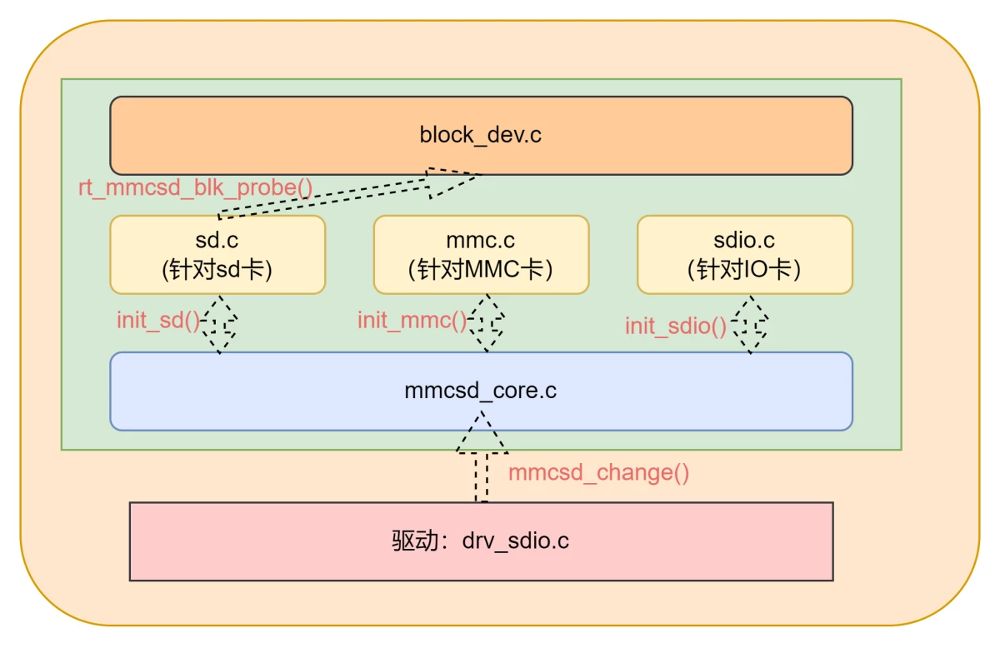
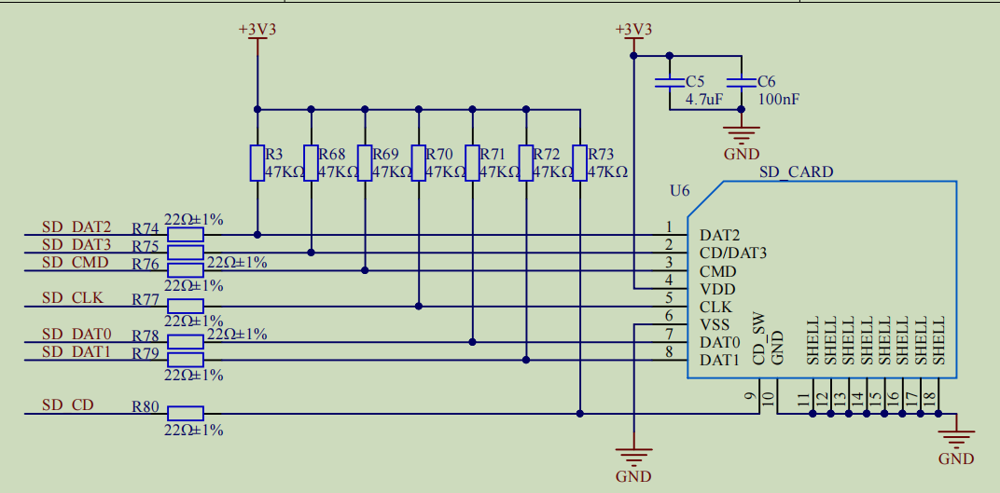
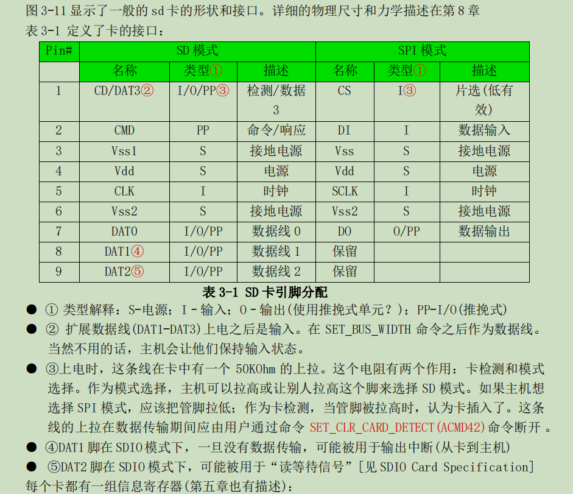
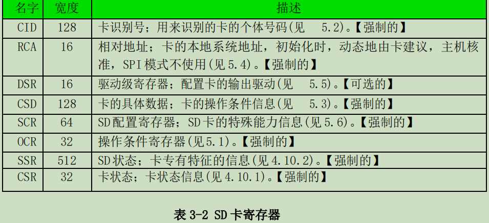
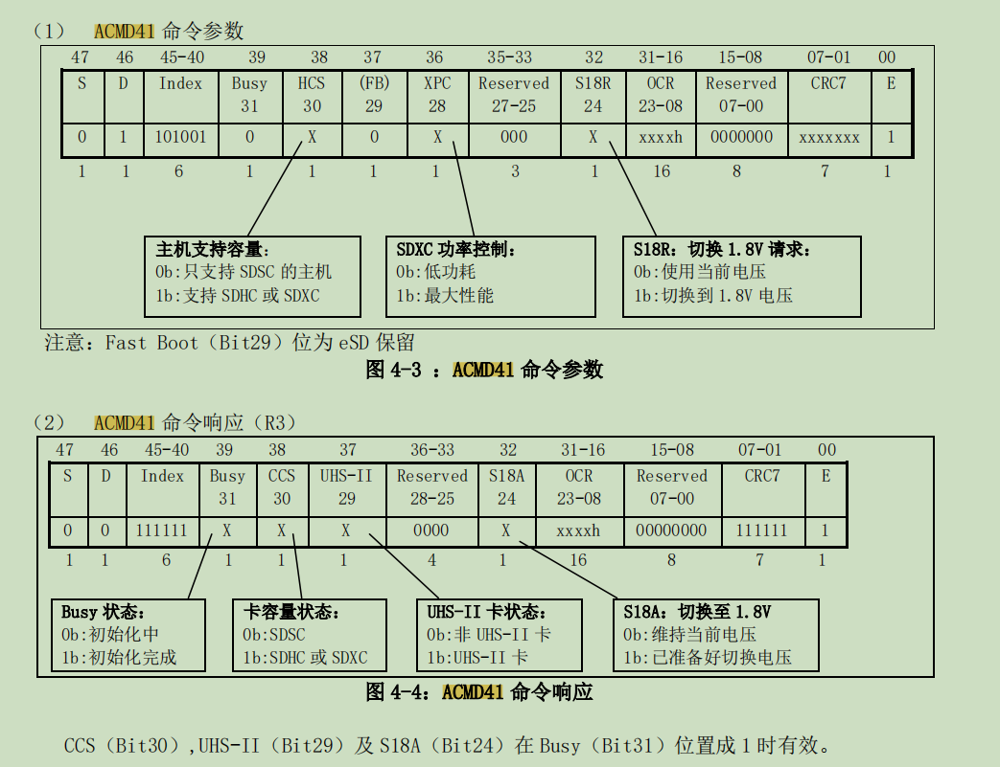
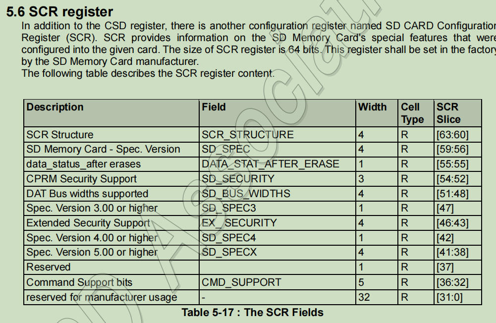

# RTT 学习

[toc]

# 0. 杂项

## 0.1 检查是否否是2的幂

- 检查sz_blk是否是2的幂。原理如下：

如果一个数是2的幂，那么它的二进制表示中只有一个位是1，其余都是0。例如，2（10），4（100），8（1000）等。
当我们从这个数中减去1时，所有从最右边的1开始到最左边的所有位都会翻转。例如，4（100）减去1变成3（011）。
因此，如果一个数是2的幂，那么这个数与它自己减去1的结果进行位与运算，会得到0。因为没有位同时在两个数中都是1。
反之，如果一个数不是2的幂，那么它至少有一个位不是1，这样减去1之后，至少有一个位在两个数中都是1，位与运算的结果不为0。
这个技巧在编程中经常被用来快速检查一个数是否是2的幂，因为它比循环或递归方法更高效。

```c
#define IS_POWER_OF_TWO(x) (((x) & ((x) - 1)) == 0)
```

# 1. 宏

## 1. 编译警告宏

```c
/* compile time assertion */
#define RT_STATIC_ASSERT(name, expn) typedef char _static_assert_##name[(expn)?1:-1]

expn:判断条件;当条件不满足时;数组的长度初始化为-1,即编译报错;
```

用#waring 编译判断更为合理

## 2. 宏过载

```c
#define __MSH_GET_MACRO(_1, _2, _3, _FUN, ...)  _FUN

/**
 * @ingroup msh
 *
 * This macro exports a command to module shell.
 *
 * @param command is the name of the command.
 * @param desc is the description of the command, which will show in help list.
 * @param opt This is an option, enter any content to enable option completion
 */
/* MSH_CMD_EXPORT(command, desc) or MSH_CMD_EXPORT(command, desc, opt) */
#define MSH_CMD_EXPORT(...)                                 \
    __MSH_GET_MACRO(__VA_ARGS__, _MSH_FUNCTION_CMD2_OPT,    \
        _MSH_FUNCTION_CMD2)(__VA_ARGS__)
```

- 这个宏 `__MSH_GET_MACRO`的作用是选择一个函数来调用。它接受五个参数：`_1`，`_2`，`_3`，`_FUN`和 `__VA_ARGS__`，然后返回 `_FUN`。

  `__MSH_GET_MACRO`被用来根据传入的参数数量来选择要调用的函数。具体来说，如果传入的参数数量为2，那么 `_FUN`就是 `_MSH_FUNCTION_CMD2`；如果传入的参数数量为3，那么 `_FUN`就是 `_MSH_FUNCTION_CMD2_OPT`。

  这种技术被称为宏过载，它允许你根据传入的参数数量来选择不同的宏来执行。

  `_FUN`在这里的作用是作为一个占位符，它代表了要调用的函数。

## 3. 宏定义

```c
#define RTM_EXPORT(symbol)                                            \
const char __rtmsym_##symbol##_name[] rt_section(".rodata.name") = #symbol;     \
const struct rt_module_symtab __rtmsym_##symbol rt_section("RTMSymTab")= \
{                                                                     \
    (void *)&symbol,                                                  \
    __rtmsym_##symbol##_name                                          \
};
```

1. `__rtmsym_##symbol##_name`：这是一个字符串常量，存储在 `.rodata.name`段中。
2. `__rtmsym_##symbol`：这是一个 `rt_module_symtab`结构体的实例，存储在 `RTMSymTab`段中(.text)。它包含两个字段：
   - 一个是指向符号的指针。
   - 另一个是指向符号名称的指针。

这个宏定义的目的是为了在运行时能够通过符号的名称查找到符号的地址，实现动态链接和加载模块.

## 4. #undef
- #undef 标识符，用来将前面定义的宏标识符取消定义。

# 2.链接文件

## 2.0. 参考链接

https://home.cs.colorado.edu/~main/cs1300/doc/gnu/ld_toc.html

## 2.1._stext 和 _etext

- stext 和 _etext 符号通常用于表示内核代码段的开始和结束位置。

```c
//定义了一个符号。这个符号的值等于当前的位置计数器（.），也就是 .text 段的起始地址。
_stext = .;
//定义了一个符号。这个符号的值等于当前的位置计数器（.），也就是 .text 段的结束地址。
_etext = .;
```

## 2.2. "."与"*符号作用

```c
SECTIONS
{
  . = 0x10000;
  .text : 
  { 
      *(.text) 
  }
  . = 0x8000000;
  .data : 
  { 
      *(.data) 
  }
  .bss : 
  { 
      *(.bss) 
  }
}
```

- 第一行设置了特殊符号'.'，这是位置计数器。如果您没有以其他方式指定输出部分的地址(稍后将描述其他方式)，则从位置计数器的当前值设置该地址。然后，位置计数器按输出部分的大小递增。在“SECTIONS”命令的开头，位置计数器的值为“0”。
- ' *'是一个通配符，可以匹配任何文件名。表达式 ` *(.text)`表示所有'。所有输入文件中的文本输入节。

| 段名             | 存储属性                                                     | 内存分配 |
| ---------------- | ------------------------------------------------------------ | -------- |
| 代码段 .text | 存放可执行程序的指令，存储态和运行态都有                     | 静态     |
| 数据段 .data     | 存放已初始化（非零初始化的全局变量和静态局部变量）的数据，存储态和运行态都有 | 静态     |
| bss段 .bss       | 存放未初始化（未初始化或者0初始化的全局变量和静态局部变量）的数据，存储态和运行态都有 | 静态     |
| 堆 heap          | 动态分配内存，需要通过malloc手动申请，free手动释放，适合大块内存。容易造成内存泄漏和内存碎片。运行态才有。 | 动态     |
| 栈 stack         | 存放函数局部变量和参数以及返回值，函数返回后，由操作系统立即回收。栈空间不大，使用不当容易栈溢出。运行态才有 | 静态     |

## 2.3.`.linkonce` 段

https://ftp.gnu.org/old-gnu/Manuals/gas/html_node/as_102.html

`.gnu.linkonce.t`是一个链接器区段，用于存放那些只需要链接一次的函数或者符号。区段名称后面通常跟着函数或者符号的名字。关于 `linkonce`的概念，GCC文档给出的解释是：“某些情况下，编译器为了优化而生成的代码项，不必在每一个包含了相同代码的编译单元中都出现。编译器将这些代码项放在 `.linkonce`区段中，链接器在链接时只保留一份。”

`linkonce`区段有几种类型:

- `.gnu.linkonce.b.*`（用于未初始化的全局变量）;
- `.gnu.linkonce.d.*`（用于已初始化的全局变量）;
- `.gnu.linkonce.r.*`（用于常量数据）;
- `.gnu.linkonce.t.*`（用于文本，也就是可执行代码）等。

例如，如果你有一个函数 `foo`，GCC可能将其编译]到 `.gnu.linkonce.t.foo`区段中，如果链接时发现其它对象文件也有 `.gnu.linkonce.t.foo`，那么链接器只会保留其中一份。这主要用于C++中的 `inline`函数或模板函数，通常情况下，每一个使用到这些函数的源文件都会生成一份函数的实例，但是链接时只需要保留一份即可。这样可以减少目标文件的大小，提高链接效率。

## 2.4. KEEP

当使用链接标记不应该消除的部分。这可以通过在输入节的通配符项周围加上' KEEP() '来实现不被优化

## 2.5 ENTRY

程序中执行的第一条指令称为**入口点**。使用 `ENTRY`链接描述文件命令来设置入口点。

有几种方法可以设置入口点。链接器将依次尝试以下方法来设置入口点，当其中一个方法成功时停止:

- the `-e' entry command-line option;
- the `ENTRY(symbol)` command in a linker script;
- the value of the symbol `start`, if defined;
- the address of the first byte of the `.text'`section, if present;
- The address `0`.

## 2.6 PROVIDE

```assembly
PROVIDE(__dtors_end__ = .);
```

- 只有在引用但未定义的情况下，才能使用提供 `PROVIDE`关键字来定义符号;如果 `__dtors_end__`已经被定义，那么 `PROVIDE`语句将被忽略。这对于为某些符号提供默认值很有用。这在考虑构造函数和析构函数列表符号(如' __CTOR_LIST__ ')时尤为重要，因为这些符号通常被定义为通用符号。

## 2.7 AT

`AT`关键字用于指定节（section）在内存中的加载地址。这个地址是物理地址，与链接地址（即节在输出文件中的位置）可能不同。

例如，在 `.data : AT (_sidata)`这行代码中，`.data`节将被加载到内存的 `_sidata`地址处。这通常用于ROM到RAM的复制操作，其中 `_sidata`是在ROM中存储的初始化数据的开始地址。

## 2.8 SORT

在链接脚本中，SORT的作用是对输入的部分进行排序。在你的代码中，SORT(.dtors.*)和* (.dtors)被用来收集所有的析构函数（destructors）。

SORT(.dtors.*)会把所有以.dtors.开头的部分按照字母顺序排序。这在某些情况下是有用的，例如当你想要按照某种特定的顺序执行析构函数时。

* (.dtors)则会把所有以.dtors开头的部分收集起来，但不进行排序。

这两个指令通常一起使用，以确保所有的析构函数都被正确地收集和排序。在你的代码中，析构函数被放在__dtors_start__和__dtors_end__之间，这样在程序结束时，运行时系统就知道从哪里开始调用析构函数，以及在哪里结束。这是一种常见的在C++中管理全局和静态对象生命周期的方法

## 2.9 NOLOAD

- `.RxDecripSection`，`.TxDecripSection`和 `.RxArraySection`都被设置为 `NOLOAD`，这意味着在程序执行时，它们不会被加载到内存中。这通常用于DMA操作，其中硬件需要知道数据的物理地址，而不是由MMU管理的虚拟地址。通常用于DMA配置,例如以太网

# 3. FINSH模块

## 3.1MSH

### 3.1.1初始化

1. 根据链接脚本指明FINSH使用内存空间 `_syscall_table_begin` `_syscall_table_end`的地址

#### 3.1.1.1FSymtab段

```c
        . = ALIGN(4);
        __fsymtab_start = .;
        KEEP(*(FSymTab))
        __fsymtab_end = .;
```

- `__fsymtab_start`和 `__fsymtab_end`用于指明finsh使用内存
- FSymTab用于存放所有注册命令的结构体 `struct finsh_syscall`,包括命令名称,命令选项,命令描述,命令函数执行地址信息

#### 3.1.1.2 宏

```c
/**
 * @ingroup msh
 *
 * This macro exports a command to module shell.
 *
 * @param command is the name of the command.
 * @param desc is the description of the command, which will show in help list.
 * @param opt This is an option, enter any content to enable option completion
 */
/* MSH_CMD_EXPORT(command, desc) or MSH_CMD_EXPORT(command, desc, opt) */
#define MSH_CMD_EXPORT(...)                                 \
    __MSH_GET_MACRO(__VA_ARGS__, _MSH_FUNCTION_CMD2_OPT,    \
        _MSH_FUNCTION_CMD2)(__VA_ARGS__)

#define __MSH_GET_MACRO(_1, _2, _3, _FUN, ...)  _FUN

#define _MSH_FUNCTION_CMD2(a0, a1)       \
        MSH_FUNCTION_EXPORT_CMD(a0, a0, a1, 0)

#define _MSH_FUNCTION_CMD2_OPT(a0, a1, a2)       \
        MSH_FUNCTION_EXPORT_CMD(a0, a0, a1, a0##_msh_options)

#define MSH_FUNCTION_EXPORT_CMD(name, cmd, desc)                      \
                const char __fsym_##cmd##_name[] rt_section(".rodata.name") = #cmd;    \
                const char __fsym_##cmd##_desc[] rt_section(".rodata.name") = #desc;   \
                rt_used const struct finsh_syscall __fsym_##cmd rt_section("FSymTab")= \
                {                           \
                    __fsym_##cmd##_name,    \
                    __fsym_##cmd##_desc,    \
                    (syscall_func)&name     \
                };
```

1. 宏过载语法,选择2个参数使用 `MSH_FUNCTION_CMD2`,`_MSH_FUNCTION_CMD2`的desc为0;3个参数使用 `MSH_FUNCTION_CMD2_OPT`
2. 定义字符串成员,地址定义为.rodata.name;内容为#cmd;

```c
const char __fsym_##cmd##_name[] rt_section(".rodata.name") = #cmd;    \
const char __fsym_##cmd##_desc[] rt_section(".rodata.name") = #desc;   \
```

3. `__fsym_##cmd`存储名称,细节,挂钩的函数指针地址

### 3.1.2遍历FINSH命令

```c
    for (index = _syscall_table_begin;
            index < _syscall_table_end;
            FINSH_NEXT_SYSCALL(index))
    {
  
    }
```

### 3.1.3TAB补全实现

1. 判断输入为 `/t`
2. 将光标移动到行首;使用 `/b`退格,一个个退回删除之前的显示字符
3. 将命令首地址传入 `shell_auto_complete`
4. 计算偏移地址

- `shell_auto_complete`

#### 3.1.3.1 `msh_auto_complete`

1. 首地址为 `/0`,即无输入任何字符串,直接TAB `/t`,则调用 `msh_cmd`输出所有支持的命令
2. 匹配命令名字,并输出命令

```c
        for (index = _syscall_table_begin; index < _syscall_table_end; FINSH_NEXT_SYSCALL(index))
        {
            /* skip finsh shell function */
            cmd_name = (const char *) index->name;
            if (strncmp(prefix, cmd_name, strlen(prefix)) == 0)
            {
                if (min_length == 0)
                {
                    /* set name_ptr */
                    name_ptr = cmd_name;
                    /* set initial length */
                    min_length = strlen(name_ptr);
                }

                length = str_common(name_ptr, cmd_name);
                if (length < min_length)
                    min_length = length;

                rt_kprintf("%s\n", cmd_name);
            }
        }
```

2. 输出提示字符 `msh />`与命令输入的字符串

```c
 rt_kprintf("%s%s", FINSH_PROMPT, prefix);
```

- finsh_get_prompt输出提示

```c
#define FINSH_PROMPT        finsh_get_prompt()

finsh_prompt_custom 用于自定义替换默认提示
finsh_set_prompt("artpi@root");
```

#### 3.1.3.2 `msh_opt_auto_complete`

```c
   argc = msh_get_argc(prefix, &opt_str);
    if (argc)
    {
        opt = msh_get_cmd_opt(prefix);
    }
    else if (!msh_get_cmd(prefix, strlen(prefix)) && (' ' == prefix[strlen(prefix) - 1]))
    {
        opt = msh_get_cmd_opt(prefix);
    }
```

1. `msh_get_argc` 获取命令空格之后参数
2. 没获取到参数时,判断 `prefix`不是一个已知的命令，并且命令行字符串的最后一个字符是空格
3. `msh_get_cmd_opt`获取 `syscall_table`中是否有匹配的命令
4. `argc`为0,输出 `msh_opt_help`所有的命令?
5. `msh_opt_complete`与 `msh_auto_complete`作用相同

### 3.1.4 TAB 子选项自动补全

1. [msh_opt_auto_complete](#3.3.2`msh_opt_auto_complete`)
2. 使用完成命令注册

```c
#define CMD_OPTIONS_STATEMENT(command) static struct msh_cmd_opt command##_msh_options[];
#define CMD_OPTIONS_NODE_START(command) static struct msh_cmd_opt command##_msh_options[] = {
#define CMD_OPTIONS_NODE(_id, _name, _des) {.id = _id, .name = #_name, .des = #_des},
#define CMD_OPTIONS_NODE_END    {0},};


CMD_OPTIONS_NODE_START(vref_temp_get)
CMD_OPTIONS_NODE(1, write, tx data)
CMD_OPTIONS_NODE(2, irq, irq list)
CMD_OPTIONS_NODE(3, speed-test, eth physical speed test)
CMD_OPTIONS_NODE_END
```

## 3.2 SHELL

### 3.2.1 `finsh_system_init`分配finsh结构体使用内存

1. 创建 `finsh_thread_entry`线程
2. 创建信号量,用于阻塞接字符串;信号量由控制台设备对象解除
3. 设置提示模式
4. INIT_APP_EXPORT中调用

### 3.2.2 `finsh_thread_entry`

1. 获取控制台设备对象
2. 获取控制台密码用于密码确认

   - `finsh_wait_auth`
     - 阻塞等待获取密码;密码输入显示 `*`
     - 敲入回车认为密码输入完成
     - 进入密码验证判断;失败线程阻塞等待2S再次获取输入字符
3. 进入控制台线程

   1. `finsh_getchar`

   - `rt_sem_take(&shell->rx_sem, RT_WAITING_FOREVER);`等待信号量释放
     - `finsh_rx_ind`函数中释放信号量

   2. handle control key判断

   ```c
        /*
            * handle control key
            * up key  : 0x1b 0x5b 0x41
            * down key: 0x1b 0x5b 0x42
            * right key:0x1b 0x5b 0x43
            * left key: 0x1b 0x5b 0x44
            */
   ```

   - 上下键:历史命令显示
   - 左右键:移动当前光标
   - tab键 补全命令
   - 删除键:删除
   - 回车键:执行msh命令
4. 设置控制台设备模式

```c
/**
 * @ingroup finsh
 *
 * This function sets the input device of finsh shell.
 *
 * @param device_name the name of new input device.
 */
void finsh_set_device(const char *device_name)
{
    rt_device_t dev = RT_NULL;

    RT_ASSERT(shell != RT_NULL);
    dev = rt_device_find(device_name);
    if (dev == RT_NULL)
    {
        rt_kprintf("finsh: can not find device: %s\n", device_name);
        return;
    }

    /* check whether it's a same device */
    if (dev == shell->device) return;
    /* open this device and set the new device in finsh shell */
    if (rt_device_open(dev, RT_DEVICE_OFLAG_RDWR | RT_DEVICE_FLAG_INT_RX | \
                       RT_DEVICE_FLAG_STREAM) == RT_EOK)
    {
        if (shell->device != RT_NULL)
        {
            /* close old finsh device */
            rt_device_close(shell->device);
            rt_device_set_rx_indicate(shell->device, RT_NULL);
        }

        /* clear line buffer before switch to new device */
        rt_memset(shell->line, 0, sizeof(shell->line));
        shell->line_curpos = shell->line_position = 0;

        shell->device = dev;
        rt_device_set_rx_indicate(dev, finsh_rx_ind);
    }
}
```

### 3.2.3 历史命令显示

1. 回车存入历史命令 `shell_push_history`
2. 上下键显示历史命令 `shell_handle_history`

### 3.2.4 MSH命令执行

## 3.3 cmd&msh_parse&&msh_file

- 一些系统命令的输出
- 一些共用的解析
- 文件系统的命令支持

# 5. 预编译命令

```c
#define __RT_STRINGIFY(x...)        #x
#define RT_STRINGIFY(x...)          __RT_STRINGIFY(x)
#define rt_section(x)               __attribute__((section(x)))
#define rt_used                     __attribute__((used))
#define rt_align(n)                 __attribute__((aligned(n)))
#define rt_weak                     __attribute__((weak))
#define rt_typeof                   __typeof__
#define rt_noreturn                 __attribute__ ((noreturn))
#define rt_inline                   static __inline
#define rt_always_inline            static inline __attribute__((always_inline))
```

- `__RT_STRINGIFY(x...)` 和 `RT_STRINGIFY(x...)`：这两个宏用于将参数转换为字符串。`__RT_STRINGIFY`直接将参数转换为字符串，而 `RT_STRINGIFY`则通过 `__RT_STRINGIFY`间接完成转换，以确保参数先被宏展开再转换为字符串。
- `rt_section(x)`：这个宏用于将特定的函数或变量放入指定的段(section)中。
- `rt_noreturn`：这个宏用于指示函数不会返回。这对于像 `exit()`或 `abort()`这样的函数很有用。

  `rt_noreturn` 是一个函数属性，用于告诉编译器这个函数不会返回到调用者。这个属性可以帮助编译器进行优化。

  在C语言中，大多数函数在完成它们的工作后都会返回到调用者。然而，有些函数，如 `exit()` 或 `abort()`，在被调用后不会返回。这是因为它们会终止程序的执行，或者跳转到其他的执行流程，而不是返回到原来的位置。当编译器看到一个函数被声明为 `noreturn`，它就知道这个函数不会返回到调用者。这样，编译器就可以省略一些针对函数返回的代码生成和优化。例如，编译器可能不需要保存寄存器的值，或者不需要在函数调用后生成一些可能永远不会执行的代码。

## void类型和rt_noreturn类型的区别

`void`类型的函数和带有 `rt_noreturn`属性的函数之间的主要区别在于它们的行为，而不仅仅是它们的返回值。

`void`类型的函数确实没有返回值，但这并不意味着它们不会返回到调用者。当 `void`函数完成其工作后，控制权会返回到调用该函数的代码。

然而，带有 `rt_noreturn`属性的函数永远不会返回到调用者。这意味着一旦调用了这样的函数，程序的控制流就不会回到原来的位置。这对于像 `exit()`或 `abort()`这样的函数来说是非常有用的，因为这些函数在被调用后会终止程序的执行，或者跳转到其他的执行流程。

所以，`rt_noreturn`并不是关于函数的返回值的，而是关于函数是否会返回到调用者。这个属性可以帮助编译器进行更好的优化，因为编译器知道一旦调用了 `rt_noreturn`函数，就不需要生成任何后续的代码。希望这个解释对你有所帮助！

# 6.map文件分析

```assembly
Image$$ER_IROM1$$Base                    0x90000000   Number         0  anon$$obj.o ABSOLUTE
__Vectors                                0x90000000   Data           4  startup_stm32h750xx.o(RESET)
__Vectors_End                            0x90000298   Data           0  startup_stm32h750xx.o(RESET)
__main                                   0x90000299   Thumb Code     0  entry.o(.ARM.Collect$$$$00000000)
_main_stk                                0x90000299   Thumb Code     0  entry2.o(.ARM.Collect$$$$00000001)
_main_scatterload                        0x9000029d   Thumb Code     0  entry5.o(.ARM.Collect$$$$00000004)
__main_after_scatterload                 0x900002a1   Thumb Code     0  entry5.o(.ARM.Collect$$$$00000004)
_main_clock                              0x900002a1   Thumb Code     0  entry7b.o(.ARM.Collect$$$$00000008)
_main_cpp_init                           0x900002a1   Thumb Code     0  entry8b.o(.ARM.Collect$$$$0000000A)
_main_init                               0x900002a1   Thumb Code     0  entry9a.o(.ARM.Collect$$$$0000000B)
__rt_final_cpp                           0x900002a9   Thumb Code     0  entry10a.o(.ARM.Collect$$$$0000000D)
__rt_final_exit                          0x900002a9   Thumb Code     0  entry11a.o(.ARM.Collect$$$$0000000F)
rt_hw_interrupt_disable                  0x900002ad   Thumb Code     8  context_rvds.o(.text)
rt_hw_interrupt_enable                   0x900002b5   Thumb Code     6  context_rvds.o(.text)
rt_hw_context_switch                     0x900002bb   Thumb Code    32  context_rvds.o(.text)
rt_hw_context_switch_interrupt           0x900002bb   Thumb Code     0  context_rvds.o(.text)
PendSV_Handler                           0x900002db   Thumb Code   108  context_rvds.o(.text)
rt_hw_context_switch_to                  0x90000347   Thumb Code    76  context_rvds.o(.text)
rt_hw_interrupt_thread_switch            0x90000393   Thumb Code     2  context_rvds.o(.text)
HardFault_Handler                        0x90000395   Thumb Code    56  context_rvds.o(.text)
MemManage_Handler                        0x90000395   Thumb Code     0  context_rvds.o(.text)
rt_memcpy                                0x900003e9   Thumb Code     0  rt_memcpy_rvds.o(.text)
Reset_Handler                            0x9000060d   Thumb Code     8  startup_stm32h750xx.o(.text)
```

1. Reset_Handler 根据链接脚本设置 `ENTRY(Reset_Handler)`;应为RAM首地址位置;实际并不是

原因:

- 在汇编启动文件中,首先设置了向量表,再设置复位函数

```assembly
; Vector Table Mapped to Address 0 at Reset
    AREA    RESET, DATA, READONLY
    EXPORT  __Vectors
    EXPORT  __Vectors_End
    EXPORT  __Vectors_Size

__Vectors       DCD     __initial_sp                      ; Top of Stack
    DCD     Reset_Handler                     ; Reset Handler
```

- `Reset_Handler `编写中调用 `SystemInit`与 `__main`

```assembly
Reset_Handler    PROC
    	EXPORT  Reset_Handler                    [WEAK]
    IMPORT  SystemInit
    IMPORT  __main

        LDR     R0, =SystemInit
        BLX     R0
        LDR     R0, =__main
        BX      R0
        ENDP
```

- `__main`中执行rtt初始化:https://www.rt-thread.org/document/api/group___system_init.html#details

# 7.汇编.s文件

https://zhuanlan.zhihu.com/p/98888285

## 7.1 汇编指令

### 7.1.1 BX

- BX指令：在ARM汇编语言中，BX指令用于跳转到指令中所指定的目标地址。这个目标地址可以是ARM指令，也可以是Thumb指令。BX指令的格式为：`BX {条件} 目标地址`。这个指令的特点是它可以改变处理器的状态，从ARM状态切换到Thumb状态，或者从Thumb状态切换到ARM状态。这种状态切换的功能使得BX指令在实现子程序调用和处理器工作状态切换时非常有用。

### 7.1.2 LR链接寄存器

- LR链接寄存器：在ARM架构中，链接寄存器（Link Register，简称LR）通常用于存储子程序返回地址。当执行BL（带返回的跳转指令）或BLX（带返回和状态切换的跳转指令）时，处理器会将下一条指令的地址保存到LR中。然后，当子程序执行完毕后，可以通过将LR的内容加载到程序计数器（PC）中，从而返回到调用者。这种机制使得子程序的调用和返回变得非常方便和高效。

- 在用户模式下，LR（或R14）用作链接寄存器，用于存储子程序调用时的返回地址。如果返回地址存储在堆栈上，它也可以用作通用寄存器。

  在异常处理模式中，LR 保存异常的返回地址，或者如果在异常内执行子例程调用，则保存子例程返回地址。如果返回地址存储在堆栈中，LR 可以用作通用寄存器。

### 7.1.4 []的作用

- 在这段ARM汇编代码中，LDR r3, [r2] 是一条加载指令。这条指令的作用是从内存中加载数据。

- r3 和 r2 是寄存器，它们是CPU中用于临时存储数据的小存储区。在这个上下文中，r3 和 r2 只是寄存器的名称，它们没有特殊的含义，只是用于标识这些寄存器。
  [r2] 的含义是：使用 r2 寄存器中的值作为内存地址，从该地址加载数据。[] 的作用是表示间接寻址，也就是说，我们不是直接使用 r2 的值，而是使用 r2 中的值作为一个内存地址，从这个地址中获取数据。
  所以，LDR r3, [r2] 的整体含义是：从内存中的 r2 所指向的地址加载数据，然后将这些数据存储到 r3 寄存器中。这就是这条指令的作用。

### 7.1.4 简单的指令
- LDR: 将地址加载到寄存器中。
- CMP: 比较两个操作数的值。
- BEQ


## 7.2 MSR

- [**MSR指令**](https://zhuanlan.zhihu.com/p/333926905)[[1]](https://zhuanlan.zhihu.com/p/333926905)[[2]](https://blog.csdn.net/wavemcu/article/details/6737302)[[3]](https://blog.csdn.net/qq_43418840/article/details/121407337)[[4]](https://www.cnblogs.com/lifexy/p/7101686.html)：在ARM汇编语言中，MSR（Move to Status Register）指令用于将操作数的内容传送到程序状态寄存器的特定域中。其中，操作数可以为通用寄存器或立即数。MSR指令通常用于恢复或改变程序状态寄存器的内容。例如，当需要修改状态寄存器的内容时，可以通过“读取-修改-写回”指令序列完成。这种操作通常用于切换处理器模式、或者允许/禁止IRQ/FIQ中断等。

## 7.3 PRIMASK寄存器

- [**PRIMASK寄存器**](https://zhuanlan.zhihu.com/p/333926905)[[5]](https://blog.csdn.net/qhdd123/article/details/107207282)[[6]](https://blog.csdn.net/weixin_55672545/article/details/130453893)[[7]](https://bing.com/search?q=PRIMASK+寄存器作用及原理)：在ARM Cortex-M处理器中，PRIMASK寄存器用于控制中断的优先级，允许屏蔽（禁止）特定优先级的中断。PRIMASK寄存器是一个单比特（bit）的寄存器，只有两个有效的取值：0和1。当PRIMASK寄存器的值为0时，表示所有中断都可以触发。当PRIMASK寄存器的值为1时，会禁止所有可屏蔽的中断。这意味着通过设置 PRIMASK 寄存器为 1，可以禁用所有中断，从而实现临界区的保护或者实现禁止中断的功能。

## 7.4.中断启用禁用

```assembly
/*
 * rt_base_t rt_hw_interrupt_disable();
 */
.global rt_hw_interrupt_disable
.type rt_hw_interrupt_disable, %function
rt_hw_interrupt_disable:
//将PRIMASK写入RO寄存器
    MRS     r0, PRIMASK
//设置CPSID为I,用于禁用中断
    CPSID   I
    BX      LR

/*
 * void rt_hw_interrupt_enable(rt_base_t level);
 */
.global rt_hw_interrupt_enable
.type rt_hw_interrupt_enable, %function
rt_hw_interrupt_enable:
//从RO取回PRIMASK
    MSR     PRIMASK, r0
    BX      LR
```

- 由于将PRIMASK的值暂存在r0中，执行临界段代码时r0值会不会改变？

https://club.rt-thread.org/ask/question/d5156cdf3abb63a1.html

## 7.3 HardFault_Handler

```assembly
.global HardFault_Handler
.type HardFault_Handler, %function
HardFault_Handler:
    /* 获取当前上下文 */
    MRS     r0, msp                 /* 从处理程序获取故障上下文 */
    TST     lr, #0x04               /* 如果!EXC_RETURN[2] */
    BEQ     _get_sp_done
    MRS     r0, psp                 /* 从线程获取故障上下文 */
_get_sp_done:

    STMFD   r0!, {r4 - r11}         /* 压入r4 - r11寄存器 */
#if defined (__VFP_FP__) && !defined(__SOFTFP__)
    STMFD   r0!, {lr}               /* 压入标志的占位符 */
#endif
    STMFD   r0!, {lr}               /* 压入exec_return寄存器 */

    TST     lr, #0x04               /* 如果!EXC_RETURN[2] */
    BEQ     _update_msp
    MSR     psp, r0                 /* 更新堆栈指针到PSP */
    B       _update_done
_update_msp:
    MSR     msp, r0                 /* 更新堆栈指针到MSP */
_update_done:

    PUSH    {LR}
    BL      rt_hw_hard_fault_exception  /* 调用硬件故障异常处理函数 */
    POP     {LR}

    ORR     lr, lr, #0x04
    BX      lr  /* 返回 */

```


# 8.RTT系统初始化

## 8.1 `rtthread_startup`

1. 中断禁用
2. 板级初始化

## 8.2 rt_hw_board_init

1. I/D cache初始化
2. 时钟初始化
3. 外设时钟初始化
4. 堆初始化 `rt_system_heap_init`
5. 组件初始化 `rt_components_board_init`,初始化板级驱动

## 8.3 INIT_EXPORT

```c
/*
 * Components Initialization will initialize some driver and components as following
 * order:
 * rti_start         --> 0
 * BOARD_EXPORT      --> 1
 * rti_board_end     --> 1.end
 *
 * DEVICE_EXPORT     --> 2
 * COMPONENT_EXPORT  --> 3
 * FS_EXPORT         --> 4
 * ENV_EXPORT        --> 5
 * APP_EXPORT        --> 6
 *
 * rti_end           --> 6.end
 *
 * These automatically initialization, the driver or component initial function must
 * be defined with:
 * INIT_BOARD_EXPORT(fn);
 * INIT_DEVICE_EXPORT(fn);
 * ...
 * INIT_APP_EXPORT(fn);
 * etc.
 */
```

1. 根据编译后 `Image Symbol Table`中顺序执行

```c
   	__rt_init_rti_start                      0x900621a4   Data           4  components.o(.rti_fn.0)
    __rt_init_rti_board_start                0x900621a8   Data           4  components.o(.rti_fn.0.end)
    __rt_init_vtor_config                    0x900621ac   Data           4  board.o(.rti_fn.1)
    __rt_init_mpu_init                       0x900621b0   Data           4  drv_mpu.o(.rti_fn.1)
    __rt_init_rt_hw_spi_init                 0x900621b4   Data           4  drv_spi.o(.rti_fn.1)
    __rt_init_SDRAM_Init                     0x900621b8   Data           4  drv_sdram.o(.rti_fn.1)
    __rt_init_rt_wdt_init                    0x900621bc   Data           4  drv_wdt.o(.rti_fn.1)
    __rt_init_rt_usbd_class_list_init        0x900621c0   Data           4  usbdevice.o(.rti_fn.1)
    __rt_init_ulog_init                      0x900621c4   Data           4  ulog.o(.rti_fn.1)
    __rt_init_rti_board_end                  0x900621c8   Data           4  components.o(.rti_fn.1.end)
    __rt_init_rt_mmcsd_core_init             0x900621cc   Data           4  mmcsd_core.o(.rti_fn.2)
    __rt_init_dfs_init                       0x900621d0   Data           4  dfs.o(.rti_fn.2)
    __rt_init_rt_usbd_msc_class_register     0x900621d4   Data           4  mstorage.o(.rti_fn.2)
    __rt_init_ulog_console_backend_init      0x900621d8   Data           4  console_be.o(.rti_fn.2)
    __rt_init_ulog_async_init                0x900621dc   Data           4  ulog.o(.rti_fn.2)
    __rt_init_ulog_console_backend_filter_init 0x900621e0   Data           4  ulog_file_be.o(.rti_fn.3)
    __rt_init_adc_init                       0x900621e4   Data           4  user_adc.o(.rti_fn.3)
    __rt_init_rt_cm_backtrace_init           0x900621e8   Data           4  cmb_port.o(.rti_fn.3)
    __rt_init_stm_usbd_register              0x900621ec   Data           4  drv_usbd.o(.rti_fn.3)
    __rt_init_rt_hw_sdio_init                0x900621f0   Data           4  drv_sdmmc.o(.rti_fn.3)
    __rt_init_rt_hw_rtc_init                 0x900621f4   Data           4  drv_rtc.o(.rti_fn.3)
    __rt_init_set_finsh_irq                  0x900621f8   Data           4  board.o(.rti_fn.4)
    __rt_init_rtc_update_init                0x900621fc   Data           4  board.o(.rti_fn.4)
    __rt_init_elm_init                       0x90062200   Data           4  dfs_elm.o(.rti_fn.4)
    __rt_init_dfs_romfs_init                 0x90062204   Data           4  dfs_romfs.o(.rti_fn.4)
    __rt_init_dfs_lfs_init                   0x90062208   Data           4  dfs_lfs.o(.rti_fn.4)
    __rt_init_syswatch_init                  0x9006220c   Data           4  syswatch.o(.rti_fn.4)
    __rt_init_utest_init                     0x90062210   Data           4  utest.o(.rti_fn.4)
    __rt_init_rt_flash_init                  0x90062214   Data           4  spi_flash_init.o(.rti_fn.5)
    __rt_init_mfbd_init                      0x90062218   Data           4  bsp_key.o(.rti_fn.6)
    __rt_init_User_Led_Init                  0x9006221c   Data           4  user_led.o(.rti_fn.6)
    __rt_init_pvd_init                       0x90062220   Data           4  board.o(.rti_fn.6)
    __rt_init_uart1_init                     0x90062224   Data           4  user_uart1.o(.rti_fn.6)
    __rt_init_cpu_usage_init                 0x90062228   Data           4  cpu_usage.o(.rti_fn.6)
    __rt_init_finsh_system_init              0x9006222c   Data           4  shell.o(.rti_fn.6)
    __rt_init_rti_end                        0x90062230   Data           4  components.o(.rti_fn.6.end)
```

## 8.4 rt_system_timer_init

# 9. 内存管理

https://www.rt-thread.org/document/site/#/rt-thread-version/rt-thread-standard/programming-manual/memory/memory

## 9.1 初始化

1. `rt_system_heap_init`

- 对堆开始地址与结束地址进行内存对齐
- 在ART-PI中将所有剩余ROM划分给堆使用
- 断言堆设置是否正常
- 根据配置的内存策略 使用 `_MEM_INIT`
- 初始化多线程争用锁

## 9.2 小内存管理算法

- 小内存算法在分配内存的时候，随着内存碎片的增多，分配速度会越来越慢，当总的内存太大的时候，内存碎片的数量可能会更多，此时这种算法就会变得不再适用。
- 小内存管理算法主要针对系统资源比较少，一般用于小于 2MB 内存空间的系统
- 每个内存对象的起始12字节不可使用,设置为堆系统的配置

```c
//这是一个掩码，用于将内存地址的最低位清零。在 RTT 的内存管理中，内存块的地址的最低位被用作标记该内存块是否被使用。
#define MEM_MASK             0xfffffffe
//这个宏用于标记内存块 _mem 为已使用。它首先使用 MEM_MASK 将 _mem 的最低位清零，然后将最低位设置为 1，表示该内存块已被使用。
#define MEM_USED(_mem)       ((((rt_base_t)(_mem)) & MEM_MASK) | 0x1)
#define MEM_FREED(_mem)      ((((rt_base_t)(_mem)) & MEM_MASK) | 0x0)
//这将使用 ~MEM_MASK（即 MEM_MASK 的按位取反）与 pool_ptr 进行按位与操作。由于 MEM_MASK 的最低位是 0，所以 ~MEM_MASK 的最低位是 1。这意味着这个操作将提取出 pool_ptr 的最低位，即内存块的使用状态标记。
#define MEM_ISUSED(_mem)   \
                      (((rt_base_t)(((struct rt_small_mem_item *)(_mem))->pool_ptr)) & (~MEM_MASK))
```


### 9.2.1 `rt_smem_init`

1. 内存对齐
2. 内存大小计算;至少需要满足两个 `struct rt_small_mem_item`结构体;因为堆起始与结束各有一个结构体

```c
/* 初始化堆起始位置内存对象*/
struct rt_small_mem_item *mem;
mem        = (struct rt_small_mem_item *)small_mem->heap_ptr;//堆起始位置初始化
mem->pool_ptr = MEM_FREED(small_mem);//小内存堆对象地址 设置为释放
mem->next  = small_mem->mem_size_aligned + SIZEOF_STRUCT_MEM;//下一个内存对象设置到堆结尾内存对象
mem->prev  = 0;//上一个对象为空
//写入堆起始位置分配的内存名称
rt_smem_setname(mem, "INIT");

/* 堆大小 */
small_mem->mem_size_aligned = mem_size;
/* 指向堆的起始地址 */
small_mem->heap_ptr = (rt_uint8_t *)begin_align;
/* 初始化指向堆开始的最低空闲指针*/
small_mem->lfree = (struct rt_small_mem_item *)small_mem->heap_ptr;

//初始化堆结束内存对象性
small_mem->heap_end        = (struct rt_small_mem_item *)&small_mem->heap_ptr[mem->next];//初始化设置为堆起始地址的下一个内存对象为堆结束地址
small_mem->heap_end->pool_ptr = MEM_USED(small_mem);//设置为使用
small_mem->heap_end->next  = small_mem->mem_size_aligned + SIZEOF_STRUCT_MEM;//下一个设置为自身
small_mem->heap_end->prev  = small_mem->mem_size_aligned + SIZEOF_STRUCT_MEM;//上一个设置为自身

//写入堆结束位置分配的内存名称
rt_smem_setname(small_mem->heap_end, "INIT");
```

### 9.2.2 alloc分配

- 使用_MEM_MALLOC,操作 `system_heap`

```c
rt_size_t ptr;
//从当前的空闲内存块开始，遍历整个内存池，直到找到一个足够大的内存块或者遍历完整个内存池
for (ptr = (rt_uint8_t *)small_mem->lfree - small_mem->heap_ptr;
     ptr <= small_mem->mem_size_aligned - size;
     ptr = ((struct rt_small_mem_item *)&small_mem->heap_ptr[ptr])->next)
{
    //查找未使用的内存且满足大小的区域
    if ((!MEM_ISUSED(mem)) && (mem->next - (ptr + SIZEOF_STRUCT_MEM)) >= size)
    {
        //获取当前内存块的地址。
        mem = (struct rt_small_mem_item *)&small_mem->heap_ptr[ptr];
        //* 如果当前内存块足够大，那么可以将其分割成两个部分，一个用于分配，另一个保留为新的空闲内存块 */
        if (mem->next - (ptr + SIZEOF_STRUCT_MEM) >=
                    (size + SIZEOF_STRUCT_MEM + MIN_SIZE_ALIGNED))
        {
                /* 创建新的空闲内存块 */
                ptr2 = ptr + SIZEOF_STRUCT_MEM + size;
                mem2       = (struct rt_small_mem_item *)&small_mem->heap_ptr[ptr2];
                mem2->pool_ptr = MEM_FREED(small_mem);
                mem2->next = mem->next;
                mem2->prev = ptr;

                /* 更新当前内存块的next指针，使其指向新的空闲内存块 */
                mem->next = ptr2;

                /* 如果新的空闲内存块不是最后一个内存块，那么更新下一个内存块的prev指针，使其指向新的空闲内存块 */
                if (mem2->next != small_mem->mem_size_aligned + SIZEOF_STRUCT_MEM)
                    ((struct rt_small_mem_item *)&small_mem->heap_ptr[mem2->next])->prev = ptr2;

                /* 更新已使用的内存大小和最大使用内存大小 */
                small_mem->parent.used += (size + SIZEOF_STRUCT_MEM);
                if (small_mem->parent.max < small_mem->parent.used)
                    small_mem->parent.max = small_mem->parent.used;
        }
        else
        {
            /* 更新已使用的内存大小 */
            small_mem->parent.used += mem->next - ((rt_uint8_t *)mem - small_mem->heap_ptr);
            if (small_mem->parent.max < small_mem->parent.used)
                small_mem->parent.max = small_mem->parent.used;
        }
        /* 设置当前分配内存为使用中 */
        mem->pool_ptr = MEM_USED(small_mem);
        //线程分配的设置线程名称
        if (rt_thread_self())
            rt_smem_setname(mem, rt_thread_self()->parent.name);
        else
            //中断分配设置为NONE
            rt_smem_setname(mem, "NONE");
        //如果使用的是已经分配到的最大堆地址
        if (mem == small_mem->lfree)
        {
            /* 在内存之后找到下一个空闲块并更新最低空闲指针 */
            while (MEM_ISUSED(small_mem->lfree) && small_mem->lfree != small_mem->heap_end)
                small_mem->lfree = &small_mem->heap_ptr[small_mem->lfree->next];
        }
    }
}
```

1. 第一次分配内存时

```c
ptr = 0;
mem = (struct rt_small_mem_item *)&small_mem->heap_ptr[0];//第一个内存对象
//* 如果当前内存块足够大，那么可以将其分割成两个部分，一个用于分配，另一个保留为新的空闲内存块 */
if (mem->next - (ptr + SIZEOF_STRUCT_MEM) >=
    (size + SIZEOF_STRUCT_MEM + MIN_SIZE_ALIGNED))
{
    mem2->next = mem->next;//mem2指向堆末尾
    mem2->prev = ptr;//上一个指向堆起始
    mem->next = ptr2;//堆起始的下一个更新为mem2
  
    /* 如果新的空闲内存块不是最后一个内存块，那么更新下一个内存块的prev指针，使其指向新的空闲内存块 */
    if (mem2->next != small_mem->mem_size_aligned + SIZEOF_STRUCT_MEM)
    {
        //堆结尾的内存对象的上一个对象设置为mem2
        ((struct rt_small_mem_item *)&small_mem->heap_ptr[mem2->next])->prev = ptr2;  
    }

}
```

2. 再一次分配内存时,如果分配后剩余的内存空间不够再开辟一个内存对象时

```c
            /* 更新已使用的内存大小 */
            small_mem->parent.used += mem->next - ((rt_uint8_t *)mem - small_mem->heap_ptr);
            if (small_mem->parent.max < small_mem->parent.used)
                small_mem->parent.max = small_mem->parent.used;
```

### 9.2.3 realloc

```c
if (newsize + SIZEOF_STRUCT_MEM + MIN_SIZE < size)//当前内存块大小满足可分配区域
{
    /*分割内存块*/
    small_mem->parent.used -= (size - newsize);

    ptr2 = ptr + SIZEOF_STRUCT_MEM + newsize;
    mem2 = (struct rt_small_mem_item *)&small_mem->heap_ptr[ptr2];
    mem2->pool_ptr = MEM_FREED(small_mem);
    mem2->next = mem->next;
    mem2->prev = ptr;
    //合并相邻的未使用内存区域
    plug_holes(small_mem, mem2);
} else {
    /*扩展内存*/
    nmem = rt_smem_alloc(&small_mem->parent, newsize);
    if (nmem != RT_NULL) /* check memory */
    {
        rt_memcpy(nmem, rmem, size < newsize ? size : newsize);
        //释放原使用内存
        rt_smem_free(rmem);
    }
}
```

### 9.2.4 plug_holes

- 处理内存碎片的。它试图通过合并相邻的未使用的内存块（称为“空洞”）来减少内存碎片。这个过程被称为“填充空洞”
- 获取前一个内存项,尝试合并;获取后一个尝试合并

### 9.2.5 free

- 当前地址设置为未使用
- 写入内存使用为空rt_smem_setname(mem, "   ");
- plug_holes

## 9.3 slab 管理算法

- slab 内存管理算法则主要是在系统资源比较丰富时，提供了一种近似多内存池管理算法的快速算法

```
Linux目前为其“slab”分配器提供了三种选择:
Slab是最初的，基于Bonwick的开创性论文，从Linux内核2.2版开始就可以使用。它忠实地实现了Bonwick的建议，并在Bonwick的后续论文中描述了多处理器的变化。
Slub是下一代替代内存分配器，自2.6.23以来一直是Linux内核中的默认配置。它继续使用基本的“slab”模型，但修复了slab设计中的几个缺陷，特别是在具有大量处理器的系统上。Slub比较简单
SLOB (Simple List Of Blocks)是一种内存分配器，针对内存非常少的嵌入式系统进行了优化——以兆字节为数量级。它在一个块列表上应用一个非常简单的首次拟合算法，这与旧的k&r风格的堆分配器没有什么不同。在消除内存分配器中几乎所有的溢出时，SLOB非常适合具有极端内存限制的系统，但是它不提供第1节中描述的任何好处，并且可能遭受病态碎片。
```

- 1.静态内存池管理。

  2.针对小内存块的分配管理（小内存管理算法）

  3.针对大内存块的管理算法（SLAB管理算法）

  前面两篇已经把第1，2种算法看了，现在就来看看第三种算法，第三种算法主要是针对大内存使用的。第二种，小内存算法在分配内存的时候，随着内存碎片的增多，分配速度会越来越慢，当总的内存太大的时候，内存碎片的数量可能会更多，此时这种算法就会变得不再适用。

  SLAB在我看来就是前两种算法的融合。
- https://club.rt-thread.org/ask/question/438bfc8cfd626cc2.html

```c
struct rt_slab
{
    struct rt_memory            parent;                         /**< inherit from rt_memory */
    rt_ubase_t                  heap_start;                     /**< memory start address */
    rt_ubase_t                  heap_end;                       /**< memory end address */

struct rt_slab_memusage
{
    rt_uint32_t     type: 2 ;               /**< page type */
    rt_uint32_t     size: 30;               /**< pages allocated or offset from zone */
};
    struct rt_slab_memusage    *memusage;						/*内存信息存放 类型+索引*/
    struct rt_slab_zone        *zone_array[RT_SLAB_NZONES];     /* linked list of zones NFree > 0 */
    struct rt_slab_zone        *zone_free;                      /* whole zones that have become free */
    rt_uint32_t                 zone_free_cnt;
    rt_uint32_t                 zone_size;
    rt_uint32_t                 zone_limit;
    rt_uint32_t                 zone_page_cnt;
    struct rt_slab_page        *page_list;
};

/*
 * slab page allocator
 * 页大小及分配信息
 */
struct rt_slab_page
{
    struct rt_slab_page *next;      /**< next valid page */
    rt_size_t page;                 /**< number of page  */

    /* dummy */
    char dummy[RT_MM_PAGE_SIZE - (sizeof(struct rt_slab_page *) + sizeof(rt_size_t))];
};
```

### 9.3.1 初始化

- page初始化,按页释放内存

  - 开始地址的page写入所有内存的页数
  - 下一个指向页对象为NULL
  - slab->page_list指向开始地址
- 计算zone大小:zone翻倍 比 最小数量 /1024小,则翻倍zone

```c
/* calculate zone size */
slab->zone_size = ZALLOC_MIN_ZONE_SIZE;
while (slab->zone_size < ZALLOC_MAX_ZONE_SIZE && (slab->zone_size << 1) < (limsize / 1024))
    slab->zone_size <<= 1;
```

- rt_slab_page_alloc 了 内存信息存放的空间 npage*内存信息结构体

### 9.3.2 页内存释放

```c
void rt_slab_page_free(rt_slab_t m, void *addr, rt_size_t npages)
{
    struct rt_slab_page *b, *n;
    struct rt_slab_page **prev;
    struct rt_slab *slab = (struct rt_slab *)m;

    // 确保地址不为空，地址是内存页大小的倍数，且页数不为0
    RT_ASSERT(addr != RT_NULL);
    RT_ASSERT((rt_ubase_t)addr % RT_MM_PAGE_SIZE == 0);
    RT_ASSERT(npages != 0);

    // 将地址转换为rt_slab_page结构体
    n = (struct rt_slab_page *)addr;

    // 遍历slab的页面列表
    for (prev = &slab->page_list; (b = *prev) != RT_NULL; prev = &(b->next))
    {
        // 确保页面数量大于0，且当前页面在释放的页面之后或不重叠
        RT_ASSERT(b->page > 0);
        RT_ASSERT(b > n || b + b->page <= n);

        // 如果当前页面紧邻释放的页面
        if (b + b->page == n)
        {
            //如果当前页面刚好满足释放,则进行合并
            if (b + (b->page += npages) == b->next)
            {
                b->page += b->next->page;
                b->next  = b->next->next;
            }
            return;
        }

        // 如果当前页面刚好满足释放要求,则进行合并
        if (b == n + npages)
        {
            n->page = b->page + npages;
            n->next = b->next;
            *prev   = n;
            return;
        }

        // 如果当前页面比所需的内存页来的大,则退出
        if (b > n + npages)
            break;
    }

    //写入页面信息与下一个节点
    n->page = npages;
    n->next = b;
    //上一个节点指向当前页面
    *prev   = n;
}
```

### 9.3.3 页内存分配

```c

    // 遍历slab的page_list
    for (prev = &slab->page_list; (b = *prev) != RT_NULL; prev = &(b->next))
    {
        // 如果b的页数大于npages
        if (b->page > npages)
        {
            // 分割页面
            n       = b + npages;
            n->next = b->next;
            n->page = b->page - npages;
            *prev   = n;
            break;
        }

        // 如果b的页数等于npages
        if (b->page == npages)
        {
            // 这个节点适合，移除这个节点
            *prev = b->next;
            break;
        }
    }
```

### 9.3.5 malloc

#### 9.3.5.1 大内存

- 直接处理大量分配 ,直接分配

#### 9.3.5.2小内存

```c
/*
 * 计算分配请求大小的区域索引，并将分配请求大小设置为该区域的块大小。
 */
rt_inline int zoneindex(rt_size_t *bytes)
{
    /* 无符号整数用于位移操作 */
    rt_ubase_t n = (rt_ubase_t)(*bytes);

    if (n < 128)
    {
        /* 对齐到8字节，并计算区域索引 */
        *bytes = n = (n + 7) & ~7;
        return (n / 8 - 1);
    }
    if (n < 256)
    {
        /* 对齐到16字节，并计算区域索引 */
        *bytes = n = (n + 15) & ~15;
        return (n / 16 + 7);
    }
    /* 对于更大的内存请求，使用更大的对齐单位，并计算相应的区域索引 */
    if (n < 8192)
    {
        /* ...省略部分代码... */
    }
    if (n < 16384)
    {
        /* 对齐到1024字节，并计算区域索引 */
        *bytes = n = (n + 1023) & ~1023;
        return (n / 1024 + 55);
    }

    /* 如果内存请求大小超出预期，打印错误信息 */
    rt_kprintf("Unexpected byte count %d", n);

    return 0;
}
```

##### 9.3.5.2 没有分配过或者用光了

1. 该zone没有被使用过

   - 从页面分配一个区域,设置内存信息 `memusage`的类型与索引,设置zone空间信息
   - 计算块地址,链接到zone数组中
2. 该zone被使用过

   - 直接分配,从zone_free中移除

##### 9.3.5.3 有zone数组

1. 分配完了,从zone数组中移除
2. 可分配,执行分配
3. 没有可分配空间

   - 在空闲块列表中查找(free的时候分配)
   - 从空闲块列表中删除此块

### 9.3.6 free

#### 9.3.6.1 大内存释放

- 直接释放,size设置为0

#### 9.3.6.2 小内存释放

- 将内存设置标识下一个free块节点为free块
- 将当前free块设置为当前内存
- 如果zone释放后可以提供分配了,添加回zone数组中
- 如果该区域完全空闲，并且我们可以从其他区域进行分配，则将该区域移到FreeZones列表中
  - **空闲区域计数和释放**：每当一个区域被移动到空闲区域列表中，空闲区域的计数（`slab->zone_free_cnt`）就会增加。如果空闲区域的数量超过了设定的阈值（`ZONE_RELEASE_THRESH`），那么就会释放一个区域到页面分配器。
  - **页面的释放**：在释放区域到页面分配器之前，会设置每个页面的使用情况（`kup->type = PAGE_TYPE_FREE; kup->size = 0;`）。然后，调用 `rt_slab_page_free()`函数来释放这些页面。

## 9.4 memheap 管理算法

- memheap 方法适用于系统存在多个内存堆的情况，它可以将多个内存 “粘贴” 在一起，形成一个大的内存堆，用户使用起来会非常方便

### 9.4.1 init

- 计算可用大小
- 设置信息
- 设置链表

### 9.4.2 alloc

- 可用分配
- 从链表中寻找可分配的内存
  1. 寻找到可分配的内存,分割进行分配
  2. 找不到;继续从最后一个内存往后分配

### 9.4.3 free

- 释放
- 查找是否可以与临近的内存合并,进行合并

## 9.5 malloc&&realloc分配

1. 线程中使用加锁,中断中使用不加锁
2. _MEM_MALLOC 调用不同内存算法的malloc
3. 解锁
4. 调用malloc call函数

## 9.6 TLSF 内存管理算法

> https://www.cnblogs.com/pwl999/p/15534968.html

### 9.6.1 堆初始化
1. 创建内存池
- 清空结构体信息
2. 添加内存池
- 传递给给定内存块中的 `TLSF` 结构的开销`tlsf_add_pool`，等于空闲块的开销和哨兵块。
- 创建主要空闲块。稍微偏移块的起点以便 `prev_phys_block` 字段落在池之外它永远不会被使用。

> 使用`const`的原因有很多：**提高代码的可读性**：`const`关键字告诉读代码的人这个变量的值不会改变，这有助于理解代码的行为。**防止误操作**：在函数的其余部分，如果你试图改变`oldsize`的值，编译器会报错，因此可以防止因误操作而导致的错误。**优化性能**：编译器知道`const`变量的值不会改变，可能会进行一些优化。

- 设置块的大小,并设置该块为未使用,设置下一个块为使用中

```c
const size_t oldsize = block->size;
//保留原有的oldsize使用标志不变的情况下,设置新的size
block->size = size | (oldsize & (block_header_free_bit | block_header_prev_free_bit));
```

- 插入新的块

```c
static void mapping_insert(size_t size, int *fli, int *sli)
{
    int fl, sl;
    if (size < SMALL_BLOCK_SIZE) // 如果大小小于小块的大小
    {
        /* Store small blocks in first list. */
        fl = 0; // 第一级索引设置为0
        sl = tlsf_cast(int, size) / (SMALL_BLOCK_SIZE / SL_INDEX_COUNT); // 第二级索引根据大小和小块的数量进行计算
    }
    else // 如果大小大于或等于小块的大小
    {
        fl = tlsf_fls_sizet(size); // 使用位操作找到最高位的1，也就是第一级索引
        sl = tlsf_cast(int, size >> (fl - SL_INDEX_COUNT_LOG2)) ^ (1 << SL_INDEX_COUNT_LOG2); // 使用位操作计算第二级索引
        fl -= (FL_INDEX_SHIFT - 1); // 调整第一级索引，使其从0开始
    }
    *fli = fl; // 返回第一级索引
    *sli = sl; // 返回第二级索引
}
```

- 分割块以创建零大小的哨兵块

### 9.6.2 添加堆
- 根据地址添加池
- 添加当前堆到链表中

### 9.6.3 malloc


# 10. 系统定时器

## 10.1 跳跃表

- 跳跃表是一种“随机”的数据结构，在很大的可能性下，它会得到O(log(N))的时间复杂度，而旧的列表得到O(N)。此外，当将RT_TIMER_SKIP_LIST_LEVEL设置为1时，它将与旧的双链表相同，无论是时间还是空间复杂性。基准测试表明，当RT_TIMER_SKIP_LIST_LEVEL为3时，当有100个计时器时，随机插入新计时器的平均时间比旧计时器快2倍，当有200个计时器时快3倍。但是，它恢复已弃用的函数rt_system_timer_init。bsp必须在系统启动时调用它。

#### [定时器跳表 (Skip List) 算法](https://www.rt-thread.org/document/site/#/rt-thread-version/rt-thread-standard/programming-manual/timer/timer?id=定时器跳表-skip-list-算法)

在前面介绍定时器的工作方式的时候说过，系统新创建并激活的定时器都会按照以超时时间排序的方式插入到 rt_timer_list 链表中，也就是说 t_timer_list 链表是一个有序链表，RT-Thread 中使用了跳表算法来加快搜索链表元素的速度。

跳表是一种基于并联链表的数据结构，实现简单，插入、删除、查找的时间复杂度均为 O(log n)。跳表是链表的一种，但它在链表的基础上增加了 “跳跃” 功能，正是这个功能，使得在查找元素时，跳表能够提供 O(log n)的时间复杂度，举例如下：

一个有序的链表，如下图所示，从该有序链表中搜索元素 {13, 39}，需要比较的次数分别为 {3, 5}，总共比较的次数为 3 + 5 = 8 次。


使用跳表算法后可以采用类似二叉搜索树的方法，把一些节点提取出来作为索引，得到如下图所示的结构：


在这个结构里把 {3, 18,77} 提取出来作为一级索引，这样搜索的时候就可以减少比较次数了, 例如在搜索 39 时仅比较了 3 次（通过比较 3，18，39)。当然我们还可以再从一级索引提取一些元素出来，作为二级索引，这样更能加快元素搜索。


所以，定时器跳表可以通过上层的索引，在搜索的时候就减少比较次数，提升查找的效率，这是一种通过 “空间来换取时间” 的算法，在 RT-Thread 中通过宏定义 RT_TIMER_SKIP_LIST_LEVEL 来配置跳表的层数，默认为 1，表示采用一级有序链表图的有序链表算法，每增加一，表示在原链表基础上增加一级索引。

## 10.2 硬件定时器

- HARD_TIMER 模式的定时器超时函数在中断上下文环境中执行，可以在初始化 / 创建定时器时使用参数 RT_TIMER_FLAG_HARD_TIMER 来指定。

  在中断上下文环境中执行时，对于超时函数的要求与中断服务例程的要求相同：执行时间应该尽量短，执行时不应导致当前上下文挂起、等待。例如在中断上下文中执行的超时函数它不应该试图去申请动态内存、释放动态内存等。

  RT-Thread 定时器默认的方式是 HARD_TIMER 模式，即定时器超时后，超时函数是在系统时钟中断的上下文环境中运行的。在中断上下文中的执行方式决定了定时器的超时函数不应该调用任何会让当前上下文挂起的系统函数；也不能够执行非常长的时间，否则会导致其他中断的响应时间加长或抢占了其他线程执行的时间。

### 10.2.1 初始化&&删除

- 初始化

  - 动态分配,malloc定时器结构体 || 静态分配,外部分配
  - 设置相关参数
  - init tick;timeout = 0;
  - 初始化跳跃表链表
- 删除

  - 移除跳跃表链表
  - 从系统移除该对象

### 10.2.2 start

- 获取链表

#### 10.2.2.1 线程定时器

- 调度上锁
- 从定时器计算线程结构体地址
- 标识线程定时器启动
- 调度解锁

#### 10.2.2.2 定时器开始处理

- 当前正在执行超时处理函数,退出;(超时函数执行后会再次运行开始函数)
- 移除跳跃表定时器
- 定时器状移除激活状态
- 计算超时tick
- 提取跳表索引到_timer_list中

```c
row_head[0]  = &timer_list[0];
//遍历每一层的定时器列表
for (row_lvl = 0; row_lvl < RT_TIMER_SKIP_LIST_LEVEL; row_lvl++)
{
    //当前层中，遍历定时器列表，直到 row_head 指向当前层的最后一个定时器。
    for (; row_head[row_lvl] != timer_list[row_lvl].prev;
         row_head[row_lvl]  = row_head[row_lvl]->next)
    {
        struct rt_timer *t;
        rt_list_t *p = row_head[row_lvl]->next;

        /* 获取当前节点定时器的指针，并将其转换为 rt_timer 结构体类型。 */
        t = rt_list_entry(p, struct rt_timer, row[row_lvl]);

        //如果我们有两个定时器同时超时，最好是先插入的定时器被提前调用。因此，将新的计时器插入到some-timeout计时器列表的末尾。
        //当前节点定时器的超时时间和需要开启的定时器超时时间相同，继续遍历。
        if ((t->timeout_tick - timer->timeout_tick) == 0)
        {
            continue;
        }
        //如果当前节点定时器比需要开启的定时器超时时间还长,退出
        else if ((t->timeout_tick - timer->timeout_tick) < RT_TICK_MAX / 2)
        {
            break;
        }
    }
    //将提取的索引更新至_timer_list中
    if (row_lvl != RT_TIMER_SKIP_LIST_LEVEL - 1)
        row_head[row_lvl + 1] = row_head[row_lvl] + 1;

	/*这个简单的计数器可以很好地均匀分布列表高度。通过使用tst_nr的最低有效位，它确保定时器被插入到不同的级别，从而实现平衡分布。目标是避免具有相似超时节拍的计时器聚类*/
    //每次插入定时器时，计数器会递增。这个计数器的作用是在跳表中决定新的定时器节点应该插入到哪一层。
    random_nr++;
    tst_nr = random_nr;
	//将新的定时器节点插入到系统定时器列表的最后一层
    rt_list_insert_after(row_head[RT_TIMER_SKIP_LIST_LEVEL - 1],
                         &(timer->row[RT_TIMER_SKIP_LIST_LEVEL - 1]));
    //从第二层开始，遍历每一层的定时器列表。
    for (row_lvl = 2; row_lvl <= RT_TIMER_SKIP_LIST_LEVEL; row_lvl++)
    {
        //在相应级别的节点后插入计时器。 
        //RT_TIMER_SKIP_LIST_MASK = 3;1~3 ,5~7,9~11这样添加
        if (!(tst_nr & RT_TIMER_SKIP_LIST_MASK))
            rt_list_insert_after(row_head[RT_TIMER_SKIP_LIST_LEVEL - row_lvl],
                                 &(timer->row[RT_TIMER_SKIP_LIST_LEVEL - row_lvl]));
        else
            break;
        //tst_nr右移以测试下一位
        tst_nr >>= (RT_TIMER_SKIP_LIST_MASK + 1) >> 1;
    }
}
```

### 10.2.3 删除定时器&&STOP

- 从定时器链表中剔除
- 从object对象中剔除

## 10.2 软件定时器

### 10.2.1 系统定时器线程

1. 初始化跳表链表
2. 信号量初始化,挂起线程按优先级排队恢复
3. 线程初始化并启动,优先级4,时间片10;(FREERTOS的时间片长度不可设置,1个时间片执行一次切换)

#### 10.2.1.1 _timer_thread_entry

1. 进入前设置信号量最大获取次数为1,二值信号量
2. 进入后 : 获取最近的超时时间
   - 当前定时器链表为空,说明没有定时器启动; -> 信号量阻塞该线程,直到定时器启动释放信号量
   - 不为空则返回最近的超时时间
3. 获取当前tick
4. 计算下一次定时器到达超时时间,使用信号量阻塞到该时间
5. 阻塞结束后执行超时检测

### 10.2.3软件定时器启动

1.  信号量在启动时释放;
2. 目的:如果定时器线程发现当前没有正在执行的定时器链表,则会进入RT_WAITING_FOREVER阻塞状态;
3. 此处释放信号量用于释放定时器线程,计算下一个唤醒时间

## 10.3 rt_timer_check 定时器链表检测

- systick irq中调用

1. 获取当前tick

```c
rt_list_init(&list);//初始化链表
//最底层跳表不为空
while (!rt_list_isempty(&_timer_list[RT_TIMER_SKIP_LIST_LEVEL - 1]))
{
    //获取定时器结构体
    t = rt_list_entry(_timer_list[RT_TIMER_SKIP_LIST_LEVEL - 1].next,
                      struct rt_timer, row[RT_TIMER_SKIP_LIST_LEVEL - 1]);

    //由于tick中断应该是很快进入的,所以判断超时时间<RT_TICK_MAX既可
    if ((current_tick - t->timeout_tick) < RT_TICK_MAX / 2)
    {
        //从计时器列表中删除计时器
        _timer_remove(t);

        t->parent.flag |= RT_TIMER_FLAG_PROCESSING;
        //将计时器添加到临时列表
        rt_list_insert_after(&list, &(t->row[RT_TIMER_SKIP_LIST_LEVEL - 1]));
        /* call timeout function */
        t->timeout_func(t->parameter);

        /* re-get tick */
        current_tick = rt_tick_get();

        t->parent.flag &= ~RT_TIMER_FLAG_PROCESSING;

        //检查定时器对象是否被分离或重新启动
        //由于没有屏蔽中断,可能在执行过程中,其他中断停止该定时器;如果不直接退出,t的指向将会出问题
        if (rt_list_isempty(&list))
        {
            continue;
        }
        rt_list_remove(&(t->row[RT_TIMER_SKIP_LIST_LEVEL - 1]));
        if ((t->parent.flag & RT_TIMER_FLAG_PERIODIC) &&
            (t->parent.flag & RT_TIMER_FLAG_ACTIVATED))
        {
            /* start it */
            t->parent.flag &= ~RT_TIMER_FLAG_ACTIVATED;
            _timer_start(_timer_list, t);
        }
    }
    else break;
}
```

## 10. 3 其他定时器管理算法

https://zhuanlan.zhihu.com/p/549450132

```c
有序链表：插入O(n)，删除O(1)，过期expire执行O(1)

最小堆：插入O(logn)，删除O(logn)，过期expire执行O(1)

红黑树：插入O(logn)，删除O(logn)，过期expire执行O(logn)

哈希表+链表（时间轮）：插入O(1)，删除O(1)，过期expire平均执行O(1)（最坏为O(n)）
```

### 10.3.1 红黑树定时器

Nginx 定时器 :https://blog.csdn.net/dearQiHao/article/details/102878306

- 红黑树与AVL(二叉平衡树)	红黑树比 AVL 树具体更高效在哪里？

因为**红黑树利用了缓存。**

Robert Sedgewick, 红黑树的发明人，在《算法（第4版）》 中说过， 红黑树等价于2-3树。


其中2-节点 等价于普通平衡二叉树的节点，**3-节点 本质上是非平衡性的缓存**。

当需要再平衡（rebalance）时，增删操作时，2-节点 与 3-节点间 的 转化会吸收不平衡性，减少旋转次数，使再平衡尽快结束。

**在综合条件下，增删操作相当时，数据的随机性强时，3-节点的非平衡性缓冲效果越明显。因此红黑树的综合性能更优。**

继续追根溯源，红黑树的性能优势，**本质上是用空间换时间。**

# 11 数据结构

- [二叉搜索树、B树、B+树、AVL树、红黑树](https://zhuanlan.zhihu.com/p/355242138)
- [树堆（Treap）和红黑树（RB-Tree）各有哪些优劣？](https://www.zhihu.com/question/27840936)

# 12 调度

## 12.1 初始化

1. 根据支持的最大优先级,初始化不同的链表

```c
for (offset = 0; offset < RT_THREAD_PRIORITY_MAX; offset ++)
{
    rt_list_init(&rt_thread_priority_table[offset]);
}
```

2. 初始化就绪优先级组
3. 优先级>32, 初始化线程就绪表

## 12.2 位图

- 软件实现

[RT-Thread的位图调度算法分析](https://www.cnblogs.com/shirleyxu/p/9468080.html)

[一种新的高效的寻找字节最低非0位的有效算法](https://eureka1024.blog.csdn.net/article/details/120277910)

- 硬件实现

```assembly
__asm int __rt_ffs(int value)
{
    CMP     r0, #0x00     // 比较寄存器r0和0，设置条件标志
    BEQ     exit          // 如果r0等于0（即输入值为0），则跳转到exit标签

    RBIT    r0, r0        // 反转r0中的位，最低位变为最高位，最高位变为最低位
    CLZ     r0, r0        // 计算r0中前导零的数量
    ADDS    r0, r0, #0x01 // 将前导零的数量加1，因为位位置从1开始计数

exit
    BX      lr            // 返回到调用者
}
```

## 12.3 插入线程


1. 插入的线程时间片用完或者发生了让步(`YIELD`),证明该线程需要优先执行,将其插入到链表头部;
2. 否则,还是时间片未走完,将其插入到链表尾部;
3. `rt_thread_ready_priority_group`置位,用于更快确认系统使用了什么优先级任务

## 12.4 删除线程

1. 从链表中删除线程
2. 判断该优先级任务链表是否为空,为空则清除`rt_thread_ready_priority_group`中的相关置位标志.

## 12.5 线程启动

1. 线程状态设置为`RT_THREAD_SUSPEND`

2.`number_mask = 1L << RT_SCHED_PRIV(thread).current_priority;`

## 12.6 系统启动

1. 调度程序获取最高优先级线程`_scheduler_get_highest_priority_thread`

- 注意到`rt_thread_ready_priority_group`在初始化时置0
- 线程创建启动后,将会把`rt_thread_ready_priority_group`置位,用于更快确认系统使用了什么优先级任务

例如必须创建的空闲线程,其线程优先级为``RT_THREAD_PRIORITY_MAX - 1`

2. 获得最高优先级的第一个线程作为`current_thread`, 从就绪列表中删除该线程,切换线程状态为`RT_THREAD_RUNNING`
- 为什么要删除当前线程?
将线程从就绪队列中移除。这是因为，当线程被调度并开始运行时，它就不再处于就绪状态，因此需要从就绪队列中移除。当线程完成其任务或者被阻塞时，它会再次被添加到就绪队列中，等待下一次的调度。这种设计可以确保就绪队列中始终只包含那些实际上处于就绪状态的线程，从而提高调度的效率和准确性。

3. 执行线程切换`rt_hw_context_switch_to`

- 这个函数只有目标线程，没有来源线程。
- 只在第一次启动时在rt_system_scheduler_start()中调用。
- 会设置rt_interrupt_to_thread为目标线程的地址。
- 会设置rt_interrupt_from_thread为0，表示不需要保存来源线程的上下文。
- 会设置rt_thread_switch_interrupt_flag为1，表示需要进行上下文切换。
- 会设置PendSV异常的优先级为最低优先级，并触发PendSV异常。

```assembly
.global rt_hw_context_switch_to
.type rt_hw_context_switch_to, %function
rt_hw_context_switch_to:
    /* 将要切换到的任务的地址存储到rt_interrupt_to_thread */
    LDR r1, =rt_interrupt_to_thread
    STR r0, [r1]

#if defined (__VFP_FP__) && !defined(__SOFTFP__)
    /* 清除CONTROL.FPCA */
    MRS     r2, CONTROL         /* 读取CONTROL寄存器的值 */
    BIC     r2, #0x04           /* 修改CONTROL寄存器的值 */
    MSR     CONTROL, r2         /* 将修改后的值写回CONTROL寄存器 */
#endif

    /* 将rt_interrupt_from_thread设置为0 */
    LDR r1, =rt_interrupt_from_thread
    MOV r0, #0x0
    STR r0, [r1]

    /* 将rt_thread_switch_interrupt_flag设置为1 */
    LDR     r1, =rt_thread_switch_interrupt_flag
    MOV     r0, #1
    STR     r0, [r1]

    /* 设置PendSV和SysTick异常的优先级 */
    LDR r0, =NVIC_SYSPRI2
    LDR r1, =NVIC_PENDSV_PRI
    LDR.W   r2, [r0,#0x00]       /* 读取NVIC_SYSPRI2寄存器的值 */
    ORR     r1,r1,r2             /* 修改NVIC_SYSPRI2寄存器的值 */
    STR     r1, [r0]             /* 将修改后的值写回NVIC_SYSPRI2寄存器 */

    /* 触发PendSV异常（导致上下文切换） */
    LDR r0, =NVIC_INT_CTRL      
    LDR r1, =NVIC_PENDSVSET
    STR r1, [r0]

    /* 恢复MSP */
    LDR     r0, =SCB_VTOR
    LDR     r0, [r0]
    LDR     r0, [r0]
    NOP
    MSR     msp, r0

    /* 在处理器级别启用中断 */
    CPSIE   F
    CPSIE   I

    /* 确保在后续操作之前已经发生了PendSV异常 */
    DSB
    ISB

    /* 这里永远不会到达！ */

```

## 12.7 临界区保护
1. rt_enter_critical(void)：这个函数用于锁定线程调度器。它首先禁用中断，然后将调度器锁定的层数加一，并将新的层数保存在critical_level变量中。然后，它启用中断，并返回新的调度器锁定层数。这个函数通常用于进入临界区。
2. rt_exit_critical(void)：这个函数用于解锁线程调度器。它首先禁用中断，然后将调度器锁定的层数减一。如果调度器锁定的层数减到0或以下，它将调度器锁定的层数重置为0，然后启用中断，并检查是否需要进行任务调度。如果调度器锁定的层数仍然大于0，它将直接启用中断。这个函数通常用于退出临界区。
3. rt_critical_level(void)：这个函数返回当前的调度器锁定层数。如果返回值为0，表示调度器当前未被锁定。

> 这些函数通常用于实现临界区，以保护共享资源的访问。在临界区内，调度器被锁定，因此不会发生上下文切换。当离开临界区时，调度器被解锁，如果有必要，还会进行重新调度。这样可以确保在临界区内的代码不会被其他线程中断，从而保护了共享资源的一致性。注意，这些函数通常在内核或驱动程序代码中使用，应用程序代码通常不直接使用它们。在应用程序代码中，通常使用互斥量、信号量等同步原语来保护共享资源。这些同步原语的实现内部可能会使用到这些函数。

## 12.8 调度实现

[rt_schedule 分析](https://club.rt-thread.org/ask/question/67e5da9b4f0149e7.html)

1. 中断屏蔽,`rt_scheduler_lock_nest` = 0,即没有进入临界区,则进行线程调度
2. `rt_thread_ready_priority_group != 0`,系统存在就绪线程,进行线程调度
3. 获取最高优先级的线程和优先级
4. 获取需要执行的线程
5. 如果当前线程不是最高优先级线程,则进行线程切换
  1. 如果需要插入线程,把`from`插入就绪链表末尾
  2. 从就绪链表中删除`to`线程
  3. 执行栈异常检测
  4. 执行线程切换
6. 不需要切换,则从就绪链表中删除`to`线程

## 12.9 线程切换

### 12.9.1 上下文切换

```assembly
.global rt_hw_context_switch_interrupt  // 声明一个全局函数 rt_hw_context_switch_interrupt
.type rt_hw_context_switch_interrupt, %function  // 定义 rt_hw_context_switch_interrupt 的类型为函数

.global rt_hw_context_switch  // 声明一个全局函数 rt_hw_context_switch
.type rt_hw_context_switch, %function  // 定义 rt_hw_context_switch 的类型为函数

rt_hw_context_switch_interrupt:  // rt_hw_context_switch_interrupt 函数的开始
rt_hw_context_switch:  // rt_hw_context_switch 函数的开始
    // 设置 rt_thread_switch_interrupt_flag 为 1
    LDR     r2, =rt_thread_switch_interrupt_flag  // 将 rt_thread_switch_interrupt_flag 的地址加载到寄存器 r2
    LDR     r3, [r2]  // 从 r2 指向的地址加载值到寄存器 r3
    CMP     r3, #1  // 比较 r3 和 1
    BEQ     _reswitch  // 如果 r3 等于 1，跳转到 _reswitch
    MOV     r3, #1  // 将 1 移动到寄存器 r3
    STR     r3, [r2]  // 将 r3 的值存储到 r2 指向的地址

    // 设置 rt_interrupt_from_thread
    LDR     r2, =rt_interrupt_from_thread  // 将 rt_interrupt_from_thread 的地址加载到寄存器 r2
    STR     r0, [r2]  // 将 r0 的值存储到 r2 指向的地址

_reswitch:  // _reswitch 标签的开始
    // 设置 rt_interrupt_to_thread
    LDR     r2, =rt_interrupt_to_thread  // 将 rt_interrupt_to_thread 的地址加载到寄存器 r2
    STR     r1, [r2]  // 将 r1 的值存储到 r2 指向的地址

    // 触发 PendSV 异常（导致上下文切换）
    LDR r0, =NVIC_INT_CTRL  // 将 NVIC_INT_CTRL 的地址加载到寄存器 r0
    LDR r1, =NVIC_PENDSVSET  // 将 NVIC_PENDSVSET 的地址加载到寄存器 r1
    STR r1, [r0]  // 将 r1 的值存储到 r0 指向的地址
    BX  LR  // 返回函数
```

### 12.9.2 PENSV异常处理

```assembly
.global PendSV_Handler
.type PendSV_Handler, %function
PendSV_Handler:
    /* 禁用中断以保护上下文切换 */
    MRS r2, PRIMASK
    CPSID   I

    /* 获取rt_thread_switch_interrupt_flag */
    LDR r0, =rt_thread_switch_interrupt_flag
    LDR r1, [r0]
    CBZ r1, pendsv_exit         /* 如果pendsv已经处理过，则退出 */

    /* 清除rt_thread_switch_interrupt_flag，将其设置为0 */
    MOV r1, #0x00
    STR r1, [r0]

    /* 获取rt_interrupt_from_thread的值 */
    LDR r0, =rt_interrupt_from_thread
    LDR r1, [r0]
    CBZ r1, switch_to_thread    /* 如果是第一次进行任务切换，则跳过寄存器保存 */

    /* 保存上下文 */
    MRS r1, psp                 /* 获取当前任务的堆栈指针 */

#if defined (__VFP_FP__) && !defined(__SOFTFP__)
    TST     lr, #0x10           /* 如果!EXC_RETURN[4] */
    IT      EQ
    VSTMDBEQ r1!, {d8 - d15}    /* 保存FPU寄存器s16~s31 */
#endif

    STMFD   r1!, {r4 - r11}     /* 保存r4 - r11寄存器 */

#if defined (__VFP_FP__) && !defined(__SOFTFP__)
    MOV     r4, #0x00           /* 设置flag为0 */

    TST     lr, #0x10           /* 如果!EXC_RETURN[4] */
    IT      EQ
    MOVEQ   r4, #0x01           /* 设置flag为1 */

    STMFD   r1!, {r4}           /* 保存flag */
#endif

    LDR r0, [r0]
    STR r1, [r0]                /* 更新当前任务的堆栈指针 */

switch_to_thread:
    /* 加载新任务的上下文 */
    LDR r1, =rt_interrupt_to_thread
    LDR r1, [r1]
    LDR r1, [r1]                /* 加载新任务的堆栈指针 */

#if defined (__VFP_FP__) && !defined(__SOFTFP__)
    LDMFD   r1!, {r3}           /* 弹出flag */
#endif

    LDMFD   r1!, {r4 - r11}     /* 弹出r4 - r11寄存器 */

#if defined (__VFP_FP__) && !defined(__SOFTFP__)
    CMP     r3,  #0             /* 如果flag_r3 != 0 */
    IT      NE
    VLDMIANE  r1!, {d8 - d15}   /* 弹出FPU寄存器s16~s31 */
#endif

    MSR psp, r1                 /* 更新堆栈指针 */

#if defined (__VFP_FP__) && !defined(__SOFTFP__)
    ORR     lr, lr, #0x10       /* lr |=  (1 << 4)，清除FPCA。 */
    CMP     r3,  #0             /* 如果flag_r3 != 0 */
    IT      NE
    BICNE   lr, lr, #0x10       /* lr &= ~(1 << 4)，设置FPCA。 */
#endif

#if defined (RT_USING_MEM_PROTECTION)
    PUSH    {r0-r3, r12, lr}
    LDR     r1, =rt_current_thread
    LDR     r0, [r1]
    BL      rt_hw_mpu_table_switch
    POP     {r0-r3, r12, lr}
#endif

pendsv_exit:
    /* 恢复中断 */
    MSR PRIMASK, r2

    ORR lr, lr, #0x04
    BX  lr
```

# 13 线程

## 13.1 线程创建
- 初始化上下文信息
- 将栈初始化为`#`号

```c
rt_uint8_t *rt_hw_stack_init(void       *tentry,
                             void       *parameter,
                             rt_uint8_t *stack_addr,
                             void       *texit)
{
    struct stack_frame *stack_frame;
    rt_uint8_t         *stk;
    unsigned long       i;

    stk  = stack_addr + sizeof(rt_uint32_t);
    stk  = (rt_uint8_t *)RT_ALIGN_DOWN((rt_uint32_t)stk, 8);
    stk -= sizeof(struct stack_frame);

    stack_frame = (struct stack_frame *)stk;

    /* init all register */
    for (i = 0; i < sizeof(struct stack_frame) / sizeof(rt_uint32_t); i ++)
    {
        ((rt_uint32_t *)stack_frame)[i] = 0xdeadbeef;
    }

    stack_frame->exception_stack_frame.r0  = (unsigned long)parameter; /* r0 : argument */
    stack_frame->exception_stack_frame.r1  = 0;                        /* r1 */
    stack_frame->exception_stack_frame.r2  = 0;                        /* r2 */
    stack_frame->exception_stack_frame.r3  = 0;                        /* r3 */
    stack_frame->exception_stack_frame.r12 = 0;                        /* r12 */
    stack_frame->exception_stack_frame.lr  = (unsigned long)texit;     /* lr */
    stack_frame->exception_stack_frame.pc  = (unsigned long)tentry;    /* entry point, pc */
    stack_frame->exception_stack_frame.psr = 0x01000000L;              /* PSR */

#if USE_FPU
    stack_frame->flag = 0;
#endif /* USE_FPU */

    /* return task's current stack address */
    return stk;
}
```

> R0-R3: 这些寄存器在函数调用时通常用于传递参数。R0被设置为传入的参数，而R1到R3被初始化为0。这是因为在这个特定的上下文中，我们只需要一个参数。如果有更多的参数，它们会被放在R1，R2，和R3中。
> LR (Link Register): 这个寄存器通常包含函数返回地址。LR被设置为texit，当任务完成时，它会跳转到这个地址。
> PC (Program Counter): 这个寄存器包含下一条要执行的指令的地址。PC被设置为tentry，这意味着当任务开始时，它会从这个地址开始执行。
> PSR (Program Status Register): 这个寄存器包含了关于程序状态的信息，如条件代码和中断禁用位。在这个函数中，PSR被设置为0x01000000L，这是一个特定的值，表示默认的状态

- 初始化线程定时器

## 13.2 线程启动

- 上锁

- 该函数将恢复一个线程并将其放入系统就绪队列。
  - 停止线程定时器
  - 从挂起链表中移除,插入就绪链表中

- 解锁并调度

## 13.3 线程挂起

- 设置状态为挂起状态
- 等待下一次触发时挂起

## 13.4 线程延时

- 设置定时器超时时间并启动
- 执行一次调度安排

> `rt_thread_delay` 和 `rt_thread_delay_until` delay是相对时间，delay_until是绝对时间

## 13.5 线程超时

- 线程定时器超时后,从挂起链表中移除,插入就绪链表中

## 13.6 线程退出 && 线程删除
- 线程退出
  - 设置线程状态为`RT_THREAD_CLOSE`
  - 从就绪链表中移除
  - 释放线程资源

# 14 内核对象

## 14.1 内核对象管理架构

RT-Thread 采用内核对象管理系统来访问 / 管理所有内核对象，内核对象包含了内核中绝大部分设施，这些内核对象可以是静态分配的静态对象，也可以是从系统内存堆中分配的动态对象。

通过这种内核对象的设计方式，RT-Thread 做到了不依赖于具体的内存分配方式，系统的灵活性得到极大的提高。

RT-Thread 内核对象包括：线程，信号量，互斥量，事件，邮箱，消息队列和定时器，内存池，设备驱动等。对象容器中包含了每类内核对象的信息，包括对象类型，大小等。对象容器给每类内核对象分配了一个链表，所有的内核对象都被链接到该链表上，RT-Thread 的内核对象容器及链表如下图所示：


下图则显示了 RT-Thread 中各类内核对象的派生和继承关系。对于每一种具体内核对象和对象控制块，除了基本结构外，还有自己的扩展属性（私有属性），例如，对于线程控制块，在基类对象基础上进行扩展，增加了线程状态、优先级等属性。这些属性在基类对象的操作中不会用到，只有在与具体线程相关的操作中才会使用。因此从面向对象的观点，可以认为每一种具体对象是抽象对象的派生，继承了基本对象的属性并在此基础上扩展了与自己相关的属性。


在对象管理模块中，定义了通用的数据结构，用来保存各种对象的共同属性，各种具体对象只需要在此基础上加上自己的某些特别的属性，就可以清楚的表示自己的特征。

这种设计方法的优点有：

（1）提高了系统的可重用性和扩展性，增加新的对象类别很容易，只需要继承通用对象的属性再加少量扩展即可。

（2）提供统一的对象操作方式，简化了各种具体对象的操作，提高了系统的可靠性。

上图中由对象控制块 rt_object 派生出来的有：线程对象、内存池对象、定时器对象、设备对象和 IPC 对象（IPC：Inter-Process Communication，进程间通信。在 RT-Thread 实时操作系统中，IPC 对象的作用是进行线程间同步与通信）；由 IPC 对象派生出信号量、互斥量、事件、邮箱与消息队列、信号等对象。

## 14.2 对象控制块

内核对象控制块的数据结构：

```c
struct rt_object
{
     /* 内核对象名称     */
     char      name[RT_NAME_MAX];
     /* 内核对象类型     */
     rt_uint8_t  type;
     /* 内核对象的参数   */
     rt_uint8_t  flag;
     /* 内核对象管理链表 */
     rt_list_t   list;
};
```

目前内核对象支持的类型如下：

```c
enum rt_object_class_type
{
     RT_Object_Class_Thread = 0,             /* 对象为线程类型      */
#ifdef RT_USING_SEMAPHORE
    RT_Object_Class_Semaphore,              /* 对象为信号量类型    */
#endif
#ifdef RT_USING_MUTEX
    RT_Object_Class_Mutex,                  /* 对象为互斥量类型    */
#endif
#ifdef RT_USING_EVENT
    RT_Object_Class_Event,                  /* 对象为事件类型      */
#endif
#ifdef RT_USING_MAILBOX
    RT_Object_Class_MailBox,                /* 对象为邮箱类型      */
#endif
#ifdef RT_USING_MESSAGEQUEUE
    RT_Object_Class_MessageQueue,           /* 对象为消息队列类型   */
#endif
#ifdef RT_USING_MEMPOOL
    RT_Object_Class_MemPool,                /* 对象为内存池类型     */
#endif
#ifdef RT_USING_DEVICE
    RT_Object_Class_Device,                 /* 对象为设备类型       */
#endif
    RT_Object_Class_Timer,                  /* 对象为定时器类型     */
#ifdef RT_USING_MODULE
    RT_Object_Class_Module,                 /* 对象为模块          */
#endif
    RT_Object_Class_Unknown,                /* 对象类型未知        */
    RT_Object_Class_Static = 0x80           /* 对象为静态对象      */
};
```

从上面的类型说明，我们可以看出，如果是静态对象，那么对象类型的最高位将是 1（是 RT_Object_Class_Static 与其他对象类型的或操作），否则就是动态对象，系统最多能够容纳的对象类别数目是 127 个。

## 14.3 内核对象管理方式

内核对象容器的数据结构：

```c
struct rt_object_information
{
     /* 对象类型 */
     enum rt_object_class_type type;
     /* 对象链表 */
     rt_list_t object_list;
     /* 对象大小 */
     rt_size_t object_size;
};
```

一类对象由一个 rt_object_information 结构体来管理，每一个这类对象的具体实例都通过链表的形式挂接在 object_list 上。而这一类对象的内存块尺寸由 object_size 标识出来（每一类对象的具体实例，他们占有的内存块大小都是相同的）。

# 15 ARM指针寄存器

> https://blog.csdn.net/zhuguanlin121/article/details/120883025


- **堆栈指针r13 SP**：每一种异常模式都有其自己独立的r13，它通常指向异常模式所专用的堆栈，也就是说五种异常模式、非异常模式（用户模式和系统模式），都有各自独立的堆栈，用不同的堆栈指针来索引。这样当ARM进入异常模式的时候，程序就可以把一般通用寄存器压入堆栈，返回时再出栈，保证了各种模式下程序的状态的完整性。

栈顶指针（Stack Pointer）是寄存器页的核心，用以指向系统栈的栈顶位置，某些情况下也可以作为通用寄存器来使用，例如，在 ARM Cortex M 内核中，SP 可以作为 R13 来使用。由于栈是函数式语言的核心，在操作系统中 SP 的地位举足轻重，以 RT-Thread 为例，每个用户任务都有独享的栈，任务的切换几乎就是栈的切换，也就是栈顶指针的切换，我们可以毫不夸张的说：栈顶指针就是每个任务的生命线。

- **连接寄存器r14 LR**：每种模式下r14都有自身版组，它有两个特殊功能。

（1）保存子程序返回地址。使用BL或BLX时，跳转指令自动把返回地址放入r14中；子程序通过把r14复制到PC来实现返回，通常用下列指令之一：

（2）当异常发生时，异常模式的r14用来保存异常返回地址，将r14如栈可以处理嵌套中断。

 (3) LR 本质上相当于一个深度为 1 的硬件栈，支持且仅支持 1 级函数调用。

 PC 指针（Program Counter）和 LR 指针（Link Return）是寄存器页的核心，用于实现流水线的执
行和分支，详细内容我们在本章的开头已经详细讨论过。LR 寄存器在某些情况下也可以作为通用寄存
器来使用，例如，在 ARM Cortex M 内核中，LR 可以作为 R14 来使用。

- **程序计数器r15 PC**：PC是有读写限制的。当没有超过读取限制的时候，读取的值是指令的地址加上8个字节，由于ARM指令总是以字对齐的，故bit[1:0]总是00。当用str或stm存储PC的时候，偏移量有可能是8或12等其它值。在V3及以下版本中，写入bit[1:0]的值将被忽略，而在V4及以上版本写入r15的bit[1:0]必须为00，否则后果不可预测。

IF 阶段从什么地址读取指令是由 PC 指针控制的，修改其值就可以实现程序的分支。


# 16 IDLE线程

- cleanup 会在线程退出时，被空闲线程回调一次以执行用户设置的清理现场等工作。

## 16.1 defunct流程

1. rt_thread_defunct_enqueue 将退出线程和分离线程插入到defunct链表中
2. IDLE线程会在空闲时，执行defunct链表中的线程,将线程节点从链表中移除
3. 从对象容器中移除线程对象
4. 执行线程清除函数,释放线程控制块


# 17 IPC

## 17.1 共用函数

### 17.1.1 _ipc_object_init
- 初始化挂起链表

### 17.1.2 rt_susp_list_enqueue
- RT_IPC_FLAG_FIFO
    - 将线程插入到链表尾部
- RT_IPC_FLAG_PRIO
    - 将线程插入到链表中,按照优先级排序

## 17.2 信号量

- 用于同步,资源计数;一对一场合,一对多使用事件同步

### 17.2.1 获取&&阻塞
1. 信号值>0,信号量减1,返回OK
2. 信号值=0,线程挂起,等待信号量变为非0
3. 若有超时时间,则设置超时时间,否则一直等待
4. 超时时间将启动线程定时器,超时后,线程从挂起链表中移除,插入就绪链表中

0. 不可在中断中阻塞

### 17.2.2 释放&&唤醒
1. 挂起链表中有线程,将第一个线程从挂起链表中出队;线程需要调度
2. 无线程挂起,信号量加1

0. 可以在中断中释放信号量

## 17.3 互斥量
- 使用信号量会导致的另一个潜在问题是线程优先级翻转问题。所谓优先级翻转，即当一个高优先级线程试图通过信号量机制访问共享资源时，如果该信号量已被一低优先级线程持有，而这个低优先级线程在运行过程中可能又被其它一些中等优先级的线程抢占，因此造成高优先级线程被许多具有较低优先级的线程阻塞，实时性难以得到保证。
- 在 RT-Thread 操作系统中，互斥量可以解决优先级翻转问题，实现的是优先级继承协议 (Sha, 1990)。优先级继承是通过在线程 A 尝试获取共享资源而被挂起的期间内，将线程 C 的优先级提升到线程 A 的优先级别，从而解决优先级翻转引起的问题。这样能够防止 C（间接地防止 A）被 B 抢占，如下图所示。优先级继承是指，提高某个占有某种资源的低优先级线程的优先级，使之与所有等待该资源的线程中优先级最高的那个线程的优先级相等，然后执行，而当这个低优先级线程释放该资源时，优先级重新回到初始设定。因此，继承优先级的线程避免了系统资源被任何中间优先级的线程抢占。

> 注：在获得互斥量后，请尽快释放互斥量，并且在持有互斥量的过程中，不得再行更改持有互斥量线程的优先级，否则可能人为引入无界优先级反转的问题。

### 17.3.1 初始化&&剥离
- 剥离
  - 当前互斥量持有线程,

### 17.3.2 获取&&阻塞
0. 不可在中断中阻塞

1. 互斥量持有者是当前线程
- hold++ ,返回OK
- hold计数>=MAX_HOLD,返回错误

2. 没有线程持有互斥量,设置当前线程持有互斥量
- 如果上限优先级被修改,则更新线程优先级
- 将节点插入互斥量阻塞链表中

3. 互斥量持有者不是当前线程
- 将当前线程插入改签链表中
- 将线程中的挂起对象设置为此互斥体;

- 互斥量优先级 > 当前线程优先级 互斥量优先级继承此线程的优先级

> 注意RTT中 数值越小的优先级越高，0 为最高优先级。

- 当互斥量优先级 < 互斥量持有者优先级,则更新互斥量持有者的优先级;优先级继承协议 

4. 超时时间设置则启动线程定时器,超时后,线程从挂起链表中移除,插入就绪链表中

5.进行线程调度

### 17.3.3 释放&&唤醒

1. 互斥量只能由所有者释放

2. hold = 0时

- 将互斥量挂起的第一个线程插入就绪链表中

## 17.4 事件

### 17.4.1 事件发送
1. 设置事件采用 OR 操作设置
2. 当前事件挂起线程不为空时,循环链表进行判断
- 满足条件,将线程从挂起链表中移除,插入就绪链表中
3. 可以在中断中发送事件

### 17.4.2 事件接收
0. 不可在中断中接收事件
1. 接收不到事件,线程挂起,等待事件

## 17.5 邮箱
### 17.5.1 邮箱发送
0. 有超时时间,不可在中断中发送
1. 邮箱未满,将消息插入到邮箱中
2. 邮箱满,线程挂起,等待邮箱有空间
- 其中从挂起到恢复时,计算经过的偏差时间,如果超过超时时间,则返回超时

### 17.5.2 紧急发送
1. 将消息插入上一次接收的位置,执行一次调度

### 17.5.3 邮箱接收
1. 邮箱为空
- 线程挂起,等待邮箱有消息

# 18 信号 SIGNAL
- 信号（又称为软中断信号），在软件层次上是对中断机制的一种模拟，在原理上，一个线程收到一个信号与处理器收到一个中断请求可以说是类似的。

- 信号的工作机制
信号在 RT-Thread 中用作异步通信，POSIX 标准定义了 sigset_t 类型来定义一个信号集，然而 sigset_t 类型在不同的系统可能有不同的定义方式，在 RT-Thread 中，将 sigset_t 定义成了 unsigned long 型，并命名为 rt_sigset_t，应用程序能够使用的信号为 SIGUSR1（10）和 SIGUSR2（12）。

- 信号本质是软中断，用来通知线程发生了异步事件，用做线程之间的异常通知、应急处理。一个线程不必通过任何操作来等待信号的到达，事实上，线程也不知道信号到底什么时候到达，线程之间可以互相通过调用 rt_thread_kill() 发送软中断信号。

- 收到信号的线程对各种信号有不同的处理方法，处理方法可以分为三类：

  1. 第一种是类似中断的处理程序，对于需要处理的信号，线程可以指定处理函数，由该函数来处理。

  2. 第二种方法是，忽略某个信号，对该信号不做任何处理，就像未发生过一样。

  3. 第三种方法是，对该信号的处理保留系统的默认值。

- 信号工作机制

当信号被传递给线程 1 时，如果它正处于挂起状态，那会把状态改为就绪状态去处理对应的信号。如果它正处于运行状态，那么会在它当前的线程栈基础上建立新栈帧空间去处理对应的信号，需要注意的是使用的线程栈大小也会相应增加。

## 18.0 系统初始化
1. 创建一个内存池用于信号内存分配

## 18.1 初始化

1. 分配信号内存,用于回调函数
2. 通过`rt_sighandler_t handler`选项,设置信号处理函数

## 18.2 解除信号阻塞

1. 信号屏蔽字`sigmask`中的信号被解除阻塞
2. 当前线程处于挂起状态,则从挂起链表中移除,插入就绪链表中,执行一次调度

## 18.3 发送信号(rt_thread_kill)

# 19 ringbuffer

- buffer_ptr 是指向缓冲区的指针，buffer_size 是缓冲区的大小，read_index 是读索引，write_index 是写索引，而 read_mirror 和 write_mirror 可以理解为一种镜像值，每次向缓冲区写入数据，碰到缓冲区末尾时，切换到另一个镜像的缓冲区头部写入剩余数据。这种镜像操作可用于判断缓冲区内数据是满还是空。

> 等于是把缓冲区回绕了看做为另一个缓冲区,通过镜像值来判断缓冲区的状态,当前读写指针是否进入到另一个缓冲区中;

- 当 write_index == read_index 且 read_mirror == write_mirror 时，缓冲区内数据为空。

- 当 write_index == read_index 且 read_mirror != write_mirror 时，缓冲区内数据已满。

- 若是没有上述镜像值，我们就没有办法区分缓冲区空和缓冲区满这两种情况。

- 注意：RT-Thread 的 ringbuffer 组件并未提供线程阻塞的功能，因此 ringbuffer 本质上是一个全局共享的对象，多线程使用时注意使用互斥锁保护。

## 19.1 写入

```c
//无需翻转镜像,空间足够写入
if (rb->buffer_size - rb->write_index > length)
{
    rt_memcpy(&rb->buffer_ptr[rb->write_index], ptr, length);
    rb->write_index += length;
    return length;
}
//尾部空间填满
rt_memcpy(&rb->buffer_ptr[rb->write_index],
            &ptr[0],
            rb->buffer_size - rb->write_index);
//剩余的填入头部
rt_memcpy(&rb->buffer_ptr[0],
            &ptr[rb->buffer_size - rb->write_index],
            length - (rb->buffer_size - rb->write_index));

//需要翻转镜像
rb->write_mirror = ~rb->write_mirror;
rb->write_index = length - (rb->buffer_size - rb->write_index);
```

## 19.2 读取

```c
//无需翻转镜像,数据足够读取
if (rb->buffer_size - rb->read_index > length)
{
    rt_memcpy(ptr, &rb->buffer_ptr[rb->read_index], length);
    rb->read_index += length;
    return length;
}
//尾部数据读取
rt_memcpy(&ptr[0],
            &rb->buffer_ptr[rb->read_index],
            rb->buffer_size - rb->read_index);
//剩余数据读取
rt_memcpy(&ptr[rb->buffer_size - rb->read_index],
            &rb->buffer_ptr[0],
            length - (rb->buffer_size - rb->read_index));

//需要翻转镜像
rb->read_mirror = ~rb->read_mirror;
rb->read_index = length - (rb->buffer_size - rb->read_index);
```

## 19.3 判断数据长度及状态
```c
rt_size_t rt_ringbuffer_data_len(struct rt_ringbuffer *rb)
{
    switch (rt_ringbuffer_status(rb))
    {
    case RT_RINGBUFFER_EMPTY:
        return 0;
    case RT_RINGBUFFER_FULL:
        return rb->buffer_size;
    case RT_RINGBUFFER_HALFFULL:
    default:
    {
        rt_size_t wi = rb->write_index, ri = rb->read_index;

        if (wi > ri)
            return wi - ri;
        else
            return rb->buffer_size - (ri - wi);
    }
    }
}
```

```c
rt_inline enum rt_ringbuffer_state rt_ringbuffer_status(struct rt_ringbuffer *rb)
{
    if (rb->read_index == rb->write_index)
    {
        if (rb->read_mirror == rb->write_mirror)
            return RT_RINGBUFFER_EMPTY;
        else
            return RT_RINGBUFFER_FULL;
    }
    return RT_RINGBUFFER_HALFFULL;
}
```

# 20 completion

- completion 可以称之为完成量，是一种轻量级的线程间（IPC）同步机制

- 完成量和信号量对比

信号量是一种非常灵活的同步方式，可以运用在多种场合中。形成锁、同步、资源计数等关系，也能方便的用于线程与线程、中断与线程间的同步中。
完成量，是一种更加轻型的线程间同步的一种实现，可以理解为轻量级的二值信号，可以用于线程和线程间同步，也可以用于线程和中断之间的同步。
完成量不支持在某个线程中调用 rt_completion_wait，还未唤醒退出时，在另一个线程中调用该函数。
注意：当完成量应用于线程和中断之间的同步时，中断函数中只能调用 rt_completion_done 接口，而不能调用 rt_completion_wait 接口，因为 wait 接口是阻塞型接口，不可以在中断函数中调用

```c
/**
 * Completion - A tiny & rapid IPC primitive for resource-constrained scenarios
 *
 * It's an IPC using one CPU word with the encoding:
 *
 * BIT      | MAX-1 ----------------- 1 |       0        |
 * CONTENT  |   suspended_thread & ~1   | completed flag |
 */

struct rt_completion
{
    /* suspended thread, and completed flag */
    rt_atomic_t susp_thread_n_flag;
};
```

## 20.1 初始化

- thread在等待时传入,初始化时不需要传入

```c
completion->susp_thread_n_flag = RT_COMPLETION_NEW_STAT(RT_NULL, RT_UNCOMPLETED);
```

## 20.2 完成

1. 当前已经是完成状态,直接返回

2. 获取线程

- `RT_COMPLETION_THREAD(comp)` 这个宏的作用就是获取 `susp_thread_n_flag` 中的线程指针。它通过对 `susp_thread_n_flag 和 ~1` 进行位与操作（&），清除了最低位的标志位，剩下的就是线程指针。

```c
#define RT_COMPLETION_THREAD(comp) ((rt_thread_t)((comp)->susp_thread_n_flag & ~1))

suspend_thread = RT_COMPLETION_THREAD(completion);
```

3. 唤醒线程

4. 设置完成状态`RT_COMPLETED`

## 20.3 等待

1. 获取当前线程,需要阻塞时传入到flag中

2. 获取当前完成量的状态,不为`RT_COMPLETED`则进行挂起

# 21 工作队列

工作队列内部有一个工作链表（worklist），链表上有多个工作项（work item）节点，我们可以将工作项简单理解为函数，因此工作链表上就存储着一系列待执行的函数。而且工作队列内有个线程一直在轮询工作链表，每次都从工作链表中取出一个工作项，并执行其相关联的函数。当工作队列为空时，线程会被挂起。

```c
/* workqueue implementation */
struct rt_workqueue
{
    rt_list_t      work_list;
    rt_list_t      delayed_list;
    struct rt_work *work_current; /* current work */

    struct rt_semaphore sem;
    rt_thread_t    work_thread;
    struct rt_spinlock spinlock;
};

struct rt_work
{
    rt_list_t list;

    void (*work_func)(struct rt_work *work, void *work_data);
    void *work_data;
    rt_uint16_t flags;
    rt_uint16_t type;
    struct rt_timer timer;
    struct rt_workqueue *workqueue;
};
```

## 21.1 初始化

- 创建工作队列

1. 分配工作队列内存

2. 初始话队列链表和延迟链表;信号量

3. 创建线程`_workqueue_thread_entry`,并启动线程

- 创建工作项

1. 初始化工作项链表,注册回调函数及数据指针

## 21.2 提交工作项

1. 删除列表

2. 有定时时间

- 根据工作项是否已经发送状态,进行定时器定时操作

- 将工作项插入到工作队列延时链表中,开启定时器

3. 没有定时时间

## 21.3 工作队列线程

0. while循环

1. 队列为空,挂起线程,产生调度;等待队列有工作项

2. 从队列中取出工作项,执行回调函数,删除该工作项

## 21.4 定时器超时

1. 将工作项从延时链表中移除,插入工作链表中

## 21.5 信号量作用

- `rt_workqueue_cancel_work_sync`

1. 执行时判断当前工作项是要取消工作项,则获取信号量,阻塞等待工作项执行完成

- 工作线程中`_workqueue_work_completion`

1. 执行完成后,获取信号量;注意,因为执行完成后工作项自动删除,所以不需要再次删除

2. 如果信号量阻塞超时,证明需要释放信号量,通知 `rt_workqueue_cancel_work_sync`取消工作项

3. 没有超时,则开始下一个工作项

# 22 dataqueue

消息队列：消息队列能够接收来自线程或中断服务例程中不固定长度的消息，并把消息缓存在自己的内存空间中。其他线程也能够从消息队列中读取相应的消息，而当消息队列是空的时候，可以挂起读取线程。当有新的消息到达时，挂起的线程将被唤醒以接收并处理消息。消息队列是一种异步的通信方式。(摘自 RT-Thread文档中心).

数据队列：没有找到官方详细的说明，只是在 RT-Thread API参考手册,有介绍。数据队列能够接收来自线程中不固定长度的数据，数据 不会 缓存在自己的内存空间中，自己的内存空间只有一个指向这包数据的指针。其他线程也能够从数据队列获取数据，当数据队列为空的时候，可以挂起线程。当有新的数据到达时，挂起的线程将被唤醒以接收并处理消息。数据队列是一种异步的通信方式。

消息队列 是用于线程消息传递的，属于线程间同步异步 IPC；消息队列在 recv 数据之后，这组数据就没了。

数据队列 更多的使用在流式数据传递，属于线程间通信 IPC；数据队列可以使用 peak 的方式 舔一下 这组数据不会丢失。自带高、低水位，可以对锯齿速度(压入数据的间隔不一致，时快时慢的)情况进行调节.

```
data queu -> 数据队列
ring buffer -> 环形缓冲区

data queue -> 数据丢到队列中，并不做数据拷贝；
ring buffer -> 数据会拷贝到缓冲区中

data queue -> 自带高、低水位，可以对锯齿速度情况进行调节
ring buffer -> 完全不带出、入数据时，任务的挂起机制
```

```c
#define 	RT_DATAQUEUE_EVENT_UNKNOWN   0x00// 	未知数据队列事件
 
#define 	RT_DATAQUEUE_EVENT_POP   0x01// 	数据队列取出事件
 
#define 	RT_DATAQUEUE_EVENT_PUSH   0x02// 	数据队列写入事件
 
#define 	RT_DATAQUEUE_EVENT_LWM   0x03// 	数据队列数达到设定阈值事件
 
#define 	RT_DATAQUEUE_SIZE(dq)   ((dq)->put_index - (dq)->get_index)// 	数据队列使用数量
 
#define 	RT_DATAQUEUE_EMPTY(dq)   ((dq)->size - RT_DATAQUEUE_SIZE(dq))// 	数据队列空闲数量
```

# 23 环形缓冲块 ringblock

环形块状缓冲区简称为：rbb。与传统的环形缓冲区不同的是，rbb 是一个由很多不定长度的块组成的环形缓冲区，而传统的环形缓冲区是由很多个单字节的 char 组成。rbb 支持 零字节拷贝 。所以 rbb 非常适合用于生产者顺序 put 数据块，消费者顺序 get 数据块的场景，例如：DMA 传输，通信帧的接收与发送等等

ringblk: 是由 多个不同长度 的 block 组成的，ringbuff : 是由单字节的数据组成的。ringblk 每一个 block 有多少个字节可以由用户自己设定。
ringblk 支持零字节拷贝(不需要额外的 memcpy 操作)。所以 rbb 非常适合用于生产者顺序 put 数据块，消费者顺序 get 数据块的场景，例如：DMA 传输，通信帧的接收与发送等等。

## 23.1 初始化

1. 初始化块链表和释放链表
2. 对每一个块链表进行初始化,并插入到释放链表中

## 23.2 PUT & GET 块

- put

```c
block->status = RT_RBB_BLK_PUT;
```

- get

1. 判断块链表为空,则返回NULL

2. 遍历链表,找到具有`RT_RBB_BLK_PUT`状态的块,设置状态为`RT_RBB_BLK_GET`,返回块指针

## 23.3 块释放

1. 从块链表总移除块,并插入到释放链表中

## 23.4 rt_rbb_blk_queue_get

```c
//遍历块链表
for (; node; node = tmp, tmp = rt_slist_next(node))
{
    //// 如果下一个 block 为空
    if (!last_block)
    {
        // // 获取 list 节点上的结构体的地址
        last_block = rt_slist_entry(node, struct rt_rbb_blk, list);
        if (last_block->status == RT_RBB_BLK_PUT)
        {
            // 保存第一个 block
            blk_queue->blocks = last_block;
            blk_queue->blk_num = 0;
        }
        else
        {
            // 没有找到可用的 block
            last_block = RT_NULL;
            continue;
        }
    }
    else
    {
        block = rt_slist_entry(node, struct rt_rbb_blk, list);
        /*
            1.当前块没有放置状态
            2.最后一个块和当前块是不连续的
            3.data_total_size将超出范围
        */
        if (block->status != RT_RBB_BLK_PUT ||
                last_block->buf > block->buf ||
                data_total_size + block->size > queue_data_len)
        {
            break;
        }
        /* backup last block */
        last_block = block;
    }
    /* remove current block */
    data_total_size += last_block->size;
    last_block->status = RT_RBB_BLK_GET;
    blk_queue->blk_num++;
}
```

## 23.5 rt_rbb_blk_alloc

```c
rt_rbb_blk_t rt_rbb_blk_alloc(rt_rbb_t rbb, rt_size_t blk_size)
{
    new_rbb = find_empty_blk_in_set(rbb); // 找到一个空闲块
    // 判断申请出来的块是不是在 最大范围之内
    if (rt_slist_len(&rbb->blk_list) < rbb->blk_max_num && new_rbb)
    {
        if (rt_slist_len(&rbb->blk_list) > 0) // 检查是不是第一次申请blk
        {   // 获取头节点的结构体起始地址
            head = rt_slist_first_entry(&rbb->blk_list, struct rt_rbb_blk, list);
            // 获取尾节点的结构体起始地址
            tail = rt_slist_tail_entry(&rbb->blk_list, struct rt_rbb_blk, list);
            if (head->buf <= tail->buf) // 头节点数据缓冲区的地址小于尾节点的数据缓存区的地址
            {
        /**
         *                      head                     tail
         * +--------------------------------------+-----------------+------------------+
         * |      empty2     | block1 |   block2  |      block3     |       empty1     |
         * +--------------------------------------+-----------------+------------------+
         *                            rbb->buf
         */
                // 求出空 block 的大小
                empty1 = (rbb->buf + rbb->buf_size) - (tail->buf + tail->size);
                empty2 = head->buf - rbb->buf;
                // 判断新的 block 可以存放的区域
                if (empty1 >= blk_size)
                { // 给 block 结构体赋值
                    rt_slist_append(&rbb->blk_list, &new_rbb->list);
                    new_rbb->status = RT_RBB_BLK_INITED;
                    new_rbb->buf = tail->buf + tail->size;
                    new_rbb->size = blk_size;
                }
                else if (empty2 >= blk_size)
                {// 给 block 结构体赋值
                    rt_slist_append(&rbb->blk_list, &new_rbb->list);
                    new_rbb->status = RT_RBB_BLK_INITED;
                    new_rbb->buf = rbb->buf;
                    new_rbb->size = blk_size;
                }
                else
                {
                    /* no space */
                    new_rbb = NULL;
                }
            }
            else
            {
        /**
         *        tail                                              head
         * +----------------+-------------------------------------+--------+-----------+
         * |     block3     |                empty1               | block1 |  block2   |
         * +----------------+-------------------------------------+--------+-----------+
         *                            rbb->buf
         */
                // 获取空闲的空间
                empty1 = head->buf - (tail->buf + tail->size);
                // 判断剩余空间是否够本次的分配
                if (empty1 >= blk_size)
                {// 给 block 结构体赋值
                    rt_slist_append(&rbb->blk_list, &new_rbb->list);
                    new_rbb->status = RT_RBB_BLK_INITED;
                    new_rbb->buf = tail->buf + tail->size;
                    new_rbb->size = blk_size;
                }
                else
                {   /* no space */
                    new_rbb = NULL;
                }
            }
        }
        else
        {
            /* the list is empty */
            rt_slist_append(&rbb->blk_list, &new_rbb->list); // 把bew_rbb 链表插入到 rbb
            new_rbb->status = RT_RBB_BLK_INITED; // 修改状态为 已经初始化
            new_rbb->buf = rbb->buf; // 设置缓冲区
            new_rbb->size = blk_size;// 设置块大小
        }
    }
    else
    {
        new_rbb = NULL;
    }
    return new_rbb;
}
```

# 24 waitqueue

## 24.1 初始化

```c
rt_inline void rt_wqueue_init(rt_wqueue_t *queue)
{
    RT_ASSERT(queue != RT_NULL);
    queue->flag = RT_WQ_FLAG_CLEAN;                // 将队列设置为可插入状态
    rt_list_init(&(queue->waiting_list));        // 初始化链表节点
}
```

## 24.2 加入队列

线程加入队列有两种方式：

- 阻塞式加入：这种方式类似于信号量的用法，当参数condition为 0 时，线程会被阻塞，并将含有线程信息的等待节点加入到等待队列中。

```c
int rt_wqueue_wait(rt_wqueue_t *queue, int condition, int msec)
```

```c
static int _rt_wqueue_wait(rt_wqueue_t *queue, int condition, int msec, int suspend_flag)
{
    // 初始化等待节点
    __wait.polling_thread = rt_thread_self();
    __wait.key = 0;
    __wait.wakeup = __wqueue_default_wake;    // 使用默认线程唤醒回调函数，该函数只执行return 0
    __wait.wqueue = queue;
    rt_list_init(&__wait.list);

    /* reset thread error */
    tid->error = RT_EOK;
    // 当该队列执行了唤醒函数，但是唤醒的线程还没得到调用时，不插入新节点
    if (queue->flag == RT_WQ_FLAG_WAKEUP)
    {
        /* already wakeup */
        goto __exit_wakeup;
    }
    // 将线程挂起
    ret = rt_thread_suspend_with_flag(tid, suspend_flag);
    if (ret != RT_EOK)
    {
        rt_spin_unlock_irqrestore(&(queue->spinlock), level);
        /* suspend failed */
        return -RT_EINTR;
    }
    // 将节点插入到队列的末尾
    rt_list_insert_before(&(queue->waiting_list), &(__wait.list));
    /* start timer */
    if (tick != RT_WAITING_FOREVER)
    {
        rt_timer_control(tmr,
                         RT_TIMER_CTRL_SET_TIME,
                         &tick);
        rt_timer_start(tmr);
    }
    rt_schedule();                                          // 开启调度
    // 当函数执行到这里，那就意味着线程被唤醒并运行了。
    
__exit_wakeup:
    // 恢复队列的可插入状态，并将节点从队列中删除
    queue->flag = RT_WQ_FLAG_CLEAN;
    rt_wqueue_remove(&__wait);
    return tid->error > 0 ? -tid->error : tid->error;
}
```

- 非阻塞式加入：这种方式是等待队列的一个特性，它允许将等待节点添加到等待队列中，而不会阻塞线程。但需要注意的是，这种方式需要我们自己创建并初始化等待节点。

对于该函数我们只需要注意一个点：这意味着节点插入的方式是前插，即新节点会插入到队列的尾部，因此等待队列会按照先进先出的顺序进行唤醒。

```c
void rt_wqueue_add(rt_wqueue_t *queue, struct rt_wqueue_node *node)
{
    ......
    node->wqueue = queue;                                            // 记录加入的队列头指针
    rt_list_insert_before(&(queue->waiting_list), &(node->list));    // 插入到队尾
    ......
}

// 使用自定义的函数作为唤醒线程的回调函数
// **注意**：使用自定义唤醒函数时，函数的正常返回值必须得是0，否则无法正常唤醒线程。
#define DEFINE_WAIT_FUNC(name, function)                \
    struct rt_wqueue_node name = {                      \
        rt_current_thread,                              \    更改为：rt_thread_self(),
        RT_LIST_OBJECT_INIT(((name).list)),             \    
        function,                                       \    在functiong前添加NULL,
        0                                               \
    }
// 使用默认唤醒回调函数
#define DEFINE_WAIT(name) DEFINE_WAIT_FUNC(name, __wqueue_default_wake)
```

## 24.3 唤醒队列

整个过程都比较清晰，唯一需要注意的是，当调用rt_thread_resume时会检查线程是否已挂起，若未挂起，则函数直接退出，因此，当线程没有挂起时该唤醒函数是无效的。

```c
void rt_wqueue_wakeup(rt_wqueue_t *queue, void *key)
{
    // 获取链表节点
    queue_list = &(queue->waiting_list);
    // 切换队列工作状态
    queue->flag = RT_WQ_FLAG_WAKEUP;
    // 检查队列中是否存在等待节点
    if (!(rt_list_isempty(queue_list)))
    {
        // 找到队列中第一个可用的节点唤醒
        for (node = queue_list->next; node != queue_list; node = node->next)
        {
            // 通过结构体成员获取该结构体变量的地址
            entry = rt_list_entry(node, struct rt_wqueue_node, list);
            // 只有当wakeup返回0时才能唤醒线程 -- 在自己编写唤醒函数时要注意
            if (entry->wakeup(entry, key) == 0)
            {
                rt_thread_resume(entry->polling_thread); // 唤醒线程
                need_schedule = 1;
                rt_list_remove(&(entry->list));            // 将等待节点从队列中移除
                break;
            }
        }
    }
    // 调度
    if (need_schedule)
        rt_schedule();
}
```

## 24.4 非阻塞式加入编写一个示例

示例创建了四个线程，三个生产数据的线程p1, p2, p3和一个消费数据的线程c。将线程c分别加入到p1, p2, p3管理的等待队列中，然后主动挂起，当p1，p2，p3任意一个线程准备好了数据就将线程c唤醒消费数据。

运行结果：
p1，p2，p3线程都不规律的生产数据，每次生产数据之后线程c都会马上消费。有可能出现同时多个线程同时生产好数据，并同时唤醒c线程的情况，这个时候线程c就会一次性消费多个数据，但是这种情况确实非常难出现。

## 24.5 等待队列的作用

等待队列在两个地方出现了：

在驱动poll函数中将线程加入到等待队列
文件状态变化，将线程唤醒

我们发现等待队列在其中的作用就像是预约，将线程自己加入到所有文件的等待队列中就像线程预约了所有文件一样，线程好像在跟文件说：“有什么变动你就通知我”。想象一下，每个文件就像是一家理发店，我们有一个理发店电话簿（文件状态数组）。然后，我们逐个给每家理发店打电话预约（遍历并加入等待队列），如果其中有一家理发店有空位了（文件状态改变），店主就会打电话通知你过去剪头发（唤醒），如果我们不喜欢给我们理发的托尼老师（文件状态不满足目标），那我们就继续等待（继续挂起）。当然如果理发店一直没有通知，或者一直没有等待我们想要的托尼老师，而我们又有事情要忙，那么就可以取消预约，忙自己的事情去（超时退出）

# 25 condvar

条件变量是一种线程间同步的机制，它可以让一个线程等待另一个线程满足某个条件。条件变量是与互斥量配合使用的，互斥量用于保护共享数据，条件变量用于等待某个条件的发生。

## 25.1 初始化

```c
//初始化等待队列
rt_wqueue_init(&cv->event);
rt_atomic_store(&cv->waiters_cnt, 0);
rt_atomic_store(&cv->waiting_mtx, 0);
```

## 25.2 等待

```c
int rt_condvar_timedwait(rt_condvar_t cv, rt_mutex_t mtx, int suspend_flag,
                         rt_tick_t timeout)
{
    waiting_mtx = rt_atomic_load(&cv->waiting_mtx);
    //如果没有过互斥量
    if (!waiting_mtx)
        //将cv->waiting_mtx的值设置为当前互斥锁mtx的地址
        acq_mtx_succ = rt_atomic_compare_exchange_strong(
            &cv->waiting_mtx, &waiting_mtx, (size_t)mtx);
    else
        acq_mtx_succ = 0;

    rt_spin_unlock(&_local_cv_queue_lock);
    //acq_mtx_succ会被设置为1，意味着没有其他线程正在等待这个条件变量，当前线程可以安全地进入等待状态。
    //如果相等，这意味着当前线程之前已经与这个条件变量关联过，可以继续等待。
    if (acq_mtx_succ == 1 || waiting_mtx == (size_t)mtx)
    {
        //等待线程数加1
        rt_atomic_add(&cv->waiters_cnt, 1);
        //将当前线程加入到等待队列中
        rc = _waitq_inqueue(&cv->event, &node, timeout, RT_KILLABLE);
        //释放互斥锁
        acq_mtx_succ = rt_mutex_release(mtx);
        //执行调度,将当前线程挂起
        rt_schedule();

        //线程切换回来,证明线程唤醒,从等待队列中移除当前线程
        rt_wqueue_remove(&node);
        //等待线程数减1
        if (rt_atomic_add(&cv->waiters_cnt, -1) == 1)//当前线程是最后一个离开等待队列的线程
        {
            waiting_mtx = (size_t)mtx;
            //将cv->waiting_mtx的值设置为0
            acq_mtx_succ = rt_atomic_compare_exchange_strong(&cv->waiting_mtx,
                                                      &waiting_mtx, 0);
        }
        //重新获取互斥锁
        acq_mtx_succ = rt_mutex_take(mtx, RT_WAITING_FOREVER);
    }

    return rc;
}
```

## 25.3 唤醒

- `rt_condvar_signal`

```c
/* to avoid spurious wakeups */
if (rt_atomic_load(&cv->waiters_cnt) > 0)
    rt_wqueue_wakeup(&cv->event, 0);

cv->event.flag = 0;
```

- `rt_condvar_broadcast`

```c
/* to avoid spurious wakeups */
if (rt_atomic_load(&cv->waiters_cnt) > 0)
    rt_wqueue_wakeup_all(&cv->event, 0);

cv->event.flag = 0;
```

# 26 pipe

pipe： 匿名管道。pipe 是一种 IPC 机制，他的作用是用作有血缘进程间完成数据传递，只能从一端写入，从另外一端读出。为了解决 pipe 的弊端，linux 又引入了 mkfifo(实名管道)。

## 26.1 创建管道

```c
rt_pipe_t *rt_pipe_create(const char *name, int bufsz)
{
    //分配管道内存,初始化锁,初始化等待队列,初始化条件变量
    rt_mutex_init(&pipe->lock, name, RT_IPC_FLAG_FIFO);
    rt_wqueue_init(&pipe->reader_queue);
    rt_wqueue_init(&pipe->writer_queue);
    rt_condvar_init(&pipe->waitfor_parter, "piwfp");

    pipe->writer = 0;
    pipe->reader = 0;

    pipe->bufsz = bufsz;
    //注册PIPE设备的操作函数到rt_device中
    dev = &pipe->parent;
    dev->type = RT_Device_Class_Pipe;
    dev->init        = RT_NULL;
    dev->open        = rt_pipe_open;
    dev->read        = rt_pipe_read;
    dev->write       = rt_pipe_write;
    dev->close       = rt_pipe_close;
    dev->control     = rt_pipe_control;

    dev->rx_indicate = RT_NULL;
    dev->tx_complete = RT_NULL;
    //注册PIPE设备
    rt_device_register(&pipe->parent, name, RT_DEVICE_FLAG_RDWR | RT_DEVICE_FLAG_REMOVABLE);

    return pipe;
}
```

## 26.2 删除管道

```c
int rt_pipe_delete(const char *name)
{
    //通过名字查找设备
    device = rt_device_find(name);
    if (device)
    {
        if (device->type == RT_Device_Class_Pipe)
        {
            rt_pipe_t *pipe;

            pipe = (rt_pipe_t *)device;
            //释放锁,释放等待队列,释放条件变量
            rt_condvar_detach(&pipe->waitfor_parter);
            rt_mutex_detach(&pipe->lock);
            //注销设备
            rt_device_unregister(device);

            /* close fifo ringbuffer */
            if (pipe->fifo)
            {
                rt_ringbuffer_destroy(pipe->fifo);
                pipe->fifo = RT_NULL;
            }
            rt_free(pipe);
        }
    }

    return result;
}
```

## 26.3 打开管道

```c
rt_mutex_take(&pipe->lock, RT_WAITING_FOREVER);
pipe->fifo = rt_ringbuffer_create(pipe->bufsz);//创建 ringbuff
rt_mutex_release(&pipe->lock);
```

## 26.4 关闭管道

```c
rt_mutex_take(&pipe->lock, RT_WAITING_FOREVER);
rt_ringbuffer_destroy(pipe->fifo);//摧毁 ringbuff
rt_mutex_release(&pipe->lock);
```

## 26.5 读取管道数据

```c
    rt_mutex_take(&pipe->lock, RT_WAITING_FOREVER);
    //一直从管道中读取数据,直到读取到count个字节
    while (read_bytes < count)
    {
        int len = rt_ringbuffer_get(pipe->fifo, &pbuf[read_bytes], count - read_bytes);
        if (len <= 0)
        {
            break;
        }

        read_bytes += len;
    }
    rt_mutex_release(&pipe->lock);
```

## 26.6 写入管道数据

```c
    rt_mutex_take(&pipe->lock, RT_WAITING_FOREVER);
    //一直往管道中写入数据,直到写入count个字节
    while (write_bytes < count)
    {
        int len = rt_ringbuffer_put(pipe->fifo, &pbuf[write_bytes], count - write_bytes);
        if (len <= 0)
        {
            break;
        }

        write_bytes += len;
    }
    rt_mutex_release(&pipe->lock);
```

## 26.7 匿名管道

```c
int pipe(int fildes[2])
{
    rt_pipe_t *pipe;
    char dname[8];// 这里应该写 RT_NAME_MAX
    char dev_name[32];
    static int pipeno = 0;
    //拼接字符串，作为管道的名字
    rt_snprintf(dname, sizeof(dname), "pipe%d", pipeno++);
    pipe = rt_pipe_create(dname, PIPE_BUFSZ);// 创建管道
    if (pipe == RT_NULL)
    {
        return -1;
    }
    // 设置为匿名管道
    pipe->is_named = RT_FALSE; /* unamed pipe */
    //拼接字符串，作为管道的名字
    rt_snprintf(dev_name, sizeof(dev_name), "/dev/%s", dname);
    //只读的方式打开文件
    fildes[0] = open(dev_name, O_RDONLY, 0);
    if (fildes[0] < 0)
    {
        return -1;
    }
    //只写的方式打开文件
    fildes[1] = open(dev_name, O_WRONLY, 0);
    if (fildes[1] < 0)
    {
        close(fildes[0]);
        return -1;
    }
    return 0;
}
```

## 26.8 实名管道

```c
int mkfifo(const char *path, mode_t mode)
{
    rt_pipe_t *pipe;
    pipe = rt_pipe_create(path, PIPE_BUFSZ);// 创建管道
    if (pipe == RT_NULL)
    {
        return -1;
    }
    return 0;
}
```

# 27 串口驱动

1. `rt_hw_usart_init`中调用`rt_hw_serial_register`注册串口设备

```c
int rt_hw_usart_init(void)
for (rt_size_t i = 0; i < sizeof(uart_obj) / sizeof(struct stm32_uart); i++)
{
    /* init UART object */
    uart_obj[i].config = &uart_config[i];
    uart_obj[i].serial.ops    = &stm32_uart_ops;
    uart_obj[i].serial.config = config;

    /* register UART device */
    result = rt_hw_serial_register(&uart_obj[i].serial, uart_obj[i].config->name,
                                    RT_DEVICE_FLAG_RDWR
                                    | RT_DEVICE_FLAG_INT_RX
                                    | RT_DEVICE_FLAG_INT_TX
                                    | uart_obj[i].uart_dma_flag
                                    , NULL);
    RT_ASSERT(result == RT_EOK);
}
int rt_hw_usart_init(void)
```
2. 串口设备注册

```c
    //设备类型设置为字符串类型
    device->type        = RT_Device_Class_Char;
    device->rx_indicate = RT_NULL;
    device->tx_complete = RT_NULL;
    //挂钩设备操作函数
    device->init        = rt_serial_init;
    device->open        = rt_serial_open;
    device->close       = rt_serial_close;
    device->read        = RT_NULL;
    device->write       = RT_NULL;
    device->control     = rt_serial_control;

    device->user_data   = data;

    /* register a character device */
    ret = rt_device_register(device, name, flag);
```

## 27.1 串口V1

1. `rt_serial_init`执行`configure`函数,配置串口参数

2. RX接收驱动方式:
- RX POLL方式,轮询方式,直接读取串口数据,直到读取到指定长度数据退出;
- RX 中断方式,串口中断触发,读取串口数据;中断触发后,使用fifo缓冲区,一个个字节搬运,调用RX中再从fifo缓冲区读取数据;
- RX DMA方式,串口DMA触发,读取串口数据;使用fifo缓冲区,从DMA搬运数据到fifo缓冲区,再从fifo缓冲区读取数据;

3. TX发送驱动方式:
- TX POLL方式,轮询方式,直接发送数据;每次发送一个字节,等待发送完成
- TX 中断方式,串口中断触发,发送数据;每次发送一个字节,等待发送完成;如果发送失败,则阻塞等待完成量;完成量由TX完成中断触发
- TX DMA方式,串口DMA触发,发送数据;使用数据队列,将数据放入队列,再从队列中取出数据发送;如果发送时队列满了,则阻塞等待

### 27.1.1 RX中断方式

### 27.1.1.1 open

1. malloc分配fifo缓冲区

> 可以使用ringbuff改造

```c
/*
 * Serial FIFO mode
 */
struct rt_serial_rx_fifo
{
    /* software fifo */
    rt_uint8_t *buffer;

    rt_uint16_t put_index, get_index;

    rt_bool_t is_full;
};
```
### 27.1.1.2 read

1. 从fifo缓冲区中读取数据,一个个字节读取

> 效率低了,可以直接做逻辑读取lenth长度的数据

### 27.1.1.3 ISR

1. 串口中断中判断为接收中断,进入中断处理函数

2. 读取串口数据,写入fifo缓冲区,并执行接收完成回调函数

> 使用while方式一个个字节读取

### 27.1.2 RX POLL方式

1. while循环读取串口数据,直到读取到指定长度数据退出

### 27.1.3 RX DMA方式

### 27.1.3.1 open

1. malloc分配fifo缓冲区
2. control 调用底层驱动配置DMA

### 27.1.3.2 read

1. 获取fifo缓冲区中数据长度

2. 从fifo中读取数据

3. 更新fifo缓冲区读取指针

### 27.1.3.3 ISR

1. 中断处理函数,判断为DMA触发标志;获取DMA传输数据长度

2. `UART_RX_DMA_IT_IDLE_FLAG` DMA+空闲中断触发

- 计算接收数据长度

3. `UART_RX_DMA_IT_HT_FLAG` DMA+半传输中断触发

- 计算接收数据长度

4. `UART_RX_DMA_IT_TC_FLAG`,DMA+传输完成中断触发

5. 更新fifo put索引,计算接收数据长度.执行回调函数

### 27.1.4 TX POLL方式

1. while循环发送数据,直到发送完成

- 调用`put`函数发送数据,一个个字节发送,while循环判断发送完成

### 27.1.5 TX 中断方式

### 27.1.5.1 open

1. 初始化完成量,malloc分配fifo缓冲区

### 27.1.5.2 write

1. while循环发送数据,直到发送完成,一次发送一个字节

2. `put`后等待完成量唤醒

```c
//这里使用while,防止put中断触发后,数据还没发送完成
while (serial->ops->putc(serial, *(char*)data) == -1)
{
    rt_completion_wait(&(tx->completion), RT_WAITING_FOREVER);
}
```

### 27.1.5.3 ISR

1. 执行`RT_SERIAL_EVENT_TX_DONE`,触发完成量

### 27.1.6 TX DMA方式

- open

1. malloc dataqueue缓冲区,初始化dataqueque

```c
// 4个数据可以唤醒
rt_data_queue_init(&(tx_dma->data_queue), 8, 4, RT_NULL);
```

- write

使用数据队列push,队列满时,阻塞等待

```c
    result = rt_data_queue_push(&(tx_dma->data_queue), data, length, RT_WAITING_FOREVER);
    if (result == RT_EOK)
    {
        if (tx_dma->activated != RT_TRUE)
        {
            tx_dma->activated = RT_TRUE;
            /* make a DMA transfer */
            serial->ops->dma_transmit(serial, (rt_uint8_t *)data, length, RT_SERIAL_DMA_TX);
        }
    }
    else
    {
        rt_set_errno(result);
        return 0;
    }
```

- ISR `HAL_UART_TxCpltCallback`

1. 获取TX DMA计数,当计数为0时,执行`RT_SERIAL_EVENT_TX_DONE`

2. `rt_data_queue_pop`出队列中的数据,DMA发送完成进入;再次`peek`是否还有数据,接着发送


## 27.2 STM32 HAL 串口驱动

1. `HAL_USART_Transmit`

- 阻塞发送,直到发送完成,一次发送一个字节

2. `HAL_USART_Receive`

- 阻塞接收,直到接收完成,一次接收一个字节

3. `HAL_USART_Transmit_IT`

- 仅是使能与设置数据地址,具体实现需要自行编写

- 设置`pTxBuffPtr`指针指向的数据地址,设置`TxXferSize`发送数据长度,设置`TxXferCount`发送数据计数

- 使能`USART_IT_TXE`中断,发送数据

- 设置` husart->TxISR`执行中断函数

- `HAL_USART_IRQHandler`中断函数,判断为`USART_IT_TXE`中断,发送一个字节数据,直到发送完成指定数据长度,清除中断标志,执行`HAL_USART_TxCpltCallback`;

4. `HAL_USART_Receive_IT`

- 仅是使能与设置数据地址,具体实现需要自行编写

- 使能`USART_IT_RXNE`中断,接收数据

- 设置` husart->TxISR`执行中断函数

- `HAL_USART_IRQHandler`中断函数,判断为`USART_IT_RXNE`中断,接收一个字节数据;直到中断接收完成需要的数据长度,执行`HAL_USART_RxCpltCallback`;

5. `HAL_USART_Transmit_DMA`

- 仅是使能与设置数据地址,具体实现需要自行编写

- 设置`USART_DMATransmitCplt`,`USART_DMATxHalfCplt`,`USART_DMAError`

- 设置`pTxBuffPtr`指针指向的数据地址,设置`TxXferSize`发送数据长度,设置`TxXferCount`发送数据计数

- `HAL_DMA_IRQHandler`中执行`USART_DMATransmitCplt`,`USART_DMATxHalfCplt`,`USART_DMAError`

6. `HAL_USART_Receive_DMA`

- 仅是使能与设置数据地址,具体实现需要自行编写

- 设置`USART_DMAReceiveCplt`,`USART_DMARxHalfCplt`,`USART_DMAError`

- 设置`pRxBuffPtr`指针指向的数据地址,设置`RxXferSize`接收数据长度,设置`RxXferCount`接收数据计数

- `HAL_DMA_IRQHandler`中执行`USART_DMAReceiveCplt`,`USART_DMARxHalfCplt`,`USART_DMAError`

7. `HAL_UARTEx_ReceiveToIdle_DMA`

- 仅是使能与设置数据地址,具体实现需要自行编写

- 启动空闲中断可以执行完成回调

## 27.3 串口驱动V2

- 串口V1和串口V2驱动实现方式没区别,仅有概念不同,将底层的POLL,中断,阻塞变为了阻塞,非阻塞方式+是否DMA方式来使用

### 27.3.1 RX 阻塞方式

1. 没有缓冲区使用POLL方式,一次读取一字节数据,直到读取到指定长度数据退出;

2. 有缓冲区使用ringbuff方式

- 初始化ringbuff缓冲区和完成量,使用中断方式

- 读取时:获取ringbuff缓冲区中数据长度,从ringbuff中读取数据,更新ringbuff缓冲区读取指针

当获取到的长度<需要读取的长度时,完成量阻塞等待

- 中断中:`RT_SERIAL_EVENT_RX_IND`时,完成量完成唤醒等待线程;更新ringbuff缓冲区写入指针

### 27.3.2 RX 非阻塞方式

- 初始化ringbuff缓冲区,使用DMA方式

- 读取时:获取ringbuff缓冲区中数据长度,从ringbuff中读取数据,更新ringbuff缓冲区读取指针;

获取长度为0时,外部自行处理判断,内部非阻塞返回

- 中断中:`RT_SERIAL_EVENT_RX_DMADONE`时,更新ringbuff缓冲区写入指针

### 27.3.3 TX 阻塞方式

1. 没有缓冲区使用POLL方式,一次发送一字节数据,直到发送完成;

2. 有缓冲区使用ringbuff方式

- 初始化ringbuff缓冲区和完成量,使用中断方式

- 写入时:将数据put到ringbuff缓冲区,等待完成量唤醒

- 中断中:`RT_SERIAL_EVENT_TX_DONE`时,获取ringbuff获取完成,完成量完成唤醒等待线程;

### 27.3.4 TX 非阻塞方式

- 初始化ringbuff缓冲区,使用DMA方式

- 写入时:将数据push到ringbuff缓冲区,直接返回

- 中断中:`RT_SERIAL_EVENT_TX_DMADONE`时,读取ringbuff缓冲区数据,再次push到ringbuff缓冲区

## 27.4 serialX

### 27.4.1 POLL TX RX 方式
- 与V1无差别

### 27.4.2 中断 TX RX 方式
- 与V1无差别

#### 27.4.3 DMA TX RX 方式

- 多了一个数组,用于存放DMA数据;再次push到ringbuff缓冲区

# 28 I2C驱动

> https://www.i2c-bus.org/i2c-primer/termination-versus-capacitance/

## 28.0 硬件电路


I2C 总线使用 SDA 和 SCL 传输数据和时钟。首先要意识到：SDA 和 SCL 是*开漏*（在 TTL 世界中也称为*开集*），也就是说 I2C 主设备和从设备只能将这些线路驱动为低电平或保持开路。如果没有 I2C 设备将其拉低，*终端电阻Rp 会将线路拉高至 Vcc。这允许同时操作多个 I2C 主设备（如果它们具有**多主设备*功能）或*拉伸*（从设备可以通过按住 SCL 来减慢通信速度）等功能。

终端电阻 Rp 与线路电容 Cp 一起影响 SDA 和 SCL 上信号的时间行为。虽然 I2C 设备使用开漏驱动器或 FET 拉低线路（通常可以驱动至少约 10mA 或更多），但上拉电阻 Rp 负责将信号恢复到高电平。Rp 通常在 1 kΩ 至 10 kΩ 之间，导致典型的上拉电流约为 1 mA 或更小。这就是 I2C 信号具有锯齿状外观的原因。事实上，每个“齿”在上升沿显示线路的充电特性，在下降沿显示放电特性。


SDA（上）和 SCL（下）的 Rp = 10 kΩ 和 Cp = 300 pF。SCL 时钟以 100 kHz（标称值）运行。

## 28.1 I2C设备驱动

### 28.1.1 I2C设备注册

1. 调用`rt_i2c_bus_device_device_init`,将I2C设备注册到rt_device中

```c
struct rt_i2c_bus_device_ops
{
    rt_ssize_t (*master_xfer)(struct rt_i2c_bus_device *bus,
                             struct rt_i2c_msg msgs[],
                             rt_uint32_t num);
    rt_ssize_t (*slave_xfer)(struct rt_i2c_bus_device *bus,
                            struct rt_i2c_msg msgs[],
                            rt_uint32_t num);
    rt_err_t (*i2c_bus_control)(struct rt_i2c_bus_device *bus,
                                int cmd,
                                void *args);
};

struct rt_i2c_bus_device
{
    struct rt_device parent;
    const struct rt_i2c_bus_device_ops *ops;
    rt_uint16_t  flags;
    struct rt_mutex lock;
    rt_uint32_t  timeout;
    rt_uint32_t  retries;
    void *priv;
};
rt_err_t rt_i2c_bus_device_device_init(struct rt_i2c_bus_device *bus,
                                       const char               *name)
{
    //注册bus设备
    device->user_data = bus;
    //挂钩读写控制函数
    device->init    = RT_NULL;
    device->open    = RT_NULL;
    device->close   = RT_NULL;
    device->read    = i2c_bus_device_read;
    device->write   = i2c_bus_device_write;
    device->control = i2c_bus_device_control;
}
```

### 28.2 I2C总线设备驱动

### 28.2.1 初始化

- 总线初始化互斥量

```c
rt_err_t rt_i2c_bus_device_register(struct rt_i2c_bus_device *bus,
                                    const char               *bus_name)
{
    //初始化锁
    rt_mutex_init(&bus->lock, "i2c_bus_lock", RT_IPC_FLAG_PRIO);
    //默认超时时间按照一个切换时间
    if (bus->timeout == 0) bus->timeout = RT_TICK_PER_SECOND;
    //注册I2C设备,挂钩读写控制函数
    res = rt_i2c_bus_device_device_init(bus, bus_name);
    return res;
}
```
### 28.2.2 transfer

- 加锁形成临界区,调用`master_xfer`函数,完成I2C数据传输

```c
    err = rt_mutex_take(&bus->lock, RT_WAITING_FOREVER);
    if (err != RT_EOK)
    {
        return (rt_ssize_t)err;
    }
    ret = bus->ops->master_xfer(bus, msgs, num);
    err = rt_mutex_release(&bus->lock);
```

- rt_i2c_master_recv 

```c
    msg.flags  = flags | RT_I2C_RD;
    ret = rt_i2c_transfer(bus, &msg, 1);
```

- rt_i2c_master_send

```c
    msg.flags = flags;
    ret = rt_i2c_transfer(bus, &msg, 1);
```

## 28.2 软件I2C

- TIMING_DELAY 默认 10us, 即10kHz

- TIMING_TIMEOUT 默认 10 tick

### 28.1.1 初始化

1. 初始化I2C 引脚,设置为开漏输出,默认高电平

```c
    rt_pin_mode(cfg->scl_pin, PIN_MODE_OUTPUT_OD);
    rt_pin_mode(cfg->sda_pin, PIN_MODE_OUTPUT_OD);
    rt_pin_write(cfg->scl_pin, PIN_HIGH);
    rt_pin_write(cfg->sda_pin, PIN_HIGH);
```

- 原因: 

```
SDA 和 SCL 是开漏，也就是说 I2C 主设备和从设备只能将这些线路驱动为低电平或保持开路。如果没有 I2C 设备将其拉低，终端电阻Rp 会将线路拉高至 Vcc。

终端电阻 Rp 与线路电容 Cp 一起影响 SDA 和 SCL 上信号的时间行为。虽然 I2C 设备使用开漏驱动器或 FET 拉低线路（通常可以驱动至少约 10mA 或更多），但上拉电阻 Rp 负责将信号恢复到高电平。Rp 通常在 1 kΩ 至 10 kΩ 之间，导致典型的上拉电流约为 1 mA 或更小。这就是 I2C 信号具有锯齿状外观的原因。事实上，每个“齿”在上升沿显示线路的充电特性，在下降沿显示放电特性。
```

2. 调用`rt_i2c_bus_device_register`注册设I2C总线设备,初始化总线互斥量

- 将软件I2C操作函数挂钩到总线设备中

```c
struct rt_i2c_bit_ops
{
    void *data;            /* private data for lowlevel routines */
    void (*set_sda)(void *data, rt_int32_t state);
    void (*set_scl)(void *data, rt_int32_t state);
    rt_int32_t (*get_sda)(void *data);
    rt_int32_t (*get_scl)(void *data);

    void (*udelay)(rt_uint32_t us);

    rt_uint32_t delay_us;  /* scl and sda line delay */
    rt_uint32_t timeout;   /* in tick */

    void (*pin_init)(void);
    rt_bool_t i2c_pin_init_flag;
};

int rt_soft_i2c_init(void)
{
    obj->ops = soft_i2c_ops;
    obj->ops.data = cfg;
    //i2c_bug.priv用于rt_i2c_bit_ops
    obj->i2c_bus.priv = &obj->ops;
}
```

3.`i2c_bus_unlock`解锁I2C

- 死锁

总线表现:SCL为高，SDA一直为低

原因: 

```
正常情况下，I2C总线协议能够保证总线正常的读写操作。
但是，当I2C主设备异常复位时(看门狗动作，板上电源异常导致复位芯片动作，手动按钮复位等等)有可能导致I2C总线死锁产生。下面详细说明一下总线死锁产生的原因。在I2C主设备进行读写操作的过程中.主设备在开始信号后控制SCL产生8个时钟脉冲，然后拉低SCL信号为低电平，在这个时候，从设备输出应答信号，将SDA信号拉为低电平。
    如果这个时候主设备异常复位，SCL就会被释放为高电平。此时，如果从设备没有复位，就会继续I2C的应答，将SDA一直拉为低电平，直到SCL变为低电平，才会结束应答信号。
    而对于I2C主设备来说.复位后检测SCL和SDA信号，如果发现SDA信号为低电平，则会认为I2C总线被占用，会一直等待SCL和SDA信号变为高电平。
    这样，I2C主设备等待从设备释放SDA信号，而同时I2C从设备又在等待主设备将SCL信号拉低以释放应答信号，两者相互等待，I2C总线进入一种死锁状态。
    同样，当I2C进行读操作，I2C从设备应答后输出数据，如果在这个时刻I2C主设备异常复位而此时I2C从设备输出的数据位正好为0，也会导致I2C总线进入死锁状态。

这样主从进入一个相互等待的死锁过程。
```

解决方式:

```
死锁解决方法
    在I2C主设备中增加I2C总线恢复程序。每次I2C主设备复位后，如果检测到SDA数据线被拉低，则控制I2C中的SCL时钟线产生9个时钟脉冲(针对8位数据的情况)，这样I2C从设备就可以完成被挂起的读操作，从死锁状态中恢复过来。
    这种方法有很大的局限性，因为大部分主设备的I2C模块由内置的硬件电路来实现，软件并不能够直接控制SCL信号模拟产生需要时钟脉冲。
```

```c
/**
* if i2c is locked, this function will unlock it
*
* @param i2c config class.
*
* @return RT_EOK indicates successful unlock.
*/
static rt_err_t i2c_bus_unlock(const struct soft_i2c_config *cfg)
{
    rt_ubase_t i = 0;
    //复位后发现SDA为低电平,则产生9个时钟脉冲
    if(PIN_LOW == rt_pin_read(cfg->sda_pin))
    {
        while(i++ < 9)
        {
            rt_pin_write(cfg->scl_pin, PIN_HIGH);
            rt_hw_us_delay(cfg->timing_delay);
            rt_pin_write(cfg->scl_pin, PIN_LOW);
            rt_hw_us_delay(cfg->timing_delay);
        }
    }
    //还是低电平死锁状态,则返回错误
    if(PIN_LOW == rt_pin_read(cfg->sda_pin))
    {
        return -RT_ERROR;
    }

    return RT_EOK;
}
```

### 28.1.2 读写 i2c_bit_xfer

```c
#define RT_I2C_WR              0x0000        /* 写标志，不可以和读标志进行“|”操作 */
#define RT_I2C_RD              (1u << 0)     /* 读标志，不可以和写标志进行“|”操作 */
#define RT_I2C_ADDR_10BIT      (1u << 2)     /* 10 位地址模式 */
#define RT_I2C_NO_START        (1u << 4)     /* 无开始条件 */
#define RT_I2C_IGNORE_NACK     (1u << 5)     /* 忽视 NACK */
#define RT_I2C_NO_READ_ACK     (1u << 6)     /* 读的时候不发送 ACK */
#define RT_I2C_NO_STOP         (1u << 7)     /* 不发送结束位 */

static rt_ssize_t i2c_bit_xfer(struct rt_i2c_bus_device *bus,
                              struct rt_i2c_msg         msgs[],
                              rt_uint32_t               num)
{
    for (i = 0; i < num; i++)
    {
        msg = &msgs[i];
        ignore_nack = msg->flags & RT_I2C_IGNORE_NACK;
        //发送开始条件
        if (!(msg->flags & RT_I2C_NO_START))
        {
            if (i)
            {
                //发送重复开始条件
                i2c_restart(ops);
            }
            else
            {
                LOG_D("send start condition");
                i2c_start(ops);
            }
            //发送地址
            ret = i2c_bit_send_address(bus, msg);
            if ((ret != RT_EOK) && !ignore_nack)
            {
                LOG_D("receive NACK from device addr 0x%02x msg %d",
                        msgs[i].addr, i);
                goto out;
            }
        }
        //读取数据
        if (msg->flags & RT_I2C_RD)
        {
            ret = i2c_recv_bytes(bus, msg);
            if (ret >= 1)
            {
                LOG_D("read %d byte%s", ret, ret == 1 ? "" : "s");
            }
            if (ret < msg->len)
            {
                if (ret >= 0)
                    ret = -RT_EIO;
                goto out;
            }
        }
        //发送数据
        else
        {
            ret = i2c_send_bytes(bus, msg);
            if (ret >= 1)
            {
                LOG_D("write %d byte%s", ret, ret == 1 ? "" : "s");
            }
            if (ret < msg->len)
            {
                if (ret >= 0)
                    ret = -RT_ERROR;
                goto out;
            }
        }
    }
    ret = i;

out:
    if (!(msg->flags & RT_I2C_NO_STOP))
    {
        LOG_D("send stop condition");
        //发送停止条件
        i2c_stop(ops);
    }

    return ret;
}
```

### 28.1.3 i2c_start

```c
static void i2c_start(struct rt_i2c_bit_ops *ops)
{
    //开始前,I2C总线应该为空闲状态,即SDA和SCL都为高电平
#ifdef RT_I2C_BITOPS_DEBUG
    if (ops->get_scl && !GET_SCL(ops))
    {
        LOG_E("I2C bus error, SCL line low");
    }
    if (ops->get_sda && !GET_SDA(ops))
    {
        LOG_E("I2C bus error, SDA line low");
    }
#endif
    //SCL 线是高电平时，SDA 线从高电平向低电平切换表示起始条件
    SDA_L(ops);
    i2c_delay(ops);
    SCL_L(ops);
}
```

### 28.1.4 i2c_restart

```c
static void i2c_restart(struct rt_i2c_bit_ops *ops)
{
    SDA_H(ops);
    SCL_H(ops);
    i2c_delay(ops);
    SDA_L(ops);
    i2c_delay(ops);
    SCL_L(ops);
}
```

### 28.1.5 i2c_stop

```c
static void i2c_stop(struct rt_i2c_bit_ops *ops)
{
    //当SCL 是高电平时，SDA 线由低电平向高电平切换表示停止条件。
    SDA_L(ops);
    i2c_delay(ops);
    SCL_H(ops);
    i2c_delay(ops);
    SDA_H(ops);
    i2c_delay2(ops);
}
```

### 28.1.6 i2c_writeb


- 从高位到低位发送数据,发送一个字节数据,等待ACK

- 每个bit由SDA发送,低电平表示0,高电平表示1;每次发送一个bit,等待SCL高电平,发送下一个bit

```c
    for (i = 7; i >= 0; i--)
    {
        SCL_L(ops);
        bit = (data >> i) & 1;
        SET_SDA(ops, bit);
        i2c_delay(ops);
        if (SCL_H(ops) < 0)
        {
            LOG_D("i2c_writeb: 0x%02x, "
                    "wait scl pin high timeout at bit %d",
                    data, i);

            return -RT_ETIMEOUT;
        }
    }
    SCL_L(ops);
    i2c_delay(ops);

    return i2c_waitack(ops);
```

### 28.1.7 i2c_waitack

- 等待ACK;在SCL高电平时,读取SDA电平,ACK为低电平,NACK为高电平

```c
rt_inline rt_bool_t i2c_waitack(struct rt_i2c_bit_ops *ops)
{
    rt_bool_t ack;

    SDA_H(ops);
    i2c_delay(ops);

    if (SCL_H(ops) < 0)
    {
        LOG_W("wait ack timeout");

        return -RT_ETIMEOUT;
    }

    ack = !GET_SDA(ops);    /* ACK : SDA pin is pulled low */
    LOG_D("%s", ack ? "ACK" : "NACK");

    SCL_L(ops);

    return ack;
}
```

### 28.1.8 i2c_readb

- 从高位到低位接收数据,接收一个字节数据
- 必须在SCL高电平期间读取SDA电平

```c
static rt_int32_t i2c_readb(struct rt_i2c_bus_device *bus)
{
    rt_uint8_t i;
    rt_uint8_t data = 0;
    struct rt_i2c_bit_ops *ops = (struct rt_i2c_bit_ops *)bus->priv;

    SDA_H(ops);
    i2c_delay(ops);
    for (i = 0; i < 8; i++)
    {
        data <<= 1;

        if (SCL_H(ops) < 0)
        {
            LOG_D("i2c_readb: wait scl pin high "
                    "timeout at bit %d", 7 - i);

            return -RT_ETIMEOUT;
        }

        if (GET_SDA(ops))
            data |= 1;
        SCL_L(ops);
        i2c_delay2(ops);
    }

    return data;
}
```

### 28.1.9 i2c_bit_send_address

```c
    /* 7-bit addr */
    addr1 = msg->addr << 1;
    if (flags & RT_I2C_RD)
        addr1 |= 1;

    for (i = 0; i <= retries; i++)
    {
        ret = i2c_writeb(bus, addr);
        if (ret == 1 || i == retries)
            break;
        LOG_D("send stop condition");
        i2c_stop(ops);
        i2c_delay2(ops);
        LOG_D("send start condition");
        i2c_start(ops);
    }
```

### 28.1.10 i2c_recv_bytes

```c

while (count > 0)
{
    val = i2c_readb(bus);
    if (val >= 0)
    {
        *ptr = val;
        bytes ++;
    }
    else
    {
        break;
    }

    ptr ++;
    count --;

    LOG_D("recieve bytes: 0x%02x, %s",
            val, (flags & RT_I2C_NO_READ_ACK) ?
            "(No ACK/NACK)" : (count ? "ACK" : "NACK"));

    if (!(flags & RT_I2C_NO_READ_ACK))
    {
        val = i2c_send_ack_or_nack(bus, count);
        if (val < 0)
            return val;
    }
}
```

### 28.1.11 i2c_send_ack_or_nack

- 在SCL高电平时,发送ACK或NACK

```c
static rt_err_t i2c_send_ack_or_nack(struct rt_i2c_bus_device *bus, int ack)
{
    struct rt_i2c_bit_ops *ops = (struct rt_i2c_bit_ops *)bus->priv;

    if (ack)
        SET_SDA(ops, 0);
    i2c_delay(ops);
    if (SCL_H(ops) < 0)
    {
        LOG_E("ACK or NACK timeout.");

        return -RT_ETIMEOUT;
    }
    SCL_L(ops);

    return RT_EOK;
}
```

## 28.3 STM32 HAL I2C

1. `HAL_I2C_Mem_Write` : 发送设备地址,也发送寄存器地址,再发送数据

2. `HAL_I2C_Master_Transmit`: 发送设备地址,再发送数据

3. `HAL_I2C_Master_Seq_Transmit_IT`: 通信的序列(Seq)传输函数

### 28.3.1 阻塞方式

- HAL_I2C_Master_Transmit

1. 等待`I2C_FLAG_BUSY`不被设置,超时时间25ms

> ISR->BUSY 此标志表示在总线上正在进行通信。当检测到启动条件时，它由硬件设置。当检测到STOP条件或PE=0时，硬件清除。

2. 根据发送长度执行不同的发送方式

- >255 ,使用`I2C_RELOAD_MODE`

- <=255,使用`I2C_AUTOEND_MODE`

3. 调用`I2C_TransferConfig` ,执行`I2C_GENERATE_START_WRITE`写入

4. 等待`TXIS`标志设置,才能写入数据

> 发送传输状态:当I2C_TXDR寄存器为空，要传输的数据必须写入I2C_TXDR寄存器时，该位由硬件设置。当下一个要发送的数据被写入I2C_TXDR寄存器时，它将被清除。

5. 如果是>255数据,需要多次写入,等待`I2C_FLAG_TCR`标志设置,再次执行发送

6. 结束后等待`STOPF`标志设置,发送停止条件

- HAL_I2C_Master_Receive

### 28.3.2 非阻塞 中断方式

- HAL_I2C_Master_Transmit_IT

1. 设置ISR回调函数`I2C_Master_ISR_IT`

2. 发送设备地址

3. 使能`使能 ERR、TC、STOP、NACK、TXI 中断`

4. 中断服务函数`HAL_I2C_EV_IRQHandler` -> `I2C_Master_ISR_IT`

由中断中判断还未发送完数据,继续发送;

发送完成后调用`I2C_ITMasterSeqCplt`

5. 触发回调`HAL_I2C_MasterTxCpltCallback`

### 28.3.3 非阻塞 DMA

### 28.3.4 SEQ传输函数

> https://blog.csdn.net/NeoZng/article/details/128496694

## 28.4 硬件I2C驱动

1. IT方式和DMA启用完成量进行通信;且TX和RX使用同一个的完成量

原因:对于主机来说,对于需要接收的数据,也需要先发送命令在执行接收;所以使用同一个完成量,并不会存在冲突;对于主机收发来说,非阻塞方式并无意义,所以使用完成量来进行通信


# 29 SPI驱动

## 29.1 SPI原理

> https://www.circuitbasics.com/basics-of-the-spi-communication-protocol/

> https://learn.sparkfun.com/tutorials/serial-peripheral-interface-spi/all

## 29.2 SPI设备驱动

### 29.2.1 初始化

1. `rt_spi_bus_register`注册`SPI BUS`设备,并且初始化互斥量

1. `rt_spi_bus_attach_device_cspin` 调用 `rt_spidev_device_init`注册`SPI DEV`设备

- 初始化CS引脚

2. 配置SPI设备,互斥量加锁保护

### 29.2.2 rt_spi_transfer_message 传输任意消息

1. 互斥量加锁保护

2. 总线设备不是当前设备,则切换设备,并且重新配置SPI总线

> SPI需要明确当前操作的设备是什么,并且需要重新配置SPI总线,因为SPI一次只能操作一个设备,所以设备可以是不同的配置信息;SPI的配置可以有相位和极性,速率等

> I2C总线不需要重新配置,因为I2C总线是共享的;I2C的配置只有时钟速率

3. `xfer`执行每个消息的传输

4. 互斥量解锁

### 29.2.3 rt_spi_send_then_send 

本函数适合向 SPI 设备中写入一块数据，第一次先发送命令和地址等数据，第二次再发送指定长度的数据。之所以分两次发送而不是合并成一个数据块发送，或调用两次 rt_spi_send()，是因为在大部分的数据写操作中，都需要先发命令和地址，长度一般只有几个字节。如果与后面的数据合并在一起发送，将需要进行内存空间申请和大量的数据搬运。而如果调用两次 rt_spi_send()，那么在发送完命令和地址后，片选会被释放，大部分 SPI 设备都依靠设置片选一次有效为命令的起始，所以片选在发送完命令或地址数据后被释放，则此次操作被丢弃。

### 29.2.4 rt_spi_send_then_recv

此函数发送第一条数据 send_buf 时开始片选，此时忽略接收到的数据，然后发送第二条数据，此时主设备会发送数据 0XFF，接收到的数据保存在 recv_buf 里，函数返回时释放片选。
本函数适合从 SPI 从设备中读取一块数据，第一次会先发送一些命令和地址数据，然后再接收指定长度的数据。

### 29.2.5 独占总线

- rt_spi_take_bus 获取总线;在多线程的情况下，同一个 SPI 总线可能会在不同的线程中使用，为了防止 SPI 总线正在传输的数据丢失，从设备在开始传输数据前需要先获取 SPI 总线的使用权，获取成功才能够使用总线传输数据

- rt_spi_release_bus 释放总线;在 SPI 总线传输数据完成后，需要释放 SPI 总线的使用权，以便其他线程使用 SPI 总线

- rt_spi_take 从设备数据传输开始前，需要获取片选

- rt_spi_release 从设备数据传输完成后，需要释放片选

## 29.3 模拟SPI

- CPOL极性

先说什么是SCLK时钟的空闲时刻，其就是当SCLK在发送8个bit比特数据之前和之后的状态，

于此对应的，SCLK在发送数据的时候，就是正常的工作的时候，有效active的时刻了。

SPI的CPOL，表示当SCLK空闲idle的时候，其电平的值是低电平0还是高电平1：

CPOL=0，时钟空闲idle时候的电平是低电平，所以当SCLK有效的时候，就是高电平，就是所谓的active-high；
CPOL=1，时钟空闲idle时候的电平是高电平，所以当SCLK有效的时候，就是低电平，就是所谓的active-low；


- CPHA相位

相位，对应着数据采样是在第几个边沿（edge），是第一个边沿还是第二个边沿，0对应着第一个边沿，1对应着第二个边沿。


```c
#define RT_SPI_CPHA     (1<<0)                             /* bit[0]:CPHA, clock phase */
#define RT_SPI_CPOL     (1<<1)                             /* bit[1]:CPOL, clock polarity */
```

### 29.3.1 初始化

- 注册到`rt_spi_bus_register`

```c
rt_err_t rt_spi_bit_add_bus(struct rt_spi_bit_obj *obj,
                            const char            *bus_name,
                            struct rt_spi_bit_ops *ops)
{
    obj->ops = ops;
    obj->config.data_width = 8;
    obj->config.max_hz     = 1 * 1000 * 1000;
    obj->config.mode       = RT_SPI_MASTER | RT_SPI_MSB | RT_SPI_MODE_0;

    return rt_spi_bus_register(&obj->bus, bus_name, &spi_bit_bus_ops);
}
```

### 29.3.2 配置

1. 初始化引脚

- SPI总线具有SCLK、MOSI、MISO、CS;这里只初始化SCLK、MOSI、MISO;CS由外部设备控制

```c
static void stm32_spi_gpio_init(struct stm32_soft_spi *spi)
{
    struct stm32_soft_spi_config *cfg = (struct stm32_soft_spi_config *)spi->cfg;
    rt_pin_mode(cfg->sck, PIN_MODE_OUTPUT);
    rt_pin_mode(cfg->miso, PIN_MODE_INPUT);
    rt_pin_mode(cfg->mosi, PIN_MODE_OUTPUT);

    rt_pin_write(cfg->miso, PIN_HIGH);
    rt_pin_write(cfg->sck, PIN_HIGH);
    rt_pin_write(cfg->mosi, PIN_HIGH);
}
```
2. 配置SPI

- CPOL=1,SCLK空闲时为高电平;CPOL=0,SCLK空闲时为低电平
- 拷贝设备的配置

```c
    if (configuration->mode & RT_SPI_CPOL)
    {
        SCLK_H(ops);
    }
    else
    {
        SCLK_L(ops);
    }

    if (configuration->max_hz < 200000)
    {
        ops->delay_us = 1;
    }
    else
    {
        ops->delay_us = 0;
    }
```

### 29.3.3 传输

1. 片选使能,拉低电平为使能
2. SCLK翻转由空闲变为激活状态
3. 根据不同线序,发送数据
4. 释放片选,拉高电平为释放

```c
rt_ssize_t spi_bit_xfer(struct rt_spi_device *device, struct rt_spi_message *message)
{
    /* take CS */
    if (message->cs_take && (cs_pin != PIN_NONE))
    {
        rt_pin_write(cs_pin, PIN_LOW);
        spi_delay(ops);

        /* spi phase */
        if (config->mode & RT_SPI_CPHA)
        {
            spi_delay(ops);
            TOG_SCLK(ops);
        }
    }

    if (config->mode & RT_SPI_3WIRE)
    {
        if (config->data_width <= 8)
        {
            spi_xfer_3line_data8(ops,
                                 config,
                                 message->send_buf,
                                 message->recv_buf,
                                 message->length);
        }
        else if (config->data_width <= 16)
        {
            spi_xfer_3line_data16(ops,
                                  config,
                                  message->send_buf,
                                  message->recv_buf,
                                  message->length);
        }
    }
    else
    {
        if (config->data_width <= 8)
        {
            spi_xfer_4line_data8(ops,
                                 config,
                                 message->send_buf,
                                 message->recv_buf,
                                 message->length);
        }
        else if (config->data_width <= 16)
        {
            spi_xfer_4line_data16(ops,
                                  config,
                                  message->send_buf,
                                  message->recv_buf,
                                  message->length);
        }
    }

    /* release CS */
    if (message->cs_release && (cs_pin != PIN_NONE))
    {
        spi_delay(ops);
        rt_pin_write(cs_pin, PIN_HIGH);
        LOG_I("spi release cs\n");
    }

    return message->length;
}
```

### 29.3.4 四线传输

1. 设置MOSI的电平,翻转SCLK;因为确认数据是在SCLK的边沿后采集MISO的数据
2. 读取MISO的数据
3. 翻转SCLK

```c
        while (size--)
        {
            rt_uint8_t tx_data = 0xFF;
            rt_uint8_t rx_data = 0xFF;
            rt_uint8_t bit  = 0;

            if (send_buf != RT_NULL)
            {
                tx_data = *send_ptr++;
            }

            for (i = 0; i < 8; i++)
            {
                if (config->mode & RT_SPI_MSB) { bit = tx_data & (0x1 << (7 - i)); }
                else                           { bit = tx_data & (0x1 << i); }

                if (bit) MOSI_H(ops);
                else     MOSI_L(ops);

                spi_delay2(ops);

                TOG_SCLK(ops);

                if (config->mode & RT_SPI_MSB) { rx_data <<= 1; bit = 0x01; }
                else                           { rx_data >>= 1; bit = 0x80; }

                if (GET_MISO(ops)) { rx_data |=  bit; }
                else               { rx_data &= ~bit; }

                spi_delay2(ops);

                if (!(config->mode & RT_SPI_CPHA) || (size != 0) || (i < 7))
                {
                    TOG_SCLK(ops);
                }
            }

            if (recv_buf != RT_NULL)
            {
                *recv_ptr++ = rx_data;
            }
        }
```

### 29.3.5 三线传输

- 三线传输是指MISO和MOSI共用一个引脚;所以需要切换发送与接收

```c
        if ((send_buf != RT_NULL) || (recv_buf == RT_NULL))
        {
            MOSI_OUT(ops);
            send_flg = 1;
        }
        else
        {
            MOSI_IN(ops);
        }

        while (size--)
        {
            rt_uint8_t tx_data = 0xFF;
            rt_uint8_t rx_data = 0xFF;
            rt_uint8_t bit  = 0;

            if (send_buf != RT_NULL)
            {
                tx_data = *send_ptr++;
            }

            if (send_flg)
            {
                for (i = 0; i < 8; i++)
                {
                    if (config->mode & RT_SPI_MSB) { bit = tx_data & (0x1 << (7 - i)); }
                    else                           { bit = tx_data & (0x1 << i); }

                    if (bit) MOSI_H(ops);
                    else     MOSI_L(ops);

                    spi_delay2(ops);

                    TOG_SCLK(ops);

                    spi_delay2(ops);

                    if (!(config->mode & RT_SPI_CPHA) || (size != 0) || (i < 7))
                    {
                        TOG_SCLK(ops);
                    }
                }

                rx_data = tx_data;
            }
            else
            {
                for (i = 0; i < 8; i++)
                {
                    spi_delay2(ops);

                    TOG_SCLK(ops);

                    if (config->mode & RT_SPI_MSB) { rx_data <<= 1; bit = 0x01; }
                    else                           { rx_data >>= 1; bit = 0x80; }

                    if (GET_MOSI(ops)) { rx_data |=  bit; }
                    else               { rx_data &= ~bit; }

                    spi_delay2(ops);

                    if (!(config->mode & RT_SPI_CPHA) || (size != 0) || (i < 7))
                    {
                        TOG_SCLK(ops);
                    }
                }

            }

            if (recv_buf != RT_NULL)
            {
                *recv_ptr++ = rx_data;
            }
        }

        if (!send_flg)
        {
            MOSI_OUT(ops);
        }
```

## 29.4 硬件SPI

- 与I2C一致;使用完成量进行通信;

## 29.5 STM32 HAL SPI


# 30 CAN驱动

## 30.1 CAN驱动框架

### 30.1.1 CAN初始化

- `rt_hw_can_register`注册CAN设备,并初始化互斥量

- `rt_timer_init`初始化CAN定时器,注册定时器回调函数`cantimeout`

### 30.1.2 初始化&&配置

1. RT_CAN_CMD_SET_PRIV

```c
if (can->config.privmode)
            {
                for (i = 0;  i < can->config.sndboxnumber; i++)
                {
                    level = rt_hw_interrupt_disable();
                    if(rt_list_isempty(&tx_fifo->buffer[i].list))
                    {
                        rt_sem_release(&(tx_fifo->sem));
                    }
                    else
                    {
                        rt_list_remove(&tx_fifo->buffer[i].list);
                    }
                    rt_hw_interrupt_enable(level);
                }

            }
            else
            {
                for (i = 0;  i < can->config.sndboxnumber; i++)
                {
                    level = rt_hw_interrupt_disable();
                    if (tx_fifo->buffer[i].result == RT_CAN_SND_RESULT_OK)
                    {
                        rt_list_insert_before(&tx_fifo->freelist, &tx_fifo->buffer[i].list);
                    }
                    rt_hw_interrupt_enable(level);
                }
            }
        }
```

2. RT_CAN_CMD_SET_FILTER

```c
    //设置过滤器 激活
    if (pfilter->actived)
    {
        while (count)
        {
            //过滤器的bank组号在最大值内
            if (pitem->hdr_bank >= can->config.maxhdr || pitem->hdr_bank < 0)
            {
                count--;
                pitem++;
                continue;
            }

            level = rt_hw_interrupt_disable();
            //过滤器未连接,则连接;初始化链表
            if (!can->hdr[pitem->hdr_bank].connected)
            {
                rt_hw_interrupt_enable(level);
                rt_memcpy(&can->hdr[pitem->hdr_bank].filter, pitem,
                            sizeof(struct rt_can_filter_item));
                level = rt_hw_interrupt_disable();
                can->hdr[pitem->hdr_bank].connected = 1;
                can->hdr[pitem->hdr_bank].msgs = 0;
                rt_list_init(&can->hdr[pitem->hdr_bank].list);
            }
            rt_hw_interrupt_enable(level);

            count--;
            pitem++;
        }
    }
    else
    {
        //设置过滤器 未激活
        while (count)
        {
            if (pitem->hdr_bank >= can->config.maxhdr || pitem->hdr_bank < 0)
            {
                count--;
                pitem++;
                continue;
            }
            level = rt_hw_interrupt_disable();
            //移除这个过滤器
            if (can->hdr[pitem->hdr_bank].connected)
            {
                can->hdr[pitem->hdr_bank].connected = 0;
                can->hdr[pitem->hdr_bank].msgs = 0;
                if (!rt_list_isempty(&can->hdr[pitem->hdr_bank].list))
                {
                    rt_list_remove(can->hdr[pitem->hdr_bank].list.next);
                }
                rt_hw_interrupt_enable(level);
                rt_memset(&can->hdr[pitem->hdr_bank].filter, 0,
                            sizeof(struct rt_can_filter_item));
            }
            else
            {
                rt_hw_interrupt_enable(level);
            }
            count--;
            pitem++;
        }
    }
```

### 30.1.3 open

1. RX

- 采用malloc初始化fifo缓冲区

```c
struct rt_can_rx_fifo
{
    /* software fifo */
    struct rt_can_msg_list *buffer;
    rt_uint32_t freenumbers;
    struct rt_list_node freelist;
    struct rt_list_node uselist;
};
```

- 将每个rt_fifo消息插入free链表中;
- 初始化每个rt_fifo消息的硬件过滤链表
- 配置RX中断

2. TX

- 采用malloc初始化fifo缓冲区

```c
struct rt_can_tx_fifo
{
    struct rt_can_sndbxinx_list *buffer;
    struct rt_semaphore sem;
    struct rt_list_node freelist;
};
```

- 将每个rt_fifo消息插入free链表中;并初始化完成量
- 初始化信号量

3. 硬件过滤表初始化

- malloc初始化硬件过滤表
- 初始化HDR链表

4. 开启can定时器

### 30.1.4 close

1. 关闭CAN定时器

2. free hdr分配

### 30.1.5 write

1. _can_int_tx

- 互斥量加锁
- 从free链表中取出一个rt_fifo消息并从链表中移除;确保这个消息是安全的发送
- 执行发送操作
- 发送失败,则重新插入free链表
- 发送成功,再次检测是否被插入发送链表,如果是则移除;然后重新插入free链表
- 互斥量解锁
- 计算发送包数和失败包数

```c
    while (msgs)
    {
        rt_base_t level;
        rt_uint32_t no;
        rt_uint32_t result;
        struct rt_can_sndbxinx_list *tx_tosnd = RT_NULL;
        //互斥上锁
        rt_mutex_take(&(tx_fifo->mutex), RT_WAITING_FOREVER);
        level = rt_hw_interrupt_disable();
        tx_tosnd = rt_list_entry(tx_fifo->freelist.next, struct rt_can_sndbxinx_list, list);
        RT_ASSERT(tx_tosnd != RT_NULL);
        //从free链表移除当前发送消息
        rt_list_remove(&tx_tosnd->list);
        rt_hw_interrupt_enable(level);
        //计算发送的消息数
        no = ((rt_ubase_t)tx_tosnd - (rt_ubase_t)tx_fifo->buffer) / sizeof(struct rt_can_sndbxinx_list);
        tx_tosnd->result = RT_CAN_SND_RESULT_WAIT;
        //初始化完成量
        rt_completion_init(&tx_tosnd->completion);
        //发送消息
        if (can->ops->sendmsg(can, data, no) != RT_EOK)
        {
            /* send failed. */
            level = rt_hw_interrupt_disable();
            //发送失败,将消息插入free链表
            rt_list_insert_before(&tx_fifo->freelist, &tx_tosnd->list);
            rt_hw_interrupt_enable(level);
            //互斥解锁
            rt_mutex_release(&(tx_fifo->mutex));
            goto err_ret;
        }

        can->status.sndchange = 1;
        //等待发送完成
        rt_completion_wait(&(tx_tosnd->completion), RT_WAITING_FOREVER);

        level = rt_hw_interrupt_disable();
        result = tx_tosnd->result;
        //再次检查,如果又被加入发送链表,则已经发送过就直接移除
        if (!rt_list_isempty(&tx_tosnd->list))
        {
            rt_list_remove(&tx_tosnd->list);
        }
        //发送完成,将消息插入free链表
        rt_list_insert_before(&tx_fifo->freelist, &tx_tosnd->list);
        rt_hw_interrupt_enable(level);
        rt_mutex_release(&(tx_fifo->mutex));

        if (result == RT_CAN_SND_RESULT_OK)
        {
            level = rt_hw_interrupt_disable();
            //发送包数++
            can->status.sndpkg++;
            rt_hw_interrupt_enable(level);

            data ++;
            msgs -= sizeof(struct rt_can_msg);
            if (!msgs) break;
        }
        else
        {
err_ret:
            level = rt_hw_interrupt_disable();
            //发送失败包数++
            can->status.dropedsndpkg++;
            rt_hw_interrupt_enable(level);
            break;
        }
    }
```

2. _can_int_tx_priv

- 不知道,没用过

### 30.1.6 read

1. 判断硬件过滤表不为空
- 取出消息,移除消息出消息链表
2. 判断硬件过滤表为空
- userlist链表不为空,则取出消息,移除消息出消息链表
- 没数据则退出
3. 判断listmsg有取到消息,拷贝消息到用户空间
- 将该消息插入free链表
4.msgs--;msgs为0,则退出

0. 接收中断

- `RT_CAN_EVENT_RXOF_IND`
  1. 错误接收数据++

- `RT_CAN_EVENT_RX_IND`
  1. 接收数据++
  2. 从freelist链表中取出一个消息放入,并移除链表,移除hdr链表
  3. 否则从uselist链表中取出一个消息放入,并移除链表,移除hdr链表
  4. 拷贝消息到用户空间,插入到uselist链表
  5. hdr 有对应的index,这插入hdr链表
  6. 执行对应的hdr回调或者用户回调

## 30.2 STM32 CAN 硬件

# 31 RTC

## 31.1 RTC驱动

1. `rt_hw_rtc_register`注册RTC设备
2. 实现RTC设备的操作函数
3. 提供控制命令

```c
        case RT_DEVICE_CTRL_RTC_GET_TIME:
            ret = TRY_DO_RTC_FUNC(rtc_device, get_secs, args);
            break;
        case RT_DEVICE_CTRL_RTC_SET_TIME:
            ret = TRY_DO_RTC_FUNC(rtc_device, set_secs, args);
            break;
        case RT_DEVICE_CTRL_RTC_GET_TIMEVAL:
            ret = TRY_DO_RTC_FUNC(rtc_device, get_timeval, args);
            break;
        case RT_DEVICE_CTRL_RTC_SET_TIMEVAL:
            ret = TRY_DO_RTC_FUNC(rtc_device, set_timeval, args);
            break;
        case RT_DEVICE_CTRL_RTC_GET_ALARM:
            ret = TRY_DO_RTC_FUNC(rtc_device, get_alarm, args);
            break;
        case RT_DEVICE_CTRL_RTC_SET_ALARM:
            ret = TRY_DO_RTC_FUNC(rtc_device, set_alarm, args);
            break;
```

## 31.2 软件RTC

1. 使用`rt_tick_get`获取时间

## 31.3 alarm模块

alarm 闹钟功能是基于 RTC 设备实现的，根据用户设定的闹钟时间，当时间到时触发 alarm 中断，执行闹钟事件，在硬件上 RTC 提供的 Alarm 是有限的，RT-Thread 将 Alarm 在软件层次上封装成了一个组件，原理上可以实现无限个闹钟，但每个闹钟只有最后一次设定有效

各项操作加锁保护

### 31.3.1 初始化

1. 初始化链表,互斥量,事件
2. 创建alarm线程

```c
    rt_list_init(&container->head);
    rt_mutex_init(&container->mutex, "alarm", RT_IPC_FLAG_FIFO);
    rt_event_init(&container->event, "alarm", RT_IPC_FLAG_FIFO);

​```c
    rt_list_init(&container->head);
    rt_mutex_init(&container->mutex, "alarm", RT_IPC_FLAG_FIFO);
    rt_event_init(&container->event, "alarm", RT_IPC_FLAG_FIFO);

​```c
struct rt_alarm_container
{
    rt_list_t head;
    struct rt_mutex mutex;
    struct rt_event event;
    struct rt_alarm *current;
};
```
3. `rt_alarmsvc_thread_init`线程中阻塞接收事件,唤醒执行`alarm_update`
4. 使用`rt_alarm_update`发生事件

### 31.3.2 create

1. 创建alarm对象,并初始化
2. 初始化alarm的链表
3. 注册唤醒方式及时间
4. 插入到container链表

```c
struct rt_alarm_setup
{
    rt_uint32_t flag;                /* alarm flag */
    struct tm wktime;                /* when will the alarm wake up user */
};
```

### 31.3.3 start

1. `alarm_setup` 设置唤醒时间
- 获取当前时间,转成格林威治时间

2. `alarm_set` 设置alarm对象
- container没有当前alarm对象,则设置当前alarm对象
- container有当前alarm对象,则根据当前时间与当前alarm对象时间和设置的alarm对象时间执行比较,设置container当前alarm对象.

```c
    sec_now = alarm_mkdaysec(&now);
    sec_old = alarm_mkdaysec(&_container.current->wktime);
    sec_new = alarm_mkdaysec(&alarm->wktime);
    //sec_now ---- sec_new ---- sec_old
    if ((sec_new < sec_old) && (sec_new > sec_now))
    {
        ret = alarm_set(alarm);
    }
    //sec_old ---- sec_now ---- sec_new
    else if ((sec_new > sec_now) && (sec_old < sec_now))
    {
        ret = alarm_set(alarm);
    }
    //sec_new ---- sec_old ---- sec_now
    else if ((sec_new < sec_old) && (sec_old < sec_now))
    {
        ret = alarm_set(alarm);
    }
    /* sec_old ---- sec_new ---- sec_now
     * sec_now ---- sec_old ---- sec_new
     * sec_new ---- sec_now ---- sec_old
     */
    else
    {
        ret = RT_EOK;
        goto _exit;
    }
```

### 31.3.4 alarm_wakeup

1. 根据模式执行判断,进而唤醒操作

### 31.3.5 alarm_update

1. 获取当前时间
2. 检查container链表是否为空
- 不为空,循环遍历链表,执行`alarm_wakeup`
3. 再次检查链表,计算下一个alarm的时间并设置

## 31.4 STM32 HAL RTC

### 31.4.1 初始化 UTIL_TIMER_Init
1. 链表初始化
```c
/**
  * @brief Timers list head pointer
  *
  */
static UTIL_TIMER_Object_t *TimerListHead = NULL;
```
2. 调用`InitTimer`初始化定时器

### 31.4.2 Stop

1. 停止的是当前定时器对象

```c
    if( TimerListHead == TimerObject ) /* Stop the Head */
    {
        TimerListHead->IsPending = 0;
        //链表具体下一个对象
        if( TimerListHead->Next != NULL )
        {
            //链表头指向下一个对象,并设置超时时间
            TimerListHead = TimerListHead->Next;
            TimerSetTimeout( TimerListHead );
        }
        else
        {
            //停止定时器
            UTIL_TimerDriver.StopTimerEvt( );
            TimerListHead = NULL;
        }
    }
```

2. 停止的是非当前定时器对象
- 先找到当前定时器对象
- 从定时器链表中删除当前定时器对象
```c
    while( cur != NULL )
    {
        if( cur == TimerObject )
        {
            if( cur->Next != NULL )
            {
                cur = cur->Next;
                prev->Next = cur;
            }
            else
            {
                cur = NULL;
                prev->Next = cur;
            }
            break;
        }
        else
        {
            prev = cur;
            cur = cur->Next;
        }
    }
```

### 31.4.3 Start

1. 定时器链表为空,则设置当前定时器对象为链表头
```c
    if( TimerListHead == NULL )
    {
      UTIL_TimerDriver.SetTimerContext();
      TimerInsertNewHeadTimer( TimerObject ); /* insert a timeout at now+obj->Timestamp */
    }
```

2. 计算唤醒时间并插入定时器链表中

```c
    elapsedTime = UTIL_TimerDriver.GetTimerElapsedTime( );
    TimerObject->Timestamp += elapsedTime;
    //时间小于链表头时间,则插入链表头
    if( TimerObject->Timestamp < TimerListHead->Timestamp )
    {
        TimerInsertNewHeadTimer( TimerObject);
    }
    //插入链表合适的时间节点
    else
    {
        TimerInsertTimer( TimerObject);
    }
```

3. TimerInsertNewHeadTimer
- 设置当前定时器对象为链表头
- 设置超时时间

4. TimerInsertTimer
1. 判断插入定时器与链表中节点的时间大小
2. 找到合适的位置插入
3. 没找到插入尾部

### 31.4.4 中断回调

```c
void HAL_RTC_AlarmAEventCallback(RTC_HandleTypeDef *hrtc)
{
    UTIL_TIMER_IRQ_Handler();
}
```

1. 计算上一次唤醒时间与当前时间的差值
2. 遍历定时器链表,找到超时的定时器对象
- 超时设置timestamp为0
- 没超时,设置timestamp为超时时间减去差值

3. 执行超时回调,并更新链表

```c
    /* Execute expired timer and update the list */
    while ((TimerListHead != NULL) && ((TimerListHead->Timestamp == 0U) 
    // 防止中断过程中RTC时间增加导致错误未执行
    || (TimerListHead->Timestamp < UTIL_TimerDriver.GetTimerElapsedTime(  ))))
    {
        cur = TimerListHead;
        TimerListHead = TimerListHead->Next;
        cur->IsPending = 0;
        cur->IsRunning = 0;
        cur->Callback(cur->argument);
        if(( cur->Mode == UTIL_TIMER_PERIODIC) && (cur->IsReloadStopped == 0U))
        {
            (void)UTIL_TIMER_Start(cur);
        }
    }
```

4. 启动下一个 TimerListHead（如果它存在并且不是挂起的）

### 31.4.5 TIMER_IF_Init

```c
UTIL_TIMER_Status_t TIMER_IF_Init(void)
{
    __HAL_RCC_RTC_ENABLE( );  // 使能RTC时钟
    HAL_RTC_Init( &RtcHandle );  // 初始化RTC
    if(!(g_rcc_csr & 0xf0000000)) {  // 如果备份寄存器的复位标志位未设置
        HAL_RTC_SetDate( &RtcHandle, &date, RTC_FORMAT_BIN );  // 设置RTC日期
        HAL_RTC_SetTime( &RtcHandle, &time, RTC_FORMAT_BIN );  // 设置RTC时间
    }
    HAL_RTCEx_EnableBypassShadow( &RtcHandle );  // 使能直接读取日历寄存器（不通过影子寄存器）
    HAL_NVIC_SetPriority( RTC_Alarm_IRQn, 1, 0 );  // 设置RTC闹钟中断的优先级
    HAL_NVIC_EnableIRQ( RTC_Alarm_IRQn );  // 使能RTC闹钟中断

    // Init alarm.
    HAL_RTC_DeactivateAlarm( &RtcHandle, RTC_ALARM_A );  // 关闭RTC闹钟A

    TIMER_IF_SetTimerContext( );  // 设置定时器上下文
}

```

### 31.4.6 TIMER_IF_StartTimer
1. 停止定时器
2. 计算`RTC_AlarmStructure`
3. 设置闹钟`HAL_RTC_SetAlarm_IT( &RtcHandle, &RtcAlarm, RTC_FORMAT_BIN );`

### 31.4.7 TIMER_IF_StopTimer

```c
  // Disable the Alarm A interrupt
  HAL_RTC_DeactivateAlarm( &RtcHandle, RTC_ALARM_A );

  // Clear RTC Alarm Flag
  __HAL_RTC_ALARM_CLEAR_FLAG( &RtcHandle, RTC_FLAG_ALRAF );
```

### 31.4.8 TIMER_IF_SetTimerContext

- 获取日历值并写入`RtcTimerContext`

### HAL_RTC_AlarmIRQHandler

```c
/**
  * @brief  Handle Alarm interrupt request.
  * @param  hrtc RTC handle
  * @retval None
  */
void HAL_RTC_AlarmIRQHandler(RTC_HandleTypeDef *hrtc)
{
  uint32_t tmp = READ_REG(RTC->MISR) & READ_REG(hrtc->IsEnabled.RtcFeatures);

  if ((tmp & RTC_MISR_ALRAMF) != 0U)
  {
    /* Clear the AlarmA interrupt pending bit */
    WRITE_REG(RTC->SCR, RTC_SCR_CALRAF);
    HAL_RTC_AlarmAEventCallback(hrtc);
  }

  if ((tmp & RTC_MISR_ALRBMF) != 0U)
  {
    /* Clear the AlarmB interrupt pending bit */
    WRITE_REG(RTC->SCR, RTC_SCR_CALRBF);
    HAL_RTCEx_AlarmBEventCallback(hrtc);
  }

  /* Change RTC state */
  hrtc->State = HAL_RTC_STATE_READY;
}
```

# 32 ULOG

1. 标准输出
2. 过滤功能
3. 异步输出
4. 颜色功能
5. 后端支持

## 32.1 标准输出

### 32.1.1 初始化

```c
int ulog_init(void)
{
    rt_mutex_init(&ulog.output_locker, "ulog", RT_IPC_FLAG_PRIO);
    ulog.output_lock_enabled = RT_TRUE;
    return 0;
}
```

### 32.1.2 ulog_output

1. 根据当前是否在中断中,判断使用的缓冲区
2. 上锁(线程环境互斥量,中断环境关闭中断,未初始化互斥量时使用`ulog_voutput_recursion`)
3. `ulog_voutput_recursion`递归输出
```c
    /* If there is a recursion, we use a simple way */
    if ((ulog_voutput_recursion == RT_TRUE) && (hex_buf == RT_NULL))
    {
        rt_kprintf(format, args);
        if (newline == RT_TRUE)
        {
            rt_kprintf(ULOG_NEWLINE_SIGN);
        }
        output_unlock();
        return;
    }
```
4. ulog_formater 执行格式化
5. do_output 输出

### 32.1.3 ulog_formater
1. `ulog_head_formater` 格式化插入头部信息
- 颜色, 时间, 报警级别, 标签, 线程名称
2. `ulog_tail_formater` 格式化插入尾部信息

### 32.1.4 do_output
1. 线程环境,使用后端输出方式
2. 中断环境,仅使用控制台输出方式
我们不能确保所有后端都支持 ISR 上下文输出。因此仅当上下文为 ISR 时才使用 rt_kprintf

## 32.2 后端支持

```c
struct ulog_backend
{
    char name[RT_NAME_MAX];
    rt_bool_t support_color;
    rt_uint32_t out_level;
    void (*init)  (struct ulog_backend *backend);
    void (*output)(struct ulog_backend *backend, rt_uint32_t level, const char *tag, rt_bool_t is_raw, const char *log, rt_size_t len);
    void (*flush) (struct ulog_backend *backend);
    void (*deinit)(struct ulog_backend *backend);
    /* The filter will be call before output. It will return TRUE when the filter condition is math. */
    rt_bool_t (*filter)(struct ulog_backend *backend, rt_uint32_t level, const char *tag, rt_bool_t is_raw, const char *log, rt_size_t len);
    rt_slist_t list;
};
```

1. 初始化后端链表

```c
rt_slist_init(&ulog.backend_list);
```

2 注册后端,将注册后端节点插入到ULOG链表中

```c
rt_slist_append(&ulog.backend_list, &backend->list);
```

3. 卸载后端,将注册后端节点从ULOG链表中移除

4. ulog_output_to_all_backend

```c
static void ulog_output_to_all_backend(rt_uint32_t level, const char *tag, rt_bool_t is_raw, const char *log, rt_size_t len)
{
    /* if there is no backend */
    if (!rt_slist_first(&ulog.backend_list))
    {
        rt_kputs(log);
        return;
    }

    /* output for all backends */
    for (node = rt_slist_first(&ulog.backend_list); node; node = rt_slist_next(node))
    {
        backend = rt_slist_entry(node, struct ulog_backend, list);
        if (backend->out_level < level)
        {
            continue;
        }
        if (backend->filter && backend->filter(backend, level, tag, is_raw, log, len) == RT_FALSE)
        {
            /* backend's filter is not match, so skip output */
            continue;
        }
        if (backend->support_color || is_raw)
        {
            backend->output(backend, level, tag, is_raw, log, len);
        }
        else
        {
            /* recalculate the log start address and log size when backend not supported color */
            rt_size_t color_info_len = 0, output_len = len;
            const char *output_log = log;

            if (color_output_info[level] != RT_NULL)
                color_info_len = rt_strlen(color_output_info[level]);

            if (color_info_len)
            {
                rt_size_t color_hdr_len = rt_strlen(CSI_START) + color_info_len;

                output_log += color_hdr_len;
                output_len -= (color_hdr_len + (sizeof(CSI_END) - 1));
            }
            backend->output(backend, level, tag, is_raw, output_log, output_len);
        }
    }
}
```

## 32.3 过滤功能

```c
struct
{
    /* all tag's level filter */
    rt_slist_t tag_lvl_list;
    /* global filter level, tag and keyword */
    rt_uint32_t level;
    char tag[ULOG_FILTER_TAG_MAX_LEN + 1];
    char keyword[ULOG_FILTER_KW_MAX_LEN + 1];
} filter;
```

1. 初始化链表

2. ulog_tag_lvl_filter_set

## 32.4 异步输出

```c
    rt_bool_t async_enabled;
    rt_rbb_t async_rbb;
    /* ringbuffer for log_raw function only */
    struct rt_ringbuffer *async_rb;
    rt_thread_t async_th;
    struct rt_semaphore async_notice;
```

1. 初始化
- 创建ringblock块缓冲区,创建信号量
```c
    /* async output ring block buffer */
    ulog.async_rbb = rt_rbb_create(RT_ALIGN(ULOG_ASYNC_OUTPUT_BUF_SIZE, RT_ALIGN_SIZE), ULOG_ASYNC_OUTPUT_STORE_LINES);
    rt_sem_init(&ulog.async_notice, "ulog", 0, RT_IPC_FLAG_FIFO);
```
- 创建线程

2. 日志输入
- RAW日志,创建ringbuffer
```c
/* log_buf_size contain the tail \0, which will lead discard follow char, so only put log_buf_size -1  */
rt_ringbuffer_put(ulog.async_rb, (const rt_uint8_t *)log_buf, (rt_uint16_t)log_buf_size - 1);
/* send a notice */
rt_sem_release(&ulog.async_notice);
```
- 非RAW日志,创建ringblock块缓冲区

```c
struct ulog_frame
{
    /* magic word is 0x10 ('lo') */
    rt_uint32_t magic:8;
    rt_uint32_t is_raw:1;
    rt_uint32_t log_len:23;
    rt_uint32_t level;
    const char *log;
    const char *tag;
};

/* allocate log frame */
log_blk = rt_rbb_blk_alloc(ulog.async_rbb, RT_ALIGN(sizeof(struct ulog_frame) + log_buf_size, RT_ALIGN_SIZE));
if (log_blk)
{
    /* package the log frame */
    log_frame = (ulog_frame_t) log_blk->buf;
    log_frame->magic = ULOG_FRAME_MAGIC;
    log_frame->is_raw = is_raw;
    log_frame->level = level;
    log_frame->log_len = log_len;
    log_frame->tag = tag;
    log_frame->log = (const char *)log_blk->buf + sizeof(struct ulog_frame);
    /* copy log data */
    rt_strncpy((char *)(log_blk->buf + sizeof(struct ulog_frame)), log_buf, log_buf_size);
    /* put the block */
    rt_rbb_blk_put(log_blk);
    /* send a notice */
    rt_sem_release(&ulog.async_notice);
}
```

3. 异步输出线程

```c
rt_err_t ulog_async_waiting_log(rt_int32_t time)
{
    //释放所有等待的信号量
    rt_sem_control(&ulog.async_notice, RT_IPC_CMD_RESET, RT_NULL);
    return rt_sem_take(&ulog.async_notice, time);
}


void ulog_async_output(void)
{
    rt_rbb_blk_t log_blk;
    ulog_frame_t log_frame;

    //获取日志块
    while ((log_blk = rt_rbb_blk_get(ulog.async_rbb)) != RT_NULL)
    {
        log_frame = (ulog_frame_t) log_blk->buf;
        //判断是否是日志帧
        if (log_frame->magic == ULOG_FRAME_MAGIC)
        {
            /* output to all backends */
            ulog_output_to_all_backend(log_frame->level, log_frame->tag, log_frame->is_raw, log_frame->log,
                    log_frame->log_len);
        }
        /* free the block */
        rt_rbb_blk_free(ulog.async_rbb, log_blk);
    }
    /* output the log_raw format log */
    if (ulog.async_rb)
    {
        rt_size_t log_len = rt_ringbuffer_data_len(ulog.async_rb);
        char *log = rt_malloc(log_len + 1);
        if (log)
        {
            rt_size_t len = rt_ringbuffer_get(ulog.async_rb, (rt_uint8_t *)log, (rt_uint16_t)log_len);
            log[log_len] = '\0';
            ulog_output_to_all_backend(LOG_LVL_DBG, "", RT_TRUE, log, len);
            rt_free(log);
        }
    }
}

static void async_output_thread_entry(void *param)
{
    ulog_async_output();

    while (1)
    {
        //阻塞等待日志输入
        ulog_async_waiting_log(RT_WAITING_FOREVER);
        while (1)
        {
            //获取日志
            ulog_async_output();
            //输出过程中有新日志输入,则继续输出
            if (ulog_async_waiting_log(RT_TICK_PER_SECOND * 2) == RT_EOK)
            {
                continue;
            }
            else
            {
                ulog_flush();
                break;
            }
        }
    }
}
```

## 32.5 文件后端

1. ulog_file_backend_output_with_buf

- 拷贝到缓冲区中,缓冲区未满保留;
- 直到缓冲区满了执行flush操作

```c
    while (len)
    {
        /* free space length */
        free_len = buf_ptr_end - be->buf_ptr_now;
        /* copy the log to the mem buffer */
        if (len > free_len)
        {
            copy_len = free_len;
        }
        else
        {
            copy_len = len;
        }
        rt_memcpy(be->buf_ptr_now, log, copy_len);
        /* update data pos */
        be->buf_ptr_now += copy_len;
        len -= copy_len;
        log += copy_len;

        RT_ASSERT(be->buf_ptr_now <= buf_ptr_end);
        /* check the log buffer remain size */
        if (buf_ptr_end == be->buf_ptr_now)
        {
            ulog_file_backend_flush_with_buf(backend);
            if (buf_ptr_end == be->buf_ptr_now)
            {
                /* There is no space, indicating that the data cannot be refreshed
                   to the back end of the file Discard data and exit directly */
                break;
            }
        }
    }
```

2. ulog_file_backend_flush_with_buf
```c
static void ulog_file_backend_flush_with_buf(struct ulog_backend *backend)
{
    struct ulog_file_be *be = (struct ulog_file_be *) backend;
    rt_size_t file_size = 0, write_size = 0;

    if (be->enable == RT_FALSE || be->buf_ptr_now == be->file_buf)
    {
        return;
    }
    if (be->cur_log_file_fd < 0)
    {
        /* check log file directory  */
        if (access(be->cur_log_dir_path, F_OK) < 0)
        {
            mkdir(be->cur_log_dir_path, 0);
        }
        /* open file */
        rt_snprintf(be->cur_log_file_path, ULOG_FILE_PATH_LEN, "%s/%s.log", be->cur_log_dir_path, be->parent.name);
        be->cur_log_file_fd = open(be->cur_log_file_path, O_CREAT | O_RDWR | O_APPEND);
        if (be->cur_log_file_fd < 0)
        {
            rt_kprintf("ulog file(%s) open failed.", be->cur_log_file_path);
            return;
        }
    }

    file_size = lseek(be->cur_log_file_fd, 0, SEEK_END);
    //文件大小大于最大值,则执行文件切换
    if (file_size >= (be->file_max_size - be->buf_size * 2))
    {
        if (!ulog_file_rotate(be))
        {
            return;
        }
    }

    write_size = (rt_size_t)(be->buf_ptr_now - be->file_buf);
    /* write to the file */
    if (write(be->cur_log_file_fd, be->file_buf, write_size) != write_size)
    {
        return;
    }
    /* flush file cache */
    fsync(be->cur_log_file_fd);

    /* point be->buf_ptr_now at the head of be->file_buf[be->buf_size] */
    be->buf_ptr_now = be->file_buf;
}
```

3. ulog_file_rotate

# 33 RT-LINK

## 33.1 service attach&detach

```c
struct rt_link_service
{
    rt_int32_t timeout_tx;
    void (*send_cb)(struct rt_link_service *service, void *buffer);
    void (*recv_cb)(struct rt_link_service *service, void *data, rt_size_t size);
    void *user_data;

    rt_uint8_t flag;            /* Whether to use the CRC and ACK */
    rt_link_service_e service;
    rt_link_linkstate_e state;  /* channel link state */
    rt_link_err_e err;
};

rt_err_t rt_link_service_attach(struct rt_link_service *serv)
{
    //初始化硬件
    rt_link_hw_init();
    //注册服务及其配置
    rt_link_scb->service[serv->service] = serv;
    //如果有其它服务已经存在,帧序号进行替换
    if (rt_slist_next(&rt_link_scb->tx_data_slist))
    {
        struct rt_link_frame *frame = rt_container_of(rt_slist_next(&rt_link_scb->tx_data_slist), struct rt_link_frame, slist);
        seq = frame->head.sequence;
    }
    serv->state = RT_LINK_INIT;
    //发送握手帧
    rt_link_command_frame_send(serv->service, seq, RT_LINK_HANDSHAKE_FRAME, rt_link_scb->rx_record.rx_seq);
    return RT_EOK;
}

rt_err_t rt_link_service_detach(struct rt_link_service *serv)
{
    //发送断开帧
    rt_link_command_frame_send(serv->service,
                               rt_link_scb->tx_seq,
                               RT_LINK_DETACH_FRAME,
                               rt_link_scb->rx_record.rx_seq);

    serv->state = RT_LINK_DISCONN;
    rt_link_scb->service[serv->service] = RT_NULL;
    return RT_EOK;
}
```

## 33.2 frame send

- rt_link_send阻塞方式发送,发送事件通知线程执行数据发送;并且阻塞等待发送完成事件
```c
rt_size_t rt_link_send(struct rt_link_service *service, const void *data, rt_size_t size)
{
    //根据数据大小,计算帧数和帧类型
    if (size % RT_LINK_MAX_DATA_LENGTH == 0)
    {
        total = (rt_uint8_t)(size / RT_LINK_MAX_DATA_LENGTH);
    }
    else
    {
        total = (rt_uint8_t)(size / RT_LINK_MAX_DATA_LENGTH + 1);
    }
    do
    {
        /* 将帧附加到列表尾部 */
        rt_slist_append(&rt_link_scb->tx_data_slist, &send_frame->slist);
        index++;
    }while(total > index);

    /* 通知核心线程发送数据包 */
    rt_event_send(&rt_link_scb->event, RT_LINK_SEND_READY_EVENT);

    if (service->timeout_tx != RT_WAITING_NO)
    {
        /* 等待数据包发送结果 */
        rt_err_t ret = rt_event_recv(&rt_link_scb->sendevent, (0x01 << service->service),
                                     RT_EVENT_FLAG_OR | RT_EVENT_FLAG_CLEAR,
                                     service->timeout_tx, &recved);
        if (ret == -RT_ETIMEOUT)
        {
            service->err = RT_LINK_ETIMEOUT;
            send_len = 0;
        }
    }
}
```

```c
static void rt_link_send_ready(void)
{
    rt_uint8_t seq = rt_link_scb->tx_seq;
    if (rt_slist_next(&rt_link_scb->tx_data_slist))
    {
        frame = rt_container_of(rt_slist_next(&rt_link_scb->tx_data_slist), struct rt_link_frame, slist);
    }

    if (rt_link_scb->state != RT_LINK_CONNECT)
    {
        rt_link_scb->state = RT_LINK_DISCONN;
        rt_link_command_frame_send(RT_LINK_SERVICE_RTLINK, seq,
                                   RT_LINK_HANDSHAKE_FRAME, rt_link_scb->rx_record.rx_seq);

        rt_int32_t timeout = 50;
        rt_timer_control(&rt_link_scb->sendtimer, RT_TIMER_CTRL_SET_TIME, &timeout);
        rt_timer_start(&rt_link_scb->sendtimer);
    }
    else
    {
        /* Avoid sending the first data frame multiple times */
        if ((frame != RT_NULL) && (frame->issent == RT_LINK_FRAME_NOSEND))
        {
            if (RT_EOK != rt_link_frame_send(&rt_link_scb->tx_data_slist))
            {
                rt_link_scb->state = RT_LINK_DISCONN;
                rt_link_service_send_finish(RT_LINK_EIO);
            }
        }
    }
}
```

## 33.3 线程处理

```c
void rt_link_thread(void *parameter)
{
    rt_uint32_t recved = 0;
    while (1)
    {
        rt_event_recv(&rt_link_scb->event,
                      RT_LINK_READ_CHECK_EVENT |
                      RT_LINK_SEND_READY_EVENT  |
                      RT_LINK_SEND_TIMEOUT_EVENT |
                      RT_LINK_RECV_TIMEOUT_FRAME_EVENT |
                      RT_LINK_RECV_TIMEOUT_LONG_EVENT,
                      RT_EVENT_FLAG_OR | RT_EVENT_FLAG_CLEAR,
                      RT_WAITING_FOREVER,
                      &recved);

        if (recved & RT_LINK_READ_CHECK_EVENT)
        {
            rt_link_frame_check();
        }

        if (recved & RT_LINK_SEND_READY_EVENT)
        {
            rt_link_send_ready();
        }

        if (recved & RT_LINK_SEND_TIMEOUT_EVENT)
        {
            rt_link_send_timeout();
        }

        if (recved & RT_LINK_RECV_TIMEOUT_FRAME_EVENT)
        {
            rt_link_frame_recv_timeout();
        }

        if (recved & RT_LINK_RECV_TIMEOUT_LONG_EVENT)
        {
            rt_link_long_recv_timeout();
        }
    }
}
```

## 33.4 RT_LINK_SEND_READY_EVENT 执行发送

```c
static void rt_link_send_ready(void)
{
    struct rt_link_frame *frame = RT_NULL;
    rt_uint8_t seq = rt_link_scb->tx_seq;
    //获取TX帧
    if (rt_slist_next(&rt_link_scb->tx_data_slist))
    {
        frame = rt_container_of(rt_slist_next(&rt_link_scb->tx_data_slist), struct rt_link_frame, slist);
    }
    //连接状态不是连接状态,则发送握手帧
    if (rt_link_scb->state != RT_LINK_CONNECT)
    {
        rt_link_scb->state = RT_LINK_DISCONN;
        rt_link_command_frame_send(RT_LINK_SERVICE_RTLINK, seq,
                                   RT_LINK_HANDSHAKE_FRAME, rt_link_scb->rx_record.rx_seq);

        rt_int32_t timeout = 50;
        rt_timer_control(&rt_link_scb->sendtimer, RT_TIMER_CTRL_SET_TIME, &timeout);
        rt_timer_start(&rt_link_scb->sendtimer);
    }
    else
    {
        /* Avoid sending the first data frame multiple times */
        if ((frame != RT_NULL) && (frame->issent == RT_LINK_FRAME_NOSEND))
        {
            if (RT_EOK != rt_link_frame_send(&rt_link_scb->tx_data_slist))
            {
                //发送失败
                rt_link_scb->state = RT_LINK_DISCONN;
                rt_link_service_send_finish(RT_LINK_EIO);
            }
        }
    }
}

/* performs data transmission */
static rt_err_t rt_link_frame_send(rt_slist_t *slist)
{
    rt_uint8_t is_finish = RT_FALSE;
    struct rt_link_frame *frame = RT_NULL;
    rt_uint8_t send_max = RT_LINK_ACK_MAX;

    //发送链表中帧,一次性发送最多8帧
    do
    {
        /* get frame for send */
        frame = rt_container_of(slist, struct rt_link_frame, slist);
        slist = rt_slist_next(slist);

        if (frame_send(frame) == 0)
        {
            rt_link_scb->service[frame->head.service]->err = RT_LINK_EIO;
            goto __err;
        }
        frame->issent = RT_LINK_FRAME_SENT;
        if ((slist == RT_NULL) || (frame->index + 1 >= frame->total))
        {
            send_max = 0;
            is_finish = RT_TRUE;
        }
        else
        {
            send_max >>= 1;
        }
    }while (send_max);

    if ((is_finish) && (frame->head.ack == 0))
    {
        /* NACK frame send finish, remove after sending */
        rt_link_service_send_finish(RT_LINK_EOK);
        if (slist != RT_NULL)
        {
            LOG_D("Continue sending");
            //剩下的下次发送
            rt_event_send(&rt_link_scb->event, RT_LINK_SEND_READY_EVENT);
        }
    }
    else
    {
        //需要ACK,则启动ACK超时定时器
        rt_int32_t timeout = RT_LINK_SENT_FRAME_TIMEOUT;
        rt_timer_control(&rt_link_scb->sendtimer, RT_TIMER_CTRL_SET_TIME, &timeout);
        rt_timer_start(&rt_link_scb->sendtimer);
    }
    return RT_EOK;
__err:
    return -RT_ERROR;
}
```

## 33.5 RT_LINK_SEND_TIMEOUT_EVENT 发送超时处理

1. 发送需要ACK,开启发送超时定时器
2. 握手帧发送,开启发送超时定时器
3. 超时回调

```c
static void rt_link_sendtimer_callback(void *parameter)
{
    //超时次数
    rt_uint32_t count = (rt_uint32_t)rt_link_scb->sendtimer.parameter + 1;
    rt_link_scb->sendtimer.parameter = (void *)count;
    rt_event_send(&rt_link_scb->event, RT_LINK_SEND_TIMEOUT_EVENT);
}

static void rt_link_send_timeout(void)
{
    LOG_D("send count(%d)", (rt_uint32_t)rt_link_scb->sendtimer.parameter);
    if ((rt_uint32_t)rt_link_scb->sendtimer.parameter >= 5)
    {
        rt_timer_stop(&rt_link_scb->sendtimer);
        LOG_W("Send timeout, please check the link status!");
        rt_link_scb->sendtimer.parameter = 0x00;
        //多次发送失败,执行接收长时间超时处理
        rt_link_service_send_finish(RT_LINK_ETIMEOUT);
    }
    else
    {
        //尝试重连
        if (rt_slist_next(&rt_link_scb->tx_data_slist))
        {
            struct rt_link_frame *frame = rt_container_of(rt_slist_next(&rt_link_scb->tx_data_slist), struct rt_link_frame, slist);
            frame->issent = RT_LINK_FRAME_NOSEND;
            rt_link_command_frame_send(RT_LINK_SERVICE_RTLINK,
                                       frame->head.sequence,
                                       RT_LINK_HANDSHAKE_FRAME,
                                       rt_link_scb->rx_record.rx_seq);
        }
    }
}
```

## 33.6 RT_LINK_READ_CHECK_EVENT 接收检测并处理

1. 接收
- 初始化接收的FIFO缓冲区
- 接收后传入FIFO中
- 发送`RT_LINK_READ_CHECK_EVENT`,由线程执行接收

2. 接收处理
```c
static void rt_link_frame_check(void)
{
    static struct rt_link_frame receive_frame = {0};
    static rt_link_frame_parse_t analysis_status = FIND_FRAME_HEAD;
    static rt_uint8_t *data = RT_NULL;
    static rt_uint16_t buff_len = RT_LINK_HEAD_LENGTH;

    struct rt_link_frame *send_frame = RT_NULL;
    rt_tick_t timeout = 0;
    rt_uint32_t temporary_crc = 0;

    rt_uint8_t offset = 0;
    rt_size_t recv_len = rt_link_hw_recv_len(rt_link_scb->rx_buffer);
    while (recv_len > 0)
    {
        switch (analysis_status)
        {
        //查找帧头,不断查找直到找到帧头
        case FIND_FRAME_HEAD:
        {
            break;
        }
        //解析帧头
        case PARSE_FRAME_HEAD:
        {
            if (receive_frame.head.extend)
            {
                buff_len += RT_LINK_EXTEND_LENGTH;
                analysis_status = PARSE_FRAME_EXTEND;
            }
            else
            {
                receive_frame.attribute = RT_LINK_SHORT_DATA_FRAME;
                analysis_status = PARSE_FRAME_SEQ;
            }
        }
        //解析帧扩展
        case PARSE_FRAME_EXTEND:
        {
            if (receive_frame.head.extend)
            {
                //没有接收完整,继续接收
                if (recv_len < buff_len)
                {
                    LOG_D("EXTEND: actual: %d, need: %d.", recv_len, buff_len);
                    /* should set timer, control receive frame timeout, one shot */
                    timeout = 50;
                    rt_timer_control(&rt_link_scb->recvtimer, RT_TIMER_CTRL_SET_TIME, &timeout);
                    rt_timer_start(&rt_link_scb->recvtimer);
                    return;
                }
                rt_timer_stop(&rt_link_scb->recvtimer);
            }
            analysis_status = PARSE_FRAME_SEQ;
        }
        //解析帧序列
        case PARSE_FRAME_SEQ:
        {
            switch (receive_frame.attribute)
            {
            case RT_LINK_CONFIRM_FRAME:
            case RT_LINK_RESEND_FRAME:
            {
                //检查发送和接收次数,不一致忽略
                break;
            }
            case RT_LINK_LONG_DATA_FRAME:
            case RT_LINK_SHORT_DATA_FRAME:
            case RT_LINK_SESSION_END:
            {
                //检查发送和接收次数,不一致忽略
            }
            case RT_LINK_HANDSHAKE_FRAME:
            case RT_LINK_DETACH_FRAME:
                analysis_status = HEADLE_FRAME_DATA;
                break;

            default:
                LOG_D("quick filter error frame.");
                goto __find_head;
            }
            buff_len += receive_frame.data_len;
            if (receive_frame.head.crc)
            {
                buff_len += RT_LINK_CRC_LENGTH;
                analysis_status = CHECK_FRAME_CRC;
            }
            else
            {
                analysis_status = HEADLE_FRAME_DATA;
            }
            /* fill real data point */
            receive_frame.real_data = data;
        }
        //检查CRC
        case CHECK_FRAME_CRC:
        {
            if (receive_frame.head.crc)
            {
            analysis_status = HEADLE_FRAME_DATA;
        }
        //处理数据
        case HEADLE_FRAME_DATA:
        {
            rt_timer_stop(&rt_link_scb->recvtimer);
            rt_link_hw_buffer_point_shift(&rt_link_scb->rx_buffer->read_point, buff_len);
            rt_link_parse_frame(&receive_frame);
            data = RT_NULL;
            buff_len = RT_LINK_HEAD_LENGTH;
            analysis_status = FIND_FRAME_HEAD;
            break;
        }

        default:
__find_head:
            LOG_D("to find head (%d)", analysis_status);
            rt_link_frame_stop_receive(&receive_frame);
            buff_len = RT_LINK_HEAD_LENGTH;
            analysis_status = FIND_FRAME_HEAD;
            break;
        }

        recv_len = rt_link_hw_recv_len(rt_link_scb->rx_buffer);
    }
}
```

## 33.7 接收超时与长数据接收超时
1. RT_LINK_RECV_TIMEOUT_FRAME_EVENT
- 接收帧超时，新的接收开始

2. RT_LINK_RECV_TIMEOUT_LONG_EVENT
```c
static void rt_link_long_recv_timeout(void)
{
    if ((rt_uint32_t)rt_link_scb->longframetimer.parameter >= 5)
    {
        LOG_W("long package receive timeout");
        rt_link_scb->longframetimer.parameter = 0x00;
        _stop_recv_long();
        rt_timer_stop(&rt_link_scb->longframetimer);
    }
    else
    {
        rt_uint8_t total = rt_link_scb->rx_record.total;
        for (; total > 0; total--)
        {
            if (((rt_link_scb->rx_record.long_count >> (total - 1)) & 0x01) == 0x00)
            {
                /* resend command */
                rt_link_command_frame_send(RT_LINK_SERVICE_RTLINK,
                                           (rt_link_scb->rx_record.rx_seq + total),
                                           RT_LINK_RESEND_FRAME, RT_NULL);
            }
        }
    }
}
```

## 33.8 接收帧类型处理

- RT_LINK_RESEND_FRAME: 重发帧

1. 长数据接收超时处理时,立刻发送`RT_LINK_RESEND_FRAME`帧要求重发;
2. 接收到`RT_LINK_RESEND_FRAME`帧,找到对应序号的帧,重新发送;找不到结束会话
```c
    tem_list = rt_slist_first(&rt_link_scb->tx_data_slist);
    while (tem_list != RT_NULL)
    {
        find_frame = rt_container_of(tem_list, struct rt_link_frame, slist);
        if (find_frame->head.sequence == receive_frame->head.sequence)
        {
            LOG_D("resend frame(%d)", find_frame->head.sequence);
            frame_send(find_frame);
            break;
        }
        tem_list = tem_list->next;
    }

    if (tem_list == RT_NULL)
    {
        LOG_D("frame resent failed, can't find(%d).", receive_frame->head.sequence);
        rt_link_command_frame_send(receive_frame->head.service,
                                   receive_frame->head.sequence,
                                   RT_LINK_SESSION_END, RT_NULL);
    }
```

- RT_LINK_HANDSHAKE_FRAME: 握手帧
```c
static rt_err_t rt_link_handshake_handle(struct rt_link_frame *receive_frame)
{
    LOG_D("HANDSHAKE: seq(%d) param(%d)", receive_frame->head.sequence, receive_frame->extend.parameter);
    rt_link_scb->state = RT_LINK_CONNECT;
    /* sync requester tx seq, responder rx seq = requester tx seq */
    rt_link_scb->rx_record.rx_seq = receive_frame->head.sequence;
    /* sync requester rx seq, responder tx seq = requester rx seq */
    rt_link_scb->tx_seq = (rt_uint8_t)receive_frame->extend.parameter;

    if (rt_link_scb->service[receive_frame->head.service] != RT_NULL)
    {
        //发送确认帧
        rt_link_scb->service[receive_frame->head.service]->state = RT_LINK_CONNECT;
        rt_link_command_frame_send(receive_frame->head.service,
                                   receive_frame->head.sequence,
                                   RT_LINK_CONFIRM_FRAME, RT_NULL);
    }
    else
    {
        //发送断开帧
        rt_link_command_frame_send(receive_frame->head.service,
                                   receive_frame->head.sequence,
                                   RT_LINK_DETACH_FRAME, RT_NULL);
    }
    return RT_EOK;
}
```

- RT_LINK_SESSION_END: 结束帧

- 上下文变量复位
```c
static rt_err_t rt_link_session_end_handle(struct rt_link_frame *receive_frame)
{
    rt_link_frame_stop_receive(receive_frame);
    return RT_EOK;
}
```

- RT_LINK_DETACH_FRAME: 断开帧

1. 握手帧连接的是没有注册的服务,发送`RT_LINK_DETACH_FRAME`断开帧
2. 主动断开,发送`RT_LINK_DETACH_FRAME`断开帧

```c
static rt_err_t rt_link_detach_handle(struct rt_link_frame *receive_frame)
{
    if (rt_link_scb->service[receive_frame->head.service] != RT_NULL)
    {
        rt_link_scb->service[receive_frame->head.service]->state = RT_LINK_DISCONN;
    }
    return RT_EOK;
}
```

- RT_LINK_SHORT_DATA_FRAME: 短数据帧

1. 发送时,自动判断长度是否分包还是以短数据帧发送
2. 接收后执行copy,执行接收回调

- RT_LINK_LONG_DATA_FRAME:

```c
static rt_err_t rt_link_long_handle(struct rt_link_frame *receive_frame)
{
    if (rt_link_scb->rx_record.long_count == 0)
    {
        /* Receive this long package for the first time:
         * calculates the total number of frames,
         * requests space, and turns on the receive timer */
        _long_handle_first(receive_frame);
    }
    if (rt_link_scb->rx_record.total > 0)
    {
        /* Intermediate frame processing:
         * serial number repeated check,
         * receive completion check, reply to ACK */
        _long_handle_second(receive_frame);
    }
    receive_frame->real_data = RT_NULL;
    return RT_EOK;
}
```

- RT_LINK_CONFIRM_FRAME: ACK帧

```c
static rt_err_t rt_link_confirm_handle(struct rt_link_frame *receive_frame)
{
    static struct rt_link_frame *send_frame = RT_NULL;
    rt_slist_t *tem_list = RT_NULL;
    rt_uint16_t seq_offset = 0;
    LOG_D("confirm seq(%d) frame", receive_frame->head.sequence);

    rt_timer_stop(&rt_link_scb->sendtimer);

    if (rt_link_scb->service[receive_frame->head.service] != RT_NULL)
    {
        rt_link_scb->service[receive_frame->head.service]->state = RT_LINK_CONNECT;
    }

    if (rt_link_scb->state != RT_LINK_CONNECT)
    {
        /* The handshake success and resends the data frame */
        rt_link_scb->state = RT_LINK_CONNECT;
        if (rt_slist_first(&rt_link_scb->tx_data_slist))
        {
            rt_event_send(&rt_link_scb->event, RT_LINK_SEND_READY_EVENT);
        }
        return RT_EOK;
    }

    /* Check to see if the frame is send for confirm */
    tem_list = rt_slist_first(&rt_link_scb->tx_data_slist);
    if (tem_list == RT_NULL)
    {
        return -RT_ERROR;
    }
    send_frame = rt_container_of(tem_list, struct rt_link_frame, slist);
    seq_offset = rt_link_check_seq(receive_frame->head.sequence, send_frame->head.sequence);
    if (seq_offset <= send_frame->total)
    {
        rt_link_service_send_finish(RT_LINK_EOK);
        rt_link_scb->state = RT_LINK_CONNECT;

        tem_list = rt_slist_first(&rt_link_scb->tx_data_slist);
        if (tem_list != RT_NULL)
        {
            LOG_D("Continue sending");
            rt_event_send(&rt_link_scb->event, RT_LINK_SEND_READY_EVENT);
        }
    }
    return RT_EOK;
}
```


# 34 PM电源管理

## 34.1 初始化

drv_pm_hw_init -> rt_system_pm_init

```c
    /* initialize timer mask */
    timer_mask = 1UL << PM_SLEEP_MODE_DEEP;

    /* when system power on, set default sleep modes */
    pm->modes[pm->sleep_mode] = 1;
    pm->module_status[PM_POWER_ID].req_status = 1;
    pm->run_mode   = RT_PM_DEFAULT_RUN_MODE;
```

## 34.3 pm设备注册

```c
/**
 * Register a device with PM feature
 *
 * @param device the device with PM feature
 * @param ops the PM ops for device
 */
void rt_pm_device_register(struct rt_device *device, const struct rt_device_pm_ops *ops)
{
    device_pm = (struct rt_device_pm *)RT_KERNEL_REALLOC(_pm.device_pm,
                (_pm.device_pm_number + 1) * sizeof(struct rt_device_pm));
    if (device_pm != RT_NULL)
    {
        _pm.device_pm = device_pm;
        _pm.device_pm[_pm.device_pm_number].device = device;
        _pm.device_pm[_pm.device_pm_number].ops    = ops;
        _pm.device_pm_number += 1;
    }
}

/**
 * Unregister device from PM manager.
 *
 * @param device the device with PM feature
 */
void rt_pm_device_unregister(struct rt_device *device)
{
    if (_pm.device_pm[index].device == device)
    {
        /* remove current entry */
        for (; index < _pm.device_pm_number - 1; index ++)
        {
            _pm.device_pm[index] = _pm.device_pm[index + 1];
        }

        _pm.device_pm[_pm.device_pm_number - 1].device = RT_NULL;
        _pm.device_pm[_pm.device_pm_number - 1].ops = RT_NULL;

        _pm.device_pm_number -= 1;
        /* break out and not touch memory */
        break;
    }
}
```

## 34.2 频率调整

1. rt_pm_run_enter

```c
rt_err_t rt_pm_run_enter(rt_uint8_t mode)
{
    //切换的模式比当前模式小,则执行立刻切换
    if (mode < pm->run_mode)
    {
        /* change system runing mode */
        if(pm->ops != RT_NULL && pm->ops->run != RT_NULL)
        {
            pm->ops->run(pm, mode);
        }
        // pm设备进行频率调整
        _pm_device_frequency_change(mode);
    }
    else
    {
        pm->flags |= RT_PM_FREQUENCY_PENDING;
    }
    pm->run_mode = mode;
}
```

## 34.4 调度

1. 由空闲线程中执行`rt_system_power_manager`

```c
void rt_system_power_manager(void)
{
    if (_pm_init_flag == 0)
        return;

    /* CPU frequency scaling according to the runing mode settings */
    _pm_frequency_scaling(&_pm);

    /* Low Power Mode Processing */
    _pm_change_sleep_mode(&_pm);
}
```

### 34.3.1. 睡眠调度

1. `_pm_select_sleep_mode` 获取sleep模式,选择请求的最高级别的模式
使用`rt_pm_request`和`rt_pm_release`进行请求和释放
对mode进行加减操作

```c
if (pm->modes[mode] < 255)
    pm->modes[mode] ++;

if (pm->modes[mode] > 0)
    pm->modes[mode] --;
```


2. `_pm_device_check_idle` 检查设备是否在忙

使用`rt_pm_module_request`和`rt_pm_module_release`进行请求和释放
对mode进行加减操作,并设置请求状态

```c
pm->module_status[module_id].req_status = 0x01;
if (pm->modes[mode] < 255)
    pm->modes[mode] ++;

if (pm->modes[mode] > 0)
    pm->modes[mode] --;
if (pm->modes[mode] == 0)
    pm->module_status[module_id].req_status = 0x00;
```

`rt_pm_module_delay_sleep` 延迟睡眠

```c
    pm->module_status[module_id].busy_flag = RT_TRUE;
    pm->module_status[module_id].timeout = timeout;
    pm->module_status[module_id].start_time = rt_tick_get();
```

3. 判断idle空闲 可修改模式为idle模式

```c
    /* module busy request check */
    if (_pm_device_check_idle() == RT_FALSE)
    {
        sleep_mode = PM_BUSY_SLEEP_MODE;
        if (sleep_mode < pm->sleep_mode)
        {
            pm->sleep_mode = sleep_mode; /* judge the highest sleep mode */
        }
    }
```

4. 进退睡眠模式执行通知函数 `rt_pm_notify_set`注册通知函数
执行pm 设备`suspend`和`resume` 

5. 计算tick补偿

```c
/* Tickless*/
if (pm->timer_mask & (0x01 << pm->sleep_mode))
{
    timeout_tick = pm_timer_next_timeout_tick(pm->sleep_mode);
    timeout_tick = timeout_tick - rt_tick_get();

    // 根据需要唤醒时间,计算下一个睡眠模式
    pm->sleep_mode = pm_get_sleep_threshold_mode(pm->sleep_mode, timeout_tick);

    if (pm->timer_mask & (0x01 << pm->sleep_mode))
    {
        //开启下一个睡眠模式的定时器
        if (timeout_tick == RT_TICK_MAX)
        {
            pm_lptimer_start(pm, RT_TICK_MAX);
        }
        else
        {
            pm_lptimer_start(pm, timeout_tick);
        }
    }
}
```

6. SLEEP后等待触发唤醒

7. 获取定时器经过时间,停止定时器;
设置系统滴答时间补偿,并执行调度器时间片检查与定时器检查

# 35 fal flash抽象层

- `FAL_FLASH_DEV_TABLE`设备表挂载不同flash设备
- `FAL_PART_TABLE`分区表对同一个flash挂载不同分区
- `blocks` 对不同颗粒度的flash进行分块

## 35.1 初始化

- 执行`fal_init`
- `FAL_FLASH_DEV_TABLE`注册flash设备

1. fal_flash_init
- 遍历注册表信息,执行flash初始化,与block分割

2. fal_partition_init
- 使用ROM保存分区表,每次查询并挂钩`FAL_PART_TABLE`分区表
- 使用FLASH保存分区表,仅需读取

- 加载分区表,读取分区信息

- 检查flash设备是否都存在

## 35.2 注册设备

- 注册块设备, 或字符串设备,或MTD nor设备

```c
struct rt_mtd_nor_device
{
    struct rt_device parent;

    rt_uint32_t block_size;         /* The Block size in the flash */
    rt_uint32_t block_start;        /* The start of available block*/
    rt_uint32_t block_end;          /* The end of available block */

    /* operations interface */
    const struct rt_mtd_nor_driver_ops* ops;
};

struct rt_mtd_nor_driver_ops
{
    rt_err_t (*read_id) (struct rt_mtd_nor_device* device);

    rt_ssize_t (*read)    (struct rt_mtd_nor_device* device, rt_off_t offset, rt_uint8_t* data, rt_size_t length);
    rt_ssize_t (*write)   (struct rt_mtd_nor_device* device, rt_off_t offset, const rt_uint8_t* data, rt_size_t length);

    rt_err_t (*erase_block)(struct rt_mtd_nor_device* device, rt_off_t offset, rt_size_t length);
};

struct fal_char_device
{
    struct rt_device                parent;
    const struct fal_partition     *fal_part;
};

struct fal_blk_device
{
    struct rt_device                parent;
    struct rt_device_blk_geometry   geometry;
    const struct fal_partition     *fal_part;
};
```

## 35.3 读写
- 调用注册的接口

# 36 DFS 虚拟文件系统

https://www.rt-thread.org/document/site/#/rt-thread-version/rt-thread-standard/programming-manual/filesystem/filesystem

```
FatFS 是专为小型嵌入式设备开发的一个兼容微软 FAT 格式的文件系统，采用 ANSI C 编写，具有良好的硬件无关性以及可移植性，是 RT-Thread 中最常用的文件系统类型。

传统型的 RomFS 文件系统是一种简单的、紧凑的、只读的文件系统，不支持动态擦写保存，按顺序存放数据，因而支持应用程序以 XIP(execute In Place，片内运行) 方式运行，在系统运行时, 节省 RAM 空间。

Jffs2 文件系统是一种日志闪存文件系统。主要用于 NOR 型闪存，基于 MTD 驱动层，特点是：可读写的、支持数据压缩的、基于哈希表的日志型文件系统，并提供了崩溃 / 掉电安全保护，提供写平衡支持等。

DevFS 即设备文件系统，在 RT-Thread 操作系统中开启该功能后，可以将系统中的设备在 /dev 文件夹下虚拟成文件，使得设备可以按照文件的操作方式使用 read、write 等接口进行操作。

NFS 网络文件系统（Network File System）是一项在不同机器、不同操作系统之间通过网络共享文件的技术。在操作系统的开发调试阶段，可以利用该技术在主机上建立基于 NFS 的根文件系统，挂载到嵌入式设备上，可以很方便地修改根文件系统的内容。

UFFS 是 Ultra-low-cost Flash File System（超低功耗的闪存文件系统）的简称。它是国人开发的、专为嵌入式设备等小内存环境中使用 Nand Flash 的开源文件系统。与嵌入式中常使用的 Yaffs 文件系统相比具有资源占用少、启动速度快、免费等优势。
```

## 36.1 初始化

1. `dfs_init` 初始化 
- `fslock` 互斥锁(文件系统锁) `fdlock` 互斥锁(文件锁);
- 执行`dfs_dentry_init`
初始化`hash_head.head`链表

## 36.2 注册与卸载

1. `dfs_register` 注册文件系统

- 一般在初始化时调用,由各文件系统自行注册调用

```c
struct dfs_filesystem_type
{
    const struct dfs_filesystem_ops *fs_ops;
    struct dfs_filesystem_type *next;
};

static struct dfs_filesystem_type *file_systems = NULL;

static struct dfs_filesystem_type **_find_filesystem(const char *name)
{
    struct dfs_filesystem_type **type;
    //寻找链表中是否存在相同的文件系统
    for (type = &file_systems; *type; type = &(*type)->next)
    {
        if (strcmp((*type)->fs_ops->name, name) == 0)
            break;
    }
    //返回文件系统指针
    return type;
}

int dfs_register(struct dfs_filesystem_type *fs)
{
    int ret = 0;
    //寻找是否已经注册
    struct dfs_filesystem_type **type = _find_filesystem(fs->fs_ops->name);

    LOG_D("register %s file system.", fs->fs_ops->name);

    if (*type)
    {
        //已经注册,返回错误
        ret = -EBUSY;
    }
    else
    {
        //如果没有注册,则注册
        *type = fs;
    }

    return ret;
}
```

## 36.3 格式化(创建指定类型的文件系统)

- mkfs
```c
int dfs_mkfs(const char *fs_name, const char *device_name)
{
    rt_device_t dev_id = NULL;
    struct dfs_filesystem_type *type;
    int ret = -RT_ERROR;

    type = *_find_filesystem(fs_name);
    if (!type)
    {
        rt_kprintf("no file system: %s found!\n", fs_name);
        return ret;
    }
    else
    {
        if (type->fs_ops->flags & FS_NEED_DEVICE)
        {
            /* check device name, and it should not be NULL */
            if (device_name != NULL)
                dev_id = rt_device_find(device_name);

            if (dev_id == NULL)
            {
                rt_set_errno(-ENODEV);
                rt_kprintf("Device (%s) was not found", device_name);
                return ret;
            }
        }
        else
        {
            dev_id = RT_NULL;
        }
    }

    if (type->fs_ops->mkfs)
    {
        ret = type->fs_ops->mkfs(dev_id, type->fs_ops->name);
#ifdef RT_USING_PAGECACHE
        if (ret == RT_EOK)
        {
            struct dfs_mnt *mnt = RT_NULL;

            mnt = dfs_mnt_dev_lookup(dev_id);
            if (mnt)
            {
                dfs_pcache_unmount(mnt);
            }
        }
#endif
    }

    return ret;
}
```

## 36.4 挂载(挂载指定设备到指定目录)

挂载是指将一个存储设备挂接到一个已存在的路径上。我们要访问存储设备中的文件，必须将文件所在的分区挂载到一个已存在的路径上，然后通过这个路径来访问存储设备

```c
/*
 *    parent(mount path)
 *    mnt_parent <- - - - - - -  +
 *         |                     |
 *         |- mnt_child <- - - - - -+ (1 refcount)
 *                 |             |
 *                 |- parent - - + (1 refcount)
 */
int dfs_mount(const char *device_name,
              const char *path,
              const char *filesystemtype,
              unsigned long rwflag,
              const void *data)
{

    struct dfs_filesystem_type *type = *_find_filesystem(filesystemtype);

    if (type)
    {
        //对于路径进行规范化,内部使用malloc,需要注意释放
        fullpath = dfs_normalize_path(RT_NULL, path);
        if (fullpath)
        {
            /* open specific device */
            if (device_name) dev_id = rt_device_find(device_name);
            //不需要设备支持的文件系统 或者 设备存在
            if (!(type->fs_ops->flags & FS_NEED_DEVICE) ||
                ((type->fs_ops->flags & FS_NEED_DEVICE) && dev_id))
            {
                mnt_parent = dfs_mnt_lookup(fullpath);
                if ((!mnt_parent && (strcmp(fullpath, "/") == 0 || strcmp(fullpath, "/dev") == 0))
                    || (mnt_parent && strcmp(fullpath, "/") == 0 && strcmp(mnt_parent->fullpath, fullpath) != 0))
                {
                    /* it's the root file system */
                    /* the mount point dentry is the same as root dentry. */
                    mnt_parent = dfs_mnt_create(fullpath); /* mnt->ref_count should be 1. */
                    if (mnt_parent)
                    {
                        mnt_parent->fs_ops = type->fs_ops;
                        mnt_parent->dev_id = dev_id;
                        if (mnt_parent->fs_ops->mount)
                        {
                            ret = mnt_parent->fs_ops->mount(mnt_parent, rwflag, data);
                            if (ret == RT_EOK)
                            {
                                mnt_child = mnt_parent;
                                mnt_child->flags |= MNT_IS_MOUNTED;
                                dfs_mnt_insert(RT_NULL, mnt_child);
                                dfs_mnt_unref(mnt_parent);
                                /*
                                * About root mnt:
                                * There are two ref_count:
                                * 1. the gobal root reference.
                                * 1. the mnt->parent reference.
                                */
                            }
                            else
                            {
                                dfs_mnt_destroy(mnt_parent);
                                mnt_parent = RT_NULL;
                                rt_set_errno(EPERM);
                            }
                        }
                        else
                        {
                            dfs_mnt_destroy(mnt_parent);
                            mnt_parent = RT_NULL;
                            rt_set_errno(EIO);
                        }
                    }
                }
            }
        }
    }
}
```

## 36.5 mnt挂载点

```c
/*
 * mnt tree structure
 *
 * mnt_root <----------------------------------------+
 *   | (child)                +----------+           |
 *   v          (sibling)     v          |           |
 *   mnt_child0     ->    mnt_child1     |           |
 *                            | (child)  |           |
 *                            v         / (parent)   | (root)
 *                            mnt_child10         ---/
 *
 */
```

### 36.5.1 mnt创建

```c
struct dfs_mnt *dfs_mnt_create(const char *path)
{
    struct dfs_mnt *mnt = rt_calloc(1, sizeof(struct dfs_mnt));

    mnt->fullpath = rt_strdup(path);        //alloc路径
    rt_list_init(&mnt->sibling);            //初始化兄弟节点
    rt_list_init(&mnt->child);              //初始化子节点
    mnt->flags |= MNT_IS_ALLOCED;           //设置标志,已分配
    rt_atomic_store(&(mnt->ref_count), 1);  //引用计数

    return mnt;
}
```

### 36.5.2 mnt销毁

```c
int dfs_mnt_destroy(struct dfs_mnt* mnt)
{
    if (mnt->flags & MNT_IS_MOUNTED)
    {
        if (mnt->flags & MNT_IS_ADDLIST)
        {
            dfs_mnt_remove(mnt);
        }
    }

    dfs_mnt_unref(mnt);
}

/* remove mnt from mnt_tree */
int dfs_mnt_remove(struct dfs_mnt* mnt)
{
    //没有子节点,执行删除兄弟节点
    if (rt_list_isempty(&mnt->child))
    {
        rt_list_remove(&mnt->sibling);
        if (mnt->parent)
        {
            /* parent unref parent */
            rt_atomic_sub(&(mnt->parent->ref_count), 1);
        }

        ret = RT_EOK;
    }
    else
    {
        //有子节点,返回错误
        LOG_W("remove a mnt point:%s with child.", mnt->fullpath);
    }

    return ret;
}

int dfs_mnt_unref(struct dfs_mnt* mnt)
{
    if (mnt)
    {
        rt_atomic_sub(&(mnt->ref_count), 1);

        if (rt_atomic_load(&(mnt->ref_count)) == 0)
        {
            dfs_lock();

            if (mnt->flags & MNT_IS_UMOUNT)
            {
                mnt->fs_ops->umount(mnt);
            }

            /* free full path */
            rt_free(mnt->fullpath);
            mnt->fullpath = RT_NULL;
            rt_free(mnt);

            dfs_unlock();
        }
        else
        {
            DLOG(note, "mnt", "mnt(%s),ref_count=%d", mnt->fs_ops->name, rt_atomic_load(&(mnt->ref_count)));
        }
    }
}
```

### 36.5.3 mnt查找

```c
/**
 * this function will return the file system mounted on specified path.
 *
 * @param path the specified path string.
 *
 * @return the found file system or NULL if no file system mounted on
 * specified path
 */
struct dfs_mnt *dfs_mnt_lookup(const char *fullpath)
{
    struct dfs_mnt *mnt = _root_mnt;
    struct dfs_mnt *iter = RT_NULL;

    if (mnt)
    {
        int mnt_len = rt_strlen(mnt->fullpath);

        dfs_lock();
        if ((strncmp(mnt->fullpath, fullpath, mnt_len) == 0) && //路径匹配
            (mnt_len == 1 || (fullpath[mnt_len] == '\0') || (fullpath[mnt_len] == '/'))) //根路径或者具有子目录或者路径结束
        {
            //挂载点存在子节点
            while (!rt_list_isempty(&mnt->child))
            {
                //遍历寻找匹配的子节点
                rt_list_for_each_entry(iter, &mnt->child, sibling)
                {
                    mnt_len = rt_strlen(iter->fullpath);
                    if ((strncmp(iter->fullpath, fullpath, mnt_len) == 0) &&
                        ((fullpath[mnt_len] == '\0') || (fullpath[mnt_len] == '/')))
                    {
                        mnt = iter;
                        break;
                    }
                }

                if (mnt != iter) break;
            }
        }
        else
        {
            mnt = RT_NULL;
        }
        dfs_unlock();

        if (mnt)
        {
            LOG_D("mnt_lookup: %s path @ mount point %p", fullpath, mnt);
            DLOG(note, "mnt", "found mnt(%s)", mnt->fs_ops->name);
        }
    }

    return mnt;
}
```

### 36.5.4 mnt插入

```c
int dfs_mnt_insert(struct dfs_mnt* mnt, struct dfs_mnt* child)
{
    if (child)
    {
        if (mnt == RT_NULL)
        {
            /* insert into root */
            mnt = dfs_mnt_lookup(child->fullpath);
            if (mnt == RT_NULL //找不到该路径
            || (strcmp(child->fullpath, "/") == 0)) //插入为根路径
            {
                /* it's root mnt */
                mnt = child;
                mnt->flags |= MNT_IS_LOCKED;

                /* ref to gobal root */
                if (_root_mnt)
                {
                    child = _root_mnt;
                    rt_atomic_sub(&(_root_mnt->parent->ref_count), 1);
                    rt_atomic_sub(&(_root_mnt->ref_count), 1);

                    _root_mnt = dfs_mnt_ref(mnt);
                    mnt->parent = dfs_mnt_ref(mnt);
                    mnt->flags |= MNT_IS_ADDLIST;

                    mkdir("/dev", 0777);
                }
                else
                {
                    //根路径不存在,直接赋值当前mnt挂载点为根路径
                    _root_mnt = dfs_mnt_ref(mnt);//引用次数+1
                }
            }
        }

        if (mnt)
        {
            child->flags |= MNT_IS_ADDLIST;
            if (child != mnt)
            {
                /* not the root, insert into the child list */
                rt_list_insert_before(&mnt->child, &child->sibling);
                /* child ref self */
                dfs_mnt_ref(child);
            }
            /* parent ref parent */
            child->parent = dfs_mnt_ref(mnt);
        }
    }

    return 0;
}
```

### 36.5.5 mnt搜索

```c
static struct dfs_mnt* _dfs_mnt_foreach(struct dfs_mnt *mnt, struct dfs_mnt* (*func)(struct dfs_mnt *mnt, void *parameter), void *parameter)
{
    struct dfs_mnt *iter, *ret = NULL;

    if (mnt)
    {
        //执行注册的函数
        ret = func(mnt, parameter);
        if (ret == RT_NULL)
        {
            //具有子节点
            if (!rt_list_isempty(&mnt->child))
            {
                //遍历子节点的兄弟节点,都执行一次注册的函数
                rt_list_for_each_entry(iter, &mnt->child, sibling)
                {
                    ret = _dfs_mnt_foreach(iter, func, parameter);
                    if (ret != RT_NULL)
                    {
                        break;
                    }
                }
            }
        }
    }
    else
    {
        ret = RT_NULL;
    }

    return ret;
}
```

## 36.6 posix接口

- 权限:

```c
//用户权限 R:读取 W:写入 X:执行
#define S_IRWXU              00700
#define S_IRUSR              00400
#define S_IWUSR              00200
#define S_IXUSR              00100
//XG:eXecute Group
//组权限
#define S_IRWXG              00070
#define S_IRGRP              00040
#define S_IWGRP              00020
#define S_IXGRP              00010
//其他用户权限
#define S_IRWXO              00007
#define S_IROTH              00004
#define S_IWOTH              00002
#define S_IXOTH              00001
```

### 36.6.1 mkdir 创建目录
```c
/**
 * this function is a POSIX compliant version, which will make a directory
 *
 * @param path the directory path to be made.
 * @param mode
 *
 * @return 0 on successful, others on failed.
 */
int mkdir(const char *path, mode_t mode)
{
    int result;
    struct stat stat;
    struct dfs_file file;

    if (path == NULL)
    {
        rt_set_errno(-EBADF);
        return -1;
    }
    //dfs_file_lstat == 0,证明该目录已经存在
    if (path && dfs_file_lstat(path, &stat) == 0)
    {
        rt_set_errno(-EEXIST);
        return -1;
    }

    dfs_file_init(&file);

    result = dfs_file_open(&file, path, O_DIRECTORY | O_CREAT, mode);
    if (result >= 0)
    {
        dfs_file_close(&file);
        result = 0;
    }
    else
    {
        rt_set_errno(result);
        result = -1;
    }

    dfs_file_deinit(&file);

    return result;
}
```

### 36.6.2 open && openat && close

- open:根据路径打开文件
- openat:根据相对路径打开文件

```c
/**
 * this function is a POSIX compliant version, which will open a file and
 * return a file descriptor according specified flags.
 *
 * @param file the path name of file.
 * @param flags the file open flags.
 *
 * @return the non-negative integer on successful open, others for failed.
 */
int open(const char *file, int flags, ...)
{
    fd = fd_new();
    if (fd >= 0)
    {
        df = fd_get(fd);
    }
    else
    {
        rt_set_errno(-RT_ERROR);
        return RT_NULL;
    }

    result = dfs_file_open(df, file, flags, mode);
    if (result < 0)
    {
        fd_release(fd);
        rt_set_errno(result);
        return -1;
    }

    return fd;
}
```

### 36.6.3 utimensat 修改文件时间

```c
int utimensat(int __fd, const char *__path, const struct timespec __times[2], int __flags)
{
    int ret;
    struct stat buffer;
    struct dfs_file *d;
    char *fullpath;
    struct dfs_attr attr;
    time_t current_time;
    char *link_fn = (char *)rt_malloc(DFS_PATH_MAX);
    int err;

    if (__path == NULL)
    {
        return -EFAULT;
    }
    //1. 获取文件路径
    if (__path[0] == '/' || __fd == AT_FDCWD)
    {
        if (stat(__path, &buffer) < 0)
        {
            return -ENOENT;
        }
        else
        {
            fullpath = (char*)__path;
        }
    }
    else
    {
        if (__fd != AT_FDCWD)
        {
            d = fd_get(__fd);
            if (!d || !d->vnode)
            {
                return -EBADF;
            }

            fullpath = dfs_dentry_full_path(d->dentry);
            if (!fullpath)
            {
                rt_set_errno(-ENOMEM);
                return -1;
            }
        }
    }

    //2. update time
    attr.ia_valid = ATTR_ATIME_SET | ATTR_MTIME_SET;
    time(&current_time);
    if (UTIME_NOW == __times[0].tv_nsec)
    {
        attr.ia_atime.tv_sec = current_time;
    }
    else if (UTIME_OMIT != __times[0].tv_nsec)
    {
        attr.ia_atime.tv_sec = __times[0].tv_sec;
    }
    else
    {
        attr.ia_valid &= ~ATTR_ATIME_SET;
    }

    if (UTIME_NOW == __times[1].tv_nsec)
    {
        attr.ia_mtime.tv_sec = current_time;
    }
    else if (UTIME_OMIT == __times[1].tv_nsec)
    {
        attr.ia_mtime.tv_sec = __times[1].tv_sec;
    }
    else
    {
        attr.ia_valid &= ~ATTR_MTIME_SET;
    }
    // 3. 获取文件属性
    if (dfs_file_lstat(fullpath, &buffer) == 0)
    {
        if (S_ISLNK(buffer.st_mode) && (__flags != AT_SYMLINK_NOFOLLOW))
        {
            if (link_fn)
            {
                err = dfs_file_readlink(fullpath, link_fn, DFS_PATH_MAX);
                if (err < 0)
                {
                    rt_free(link_fn);
                    return -ENOENT;
                }
                else
                {
                    fullpath = link_fn;
                    if (dfs_file_stat(fullpath, &buffer) != 0)
                    {
                        rt_free(link_fn);
                        return -ENOENT;
                    }
                }
            }

        }
    }
    // 4. 设置文件属性
    attr.st_mode = buffer.st_mode;
    ret = dfs_file_setattr(fullpath, &attr);
    rt_free(link_fn);

    return ret;
}
```


### 36.6.4 read && write

```c
dfs_file_read
dfs_file_write
```

### 36.6.5 lseek

### 36.6.6 rmdir

```c
        dir = opendir(pathname);

        while (1)
        {
            dirent = readdir(dir);
            if (dirent == RT_NULL)
                break;
            if (rt_strcmp(".", dirent->d_name) != 0 &&
                rt_strcmp("..", dirent->d_name) != 0)
            {
                break;
            }
        }

        closedir(dir);
```

### 36.6.7 opendir

```c
DIR *opendir(const char *name)
{
    fd = fd_new();
    file = fd_get(fd);
    result = dfs_file_open(file, name, O_RDONLY | O_DIRECTORY, 0);//通过文件的方式创建目录
    /* open successfully */
    t = (DIR *) rt_malloc(sizeof(DIR));
    rt_memset(t, 0, sizeof(DIR));
    t->fd = fd;
}
```

### 36.6.8 

## 36.7 文件操作

### 36.7.1 stat(文件状态查询)

```c
//https://en.wikibooks.org/wiki/C_Programming/POSIX_Reference/sys/stat.h
struct stat
{
    dev_t st_dev;              // 文件的设备编号
    uint16_t  st_ino;          // 节点
    uint16_t  st_mode;         // 文件的类型和存取的权限
    uint16_t  st_nlink;        // 连接到该文件的硬连接数目，刚建立的文件值为1
    uint16_t  st_uid;          // 用户ID
    uint16_t  st_gid;          // 组ID
    struct rt_device *st_rdev; // 设备类型，若此文件为设备文件，则为其设备编号
    uint32_t  st_size;         // 文件字节数（如果文件是常规文件或者目录）
    time_t    st_atime;        // 文件最后一次被访问或者被执行的时间
    long      st_spare1;       // 未使用
    time_t    st_mtime;        // 文件内容最后一次被修改的时间
    long      st_spare2;       // 未使用
    time_t    st_ctime;        // 文件状态最后一次改变的时间
    long      st_spare3;       // 未使用
    uint32_t  st_blksize;      // 块大小（文件系统的I/O 缓冲区大小）
    uint32_t  st_blocks;       // 块数
    long      st_spare4[2];    // 未使用
};
```

- `dfs_file_stat` : 查询文件状态,使用`DFS_REALPATH_EXCEPT_NONE`获取文件路径

```c
dfs_file_realpath(&mnt, fullpath, DFS_REALPATH_EXCEPT_NONE);
```

- `dfs_file_lstat` : 查询文件状态,使用`DFS_REALPATH_EXCEPT_LAST`获取文件目录的路径

```c
dfs_file_realpath(&mnt, fullpath, DFS_REALPATH_EXCEPT_LAST);
```

### 36.7.2 init && deinit

```c
void dfs_file_init(struct dfs_file *file)
{
    if (file)
    {
        rt_memset(file, 0x00, sizeof(struct dfs_file));
        file->magic = DFS_FD_MAGIC;
        rt_mutex_init(&file->pos_lock, "fpos", RT_IPC_FLAG_PRIO);
        rt_atomic_store(&(file->ref_count), 1);
    }
}

void dfs_file_deinit(struct dfs_file *file)
{
    if (file)
    {
        rt_mutex_detach(&file->pos_lock);
    }
}
```

### 36.7.3 open && close

```c
/**
 * this function will open a file which specified by path with specified oflags.
 *
 * @param fd the file descriptor pointer to return the corresponding result.
 * @param path the specified file path.
 * @param oflags the oflags for open operator.
 *
 * @return 0 on successful, -1 on failed.
 */
int dfs_file_open(struct dfs_file *file, const char *path, int oflags, mode_t mode)
{
    //1. 找到路径的挂载点,并获取文件目录
    dentry = dfs_dentry_lookup(mnt, fullpath, oflags);
    if (dentry && dentry->vnode->type == FT_SYMLINK)    //链接文件,类似与快捷方式
    {
        /* it's a symbol link but not follow */
        if (oflags & O_NOFOLLOW)
        {
            /* no follow symbol link */
            dfs_dentry_unref(dentry);
            dentry = RT_NULL;
        }
        else
        {
            struct dfs_dentry *target_dentry = RT_NULL;
            char *path = dfs_file_realpath(&mnt, fullpath, DFS_REALPATH_ONLY_LAST);
            if (path)
            {
                target_dentry = dfs_dentry_lookup(mnt, path, oflags);
                rt_free(path);
            }
            dfs_dentry_unref(dentry);
            dentry = target_dentry;
        }
    }
    //2. 创建文件/目录
    if (oflags & O_CREAT)
    {
        dfs_file_lock();
        dentry = dfs_dentry_create(mnt, fullpath);
        if (dentry)
        {
            vnode = mnt->fs_ops->create_vnode(dentry, oflags & O_DIRECTORY ? FT_DIRECTORY:FT_REGULAR, mode);

            if (vnode)
            {
                /* set vnode */
                dentry->vnode = vnode;  /* the refcount of created vnode is 1. no need to reference */
                dfs_dentry_insert(dentry);
            }
            else
            {
                DLOG(msg, mnt->fs_ops->name, "dfs_file", DLOG_MSG_RET, "create failed.");
                dfs_dentry_unref(dentry);
                dentry = RT_NULL;
            }
        }
        dfs_file_unlock();
    }
    //3. 将文件放在目录下
    if (dentry)
    {
        rt_bool_t permission = RT_TRUE;
        //文件的目录
        file->dentry = dentry;
        file->vnode = dentry->vnode;
        file->fops  = dentry->mnt->fs_ops->default_fops;
        file->flags = oflags;

        dfs_file_lock();
        ret = file->fops->open(file);
        dfs_file_unlock();
    }
}
```

```c
int dfs_file_close(struct dfs_file *file)
{
    int ret = -RT_ERROR;

    if (file)
    {
        if (dfs_file_lock() == RT_EOK)
        {
            rt_atomic_t ref_count = rt_atomic_load(&(file->ref_count));
            //引用计数为1进入关闭流程
            if (ref_count == 1 && file->fops && file->fops->close)
            {
                ret = file->fops->close(file);

                if (ret == 0) /* close file sucessfully */
                {
                    dfs_file_unref(file);
                }
            }
            else
            {
                //还有引用, 减少引用
                dfs_file_unref(file);
                ret = 0;
            }
            dfs_file_unlock();
        }
    }

    return ret;
}
```

### 36.7.4 read && write

- write不允许指定位置写入,只能顺序写入;pwrite允许指定位置写入
- write和read都会对文件的位置进行加锁,防止多线程操作文件时出现问题
- 实际使用过程中,如果具有多线程操作文件的需求,可以使用`pwrite`和`pread`进行操作

```c
ssize_t dfs_file_read(struct dfs_file *file, void *buf, size_t len)
{
    /* fpos lock */
    off_t pos = dfs_file_get_fpos(file);
    ret = file->fops->read(file, buf, len, &pos);
    /* fpos unlock */
    dfs_file_set_fpos(file, pos);
}

ssize_t dfs_file_write(struct dfs_file *file, const void *buf, size_t len)
{
    /* fpos lock */
    pos = dfs_file_get_fpos(file);
    {
        ret = file->fops->write(file, buf, len, &pos);
    }

    if (file->flags & O_SYNC)
    {
        file->fops->flush(file);
    }
    dfs_file_set_fpos(file, pos);
}
```

### 36.7.5 lseek

### 


## 36.8 目录操作

- 目录结构体中挂载链表,挂载`vnode`节点参数
- `vnode`节点对`File types`进行统一抽象

```c
/* File types */
#define FT_REGULAR      0   /* regular file */
#define FT_SOCKET       1   /* socket file  */
#define FT_DIRECTORY    2   /* directory    */
#define FT_USER         3   /* user defined */
#define FT_DEVICE       4   /* device */
#define FT_SYMLINK      5   /* symbol link */
#define FT_NONLOCK      6   /* non lock */

struct dfs_vnode
{
    uint16_t type;               /* Type (regular or socket) */

    char *path;                  /* Name (below mount point) */
    char *fullpath;              /* Full path is hash key */
    int ref_count;               /* Descriptor reference count */
    rt_list_t list;              /* The node of vnode hash table */

    struct dfs_filesystem *fs;
    const struct dfs_file_ops *fops;
    uint32_t flags;              /* self flags, is dir etc.. */

    size_t   size;               /* Size in bytes */
    void *data;                  /* Specific file system data */
};

struct dfs_dentry
{
    rt_list_t hashlist;

    uint32_t flags;

#define DENTRY_IS_MOUNTED   0x1 /* dentry is mounted */
#define DENTRY_IS_ALLOCED   0x2 /* dentry is allocated */
#define DENTRY_IS_ADDHASH   0x4 /* dentry was added into hash table */
#define DENTRY_IS_OPENED    0x8 /* dentry was opened. */
    char *pathname;             /* the pathname under mounted file sytem */

    struct dfs_vnode *vnode;    /* the vnode of this dentry */
    struct dfs_mnt *mnt;        /* which mounted file system does this dentry belong to */

    rt_atomic_t ref_count;    /* the reference count */
};
```

### 36.8.0 哈希表

- 对路径进行hash,并根据挂载点进行hash并取模`DFS_DENTRY_HASH_NR`以分配到不同的哈希链表
```c
static uint32_t _dentry_hash(struct dfs_mnt *mnt, const char *path)
{
    uint32_t val = 0;

    if (path)
    {
        while (*path)
        {
            val = ((val << 5) + val) + *path++;
        }
    }
    return (val ^ (unsigned long) mnt) & (DFS_DENTRY_HASH_NR - 1);
}
```

### 36.8.1 create 创建目录

```c
static struct dfs_dentry *_dentry_create(struct dfs_mnt *mnt, char *path, rt_bool_t is_rela_path)
{
    struct dfs_dentry *dentry = RT_NULL;

    if (mnt == RT_NULL || path == RT_NULL)
    {
        return dentry;
    }

    dentry = (struct dfs_dentry *)rt_calloc(1, sizeof(struct dfs_dentry));
    if (dentry)
    {
        char *dentry_path = path;
        if (!is_rela_path)
        {
            int mntpoint_len = strlen(mnt->fullpath);

            if (rt_strncmp(mnt->fullpath, dentry_path, mntpoint_len) == 0)
            {
                dentry_path += mntpoint_len;
            }
        }
        //根据是否相对路径,获取路径
        dentry->pathname = strlen(dentry_path) ? rt_strdup(dentry_path) : rt_strdup(path);
        dentry->mnt = dfs_mnt_ref(mnt);

        rt_atomic_store(&(dentry->ref_count), 1);
        dentry->flags |= DENTRY_IS_ALLOCED;

        LOG_I("create a dentry:%p for %s", dentry, fullpath);
    }

    return dentry;
}
```

### 36.8.2 insert 插入目录

```c
void dfs_dentry_insert(struct dfs_dentry *dentry)
{
    dfs_file_lock();
    rt_list_insert_after(&hash_head.head[_dentry_hash(dentry->mnt, dentry->pathname)], &dentry->hashlist);
    dentry->flags |= DENTRY_IS_ADDHASH;
    dfs_file_unlock();
}
```

### 36.8.3 unref 文件取消引用

```c
static void dfs_file_unref(struct dfs_file *file)
{
    rt_err_t ret = RT_EOK;

    ret = dfs_file_lock();
    if (ret == RT_EOK)
    {
        if (rt_atomic_load(&(file->ref_count)) == 1)
        {
            // 文件具有目录,则取消引用
            if (file->dentry)
            {
                dfs_dentry_unref(file->dentry);
                file->dentry = RT_NULL;
            }
            else if (file->vnode)
            {
                if (file->vnode->ref_count > 1)         //引用计数大于1,则减少引用
                {
                    rt_atomic_sub(&(file->vnode->ref_count), 1);
                }
                else if (file->vnode->ref_count == 1)   //引用计数为1,则释放vnode
                {
                    rt_free(file->vnode);
                    file->vnode = RT_NULL;
                }
            }
        }

        dfs_file_unlock();
    }
}
```

### 36.8.4 vnode 虚拟节点

将vnode节点挂载到dentry节点上

```
    dentry = dfs_dentry_create(mnt, fullpath);
    if (dentry)
    {
        DLOG(msg, "dfs_file", mnt->fs_ops->name, DLOG_MSG, "fs_ops->create_vnode");

        if (dfs_is_mounted(mnt) == 0)
        {
            vnode = mnt->fs_ops->create_vnode(dentry, oflags & O_DIRECTORY ? FT_DIRECTORY:FT_REGULAR, mode);
        }

        if (vnode)
        {
            /* set vnode */
            dentry->vnode = vnode;  /* the refcount of created vnode is 1. no need to reference */
            dfs_dentry_insert(dentry);
        }
    }
```

### 36.8.5 lookup 查找目录

```c
/*
 * lookup a dentry, return this dentry and increase refcount if exist, otherwise return NULL
 */
struct dfs_dentry *dfs_dentry_lookup(struct dfs_mnt *mnt, const char *path, uint32_t flags)
{
    struct dfs_dentry *dentry;
    struct dfs_vnode *vnode = RT_NULL;
    int mntpoint_len = strlen(mnt->fullpath);

    dfs_file_lock();
    //查找哈希表对应的dentry
    dentry = _dentry_hash_lookup(mnt, path);
    if (!dentry)
    {
        if (mnt->fs_ops->lookup)
        {
            /* not in hash table, create it */
            dentry = dfs_dentry_create_rela(mnt, (char*)path);
            if (dentry)
            {
                if (dfs_is_mounted(mnt) == 0)
                {
                    vnode = mnt->fs_ops->lookup(dentry);
                }

                if (vnode)
                {
                    dentry->vnode = vnode; /* the refcount of created vnode is 1. no need to reference */
                    dfs_file_lock();
                    rt_list_insert_after(&hash_head.head[_dentry_hash(mnt, path)], &dentry->hashlist);
                    dentry->flags |= DENTRY_IS_ADDHASH;
                    dfs_file_unlock();
                }
            }
        }
    }
    else
    {
        DLOG(note, "dentry", "found dentry");
    }
    dfs_file_unlock();
    return dentry;
}
```

## 36.9 文件描述符 FD

### 36.9.1 NEW 新建文件描述符

```c
static int _fdt_slot_expand(struct dfs_fdtable *fdt, int fd)
{
    nr = ((fd + 4) & ~3);//4字节对齐,以便更好的管理

    fds = (struct dfs_file **)rt_realloc(fdt->fds, nr * sizeof(struct dfs_file *));
    if (!fds)
    {
        return -1;
    }

    /* clean the new allocated fds */
    for (index = fdt->maxfd; index < nr; index++)
    {
        fds[index] = NULL;
    }
    fdt->fds = fds;
    fdt->maxfd = nr;

    return fd;
}

static int _fdt_slot_alloc(struct dfs_fdtable *fdt, int startfd)
{
    int idx;

    // 在已有的fd中查找空闲的fd
    for (idx = startfd; idx < (int)fdt->maxfd; idx++)
    {
        if (fdt->fds[idx] == RT_NULL)
        {
            return idx;
        }
    }

    idx = fdt->maxfd;
    if (idx < startfd)
    {
        idx = startfd;
    }

    if (_fdt_slot_expand(fdt, idx) < 0)
    {
        return -1;
    }

    return idx;
}

/**
 * @ingroup Fd
 * This function will allocate a file descriptor.
 *
 * @return -1 on failed or the allocated file descriptor.
 */
int fdt_fd_new(struct dfs_fdtable *fdt)
{
    int idx = -1;

    /* lock filesystem */
    if (dfs_file_lock() != RT_EOK)
    {
        return -RT_ENOSYS;
    }

    /* find an empty fd entry */
    idx = _fdt_fd_alloc(fdt, (fdt == &_fdtab) ? DFS_STDIO_OFFSET : 0);//DFS_STDIO_OFFSET = 3,通常跳过 stdin/stdout/stderr
    /* can't find an empty fd entry */
    if (idx < 0)
    {
        LOG_E("DFS fd new is failed! Could not found an empty fd entry.");
    }
    else if (!fdt->fds[idx])    //找到空闲fd,则分配一个新的fd
    {
        struct dfs_file *file;

        file = (struct dfs_file *)rt_calloc(1, sizeof(struct dfs_file));

        if (file)
        {
            file->magic = DFS_FD_MAGIC;
            file->ref_count = 1;
            rt_mutex_init(&file->pos_lock, "fpos", RT_IPC_FLAG_PRIO);
            fdt->fds[idx] = file;

            LOG_D("allocate a new fd @ %d", idx);
        }
        else
        {
            fdt->fds[idx] = RT_NULL;
            idx = -1;
        }
    }
    else
    {
        LOG_E("DFS not found an empty fds entry.");
        idx = -1;
    }

    dfs_file_unlock();

    return idx;
}

int fd_new(void)
{
    struct dfs_fdtable *fdt;

    fdt = &_fdtab;

    return fdt_fd_new(fdt);
}
```

### 36.9.2 GET 获取文件描述符提供的文件对象

- 从分配的fd空间,根据FD的索引找到数组对应的文件对象
- 文件在newfd的时候已经calloc分配了空间

### 36.9.3 RELEASE 释放文件描述符

```c
void fdt_fd_release(struct dfs_fdtable *fdt, int fd)
{
    if (fd < fdt->maxfd)
    {
        struct dfs_file *file;

        file = fdt_get_file(fdt, fd);

        if (file && file->ref_count == 1)
        {
            rt_mutex_detach(&file->pos_lock);

            if (file->mmap_context)
            {
                rt_free(file->mmap_context);
            }

            rt_free(file);
        }
        else
        {
            rt_atomic_sub(&(file->ref_count), 1);
        }

        fdt->fds[fd] = RT_NULL;
    }
}
```

### 36.9.4 stat 获取文件状态

```c
/**
 * this function is a POSIX compliant version, which will get file information.
 *
 * @param file the file name
 * @param buf the data buffer to save stat description.
 *
 * @return 0 on successful, -1 on failed.
 */
int stat(const char *file, struct stat *buf)
{
    result = dfs_file_stat(file, buf);
    return result;
}
```

# 37 tmpfs

- 它不能格式化，可以同时创建多个，在创建时可以指定其最大能使用的内存大小。其优点是读写速度很快，但存在掉电丢失的风险。如果一个进程的性能瓶颈是硬盘的读写，那么可以考虑在tmpfs 上进行大文件的读写操作。
- 比如在linux中，有个叫sysfs也是属于ramfs类型得，通过文件得形式来实时反映系统驱动、设备等状态，甚至可以直接对其进行操作。而这些驱动、设备运行状态只有在运行的时候看才有意义.并且以文件的形式来查看，使得交互方式很方便。所以在linux中，有“一切皆文件”的说法。
- 临时文件系统,不存储在硬盘上,存储在内存中;掉电后数据丢失
- 文件结构和DFS相同;用文件方式统一目录和文件对象;
- 文件具有同级链表和子节点链表进行关联文件结构

## 37.1 文件系统操作

### 37.1.1 mount 挂载

```c
    /* romfs 挂载在 / 下 */
    /* fatfs 挂载在 /mnt 下 */
    /* tmpfs 挂载在 /mnt/tmp 下 */
    if (dfs_mount(RT_NULL, "/mnt/tmp", "tmp", 0, NULL) != 0)
    {
        rt_kprintf("Dir /tmp mount failed!\n");
        return -1;
    }
```

```c
mnt->data = superblock; //挂载点数据为超级块
//构造根目录
superblock->root.name[0] = '/';
superblock->root.sb = superblock;
superblock->root.type = TMPFS_TYPE_DIR;
```

### 37.1.2 create_vnode 创建节点

- 用于在目录下创建虚拟节点

```c
static struct dfs_vnode *dfs_tmpfs_create_vnode(struct dfs_dentry *dentry, int type, mode_t mode)
{
        superblock = (struct tmpfs_sb *)dentry->mnt->data;
        superblock->df_size += sizeof(struct tmpfs_file);
        /* open parent directory */
        p_file = dfs_tmpfs_lookup(superblock, parent_path, &size);
        /* create a file entry */
        d_file = (struct tmpfs_file *)rt_calloc(1, sizeof(struct tmpfs_file));
        strncpy(d_file->name, file_name, TMPFS_NAME_MAX);

        rt_list_init(&(d_file->subdirs));
        rt_list_init(&(d_file->sibling));
        d_file->data = NULL;
        d_file->fre_memory = RT_FALSE;

        rt_spin_lock(&superblock->lock);
        //将文件插入到父目录的子目录中
        rt_list_insert_after(&(p_file->subdirs), &(d_file->sibling));
        rt_spin_unlock(&superblock->lock);

        vnode->mnt = dentry->mnt;
        vnode->data = d_file;
        vnode->size = d_file->size;
    }
    return vnode;
}
```

### 37.1.3 lookup 查找文件

- 根据路径查找文件
- 创建vnode关联文件

### 37.1.4 stat

## 37.2 文件操作

### 37.2.1 open && close

```c
static int dfs_tmpfs_open(struct dfs_file *file)
{
    struct tmpfs_file *d_file;

    d_file = (struct tmpfs_file *)file->vnode->data;

    //复写
    if (file->flags & O_TRUNC)
    {
        d_file->size = 0;
        file->vnode->size = d_file->size;
        file->fpos = file->vnode->size;
        if (d_file->data != NULL)
        {
            /* ToDo: fix for rt-smart. */
            rt_free(d_file->data);
            d_file->data = NULL;
        }
    }

    if (file->flags & O_APPEND)
    {
        file->fpos = file->vnode->size;
    }
    else
    {
        file->fpos = 0;
    }

    RT_ASSERT(file->vnode->ref_count > 0);
    if(file->vnode->ref_count == 1)
    {
        rt_mutex_init(&file->vnode->lock, file->dentry->pathname, RT_IPC_FLAG_PRIO);
    }

    return 0;
}
```

### 37.2.2 read && write

```c
static ssize_t _dfs_tmpfs_write(struct tmpfs_file *d_file, const void *buf, size_t count, off_t *pos)
{
    struct tmpfs_sb *superblock;

    RT_ASSERT(d_file != NULL);

    superblock = d_file->sb;
    RT_ASSERT(superblock != NULL);

    if (count + *pos > d_file->size)
    {
        rt_uint8_t *ptr;
        //重新分配更多的内存
        ptr = rt_realloc(d_file->data, *pos + count);

        rt_spin_lock(&superblock->lock);
        superblock->df_size += (*pos - d_file->size + count);
        rt_spin_unlock(&superblock->lock);
        /* update d_file and file size */
        d_file->data = ptr;
        d_file->size = *pos + count;
        LOG_D("tmpfile ptr:%x, size:%d", ptr, d_file->size);
    }
    //写入数据
    if (count > 0)
        memcpy(d_file->data + *pos, buf, count);

    /* update file current position */
    *pos += count;

    return count;
}

static ssize_t dfs_tmpfs_read(struct dfs_file *file, void *buf, size_t count, off_t *pos)
{
    ssize_t length;
    struct tmpfs_file *d_file;
    d_file = (struct tmpfs_file *)file->vnode->data;

    rt_mutex_take(&file->vnode->lock, RT_WAITING_FOREVER);
    ssize_t size = (ssize_t)file->vnode->size;
    if ((ssize_t)count < size - *pos)
        length = count;
    else
        length = size - *pos;

    if (length > 0)
        memcpy(buf, &(d_file->data[*pos]), length);

    // 更新文件位置,读取到的位置
    *pos += length;

    rt_mutex_release(&file->vnode->lock);

    return length;
}
```

### 37.2.3 lseek

```c
static off_t dfs_tmpfs_lseek(struct dfs_file *file, off_t offset, int wherece)
{
    switch (wherece)
    {
    case SEEK_SET:
        break;

    case SEEK_CUR:
        offset += file->fpos;
        break;

    case SEEK_END:
        offset += file->vnode->size;
        break;

    default:
        return -EINVAL;
    }

    if (offset <= (off_t)file->vnode->size)
    {
        return offset;
    }

    return -EIO;
}
```

### 37.2.4 getdents 获取目录条目

```c
static int dfs_tmpfs_getdents(struct dfs_file *file,
                       struct dirent *dirp,
                       uint32_t    count)
{
    //create_vnode中创建的文件
    d_file = (struct tmpfs_file *)file->vnode->data;

    rt_mutex_take(&file->vnode->lock, RT_WAITING_FOREVER);

    end = file->fpos + count;
    index = 0;
    count = 0;
    //获取文件的子目录
    rt_list_for_each(list, &d_file->subdirs)
    {   
        //获取子目录中的兄弟节点进行拷贝
        n_file = rt_list_entry(list, struct tmpfs_file, sibling);
        if (index >= (rt_size_t)file->fpos)
        {
            d = dirp + count;
            if (d_file->type == TMPFS_TYPE_FILE)
            {
                d->d_type = DT_REG;
            }
            if (d_file->type == TMPFS_TYPE_DIR)
            {
                d->d_type = DT_DIR;
            }
            d->d_namlen = RT_NAME_MAX;
            d->d_reclen = (rt_uint16_t)sizeof(struct dirent);
            rt_strncpy(d->d_name, n_file->name, TMPFS_NAME_MAX);

            count += 1;
            file->fpos += 1;
        }
        index += 1;
        if (index >= end)
        {
            break;
        }
    }
    rt_mutex_release(&file->vnode->lock);

    return count * sizeof(struct dirent);
}
```

### 37.2.5 truncate 截断文件

```c
static int dfs_tmpfs_truncate(struct dfs_file *file, off_t offset)
{
    d_file = (struct tmpfs_file *)file->vnode->data;
    superblock = d_file->sb;

    ptr = rt_realloc(d_file->data, offset);
    rt_spin_lock(&superblock->lock);
    superblock->df_size = offset;
    rt_spin_unlock(&superblock->lock);

    /* update d_file and file size */
    d_file->data = ptr;
    d_file->size = offset;
    file->vnode->size = d_file->size;
    return 0;
}
```

# 38 romfs

RomFS 是在嵌入式设备上常用的一种文件系统，具备体积小，可靠性高，读取速度快等优点，常用来作为系统初始文件系统。但也具有其局限性，RomFS 是一种只读文件系统。

不同的数据存储方式对文件系统占用空间，读写效率，查找速度等主要性能影响极大。RomFS 使用顺序存储方式，所有数据都是顺序存放的。因此 RomFS 中的数据一旦确定就无法修改，这是 RomFS 是一种只读文件系统的原因。也由于这种顺序存放策略，RomFS 中每个文件的数据都能连续存放，读取过程中只需要一次寻址操作，就可以读入整块数据，因此 RomFS 中读取数据效率很高。

> https://www.rt-thread.org/document/site/#/rt-thread-version/rt-thread-standard/tutorial/qemu-network/filesystems/filesystems?id=%e4%bd%bf%e7%94%a8-romfs

## 38.1 文件系统操作

### 38.1.1 mount 挂载

```c
dfs_mount(RT_NULL, "/", "rom", 0, &(romfs_root));
```

### 38.1.2 lookup 查找文件

```c
struct romfs_dirent *__dfs_romfs_lookup(struct romfs_dirent *root_dirent, const char *path, rt_size_t *size)
{
    rt_size_t index, found;
    const char *subpath, *subpath_end;
    struct romfs_dirent *dirent;
    rt_size_t dirent_size;

    /* goto root directy entries */
    dirent = (struct romfs_dirent *)root_dirent->data;
    dirent_size = root_dirent->size;

    /* get the end position of this subpath */
    while (dirent != NULL)
    {
        found = 0;

        /* search in folder */
        for (index = 0; index < dirent_size; index ++)
        {
            if (check_dirent(&dirent[index]) != 0)
                return NULL;
            if (rt_strlen(dirent[index].name) == (subpath_end - subpath) &&
                    rt_strncmp(dirent[index].name, subpath, (subpath_end - subpath)) == 0)
            {
                dirent_size = dirent[index].size;
                if (dirent[index].type == ROMFS_DIRENT_DIR)
                {
                    /* enter directory */
                    dirent = (struct romfs_dirent *)dirent[index].data;
                    found = 1;
                    break;
                }
                else
                {
                    /* return file dirent */
                    return &dirent[index];
                }
            }
        }
    }

    /* not found */
    return NULL;
}

static struct dfs_vnode *dfs_romfs_lookup (struct dfs_dentry *dentry)
{
    rt_size_t size;
    struct dfs_vnode *vnode = RT_NULL;
    struct romfs_dirent *root_dirent = RT_NULL, *dirent = RT_NULL;
    //mount时挂载的数据
    root_dirent = (struct romfs_dirent *)dentry->mnt->data;
    if (check_dirent(root_dirent) == 0)
    {
        /* create a vnode */
        vnode = dfs_vnode_create();
        if (vnode)
        {
            dirent = __dfs_romfs_lookup(root_dirent, dentry->pathname, &size);
            if (dirent)
            {
                vnode->nlink = 1;
                vnode->size = dirent->size;
                if (dirent->type == ROMFS_DIRENT_DIR)
                {
                    vnode->mode = romfs_modemap[ROMFS_DIRENT_DIR] | (S_IRUSR | S_IXUSR | S_IRGRP | S_IXGRP | S_IROTH | S_IXOTH);
                    vnode->type = FT_DIRECTORY;
                }
                else if (dirent->type == ROMFS_DIRENT_FILE)
                {
                    vnode->mode = romfs_modemap[ROMFS_DIRENT_FILE] | (S_IRUSR | S_IXUSR | S_IRGRP | S_IXGRP | S_IROTH | S_IXOTH);
                    vnode->type = FT_REGULAR;
                }
                //挂载vnode数据
                vnode->data = dirent;
                vnode->mnt = dentry->mnt;
            }
            else
            {
                dfs_vnode_destroy(vnode);
                vnode = RT_NULL;
            }
        }
    }

    return vnode;
}
```

## 38.2 文件操作


# 39 fatfs

- 因此应用程序应尽可能以大块的形式写入数据。理想的写入块大小和对齐方式是扇区大小，簇大小最好。当然，应用程序和存储设备之间的所有层都必须考虑多扇区写入，但大多数开源存储卡驱动程序都缺乏这一点。不要将多扇区写入请求拆分为单扇区写入事务，否则写入吞吐量会变差。
- 努力实现扇区对齐的读/写访问可以消除缓冲数据传输，从而提高读/写性能。除此之外，在 tiny 配置下，缓存的 FAT 数据不会被文件数据传输刷新，因此它可以以较小的内存占用实现与非 tiny 配置相同的性能。
- 如果由于意外故障（例如突然断电、错误移除介质和不可恢复的磁盘错误）而中断对 FAT 卷的写入操作，则卷上的 FAT 结构可能会被破坏。为了最大限度地降低数据丢失的风险，可以通过最小化以写入模式打开文件的时间或使用f_sync函数来最小化临界区
- FatFs 模块不支持对文件的重复打开的读写冲突控制。仅当对文件的每种打开方式都是读取模式时才允许重复打开。始终禁止对文件进行一次或多次写入模式的重复打开，并且打开的文件不得重命名或删除。违反这些规则可能会导致数据冲突。

## 39.1 文件系统操作

### 39.1.1 mkfs 格式化

```c

/* results:
 *  -1, no space to install fatfs driver
 *  >= 0, there is an space to install fatfs driver
 */
static int get_disk(rt_device_t id)
{
    int index;

    for (index = 0; index < FF_VOLUMES; index ++)
    {
        if (disk[index] == id)
            return index;
    }

    return -1;
}

int dfs_elm_mkfs(rt_device_t dev_id, const char *fs_name)
{
    char logic_nbr[3] = {'0',':', 0};
    MKFS_PARM opt = 
    {
        .fmt = FM_ANY|FM_SFD,
        .n_fat = 0,
        .align = 0,
        .n_root = 0,
        .au_size = 0,
    };

    flag = FSM_STATUS_INIT;
    index = get_disk(dev_id);   //当前是否已经分配驱动
    if (index == -1)
    {
        /* not found the device id */
        index = get_disk(RT_NULL);  //使用第一个进行分配驱动
        fat = (FATFS *)rt_malloc(sizeof(FATFS));
        disk[index] = dev_id;
        /* try to open device */
        rt_device_open(dev_id, RT_DEVICE_OFLAG_RDWR);
        /*  只需在ff.c中填充FatFs[vol]，否则mkfs将失败!
         *  考虑这种情况:您只umount elm fat，然后释放FatFs[index]中的空间，现在在磁盘上执行mkfs，您将得到一个失败。
         *  因此我们在这里需要f_mount，只需在elm FatFS中填充FatFS[index]以使mkfs工作。
         */
        logic_nbr[0] = '0' + index;
        f_mount(fat, logic_nbr, (BYTE)index);
    }
    else
    {
        logic_nbr[0] = '0' + index;
    }

    //临时挂载的驱动需要卸掉
    /* check flag status, we need clear the temp driver stored in disk[] */
    if (flag == FSM_STATUS_USE_TEMP_DRIVER)
    {
        rt_free(fat);
        f_mount(RT_NULL, logic_nbr, (BYTE)index);
        disk[index] = RT_NULL;
        /* close device */
        rt_device_close(dev_id);
    }
}
```

### 39.1.2 dfs_elm_mount 挂载

```c
static int dfs_elm_mount(struct dfs_mnt *mnt, unsigned long rwflag, const void *data)
{
    /* mount fatfs, always 0 logic driver */
    result = f_mount(fat, (const TCHAR *)logic_nbr, 1);
    if (result == FR_OK)
    {
        char drive[8];
        DIR *dir;

        rt_snprintf(drive, sizeof(drive), "%d:/", index);
        dir = (DIR *)rt_malloc(sizeof(DIR));

        /* open the root directory to test whether the fatfs is valid */
        result = f_opendir(dir, drive);

        /* mount succeed! */
        mnt->data = fat;
        rt_free(dir);
        return RT_EOK;
    }
}
```

### 39.1.3 

## 39.2 文件操作

## 39.3 disk驱动

### 39.3.1 disk_initialize

### 39.3.2 disk_ioctl

| Command          | Description                                                  |
| ---------------- | ------------------------------------------------------------ |
| CTRL_SYNC        | 确保设备已经完成挂起的写进程。如果磁盘I/O层或存储设备具有回写cache，则cache中的脏数据必须立即提交到介质中。如果对介质的每次写操作都在`disk_write`函数中完成，则此命令无需执行任何操作。 |
| GET_SECTOR_COUNT | 将驱动器上可用扇区数（允许的最大 LBA + 1）检索到`buff`指向的`LBA_t`变量中。此命令由`f_mkfs`和`f_fdisk函数用于确定要创建的卷/分区的大小。当``FF_USE_MKFS == 1`时需要它。 |
| GET_SECTOR_SIZE  | 将扇区大小（通用读/写的最小数据单元）检索到`buff`指向的`WORD`变量中。有效扇区大小为 512、1024、2048 和 4096。仅当`FF_MAX_SS > FF_MIN_SS`时才需要此命令。当`FF_MAX_SS == FF_MIN_SS`时，此命令将永远不会使用，读/写功能必须在`FF_MAX_SS`字节/扇区中工作。 |
| GET_BLOCK_SIZE   | 将闪存介质的*扇区单位擦除块大小检索到*`buff`指向的`DWORD`变量中。允许值为 1 到 32768 的 2 次方。如果值未知或非闪存介质，则返回 1。此命令仅由`f_mkfs`函数使用，它会尝试将数据区域对齐到建议的块边界上。当``FF_USE_MKFS == 1`(启用mkfs函数)时需要它。 |
| CTRL_TRIM        | 通知磁盘 I/O 层或存储设备不再需要扇区块上的数据，可以将其擦除。扇区块在`buff`指向的`LBA_t`数组`{<Start LBA>, <End LBA>}`中指定。这是与 ATA 设备的 Trim 相同的命令。如果不支持此功能或不是闪存设备，则此命令无用。FatFs 不会检查结果代码，即使扇区块未被正确擦除，文件功能也不会受到影响。在删除群集链和 f_mkfs 函数中调用此命令`。当``FF_USE_TRIM == 1`时需要它 |

### 39.3.3 get_fattime

- 当前本地时间应以位字段的形式返回，这些位字段打包成DWORD值

## 39.3 fatfs module

### 39.3.0 杂项

#### 39.3.0.1 IsTerminator 是否终止

```c
#define IsTerminator(c)	((UINT)(c) < (FF_USE_LFN ? ' ' : '!'))

//根据是否启用长文件名,判断是否为终止符; 启用长文件名时,终止符为' '; 否则为'!'
//根据ASIIC码; ' ' = 32; '!' = 33 小于"!"的都是终止符,认为不为字符串
```

#### 39.3.0.2 get_ldnumber 获取逻辑驱动器号

| 路径名      | FF_FS_RPATH == 0        | FF_FS_RPATH >= 1             |
| ----------- | ----------------------- | ---------------------------- |
| 文件.txt    | 驱动器 0 根目录中的文件 | 当前驱动器的当前目录中的文件 |
| /文件.txt   | 驱动器 0 根目录中的文件 | 当前驱动器根目录中的文件     |
|             | 驱动器 0 的根目录       | 当前驱动器的当前目录         |
| /           | 驱动器 0 的根目录       | 当前驱动器的根目录           |
| 2：         | 驱动器 2 的根目录       | 驱动器 2 的当前目录          |
| 2：/        | 驱动器 2 的根目录       | 驱动器 2 的根目录            |
| 2：文件.txt | 驱动器 2 根目录中的文件 | 驱动器 2 当前目录中的文件    |
| ../文件.txt | 名称无效                | 父目录中的文件               |
| 。          | 名称无效                | 本目录                       |
| ..          | 名称无效                | 当前目录的父目录 (*)         |
| 目录1/..    | 名称无效                | 当前目录                     |
| /..         | 名称无效                | 根目录（位于最顶层）         |

```c
static int get_ldnumber (	/* Returns logical drive number (-1:invalid drive number or null pointer) */
	const TCHAR** path		/* Pointer to pointer to the path name */
)
{
	tt = tp = *path;
	if (!tp) return vol;	/* Invalid path name? */
	do {					/* Find a colon in the path */
		tc = *tt++;
	} while (!IsTerminator(tc) && tc != ':');
    //例:可用路径为"2:/" 或 "2:"
	if (tc == ':') {	/* DOS/Windows style volume ID? */
		i = FF_VOLUMES;
		if (IsDigit(*tp) && tp + 2 == tt) {	/* Is there a numeric volume ID + colon? */
			i = (int)*tp - '0';	/* Get the LD number */
		}
    }
```

#### 39.3.0.4 Move/Flush disk access window fs缓冲区移动/刷新

```c
/*-----------------------------------------------------------------------*/
/* Move/Flush disk access window in the filesystem object                */
/*-----------------------------------------------------------------------*/
static FRESULT sync_window (	/* Returns FR_OK or FR_DISK_ERR */
	FATFS* fs			/* Filesystem object */
)
{
	FRESULT res = FR_OK;


	if (fs->wflag) {	/* Is the disk access window dirty? */
		if (disk_write(fs->pdrv, fs->win, fs->winsect, 1) == RES_OK) {	/* Write it back into the volume */
			fs->wflag = 0;	/* Clear window dirty flag */
			if (fs->winsect - fs->fatbase < fs->fsize) {	/* Is it in the 1st FAT? */
				if (fs->n_fats == 2) disk_write(fs->pdrv, fs->win, fs->winsect + fs->fsize, 1);	/* Reflect it to 2nd FAT if needed */
			}
		} else {
			res = FR_DISK_ERR;
		}
	}
	return res;
}

static FRESULT move_window (	/* Returns FR_OK or FR_DISK_ERR */
	FATFS* fs,		/* Filesystem object */
	LBA_t sect		/* Sector LBA to make appearance in the fs->win[] */
)
{
	FRESULT res = FR_OK;
	if (sect != fs->winsect) {	/* Window offset changed? */
		res = sync_window(fs);		/* Flush the window */
		if (res == FR_OK) {			/* Fill sector window with new data */
			if (disk_read(fs->pdrv, fs->win, sect, 1) != RES_OK) {
				sect = (LBA_t)0 - 1;	/* Invalidate window if read data is not valid */
				res = FR_DISK_ERR;
			}
			fs->winsect = sect;
		}
	}
	return res;
}
```

#### 39.3.0.4 check_fs

/* Check what the sector is */

static UINT check_fs (	/* 0:FAT/FAT32 VBR, 1:exFAT VBR, 2:Not FAT and valid BS, 3:Not FAT and invalid BS, 4:Disk error */
	FATFS* fs,			/* Filesystem object */
	LBA_t sect			/* Sector to load and check if it is an FAT-VBR or not */
)
{

}

### 39.3.1 mkfs

```c
FRESULT f_mkfs (
	const TCHAR* path,		/* Logical drive number */
	const MKFS_PARM* opt,	/* Format options */
	void* work,				/* Pointer to working buffer (null: use len bytes of heap memory) */
	UINT len				/* Size of working buffer [byte] */
)
{
    //根据路径获取逻辑驱动器号,挂钩对应的驱动器与分区
	/* Check mounted drive and clear work area */
	vol = get_ldnumber(&path);					/* Get target logical drive */
	if (vol < 0) return FR_INVALID_DRIVE;
	if (FatFs[vol]) FatFs[vol]->fs_type = 0;	/* Clear the fs object if mounted */
	pdrv = LD2PD(vol);		/* Hosting physical drive */
	ipart = LD2PT(vol);		/* Hosting partition (0:create as new, 1..:existing partition) */

    // 调用外部接口函数执行底层驱动初始化
	/* Initialize the hosting physical drive */
	ds = disk_initialize(pdrv);

	/* Get physical drive parameters (sz_drv, sz_blk and ss) */
	if (!opt) opt = &defopt;	/* Use default parameter if it is not given */
	sz_blk = opt->align;

    /* Options for FAT sub-type and FAT parameters */
	fsopt = opt->fmt & (FM_ANY | FM_SFD);
    // 指定 FAT/FAT32 卷上的 FAT 副本数。此成员的有效值为 1 或 2。默认值 (0) 和任何无效值均返回 1。如果 FAT 类型为 exFAT，则此成员无效。
	n_fat = (opt->n_fat >= 1 && opt->n_fat <= 2) ? opt->n_fat : 1;  //FAT表数量
    //指定 FAT 卷上的根目录条目数。此成员的有效值最大为 32768，并与扇区大小 / 32 对齐。默认值 (0) 和任何无效值均给出 512。如果 FAT 类型为 FAT32 或 exFAT，则此成员无效。
	n_root = (opt->n_root >= 1 && opt->n_root <= 32768 && (opt->n_root % (ss / SZDIRE)) == 0) ? opt->n_root : 512;
    //以字节为单位指定分配单元 (簇) 的大小。有效值为扇区大小和 128 * 扇区大小（对于 FAT/FAT32 卷）之间的 2 的幂，对于 exFAT 卷则最高为 16 MB。如果给出零（默认值）或任何无效值，则该函数将使用取决于卷大小的默认分配单元大小。
	sz_au = (opt->au_size <= 0x1000000 && (opt->au_size & (opt->au_size - 1)) == 0) ? opt->au_size : 0;
	sz_au /= ss;	/* Byte --> Sector */

    if (FF_MULTI_PARTITION && ipart != 0) {	/* Is the volume associated with any specific partition? */
		/* Get partition location from the existing partition table */
		if (disk_read(pdrv, buf, 0, 1) != RES_OK) LEAVE_MKFS(FR_DISK_ERR);	/* Load MBR */
		if (ld_word(buf + BS_55AA) != 0xAA55) LEAVE_MKFS(FR_MKFS_ABORTED);	/* Check if MBR is valid */

		{	/* Get the partition location from MBR partition table */
			pte = buf + (MBR_Table + (ipart - 1) * SZ_PTE);
			if (ipart > 4 || pte[PTE_System] == 0) LEAVE_MKFS(FR_MKFS_ABORTED);	/* No partition? */
			b_vol = ld_dword(pte + PTE_StLba);		/* Get volume start sector */
			sz_vol = ld_dword(pte + PTE_SizLba);	/* Get volume size */
		}
    } else {
        {	/* Partitioning is in MBR */
            #define N_SEC_TRACK 63			/* Sectors per track for determination of drive CHS */
            //前0~63 为引导扇区
            if (sz_vol > N_SEC_TRACK) {
                b_vol = N_SEC_TRACK; 
                sz_vol -= b_vol;	/* Estimated partition offset and size */
            }
        }
    }

	if (sz_vol < 128) LEAVE_MKFS(FR_MKFS_ABORTED);	/* Check if volume size is >=128s */

    {	/* Create an FAT/FAT32 volume */
		do {
			pau = sz_au;
			/* Pre-determine number of clusters and FAT sub-type */
			if (fsty == FS_FAT32) {	/* FAT32 volume */
				if (pau == 0) {	/* AU auto-selection */
					n = (DWORD)sz_vol / 0x20000;	/* Volume size in unit of 128KS */
					for (i = 0, pau = 1; cst32[i] && cst32[i] <= n; i++, pau <<= 1) ;	/* Get from table */
				}
				n_clst = (DWORD)sz_vol / pau;	/* Number of clusters */
				sz_fat = (n_clst * 4 + 8 + ss - 1) / ss;	/* FAT size [sector] */
				sz_rsv = 32;	/* Number of reserved sectors */
				sz_dir = 0;		/* No static directory */
				if (n_clst <= MAX_FAT16 || n_clst > MAX_FAT32) LEAVE_MKFS(FR_MKFS_ABORTED);
			} else {				/* FAT volume */
				if (pau == 0) {	/* au auto-selection */
					n = (DWORD)sz_vol / 0x1000;	/* Volume size in unit of 4KS */
					for (i = 0, pau = 1; cst[i] && cst[i] <= n; i++, pau <<= 1) ;	/* Get from table */
				}
				n_clst = (DWORD)sz_vol / pau;
                // 每个簇的信息由一个12位或16位的条目来表示。对于FAT12，每个簇占用1.5个字节（即12位），因此计算FAT大小的公式变得稍微复杂一些。
				if (n_clst > MAX_FAT12) {
					n = n_clst * 2 + 4;		/* FAT size [byte] */
				} else {
					fsty = FS_FAT12;
					n = (n_clst * 3 + 1) / 2 + 3;	/* FAT size [byte] */
				}
				sz_fat = (n + ss - 1) / ss;		/* FAT size [sector] */
				sz_rsv = 1;						/* Number of reserved sectors */
				sz_dir = (DWORD)n_root * SZDIRE / ss;	/* Root dir size [sector] */
			}
			b_fat = b_vol + sz_rsv;						/* FAT base */
			b_data = b_fat + sz_fat * n_fat + sz_dir;	/* Data base */
			/* Ok, it is the valid cluster configuration */
			break;
		} while (1);
    }

	/* Update partition information */
	if (FF_MULTI_PARTITION && ipart != 0) {	/* Volume is in the existing partition */
		if (!FF_LBA64 || !(fsopt & 0x80)) {	/* Is the partition in MBR? */
			/* Update system ID in the partition table */
			if (disk_read(pdrv, buf, 0, 1) != RES_OK) LEAVE_MKFS(FR_DISK_ERR);	/* Read the MBR */
			buf[MBR_Table + (ipart - 1) * SZ_PTE + PTE_System] = sys;			/* Set system ID */
			if (disk_write(pdrv, buf, 0, 1) != RES_OK) LEAVE_MKFS(FR_DISK_ERR);	/* Write it back to the MBR */
		}
	} else {								/* Volume as a new single partition */
		if (!(fsopt & FM_SFD)) {			/* Create partition table if not in SFD format */
			lba[0] = sz_vol; lba[1] = 0;
			res = create_partition(pdrv, lba, sys, buf);
			if (res != FR_OK) LEAVE_MKFS(res);
		}
	}
}

/* Create partitions on the physical drive in format of MBR or GPT */

static FRESULT create_partition (
	BYTE drv,			/* Physical drive number */
	const LBA_t plst[],	/* Partition list */
	BYTE sys,			/* System ID for each partition (for only MBR) */
	BYTE *buf			/* Working buffer for a sector */
)
{

}
```

### 39.3.2 f_mount

```c
/*-----------------------------------------------------------------------*/
/* Mount/Unmount a Logical Drive                                         */
/*-----------------------------------------------------------------------*/

FRESULT f_mount (
	FATFS* fs,			/* Pointer to the filesystem object to be registered (NULL:unmount)*/
	const TCHAR* path,	/* Logical drive number to be mounted/unmounted */
	BYTE opt			/* Mount option: 0=Do not mount (delayed mount), 1=Mount immediately */
)
{
	if (opt == 0) return FR_OK;	/* Do not mount now, it will be mounted in subsequent file functions */

	res = mount_volume(&path, &fs, 0);	/* Force mounted the volume */
}

/*-----------------------------------------------------------------------*/
/* Determine logical drive number and mount the volume if needed         */
/*-----------------------------------------------------------------------*/
// 读取扇区信息,更新fs对象信息
static FRESULT mount_volume (	/* FR_OK(0): successful, !=0: an error occurred */
	const TCHAR** path,			/* Pointer to pointer to the path name (drive number) */
	FATFS** rfs,				/* Pointer to pointer to the found filesystem object */
	BYTE mode					/* Desiered access mode to check write protection */
)
{
	mode &= (BYTE)~FA_READ;				/* Desired access mode, write access or not */
	if (fs->fs_type != 0) {				/* If the volume has been mounted */
		stat = disk_status(fs->pdrv);
		if (!(stat & STA_NOINIT)) {		/* and the physical drive is kept initialized */
			if (!FF_FS_READONLY && mode && (stat & STA_PROTECT)) {	/* Check write protection if needed */
				return FR_WRITE_PROTECTED;
			}
			return FR_OK;				/* The filesystem object is already valid */
		}
	}

	/* The filesystem object is not valid. */
	/* Following code attempts to mount the volume. (find an FAT volume, analyze the BPB and initialize the filesystem object) */

	fs->fs_type = 0;					/* Invalidate the filesystem object */
	stat = disk_initialize(fs->pdrv);	/* Initialize the volume hosting physical drive */
	if (stat & STA_NOINIT) { 			/* Check if the initialization succeeded */
		return FR_NOT_READY;			/* Failed to initialize due to no medium or hard error */
	}
	/* Find an FAT volume on the hosting drive */
	fmt = find_volume(fs, LD2PT(vol));
}

/*-----------------------------------------------------------------------*/
/* Load a sector and check if it is an FAT VBR                           */
/*-----------------------------------------------------------------------*/

/* Check what the sector is */

static UINT check_fs (	/* 0:FAT/FAT32 VBR, 1:exFAT VBR, 2:Not FAT and valid BS, 3:Not FAT and invalid BS, 4:Disk error */
	FATFS* fs,			/* Filesystem object */
	LBA_t sect			/* Sector to load and check if it is an FAT-VBR or not */
)
{
    //读取指定扇区信息
    //检查是否为FAT/FAT32 VBR
}

/* Find an FAT volume */
/* (It supports only generic partitioning rules, MBR, GPT and SFD) */

static UINT find_volume (	/* Returns BS status found in the hosting drive */
	FATFS* fs,		/* Filesystem object */
	UINT part		/* Partition to fined = 0:find as SFD and partitions, >0:forced partition number */
)
{
    fmt = check_fs(fs, 0);				/* Load sector 0 and check if it is an FAT VBR as SFD format */
}
```

### 39.3.3 f_opendir

```c
/*-----------------------------------------------------------------------*/
/* Create a Directory Object                                             */
/*-----------------------------------------------------------------------*/

FRESULT f_opendir (
	DIR* dp,			/* Pointer to directory object to create */
	const TCHAR* path	/* Pointer to the directory path */
)
{
	/* Get logical drive */
	res = mount_volume(&path, &fs, 0);
	if (res == FR_OK) {
		dp->obj.fs = fs;    //挂钩目录的文件系统
    }
}
```

### 39.3.4 f_write

- 写入时,将整块的扇区数据写入物理媒介中;
- 非整块数据存入缓存中,等待下一次写入时存满整个扇区再写入物理媒介中;
- 除非是进行修改之前存储数据,才会立刻写入
- 如果启用TINTY模式,则写入后立刻更新文件信息;否则等到关闭文件时更新文件信息或者主动调用f_sync函数

```c
/*-----------------------------------------------------------------------*/
/* Write File                                                            */
/*-----------------------------------------------------------------------*/

FRESULT f_write (
	FIL* fp,			/* Open file to be written */
	const void* buff,	/* Data to be written */
	UINT btw,			/* Number of bytes to write */
	UINT* bw			/* Number of bytes written */
)
{
}
```

### 39.3.5 f_read

- 成块数据直接读取
- 非成块数据,先读取整块数据,再从缓存中读取拼接

```c

```

### 39.3.6 f_sync

- 立刻更新文件信息

```c

```

### 39.3.7 f_close

- 调用f_sync函数,立刻更新文件信息

```c

```

### 39.3.8 f_open

- 打开文件
- 并且更新文件信息

# 40 littlefs

```c
// Users can override lfs_util.h with their own configuration by defining
// LFS_CONFIG as a header file to include (-DLFS_CONFIG=lfs_config.h).
//
// If LFS_CONFIG is used, none of the default utils will be emitted and must be
// provided by the config file. To start, I would suggest copying lfs_util.h
// and modifying as needed.
#ifdef LFS_CONFIG
#define LFS_STRINGIZE(x) LFS_STRINGIZE2(x)
#define LFS_STRINGIZE2(x) #x
#include LFS_STRINGIZE(LFS_CONFIG)
```

## 40.1 机制
- 断电恢复能力:独立的原子性
- 磨损均衡
- 有限的RAM/ROM

1. 日志记录提供独立的原子性，但运行时性能较差。而表现良好的COW数据结构将原子性问题向上推了
2. littlefs 由小型的两个块日志构建而成，这些日志为文件系统上任何位置的元数据提供原子更新。在超级块级别，littlefs 是一个可以按需清除的 CObW 块树

### 40.1.1 元数据对
1. 元数据对是 littlefs 的支柱。这些是小的两个块日志，允许在文件系统中的任何位置进行原子更新。
2. 为了确定哪个元数据块是最新的，我们存储了一个修订计数，我们使用序列算术进行比较（对于避免整数溢出问题非常方便）。方便的是，这个修订计数还让我们大致了解了块上发生了多少次擦除。
3. 原子性（一种功率损耗弹性）需要两部分：冗余和错误检测。错误检测可以通过校验和提供，在 littlefs 的情况下，我们使用 32 位 CRC。另一方面，保持冗余需要多个阶段。
4. 如果我们的块没有满，并且程序大小足够小，可以让我们附加更多条目，我们可以简单地将条目附加到日志中。因为我们不会覆盖原始条目（请记住，重写 flash 需要擦除），所以如果我们在追加过程中断电，我们仍然保留原始条目。
5. 将多个条目分组到一个共享单个校验和的提交中。这使我们可以更新多个不相关的元数据片段，只要它们位于同一元数据对上即可。

### 40.1.2 垃圾回收,压缩
1. 如果我们的块充满了条目，我们需要以某种方式删除过时的条目，以便为新条目腾出空间。这个过程叫做垃圾回收，但是因为 littlefs 有多个垃圾回收器，所以我们也把这个特定情况称为压缩
2. littlefs 的垃圾收集器相对简单。我们希望避免 RAM 消耗，因此我们使用一种暴力解决方案，对于每个条目，我们检查是否编写了较新的条目。如果条目是最新的，我们将其附加到新块中。这就是拥有两个块变得重要的地方，如果我们失去权力，我们仍然拥有原始块中的所有东西。
3. 用完了数据内容;将原始元数据对拆分为两个元数据对，每个元数据对包含一半的条目，通过尾指针连接。我们没有增加日志的大小并处理与较大日志相关的可伸缩性问题，而是形成了一个小有界日志的链接列表。这是一种权衡，因为这种方法确实使用了更多的存储空间，但有利于提高可伸缩性。
4. 为了避免这种指数级增长，我们不是等待元数据对满，而是在超过 50% 的容量时拆分元数据对。我们懒惰地这样做，等到我们需要压缩时再检查是否符合 50% 的限制。这将垃圾回收的开销限制为运行时成本的 2 倍，从而为我们提供了 O（1） 的摊销运行时复杂度。

### 40.1.3 CTZ跳过列表
1. CTZ 跳过列表为我们提供了一个 COW 数据结构，该结构在 O（n） 中易于遍历，可以在 O（1） 中追加，并且可以在 O（n log n） 中读取。所有这些操作都在有限的 RAM 量中工作，并且每个块只需要两个字的存储开销。结合元数据对，CTZ 跳过列表可提供强大的弹性和紧凑的数据存储。

### 40.1.4 块分配器
1. 通常，块分配涉及存储在文件系统上的某种空闲列表或位图，这些空闲列表或位图会使用空闲块进行更新。然而，由于具有电力弹性，保持这些结构的一致性变得困难。更新这些结构的任何错误都可能导致无法恢复的丢失块，这无济于事。
2. littlefs 中的块分配器是磁盘大小的位图和暴力遍历之间的折衷方案。我们跟踪的不是存储大小的位图，而是一个名为 lookahead 缓冲区的小型固定大小的位图。在区块分配期间，我们从 lookahead 缓冲区中获取区块。如果 lookahead 缓冲区为空，我们将扫描文件系统以查找更多空闲块，从而填充我们的 lookahead 缓冲区。在每次扫描中，我们都使用一个递增的偏移量，在分配块时围绕存储圈。

### 40.1.5 检测和恢复坏块
1. 在 littlefs 中，在写入时检测坏块相当简单。所有写入都必须由 RAM 中的某种形式的数据源，因此在我们写入块后，我们可以立即读回数据并验证它是否被正确写入。如果我们发现磁盘上的数据与RAM中的副本不匹配，则发生了写入错误，并且很可能有一个坏块。
2. 检测到坏块，我们就需要从中恢复。在写入错误的情况下，我们在RAM中有损坏数据的副本，因此我们需要做的就是逐出坏块，分配一个新的，希望是好的块，并重复以前失败的写入。
3. 另一方面，读取错误要复杂得多。我们没有在RAM中徘徊的数据副本，因此我们需要一种方法来重建原始数据，即使它已被损坏。其中一种机制是纠错码 （ECC）。ECC 是校验和概念的扩展。如果校验和（如 CRC）可以检测到数据中发生了错误，则 ECC 可以检测并实际纠正一定数量的错误。但是，ECC 可以检测到的错误数量是有限制的：汉明绑定。当错误数量接近汉明边界时，我们可能仍然能够检测到错误，但无法再修复数据。如果我们达到这一点，则块是不可恢复的。littlefs 本身不提供 ECC。ECC 的块性质和相对较大的占用空间不适用于文件系统的动态大小数据，在没有 RAM 的情况下纠正错误很复杂，而 ECC 更适合块设备的几何形状。事实上，一些 NOR 闪存芯片具有用于 ECC 的额外存储，许多 NAND 芯片甚至可以在芯片本身上计算 ECC。

### 40.1.6 磨损均衡
> https://en.wikipedia.org/wiki/Wear_leveling#Static_wear_leveling
1. 作为对代码大小和复杂性的权衡，littlefs（目前）仅提供动态磨损均衡。这是一个尽力而为的解决方案。磨损不是完全分布的，但它分布在自由块之间，大大延长了设备的使用寿命。
2. 磨损的均匀分布由块分配器决定，该分配器在两部分中创建均匀分布。简单的部分是当设备通电时，在这种情况下，我们线性分配块，围绕设备旋转。更难的部分是当设备断电时该怎么办。我们不能在存储开始时重新启动分配器，因为这会导致磨损。取而代之的是，每次挂载文件系统时，我们都会以随机偏移量的形式启动分配器。只要这种随机偏移量是均匀的，组合分配模式也是均匀分布。最初，这种磨损均衡方法看起来会对与电源无关的随机数生成器产生困难的依赖性，该随机数生成器必须在每次启动时返回不同的随机数。然而，文件系统处于一个相对独特的情况，因为它位于大量的熵之上，这些熵在功率损失期间持续存在。

### 40.1.7 文件
1. 首先，我们可以在单个元数据对中存储多个文件，而不是为每个文件提供自己的元数据对。一种方法是直接将目录与元数据对（或元数据对的链接列表）关联。这使得多个文件可以轻松地共享目录的元数据对以进行日志记录，并减少集体存储开销。
2. 对于非常小的文件，我们尝试使用 CTZ 跳过列表来压缩存储适得其反。元数据对的存储成本是 ~4 倍，因此，如果我们的文件小于块大小的 1/4，那么在元数据对之外存储文件实际上没有任何好处。在这种情况下，我们可以将文件直接存储在目录的元数据对中。我们称之为内联文件，它允许目录非常有效地存储许多小文件。我们之前的 4 字节文件现在在磁盘上只占用理论上的 16 个字节。

### 40.1.8 目录

1. 就其本身而言，每个目录都是元数据对的链接列表。这使我们可以在每个目录中存储无限数量的文件，并且我们无需担心无界日志的运行时复杂性。我们可以在元数据对中存储其他目录指针，这为我们提供了一个目录树，就像您在其他文件系统上找到的一样。
2. 不幸的是，不坚持纯粹的 COW 操作会产生一些问题。现在，每当我们想要操作目录树时，都需要更新多个指针。如果你熟悉设计原子数据结构，这应该会引发一堆危险信号。
3. 为了解决这个问题，我们的线程链接列表有一点回旋余地。它不仅包含在我们的文件系统中找到的元数据对，还允许包含由于断电而没有父级的元数据对。这些称为孤立元数据对。
4. 于存在孤立函数的可能性，我们可以构建具有功率损失弹性的操作，该操作维护一个文件系统树，该树与链接列表线程化，以便进行遍历。
5. 查找孤儿和半孤儿需要花费大量资金，需要对每个元数据对与每个目录条目进行 O（n²） 比较。但权衡是一个具有功率弹性的文件系统，它只使用有限数量的 RAM。幸运的是，我们只需要在启动后的第一次分配中检查孤立项，只读的 littlefs 可以完全忽略线程化的链接列表。

### 40.1.9 文件移动
1. 解决移动问题需要创建一种新的机制，用于在多个元数据对之间共享知识。在 littlefs 中，这导致了一种称为“全局状态”的机制的引入。
2. 全局状态是可以从任何元数据对更新的一小组状态。将全局状态与元数据对在一次提交中更新多个条目的能力相结合，为我们提供了一个强大的工具，用于制作复杂的原子操作。
3. 全局状态以一组增量的形式存在，这些增量分布在文件系统中的元数据对中。通过将文件系统中的所有增量组合在一起，可以从这些增量中构建实际的全局状态。
4. 为了更新元数据对的全局状态，我们采用我们已知的全局状态，并将其与我们的更改和元数据对中的任何现有增量进行异化。将此新增量提交到元数据对会提交对文件系统全局状态的更改。
5. 为了提高效率，我们始终在RAM中保留全局状态的副本。我们只需要遍历我们的元数据对，并在挂载文件系统时构建全局状态。
6. 全局状态的成本非常高。我们在 RAM 中保留一个副本，在无限数量的元数据对中保留一个增量。即使我们将全局状态重置为其初始值，我们也无法轻松清理磁盘上的增量。出于这个原因，我们必须保持全局状态的大小有限且非常小，这一点非常重要。但是，即使有严格的预算，全球状态也非常有价值。

### 40.1.10 gdiff

1. GDIFF 跟踪当前 ID 与元数据日志历史记录中 ID 之间的相对差异。
```c
// 考虑一下如果我们创建文件 a、b、c，然后删除 a，会发生什么：
/*
id        0 1 2
---------------
create a id=0  .
               |
create b id=1  | .
               | |
create d id=2  | | .
               | | |
delete a id=0  ' / /
                / /
create c id=1  | .\
               | | \
create a id=0  .\ \ \
               | | | |
delete a id=0  ' / / /
                / / /
               b c d

getslice(id=0) => file b
getslice(id=1) => file c
getslice(id=2) => file d
*/
//如果我们想在 b 上查找一些标签，我们将从 id=0 开始。请记住，我们会向后查找。当我们看到 “delete a” 时，我们需要增加 giff，以便 gtag+gdiff 显示当前 b 的 id（现在 id=1）。
//最终，当我们到达“create b”时，我们可以报告我们找到的标签，但我们需要报告当前的 id，而不是我们过去找到的那个。通过在单独的变量中跟踪 gdiff，我们可以跟踪过去的 id 应该是什么，同时也可以知道当前的 id 应该是什么。
```
2. 关键是元数据块是一个日志，它只追加，我们不能修改任何已经写入的数据。因此，如果我们已经写了文件 b 是 id=0，但我们想在 id=0 处插入一个文件 a 以保持排序顺序，我们需要假设文件 b 是 id=1。这就是此扫描/gdiff 的作用。
- 也是所有元数据访问都需要扫描日志的原因之一，我们需要查看自写入元数据以来 id 是否发生了变化。但是我们首先需要扫描日志以找到元数据，所以这并不是一个太大的惩罚。
3. 请注意：实际的 ID 仅从单个元数据块（有时在代码中称为 mdir）计算得出。文件夹实际上是这些元数据块的链接列表，每个块都是独立的。这样可以使对元数据的操作与块大小保持界限。
4. 因此，要访问文件，您需要知道文件的 mdir 及其在 mdir 中的 id。由于不相关的文件系统操作，这可能会发生变化。
5. lfs_mdir与目录的单个元数据块相关，而lfs_dir - 与整个目录相关
- 当 mdir 空间不足并且无法再追加提交时，它将被压缩。这涉及分配一个新的 mdir ，并从原始 mdir 复制标签。此时，我们可以删除任何已删除、待处理或已提交的删除，并回收空间。
- 为了防止压缩性能失控，我们认为如果压缩没有将 mdir 减小到块大小的 1/2，则压缩将失败。虽然我猜另一个观点是所有 mdir 都使用 1/2 一个块，并且可以通过附加额外的提交来过度分配。
- 如果压缩失败，我们将尝试拆分 mdir。在本例中，我们分配 2 个 mdir，并将大约 1/2 的当前标签复制到每个 mdir 中。在这里，一个目录可以扩展到多个 mdir 中。
- 请注意，由于 mdir 最多可以包含 1 个标签块，因此拆分总是会导致 mdir 大约 1/2 满。所以分裂不能失败。
- 在尝试提交删除标签的 mdir 拆分期间，我们可能会用完块。这种罕见但可能的情况会导致文件系统无法恢复。有趣的是，这个问题在写入时复制的文件系统中很常见。为了解决这个问题，所有主要的 CoW 文件系统都为特定于文件系统的书签、ZFS、btrfs 等预留了一些空间。littlefs 目前不这样做，所以目前有可能填满文件系统并使其无法恢复。有一些计划来改善这一点，对“非紧急”提交的完全截止值为 ~88%


### 示例

```c
// variables used by the filesystem
lfs_t lfs;
lfs_file_t file;

// configuration of the filesystem is provided by this struct
const struct lfs_config cfg = {
    // block device operations
    .read  = user_provided_block_device_read,
    .prog  = user_provided_block_device_prog,
    .erase = user_provided_block_device_erase,
    .sync  = user_provided_block_device_sync,

    // block device configuration
    .read_size = 16,
    .prog_size = 16,
    .block_size = 4096,
    .block_count = 128,
    .cache_size = 16,
    .lookahead_size = 16,
    .block_cycles = 500,
};

    // mount the filesystem
    int err = lfs_mount(&lfs, &cfg);

    // reformat if we can't mount the filesystem
    // this should only happen on the first boot
    if (err) {
        lfs_format(&lfs, &cfg);
        lfs_mount(&lfs, &cfg);
    }
```

## 40.2 文件系统操作

### 40.2.1 mount

```c
static void _lfs_load_config(struct lfs_config* lfs_cfg, struct rt_mtd_nor_device* mtd_nor)
{
    uint64_t mtd_size;

    lfs_cfg->context = (void*)mtd_nor;

    lfs_cfg->read_size = LFS_READ_SIZE;
    lfs_cfg->prog_size = LFS_PROG_SIZE;

    lfs_cfg->block_size = mtd_nor->block_size;
    if (lfs_cfg->block_size < LFS_BLOCK_SIZE)
    {
        lfs_cfg->block_size = LFS_BLOCK_SIZE;
    }

    lfs_cfg->cache_size = LFS_CACHE_SIZE;
    lfs_cfg->block_cycles = LFS_BLOCK_CYCLES;

    mtd_size = mtd_nor->block_end - mtd_nor->block_start;
    mtd_size *= mtd_nor->block_size;
    lfs_cfg->block_count = mtd_size / lfs_cfg->block_size;

    lfs_cfg->lookahead_size = 32 * ((lfs_cfg->block_count + 31) / 32);
    if (lfs_cfg->lookahead_size > LFS_LOOKAHEAD_MAX)
    {
        lfs_cfg->lookahead_size = LFS_LOOKAHEAD_MAX;
    }
#ifdef LFS_THREADSAFE
    lfs_cfg->lock = _lfs_lock;
    lfs_cfg->unlock = _lfs_unlock;
#endif
    lfs_cfg->read = _lfs_flash_read;
    lfs_cfg->prog = _lfs_flash_prog;
    lfs_cfg->erase = _lfs_flash_erase;
    lfs_cfg->sync = _lfs_flash_sync;
}

static int _dfs_lfs_mount(struct dfs_filesystem* dfs, unsigned long rwflag, const void* data)
{
    _lfs_load_config(&dfs_lfs->cfg, (struct rt_mtd_nor_device*)dfs->dev_id);
    /* mount lfs*/
    result = lfs_mount(&dfs_lfs->lfs, &dfs_lfs->cfg);
    /* mount succeed! */
    dfs->data = (void*)dfs_lfs;
    _lfs_mount_tbl[index] = dfs_lfs;
    return RT_EOK;
}
```

### 40.2.2 mkfs

1. lfs_format

## 40.3 文件操作

## 40.4 module

### 40.4.0 other

#### 40.4.0.1 tag

```c
/*
[----            32             ----]
[1|--  11   --|--  10  --|--  10  --]
 ^.     ^     .     ^          ^- length
 |.     |     .     '------------ id
 |.     '-----.------------------ type (type3)
 '.-----------.------------------ valid bit
  [-3-|-- 8 --]
    ^     ^- chunk
    '------- type (type1)
*/
#define LFS_MKTAG(type, id, size) \
    (((lfs_tag_t)(type) << 20) | ((lfs_tag_t)(id) << 10) | (lfs_tag_t)(size))

// tag最高位为1表示无效
static inline bool lfs_tag_isvalid(lfs_tag_t tag) {
    return !(tag & 0x80000000);
}

// 判断tag是不是为0x3ff;    特殊值 0x3ff 表示此标签已被删除
static inline bool lfs_tag_isdelete(lfs_tag_t tag) {
    return ((int32_t)(tag << 22) >> 22) == -1;
}
```

#### 40.4.0.4 lfs_bd_read

- rcache: read cache
- pcache: program cache

1. 当rcache没有数据时,从存储器中读取数据到rcache中,继续循环
2. 当rcache有数据时,从rcache中读取数据到buffer中,判断读取大小是否满足要求,不满足则继续循环
3. 当pcache有数据时,从pcache中读取数据
4. 当直接读取阈值大于size时,绕过缓存,直接从存储器中读取数据到buffer中

```c
/*
bd_read:block device read
pcache：这是一个指向预读取缓存的指针。预读取缓存用于存储预先读取的数据，以便在需要时快速访问。如果当前块已经在预读取缓存中，那么就可以直接从缓存中获取数据，而不需要再次从存储器中读取。
rcache：这是一个指向读取缓存的指针。读取缓存用于存储最近读取的数据。如果当前块已经在读取缓存中，那么就可以直接从缓存中获取数据，而不需要再次从存储器中读取。
hint：这是一个阈值，用于指示读取的大小。这个值用于优化读取，以便在读取大量数据时，可以绕过缓存。
*/
static int lfs_bd_read(lfs_t *lfs,
        const lfs_cache_t *pcache, lfs_cache_t *rcache, 
        lfs_size_t hint,
        lfs_block_t block, lfs_off_t off,
        void *buffer, lfs_size_t size) {
    uint8_t *data = buffer;
    if (off+size > lfs->cfg->block_size
            || (lfs->block_count && block >= lfs->block_count)) {
        return LFS_ERR_CORRUPT;
    }

    while (size > 0) {
        lfs_size_t diff = size;

        if (pcache && block == pcache->block &&
                off < pcache->off + pcache->size) {
            if (off >= pcache->off) {
                // is already in pcache?
                diff = lfs_min(diff, pcache->size - (off-pcache->off));
                memcpy(data, &pcache->buffer[off-pcache->off], diff);

                data += diff;
                off += diff;
                size -= diff;
                continue;
            }

            // pcache takes priority
            diff = lfs_min(diff, pcache->off-off);
        }

        if (block == rcache->block &&
                off < rcache->off + rcache->size) {
            if (off >= rcache->off) {
                // is already in rcache?
                diff = lfs_min(diff, rcache->size - (off-rcache->off));
                //将rcache中的数据拷贝到buffer中
                memcpy(data, &rcache->buffer[off-rcache->off], diff);
                //将buffer指针向后移动diff个字节,以便下次拷贝数据
                data += diff;
                off += diff;
                size -= diff;
                continue;
            }

            // rcache takes priority
            diff = lfs_min(diff, rcache->off-off);
        }

        if (size >= hint && off % lfs->cfg->read_size == 0 &&
                size >= lfs->cfg->read_size) {
            // bypass cache?
            diff = lfs_aligndown(diff, lfs->cfg->read_size);
            int err = lfs->cfg->read(lfs->cfg, block, off, data, diff);
            if (err) {
                return err;
            }

            data += diff;
            off += diff;
            size -= diff;
            continue;
        }

        // load to cache, first condition can no longer fail
        LFS_ASSERT(!lfs->block_count || block < lfs->block_count);
        rcache->block = block;
        //如果off < read_size，那么这个值是0。如果off >= read_size，那么这个值是off向下对齐到read_size的最接近的倍数。
        rcache->off = lfs_aligndown(off, lfs->cfg->read_size);
        rcache->size = lfs_min(
                lfs_min(
                    //lfs_alignup(off+hint, lfs->cfg->read_size): 这部分是将偏移量（off）和预测值（hint）的和向上对齐到读取大小（read_size）。这意味着，如果 off+hint 不是 read_size 的整数倍，那么它会被增加到最接近的 read_size 的整数倍。
                    lfs_alignup(off+hint, lfs->cfg->read_size),
                    lfs->cfg->block_size)
                - rcache->off,  //这部分是从上一步得到的值中减去偏移量（off）。这意味着，我们只关心从 off 开始的数据。
                lfs->cfg->cache_size);
        int err = lfs->cfg->read(lfs->cfg, rcache->block,
                rcache->off, rcache->buffer, rcache->size);
        LFS_ASSERT(err <= 0);
        if (err) {
            return err;
        }
    }

    return 0;
}
```

#### 40.4.0.5 lfs_bd_cmp

1. 读取数据,比较数据
2. 比较`buffer`和读取从`block`偏移`off`的数据是否相等,长度为`size`

```c
static int lfs_bd_cmp(lfs_t *lfs,
        const lfs_cache_t *pcache, lfs_cache_t *rcache, lfs_size_t hint,
        lfs_block_t block, lfs_off_t off,
        const void *buffer, lfs_size_t size) {
        }
```

#### 40.4.0.6 lfs_dir_find_match

```c
static int lfs_dir_find_match(
    void *data, //struct lfs_dir_find_match *name = data; 将name->name与buffer进行比较
    lfs_tag_t tag, //根据标签大小读取数据
    const void *buffer);
```

#### 40.4.0.7 lfs_gstate_hasmovehere

// 参考:https://github.com/littlefs-project/littlefs/issues/920;
// 指明`如果 gtag 和 lfs->gdisk.tag 的 id 都可以为 0，那么从 gtag （id == 0） 中减去 gdiff （id == 1） 时，我们似乎可以得到一个下溢。`

```c
    // synthetic move
    if (lfs_gstate_hasmovehere(&lfs->gdisk, dir->pair)) {
        if (lfs_tag_id(lfs->gdisk.tag) == lfs_tag_id(besttag)) {
            besttag |= 0x80000000;
        } else if (besttag != -1 &&
                lfs_tag_id(lfs->gdisk.tag) < lfs_tag_id(besttag)) {
            besttag -= LFS_MKTAG(0, 1, 0);
        }
    }

    // synthetic moves
    if (lfs_gstate_hasmovehere(&lfs->gdisk, dir->pair) &&
            lfs_tag_id(gmask) != 0) {
        if (lfs_tag_id(lfs->gdisk.tag) == lfs_tag_id(gtag)) {
            return LFS_ERR_NOENT;
        } else if (lfs_tag_id(lfs->gdisk.tag) < lfs_tag_id(gtag)) {
            gdiff -= LFS_MKTAG(0, 1, 0);
        }
    }
```

- 检查元数据对是否包含正在移动的条目，如果是，则将其视为已删除。
- 只有当 gtag 的 id 大于或等于 lfs->gdisk.tag 的 id 时才会调用它

#### 40.4.0.8 fetchmatch

1. 读取指定块`pair`的元数据对的修订计数,比较两个块的修订计数,找出修订计数最大的块;对dir->pair进行重新赋值,将版本更高的块赋值给dir->pair[0]
2. 从第一个元数据开始扫描,要是读取不到有效信息,则换另一个元数据继续扫描
3. 扫描时while读取一个block的所有标签,直到超出范围或者没有有效tag
4. 扫描要是读到一个CRC标签,然后校验CRC标签,如果校验通过,则将CRC标签的数据更新到dir中
```c
dir->off = off + lfs_tag_dsize(tag);
dir->etag = ptag;
dir->count = tempcount;
dir->tail[0] = temptail[0];
dir->tail[1] = temptail[1];
```
4. 扫描时要是读到FCRC标签
5. 每次扫描会把`fmask`和`ftag`进行匹配;匹配成功传入`data`执行`cb`函数;返回是否匹配;会遍历一个块的数据看看是否有更加匹配的标签
6. 扫描结束后,判断这个元数据是否被擦过,进而执行标记`dir->erased = 1;`
```
我们的闪存模型需要两个步骤：
1. 非常大的擦除操作 （block_size）。
2. 小得多的 prog 操作 （prog_size）。

元数据日志通过增量写入大型擦除块内的较小 prog 块来使用此模型。但是，仅仅因为我们有一个有效的日志，它只使用擦除块的一部分，并不意味着块的其余部分一定会被擦除。
主要问题是提交失败。如果我们尝试提交日志，但中途失去电源，由于提交中的校验和，我们将回退到之前的有效状态。但这会留下日志的其余部分部分写入。尝试附加新的提交可能会导致数据损坏/保留问题。
因此，在lfs_dir_fetch期间，littlefs 需要证明日志的其余部分已被擦除，然后才能使用它。这就是 FCRC 标签的用武之地，继续写入日志是否安全存储在 dir->egone 中。
```
7. synthetic move 检查元数据对是否包含正在移动的条目，如果是，则将其视为已删除。
8. 返回tag值代表有匹配的标签

```c
/*
fmask: 过滤器掩码，用于过滤标签
ftag: 标签，用于与标签进行比较
*/
static lfs_stag_t lfs_dir_fetchmatch(lfs_t *lfs,
        lfs_mdir_t *dir, const lfs_block_t pair[2],
        lfs_tag_t fmask, lfs_tag_t ftag, uint16_t *id,
        int (*cb)(void *data, lfs_tag_t tag, const void *buffer), void *data) {


    //读取指定块的元数据对的修订计数,比较两个块的修订计数,找出修订计数最大的块
    uint32_t revs[2] = {0, 0};
    int r = 0;
    for (int i = 0; i < 2; i++) {
        int err = lfs_bd_read(lfs,
                NULL, &lfs->rcache, sizeof(revs[i]),
                pair[i], 0, &revs[i], sizeof(revs[i]));
        revs[i] = lfs_fromle32(revs[i]);
        if (err && err != LFS_ERR_CORRUPT) {
            return err;
        }
        //比较修订计数，找出更大的修订计数
        if (err != LFS_ERR_CORRUPT &&
                lfs_scmp(revs[i], revs[(i+1)%2]) > 0) {
            r = i;
        }
    }
    // 现在扫描标签以获取实际目录并找到可能的匹配,要是扫描完找不到匹配的标签,则返回错误
    for (int i = 0; i < 2; i++) {
        //CRC（32 位） - 检测因断电或其他写入问题而导致的损坏。使用多项式为 0x04c11db7 的 CRC-32，初始化为 0xffffffff。
        uint32_t crc = lfs_crc(0xffffffff, &dir->rev, sizeof(dir->rev));

        while (true) {  //循环读取标签 当读取的标签不合法时或者读取的标签超出范围时，退出循环
            // extract next tag
            lfs_tag_t tag;
            off += lfs_tag_dsize(ptag);
            int err = lfs_bd_read(lfs,
                    NULL, &lfs->rcache, lfs->cfg->block_size,
                    dir->pair[0], off, &tag, sizeof(tag));
            crc = lfs_crc(crc, &tag, sizeof(tag));
            //元数据块支持前向迭代和后向迭代。为了在不重复每个标签的空间的情况下执行此操作，相邻条目将其标签异运算在一起，从 0xffffffff 开始。
            tag = lfs_frombe32(tag) ^ ptag;
            //CRC 标签标记了提交的结束，并为元数据块的任何提交提供校验和。
            if (lfs_tag_type2(tag) == LFS_TYPE_CCRC) {
                // check the crc attr
                uint32_t dcrc;
                err = lfs_bd_read(lfs,
                        NULL, &lfs->rcache, lfs->cfg->block_size,
                        dir->pair[0], off+sizeof(tag), &dcrc, sizeof(dcrc));
                if (err) {
                    if (err == LFS_ERR_CORRUPT) {
                        break;
                    }
                    return err;
                }
                dcrc = lfs_fromle32(dcrc);

                if (crc != dcrc) {
                    break;
                }

                // reset the next bit if we need to
                ptag ^= (lfs_tag_t)(lfs_tag_chunk(tag) & 1U) << 31;

                // toss our crc into the filesystem seed for
                // pseudorandom numbers, note we use another crc here
                // as a collection function because it is sufficiently
                // random and convenient
                lfs->seed = lfs_crc(lfs->seed, &crc, sizeof(crc));

                // update with what's found so far
                besttag = tempbesttag;
                dir->off = off + lfs_tag_dsize(tag);
                dir->etag = ptag;
                dir->count = tempcount;
                dir->tail[0] = temptail[0];
                dir->tail[1] = temptail[1];
                dir->split = tempsplit;

                // reset crc, hasfcrc
                crc = 0xffffffff;
                continue;
            }

            //对条目进行校验
            err = lfs_bd_crc(lfs,
                    NULL, &lfs->rcache, lfs->cfg->block_size,
                    dir->pair[0], off+sizeof(tag),
                    lfs_tag_dsize(tag)-sizeof(tag), &crc);
            if (err) {
                if (err == LFS_ERR_CORRUPT) {
                    break;
                }
                return err;
            }

            // directory modification tags?
            if (lfs_tag_type1(tag) == LFS_TYPE_NAME) {
                // increase count of files if necessary
                /*
                关键是LFS_TYPE_CREATE是可选的。如果标记的 id 恰好超出了 mdir 的当前大小，则 mdir 会隐式扩展。 这样做的目的是简化 mdir 压缩。
                MDIR 压缩 （lfs_dir_compact） 按照它们在日志中找到的顺序写出标签，这是任意的。使用 CREATE/DELETE 标签对此进行建模会很困难，因为您需要知道已经写出哪些 id，这需要无限内存。
                */
                if (lfs_tag_id(tag) >= tempcount) {
                    tempcount = lfs_tag_id(tag) + 1;
                }
            } 

            // next commit not yet programmed?
            if (!lfs_tag_isvalid(tag)) {
                // we only might be erased if the last tag was a crc
                maybeerased = (lfs_tag_type2(ptag) == LFS_TYPE_CCRC);
                break;
            // out of range?
            } else if (off + lfs_tag_dsize(tag) > lfs->cfg->block_size) {
                break;
            }

            //fmask 掩码进行过滤, ftag与tag进行比较
            if ((fmask & tag) == (fmask & ftag)) {
                int res = cb(data, tag, &(struct lfs_diskoff){
                        dir->pair[0], off+sizeof(tag)});
                if (res == LFS_CMP_EQ) {
                    // found a match
                    tempbesttag = tag;
                } else if ((LFS_MKTAG(0x7ff, 0x3ff, 0) & tag) ==
                        (LFS_MKTAG(0x7ff, 0x3ff, 0) & tempbesttag)) {
                    // found an identical tag, but contents didn't match
                    // this must mean that our besttag has been overwritten
                    tempbesttag = -1;
                } else if (res == LFS_CMP_GT &&
                        lfs_tag_id(tag) <= lfs_tag_id(tempbesttag)) {
                    // found a greater match, keep track to keep things sorted
                    tempbesttag = tag | 0x80000000;
                }
            }
        }

        // 没有有效提交记录,换另一个块执行操作
        if (dir->off == 0) {
            // try the other block?
            lfs_pair_swap(dir->pair);
            dir->rev = revs[(r+1)%2];
            continue;
        }

        //检查是否被擦除
        dir->erased = false;
        if (maybeerased && dir->off % lfs->cfg->prog_size == 0) {
        #ifdef LFS_MULTIVERSION
            // note versions < lfs2.1 did not have fcrc tags, if
            // we're < lfs2.1 treat missing fcrc as erased data
            //
            // we don't strictly need to do this, but otherwise writing
            // to lfs2.0 disks becomes very inefficient
            if (lfs_fs_disk_version(lfs) < 0x00020001) {
                dir->erased = true;

            } else
        #endif
            if (hasfcrc) {
                //在 lfs2.1 中添加的可选 FCRC 标签包含了在下次提交中被擦除时一定数量的字节的校验和。这使我们能够确保我们只对擦除的字节进行编程，即使之前的提交由于断电而失败。
                //如果缺少 FCRC 或校验和不匹配，我们必须假设尝试提交但由于断电而失败。
                // check for an fcrc matching the next prog's erased state, if
                // this failed most likely a previous prog was interrupted, we
                // need a new erase
                uint32_t fcrc_ = 0xffffffff;
                //计算的crc
                int err = lfs_bd_crc(lfs,
                        NULL, &lfs->rcache, lfs->cfg->block_size,
                        dir->pair[0], dir->off, fcrc.size, &fcrc_);
                if (err && err != LFS_ERR_CORRUPT) {
                    return err;
                }

                // found beginning of erased part?
                // 指示是否擦除 MDIR 的其余部分。
                dir->erased = (fcrc_ == fcrc.crc);//比较计算与存储的crc
            }
        }

        // synthetic move
        // 检查元数据对是否包含正在移动的条目，如果是，则将其视为已删除。
        if (lfs_gstate_hasmovehere(&lfs->gdisk, dir->pair)) {
            if (lfs_tag_id(lfs->gdisk.tag) == lfs_tag_id(besttag)) {
                besttag |= 0x80000000;
            } else if (besttag != -1 &&
                    lfs_tag_id(lfs->gdisk.tag) < lfs_tag_id(besttag)) {
                besttag -= LFS_MKTAG(0, 1, 0);
            }
        }

        // found tag? or found best id?
        // 如果我们找不到 ids >= 请求的标签,将默认 id 映射到一个合理的值(0x3ff)
        // 此处用于将所有位设置为 1，lfs_tag_id（-1） => 0x3ff因为所有位都已设置，如果未找到其他 id，则为 lfs_min（0x3ff， dir->count） => dir->count。
        if (id) {
            *id = lfs_min(lfs_tag_id(besttag), dir->count);
        }
    }
    //如果扫描两个块都找不到任何信息，则返回错误
    LFS_ERROR("Corrupted dir pair at {0x%"PRIx32", 0x%"PRIx32"}",
            dir->pair[0], dir->pair[1]);
    return LFS_ERR_CORRUPT;
}
```

#### 40.4.0.9 lfs_dir_get && lfs_dir_getslice

1. 找到了一个匹配的标签，我们就读取与之关联的数据，并将其存储在gbuffer中。如果标签标记为已删除，或者我们没有找到匹配的标签，那么我们就返回一个错误。

```c
/// Metadata pair and directory operations ///
static lfs_stag_t lfs_dir_getslice(lfs_t *lfs, const lfs_mdir_t *dir,
        lfs_tag_t gmask, lfs_tag_t gtag,
        lfs_off_t goff, void *gbuffer, lfs_size_t gsize) {
    lfs_off_t off = dir->off;
    lfs_tag_t ntag = dir->etag;
    lfs_stag_t gdiff = 0;

    // synthetic moves

    // iterate over dir block backwards (for faster lookups)
    while (off >= sizeof(lfs_tag_t) + lfs_tag_dsize(ntag)) {
        off -= lfs_tag_dsize(ntag);
        lfs_tag_t tag = ntag;
        int err = lfs_bd_read(lfs,
                NULL, &lfs->rcache, sizeof(ntag),
                dir->pair[0], off, &ntag, sizeof(ntag));

        ntag = (lfs_frombe32(ntag) ^ tag) & 0x7fffffff;

        if (lfs_tag_id(gmask) != 0 && lfs_tag_type1(tag) == LFS_TYPE_SPLICE && lfs_tag_id(tag) <= lfs_tag_id(gtag - gdiff)) {
            if (tag == (LFS_MKTAG(LFS_TYPE_CREATE, 0, 0) | (LFS_MKTAG(0, 0x3ff, 0) & (gtag - gdiff)))) {
                // found where we were created
                return LFS_ERR_NOENT;
            }

            // move around splices
            gdiff += LFS_MKTAG(0, lfs_tag_splice(tag), 0);
        }

        if ((gmask & tag) == (gmask & (gtag - gdiff))) {
            if (lfs_tag_isdelete(tag)) {
                return LFS_ERR_NOENT;
            }

            lfs_size_t diff = lfs_min(lfs_tag_size(tag), gsize);
            err = lfs_bd_read(lfs,
                    NULL, &lfs->rcache, diff,
                    dir->pair[0], off+sizeof(tag)+goff, gbuffer, diff);
            if (err) {
                return err;
            }

            memset((uint8_t*)gbuffer + diff, 0, gsize - diff);

            return tag + gdiff;
        }
    }

    return LFS_ERR_NOENT;
}
```

#### 40.4.0.10 lfs_fs_prepsuperblock

```c
/*
为了跟踪在lfs_mount期间发现的任何过时的次要版本，我们
可以从我们的gstate中保留的部分中切出一点。这些都是
目前用于计数器中跟踪孤儿的数量
In-device gstate tag:

  [--       32      --]
  [1|- 11 -| 10 |1| 9 ]
   ^----^-----^--^--^-- 1-bit has orphans
        '-----|--|--|-- 11-bit move type
              '--|--|-- 10-bit move id
                 '--|-- 1-bit needs superblock
                    '-- 9-bit orphan count
*/
static void lfs_fs_prepsuperblock(lfs_t *lfs, bool needssuperblock) {
    lfs->gstate.tag = (lfs->gstate.tag & ~LFS_MKTAG(0, 0, 0x200))
            | (uint32_t)needssuperblock << 9;
}
```

#### 40.4.0.11 lfs_dir_getgstate

1. 读取dir数据中是否具有`MOVESTATE`标签,获取数据,将`gstate`的数据更新到`lfs`中

#### 40.4.0.12 lfs_fs_traverse_

```c
int lfs_fs_traverse_(lfs_t *lfs,
        int (*cb)(void *data, lfs_block_t block), void *data,
        bool includeorphans) {
    // iterate over metadata pairs
    lfs_mdir_t dir = {.tail = {0, 1}};
    while (!lfs_pair_isnull(dir.tail)) {
        //使用布伦特算法检测尾部是否有环

        for (int i = 0; i < 2; i++) {
            int err = cb(data, dir.tail[i]);
            if (err) {
                return err;
            }
        }

        // 遍历目录中的 ids
        int err = lfs_dir_fetch(lfs, &dir, dir.tail);
        if (err) {
            return err;
        }

        for (uint16_t id = 0; id < dir.count; id++) {
            struct lfs_ctz ctz;
            // 获取CTZ指针

            if (lfs_tag_type3(tag) == LFS_TYPE_CTZSTRUCT) {
                err = lfs_ctz_traverse(lfs, NULL, &lfs->rcache,
                        ctz.head, ctz.size, cb, data);
                if (err) {
                    return err;
                }
            } else if (includeorphans &&
                    lfs_tag_type3(tag) == LFS_TYPE_DIRSTRUCT) {
                //孤立节点执行操作
                for (int i = 0; i < 2; i++) {
                    err = cb(data, (&ctz.head)[i]);
                    if (err) {
                        return err;
                    }
                }
            }
        }
    }
```

#### 40.4.0.11 lfs_alloc

1. 从`lookahead`缓冲区中查找空闲块
2. 如果`lookahead`缓冲区中没有空闲块,则扫描文件系统以查找下一个`lookahead`窗口中的未使用块
4. 如果`lookahead`缓冲区中有空闲块,则返回空闲块;并且寻找下一个空闲块
5. littlefs 中的块分配器是磁盘大小的位图和暴力遍历之间的折衷方案。我们跟踪的不是存储大小的位图，而是一个名为 lookahead 缓冲区的小型固定大小的位图。在区块分配期间，我们从 lookahead 缓冲区中获取区块。如果 lookahead 缓冲区为空，我们将扫描文件系统以查找更多空闲块，从而填充我们的 lookahead 缓冲区。在每次扫描中，我们都使用一个递增的偏移量，在分配块时围绕存储圈。
6. 这种前瞻方法的运行时复杂度为 O（n²），用于完全扫描存储;但是，位图非常紧凑，实际上通常只需要一到两次通道即可找到空闲块。此外，可以通过调整块大小或 lookahead 缓冲区的大小来优化分配器的性能，以写入粒度或 RAM 来交换分配器性能。

```c
static int lfs_alloc(lfs_t *lfs, lfs_block_t *block) {
    while (true) {
        // scan our lookahead buffer for free blocks
        while (lfs->lookahead.next < lfs->lookahead.size) {
            if (!(lfs->lookahead.buffer[lfs->lookahead.next / 8]    //是获取位图中对应的字节
                    & (1U << (lfs->lookahead.next % 8)))) {         // 创建一个只有特定位置为1的掩码
                // found a free block
                *block = (lfs->lookahead.start + lfs->lookahead.next)
                        % lfs->block_count;

                // eagerly find next free block to maximize how many blocks
                // lfs_alloc_ckpoint makes available for scanning
                while (true) {
                    lfs->lookahead.next += 1;
                    lfs->lookahead.ckpoint -= 1;

                    if (lfs->lookahead.next >= lfs->lookahead.size
                            || !(lfs->lookahead.buffer[lfs->lookahead.next / 8]
                                & (1U << (lfs->lookahead.next % 8)))) {
                        return 0;
                    }
                }
            }

            lfs->lookahead.next += 1;
            lfs->lookahead.ckpoint -= 1;
        }

        // In order to keep our block allocator from spinning forever when our
        // filesystem is full, we mark points where there are no in-flight
        // allocations with a checkpoint before starting a set of allocations.
        //
        // If we've looked at all blocks since the last checkpoint, we report
        // the filesystem as out of storage.
        //
        if (lfs->lookahead.ckpoint <= 0) {
            LFS_ERROR("No more free space 0x%"PRIx32,
                    (lfs->lookahead.start + lfs->lookahead.next)
                        % lfs->block_count);
            return LFS_ERR_NOSPC;
        }

        // No blocks in our lookahead buffer, we need to scan the filesystem for
        // unused blocks in the next lookahead window.
        int err = lfs_alloc_scan(lfs);
        if(err) {
            return err;
        }
    }
}

// 对位图进行填充
static int lfs_alloc_lookahead(void *p, lfs_block_t block) {
    lfs_t *lfs = (lfs_t*)p;
    lfs_block_t off = ((block - lfs->lookahead.start)
            + lfs->block_count) % lfs->block_count;

    if (off < lfs->lookahead.size) {
        lfs->lookahead.buffer[off / 8] |= 1U << (off % 8);
    }

    return 0;
}

static int lfs_alloc_scan(lfs_t *lfs) {
    // move lookahead buffer to the first unused block
    //
    // note we limit the lookahead buffer to at most the amount of blocks
    // checkpointed, this prevents the math in lfs_alloc from underflowing
    lfs->lookahead.start = (lfs->lookahead.start + lfs->lookahead.next) 
            % lfs->block_count;
    lfs->lookahead.next = 0;
    lfs->lookahead.size = lfs_min(
            8*lfs->cfg->lookahead_size,
            lfs->lookahead.ckpoint);

    // find mask of free blocks from tree
    memset(lfs->lookahead.buffer, 0, lfs->cfg->lookahead_size);
    int err = lfs_fs_traverse_(lfs, lfs_alloc_lookahead, lfs, true);
    if (err) {
        lfs_alloc_drop(lfs);
        return err;
    }

    return 0;
}
```

#### 40.4.0.12 lfs_bd_flush

- 执行`prog`写入,根据`validate`的值,决定是否需要校验写入的数据

#### 40.4.0.13 lfs_bd_prog

- 通过pcache缓存写入数据

1. 搬运数据至`pcache`缓存
2. `pcache`缓存大小等于`cache_size`时,将`pcache`缓存通过`flush`写入`block`块
3. 重新设置`pcache`缓存

#### 40.4.0.14 int lfs_file_relocate(lfs_t *lfs, lfs_file_t *file)

- 重新对`file`进行定位,并且重新分配`block`块
1. 通过`lfs_alloc`重新分配`block`块
2. 通过`lfs_bd_erase`擦除`block`块
3. 通过`lfs_bd_read`或`lfs_dir_getread`读取`file`块的数据
4. 通过`lfs_bd_prog`写入`block`块的数据

#### 40.4.0.15 lfs_file_outline

- 将文件从目录中移出

1. 重新分配该文件所在的块
2. 将文件`flag`取消在目录中的标记

#### 40.4.0.16 lfs_file_flush

1. 在单个元数据对中存储多个文件，而不是为每个文件提供自己的元数据对。一种方法是直接将目录与元数据对（或元数据对的链接列表）关联。这使得多个文件可以轻松地共享目录的元数据对以进行日志记录，并减少集体存储开销。
2. 第二个改进是注意到，对于非常小的文件，我们尝试使用 CTZ 跳过列表来压缩存储适得其反。元数据对的存储成本是 ~4 倍，因此，如果我们的文件小于块大小的 1/4，那么在元数据对之外存储文件实际上没有任何好处。
3. 在这种情况下，我们可以将文件直接存储在目录的元数据对中。我们称之为内联文件，它允许目录非常有效地存储许多小文件。我们之前的 4 字节文件现在在磁盘上只占用理论上的 16 个字节。
4. 一旦文件超过块大小的 1/4，我们就会切换到 CTZ 跳过列表。这意味着我们的文件使用的存储开销永远不会超过 4 倍，并且随着文件大小的增长而减少。

1. 如果`file->pos < file->ctz.size`, 通过`lfs_file_flushedread(lfs, &orig, &data, 1);`寻找`ctz`,在通过`lfs_file_flushedwrite(lfs, file, &data, 1)`写入
2. 否则直接进行`lfs_bd_flush(lfs, &file->cache, &lfs->rcache, true);`
3. `lfs_bd_flush`失败为`LFS_ERR_CORRUPT`,则进行`lfs_file_relocate`再次尝试写入

#### 40.4.0.15 lfs_dir_orphaningcommit

```c
static int lfs_dir_orphaningcommit(lfs_t *lfs, lfs_mdir_t *dir,
        const struct lfs_mattr *attrs, int attrcount) {
    // check for any inline files that aren't RAM backed and
    // forcefully evict them, needed for filesystem consistency
    for (lfs_file_t *f = (lfs_file_t*)lfs->mlist; f; f = f->next) {
        if (dir != &f->m                            //目录不是文件的当前目录
        && lfs_pair_cmp(f->m.pair, dir->pair) == 0  //文件目录和当前目录的元数据对相同
        && f->type == LFS_TYPE_REG && (f->flags & LFS_F_INLINE) //文件是正常文件并且是内联文件
        && f->ctz.size > lfs->cfg->cache_size) {    //文件的大小超过缓存大小
            int err = lfs_file_outline(lfs, f);
            if (err) {
                return err;
            }

            err = lfs_file_flush(lfs, f);
            if (err) {
                return err;
            }
        }
    }

}
```

### 40.4.1 lfs_init

- 2*4 不理解 ??? 2*4是块元数据的大小，这些元数据在块的开始和结束处有两个副本

```c
// common filesystem initialization
static int lfs_init(lfs_t *lfs, const struct lfs_config *cfg)
{
    // check that the block size is large enough to fit all ctz pointers
    // Littlefs 使用 32 位的字宽，因此只有当指针小于 104 个字节时，我们的块才能溢出指针。
    LFS_ASSERT(lfs->cfg->block_size >= 128);
    // this is the exact calculation for all ctz pointers, if this fails
    // and the simpler assert above does not, math must be broken
    // lfs->cfg->block_size-2*4：这是计算每个块的有效大小，其中2*4是块元数据的大小，这些元数据在块的开始和结束处有两个副本
    // 0xffffffff / (lfs->cfg->block_size-2*4)：这是计算在给定的块大小下，一个块可以容纳的最大文件大小。
    //lfs_npw2(0xffffffff / (lfs->cfg->block_size-2*4))：lfs_npw2函数计算最接近给定数值的2的幂次方。这是因为在许多文件系统中，文件大小通常是2的幂次方。
    LFS_ASSERT(4*lfs_npw2(0xffffffff / (lfs->cfg->block_size-2*4)) <= lfs->cfg->block_size);
    // 元数据不能压缩到 block_size/2 以下，并且元数据不能超过 block_size
    //block_size/2是划分元数据块的阈值，因此合并后所有元数据块都应该放入block_size/2。使用该值作为lfs_fs_gc的下限，意味着如果尝试合并，总是可以保证有进展。
    LFS_ASSERT(lfs->cfg->compact_thresh == 0
            || lfs->cfg->compact_thresh >= lfs->cfg->block_size/2);
    LFS_ASSERT(lfs->cfg->compact_thresh == (lfs_size_t)-1
            || lfs->cfg->compact_thresh <= lfs->cfg->block_size);
    // setup default state
    lfs->root[0] = LFS_BLOCK_NULL;
    lfs->root[1] = LFS_BLOCK_NULL;
    lfs->mlist = NULL;
    lfs->seed = 0;
    lfs->gdisk = (lfs_gstate_t){0};
    lfs->gstate = (lfs_gstate_t){0};
    lfs->gdelta = (lfs_gstate_t){0};
}
```

### 40.4.2 mount

1. 初始化lfs加载的驱动配置
2. 扫描目录块,找到超级块,并且名称是"littlefs"的目录的tag
3. 获取超级块的版本与配置信息,进行检查与赋值
4. 更新`lfs`的`gstate`,`gdisk`,`lookahead.start`

```c
static int lfs_mount_(lfs_t *lfs, const struct lfs_config *cfg) {
    int err = lfs_init(lfs, cfg);
    if (err) {
        return err;
    }

    // scan directory blocks for superblock and any global updates
    lfs_mdir_t dir = {.tail = {0, 1}};
    lfs_block_t tortoise[2] = {LFS_BLOCK_NULL, LFS_BLOCK_NULL};
    lfs_size_t tortoise_i = 1;
    lfs_size_t tortoise_period = 1;
    while (!lfs_pair_isnull(dir.tail)) {
        // 使用布伦特算法检测 尾部数据是否存在循环
        if (lfs_pair_issync(dir.tail, tortoise)) {
            LFS_WARN("Cycle detected in tail list");
            err = LFS_ERR_CORRUPT;
            goto cleanup;
        }
        if (tortoise_i == tortoise_period) {
            tortoise[0] = dir.tail[0];
            tortoise[1] = dir.tail[1];
            tortoise_i = 0;
            tortoise_period *= 2;
        }
        tortoise_i += 1;

        // fetch next block in tail list
        //找到超级块并且名称是"littlefs"的目录的tag
        lfs_stag_t tag = lfs_dir_fetchmatch(lfs, &dir, dir.tail,
                LFS_MKTAG(0x7ff, 0x3ff, 0),             //过滤器掩码 所有type+id都可以,忽略长度
                LFS_MKTAG(LFS_TYPE_SUPERBLOCK, 0, 8),   //超级块标签
                NULL,
                lfs_dir_find_match,                     //目录查找匹配
                &(struct lfs_dir_find_match){
                    lfs, 
                    "littlefs",                         //查找名称为littlefs的目录
                    8
                });
        if (tag < 0) {
            err = tag;
            goto cleanup;
        }

        // 找到超级块且未被擦除
        if (tag && !lfs_tag_isdelete(tag)) {
            // update root
            lfs->root[0] = dir.pair[0];
            lfs->root[1] = dir.pair[1];
            // grab superblock
            lfs_superblock_t superblock;
            //获取超级块的版本与配置信息
            tag = lfs_dir_get(lfs, &dir, LFS_MKTAG(0x7ff, 0x3ff, 0),
            // superblock 条目的内容存储在具有 superblock 类型和 inline-struct 标签的名称标签中。name 标签包含魔术字符串 “littlefs”，而 inline-struct 标签包含版本和配置信息。
                    LFS_MKTAG(LFS_TYPE_INLINESTRUCT, 0, sizeof(superblock)),
                    &superblock);
            // check version
            

            // found older minor version? set an in-device only bit in the
            // gstate so we know we need to rewrite the superblock before
            // the first write
            bool needssuperblock = false;
            if (minor_version < lfs_fs_disk_version_minor(lfs)) {
                LFS_DEBUG("Found older minor version ");
                needssuperblock = true;
            }
            // note this bit is reserved on disk, so fetching more gstate
            // will not interfere here
            lfs_fs_prepsuperblock(lfs, needssuperblock);
        }
        // has gstate?
        err = lfs_dir_getgstate(lfs, &dir, &lfs->gstate);
    }

    // update littlefs with gstate
    if (!lfs_gstate_iszero(&lfs->gstate)) {
        LFS_DEBUG("Found pending gstate 0x%08"PRIx32"%08"PRIx32"%08"PRIx32,
                lfs->gstate.tag,
                lfs->gstate.pair[0],
                lfs->gstate.pair[1]);
    }
    lfs->gstate.tag += !lfs_tag_isvalid(lfs->gstate.tag);
    lfs->gdisk = lfs->gstate;

    // setup free lookahead, to distribute allocations uniformly across
    // boots, we start the allocator at a random location
    lfs->lookahead.start = lfs->seed % lfs->block_count;
    lfs_alloc_drop(lfs);
}
```

### 40.4.3 format

```c
static int lfs_format_(lfs_t *lfs, const struct lfs_config *cfg) {

        // create root dir
        lfs_mdir_t root;
        err = lfs_dir_alloc(lfs, &root);

        err = lfs_dir_commit(lfs, &root, LFS_MKATTRS(
                {LFS_MKTAG(LFS_TYPE_CREATE, 0, 0), NULL},
                {LFS_MKTAG(LFS_TYPE_SUPERBLOCK, 0, 8), "littlefs"},
                {LFS_MKTAG(LFS_TYPE_INLINESTRUCT, 0, sizeof(superblock)),
                    &superblock}));
}
```

# 41 SDMMC



## 41.0 SD 协议

- SD 卡系统定义了三种通信协议：SD ， SPI 和 UHS-II。主机系统可以选择任意一种。当收到 reset 命令的时候，SD 卡通过主机的信息来决定 使用何种模式，并且之后的通讯都会使用相同的模式。不推荐多卡槽用共同的总线信号。一个单独的 SD 总线应该连接一个单独的 可移除的 SD 卡。UHS-II 支持多个器件通过环形（Ring）或 Hub 拓扑连接
- 在默认速度下，SD 卡总线有一个主(应用),多个从(卡)，同步的星型拓扑结构(图 3-1)。时钟，电源和 地信号是所有卡都有的。在高速模式和 UHS-I 模式下，SD 卡总线有一个主机（应用）一个从（卡），同步的点对点拓扑。命令(CMD)和数据(DAT0-3)信号是根据每张卡的，提供连续地点对点连接到所有卡。
- 在初始化时，处理命令会单独发送到每个卡，允许应用程序检测卡以及分配逻辑地址给物理卡槽。数据总是单独发送(接收)到(从)每张卡。但是，为了简化卡的堆栈操作，在初始 化过
程结束后，所有的命令都是同时发送到所有卡。地址信息包含在命令包中。
- SD 总线允许数据线的动态配置。上电后，SD 卡默认只使用 DAT0 来传输数据。初始化之 后，主机可以改变总线宽度(使用的数据线数目)。这个功能允许硬件成本和系统性能之间的简单交换。注意：当 DAT1-DAT3 没有使用的时候，相关的主机 DAT 先应该被设置为输入模式。SDIO 卡 DAT1 和 DAT2 用于信令。

### 41.0.1 SD总线
1. SD 总线的通信是基于命令和数据流的。由一个起始位开始，由一个停止位终止。
- 命令(Command)：命令就是一个标记，用于发起一个操作。由主机发送到单个卡(寻址命令)或者所有卡(广播命令)。命令在CMD线上是连续传输的。
- 响应(Response)：响应是一个标记，从寻址的卡或者所有卡(同步)发送给主机，作为向前接收到的命令的回答。响应也是在CMD线上连续传输的。
- 数据(Data)：数据可以从主机到卡，也可以从卡到主机。通过数据线传输。

2. 卡片寻址通过使用会话地址来实现，会话地址会在初始化阶段分配给卡。命令，响应和 数据块的结构在第 4 章中描述。SD 总线上的基本交互是命令/响应交互(图 3-4)。这种总线交互直接在命令或者响应的结构里面传输他们的信息。此外，一些操作还有数据内容。

3. SD 卡发送或接收的数据在块(block)中完成。数据块以 CRC 位来保证成功。目前有单块或多块操作。注意：多块操作模式在快速写操作时更好一点。多块传输以命令线上的结束命 令为结束标志。主机端可以配置单线还是多线传输。

4. 块写操作使用简单的busy来表示DAT0数据线上的持续写操作，不管使用几线传输。

5. 命令内容：命令+地址信息/参数+7位CRC校验(48bit)
- 每一个命令标记都是以起始位 bit(0)在最开始，以结束位 bit(1)表示成功。总长度是48Bit。每个命令都使用 CRC 位来保护，这样可以检测到传输错误，并且再次发送命令。
- 。数据块的 CRC 保护算法是一个 16bit 的 CCITT 多项式。

6. 在命令线上最高有效位(MSB)先发送，最低有效位(LSB)后发送(从高位到低位传输)。 当使用宽总线操作的时候，数据每次传 4Bit(见图3-10)。起始位、结束位以及 CRC 位，每条数据线上都要发送。CRC 位每条数据线都要分别检查。CRC 状态反馈和忙碌只是只会从 DAT0 发送到 host 端，DAT1-DAT3 忽略。

7. 上电时，这条线在卡中有一个 50KOhm 的上拉。这个电阻有两个作用：卡检测和模式选择。作为模式选择，主机可以拉高或让别人拉高这个脚来选择 SD 模式。如果主机想选择 SPI 模式，应该把管脚拉低；作为卡检测，当管脚被拉高时，认为卡插入了。这条线的上拉在数据传输期间应由用户通过命令 SET_CLR_CARD_DETECT(ACMD42)命令断开 。DAT1 脚在 SDIO 模式下，一旦没有数据传输，可能被用于输出中断(从卡到主机);DAT2 脚在 SDIO 模式下，可能被用于“读等待信号”;


- 硬件原理图





8. 每个卡都有一组信息寄存器



9. 主机可以通过切换电源开关来实现卡的复位。但是每个卡都有自己的电源检测电路，用来在上电后将卡设置到一个预置状态，所以重启电源并不是必须的，通过发送 GO_IDLE(CMD0)同样可以让卡复位。

### 41.0.2 SD命令

> 查看 <<Physical Layer Simplified Specification Version 9.10>> 4.7.4 Detailed Command Description

#### 41.0.3 命令类型

Sd 卡定义了 4 种命令类型：
- 广播命令(bc)，无响应 — 广播命令只有当所有的 CMD 线都一起连到主机上时才会 用。如果是分开的，
那么每张卡单独处理命令。
- 广播命令，带响应(bcr) — 所有卡同时响应，既然 SD 卡没有开漏模式，这种命令 应该是所有的命令
线都是分开的，命令也会每张卡分开接收和响应。
- 寻址命令(ac，点对点) — 没有数据在 DAT 线上
- 寻址数据传输命令(adtc) — 有数据在 DAT 线上

所有命令和响应都是通过SD卡的CMD线发送的。命令的发送总是从最左边的那一位开始。

### 41.0.3 响应

所有的响应都是通过 CMD 线发送的。响应总是从 bit 串最左边的 bit 开始发送，对应响 应码。响应的长度取决于响应的类型。
响应总是以开始位开始(0)，跟着是传输方向(card=0)。下表中用 x 代替的表明是可变 的。除了 R3 类型之外，所有响应都用CRC7来保护。所有命令以结束位结束(1)。
SD 卡有 5 中响应类型。SDIO 卡支持增加的 R4，R5 类型的响应。

- R1(正常响应命令)
- R1b:R1b 就是 R1 响应命令，同时数据线上有 busy 信号。卡在收到这些命令后可能会变为 busy。主机应该在响应中检查busy。
- R2:作为 CMD2 和 CMD10 的响应发送。CSD 寄存器的内容 作为 CMD9 的响应发送。
- R3:R3 作为 ACMD41 的响应发送。
- R6:发布的 RCA 寄存器响应
- R7:长度 48bit。卡支持的电压信息通过 CMD8 的响应发送。Bit[19:16]表明卡支持的电压范围。卡接受提供的电压范围就返回 R7 响应。卡会在响应的参数中返回电压范围和检查模式

### 41.0.4 超时时间

1. 读:对于标准卡来说，读操作的超时时间是100倍的标准访问时间或者是100ms(取较小的)。 读访问时间是 CSD 的参数 TAAC 和 NSAC 的和(见 5.3)。如果是单独的读操作，这些卡的参数定义了
读命令的结束位和数据块的起始位之间的延时。如果是多块的读操作，他们也定义了 块与块之间的标准延迟。对于高容量卡（SDHC/SDXC）来说，TAAC和 NSAC是写死的值。主机应该使用100ms(最小)作
为超时时间， 而不是使用 TAAC 和 NSAC 的和。
2. 写:对于标准卡来说，超时时间应该是100倍的标准操作时间，或者是250ms(取较小的)。CSD中的R2W_FACTOR区域用来指示标准的操作时间，这个值乘以读访问时间就是写访问时
间。所有的写操作都是这个时间(SET(CLR)_WRITE_PROTECT，PROGRAM_CSD，以及块读命令)。
- 对于高容量卡（SDHC/SDXC）来说，R2W_FACTOR也是一个写死的值。所有写操作 Busy的最大值是250ms。
- 对于 SDXC SDUC卡，卡应尝试维持写操作的 busy 不超过 250ms；如果卡不能在 250ms 内维持 busy，那么卡可以将以下情况中写操作 busy（包括单块和多块写）变为最大 500ms：
  1. 任何写操作（包括单块和多块写）的最后一次 busy 最大 500ms
  2. 当多块写操作被 CMD12 终止，CMD12 响应中的 busy 最大 500ms
  3. 当多块写操作被 CMD23 中断，最后一个数据块之后的 busy 最大 500ms
  4. 多块写操作中各数据块边界 busy 最大 250ms，除非以下情况：当卡执行连续的 2 块写操作（2*512Bytes）,并且跨越了物理块边界，则每块的 busy 最大 500ms
3. 擦除: 如果卡在SD状态支持擦除超时参数，主机应该使用他们来确定擦除超时(见4.10.2)。 如果卡不支持这些参数，擦除超时可以通过块写操作延迟来估算。擦除命令的持续时间，可以通过写的块的数目(WTITE_BL)来估算，乘以 250ms 就行

```c
void mmcsd_set_data_timeout(struct rt_mmcsd_data       *data,
                            const struct rt_mmcsd_card *card)
{
    /*
     * SD cards use a 100 multiplier rather than 10
     */
    mult = (card->card_type == CARD_TYPE_SD) ? 100 : 10;
    /*
     * Scale up the multiplier (and therefore the timeout) by
     * the r2w factor for writes.
     */
    if (data->flags & DATA_DIR_WRITE)
        mult <<= card->csd.r2w_factor;

    data->timeout_ns = card->tacc_ns * mult;
    data->timeout_clks = card->tacc_clks * mult;
    /*
     * SD cards also have an upper limit on the timeout.
     */
    if (card->card_type == CARD_TYPE_SD)
    {
        rt_uint32_t timeout_us, limit_us;

        timeout_us = data->timeout_ns / 1000;
        timeout_us += data->timeout_clks * 1000 /
                      (card->host->io_cfg.clock / 1000);

        if (data->flags & DATA_DIR_WRITE)
            /*
             * The limit is really 250 ms, but that is
             * insufficient for some crappy cards.
             */
            limit_us = 300000;
        else
            limit_us = 100000;

        /*
         * SDHC cards always use these fixed values.
         */
        if (timeout_us > limit_us || card->flags & CARD_FLAG_SDHC)
        {
            data->timeout_ns = limit_us * 1000; /* SDHC card fixed 250ms */
            data->timeout_clks = 0;
        }
    }
}
```

## 41.1 mmcsd_core

### 41.1.1 rt_mmcsd_core_init

```c
int rt_mmcsd_core_init(void)
{
    rt_err_t ret;

    /* initialize mailbox and create detect SD card thread */
    ret = rt_mb_init(&mmcsd_detect_mb, "mmcsdmb",
                     &mmcsd_detect_mb_pool[0], sizeof(mmcsd_detect_mb_pool) / sizeof(mmcsd_detect_mb_pool[0]),
                     RT_IPC_FLAG_FIFO);
    RT_ASSERT(ret == RT_EOK);

    ret = rt_mb_init(&mmcsd_hotpluge_mb, "mmcsdhotplugmb",
                     &mmcsd_hotpluge_mb_pool[0], sizeof(mmcsd_hotpluge_mb_pool) / sizeof(mmcsd_hotpluge_mb_pool[0]),
                     RT_IPC_FLAG_FIFO);
    RT_ASSERT(ret == RT_EOK);
    ret = rt_thread_init(&mmcsd_detect_thread, "mmcsd_detect", mmcsd_detect, RT_NULL,
                         &mmcsd_stack[0], RT_MMCSD_STACK_SIZE, RT_MMCSD_THREAD_PREORITY, 20);
    if (ret == RT_EOK)
    {
        rt_thread_startup(&mmcsd_detect_thread);
    }

    return 0;
}
```

### 41.1.2 mmcsd_host_init

```c
void mmcsd_host_init(struct rt_mmcsd_host *host)
{
    rt_memset(host, 0, sizeof(struct rt_mmcsd_host));
    strncpy(host->name, "sd", sizeof(host->name) - 1);
    host->max_seg_size = 65535;
    host->max_dma_segs = 1;
    host->max_blk_size = 512;
    host->max_blk_count = 4096;

    rt_mutex_init(&host->bus_lock, "sd_bus_lock", RT_IPC_FLAG_FIFO);
    rt_sem_init(&host->sem_ack, "sd_ack", 0, RT_IPC_FLAG_FIFO);
}

struct rt_mmcsd_host *mmcsd_alloc_host(void)
{
    struct rt_mmcsd_host *host;

    host = rt_malloc(sizeof(struct rt_mmcsd_host));
    mmcsd_host_init(host);

    return host;
}
```

### 41.1.3 mmcsd_power_up

```c
static void mmcsd_power_up(struct rt_mmcsd_host *host)
{
    //找到最大的支持电压
    host->io_cfg.vdd = __rt_fls(host->valid_ocr) - 1;
    //设置位宽为1,执行上电配置
    /* SD 总线允许数据线的动态配置。上电后，SD 卡默认只使用 DAT0 来传输数据。
    初始化之 后，主机可以改变总线宽度(使用的数据线数目)。
    这个功能允许硬件成本和系统性能之间的简单交换。
    注意：当 DAT1-DAT3 没有使用的时候，相关的主机 DAT 先应该被设置为输入模式。SDIO 卡 DAT1 和 DAT2 用于信令。 */
    host->io_cfg.power_mode = MMCSD_POWER_UP;
    host->io_cfg.bus_width = MMCSD_BUS_WIDTH_1;
    mmcsd_set_iocfg(host);//rthw_sdio_iocfg

    /*
     * This delay should be sufficient to allow the power supply
     * to reach the minimum voltage.
     */
    rt_thread_mdelay(10);
    // 卡初始化的时候，会有一个默认的相对地址(RCA=0x000)，和一个默认的在 400KHz 时钟频率下的驱动强度。
    host->io_cfg.clock = host->freq_min;
    host->io_cfg.power_mode = MMCSD_POWER_ON;
    mmcsd_set_iocfg(host);
}
```

### 41.1.3 mmcsd_detect 检测线程

1. 检测线程通过`mmcsd_detect_mb`邮箱接收到`host`后,进行SD卡的检测
2. 如果`host->card`为空,则进行SD卡的检测,否则进行SD卡的移除
3. 检查到SD卡后发送`mmcsd_hotpluge_mb`邮箱,移除SD卡后发送`mmcsd_hotpluge_mb`邮箱

```c
void mmcsd_detect(void *param)
{
    struct rt_mmcsd_host *host;
    rt_uint32_t  ocr;
    rt_int32_t  err;

    while (1)
    {
        if (rt_mb_recv(&mmcsd_detect_mb, (rt_ubase_t *)&host, RT_WAITING_FOREVER) == RT_EOK)
        {
            if (host->card == RT_NULL)
            {
                mmcsd_host_lock(host);
                mmcsd_power_up(host);   //SD卡上电
                mmcsd_go_idle(host);    //SD卡复位

                mmcsd_send_if_cond(host, host->valid_ocr);//发送CMD8,检测是否为V2.0 SD卡
                err = sdio_io_send_op_cond(host, 0, &ocr);//发送CMD5,检测是否为SDIO卡
                err = mmcsd_send_app_op_cond(host, 0, &ocr);//发送ACMD41,检测是否为SD卡,仅获取电压信息
                if (!err)
                {
                    if (init_sd(host, ocr))                 //初始化SD卡,根据分区表注册块设备
                        mmcsd_power_off(host);
                    mmcsd_host_unlock(host);
                    rt_mb_send(&mmcsd_hotpluge_mb, (rt_ubase_t)host);
                    continue;
                }
                err = mmc_send_op_cond(host, 0, &ocr);//发送CMD1,检测是否为MMC卡
                mmcsd_host_unlock(host);
            }
            else
            {
                /* card removed */
                mmcsd_host_lock(host);
                if (host->card->sdio_function_num != 0)
                {
                    LOG_W("unsupport sdio card plug out!");
                }
                else
                {
                    rt_mmcsd_blk_remove(host->card);
                    rt_free(host->card);

                    host->card = RT_NULL;
                }
                mmcsd_host_unlock(host);
                rt_mb_send(&mmcsd_hotpluge_mb, (rt_ubase_t)host);
            }
        }
    }
}
```

### 41.1.4 mmcsd_select_card

- CMD7 的作用是 选择一张卡，然后把它切换到传输模式，每次只能有一张卡处于传输模式。如果一张处于传 输模式的卡同主机的连接被释放，那么它会回到“Stand-by”状态。当 CMD7 带着参数RCA=0x0000 发送的时候，所有的卡都会回到“Stand-by”状态(注意：发送 RCA=0 来取消卡选择是主机的责任-参考表 4-22，CMD7)
- 重要注意：如果某些卡收到 CMD7(带有不匹配的 RCA)，卡会被取消选择。如果选择到另一张卡并且命令线是通用的，这个会自动发生。因此，在 SD 卡系统中，以通用命令线进行工作(初始化完成后)也是主机的责任，在这种情况下卡的取消选择会自动完成，如果命令线 是单独的，那么主机应该做必要的事情来取消对卡选择
- 这个命令在“stand-by”和“transfer”[15:0]填充位 (已选 状态之间使用，以及“programming”定卡) 和“disconnect”状态之间使用。在这两种情况下，地址匹配就被选中，不匹配就被取消选中。address 0，取消所有卡的选中。当 RCA=0 时，主机可能做下面的事情：-使用其他的 RCA 号来取消卡-重新发送 CMD3 来改变卡的 RCA 号，使它不为 0。然后在用 RCA=0 来取消选择。

```c
static rt_int32_t _mmcsd_select_card(struct rt_mmcsd_host *host,
                                     struct rt_mmcsd_card *card)
{
    rt_int32_t err;
    struct rt_mmcsd_cmd cmd;

    rt_memset(&cmd, 0, sizeof(struct rt_mmcsd_cmd));

    cmd.cmd_code = SELECT_CARD;

    if (card)
    {
        cmd.arg = card->rca << 16;
        cmd.flags = RESP_R1 | CMD_AC;
    }
    else
    {
        /*address 0，取消所有卡的选中。当 RCA=0 时，主机可能做下面的事情：
        -使用其他的 RCA 号来取消卡
        -重新发送 CMD3 来改变卡的 RCA 号， 使它不为 0。然后在用 RCA=0 来取消选择。
        */
        cmd.arg = 0;
        cmd.flags = RESP_NONE | CMD_AC;
    }

    err = mmcsd_send_cmd(host, &cmd, 3);
    if (err)
        return err;

    return 0;
}
```

### 41.1.4 mmcsd_all_get_cid

- 在系统中 ，主机遵照相同 的初始化顺序来 初始化所有的新卡。不兼容的卡会进入“Inactive”状态。主机接着就会发送命令 ALL_SEND_CID(CMD2)给每一个卡，来得到他们的 CID号。未识别的卡(处于Ready 状态的)发送自己的 CID 作为响应。当卡发送了 CID 之后，它就进入“Identification”状态。
- 通过R2响应获取CID信息
- 卡识别(CID)寄存器是一个 128 位的寄存器。包含了卡的识别信息，用于卡识别解析。每个读/写卡都有一个特殊的识别号。

| 名称 | 区域 | 宽度 | CID 位 |
| ---- | ---- | ---- | ------ |
| 制造商 ID | MID | 8 |[127:120] |
|OEM/应用 ID | OID  | 16 | [119:104]    |
|产品名称   | PNM   | 40 | [103:64] |
|产品版本   | PRV   | 8  |  [63:56] |
|产品序列号 | PSN   | 32 |  [55:24] |
|保留       | --    | 4  |  [23:20] |
|生产日期   | MDT   | 12 |  [19:8]  |
|CRC7校验码 | CRC |  7   |  [7:1]   |
|不使用，总是 1 | --    |1|[0:0]|

● MID
8bit的二进制数，表示卡的制造商。MID号，由SD-3C，LLC来控制、定义、以及分配给 SD卡制造商。这个程序是用来保证CID寄存器的唯一性。
- OID
2 个字符的 ASCII 码，表明卡的 OEM 和/或者卡的内容(当用于分发媒体的时候)。OID 同样是由 SD-3C，LLC 来控制、定义和分配的。也是为了保证 CID 的唯一性注：SD-3C，LLC授权给厂家来生产或者销售SD 卡，包含但不限于 Flash存储，ROM，OTP，RAM 和 SDIO 卡。SD-3C，ALL 是由松下电子工业，SanDisk 公司和东芝公司成立的有限责任公司。
- PNM
产品名称，5 个字符的 ASCII 码
- PRV
产品版本，由两个十进制数组成，每个数 4 个 bit，“n.m”，n 表示大版本号，m 表示小版本号。比如，产品版本号是“6.2”，那么 PRV =“0110 0010b”
- PSN
序列号，32位二进制数
- MDT
制造日期由两个 16 进制数组成，一个是 8bit 的年(y)，一个是 4bit 的月(m)。m=bit[11:8]，1= 1 月。n=bit[19:12]，0=2000;比如 2001 年 4 月，MDT=“0000 0001 0100”
- CRC
7 位 CRC 校验码，CID 内容的校验码

The SD Card I'm testing on is a 32 GB SDHC card from SanDisk with a speed class of 10 MB/s.


This card responds to CMD8 and therefore supports V2.X of the SD protocol.
Additionally, it responds with CCS set (= SDHC).

The CID 035344534333324780B90C4E7F0138 is decoded as follows:

| field | value      | interpretation |
| ----- | ---------- | -------------- |
| MID   | 03         | SanDisk        |
| OID   | 5344       | SD             |
| PNM   | 5343333247 | SC32G          |
| PRV   | 80         | 8.0            |
| PSN   | B90C4E7F   | Serial Number  |
| MDT   | 138        | August 2019    |

The CSD 400E00325B590000EDC87F800A4040 is decoded as follows:

| field                  | value | interpretation                 |
| -----                  | ------| --------------                 |
| CSD\_STRUCTURE         |    01 | SDHC                           |
| (TAAC)                 |    0E | 1.0 ms                         |
| (NSAC)                 |    00 | 0 clocks                       |
| (TRAN\_SPEED)          |    32 | 25 Mb/s                        |
| CCC                    |   5B5 | 0, 2, 4, 5, 7, 8, 10           |
| (READ\_BL\_LEN)        |     9 | 512 bytes                      |
| (READ\_BL\_PARTIAL)    |     0 | No                             |
| (WRITE\_BLK\_MISALIGN) |     0 | No                             |
| (READ\_BLK\_MISALIGN)  |     0 | No                             |
| DSR\_IMP               |     0 | DSR not implemented            |
| C\_SIZE                |  EDC8 | 31 GB                          |
| (ERASE\_BLK\_EN)       |     1 | Yes                            |
| (SECTOR\_SIZE)         |    7F | 64 kB                          |
| (WP\_GRP\_SIZE)        |    00 | 1 sector                       |
| (WP\_GRP\_ENABLE)      |     0 | No                             |
| (R2W\_FACTOR)          |     2 | factor 4                       |
| (WRITE\_BL\_LEN)       |     9 | 512 bytes                      |
| (WRITE\_BL\_PARTIAL)   |     0 | No                             |
| (FILE\_FORMAT\_GRP)    |     0 | File format group              |
| COPY                   |     1 | copy flag                      |
| PERM\_WRITE\_PROTECT   |     0 | No                             |
| TMP\_WRITE\_PROTECT    |     0 | No                             |
| (FILE\_FORMAT)         |     0 | Hard disk with partition table |

### 41.1.5 mmcsd_wait_cd_changed

1. 阻塞检测拔插事件

```c
int mmcsd_wait_cd_changed(rt_int32_t timeout)
{
    struct rt_mmcsd_host *host;
    if (rt_mb_recv(&mmcsd_hotpluge_mb, (rt_ubase_t *)&host, timeout) == RT_EOK)
    {
        if (host->card == RT_NULL)
        {
            return MMCSD_HOST_UNPLUGED;
        }
        else
        {
            return MMCSD_HOST_PLUGED;
        }
    }
    return -RT_ETIMEOUT;
}
```

## 41.2 sd卡

### 41.2.1 mmcsd_send_if_cond

- SEND_IF_COND(CMD8)用于验证 SD 卡接口操作条件。卡会通过分析 CMD8 的参数来检测操作条件的正确性。而主机会通过分析 CMD8 的响应来检查正确性
- SD 卡如果收到CMD8，就会知道主机支持V2.0，就可以使能新的功能。

```c
rt_err_t mmcsd_send_if_cond(struct rt_mmcsd_host *host, rt_uint32_t ocr)
{
    struct rt_mmcsd_cmd cmd;
    rt_err_t err;
    rt_uint8_t pattern;

    cmd.cmd_code = SD_SEND_IF_COND;
    if(ocr & VDD_270_360)
    {
        cmd.arg = 1 << 8;
    }
    else
    {
        cmd.arg = 2 << 8;
    }
    cmd.arg |= 0xAA;    //检查模式
    cmd.flags = RESP_SPI_R7 | RESP_R7 | CMD_BCR;
}
```

### 41.2.2 mmcsd_app_cmd

- 特定应用命令—APP_CMD(CMD55)
- 当卡收到这个命令时，卡会把接下来的命令作为特定应用命令(ACMD)来解析，ACMD 命令和标准命令有着相同的结构，甚至相同的 CMD 号。只要一个命令跟在 CMD55 之后，卡就会
把它当作 ACMD。APP_CMD 的唯一影响就是，如果紧跟着的命令序号有一个 ACMD 相对应，那么就会使用非常规(non-regular)的版本。比如，如果卡定义了 ACMD13，但是没有定义 ACMD7，那么对
于紧跟在 APP_CMD 命令后面的命令，CMD13 会被当作非常规的 ACMD13 执行，但是 CMD7 就只作为常规的CMD7来执行。
- 要想使用特定厂家ACMD命令，主机需要按照以下流程：
1. 当发送 APP_CMD 时，响应里有 APP_CMD位设置信号，告诉主机现在要接受 ACMD命令了。
2. ACMD55 不存在。如果多个 CMD55 被连续发送，那么每个响应的 APP_CMD位都会被设置为 1。最后一 个 CMD55 后面紧跟的命令会被当作 ACMD 命令。如果超过一个命令跟在 CMD55 后 (CMD55 除外)，只有第一个命令被当作 ACMD 命令。后面的都作为常规命令。
3. 如果发送的 ACMD 是有定义的并且是合法的，则响应中有 APP_CMD 位，表明当前命令是 ACMD。
4. 如果发送的 ACMD 是未定义的并且是合法的，则响应中 APP_CMD 位被清除，表明当前命令被当作普通 CMD。
5. 如果发送的 ACMD 是有定义或者未定义的，并且是非法的，那么将被当作非法命令，非法命令 error 会在下一个 R1/R6 响应中被置起，主机应忽略响应中的 APP_CMD 状态。下一个命令被当作普通命令。
如果发送了一个无效命令，就会返回常规的命令错误。
6. 从 SD 卡的协议来看，ACMD 号应该由厂家参照某些限制来定义。下面的 ACMD 是保留的，任何厂家都不应该使用它们：ACMD6,ACMD13，ACMD17-25，ACMD38-49，ACMD51。

```c
rt_err_t mmcsd_send_app_cmd(struct rt_mmcsd_host *host,
                            struct rt_mmcsd_card *card,
                            struct rt_mmcsd_cmd  *cmd,
                            int                   retry)
{
    /*
     * We have to resend MMC_APP_CMD for each attempt so
     * we cannot use the retries field in mmc_command.
     */
    for (i = 0; i <= retry; i++)
    {
        err = mmcsd_app_cmd(host, card);
        rt_memset(cmd->resp, 0, sizeof(cmd->resp));

        req.cmd = cmd;
        //cmd->data = NULL;

        mmcsd_send_request(host, &req);
    }
}
```

### 41.2.3 mmcsd_send_app_op_cond

- 如果参数中电压字段（bit23-0）被设为 0，称为“查询 ACMD41”，此时不能启动初始化。该配置被用来获取 OCR 寄存器。“查询 ACMD41”命令不关心参数的其他字段（bit31-24）.
- 如果参数中电压字段（bit23-0）第一次被设为非 0，称为“初始 ACMD41”,此时启动初始化，而参数中其他字段（bit31-24）是有效的。
- 卡初始化应该在第一个ACMD41 发出后 1 秒内完成。主机会在至少 1 秒时间内持续发送 ACMD41
- 注意：ACMD41 是应用特定命令，因此 APP_CMD(CMD55)应该永远在 ACMD41 之前发送。“idle”状态下用于 CMD55的 RCA 寄存器应该是默认的 RCA=0x0000。



```c
rt_err_t mmcsd_send_app_op_cond(struct rt_mmcsd_host *host,
                                mmcsd_vdd_e           ocr,
                                mmcsd_vdd_e          *rocr)
{
    struct rt_mmcsd_cmd cmd;
    rt_uint32_t i;
    rt_err_t err = RT_EOK;

    rt_memset(&cmd, 0, sizeof(struct rt_mmcsd_cmd));

    cmd.cmd_code = SD_APP_OP_COND;
    if (controller_is_spi(host))
        cmd.arg = ocr & (1 << 30); /* SPI only defines one bit */
    else
        cmd.arg = ocr;
    cmd.flags = RESP_SPI_R1 | RESP_R3 | CMD_BCR;
    //卡初始化应该在第一个ACMD41 发出后 1 秒内完成。主机会在至少 1 秒时间内持续发送 ACMD41
    for (i = 1000; i; i--)
    {
        //发送APP_CMD命令
        err = mmcsd_send_app_cmd(host, RT_NULL, &cmd, 3);
        if (err)
            break;

        /* if we're just probing, do a single pass */
        if (ocr == 0)
            break;

        /* otherwise wait until reset completes */
        if (controller_is_spi(host))
        {
            if (!(cmd.resp[0] & R1_SPI_IDLE))
                break;
        }
        else
        {
            if (cmd.resp[0] & CARD_BUSY)
                break;
        }

        err = -RT_ETIMEOUT;

        rt_thread_mdelay(10); //delay 10ms
    }

    if (rocr && !controller_is_spi(host))
        *rocr = cmd.resp[0];

    return err;
}
```

### 41.2.4 mmcsd_get_card_addr

- 卡识别模式 在复位后，查找总线上的新卡的时候，主机会处于“卡识别模式”。卡在复位后会处于识别模式，直到收到 SEND_RCA(CMD3)命令.
- 当卡发送了 CID 之后，它就进入“Identification”状态。之后主机发送 SEND_RELATIVE_ADDR(CMD3)命令，通知卡发布一个新的相对地址(RCA),这个地址比 CID 短，用于作为将来数据传输模式的地址。一旦收到RCA，卡就会变为“Stand-by”状态。这时，如果主机想要分配另一个 RCA 号，它可以再发送一个 CMD3，通知卡重新发布一个 RCA 号。最后一个产生的 RCA 才是有效的。主机会重复识别进程，为系统中的每个卡循环发送“CMD2”和“CMD3”。

### 41.2.5 mmcsd_get_csd

- 主机发送命令SEND_CSD(CMD9)来获得“卡具体数据(Card Specific Data)”，比如“块长度”，“存储容量”数据传输模式所有状态等。
- SD协议版本1.0~3.0;SDHC/SDXC协议版本2.0;SDUC协议版本3.0;容量有所不同,具体查看CSD Register

### 41.2.6 mmcsd_get_scr

- 读取配置寄存器SCR
- 作为 CSD 寄存器的补充，另一个配置寄存器称为 SD 卡配置寄存器(SCR)。SCR 提供了 SD 卡的特殊功能的信息。SCR是一个 64bit 的寄存器，这个寄存器应该由 SD 厂家设置。



### 41.2.7 mmcsd_app_set_bus_width

- 宽总线(4Bit宽)操作模式可以通过命令ACMD6来选定和取消。上电或者GO_IDLE(CMD0)命令后，默认的总线宽度是1Bit.
- 如果想要改变总线宽度，需要具备下面两个条件:
1. 卡处于 transfer 状态
2. 卡没有被锁定 (锁定的卡会认为 ACMD6 是无效命令)
- 定义数据总线的宽度(‘00’=1bit，‘10’=4bit)。接受的数据总线定义在SCR寄存器中。

### 41.2.8 mmcsd_read_sd_status

- SD状态包含了与 sd卡属性功能相关的状态位，可能会用于将来特定的应用命令。SD状态的大小是一个512bit的数据块。这个寄存器的内容会通过DAT总线传递给主机，CRC16。
SD 状态会通过 DAT 总线发送给主机，作为 ACMD13(前面是 CMD55)的响应。ACMD13 只能在“transfer”模式发送给已选定的卡。


### 41.2.9 mmcsd_switch

- 切换命令(CMD6)①用于切换或扩展存储卡功能。现在定义了四种功能组：
1. 访问模式：S D 总线接口速度模式的选择
2. 命令系统：通过一套共有的命令来扩展和控制特定的功能
3. 驱动强度：在 U H S - I 模式下选择合适的输出驱动强度，取决于主机环境
4. 电流/功率限制：U H S - I 卡在 U H S - I 模式下最大电流的选择，取决于主机电源能力和散热能力（h e a t r e l e a s e）。这个字段在 U H S - I I卡中被重新定义为功率限制，因为 UHS - I I 卡具有两种电源电压。这个是从V1.1版本开始定义的。因此之前的版本不支持这个命令。在发送CMD6之前，主机应该检查SCR寄存器的“SD_SPEC”区域来检查卡支持的版本。也可以检查 CSD 中的CCC bit10 来确认是否支持 CMD6。 V1.1之后的版本是强制 要求支持这个命令的

- CMD6 只在“transfer”模式下有效。CMD6 是 SD 卡用的，SDIO 使用 CCCR 来切换功能

```
[31]模式0:查询，1:切换
[30:24]保留，全 0
[23:20]保留给组 6(0h 或 Fh)
[19:16]保留给组 5
[15:12]保留给组 4
[11:8]保留给组 3
[7:4] 功能组 2-命令系统
[3:0] 功能组 1-访问模式
```

```c
static rt_int32_t mmcsd_switch(struct rt_mmcsd_card *card)
{
    buf = (rt_uint8_t*)rt_malloc(64);
    //SD卡才支持CMD6
    if (card->card_type != CARD_TYPE_SD)
        goto err;
    //V1.1之后的版本是强制要求支持这个命令的
    if (card->scr.sd_version < SCR_SPEC_VER_1)
        goto err;
    //查询命令,组1:访问模式 功能1: 高速/SDR25
    cmd.arg = 0x00FFFFF1;
    //切换命令,组1:访问模式
    cmd.arg = 0x80FFFFF0 | switch_func_timing;
}
```

### 41.2.7 mmcsd_sd_init_card

```c
static rt_int32_t mmcsd_sd_init_card(struct rt_mmcsd_host *host,
                                     mmcsd_vdd_e           ocr)
{
    mmcsd_go_idle(host);                            //SD卡复位
    mmcsd_send_if_cond(host, ocr);            //发送CMD8,检测是否为V2.0 SD卡
    mmcsd_send_app_op_cond(host, ocr, &ocr);  //发送ACMD41,设置电压
    mmcsd_all_get_cid(host, resp);            //获取CID信息
    mmcsd_get_card_addr(host, &card->rca);    //获取RCA
    mmcsd_get_csd(host, &card->csd);          //获取CSD信息
    mmcsd_parse_csd(card);                    //解析CSD信息
    mmcsd_select_card(card);                  //选择卡,进入传输模式
    mmcsd_get_scr(card, card->resp_scr);      //获取SCR信息
    mmcsd_set_timing(host, card);             //设置时序
    mmcsd_set_clock(host, 25000000);          //设置时钟频率
    /*switch bus width*/
    if ((host->flags & MMCSD_BUSWIDTH_4) && (card->scr.sd_bus_widths & SD_SCR_BUS_WIDTH_4))
    {
        //发送ACMD6,设置总线宽度
        err = mmcsd_app_set_bus_width(card, MMCSD_BUS_WIDTH_4);
        //修改主机总线宽度
        mmcsd_set_bus_width(host, MMCSD_BUS_WIDTH_4);
    }
    /* Read and decode SD Status and check whether UHS mode is supported */
    err = mmcsd_read_sd_status(card, sd_status.status_words);
    /*
     * change SD card to the highest supported speed
     */
    err = mmcsd_switch(card);
}
```

### 41.2.6 init_sd

```c
rt_int32_t init_sd(struct rt_mmcsd_host *host, mmcsd_vdd_e ocr)
{
    current_ocr = mmcsd_select_voltage(host, ocr);  //设置电压
    err = mmcsd_sd_init_card(host, current_ocr);    //初始化SD卡,发送命令执行流程
    err = rt_mmcsd_blk_probe(host->card);           //识别块设备与分区,注册块设备
}

```

## 41.3 block设备

### 41.3.1 rt_mmcsd_blk_probe

```c
rt_int32_t rt_mmcsd_blk_probe(struct rt_mmcsd_card *card)
{
    uint32_t err = 0;

    LOG_D("probe mmcsd block device!");
    if (check_gpt(card) != 0)
    {
        //根据分区执行设备注册
        err = gpt_device_probe(card);
    }
    else
    {
        //根据分区执行设备注册
        err = mbr_device_probe(card);
    }
    return err;
}
```

### 41.3.2 find_valid_gpt

- 检测是否具mbr分区,且分区内容是什么

### 41.3.3 read_lba

- 读取LBA数据块

```c
rt_int32_t read_lba(struct rt_mmcsd_card *card, size_t lba, uint8_t *buffer, size_t count)
{
    rt_uint8_t status = 0;

    status = mmcsd_set_blksize(card);   //设置数据块大小512Byte
    if (status)
    {
        return status;
    }
    rt_thread_mdelay(1);
    status = rt_mmcsd_req_blk(card, lba, buffer, count, 0); //发送读命令
    return status;
}
```

### 41.3.4 mmcsd_set_blksize

- 如果是标准 SD 卡，数据块的长度是 CMD16 中定义的BLOCK_LEN。如 果是高容量卡，数据块的大小固定为 512Byte。

### 41.3.5 rt_mmcsd_req_blk

- READ_SINGLE_BLOCK(CMD17)代表读取一个块的内容，传输结束后，回到 transfer 状态。READ_MULTIPLE_BLOCK(CMD18) 代 表 读 取 多 个 连 续 的 块 。 块 会 连 续 的 传 输 ， 直 到STOP_TRANSMISSON(CMD12)命令发出。因为连续数据传输，停止命令会有些执行延迟。数据 传输会在停止命令的结束位发送之后停止。当 CMD18 读取最后一个块的用户区时，应忽略 OUT_OF_RANGE 错误，该情况下即使序列是正确的，这种错误也可能会发生。
- 命令参数:SDHC 和 SDXC 卡中，内容访问命令的32bit参数，使用块地址格式。不论 CMD16 怎么设置，块长度都固定为512Byte。 SDSC 中，内容访问命令的32bit参数使用的是字节
地址格式。块长度由CMD16决定。(a) SDSC 卡的 0001h 参数表示字节地址 0001h，SDHC/SDXC 卡表示第 0001h 个block(b) SDSC 卡的 0200h 参数表示字节地址 0200h，SDHC/SDXC 卡表示第 0200h 个
block

1. 从`sector`执行读取或写入;根据`blks`判断是否为多块读写,根据`dir`判断读写,根据`card->flags`判断是否为SDHC卡
2. 如果是多块读写,则需要发送`STOP_TRANSMISSION`命令
3. 因为连续数据传输，停止命令会有些执行延迟,所以需要等待停止命令结束

```c
static rt_err_t rt_mmcsd_req_blk(struct rt_mmcsd_card *card,
                                 rt_uint32_t           sector,
                                 void                 *buf,
                                 rt_size_t             blks,
                                 rt_uint8_t            dir)
{
    cmd.arg = sector;
    if (!(card->flags & CARD_FLAG_SDHC))
    {
        cmd.arg <<= 9;//*512
    }
    if (blks > 1)
    {
        if (!controller_is_spi(card->host) || !dir)
        {
            req.stop = &stop;
            stop.cmd_code = STOP_TRANSMISSION;
            stop.arg = 0;
            stop.flags = RESP_SPI_R1B | RESP_R1B | CMD_AC;
        }
        r_cmd = READ_MULTIPLE_BLOCK;
        w_cmd = WRITE_MULTIPLE_BLOCK;
    }
    else
    {
        req.stop = RT_NULL;
        r_cmd = READ_SINGLE_BLOCK;
        w_cmd = WRITE_BLOCK;
    }
    if (!controller_is_spi(card->host) && (card->flags & 0x8000))
    {
        /* last request is WRITE,need check busy */
        card_busy_detect(card, 10000, RT_NULL);
    }

    if (!dir)
    {
        cmd.cmd_code = r_cmd;
        data.flags |= DATA_DIR_READ;
        card->flags &= 0x7fff;
    }
    else
    {
        cmd.cmd_code = w_cmd;
        data.flags |= DATA_DIR_WRITE;
        card->flags |= 0x8000;
    }
}
```

### 41.3.6 mbr_device_probe

1. 根据mbr分区表,获取分区信息,并为每个分区注册块设备

```c
rt_int32_t mbr_device_probe(struct rt_mmcsd_card *card)
{
    status = rt_mmcsd_req_blk(card, 0, sector, 1, 0);
    blk_dev->part.lock = rt_sem_create(sname, 1, RT_IPC_FLAG_FIFO);
    blk_dev->dev.init = rt_mmcsd_init;
    blk_dev->dev.open = rt_mmcsd_open;
    blk_dev->dev.close = rt_mmcsd_close;
    blk_dev->dev.read = rt_mmcsd_read;
    blk_dev->dev.write = rt_mmcsd_write;
    blk_dev->dev.control = rt_mmcsd_control;
    blk_dev->card = card;
    blk_dev->dev.user_data = blk_dev;
    rt_device_register(&(blk_dev->dev), card->host->name,
                        RT_DEVICE_FLAG_RDWR);
    rt_list_insert_after(&blk_devices, &blk_dev->list);
    for (i = 0; i < RT_MMCSD_MAX_PARTITION; i++)
    {
        blk_dev = rt_calloc(1, sizeof(struct mmcsd_blk_device));
        /* get the first partition */
        status = dfs_filesystem_get_partition(&blk_dev->part, sector, i);
        blk_dev->part.lock = rt_sem_create(sname, 1, RT_IPC_FLAG_FIFO);
    }
}
```

## 41.4 stm32 sdmmc

### 41.4.1 rt_hw_sdio_init

```c
|   drv_sdmmc.c                     ||  mmcsd_core.c    |
rt_hw_sdio_init -> sdio_host_create -> mmcsd_alloc_host(分配host空间并初始化配置)
                                    -> mmcsd_change(发送检测邮箱)
```

```c
int rt_hw_sdio_init(void)
{
    struct stm32_sdio_des sdio_des1 = {0};
    sdio_des1.hw_sdio.Instance = SDMMC1;
    HAL_SD_MspInit(&sdio_des1.hw_sdio);
    HAL_NVIC_SetPriority(SDMMC1_IRQn, 2, 0);
    HAL_NVIC_EnableIRQ(SDMMC1_IRQn);
    sdio_des1.clk_get  = stm32_sdio_clock_get;
    host1 = sdio_host_create(&sdio_des1);
}

struct rt_mmcsd_host *sdio_host_create(struct stm32_sdio_des *sdio_des)
{
    host = mmcsd_alloc_host();
    rt_event_init(&sdio->event, "sdio", RT_IPC_FLAG_FIFO);
    rt_mutex_init(&sdio->mutex, "sdio", RT_IPC_FLAG_PRIO);

    rthw_sdio_irq_update(host, RT_TRUE);

    /* ready to change */
    mmcsd_change(host);//rt_mb_send(&mmcsd_detect_mb, (rt_ubase_t)host);
}
INIT_PREV_EXPORT(rt_mmcsd_core_init);
```

### 41.4.2 rthw_sdio_iocfg

```c
static void rthw_sdio_iocfg(struct rt_mmcsd_host *host, struct rt_mmcsd_io_cfg *io_cfg)
{
    //计算clk
    //计算bus_width
    (void)SDMMC_Init(hsd->Instance, Init);
    //控制power
}
```

### 41.4.3 rthw_sdio_request

```c
static void rthw_sdio_request(struct rt_mmcsd_host *host, struct rt_mmcsd_req *req)
{
    struct sdio_pkg pkg;
    struct rthw_sdio *sdio = host->private_data;
    struct rt_mmcsd_data *data;

    RTHW_SDIO_LOCK(sdio);

    if (req->cmd != RT_NULL)
    {
        rthw_sdio_send_command(sdio, &pkg);
    }
    if (req->stop != RT_NULL)
    {
        rthw_sdio_send_command(sdio, &pkg);
    }
    RTHW_SDIO_UNLOCK(sdio);

    mmcsd_req_complete(sdio->host);//    rt_sem_release(&host->sem_ack);
}
```

### 41.4.4 rthw_sdio_send_command

1. 使用中断方式;有`data`通过`IDMA`发送,有`cmd`直接发送;`rthw_sdio_wait_completed`等待事件完成
2. 中断触发后通过事件将状态数据传到线程中;进行数据获取与错误处理

## 41.5 file system

### 41.5.1 sd_mount

1. 创建线程执行SD卡检测,以完成挂载与卸载

```c
static void sd_mount(void *parameter)
{
    rt_uint8_t re_sd_check_pin = 1;
    rt_thread_mdelay(200);

    if (rt_pin_read(SD_CHECK_PIN))
    {
        _sdcard_mount();
    }

    while (1)
    {
        rt_thread_mdelay(200);

        if (!re_sd_check_pin && (re_sd_check_pin = rt_pin_read(SD_CHECK_PIN)) != 0)
        {
            _sdcard_mount();
        }

        if (re_sd_check_pin && (re_sd_check_pin = rt_pin_read(SD_CHECK_PIN)) == 0)
        {
            _sdcard_unmount();
        }
    }
}
```

### 41.5.2 _sdcard_mount
```c
static void _sdcard_mount(void)
{
    rt_device_t device;

    device = rt_device_find("sd");

    if (device == NULL)
    {
        sdcard_change();    //发送要求mmcsd检测线程执行检测程序
        mmcsd_wait_cd_changed(RT_WAITING_FOREVER);//阻塞等待检测结果
        device = rt_device_find("sd");
    }
    if (device != RT_NULL)
    {
        rt_err_t ret = RT_EOK;
        if (dfs_mount("sd0", "/sdcard", "elm", 0, 0) == RT_EOK)
        {
            LOG_I("sd card mount to '/sdcard'");
        }
        else
        {
            dfs_mkfs("elm", "sd0");
            if (dfs_mount("sd0", "/sdcard", "elm", 0, 0) == RT_EOK)
            {
                LOG_I("sd card mkfs to '/sdcard'");
            }
            else
            {
                LOG_W("sd card mount to '/sdcard' failed!");
                ret = -RT_ERROR;
            }
        }
    }
}
```

### 41.5.3 _sdcard_unmount

```c
static void _sdcard_unmount(void)
{
    rt_thread_mdelay(200);
    dfs_unmount("/sdcard");
    LOG_I("Unmount \"/sdcard\"");

    mmcsd_wait_cd_changed(0);
    sdcard_change();
    mmcsd_wait_cd_changed(RT_WAITING_FOREVER);
}
```

### 41.5.4 rt_mmcsd_control
```c
/**
 * block device geometry structure
 */
struct rt_device_blk_geometry
{
    rt_uint64_t sector_count;                           /**< count of sectors */
    rt_uint32_t bytes_per_sector;                       /**< number of bytes per sector */
    rt_uint32_t block_size;                             /**< number of bytes to erase one block */
};
static rt_err_t rt_mmcsd_control(rt_device_t dev, int cmd, void *args)
{
    struct mmcsd_blk_device *blk_dev = (struct mmcsd_blk_device *)dev->user_data;

    switch (cmd)
    {
    case RT_DEVICE_CTRL_BLK_GETGEOME:
        rt_memcpy(args, &blk_dev->geometry, sizeof(struct rt_device_blk_geometry));
        break;
    case RT_DEVICE_CTRL_BLK_PARTITION:
        rt_memcpy(args, &blk_dev->part, sizeof(struct dfs_partition));
        break;
    case RT_DEVICE_CTRL_BLK_SSIZEGET:
        rt_memcpy(args, &blk_dev->geometry.bytes_per_sector, sizeof(rt_uint32_t));
        break;
    case RT_DEVICE_CTRL_ALL_BLK_SSIZEGET:
    {
        rt_uint64_t count_mul_per = blk_dev->geometry.bytes_per_sector * blk_dev->geometry.sector_count;
        rt_memcpy(args, &count_mul_per, sizeof(rt_uint64_t));
    }
        break;
    default:
        break;
    }
    return RT_EOK;
}
```
### 41.5.5 rt_mmcsd_read
```c
static rt_ssize_t rt_mmcsd_read(rt_device_t dev,
                               rt_off_t    pos,
                               void       *buffer,
                               rt_size_t   size)
{
    rt_sem_take(part->lock, RT_WAITING_FOREVER);
    //每次传输一次允许的块大小
    while (remain_size)
    {
        req_size = (remain_size > blk_dev->max_req_size) ? blk_dev->max_req_size : remain_size;
        err = rt_mmcsd_req_blk(blk_dev->card, part->offset + pos + offset, rd_ptr, req_size, 0);
        if (err)
            break;
        offset += req_size;
        rd_ptr = (void *)((rt_uint8_t *)rd_ptr + (req_size << 9));
        remain_size -= req_size;
    }
    rt_sem_release(part->lock);
}
```

### 41.5.6 rt_mmcsd_write
```c
static rt_ssize_t rt_mmcsd_write(rt_device_t dev,
                                rt_off_t    pos,
                                const void *buffer,
                                rt_size_t   size)
{
    rt_sem_take(part->lock, RT_WAITING_FOREVER);
    while (remain_size)
    {
        req_size = (remain_size > blk_dev->max_req_size) ? blk_dev->max_req_size : remain_size;
        err = rt_mmcsd_req_blk(blk_dev->card, part->offset + pos + offset, wr_ptr, req_size, 1);
        if (err)
            break;
        offset += req_size;
        wr_ptr = (void *)((rt_uint8_t *)wr_ptr + (req_size << 9));
        remain_size -= req_size;
    }
    rt_sem_release(part->lock);
}
```