# RTT 学习

[toc]

# 1. 宏

## 1. 编译警告宏

```c
/* compile time assertion */
#define RT_STATIC_ASSERT(name, expn) typedef char _static_assert_##name[(expn)?1:-1]

expn:判断条件;当条件不满足时;数组的长度初始化为-1,即编译报错;
```

用#waring 编译判断更为合理

## 2. 宏过载

```c
#define __MSH_GET_MACRO(_1, _2, _3, _FUN, ...)  _FUN

/**
 * @ingroup msh
 *
 * This macro exports a command to module shell.
 *
 * @param command is the name of the command.
 * @param desc is the description of the command, which will show in help list.
 * @param opt This is an option, enter any content to enable option completion
 */
/* MSH_CMD_EXPORT(command, desc) or MSH_CMD_EXPORT(command, desc, opt) */
#define MSH_CMD_EXPORT(...)                                 \
    __MSH_GET_MACRO(__VA_ARGS__, _MSH_FUNCTION_CMD2_OPT,    \
        _MSH_FUNCTION_CMD2)(__VA_ARGS__)
```

- 这个宏 `__MSH_GET_MACRO`的作用是选择一个函数来调用。它接受五个参数：`_1`，`_2`，`_3`，`_FUN`和 `__VA_ARGS__`，然后返回 `_FUN`。

  `__MSH_GET_MACRO`被用来根据传入的参数数量来选择要调用的函数。具体来说，如果传入的参数数量为2，那么 `_FUN`就是 `_MSH_FUNCTION_CMD2`；如果传入的参数数量为3，那么 `_FUN`就是 `_MSH_FUNCTION_CMD2_OPT`。

  这种技术被称为宏过载，它允许你根据传入的参数数量来选择不同的宏来执行。

  `_FUN`在这里的作用是作为一个占位符，它代表了要调用的函数。

## 3.

```c
#define RTM_EXPORT(symbol)                                            \
const char __rtmsym_##symbol##_name[] rt_section(".rodata.name") = #symbol;     \
const struct rt_module_symtab __rtmsym_##symbol rt_section("RTMSymTab")= \
{                                                                     \
    (void *)&symbol,                                                  \
    __rtmsym_##symbol##_name                                          \
};
```

1. `__rtmsym_##symbol##_name`：这是一个字符串常量，存储在 `.rodata.name`段中。
2. `__rtmsym_##symbol`：这是一个 `rt_module_symtab`结构体的实例，存储在 `RTMSymTab`段中(.text)。它包含两个字段：
   - 一个是指向符号的指针。
   - 另一个是指向符号名称的指针。

这个宏定义的目的是为了在运行时能够通过符号的名称查找到符号的地址，实现动态链接和加载模块.

# 2.链接文件

## 2.0. 参考链接

https://home.cs.colorado.edu/~main/cs1300/doc/gnu/ld_toc.html

## 2.1._stext 和 _etext

- stext 和 _etext 符号通常用于表示内核代码段的开始和结束位置。

```c
//定义了一个符号。这个符号的值等于当前的位置计数器（.），也就是 .text 段的起始地址。
_stext = .;
//定义了一个符号。这个符号的值等于当前的位置计数器（.），也就是 .text 段的结束地址。
_etext = .;
```

## 2.2. "."与"*符号作用

```c
SECTIONS
{
  . = 0x10000;
  .text : 
  { 
      *(.text) 
  }
  . = 0x8000000;
  .data : 
  { 
      *(.data) 
  }
  .bss : 
  { 
      *(.bss) 
  }
}
```

- 第一行设置了特殊符号'.'，这是位置计数器。如果您没有以其他方式指定输出部分的地址(稍后将描述其他方式)，则从位置计数器的当前值设置该地址。然后，位置计数器按输出部分的大小递增。在“SECTIONS”命令的开头，位置计数器的值为“0”。
- ' *'是一个通配符，可以匹配任何文件名。表达式 ` *(.text)`表示所有'。所有输入文件中的文本输入节。

## 2.3.`.linkonce` 段

https://ftp.gnu.org/old-gnu/Manuals/gas/html_node/as_102.html

`.gnu.linkonce.t`是一个链接器区段，用于存放那些只需要链接一次的函数或者符号。区段名称后面通常跟着函数或者符号的名字。关于 `linkonce`的概念，GCC文档给出的解释是：“某些情况下，编译器为了优化而生成的代码项，不必在每一个包含了相同代码的编译单元中都出现。编译器将这些代码项放在 `.linkonce`区段中，链接器在链接时只保留一份。”

`linkonce`区段有几种类型:

- `.gnu.linkonce.b.*`（用于未初始化的全局变量）;
- `.gnu.linkonce.d.*`（用于已初始化的全局变量）;
- `.gnu.linkonce.r.*`（用于常量数据）;
- `.gnu.linkonce.t.*`（用于文本，也就是可执行代码）等。

例如，如果你有一个函数 `foo`，GCC可能将其编译]到 `.gnu.linkonce.t.foo`区段中，如果链接时发现其它对象文件也有 `.gnu.linkonce.t.foo`，那么链接器只会保留其中一份。这主要用于C++中的 `inline`函数或模板函数，通常情况下，每一个使用到这些函数的源文件都会生成一份函数的实例，但是链接时只需要保留一份即可。这样可以减少目标文件的大小，提高链接效率。

## 2.4. KEEP

当使用链接标记不应该消除的部分。这可以通过在输入节的通配符项周围加上' KEEP() '来实现不被优化

## 2.5 ENTRY

程序中执行的第一条指令称为**入口点**。使用 `ENTRY`链接描述文件命令来设置入口点。

有几种方法可以设置入口点。链接器将依次尝试以下方法来设置入口点，当其中一个方法成功时停止:

- the `-e' entry command-line option;
- the `ENTRY(symbol)` command in a linker script;
- the value of the symbol `start`, if defined;
- the address of the first byte of the `.text'`section, if present;
- The address `0`.

## 2.6 PROVIDE

```assembly
PROVIDE(__dtors_end__ = .);
```

- 只有在引用但未定义的情况下，才能使用提供 `PROVIDE`关键字来定义符号;如果 `__dtors_end__`已经被定义，那么 `PROVIDE`语句将被忽略。这对于为某些符号提供默认值很有用。这在考虑构造函数和析构函数列表符号(如' __CTOR_LIST__ ')时尤为重要，因为这些符号通常被定义为通用符号。

## 2.7 AT

`AT`关键字用于指定节（section）在内存中的加载地址。这个地址是物理地址，与链接地址（即节在输出文件中的位置）可能不同。

例如，在 `.data : AT (_sidata)`这行代码中，`.data`节将被加载到内存的 `_sidata`地址处。这通常用于ROM到RAM的复制操作，其中 `_sidata`是在ROM中存储的初始化数据的开始地址。

## 2.8 SORT

在链接脚本中，SORT的作用是对输入的部分进行排序。在你的代码中，SORT(.dtors.*)和* (.dtors)被用来收集所有的析构函数（destructors）。

SORT(.dtors.*)会把所有以.dtors.开头的部分按照字母顺序排序。这在某些情况下是有用的，例如当你想要按照某种特定的顺序执行析构函数时。

* (.dtors)则会把所有以.dtors开头的部分收集起来，但不进行排序。

这两个指令通常一起使用，以确保所有的析构函数都被正确地收集和排序。在你的代码中，析构函数被放在__dtors_start__和__dtors_end__之间，这样在程序结束时，运行时系统就知道从哪里开始调用析构函数，以及在哪里结束。这是一种常见的在C++中管理全局和静态对象生命周期的方法

## 2.9 NOLOAD

- `.RxDecripSection`，`.TxDecripSection`和 `.RxArraySection`都被设置为 `NOLOAD`，这意味着在程序执行时，它们不会被加载到内存中。这通常用于DMA操作，其中硬件需要知道数据的物理地址，而不是由MMU管理的虚拟地址。通常用于DMA配置,例如以太网

# 3. FINSH模块

## 3.1MSH

### 3.1.1初始化

1. 根据链接脚本指明FINSH使用内存空间 `_syscall_table_begin` `_syscall_table_end`的地址

#### 3.1.1.1FSymtab段

```c
        . = ALIGN(4);
        __fsymtab_start = .;
        KEEP(*(FSymTab))
        __fsymtab_end = .;
```

- `__fsymtab_start`和 `__fsymtab_end`用于指明finsh使用内存
- FSymTab用于存放所有注册命令的结构体 `struct finsh_syscall`,包括命令名称,命令选项,命令描述,命令函数执行地址信息

#### 3.1.1.2 宏

```c
/**
 * @ingroup msh
 *
 * This macro exports a command to module shell.
 *
 * @param command is the name of the command.
 * @param desc is the description of the command, which will show in help list.
 * @param opt This is an option, enter any content to enable option completion
 */
/* MSH_CMD_EXPORT(command, desc) or MSH_CMD_EXPORT(command, desc, opt) */
#define MSH_CMD_EXPORT(...)                                 \
    __MSH_GET_MACRO(__VA_ARGS__, _MSH_FUNCTION_CMD2_OPT,    \
        _MSH_FUNCTION_CMD2)(__VA_ARGS__)

#define __MSH_GET_MACRO(_1, _2, _3, _FUN, ...)  _FUN

#define _MSH_FUNCTION_CMD2(a0, a1)       \
        MSH_FUNCTION_EXPORT_CMD(a0, a0, a1, 0)

#define _MSH_FUNCTION_CMD2_OPT(a0, a1, a2)       \
        MSH_FUNCTION_EXPORT_CMD(a0, a0, a1, a0##_msh_options)

#define MSH_FUNCTION_EXPORT_CMD(name, cmd, desc)                      \
                const char __fsym_##cmd##_name[] rt_section(".rodata.name") = #cmd;    \
                const char __fsym_##cmd##_desc[] rt_section(".rodata.name") = #desc;   \
                rt_used const struct finsh_syscall __fsym_##cmd rt_section("FSymTab")= \
                {                           \
                    __fsym_##cmd##_name,    \
                    __fsym_##cmd##_desc,    \
                    (syscall_func)&name     \
                };
```

1. 宏过载语法,选择2个参数使用 `MSH_FUNCTION_CMD2`,`_MSH_FUNCTION_CMD2`的desc为0;3个参数使用 `MSH_FUNCTION_CMD2_OPT`
2. 定义字符串成员,地址定义为.rodata.name;内容为#cmd;

```c
const char __fsym_##cmd##_name[] rt_section(".rodata.name") = #cmd;    \
const char __fsym_##cmd##_desc[] rt_section(".rodata.name") = #desc;   \
```

3. `__fsym_##cmd`存储名称,细节,挂钩的函数指针地址

### 3.1.2遍历FINSH命令

```c
    for (index = _syscall_table_begin;
            index < _syscall_table_end;
            FINSH_NEXT_SYSCALL(index))
    {
  
    }
```

### 3.1.3TAB补全实现

1. 判断输入为 `/t`
2. 将光标移动到行首;使用 `/b`退格,一个个退回删除之前的显示字符
3. 将命令首地址传入 `shell_auto_complete`
4. 计算偏移地址

- `shell_auto_complete`

#### 3.1.3.1 `msh_auto_complete`

1. 首地址为 `/0`,即无输入任何字符串,直接TAB `/t`,则调用 `msh_cmd`输出所有支持的命令
2. 匹配命令名字,并输出命令

```c
        for (index = _syscall_table_begin; index < _syscall_table_end; FINSH_NEXT_SYSCALL(index))
        {
            /* skip finsh shell function */
            cmd_name = (const char *) index->name;
            if (strncmp(prefix, cmd_name, strlen(prefix)) == 0)
            {
                if (min_length == 0)
                {
                    /* set name_ptr */
                    name_ptr = cmd_name;
                    /* set initial length */
                    min_length = strlen(name_ptr);
                }

                length = str_common(name_ptr, cmd_name);
                if (length < min_length)
                    min_length = length;

                rt_kprintf("%s\n", cmd_name);
            }
        }
```

2. 输出提示字符 `msh />`与命令输入的字符串

```c
 rt_kprintf("%s%s", FINSH_PROMPT, prefix);
```

- finsh_get_prompt输出提示

```c
#define FINSH_PROMPT        finsh_get_prompt()

finsh_prompt_custom 用于自定义替换默认提示
finsh_set_prompt("artpi@root");
```

#### 3.1.3.2 `msh_opt_auto_complete`

```c
   argc = msh_get_argc(prefix, &opt_str);
    if (argc)
    {
        opt = msh_get_cmd_opt(prefix);
    }
    else if (!msh_get_cmd(prefix, strlen(prefix)) && (' ' == prefix[strlen(prefix) - 1]))
    {
        opt = msh_get_cmd_opt(prefix);
    }
```

1. `msh_get_argc` 获取命令空格之后参数
2. 没获取到参数时,判断 `prefix`不是一个已知的命令，并且命令行字符串的最后一个字符是空格
3. `msh_get_cmd_opt`获取 `syscall_table`中是否有匹配的命令
4. `argc`为0,输出 `msh_opt_help`所有的命令?
5. `msh_opt_complete`与 `msh_auto_complete`作用相同

### 3.1.4 TAB 子选项自动补全

1. [msh_opt_auto_complete](#3.3.2`msh_opt_auto_complete`)
2. 使用完成命令注册

```c
#define CMD_OPTIONS_STATEMENT(command) static struct msh_cmd_opt command##_msh_options[];
#define CMD_OPTIONS_NODE_START(command) static struct msh_cmd_opt command##_msh_options[] = {
#define CMD_OPTIONS_NODE(_id, _name, _des) {.id = _id, .name = #_name, .des = #_des},
#define CMD_OPTIONS_NODE_END    {0},};


CMD_OPTIONS_NODE_START(vref_temp_get)
CMD_OPTIONS_NODE(1, write, tx data)
CMD_OPTIONS_NODE(2, irq, irq list)
CMD_OPTIONS_NODE(3, speed-test, eth physical speed test)
CMD_OPTIONS_NODE_END
```

## 3.2 SHELL

### 3.2.1 `finsh_system_init`分配finsh结构体使用内存

1. 创建 `finsh_thread_entry`线程
2. 创建信号量,用于阻塞接字符串;信号量由控制台设备对象解除
3. 设置提示模式
4. INIT_APP_EXPORT中调用

### 3.2.2 `finsh_thread_entry`

1. 获取控制台设备对象
2. 获取控制台密码用于密码确认

   - `finsh_wait_auth`
     - 阻塞等待获取密码;密码输入显示 `*`
     - 敲入回车认为密码输入完成
     - 进入密码验证判断;失败线程阻塞等待2S再次获取输入字符
3. 进入控制台线程

   1. `finsh_getchar`

   - `rt_sem_take(&shell->rx_sem, RT_WAITING_FOREVER);`等待信号量释放
     - `finsh_rx_ind`函数中释放信号量

   2. handle control key判断

   ```c
        /*
            * handle control key
            * up key  : 0x1b 0x5b 0x41
            * down key: 0x1b 0x5b 0x42
            * right key:0x1b 0x5b 0x43
            * left key: 0x1b 0x5b 0x44
            */
   ```

   - 上下键:历史命令显示
   - 左右键:移动当前光标
   - tab键 补全命令
   - 删除键:删除
   - 回车键:执行msh命令
4. 设置控制台设备模式

```c
/**
 * @ingroup finsh
 *
 * This function sets the input device of finsh shell.
 *
 * @param device_name the name of new input device.
 */
void finsh_set_device(const char *device_name)
{
    rt_device_t dev = RT_NULL;

    RT_ASSERT(shell != RT_NULL);
    dev = rt_device_find(device_name);
    if (dev == RT_NULL)
    {
        rt_kprintf("finsh: can not find device: %s\n", device_name);
        return;
    }

    /* check whether it's a same device */
    if (dev == shell->device) return;
    /* open this device and set the new device in finsh shell */
    if (rt_device_open(dev, RT_DEVICE_OFLAG_RDWR | RT_DEVICE_FLAG_INT_RX | \
                       RT_DEVICE_FLAG_STREAM) == RT_EOK)
    {
        if (shell->device != RT_NULL)
        {
            /* close old finsh device */
            rt_device_close(shell->device);
            rt_device_set_rx_indicate(shell->device, RT_NULL);
        }

        /* clear line buffer before switch to new device */
        rt_memset(shell->line, 0, sizeof(shell->line));
        shell->line_curpos = shell->line_position = 0;

        shell->device = dev;
        rt_device_set_rx_indicate(dev, finsh_rx_ind);
    }
}
```

### 3.2.3 历史命令显示

1. 回车存入历史命令 `shell_push_history`
2. 上下键显示历史命令 `shell_handle_history`

### 3.2.4 MSH命令执行

## 3.3 cmd&msh_parse&&msh_file

- 一些系统命令的输出
- 一些共用的解析
- 文件系统的命令支持

# 5. 预编译命令

```c
#define __RT_STRINGIFY(x...)        #x
#define RT_STRINGIFY(x...)          __RT_STRINGIFY(x)
#define rt_section(x)               __attribute__((section(x)))
#define rt_used                     __attribute__((used))
#define rt_align(n)                 __attribute__((aligned(n)))
#define rt_weak                     __attribute__((weak))
#define rt_typeof                   __typeof__
#define rt_noreturn                 __attribute__ ((noreturn))
#define rt_inline                   static __inline
#define rt_always_inline            static inline __attribute__((always_inline))
```

- `__RT_STRINGIFY(x...)` 和 `RT_STRINGIFY(x...)`：这两个宏用于将参数转换为字符串。`__RT_STRINGIFY`直接将参数转换为字符串，而 `RT_STRINGIFY`则通过 `__RT_STRINGIFY`间接完成转换，以确保参数先被宏展开再转换为字符串。
- `rt_section(x)`：这个宏用于将特定的函数或变量放入指定的段(section)中。
- `rt_noreturn`：这个宏用于指示函数不会返回。这对于像 `exit()`或 `abort()`这样的函数很有用。

  `rt_noreturn` 是一个函数属性，用于告诉编译器这个函数不会返回到调用者。这个属性可以帮助编译器进行优化。

  在C语言中，大多数函数在完成它们的工作后都会返回到调用者。然而，有些函数，如 `exit()` 或 `abort()`，在被调用后不会返回。这是因为它们会终止程序的执行，或者跳转到其他的执行流程，而不是返回到原来的位置。当编译器看到一个函数被声明为 `noreturn`，它就知道这个函数不会返回到调用者。这样，编译器就可以省略一些针对函数返回的代码生成和优化。例如，编译器可能不需要保存寄存器的值，或者不需要在函数调用后生成一些可能永远不会执行的代码。

## void类型和rt_noreturn类型的区别

`void`类型的函数和带有 `rt_noreturn`属性的函数之间的主要区别在于它们的行为，而不仅仅是它们的返回值。

`void`类型的函数确实没有返回值，但这并不意味着它们不会返回到调用者。当 `void`函数完成其工作后，控制权会返回到调用该函数的代码。

然而，带有 `rt_noreturn`属性的函数永远不会返回到调用者。这意味着一旦调用了这样的函数，程序的控制流就不会回到原来的位置。这对于像 `exit()`或 `abort()`这样的函数来说是非常有用的，因为这些函数在被调用后会终止程序的执行，或者跳转到其他的执行流程。

所以，`rt_noreturn`并不是关于函数的返回值的，而是关于函数是否会返回到调用者。这个属性可以帮助编译器进行更好的优化，因为编译器知道一旦调用了 `rt_noreturn`函数，就不需要生成任何后续的代码。希望这个解释对你有所帮助！

# 6.map文件分析

```assembly
Image$$ER_IROM1$$Base                    0x90000000   Number         0  anon$$obj.o ABSOLUTE
__Vectors                                0x90000000   Data           4  startup_stm32h750xx.o(RESET)
__Vectors_End                            0x90000298   Data           0  startup_stm32h750xx.o(RESET)
__main                                   0x90000299   Thumb Code     0  entry.o(.ARM.Collect$$$$00000000)
_main_stk                                0x90000299   Thumb Code     0  entry2.o(.ARM.Collect$$$$00000001)
_main_scatterload                        0x9000029d   Thumb Code     0  entry5.o(.ARM.Collect$$$$00000004)
__main_after_scatterload                 0x900002a1   Thumb Code     0  entry5.o(.ARM.Collect$$$$00000004)
_main_clock                              0x900002a1   Thumb Code     0  entry7b.o(.ARM.Collect$$$$00000008)
_main_cpp_init                           0x900002a1   Thumb Code     0  entry8b.o(.ARM.Collect$$$$0000000A)
_main_init                               0x900002a1   Thumb Code     0  entry9a.o(.ARM.Collect$$$$0000000B)
__rt_final_cpp                           0x900002a9   Thumb Code     0  entry10a.o(.ARM.Collect$$$$0000000D)
__rt_final_exit                          0x900002a9   Thumb Code     0  entry11a.o(.ARM.Collect$$$$0000000F)
rt_hw_interrupt_disable                  0x900002ad   Thumb Code     8  context_rvds.o(.text)
rt_hw_interrupt_enable                   0x900002b5   Thumb Code     6  context_rvds.o(.text)
rt_hw_context_switch                     0x900002bb   Thumb Code    32  context_rvds.o(.text)
rt_hw_context_switch_interrupt           0x900002bb   Thumb Code     0  context_rvds.o(.text)
PendSV_Handler                           0x900002db   Thumb Code   108  context_rvds.o(.text)
rt_hw_context_switch_to                  0x90000347   Thumb Code    76  context_rvds.o(.text)
rt_hw_interrupt_thread_switch            0x90000393   Thumb Code     2  context_rvds.o(.text)
HardFault_Handler                        0x90000395   Thumb Code    56  context_rvds.o(.text)
MemManage_Handler                        0x90000395   Thumb Code     0  context_rvds.o(.text)
rt_memcpy                                0x900003e9   Thumb Code     0  rt_memcpy_rvds.o(.text)
Reset_Handler                            0x9000060d   Thumb Code     8  startup_stm32h750xx.o(.text)
```

1. Reset_Handler 根据链接脚本设置 `ENTRY(Reset_Handler)`;应为RAM首地址位置;实际并不是

原因:

- 在汇编启动文件中,首先设置了向量表,再设置复位函数

```assembly
; Vector Table Mapped to Address 0 at Reset
    AREA    RESET, DATA, READONLY
    EXPORT  __Vectors
    EXPORT  __Vectors_End
    EXPORT  __Vectors_Size

__Vectors       DCD     __initial_sp                      ; Top of Stack
    DCD     Reset_Handler                     ; Reset Handler
```

- `Reset_Handler `编写中调用 `SystemInit`与 `__main`

```assembly
Reset_Handler    PROC
    	EXPORT  Reset_Handler                    [WEAK]
    IMPORT  SystemInit
    IMPORT  __main

        LDR     R0, =SystemInit
        BLX     R0
        LDR     R0, =__main
        BX      R0
        ENDP
```

- `__main`中执行rtt初始化:https://www.rt-thread.org/document/api/group___system_init.html#details

# 7.汇编.s文件

https://zhuanlan.zhihu.com/p/98888285

## 7.1 汇编指令

### 7.1.1 BX

- BX指令：在ARM汇编语言中，BX指令用于跳转到指令中所指定的目标地址。这个目标地址可以是ARM指令，也可以是Thumb指令。BX指令的格式为：`BX {条件} 目标地址`。这个指令的特点是它可以改变处理器的状态，从ARM状态切换到Thumb状态，或者从Thumb状态切换到ARM状态。这种状态切换的功能使得BX指令在实现子程序调用和处理器工作状态切换时非常有用。

### 7.1.2 LR链接寄存器

- LR链接寄存器：在ARM架构中，链接寄存器（Link Register，简称LR）通常用于存储子程序返回地址。当执行BL（带返回的跳转指令）或BLX（带返回和状态切换的跳转指令）时，处理器会将下一条指令的地址保存到LR中。然后，当子程序执行完毕后，可以通过将LR的内容加载到程序计数器（PC）中，从而返回到调用者。这种机制使得子程序的调用和返回变得非常方便和高效。
- 在用户模式下，LR（或R14）用作链接寄存器，用于存储子程序调用时的返回地址。如果返回地址存储在堆栈上，它也可以用作通用寄存器。

  在异常处理模式中，LR 保存异常的返回地址，或者如果在异常内执行子例程调用，则保存子例程返回地址。如果返回地址存储在堆栈中，LR 可以用作通用寄存器。

## 7.1.3 MSR

- [**MSR指令**](https://zhuanlan.zhihu.com/p/333926905)[1](https://zhuanlan.zhihu.com/p/333926905)[2](https://blog.csdn.net/wavemcu/article/details/6737302)[3](https://blog.csdn.net/qq_43418840/article/details/121407337)[4](https://www.cnblogs.com/lifexy/p/7101686.html)：在ARM汇编语言中，MSR（Move to Status Register）指令用于将操作数的内容传送到程序状态寄存器的特定域中。其中，操作数可以为通用寄存器或立即数。MSR指令通常用于恢复或改变程序状态寄存器的内容。例如，当需要修改状态寄存器的内容时，可以通过“读取-修改-写回”指令序列完成。这种操作通常用于切换处理器模式、或者允许/禁止IRQ/FIQ中断等。

## 7.1.4 PRIMASK寄存器

- [**PRIMASK寄存器**](https://zhuanlan.zhihu.com/p/333926905)[5](https://blog.csdn.net/qhdd123/article/details/107207282)[6](https://blog.csdn.net/weixin_55672545/article/details/130453893)[7](https://bing.com/search?q=PRIMASK+寄存器作用及原理)：在ARM Cortex-M处理器中，PRIMASK寄存器用于控制中断的优先级，允许屏蔽（禁止）特定优先级的中断。PRIMASK寄存器是一个单比特（bit）的寄存器，只有两个有效的取值：0和1。当PRIMASK寄存器的值为0时，表示所有中断都可以触发。当PRIMASK寄存器的值为1时，会禁止所有可屏蔽的中断。这意味着通过设置 PRIMASK 寄存器为 1，可以禁用所有中断，从而实现临界区的保护或者实现禁止中断的功能。

## 7.2.中断启用禁用

```assembly
/*
 * rt_base_t rt_hw_interrupt_disable();
 */
.global rt_hw_interrupt_disable
.type rt_hw_interrupt_disable, %function
rt_hw_interrupt_disable:
//将PRIMASK写入RO寄存器
    MRS     r0, PRIMASK
//设置CPSID为I,用于禁用中断
    CPSID   I
    BX      LR

/*
 * void rt_hw_interrupt_enable(rt_base_t level);
 */
.global rt_hw_interrupt_enable
.type rt_hw_interrupt_enable, %function
rt_hw_interrupt_enable:
//从RO取回PRIMASK
    MSR     PRIMASK, r0
    BX      LR
```

- 由于将PRIMASK的值暂存在r0中，执行临界段代码时r0值会不会改变？

https://club.rt-thread.org/ask/question/d5156cdf3abb63a1.html

# 8.RTT系统初始化

## 8.1 `rtthread_startup`

1. 中断禁用
2. 板级初始化

## 8.2 rt_hw_board_init

1. I/D cache初始化
2. 时钟初始化
3. 外设时钟初始化
4. 堆初始化 `rt_system_heap_init`
5. 组件初始化 `rt_components_board_init`,初始化板级驱动

## 8.3 INIT_EXPORT

```c
/*
 * Components Initialization will initialize some driver and components as following
 * order:
 * rti_start         --> 0
 * BOARD_EXPORT      --> 1
 * rti_board_end     --> 1.end
 *
 * DEVICE_EXPORT     --> 2
 * COMPONENT_EXPORT  --> 3
 * FS_EXPORT         --> 4
 * ENV_EXPORT        --> 5
 * APP_EXPORT        --> 6
 *
 * rti_end           --> 6.end
 *
 * These automatically initialization, the driver or component initial function must
 * be defined with:
 * INIT_BOARD_EXPORT(fn);
 * INIT_DEVICE_EXPORT(fn);
 * ...
 * INIT_APP_EXPORT(fn);
 * etc.
 */
```

1. 根据编译后 `Image Symbol Table`中顺序执行

```c
   	__rt_init_rti_start                      0x900621a4   Data           4  components.o(.rti_fn.0)
    __rt_init_rti_board_start                0x900621a8   Data           4  components.o(.rti_fn.0.end)
    __rt_init_vtor_config                    0x900621ac   Data           4  board.o(.rti_fn.1)
    __rt_init_mpu_init                       0x900621b0   Data           4  drv_mpu.o(.rti_fn.1)
    __rt_init_rt_hw_spi_init                 0x900621b4   Data           4  drv_spi.o(.rti_fn.1)
    __rt_init_SDRAM_Init                     0x900621b8   Data           4  drv_sdram.o(.rti_fn.1)
    __rt_init_rt_wdt_init                    0x900621bc   Data           4  drv_wdt.o(.rti_fn.1)
    __rt_init_rt_usbd_class_list_init        0x900621c0   Data           4  usbdevice.o(.rti_fn.1)
    __rt_init_ulog_init                      0x900621c4   Data           4  ulog.o(.rti_fn.1)
    __rt_init_rti_board_end                  0x900621c8   Data           4  components.o(.rti_fn.1.end)
    __rt_init_rt_mmcsd_core_init             0x900621cc   Data           4  mmcsd_core.o(.rti_fn.2)
    __rt_init_dfs_init                       0x900621d0   Data           4  dfs.o(.rti_fn.2)
    __rt_init_rt_usbd_msc_class_register     0x900621d4   Data           4  mstorage.o(.rti_fn.2)
    __rt_init_ulog_console_backend_init      0x900621d8   Data           4  console_be.o(.rti_fn.2)
    __rt_init_ulog_async_init                0x900621dc   Data           4  ulog.o(.rti_fn.2)
    __rt_init_ulog_console_backend_filter_init 0x900621e0   Data           4  ulog_file_be.o(.rti_fn.3)
    __rt_init_adc_init                       0x900621e4   Data           4  user_adc.o(.rti_fn.3)
    __rt_init_rt_cm_backtrace_init           0x900621e8   Data           4  cmb_port.o(.rti_fn.3)
    __rt_init_stm_usbd_register              0x900621ec   Data           4  drv_usbd.o(.rti_fn.3)
    __rt_init_rt_hw_sdio_init                0x900621f0   Data           4  drv_sdmmc.o(.rti_fn.3)
    __rt_init_rt_hw_rtc_init                 0x900621f4   Data           4  drv_rtc.o(.rti_fn.3)
    __rt_init_set_finsh_irq                  0x900621f8   Data           4  board.o(.rti_fn.4)
    __rt_init_rtc_update_init                0x900621fc   Data           4  board.o(.rti_fn.4)
    __rt_init_elm_init                       0x90062200   Data           4  dfs_elm.o(.rti_fn.4)
    __rt_init_dfs_romfs_init                 0x90062204   Data           4  dfs_romfs.o(.rti_fn.4)
    __rt_init_dfs_lfs_init                   0x90062208   Data           4  dfs_lfs.o(.rti_fn.4)
    __rt_init_syswatch_init                  0x9006220c   Data           4  syswatch.o(.rti_fn.4)
    __rt_init_utest_init                     0x90062210   Data           4  utest.o(.rti_fn.4)
    __rt_init_rt_flash_init                  0x90062214   Data           4  spi_flash_init.o(.rti_fn.5)
    __rt_init_mfbd_init                      0x90062218   Data           4  bsp_key.o(.rti_fn.6)
    __rt_init_User_Led_Init                  0x9006221c   Data           4  user_led.o(.rti_fn.6)
    __rt_init_pvd_init                       0x90062220   Data           4  board.o(.rti_fn.6)
    __rt_init_uart1_init                     0x90062224   Data           4  user_uart1.o(.rti_fn.6)
    __rt_init_cpu_usage_init                 0x90062228   Data           4  cpu_usage.o(.rti_fn.6)
    __rt_init_finsh_system_init              0x9006222c   Data           4  shell.o(.rti_fn.6)
    __rt_init_rti_end                        0x90062230   Data           4  components.o(.rti_fn.6.end)
```

## 8.4 rt_system_timer_init

# 9. 内存管理

https://www.rt-thread.org/document/site/#/rt-thread-version/rt-thread-standard/programming-manual/memory/memory

## 9.1 初始化

1. `rt_system_heap_init`

- 对堆开始地址与结束地址进行内存对齐
- 在ART-PI中将所有剩余ROM划分给堆使用
- 断言堆设置是否正常
- 根据配置的内存策略 使用 `_MEM_INIT`
- 初始化多线程争用锁

## 9.2 小内存管理算法

- 小内存算法在分配内存的时候，随着内存碎片的增多，分配速度会越来越慢，当总的内存太大的时候，内存碎片的数量可能会更多，此时这种算法就会变得不再适用。
- 小内存管理算法主要针对系统资源比较少，一般用于小于 2MB 内存空间的系统
- 每个内存对象的起始12字节不可使用,设置为堆系统的配置

```c
//这是一个掩码，用于将内存地址的最低位清零。在 RTT 的内存管理中，内存块的地址的最低位被用作标记该内存块是否被使用。
#define MEM_MASK             0xfffffffe
//这个宏用于标记内存块 _mem 为已使用。它首先使用 MEM_MASK 将 _mem 的最低位清零，然后将最低位设置为 1，表示该内存块已被使用。
#define MEM_USED(_mem)       ((((rt_base_t)(_mem)) & MEM_MASK) | 0x1)
#define MEM_FREED(_mem)      ((((rt_base_t)(_mem)) & MEM_MASK) | 0x0)
//这将使用 ~MEM_MASK（即 MEM_MASK 的按位取反）与 pool_ptr 进行按位与操作。由于 MEM_MASK 的最低位是 0，所以 ~MEM_MASK 的最低位是 1。这意味着这个操作将提取出 pool_ptr 的最低位，即内存块的使用状态标记。
#define MEM_ISUSED(_mem)   \
                      (((rt_base_t)(((struct rt_small_mem_item *)(_mem))->pool_ptr)) & (~MEM_MASK))
```



### 9.2.1 `rt_smem_init`

1. 内存对齐
2. 内存大小计算;至少需要满足两个 `struct rt_small_mem_item`结构体;因为堆起始与结束各有一个结构体

```c
/* 初始化堆起始位置内存对象*/
struct rt_small_mem_item *mem;
mem        = (struct rt_small_mem_item *)small_mem->heap_ptr;//堆起始位置初始化
mem->pool_ptr = MEM_FREED(small_mem);//小内存堆对象地址 设置为释放
mem->next  = small_mem->mem_size_aligned + SIZEOF_STRUCT_MEM;//下一个内存对象设置到堆结尾内存对象
mem->prev  = 0;//上一个对象为空
//写入堆起始位置分配的内存名称
rt_smem_setname(mem, "INIT");

/* 堆大小 */
small_mem->mem_size_aligned = mem_size;
/* 指向堆的起始地址 */
small_mem->heap_ptr = (rt_uint8_t *)begin_align;
/* 初始化指向堆开始的最低空闲指针*/
small_mem->lfree = (struct rt_small_mem_item *)small_mem->heap_ptr;

//初始化堆结束内存对象性
small_mem->heap_end        = (struct rt_small_mem_item *)&small_mem->heap_ptr[mem->next];//初始化设置为堆起始地址的下一个内存对象为堆结束地址
small_mem->heap_end->pool_ptr = MEM_USED(small_mem);//设置为使用
small_mem->heap_end->next  = small_mem->mem_size_aligned + SIZEOF_STRUCT_MEM;//下一个设置为自身
small_mem->heap_end->prev  = small_mem->mem_size_aligned + SIZEOF_STRUCT_MEM;//上一个设置为自身

//写入堆结束位置分配的内存名称
rt_smem_setname(small_mem->heap_end, "INIT");
```

### 9.2.2 alloc分配

- 使用_MEM_MALLOC,操作 `system_heap`

```c
rt_size_t ptr;
//从当前的空闲内存块开始，遍历整个内存池，直到找到一个足够大的内存块或者遍历完整个内存池
for (ptr = (rt_uint8_t *)small_mem->lfree - small_mem->heap_ptr;
     ptr <= small_mem->mem_size_aligned - size;
     ptr = ((struct rt_small_mem_item *)&small_mem->heap_ptr[ptr])->next)
{
    //查找未使用的内存且满足大小的区域
    if ((!MEM_ISUSED(mem)) && (mem->next - (ptr + SIZEOF_STRUCT_MEM)) >= size)
    {
        //获取当前内存块的地址。
        mem = (struct rt_small_mem_item *)&small_mem->heap_ptr[ptr];
        //* 如果当前内存块足够大，那么可以将其分割成两个部分，一个用于分配，另一个保留为新的空闲内存块 */
        if (mem->next - (ptr + SIZEOF_STRUCT_MEM) >=
                    (size + SIZEOF_STRUCT_MEM + MIN_SIZE_ALIGNED))
        {
                /* 创建新的空闲内存块 */
                ptr2 = ptr + SIZEOF_STRUCT_MEM + size;
                mem2       = (struct rt_small_mem_item *)&small_mem->heap_ptr[ptr2];
                mem2->pool_ptr = MEM_FREED(small_mem);
                mem2->next = mem->next;
                mem2->prev = ptr;

                /* 更新当前内存块的next指针，使其指向新的空闲内存块 */
                mem->next = ptr2;

                /* 如果新的空闲内存块不是最后一个内存块，那么更新下一个内存块的prev指针，使其指向新的空闲内存块 */
                if (mem2->next != small_mem->mem_size_aligned + SIZEOF_STRUCT_MEM)
                    ((struct rt_small_mem_item *)&small_mem->heap_ptr[mem2->next])->prev = ptr2;

                /* 更新已使用的内存大小和最大使用内存大小 */
                small_mem->parent.used += (size + SIZEOF_STRUCT_MEM);
                if (small_mem->parent.max < small_mem->parent.used)
                    small_mem->parent.max = small_mem->parent.used;
        }
        else
        {
            /* 更新已使用的内存大小 */
            small_mem->parent.used += mem->next - ((rt_uint8_t *)mem - small_mem->heap_ptr);
            if (small_mem->parent.max < small_mem->parent.used)
                small_mem->parent.max = small_mem->parent.used;
        }
        /* 设置当前分配内存为使用中 */
        mem->pool_ptr = MEM_USED(small_mem);
        //线程分配的设置线程名称
        if (rt_thread_self())
            rt_smem_setname(mem, rt_thread_self()->parent.name);
        else
            //中断分配设置为NONE
            rt_smem_setname(mem, "NONE");
        //如果使用的是已经分配到的最大堆地址
        if (mem == small_mem->lfree)
        {
            /* 在内存之后找到下一个空闲块并更新最低空闲指针 */
            while (MEM_ISUSED(small_mem->lfree) && small_mem->lfree != small_mem->heap_end)
                small_mem->lfree = &small_mem->heap_ptr[small_mem->lfree->next];
        }
    }
}
```

1. 第一次分配内存时

```c
ptr = 0;
mem = (struct rt_small_mem_item *)&small_mem->heap_ptr[0];//第一个内存对象
//* 如果当前内存块足够大，那么可以将其分割成两个部分，一个用于分配，另一个保留为新的空闲内存块 */
if (mem->next - (ptr + SIZEOF_STRUCT_MEM) >=
    (size + SIZEOF_STRUCT_MEM + MIN_SIZE_ALIGNED))
{
    mem2->next = mem->next;//mem2指向堆末尾
    mem2->prev = ptr;//上一个指向堆起始
    mem->next = ptr2;//堆起始的下一个更新为mem2
  
    /* 如果新的空闲内存块不是最后一个内存块，那么更新下一个内存块的prev指针，使其指向新的空闲内存块 */
    if (mem2->next != small_mem->mem_size_aligned + SIZEOF_STRUCT_MEM)
    {
        //堆结尾的内存对象的上一个对象设置为mem2
        ((struct rt_small_mem_item *)&small_mem->heap_ptr[mem2->next])->prev = ptr2;  
    }

}
```

2. 再一次分配内存时,如果分配后剩余的内存空间不够再开辟一个内存对象时

```c
            /* 更新已使用的内存大小 */
            small_mem->parent.used += mem->next - ((rt_uint8_t *)mem - small_mem->heap_ptr);
            if (small_mem->parent.max < small_mem->parent.used)
                small_mem->parent.max = small_mem->parent.used;
```

### 9.2.3 realloc

```c
if (newsize + SIZEOF_STRUCT_MEM + MIN_SIZE < size)//当前内存块大小满足可分配区域
{
    /*分割内存块*/
    small_mem->parent.used -= (size - newsize);

    ptr2 = ptr + SIZEOF_STRUCT_MEM + newsize;
    mem2 = (struct rt_small_mem_item *)&small_mem->heap_ptr[ptr2];
    mem2->pool_ptr = MEM_FREED(small_mem);
    mem2->next = mem->next;
    mem2->prev = ptr;
    //合并相邻的未使用内存区域
    plug_holes(small_mem, mem2);
} else {
    /*扩展内存*/
    nmem = rt_smem_alloc(&small_mem->parent, newsize);
    if (nmem != RT_NULL) /* check memory */
    {
        rt_memcpy(nmem, rmem, size < newsize ? size : newsize);
        //释放原使用内存
        rt_smem_free(rmem);
    }
}
```

### 9.2.4 plug_holes

- 处理内存碎片的。它试图通过合并相邻的未使用的内存块（称为“空洞”）来减少内存碎片。这个过程被称为“填充空洞”
- 获取前一个内存项,尝试合并;获取后一个尝试合并

### 9.2.5 free

- 当前地址设置为未使用
- 写入内存使用为空rt_smem_setname(mem, "   ");
- plug_holes

## 9.3 slab 管理算法

- slab 内存管理算法则主要是在系统资源比较丰富时，提供了一种近似多内存池管理算法的快速算法

```
Linux目前为其“slab”分配器提供了三种选择:
Slab是最初的，基于Bonwick的开创性论文，从Linux内核2.2版开始就可以使用。它忠实地实现了Bonwick的建议，并在Bonwick的后续论文中描述了多处理器的变化。
Slub是下一代替代内存分配器，自2.6.23以来一直是Linux内核中的默认配置。它继续使用基本的“slab”模型，但修复了slab设计中的几个缺陷，特别是在具有大量处理器的系统上。Slub比较简单
SLOB (Simple List Of Blocks)是一种内存分配器，针对内存非常少的嵌入式系统进行了优化——以兆字节为数量级。它在一个块列表上应用一个非常简单的首次拟合算法，这与旧的k&r风格的堆分配器没有什么不同。在消除内存分配器中几乎所有的溢出时，SLOB非常适合具有极端内存限制的系统，但是它不提供第1节中描述的任何好处，并且可能遭受病态碎片。
```

- 1.静态内存池管理。

  2.针对小内存块的分配管理（小内存管理算法）

  3.针对大内存块的管理算法（SLAB管理算法）

  前面两篇已经把第1，2种算法看了，现在就来看看第三种算法，第三种算法主要是针对大内存使用的。第二种，小内存算法在分配内存的时候，随着内存碎片的增多，分配速度会越来越慢，当总的内存太大的时候，内存碎片的数量可能会更多，此时这种算法就会变得不再适用。

  SLAB在我看来就是前两种算法的融合。
- https://club.rt-thread.org/ask/question/438bfc8cfd626cc2.html

```c
struct rt_slab
{
    struct rt_memory            parent;                         /**< inherit from rt_memory */
    rt_ubase_t                  heap_start;                     /**< memory start address */
    rt_ubase_t                  heap_end;                       /**< memory end address */

struct rt_slab_memusage
{
    rt_uint32_t     type: 2 ;               /**< page type */
    rt_uint32_t     size: 30;               /**< pages allocated or offset from zone */
};
    struct rt_slab_memusage    *memusage;						/*内存信息存放 类型+索引*/
    struct rt_slab_zone        *zone_array[RT_SLAB_NZONES];     /* linked list of zones NFree > 0 */
    struct rt_slab_zone        *zone_free;                      /* whole zones that have become free */
    rt_uint32_t                 zone_free_cnt;
    rt_uint32_t                 zone_size;
    rt_uint32_t                 zone_limit;
    rt_uint32_t                 zone_page_cnt;
    struct rt_slab_page        *page_list;
};

/*
 * slab page allocator
 * 页大小及分配信息
 */
struct rt_slab_page
{
    struct rt_slab_page *next;      /**< next valid page */
    rt_size_t page;                 /**< number of page  */

    /* dummy */
    char dummy[RT_MM_PAGE_SIZE - (sizeof(struct rt_slab_page *) + sizeof(rt_size_t))];
};
```

### 9.3.1 初始化

- page初始化,按页释放内存

  - 开始地址的page写入所有内存的页数
  - 下一个指向页对象为NULL
  - slab->page_list指向开始地址
- 计算zone大小:zone翻倍 比 最小数量 /1024小,则翻倍zone

```c
/* calculate zone size */
slab->zone_size = ZALLOC_MIN_ZONE_SIZE;
while (slab->zone_size < ZALLOC_MAX_ZONE_SIZE && (slab->zone_size << 1) < (limsize / 1024))
    slab->zone_size <<= 1;
```

- rt_slab_page_alloc 了 内存信息存放的空间 npage*内存信息结构体

### 9.3.2 页内存释放

```c
void rt_slab_page_free(rt_slab_t m, void *addr, rt_size_t npages)
{
    struct rt_slab_page *b, *n;
    struct rt_slab_page **prev;
    struct rt_slab *slab = (struct rt_slab *)m;

    // 确保地址不为空，地址是内存页大小的倍数，且页数不为0
    RT_ASSERT(addr != RT_NULL);
    RT_ASSERT((rt_ubase_t)addr % RT_MM_PAGE_SIZE == 0);
    RT_ASSERT(npages != 0);

    // 将地址转换为rt_slab_page结构体
    n = (struct rt_slab_page *)addr;

    // 遍历slab的页面列表
    for (prev = &slab->page_list; (b = *prev) != RT_NULL; prev = &(b->next))
    {
        // 确保页面数量大于0，且当前页面在释放的页面之后或不重叠
        RT_ASSERT(b->page > 0);
        RT_ASSERT(b > n || b + b->page <= n);

        // 如果当前页面紧邻释放的页面
        if (b + b->page == n)
        {
            //如果当前页面刚好满足释放,则进行合并
            if (b + (b->page += npages) == b->next)
            {
                b->page += b->next->page;
                b->next  = b->next->next;
            }
            return;
        }

        // 如果当前页面刚好满足释放要求,则进行合并
        if (b == n + npages)
        {
            n->page = b->page + npages;
            n->next = b->next;
            *prev   = n;
            return;
        }

        // 如果当前页面比所需的内存页来的大,则退出
        if (b > n + npages)
            break;
    }

    //写入页面信息与下一个节点
    n->page = npages;
    n->next = b;
    //上一个节点指向当前页面
    *prev   = n;
}
```

### 9.3.3 页内存分配

```c

    // 遍历slab的page_list
    for (prev = &slab->page_list; (b = *prev) != RT_NULL; prev = &(b->next))
    {
        // 如果b的页数大于npages
        if (b->page > npages)
        {
            // 分割页面
            n       = b + npages;
            n->next = b->next;
            n->page = b->page - npages;
            *prev   = n;
            break;
        }

        // 如果b的页数等于npages
        if (b->page == npages)
        {
            // 这个节点适合，移除这个节点
            *prev = b->next;
            break;
        }
    }
```

### 9.3.5 malloc

#### 9.3.5.1 大内存

- 直接处理大量分配 ,直接分配

#### 9.3.5.2小内存

```c
/*
 * 计算分配请求大小的区域索引，并将分配请求大小设置为该区域的块大小。
 */
rt_inline int zoneindex(rt_size_t *bytes)
{
    /* 无符号整数用于位移操作 */
    rt_ubase_t n = (rt_ubase_t)(*bytes);

    if (n < 128)
    {
        /* 对齐到8字节，并计算区域索引 */
        *bytes = n = (n + 7) & ~7;
        return (n / 8 - 1);
    }
    if (n < 256)
    {
        /* 对齐到16字节，并计算区域索引 */
        *bytes = n = (n + 15) & ~15;
        return (n / 16 + 7);
    }
    /* 对于更大的内存请求，使用更大的对齐单位，并计算相应的区域索引 */
    if (n < 8192)
    {
        /* ...省略部分代码... */
    }
    if (n < 16384)
    {
        /* 对齐到1024字节，并计算区域索引 */
        *bytes = n = (n + 1023) & ~1023;
        return (n / 1024 + 55);
    }

    /* 如果内存请求大小超出预期，打印错误信息 */
    rt_kprintf("Unexpected byte count %d", n);

    return 0;
}
```

##### 9.3.5.2 没有分配过或者用光了

1. 该zone没有被使用过

   - 从页面分配一个区域,设置内存信息 `memusage`的类型与索引,设置zone空间信息
   - 计算块地址,链接到zone数组中
2. 该zone被使用过

   - 直接分配,从zone_free中移除

##### 9.3.5.3 有zone数组

1. 分配完了,从zone数组中移除
2. 可分配,执行分配
3. 没有可分配空间

   - 在空闲块列表中查找(free的时候分配)
   - 从空闲块列表中删除此块

### 9.3.6 free

#### 9.3.6.1 大内存释放

- 直接释放,size设置为0

#### 9.3.6.2 小内存释放

- 将内存设置标识下一个free块节点为free块
- 将当前free块设置为当前内存
- 如果zone释放后可以提供分配了,添加回zone数组中
- 如果该区域完全空闲，并且我们可以从其他区域进行分配，则将该区域移到FreeZones列表中
  - **空闲区域计数和释放**：每当一个区域被移动到空闲区域列表中，空闲区域的计数（`slab->zone_free_cnt`）就会增加。如果空闲区域的数量超过了设定的阈值（`ZONE_RELEASE_THRESH`），那么就会释放一个区域到页面分配器。
  - **页面的释放**：在释放区域到页面分配器之前，会设置每个页面的使用情况（`kup->type = PAGE_TYPE_FREE; kup->size = 0;`）。然后，调用 `rt_slab_page_free()`函数来释放这些页面。

## 9.4 memheap 管理算法

- memheap 方法适用于系统存在多个内存堆的情况，它可以将多个内存 “粘贴” 在一起，形成一个大的内存堆，用户使用起来会非常方便

### 9.4.1 init

- 计算可用大小
- 设置信息
- 设置链表

### 9.4.2 alloc

- 可用分配
- 从链表中寻找可分配的内存
  1. 寻找到可分配的内存,分割进行分配
  2. 找不到;继续从最后一个内存往后分配

### 9.4.3 free

- 释放
- 查找是否可以与临近的内存合并,进行合并

## 9.5 malloc&&realloc分配

1. 线程中使用加锁,中断中使用不加锁
2. _MEM_MALLOC 调用不同内存算法的malloc
3. 解锁
4. 调用malloc call函数

# 10. 系统定时器

## 10.1 跳跃表

- 跳跃表是一种“随机”的数据结构，在很大的可能性下，它会得到O(log(N))的时间复杂度，而旧的列表得到O(N)。此外，当将RT_TIMER_SKIP_LIST_LEVEL设置为1时，它将与旧的双链表相同，无论是时间还是空间复杂性。基准测试表明，当RT_TIMER_SKIP_LIST_LEVEL为3时，当有100个计时器时，随机插入新计时器的平均时间比旧计时器快2倍，当有200个计时器时快3倍。但是，它恢复已弃用的函数rt_system_timer_init。bsp必须在系统启动时调用它。

#### [定时器跳表 (Skip List) 算法](https://www.rt-thread.org/document/site/#/rt-thread-version/rt-thread-standard/programming-manual/timer/timer?id=定时器跳表-skip-list-算法)

在前面介绍定时器的工作方式的时候说过，系统新创建并激活的定时器都会按照以超时时间排序的方式插入到 rt_timer_list 链表中，也就是说 t_timer_list 链表是一个有序链表，RT-Thread 中使用了跳表算法来加快搜索链表元素的速度。

跳表是一种基于并联链表的数据结构，实现简单，插入、删除、查找的时间复杂度均为 O(log n)。跳表是链表的一种，但它在链表的基础上增加了 “跳跃” 功能，正是这个功能，使得在查找元素时，跳表能够提供 O(log n)的时间复杂度，举例如下：

一个有序的链表，如下图所示，从该有序链表中搜索元素 {13, 39}，需要比较的次数分别为 {3, 5}，总共比较的次数为 3 + 5 = 8 次。


使用跳表算法后可以采用类似二叉搜索树的方法，把一些节点提取出来作为索引，得到如下图所示的结构：


在这个结构里把 {3, 18,77} 提取出来作为一级索引，这样搜索的时候就可以减少比较次数了, 例如在搜索 39 时仅比较了 3 次（通过比较 3，18，39)。当然我们还可以再从一级索引提取一些元素出来，作为二级索引，这样更能加快元素搜索。


所以，定时器跳表可以通过上层的索引，在搜索的时候就减少比较次数，提升查找的效率，这是一种通过 “空间来换取时间” 的算法，在 RT-Thread 中通过宏定义 RT_TIMER_SKIP_LIST_LEVEL 来配置跳表的层数，默认为 1，表示采用一级有序链表图的有序链表算法，每增加一，表示在原链表基础上增加一级索引。

## 10.2 硬件定时器

- HARD_TIMER 模式的定时器超时函数在中断上下文环境中执行，可以在初始化 / 创建定时器时使用参数 RT_TIMER_FLAG_HARD_TIMER 来指定。

  在中断上下文环境中执行时，对于超时函数的要求与中断服务例程的要求相同：执行时间应该尽量短，执行时不应导致当前上下文挂起、等待。例如在中断上下文中执行的超时函数它不应该试图去申请动态内存、释放动态内存等。

  RT-Thread 定时器默认的方式是 HARD_TIMER 模式，即定时器超时后，超时函数是在系统时钟中断的上下文环境中运行的。在中断上下文中的执行方式决定了定时器的超时函数不应该调用任何会让当前上下文挂起的系统函数；也不能够执行非常长的时间，否则会导致其他中断的响应时间加长或抢占了其他线程执行的时间。

### 10.2.1 初始化&&删除

- 初始化

  - 动态分配,malloc定时器结构体 || 静态分配,外部分配
  - 设置相关参数
  - init tick;timeout = 0;
  - 初始化跳跃表链表
- 删除

  - 移除跳跃表链表
  - 从系统移除该对象

### 10.2.2 start

- 获取链表

#### 10.2.2.1 线程定时器

- 调度上锁
- 从定时器计算线程结构体地址
- 标识线程定时器启动
- 调度解锁

#### 10.2.2.2 定时器开始处理

- 当前正在执行超时处理函数,退出;(超时函数执行后会再次运行开始函数)
- 移除跳跃表定时器
- 定时器状移除激活状态
- 计算超时tick
- 提取跳表索引到_timer_list中

```c
row_head[0]  = &timer_list[0];
//遍历每一层的定时器列表
for (row_lvl = 0; row_lvl < RT_TIMER_SKIP_LIST_LEVEL; row_lvl++)
{
    //当前层中，遍历定时器列表，直到 row_head 指向当前层的最后一个定时器。
    for (; row_head[row_lvl] != timer_list[row_lvl].prev;
         row_head[row_lvl]  = row_head[row_lvl]->next)
    {
        struct rt_timer *t;
        rt_list_t *p = row_head[row_lvl]->next;

        /* 获取当前节点定时器的指针，并将其转换为 rt_timer 结构体类型。 */
        t = rt_list_entry(p, struct rt_timer, row[row_lvl]);

        //如果我们有两个定时器同时超时，最好是先插入的定时器被提前调用。因此，将新的计时器插入到some-timeout计时器列表的末尾。
        //当前节点定时器的超时时间和需要开启的定时器超时时间相同，继续遍历。
        if ((t->timeout_tick - timer->timeout_tick) == 0)
        {
            continue;
        }
        //如果当前节点定时器比需要开启的定时器超时时间还长,退出
        else if ((t->timeout_tick - timer->timeout_tick) < RT_TICK_MAX / 2)
        {
            break;
        }
    }
    //将提取的索引更新至_timer_list中
    if (row_lvl != RT_TIMER_SKIP_LIST_LEVEL - 1)
        row_head[row_lvl + 1] = row_head[row_lvl] + 1;

	/*这个简单的计数器可以很好地均匀分布列表高度。通过使用tst_nr的最低有效位，它确保定时器被插入到不同的级别，从而实现平衡分布。目标是避免具有相似超时节拍的计时器聚类*/
    //每次插入定时器时，计数器会递增。这个计数器的作用是在跳表中决定新的定时器节点应该插入到哪一层。
    random_nr++;
    tst_nr = random_nr;
	//将新的定时器节点插入到系统定时器列表的最后一层
    rt_list_insert_after(row_head[RT_TIMER_SKIP_LIST_LEVEL - 1],
                         &(timer->row[RT_TIMER_SKIP_LIST_LEVEL - 1]));
    //从第二层开始，遍历每一层的定时器列表。
    for (row_lvl = 2; row_lvl <= RT_TIMER_SKIP_LIST_LEVEL; row_lvl++)
    {
        //在相应级别的节点后插入计时器。 
        //RT_TIMER_SKIP_LIST_MASK = 3;1~3 ,5~7,9~11这样添加
        if (!(tst_nr & RT_TIMER_SKIP_LIST_MASK))
            rt_list_insert_after(row_head[RT_TIMER_SKIP_LIST_LEVEL - row_lvl],
                                 &(timer->row[RT_TIMER_SKIP_LIST_LEVEL - row_lvl]));
        else
            break;
        //tst_nr右移以测试下一位
        tst_nr >>= (RT_TIMER_SKIP_LIST_MASK + 1) >> 1;
    }
}
```

### 10.2.3 删除定时器&&STOP

- 从定时器链表中剔除
- 从object对象中剔除

## 10.2 软件定时器

### 10.2.1 系统定时器线程

1. 初始化跳表链表
2. 信号量初始化,挂起线程按优先级排队恢复
3. 线程初始化并启动,优先级4,时间片10;(FREERTOS的时间片长度不可设置,1个时间片执行一次切换)

#### 10.2.1.1 _timer_thread_entry

1. 进入前设置信号量最大获取次数为1,二值信号量
2. 进入后 : 获取最近的超时时间
   - 当前定时器链表为空,说明没有定时器启动; -> 信号量阻塞该线程,直到定时器启动释放信号量
   - 不为空则返回最近的超时时间
3. 获取当前tick
4. 计算下一次定时器到达超时时间,使用信号量阻塞到该时间
5. 阻塞结束后执行超时检测

### 10.2.3软件定时器启动

1.  信号量在启动时释放;
2. 目的:如果定时器线程发现当前没有正在执行的定时器链表,则会进入RT_WAITING_FOREVER阻塞状态;
3. 此处释放信号量用于释放定时器线程,计算下一个唤醒时间

## 10.3 rt_timer_check 定时器链表检测

- systick irq中调用

1. 获取当前tick

```c
rt_list_init(&list);//初始化链表
//最底层跳表不为空
while (!rt_list_isempty(&_timer_list[RT_TIMER_SKIP_LIST_LEVEL - 1]))
{
    //获取定时器结构体
    t = rt_list_entry(_timer_list[RT_TIMER_SKIP_LIST_LEVEL - 1].next,
                      struct rt_timer, row[RT_TIMER_SKIP_LIST_LEVEL - 1]);

    //由于tick中断应该是很快进入的,所以判断超时时间<RT_TICK_MAX既可
    if ((current_tick - t->timeout_tick) < RT_TICK_MAX / 2)
    {
        //从计时器列表中删除计时器
        _timer_remove(t);

        t->parent.flag |= RT_TIMER_FLAG_PROCESSING;
        //将计时器添加到临时列表
        rt_list_insert_after(&list, &(t->row[RT_TIMER_SKIP_LIST_LEVEL - 1]));
        /* call timeout function */
        t->timeout_func(t->parameter);

        /* re-get tick */
        current_tick = rt_tick_get();

        t->parent.flag &= ~RT_TIMER_FLAG_PROCESSING;

        //检查定时器对象是否被分离或重新启动
        //由于没有屏蔽中断,可能在执行过程中,其他中断停止该定时器;如果不直接退出,t的指向将会出问题
        if (rt_list_isempty(&list))
        {
            continue;
        }
        rt_list_remove(&(t->row[RT_TIMER_SKIP_LIST_LEVEL - 1]));
        if ((t->parent.flag & RT_TIMER_FLAG_PERIODIC) &&
            (t->parent.flag & RT_TIMER_FLAG_ACTIVATED))
        {
            /* start it */
            t->parent.flag &= ~RT_TIMER_FLAG_ACTIVATED;
            _timer_start(_timer_list, t);
        }
    }
    else break;
}
```

# 11 scheduler

## 11.1 初始化

1. 根据支持的最大优先级,初始化不同的链表

```c
for (offset = 0; offset < RT_THREAD_PRIORITY_MAX; offset ++)
{
    rt_list_init(&rt_thread_priority_table[offset]);
}
```

2. 初始化就绪优先级组
3. 优先级>32, 初始化线程就绪表

## 11.2 位图

- 软件实现

[RT-Thread的位图调度算法分析](https://www.cnblogs.com/shirleyxu/p/9468080.html)

[一种新的高效的寻找字节最低非0位的有效算法](https://eureka1024.blog.csdn.net/article/details/120277910)

- 硬件实现

```assembly
__asm int __rt_ffs(int value)
{
    CMP     r0, #0x00     // 比较寄存器r0和0，设置条件标志
    BEQ     exit          // 如果r0等于0（即输入值为0），则跳转到exit标签

    RBIT    r0, r0        // 反转r0中的位，最低位变为最高位，最高位变为最低位
    CLZ     r0, r0        // 计算r0中前导零的数量
    ADDS    r0, r0, #0x01 // 将前导零的数量加1，因为位位置从1开始计数

exit
    BX      lr            // 返回到调用者
}
```

## 11.3 插入线程


1. 插入的线程时间片用完或者发生了让步(`YIELD`),证明该线程需要优先执行,将其插入到链表头部;
2. 否则,还是时间片未走完,将其插入到链表尾部;
3. `rt_thread_ready_priority_group`置位,用于更快确认系统使用了什么优先级任务

## 11.4 删除线程

1. 从链表中删除线程
2. 判断该优先级任务链表是否为空,为空则清除`rt_thread_ready_priority_group`中的相关置位标志.

## 11.5 线程启动

1. 线程状态设置为`RT_THREAD_SUSPEND`

2.`number_mask = 1L << RT_SCHED_PRIV(thread).current_priority;`

## 11.6 系统启动

1. 调度程序获取最高优先级线程`_scheduler_get_highest_priority_thread`

- 注意到`rt_thread_ready_priority_group`在初始化时置0
- 线程创建启动后,将会把`rt_thread_ready_priority_group`置位,用于更快确认系统使用了什么优先级任务

例如必须创建的空闲线程,其线程优先级为``RT_THREAD_PRIORITY_MAX - 1`

2. 获得最高优先级的第一个线程作为`current_thread`, 从就绪列表中删除该线程,切换线程状态为`RT_THREAD_RUNNING`
- 为什么要删除当前线程?
将线程从就绪队列中移除。这是因为，当线程被调度并开始运行时，它就不再处于就绪状态，因此需要从就绪队列中移除。当线程完成其任务或者被阻塞时，它会再次被添加到就绪队列中，等待下一次的调度。这种设计可以确保就绪队列中始终只包含那些实际上处于就绪状态的线程，从而提高调度的效率和准确性。

3. 执行线程切换`rt_hw_context_switch_to`

## 11.6 线程切换

