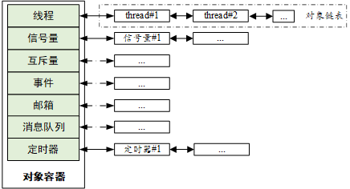

# RTT 学习

[toc]

# 1. 宏

## 1. 编译警告宏

```c
/* compile time assertion */
#define RT_STATIC_ASSERT(name, expn) typedef char _static_assert_##name[(expn)?1:-1]

expn:判断条件;当条件不满足时;数组的长度初始化为-1,即编译报错;
```

用#waring 编译判断更为合理

## 2. 宏过载

```c
#define __MSH_GET_MACRO(_1, _2, _3, _FUN, ...)  _FUN

/**
 * @ingroup msh
 *
 * This macro exports a command to module shell.
 *
 * @param command is the name of the command.
 * @param desc is the description of the command, which will show in help list.
 * @param opt This is an option, enter any content to enable option completion
 */
/* MSH_CMD_EXPORT(command, desc) or MSH_CMD_EXPORT(command, desc, opt) */
#define MSH_CMD_EXPORT(...)                                 \
    __MSH_GET_MACRO(__VA_ARGS__, _MSH_FUNCTION_CMD2_OPT,    \
        _MSH_FUNCTION_CMD2)(__VA_ARGS__)
```

- 这个宏 `__MSH_GET_MACRO`的作用是选择一个函数来调用。它接受五个参数：`_1`，`_2`，`_3`，`_FUN`和 `__VA_ARGS__`，然后返回 `_FUN`。

  `__MSH_GET_MACRO`被用来根据传入的参数数量来选择要调用的函数。具体来说，如果传入的参数数量为2，那么 `_FUN`就是 `_MSH_FUNCTION_CMD2`；如果传入的参数数量为3，那么 `_FUN`就是 `_MSH_FUNCTION_CMD2_OPT`。

  这种技术被称为宏过载，它允许你根据传入的参数数量来选择不同的宏来执行。

  `_FUN`在这里的作用是作为一个占位符，它代表了要调用的函数。

## 3. 宏定义

```c
#define RTM_EXPORT(symbol)                                            \
const char __rtmsym_##symbol##_name[] rt_section(".rodata.name") = #symbol;     \
const struct rt_module_symtab __rtmsym_##symbol rt_section("RTMSymTab")= \
{                                                                     \
    (void *)&symbol,                                                  \
    __rtmsym_##symbol##_name                                          \
};
```

1. `__rtmsym_##symbol##_name`：这是一个字符串常量，存储在 `.rodata.name`段中。
2. `__rtmsym_##symbol`：这是一个 `rt_module_symtab`结构体的实例，存储在 `RTMSymTab`段中(.text)。它包含两个字段：
   - 一个是指向符号的指针。
   - 另一个是指向符号名称的指针。

这个宏定义的目的是为了在运行时能够通过符号的名称查找到符号的地址，实现动态链接和加载模块.

## 4. #undef
- #undef 标识符，用来将前面定义的宏标识符取消定义。

# 2.链接文件

## 2.0. 参考链接

https://home.cs.colorado.edu/~main/cs1300/doc/gnu/ld_toc.html

## 2.1._stext 和 _etext

- stext 和 _etext 符号通常用于表示内核代码段的开始和结束位置。

```c
//定义了一个符号。这个符号的值等于当前的位置计数器（.），也就是 .text 段的起始地址。
_stext = .;
//定义了一个符号。这个符号的值等于当前的位置计数器（.），也就是 .text 段的结束地址。
_etext = .;
```

## 2.2. "."与"*符号作用

```c
SECTIONS
{
  . = 0x10000;
  .text : 
  { 
      *(.text) 
  }
  . = 0x8000000;
  .data : 
  { 
      *(.data) 
  }
  .bss : 
  { 
      *(.bss) 
  }
}
```

- 第一行设置了特殊符号'.'，这是位置计数器。如果您没有以其他方式指定输出部分的地址(稍后将描述其他方式)，则从位置计数器的当前值设置该地址。然后，位置计数器按输出部分的大小递增。在“SECTIONS”命令的开头，位置计数器的值为“0”。
- ' *'是一个通配符，可以匹配任何文件名。表达式 ` *(.text)`表示所有'。所有输入文件中的文本输入节。

| 段名             | 存储属性                                                     | 内存分配 |
| ---------------- | ------------------------------------------------------------ | -------- |
| 代码段 .text | 存放可执行程序的指令，存储态和运行态都有                     | 静态     |
| 数据段 .data     | 存放已初始化（非零初始化的全局变量和静态局部变量）的数据，存储态和运行态都有 | 静态     |
| bss段 .bss       | 存放未初始化（未初始化或者0初始化的全局变量和静态局部变量）的数据，存储态和运行态都有 | 静态     |
| 堆 heap          | 动态分配内存，需要通过malloc手动申请，free手动释放，适合大块内存。容易造成内存泄漏和内存碎片。运行态才有。 | 动态     |
| 栈 stack         | 存放函数局部变量和参数以及返回值，函数返回后，由操作系统立即回收。栈空间不大，使用不当容易栈溢出。运行态才有 | 静态     |

## 2.3.`.linkonce` 段

https://ftp.gnu.org/old-gnu/Manuals/gas/html_node/as_102.html

`.gnu.linkonce.t`是一个链接器区段，用于存放那些只需要链接一次的函数或者符号。区段名称后面通常跟着函数或者符号的名字。关于 `linkonce`的概念，GCC文档给出的解释是：“某些情况下，编译器为了优化而生成的代码项，不必在每一个包含了相同代码的编译单元中都出现。编译器将这些代码项放在 `.linkonce`区段中，链接器在链接时只保留一份。”

`linkonce`区段有几种类型:

- `.gnu.linkonce.b.*`（用于未初始化的全局变量）;
- `.gnu.linkonce.d.*`（用于已初始化的全局变量）;
- `.gnu.linkonce.r.*`（用于常量数据）;
- `.gnu.linkonce.t.*`（用于文本，也就是可执行代码）等。

例如，如果你有一个函数 `foo`，GCC可能将其编译]到 `.gnu.linkonce.t.foo`区段中，如果链接时发现其它对象文件也有 `.gnu.linkonce.t.foo`，那么链接器只会保留其中一份。这主要用于C++中的 `inline`函数或模板函数，通常情况下，每一个使用到这些函数的源文件都会生成一份函数的实例，但是链接时只需要保留一份即可。这样可以减少目标文件的大小，提高链接效率。

## 2.4. KEEP

当使用链接标记不应该消除的部分。这可以通过在输入节的通配符项周围加上' KEEP() '来实现不被优化

## 2.5 ENTRY

程序中执行的第一条指令称为**入口点**。使用 `ENTRY`链接描述文件命令来设置入口点。

有几种方法可以设置入口点。链接器将依次尝试以下方法来设置入口点，当其中一个方法成功时停止:

- the `-e' entry command-line option;
- the `ENTRY(symbol)` command in a linker script;
- the value of the symbol `start`, if defined;
- the address of the first byte of the `.text'`section, if present;
- The address `0`.

## 2.6 PROVIDE

```assembly
PROVIDE(__dtors_end__ = .);
```

- 只有在引用但未定义的情况下，才能使用提供 `PROVIDE`关键字来定义符号;如果 `__dtors_end__`已经被定义，那么 `PROVIDE`语句将被忽略。这对于为某些符号提供默认值很有用。这在考虑构造函数和析构函数列表符号(如' __CTOR_LIST__ ')时尤为重要，因为这些符号通常被定义为通用符号。

## 2.7 AT

`AT`关键字用于指定节（section）在内存中的加载地址。这个地址是物理地址，与链接地址（即节在输出文件中的位置）可能不同。

例如，在 `.data : AT (_sidata)`这行代码中，`.data`节将被加载到内存的 `_sidata`地址处。这通常用于ROM到RAM的复制操作，其中 `_sidata`是在ROM中存储的初始化数据的开始地址。

## 2.8 SORT

在链接脚本中，SORT的作用是对输入的部分进行排序。在你的代码中，SORT(.dtors.*)和* (.dtors)被用来收集所有的析构函数（destructors）。

SORT(.dtors.*)会把所有以.dtors.开头的部分按照字母顺序排序。这在某些情况下是有用的，例如当你想要按照某种特定的顺序执行析构函数时。

* (.dtors)则会把所有以.dtors开头的部分收集起来，但不进行排序。

这两个指令通常一起使用，以确保所有的析构函数都被正确地收集和排序。在你的代码中，析构函数被放在__dtors_start__和__dtors_end__之间，这样在程序结束时，运行时系统就知道从哪里开始调用析构函数，以及在哪里结束。这是一种常见的在C++中管理全局和静态对象生命周期的方法

## 2.9 NOLOAD

- `.RxDecripSection`，`.TxDecripSection`和 `.RxArraySection`都被设置为 `NOLOAD`，这意味着在程序执行时，它们不会被加载到内存中。这通常用于DMA操作，其中硬件需要知道数据的物理地址，而不是由MMU管理的虚拟地址。通常用于DMA配置,例如以太网

# 3. FINSH模块

## 3.1MSH

### 3.1.1初始化

1. 根据链接脚本指明FINSH使用内存空间 `_syscall_table_begin` `_syscall_table_end`的地址

#### 3.1.1.1FSymtab段

```c
        . = ALIGN(4);
        __fsymtab_start = .;
        KEEP(*(FSymTab))
        __fsymtab_end = .;
```

- `__fsymtab_start`和 `__fsymtab_end`用于指明finsh使用内存
- FSymTab用于存放所有注册命令的结构体 `struct finsh_syscall`,包括命令名称,命令选项,命令描述,命令函数执行地址信息

#### 3.1.1.2 宏

```c
/**
 * @ingroup msh
 *
 * This macro exports a command to module shell.
 *
 * @param command is the name of the command.
 * @param desc is the description of the command, which will show in help list.
 * @param opt This is an option, enter any content to enable option completion
 */
/* MSH_CMD_EXPORT(command, desc) or MSH_CMD_EXPORT(command, desc, opt) */
#define MSH_CMD_EXPORT(...)                                 \
    __MSH_GET_MACRO(__VA_ARGS__, _MSH_FUNCTION_CMD2_OPT,    \
        _MSH_FUNCTION_CMD2)(__VA_ARGS__)

#define __MSH_GET_MACRO(_1, _2, _3, _FUN, ...)  _FUN

#define _MSH_FUNCTION_CMD2(a0, a1)       \
        MSH_FUNCTION_EXPORT_CMD(a0, a0, a1, 0)

#define _MSH_FUNCTION_CMD2_OPT(a0, a1, a2)       \
        MSH_FUNCTION_EXPORT_CMD(a0, a0, a1, a0##_msh_options)

#define MSH_FUNCTION_EXPORT_CMD(name, cmd, desc)                      \
                const char __fsym_##cmd##_name[] rt_section(".rodata.name") = #cmd;    \
                const char __fsym_##cmd##_desc[] rt_section(".rodata.name") = #desc;   \
                rt_used const struct finsh_syscall __fsym_##cmd rt_section("FSymTab")= \
                {                           \
                    __fsym_##cmd##_name,    \
                    __fsym_##cmd##_desc,    \
                    (syscall_func)&name     \
                };
```

1. 宏过载语法,选择2个参数使用 `MSH_FUNCTION_CMD2`,`_MSH_FUNCTION_CMD2`的desc为0;3个参数使用 `MSH_FUNCTION_CMD2_OPT`
2. 定义字符串成员,地址定义为.rodata.name;内容为#cmd;

```c
const char __fsym_##cmd##_name[] rt_section(".rodata.name") = #cmd;    \
const char __fsym_##cmd##_desc[] rt_section(".rodata.name") = #desc;   \
```

3. `__fsym_##cmd`存储名称,细节,挂钩的函数指针地址

### 3.1.2遍历FINSH命令

```c
    for (index = _syscall_table_begin;
            index < _syscall_table_end;
            FINSH_NEXT_SYSCALL(index))
    {
  
    }
```

### 3.1.3TAB补全实现

1. 判断输入为 `/t`
2. 将光标移动到行首;使用 `/b`退格,一个个退回删除之前的显示字符
3. 将命令首地址传入 `shell_auto_complete`
4. 计算偏移地址

- `shell_auto_complete`

#### 3.1.3.1 `msh_auto_complete`

1. 首地址为 `/0`,即无输入任何字符串,直接TAB `/t`,则调用 `msh_cmd`输出所有支持的命令
2. 匹配命令名字,并输出命令

```c
        for (index = _syscall_table_begin; index < _syscall_table_end; FINSH_NEXT_SYSCALL(index))
        {
            /* skip finsh shell function */
            cmd_name = (const char *) index->name;
            if (strncmp(prefix, cmd_name, strlen(prefix)) == 0)
            {
                if (min_length == 0)
                {
                    /* set name_ptr */
                    name_ptr = cmd_name;
                    /* set initial length */
                    min_length = strlen(name_ptr);
                }

                length = str_common(name_ptr, cmd_name);
                if (length < min_length)
                    min_length = length;

                rt_kprintf("%s\n", cmd_name);
            }
        }
```

2. 输出提示字符 `msh />`与命令输入的字符串

```c
 rt_kprintf("%s%s", FINSH_PROMPT, prefix);
```

- finsh_get_prompt输出提示

```c
#define FINSH_PROMPT        finsh_get_prompt()

finsh_prompt_custom 用于自定义替换默认提示
finsh_set_prompt("artpi@root");
```

#### 3.1.3.2 `msh_opt_auto_complete`

```c
   argc = msh_get_argc(prefix, &opt_str);
    if (argc)
    {
        opt = msh_get_cmd_opt(prefix);
    }
    else if (!msh_get_cmd(prefix, strlen(prefix)) && (' ' == prefix[strlen(prefix) - 1]))
    {
        opt = msh_get_cmd_opt(prefix);
    }
```

1. `msh_get_argc` 获取命令空格之后参数
2. 没获取到参数时,判断 `prefix`不是一个已知的命令，并且命令行字符串的最后一个字符是空格
3. `msh_get_cmd_opt`获取 `syscall_table`中是否有匹配的命令
4. `argc`为0,输出 `msh_opt_help`所有的命令?
5. `msh_opt_complete`与 `msh_auto_complete`作用相同

### 3.1.4 TAB 子选项自动补全

1. [msh_opt_auto_complete](#3.3.2`msh_opt_auto_complete`)
2. 使用完成命令注册

```c
#define CMD_OPTIONS_STATEMENT(command) static struct msh_cmd_opt command##_msh_options[];
#define CMD_OPTIONS_NODE_START(command) static struct msh_cmd_opt command##_msh_options[] = {
#define CMD_OPTIONS_NODE(_id, _name, _des) {.id = _id, .name = #_name, .des = #_des},
#define CMD_OPTIONS_NODE_END    {0},};


CMD_OPTIONS_NODE_START(vref_temp_get)
CMD_OPTIONS_NODE(1, write, tx data)
CMD_OPTIONS_NODE(2, irq, irq list)
CMD_OPTIONS_NODE(3, speed-test, eth physical speed test)
CMD_OPTIONS_NODE_END
```

## 3.2 SHELL

### 3.2.1 `finsh_system_init`分配finsh结构体使用内存

1. 创建 `finsh_thread_entry`线程
2. 创建信号量,用于阻塞接字符串;信号量由控制台设备对象解除
3. 设置提示模式
4. INIT_APP_EXPORT中调用

### 3.2.2 `finsh_thread_entry`

1. 获取控制台设备对象
2. 获取控制台密码用于密码确认

   - `finsh_wait_auth`
     - 阻塞等待获取密码;密码输入显示 `*`
     - 敲入回车认为密码输入完成
     - 进入密码验证判断;失败线程阻塞等待2S再次获取输入字符
3. 进入控制台线程

   1. `finsh_getchar`

   - `rt_sem_take(&shell->rx_sem, RT_WAITING_FOREVER);`等待信号量释放
     - `finsh_rx_ind`函数中释放信号量

   2. handle control key判断

   ```c
        /*
            * handle control key
            * up key  : 0x1b 0x5b 0x41
            * down key: 0x1b 0x5b 0x42
            * right key:0x1b 0x5b 0x43
            * left key: 0x1b 0x5b 0x44
            */
   ```

   - 上下键:历史命令显示
   - 左右键:移动当前光标
   - tab键 补全命令
   - 删除键:删除
   - 回车键:执行msh命令
4. 设置控制台设备模式

```c
/**
 * @ingroup finsh
 *
 * This function sets the input device of finsh shell.
 *
 * @param device_name the name of new input device.
 */
void finsh_set_device(const char *device_name)
{
    rt_device_t dev = RT_NULL;

    RT_ASSERT(shell != RT_NULL);
    dev = rt_device_find(device_name);
    if (dev == RT_NULL)
    {
        rt_kprintf("finsh: can not find device: %s\n", device_name);
        return;
    }

    /* check whether it's a same device */
    if (dev == shell->device) return;
    /* open this device and set the new device in finsh shell */
    if (rt_device_open(dev, RT_DEVICE_OFLAG_RDWR | RT_DEVICE_FLAG_INT_RX | \
                       RT_DEVICE_FLAG_STREAM) == RT_EOK)
    {
        if (shell->device != RT_NULL)
        {
            /* close old finsh device */
            rt_device_close(shell->device);
            rt_device_set_rx_indicate(shell->device, RT_NULL);
        }

        /* clear line buffer before switch to new device */
        rt_memset(shell->line, 0, sizeof(shell->line));
        shell->line_curpos = shell->line_position = 0;

        shell->device = dev;
        rt_device_set_rx_indicate(dev, finsh_rx_ind);
    }
}
```

### 3.2.3 历史命令显示

1. 回车存入历史命令 `shell_push_history`
2. 上下键显示历史命令 `shell_handle_history`

### 3.2.4 MSH命令执行

## 3.3 cmd&msh_parse&&msh_file

- 一些系统命令的输出
- 一些共用的解析
- 文件系统的命令支持

# 5. 预编译命令

```c
#define __RT_STRINGIFY(x...)        #x
#define RT_STRINGIFY(x...)          __RT_STRINGIFY(x)
#define rt_section(x)               __attribute__((section(x)))
#define rt_used                     __attribute__((used))
#define rt_align(n)                 __attribute__((aligned(n)))
#define rt_weak                     __attribute__((weak))
#define rt_typeof                   __typeof__
#define rt_noreturn                 __attribute__ ((noreturn))
#define rt_inline                   static __inline
#define rt_always_inline            static inline __attribute__((always_inline))
```

- `__RT_STRINGIFY(x...)` 和 `RT_STRINGIFY(x...)`：这两个宏用于将参数转换为字符串。`__RT_STRINGIFY`直接将参数转换为字符串，而 `RT_STRINGIFY`则通过 `__RT_STRINGIFY`间接完成转换，以确保参数先被宏展开再转换为字符串。
- `rt_section(x)`：这个宏用于将特定的函数或变量放入指定的段(section)中。
- `rt_noreturn`：这个宏用于指示函数不会返回。这对于像 `exit()`或 `abort()`这样的函数很有用。

  `rt_noreturn` 是一个函数属性，用于告诉编译器这个函数不会返回到调用者。这个属性可以帮助编译器进行优化。

  在C语言中，大多数函数在完成它们的工作后都会返回到调用者。然而，有些函数，如 `exit()` 或 `abort()`，在被调用后不会返回。这是因为它们会终止程序的执行，或者跳转到其他的执行流程，而不是返回到原来的位置。当编译器看到一个函数被声明为 `noreturn`，它就知道这个函数不会返回到调用者。这样，编译器就可以省略一些针对函数返回的代码生成和优化。例如，编译器可能不需要保存寄存器的值，或者不需要在函数调用后生成一些可能永远不会执行的代码。

## void类型和rt_noreturn类型的区别

`void`类型的函数和带有 `rt_noreturn`属性的函数之间的主要区别在于它们的行为，而不仅仅是它们的返回值。

`void`类型的函数确实没有返回值，但这并不意味着它们不会返回到调用者。当 `void`函数完成其工作后，控制权会返回到调用该函数的代码。

然而，带有 `rt_noreturn`属性的函数永远不会返回到调用者。这意味着一旦调用了这样的函数，程序的控制流就不会回到原来的位置。这对于像 `exit()`或 `abort()`这样的函数来说是非常有用的，因为这些函数在被调用后会终止程序的执行，或者跳转到其他的执行流程。

所以，`rt_noreturn`并不是关于函数的返回值的，而是关于函数是否会返回到调用者。这个属性可以帮助编译器进行更好的优化，因为编译器知道一旦调用了 `rt_noreturn`函数，就不需要生成任何后续的代码。希望这个解释对你有所帮助！

# 6.map文件分析

```assembly
Image$$ER_IROM1$$Base                    0x90000000   Number         0  anon$$obj.o ABSOLUTE
__Vectors                                0x90000000   Data           4  startup_stm32h750xx.o(RESET)
__Vectors_End                            0x90000298   Data           0  startup_stm32h750xx.o(RESET)
__main                                   0x90000299   Thumb Code     0  entry.o(.ARM.Collect$$$$00000000)
_main_stk                                0x90000299   Thumb Code     0  entry2.o(.ARM.Collect$$$$00000001)
_main_scatterload                        0x9000029d   Thumb Code     0  entry5.o(.ARM.Collect$$$$00000004)
__main_after_scatterload                 0x900002a1   Thumb Code     0  entry5.o(.ARM.Collect$$$$00000004)
_main_clock                              0x900002a1   Thumb Code     0  entry7b.o(.ARM.Collect$$$$00000008)
_main_cpp_init                           0x900002a1   Thumb Code     0  entry8b.o(.ARM.Collect$$$$0000000A)
_main_init                               0x900002a1   Thumb Code     0  entry9a.o(.ARM.Collect$$$$0000000B)
__rt_final_cpp                           0x900002a9   Thumb Code     0  entry10a.o(.ARM.Collect$$$$0000000D)
__rt_final_exit                          0x900002a9   Thumb Code     0  entry11a.o(.ARM.Collect$$$$0000000F)
rt_hw_interrupt_disable                  0x900002ad   Thumb Code     8  context_rvds.o(.text)
rt_hw_interrupt_enable                   0x900002b5   Thumb Code     6  context_rvds.o(.text)
rt_hw_context_switch                     0x900002bb   Thumb Code    32  context_rvds.o(.text)
rt_hw_context_switch_interrupt           0x900002bb   Thumb Code     0  context_rvds.o(.text)
PendSV_Handler                           0x900002db   Thumb Code   108  context_rvds.o(.text)
rt_hw_context_switch_to                  0x90000347   Thumb Code    76  context_rvds.o(.text)
rt_hw_interrupt_thread_switch            0x90000393   Thumb Code     2  context_rvds.o(.text)
HardFault_Handler                        0x90000395   Thumb Code    56  context_rvds.o(.text)
MemManage_Handler                        0x90000395   Thumb Code     0  context_rvds.o(.text)
rt_memcpy                                0x900003e9   Thumb Code     0  rt_memcpy_rvds.o(.text)
Reset_Handler                            0x9000060d   Thumb Code     8  startup_stm32h750xx.o(.text)
```

1. Reset_Handler 根据链接脚本设置 `ENTRY(Reset_Handler)`;应为RAM首地址位置;实际并不是

原因:

- 在汇编启动文件中,首先设置了向量表,再设置复位函数

```assembly
; Vector Table Mapped to Address 0 at Reset
    AREA    RESET, DATA, READONLY
    EXPORT  __Vectors
    EXPORT  __Vectors_End
    EXPORT  __Vectors_Size

__Vectors       DCD     __initial_sp                      ; Top of Stack
    DCD     Reset_Handler                     ; Reset Handler
```

- `Reset_Handler `编写中调用 `SystemInit`与 `__main`

```assembly
Reset_Handler    PROC
    	EXPORT  Reset_Handler                    [WEAK]
    IMPORT  SystemInit
    IMPORT  __main

        LDR     R0, =SystemInit
        BLX     R0
        LDR     R0, =__main
        BX      R0
        ENDP
```

- `__main`中执行rtt初始化:https://www.rt-thread.org/document/api/group___system_init.html#details

# 7.汇编.s文件

https://zhuanlan.zhihu.com/p/98888285

## 7.1 汇编指令

### 7.1.1 BX

- BX指令：在ARM汇编语言中，BX指令用于跳转到指令中所指定的目标地址。这个目标地址可以是ARM指令，也可以是Thumb指令。BX指令的格式为：`BX {条件} 目标地址`。这个指令的特点是它可以改变处理器的状态，从ARM状态切换到Thumb状态，或者从Thumb状态切换到ARM状态。这种状态切换的功能使得BX指令在实现子程序调用和处理器工作状态切换时非常有用。

### 7.1.2 LR链接寄存器

- LR链接寄存器：在ARM架构中，链接寄存器（Link Register，简称LR）通常用于存储子程序返回地址。当执行BL（带返回的跳转指令）或BLX（带返回和状态切换的跳转指令）时，处理器会将下一条指令的地址保存到LR中。然后，当子程序执行完毕后，可以通过将LR的内容加载到程序计数器（PC）中，从而返回到调用者。这种机制使得子程序的调用和返回变得非常方便和高效。

- 在用户模式下，LR（或R14）用作链接寄存器，用于存储子程序调用时的返回地址。如果返回地址存储在堆栈上，它也可以用作通用寄存器。

  在异常处理模式中，LR 保存异常的返回地址，或者如果在异常内执行子例程调用，则保存子例程返回地址。如果返回地址存储在堆栈中，LR 可以用作通用寄存器。

### 7.1.4 []的作用

- 在这段ARM汇编代码中，LDR r3, [r2] 是一条加载指令。这条指令的作用是从内存中加载数据。

- r3 和 r2 是寄存器，它们是CPU中用于临时存储数据的小存储区。在这个上下文中，r3 和 r2 只是寄存器的名称，它们没有特殊的含义，只是用于标识这些寄存器。
  [r2] 的含义是：使用 r2 寄存器中的值作为内存地址，从该地址加载数据。[] 的作用是表示间接寻址，也就是说，我们不是直接使用 r2 的值，而是使用 r2 中的值作为一个内存地址，从这个地址中获取数据。
  所以，LDR r3, [r2] 的整体含义是：从内存中的 r2 所指向的地址加载数据，然后将这些数据存储到 r3 寄存器中。这就是这条指令的作用。

### 7.1.4 简单的指令
- LDR: 将地址加载到寄存器中。
- CMP: 比较两个操作数的值。
- BEQ


## 7.2 MSR

- [**MSR指令**](https://zhuanlan.zhihu.com/p/333926905)[[1]](https://zhuanlan.zhihu.com/p/333926905)[[2]](https://blog.csdn.net/wavemcu/article/details/6737302)[[3]](https://blog.csdn.net/qq_43418840/article/details/121407337)[[4]](https://www.cnblogs.com/lifexy/p/7101686.html)：在ARM汇编语言中，MSR（Move to Status Register）指令用于将操作数的内容传送到程序状态寄存器的特定域中。其中，操作数可以为通用寄存器或立即数。MSR指令通常用于恢复或改变程序状态寄存器的内容。例如，当需要修改状态寄存器的内容时，可以通过“读取-修改-写回”指令序列完成。这种操作通常用于切换处理器模式、或者允许/禁止IRQ/FIQ中断等。

## 7.3 PRIMASK寄存器

- [**PRIMASK寄存器**](https://zhuanlan.zhihu.com/p/333926905)[[5]](https://blog.csdn.net/qhdd123/article/details/107207282)[[6]](https://blog.csdn.net/weixin_55672545/article/details/130453893)[[7]](https://bing.com/search?q=PRIMASK+寄存器作用及原理)：在ARM Cortex-M处理器中，PRIMASK寄存器用于控制中断的优先级，允许屏蔽（禁止）特定优先级的中断。PRIMASK寄存器是一个单比特（bit）的寄存器，只有两个有效的取值：0和1。当PRIMASK寄存器的值为0时，表示所有中断都可以触发。当PRIMASK寄存器的值为1时，会禁止所有可屏蔽的中断。这意味着通过设置 PRIMASK 寄存器为 1，可以禁用所有中断，从而实现临界区的保护或者实现禁止中断的功能。

## 7.4.中断启用禁用

```assembly
/*
 * rt_base_t rt_hw_interrupt_disable();
 */
.global rt_hw_interrupt_disable
.type rt_hw_interrupt_disable, %function
rt_hw_interrupt_disable:
//将PRIMASK写入RO寄存器
    MRS     r0, PRIMASK
//设置CPSID为I,用于禁用中断
    CPSID   I
    BX      LR

/*
 * void rt_hw_interrupt_enable(rt_base_t level);
 */
.global rt_hw_interrupt_enable
.type rt_hw_interrupt_enable, %function
rt_hw_interrupt_enable:
//从RO取回PRIMASK
    MSR     PRIMASK, r0
    BX      LR
```

- 由于将PRIMASK的值暂存在r0中，执行临界段代码时r0值会不会改变？

https://club.rt-thread.org/ask/question/d5156cdf3abb63a1.html

## 7.3 HardFault_Handler

```assembly
.global HardFault_Handler
.type HardFault_Handler, %function
HardFault_Handler:
    /* 获取当前上下文 */
    MRS     r0, msp                 /* 从处理程序获取故障上下文 */
    TST     lr, #0x04               /* 如果!EXC_RETURN[2] */
    BEQ     _get_sp_done
    MRS     r0, psp                 /* 从线程获取故障上下文 */
_get_sp_done:

    STMFD   r0!, {r4 - r11}         /* 压入r4 - r11寄存器 */
#if defined (__VFP_FP__) && !defined(__SOFTFP__)
    STMFD   r0!, {lr}               /* 压入标志的占位符 */
#endif
    STMFD   r0!, {lr}               /* 压入exec_return寄存器 */

    TST     lr, #0x04               /* 如果!EXC_RETURN[2] */
    BEQ     _update_msp
    MSR     psp, r0                 /* 更新堆栈指针到PSP */
    B       _update_done
_update_msp:
    MSR     msp, r0                 /* 更新堆栈指针到MSP */
_update_done:

    PUSH    {LR}
    BL      rt_hw_hard_fault_exception  /* 调用硬件故障异常处理函数 */
    POP     {LR}

    ORR     lr, lr, #0x04
    BX      lr  /* 返回 */

```


# 8.RTT系统初始化

## 8.1 `rtthread_startup`

1. 中断禁用
2. 板级初始化

## 8.2 rt_hw_board_init

1. I/D cache初始化
2. 时钟初始化
3. 外设时钟初始化
4. 堆初始化 `rt_system_heap_init`
5. 组件初始化 `rt_components_board_init`,初始化板级驱动

## 8.3 INIT_EXPORT

```c
/*
 * Components Initialization will initialize some driver and components as following
 * order:
 * rti_start         --> 0
 * BOARD_EXPORT      --> 1
 * rti_board_end     --> 1.end
 *
 * DEVICE_EXPORT     --> 2
 * COMPONENT_EXPORT  --> 3
 * FS_EXPORT         --> 4
 * ENV_EXPORT        --> 5
 * APP_EXPORT        --> 6
 *
 * rti_end           --> 6.end
 *
 * These automatically initialization, the driver or component initial function must
 * be defined with:
 * INIT_BOARD_EXPORT(fn);
 * INIT_DEVICE_EXPORT(fn);
 * ...
 * INIT_APP_EXPORT(fn);
 * etc.
 */
```

1. 根据编译后 `Image Symbol Table`中顺序执行

```c
   	__rt_init_rti_start                      0x900621a4   Data           4  components.o(.rti_fn.0)
    __rt_init_rti_board_start                0x900621a8   Data           4  components.o(.rti_fn.0.end)
    __rt_init_vtor_config                    0x900621ac   Data           4  board.o(.rti_fn.1)
    __rt_init_mpu_init                       0x900621b0   Data           4  drv_mpu.o(.rti_fn.1)
    __rt_init_rt_hw_spi_init                 0x900621b4   Data           4  drv_spi.o(.rti_fn.1)
    __rt_init_SDRAM_Init                     0x900621b8   Data           4  drv_sdram.o(.rti_fn.1)
    __rt_init_rt_wdt_init                    0x900621bc   Data           4  drv_wdt.o(.rti_fn.1)
    __rt_init_rt_usbd_class_list_init        0x900621c0   Data           4  usbdevice.o(.rti_fn.1)
    __rt_init_ulog_init                      0x900621c4   Data           4  ulog.o(.rti_fn.1)
    __rt_init_rti_board_end                  0x900621c8   Data           4  components.o(.rti_fn.1.end)
    __rt_init_rt_mmcsd_core_init             0x900621cc   Data           4  mmcsd_core.o(.rti_fn.2)
    __rt_init_dfs_init                       0x900621d0   Data           4  dfs.o(.rti_fn.2)
    __rt_init_rt_usbd_msc_class_register     0x900621d4   Data           4  mstorage.o(.rti_fn.2)
    __rt_init_ulog_console_backend_init      0x900621d8   Data           4  console_be.o(.rti_fn.2)
    __rt_init_ulog_async_init                0x900621dc   Data           4  ulog.o(.rti_fn.2)
    __rt_init_ulog_console_backend_filter_init 0x900621e0   Data           4  ulog_file_be.o(.rti_fn.3)
    __rt_init_adc_init                       0x900621e4   Data           4  user_adc.o(.rti_fn.3)
    __rt_init_rt_cm_backtrace_init           0x900621e8   Data           4  cmb_port.o(.rti_fn.3)
    __rt_init_stm_usbd_register              0x900621ec   Data           4  drv_usbd.o(.rti_fn.3)
    __rt_init_rt_hw_sdio_init                0x900621f0   Data           4  drv_sdmmc.o(.rti_fn.3)
    __rt_init_rt_hw_rtc_init                 0x900621f4   Data           4  drv_rtc.o(.rti_fn.3)
    __rt_init_set_finsh_irq                  0x900621f8   Data           4  board.o(.rti_fn.4)
    __rt_init_rtc_update_init                0x900621fc   Data           4  board.o(.rti_fn.4)
    __rt_init_elm_init                       0x90062200   Data           4  dfs_elm.o(.rti_fn.4)
    __rt_init_dfs_romfs_init                 0x90062204   Data           4  dfs_romfs.o(.rti_fn.4)
    __rt_init_dfs_lfs_init                   0x90062208   Data           4  dfs_lfs.o(.rti_fn.4)
    __rt_init_syswatch_init                  0x9006220c   Data           4  syswatch.o(.rti_fn.4)
    __rt_init_utest_init                     0x90062210   Data           4  utest.o(.rti_fn.4)
    __rt_init_rt_flash_init                  0x90062214   Data           4  spi_flash_init.o(.rti_fn.5)
    __rt_init_mfbd_init                      0x90062218   Data           4  bsp_key.o(.rti_fn.6)
    __rt_init_User_Led_Init                  0x9006221c   Data           4  user_led.o(.rti_fn.6)
    __rt_init_pvd_init                       0x90062220   Data           4  board.o(.rti_fn.6)
    __rt_init_uart1_init                     0x90062224   Data           4  user_uart1.o(.rti_fn.6)
    __rt_init_cpu_usage_init                 0x90062228   Data           4  cpu_usage.o(.rti_fn.6)
    __rt_init_finsh_system_init              0x9006222c   Data           4  shell.o(.rti_fn.6)
    __rt_init_rti_end                        0x90062230   Data           4  components.o(.rti_fn.6.end)
```

## 8.4 rt_system_timer_init

# 9. 内存管理

https://www.rt-thread.org/document/site/#/rt-thread-version/rt-thread-standard/programming-manual/memory/memory

## 9.1 初始化

1. `rt_system_heap_init`

- 对堆开始地址与结束地址进行内存对齐
- 在ART-PI中将所有剩余ROM划分给堆使用
- 断言堆设置是否正常
- 根据配置的内存策略 使用 `_MEM_INIT`
- 初始化多线程争用锁

## 9.2 小内存管理算法

- 小内存算法在分配内存的时候，随着内存碎片的增多，分配速度会越来越慢，当总的内存太大的时候，内存碎片的数量可能会更多，此时这种算法就会变得不再适用。
- 小内存管理算法主要针对系统资源比较少，一般用于小于 2MB 内存空间的系统
- 每个内存对象的起始12字节不可使用,设置为堆系统的配置

```c
//这是一个掩码，用于将内存地址的最低位清零。在 RTT 的内存管理中，内存块的地址的最低位被用作标记该内存块是否被使用。
#define MEM_MASK             0xfffffffe
//这个宏用于标记内存块 _mem 为已使用。它首先使用 MEM_MASK 将 _mem 的最低位清零，然后将最低位设置为 1，表示该内存块已被使用。
#define MEM_USED(_mem)       ((((rt_base_t)(_mem)) & MEM_MASK) | 0x1)
#define MEM_FREED(_mem)      ((((rt_base_t)(_mem)) & MEM_MASK) | 0x0)
//这将使用 ~MEM_MASK（即 MEM_MASK 的按位取反）与 pool_ptr 进行按位与操作。由于 MEM_MASK 的最低位是 0，所以 ~MEM_MASK 的最低位是 1。这意味着这个操作将提取出 pool_ptr 的最低位，即内存块的使用状态标记。
#define MEM_ISUSED(_mem)   \
                      (((rt_base_t)(((struct rt_small_mem_item *)(_mem))->pool_ptr)) & (~MEM_MASK))
```


### 9.2.1 `rt_smem_init`

1. 内存对齐
2. 内存大小计算;至少需要满足两个 `struct rt_small_mem_item`结构体;因为堆起始与结束各有一个结构体

```c
/* 初始化堆起始位置内存对象*/
struct rt_small_mem_item *mem;
mem        = (struct rt_small_mem_item *)small_mem->heap_ptr;//堆起始位置初始化
mem->pool_ptr = MEM_FREED(small_mem);//小内存堆对象地址 设置为释放
mem->next  = small_mem->mem_size_aligned + SIZEOF_STRUCT_MEM;//下一个内存对象设置到堆结尾内存对象
mem->prev  = 0;//上一个对象为空
//写入堆起始位置分配的内存名称
rt_smem_setname(mem, "INIT");

/* 堆大小 */
small_mem->mem_size_aligned = mem_size;
/* 指向堆的起始地址 */
small_mem->heap_ptr = (rt_uint8_t *)begin_align;
/* 初始化指向堆开始的最低空闲指针*/
small_mem->lfree = (struct rt_small_mem_item *)small_mem->heap_ptr;

//初始化堆结束内存对象性
small_mem->heap_end        = (struct rt_small_mem_item *)&small_mem->heap_ptr[mem->next];//初始化设置为堆起始地址的下一个内存对象为堆结束地址
small_mem->heap_end->pool_ptr = MEM_USED(small_mem);//设置为使用
small_mem->heap_end->next  = small_mem->mem_size_aligned + SIZEOF_STRUCT_MEM;//下一个设置为自身
small_mem->heap_end->prev  = small_mem->mem_size_aligned + SIZEOF_STRUCT_MEM;//上一个设置为自身

//写入堆结束位置分配的内存名称
rt_smem_setname(small_mem->heap_end, "INIT");
```

### 9.2.2 alloc分配

- 使用_MEM_MALLOC,操作 `system_heap`

```c
rt_size_t ptr;
//从当前的空闲内存块开始，遍历整个内存池，直到找到一个足够大的内存块或者遍历完整个内存池
for (ptr = (rt_uint8_t *)small_mem->lfree - small_mem->heap_ptr;
     ptr <= small_mem->mem_size_aligned - size;
     ptr = ((struct rt_small_mem_item *)&small_mem->heap_ptr[ptr])->next)
{
    //查找未使用的内存且满足大小的区域
    if ((!MEM_ISUSED(mem)) && (mem->next - (ptr + SIZEOF_STRUCT_MEM)) >= size)
    {
        //获取当前内存块的地址。
        mem = (struct rt_small_mem_item *)&small_mem->heap_ptr[ptr];
        //* 如果当前内存块足够大，那么可以将其分割成两个部分，一个用于分配，另一个保留为新的空闲内存块 */
        if (mem->next - (ptr + SIZEOF_STRUCT_MEM) >=
                    (size + SIZEOF_STRUCT_MEM + MIN_SIZE_ALIGNED))
        {
                /* 创建新的空闲内存块 */
                ptr2 = ptr + SIZEOF_STRUCT_MEM + size;
                mem2       = (struct rt_small_mem_item *)&small_mem->heap_ptr[ptr2];
                mem2->pool_ptr = MEM_FREED(small_mem);
                mem2->next = mem->next;
                mem2->prev = ptr;

                /* 更新当前内存块的next指针，使其指向新的空闲内存块 */
                mem->next = ptr2;

                /* 如果新的空闲内存块不是最后一个内存块，那么更新下一个内存块的prev指针，使其指向新的空闲内存块 */
                if (mem2->next != small_mem->mem_size_aligned + SIZEOF_STRUCT_MEM)
                    ((struct rt_small_mem_item *)&small_mem->heap_ptr[mem2->next])->prev = ptr2;

                /* 更新已使用的内存大小和最大使用内存大小 */
                small_mem->parent.used += (size + SIZEOF_STRUCT_MEM);
                if (small_mem->parent.max < small_mem->parent.used)
                    small_mem->parent.max = small_mem->parent.used;
        }
        else
        {
            /* 更新已使用的内存大小 */
            small_mem->parent.used += mem->next - ((rt_uint8_t *)mem - small_mem->heap_ptr);
            if (small_mem->parent.max < small_mem->parent.used)
                small_mem->parent.max = small_mem->parent.used;
        }
        /* 设置当前分配内存为使用中 */
        mem->pool_ptr = MEM_USED(small_mem);
        //线程分配的设置线程名称
        if (rt_thread_self())
            rt_smem_setname(mem, rt_thread_self()->parent.name);
        else
            //中断分配设置为NONE
            rt_smem_setname(mem, "NONE");
        //如果使用的是已经分配到的最大堆地址
        if (mem == small_mem->lfree)
        {
            /* 在内存之后找到下一个空闲块并更新最低空闲指针 */
            while (MEM_ISUSED(small_mem->lfree) && small_mem->lfree != small_mem->heap_end)
                small_mem->lfree = &small_mem->heap_ptr[small_mem->lfree->next];
        }
    }
}
```

1. 第一次分配内存时

```c
ptr = 0;
mem = (struct rt_small_mem_item *)&small_mem->heap_ptr[0];//第一个内存对象
//* 如果当前内存块足够大，那么可以将其分割成两个部分，一个用于分配，另一个保留为新的空闲内存块 */
if (mem->next - (ptr + SIZEOF_STRUCT_MEM) >=
    (size + SIZEOF_STRUCT_MEM + MIN_SIZE_ALIGNED))
{
    mem2->next = mem->next;//mem2指向堆末尾
    mem2->prev = ptr;//上一个指向堆起始
    mem->next = ptr2;//堆起始的下一个更新为mem2
  
    /* 如果新的空闲内存块不是最后一个内存块，那么更新下一个内存块的prev指针，使其指向新的空闲内存块 */
    if (mem2->next != small_mem->mem_size_aligned + SIZEOF_STRUCT_MEM)
    {
        //堆结尾的内存对象的上一个对象设置为mem2
        ((struct rt_small_mem_item *)&small_mem->heap_ptr[mem2->next])->prev = ptr2;  
    }

}
```

2. 再一次分配内存时,如果分配后剩余的内存空间不够再开辟一个内存对象时

```c
            /* 更新已使用的内存大小 */
            small_mem->parent.used += mem->next - ((rt_uint8_t *)mem - small_mem->heap_ptr);
            if (small_mem->parent.max < small_mem->parent.used)
                small_mem->parent.max = small_mem->parent.used;
```

### 9.2.3 realloc

```c
if (newsize + SIZEOF_STRUCT_MEM + MIN_SIZE < size)//当前内存块大小满足可分配区域
{
    /*分割内存块*/
    small_mem->parent.used -= (size - newsize);

    ptr2 = ptr + SIZEOF_STRUCT_MEM + newsize;
    mem2 = (struct rt_small_mem_item *)&small_mem->heap_ptr[ptr2];
    mem2->pool_ptr = MEM_FREED(small_mem);
    mem2->next = mem->next;
    mem2->prev = ptr;
    //合并相邻的未使用内存区域
    plug_holes(small_mem, mem2);
} else {
    /*扩展内存*/
    nmem = rt_smem_alloc(&small_mem->parent, newsize);
    if (nmem != RT_NULL) /* check memory */
    {
        rt_memcpy(nmem, rmem, size < newsize ? size : newsize);
        //释放原使用内存
        rt_smem_free(rmem);
    }
}
```

### 9.2.4 plug_holes

- 处理内存碎片的。它试图通过合并相邻的未使用的内存块（称为“空洞”）来减少内存碎片。这个过程被称为“填充空洞”
- 获取前一个内存项,尝试合并;获取后一个尝试合并

### 9.2.5 free

- 当前地址设置为未使用
- 写入内存使用为空rt_smem_setname(mem, "   ");
- plug_holes

## 9.3 slab 管理算法

- slab 内存管理算法则主要是在系统资源比较丰富时，提供了一种近似多内存池管理算法的快速算法

```
Linux目前为其“slab”分配器提供了三种选择:
Slab是最初的，基于Bonwick的开创性论文，从Linux内核2.2版开始就可以使用。它忠实地实现了Bonwick的建议，并在Bonwick的后续论文中描述了多处理器的变化。
Slub是下一代替代内存分配器，自2.6.23以来一直是Linux内核中的默认配置。它继续使用基本的“slab”模型，但修复了slab设计中的几个缺陷，特别是在具有大量处理器的系统上。Slub比较简单
SLOB (Simple List Of Blocks)是一种内存分配器，针对内存非常少的嵌入式系统进行了优化——以兆字节为数量级。它在一个块列表上应用一个非常简单的首次拟合算法，这与旧的k&r风格的堆分配器没有什么不同。在消除内存分配器中几乎所有的溢出时，SLOB非常适合具有极端内存限制的系统，但是它不提供第1节中描述的任何好处，并且可能遭受病态碎片。
```

- 1.静态内存池管理。

  2.针对小内存块的分配管理（小内存管理算法）

  3.针对大内存块的管理算法（SLAB管理算法）

  前面两篇已经把第1，2种算法看了，现在就来看看第三种算法，第三种算法主要是针对大内存使用的。第二种，小内存算法在分配内存的时候，随着内存碎片的增多，分配速度会越来越慢，当总的内存太大的时候，内存碎片的数量可能会更多，此时这种算法就会变得不再适用。

  SLAB在我看来就是前两种算法的融合。
- https://club.rt-thread.org/ask/question/438bfc8cfd626cc2.html

```c
struct rt_slab
{
    struct rt_memory            parent;                         /**< inherit from rt_memory */
    rt_ubase_t                  heap_start;                     /**< memory start address */
    rt_ubase_t                  heap_end;                       /**< memory end address */

struct rt_slab_memusage
{
    rt_uint32_t     type: 2 ;               /**< page type */
    rt_uint32_t     size: 30;               /**< pages allocated or offset from zone */
};
    struct rt_slab_memusage    *memusage;						/*内存信息存放 类型+索引*/
    struct rt_slab_zone        *zone_array[RT_SLAB_NZONES];     /* linked list of zones NFree > 0 */
    struct rt_slab_zone        *zone_free;                      /* whole zones that have become free */
    rt_uint32_t                 zone_free_cnt;
    rt_uint32_t                 zone_size;
    rt_uint32_t                 zone_limit;
    rt_uint32_t                 zone_page_cnt;
    struct rt_slab_page        *page_list;
};

/*
 * slab page allocator
 * 页大小及分配信息
 */
struct rt_slab_page
{
    struct rt_slab_page *next;      /**< next valid page */
    rt_size_t page;                 /**< number of page  */

    /* dummy */
    char dummy[RT_MM_PAGE_SIZE - (sizeof(struct rt_slab_page *) + sizeof(rt_size_t))];
};
```

### 9.3.1 初始化

- page初始化,按页释放内存

  - 开始地址的page写入所有内存的页数
  - 下一个指向页对象为NULL
  - slab->page_list指向开始地址
- 计算zone大小:zone翻倍 比 最小数量 /1024小,则翻倍zone

```c
/* calculate zone size */
slab->zone_size = ZALLOC_MIN_ZONE_SIZE;
while (slab->zone_size < ZALLOC_MAX_ZONE_SIZE && (slab->zone_size << 1) < (limsize / 1024))
    slab->zone_size <<= 1;
```

- rt_slab_page_alloc 了 内存信息存放的空间 npage*内存信息结构体

### 9.3.2 页内存释放

```c
void rt_slab_page_free(rt_slab_t m, void *addr, rt_size_t npages)
{
    struct rt_slab_page *b, *n;
    struct rt_slab_page **prev;
    struct rt_slab *slab = (struct rt_slab *)m;

    // 确保地址不为空，地址是内存页大小的倍数，且页数不为0
    RT_ASSERT(addr != RT_NULL);
    RT_ASSERT((rt_ubase_t)addr % RT_MM_PAGE_SIZE == 0);
    RT_ASSERT(npages != 0);

    // 将地址转换为rt_slab_page结构体
    n = (struct rt_slab_page *)addr;

    // 遍历slab的页面列表
    for (prev = &slab->page_list; (b = *prev) != RT_NULL; prev = &(b->next))
    {
        // 确保页面数量大于0，且当前页面在释放的页面之后或不重叠
        RT_ASSERT(b->page > 0);
        RT_ASSERT(b > n || b + b->page <= n);

        // 如果当前页面紧邻释放的页面
        if (b + b->page == n)
        {
            //如果当前页面刚好满足释放,则进行合并
            if (b + (b->page += npages) == b->next)
            {
                b->page += b->next->page;
                b->next  = b->next->next;
            }
            return;
        }

        // 如果当前页面刚好满足释放要求,则进行合并
        if (b == n + npages)
        {
            n->page = b->page + npages;
            n->next = b->next;
            *prev   = n;
            return;
        }

        // 如果当前页面比所需的内存页来的大,则退出
        if (b > n + npages)
            break;
    }

    //写入页面信息与下一个节点
    n->page = npages;
    n->next = b;
    //上一个节点指向当前页面
    *prev   = n;
}
```

### 9.3.3 页内存分配

```c

    // 遍历slab的page_list
    for (prev = &slab->page_list; (b = *prev) != RT_NULL; prev = &(b->next))
    {
        // 如果b的页数大于npages
        if (b->page > npages)
        {
            // 分割页面
            n       = b + npages;
            n->next = b->next;
            n->page = b->page - npages;
            *prev   = n;
            break;
        }

        // 如果b的页数等于npages
        if (b->page == npages)
        {
            // 这个节点适合，移除这个节点
            *prev = b->next;
            break;
        }
    }
```

### 9.3.5 malloc

#### 9.3.5.1 大内存

- 直接处理大量分配 ,直接分配

#### 9.3.5.2小内存

```c
/*
 * 计算分配请求大小的区域索引，并将分配请求大小设置为该区域的块大小。
 */
rt_inline int zoneindex(rt_size_t *bytes)
{
    /* 无符号整数用于位移操作 */
    rt_ubase_t n = (rt_ubase_t)(*bytes);

    if (n < 128)
    {
        /* 对齐到8字节，并计算区域索引 */
        *bytes = n = (n + 7) & ~7;
        return (n / 8 - 1);
    }
    if (n < 256)
    {
        /* 对齐到16字节，并计算区域索引 */
        *bytes = n = (n + 15) & ~15;
        return (n / 16 + 7);
    }
    /* 对于更大的内存请求，使用更大的对齐单位，并计算相应的区域索引 */
    if (n < 8192)
    {
        /* ...省略部分代码... */
    }
    if (n < 16384)
    {
        /* 对齐到1024字节，并计算区域索引 */
        *bytes = n = (n + 1023) & ~1023;
        return (n / 1024 + 55);
    }

    /* 如果内存请求大小超出预期，打印错误信息 */
    rt_kprintf("Unexpected byte count %d", n);

    return 0;
}
```

##### 9.3.5.2 没有分配过或者用光了

1. 该zone没有被使用过

   - 从页面分配一个区域,设置内存信息 `memusage`的类型与索引,设置zone空间信息
   - 计算块地址,链接到zone数组中
2. 该zone被使用过

   - 直接分配,从zone_free中移除

##### 9.3.5.3 有zone数组

1. 分配完了,从zone数组中移除
2. 可分配,执行分配
3. 没有可分配空间

   - 在空闲块列表中查找(free的时候分配)
   - 从空闲块列表中删除此块

### 9.3.6 free

#### 9.3.6.1 大内存释放

- 直接释放,size设置为0

#### 9.3.6.2 小内存释放

- 将内存设置标识下一个free块节点为free块
- 将当前free块设置为当前内存
- 如果zone释放后可以提供分配了,添加回zone数组中
- 如果该区域完全空闲，并且我们可以从其他区域进行分配，则将该区域移到FreeZones列表中
  - **空闲区域计数和释放**：每当一个区域被移动到空闲区域列表中，空闲区域的计数（`slab->zone_free_cnt`）就会增加。如果空闲区域的数量超过了设定的阈值（`ZONE_RELEASE_THRESH`），那么就会释放一个区域到页面分配器。
  - **页面的释放**：在释放区域到页面分配器之前，会设置每个页面的使用情况（`kup->type = PAGE_TYPE_FREE; kup->size = 0;`）。然后，调用 `rt_slab_page_free()`函数来释放这些页面。

## 9.4 memheap 管理算法

- memheap 方法适用于系统存在多个内存堆的情况，它可以将多个内存 “粘贴” 在一起，形成一个大的内存堆，用户使用起来会非常方便

### 9.4.1 init

- 计算可用大小
- 设置信息
- 设置链表

### 9.4.2 alloc

- 可用分配
- 从链表中寻找可分配的内存
  1. 寻找到可分配的内存,分割进行分配
  2. 找不到;继续从最后一个内存往后分配

### 9.4.3 free

- 释放
- 查找是否可以与临近的内存合并,进行合并

## 9.5 malloc&&realloc分配

1. 线程中使用加锁,中断中使用不加锁
2. _MEM_MALLOC 调用不同内存算法的malloc
3. 解锁
4. 调用malloc call函数

## 9.6 TLSF 内存管理算法

> https://www.cnblogs.com/pwl999/p/15534968.html

### 9.6.1 堆初始化
1. 创建内存池
- 清空结构体信息
2. 添加内存池
- 传递给给定内存块中的 `TLSF` 结构的开销`tlsf_add_pool`，等于空闲块的开销和哨兵块。
- 创建主要空闲块。稍微偏移块的起点以便 `prev_phys_block` 字段落在池之外它永远不会被使用。

> 使用`const`的原因有很多：**提高代码的可读性**：`const`关键字告诉读代码的人这个变量的值不会改变，这有助于理解代码的行为。**防止误操作**：在函数的其余部分，如果你试图改变`oldsize`的值，编译器会报错，因此可以防止因误操作而导致的错误。**优化性能**：编译器知道`const`变量的值不会改变，可能会进行一些优化。

- 设置块的大小,并设置该块为未使用,设置下一个块为使用中

```c
const size_t oldsize = block->size;
//保留原有的oldsize使用标志不变的情况下,设置新的size
block->size = size | (oldsize & (block_header_free_bit | block_header_prev_free_bit));
```

- 插入新的块

```c
static void mapping_insert(size_t size, int *fli, int *sli)
{
    int fl, sl;
    if (size < SMALL_BLOCK_SIZE) // 如果大小小于小块的大小
    {
        /* Store small blocks in first list. */
        fl = 0; // 第一级索引设置为0
        sl = tlsf_cast(int, size) / (SMALL_BLOCK_SIZE / SL_INDEX_COUNT); // 第二级索引根据大小和小块的数量进行计算
    }
    else // 如果大小大于或等于小块的大小
    {
        fl = tlsf_fls_sizet(size); // 使用位操作找到最高位的1，也就是第一级索引
        sl = tlsf_cast(int, size >> (fl - SL_INDEX_COUNT_LOG2)) ^ (1 << SL_INDEX_COUNT_LOG2); // 使用位操作计算第二级索引
        fl -= (FL_INDEX_SHIFT - 1); // 调整第一级索引，使其从0开始
    }
    *fli = fl; // 返回第一级索引
    *sli = sl; // 返回第二级索引
}
```

- 分割块以创建零大小的哨兵块

### 9.6.2 添加堆
- 根据地址添加池
- 添加当前堆到链表中

### 9.6.3 malloc


# 10. 系统定时器

## 10.1 跳跃表

- 跳跃表是一种“随机”的数据结构，在很大的可能性下，它会得到O(log(N))的时间复杂度，而旧的列表得到O(N)。此外，当将RT_TIMER_SKIP_LIST_LEVEL设置为1时，它将与旧的双链表相同，无论是时间还是空间复杂性。基准测试表明，当RT_TIMER_SKIP_LIST_LEVEL为3时，当有100个计时器时，随机插入新计时器的平均时间比旧计时器快2倍，当有200个计时器时快3倍。但是，它恢复已弃用的函数rt_system_timer_init。bsp必须在系统启动时调用它。

#### [定时器跳表 (Skip List) 算法](https://www.rt-thread.org/document/site/#/rt-thread-version/rt-thread-standard/programming-manual/timer/timer?id=定时器跳表-skip-list-算法)

在前面介绍定时器的工作方式的时候说过，系统新创建并激活的定时器都会按照以超时时间排序的方式插入到 rt_timer_list 链表中，也就是说 t_timer_list 链表是一个有序链表，RT-Thread 中使用了跳表算法来加快搜索链表元素的速度。

跳表是一种基于并联链表的数据结构，实现简单，插入、删除、查找的时间复杂度均为 O(log n)。跳表是链表的一种，但它在链表的基础上增加了 “跳跃” 功能，正是这个功能，使得在查找元素时，跳表能够提供 O(log n)的时间复杂度，举例如下：

一个有序的链表，如下图所示，从该有序链表中搜索元素 {13, 39}，需要比较的次数分别为 {3, 5}，总共比较的次数为 3 + 5 = 8 次。


使用跳表算法后可以采用类似二叉搜索树的方法，把一些节点提取出来作为索引，得到如下图所示的结构：


在这个结构里把 {3, 18,77} 提取出来作为一级索引，这样搜索的时候就可以减少比较次数了, 例如在搜索 39 时仅比较了 3 次（通过比较 3，18，39)。当然我们还可以再从一级索引提取一些元素出来，作为二级索引，这样更能加快元素搜索。


所以，定时器跳表可以通过上层的索引，在搜索的时候就减少比较次数，提升查找的效率，这是一种通过 “空间来换取时间” 的算法，在 RT-Thread 中通过宏定义 RT_TIMER_SKIP_LIST_LEVEL 来配置跳表的层数，默认为 1，表示采用一级有序链表图的有序链表算法，每增加一，表示在原链表基础上增加一级索引。

## 10.2 硬件定时器

- HARD_TIMER 模式的定时器超时函数在中断上下文环境中执行，可以在初始化 / 创建定时器时使用参数 RT_TIMER_FLAG_HARD_TIMER 来指定。

  在中断上下文环境中执行时，对于超时函数的要求与中断服务例程的要求相同：执行时间应该尽量短，执行时不应导致当前上下文挂起、等待。例如在中断上下文中执行的超时函数它不应该试图去申请动态内存、释放动态内存等。

  RT-Thread 定时器默认的方式是 HARD_TIMER 模式，即定时器超时后，超时函数是在系统时钟中断的上下文环境中运行的。在中断上下文中的执行方式决定了定时器的超时函数不应该调用任何会让当前上下文挂起的系统函数；也不能够执行非常长的时间，否则会导致其他中断的响应时间加长或抢占了其他线程执行的时间。

### 10.2.1 初始化&&删除

- 初始化

  - 动态分配,malloc定时器结构体 || 静态分配,外部分配
  - 设置相关参数
  - init tick;timeout = 0;
  - 初始化跳跃表链表
- 删除

  - 移除跳跃表链表
  - 从系统移除该对象

### 10.2.2 start

- 获取链表

#### 10.2.2.1 线程定时器

- 调度上锁
- 从定时器计算线程结构体地址
- 标识线程定时器启动
- 调度解锁

#### 10.2.2.2 定时器开始处理

- 当前正在执行超时处理函数,退出;(超时函数执行后会再次运行开始函数)
- 移除跳跃表定时器
- 定时器状移除激活状态
- 计算超时tick
- 提取跳表索引到_timer_list中

```c
row_head[0]  = &timer_list[0];
//遍历每一层的定时器列表
for (row_lvl = 0; row_lvl < RT_TIMER_SKIP_LIST_LEVEL; row_lvl++)
{
    //当前层中，遍历定时器列表，直到 row_head 指向当前层的最后一个定时器。
    for (; row_head[row_lvl] != timer_list[row_lvl].prev;
         row_head[row_lvl]  = row_head[row_lvl]->next)
    {
        struct rt_timer *t;
        rt_list_t *p = row_head[row_lvl]->next;

        /* 获取当前节点定时器的指针，并将其转换为 rt_timer 结构体类型。 */
        t = rt_list_entry(p, struct rt_timer, row[row_lvl]);

        //如果我们有两个定时器同时超时，最好是先插入的定时器被提前调用。因此，将新的计时器插入到some-timeout计时器列表的末尾。
        //当前节点定时器的超时时间和需要开启的定时器超时时间相同，继续遍历。
        if ((t->timeout_tick - timer->timeout_tick) == 0)
        {
            continue;
        }
        //如果当前节点定时器比需要开启的定时器超时时间还长,退出
        else if ((t->timeout_tick - timer->timeout_tick) < RT_TICK_MAX / 2)
        {
            break;
        }
    }
    //将提取的索引更新至_timer_list中
    if (row_lvl != RT_TIMER_SKIP_LIST_LEVEL - 1)
        row_head[row_lvl + 1] = row_head[row_lvl] + 1;

	/*这个简单的计数器可以很好地均匀分布列表高度。通过使用tst_nr的最低有效位，它确保定时器被插入到不同的级别，从而实现平衡分布。目标是避免具有相似超时节拍的计时器聚类*/
    //每次插入定时器时，计数器会递增。这个计数器的作用是在跳表中决定新的定时器节点应该插入到哪一层。
    random_nr++;
    tst_nr = random_nr;
	//将新的定时器节点插入到系统定时器列表的最后一层
    rt_list_insert_after(row_head[RT_TIMER_SKIP_LIST_LEVEL - 1],
                         &(timer->row[RT_TIMER_SKIP_LIST_LEVEL - 1]));
    //从第二层开始，遍历每一层的定时器列表。
    for (row_lvl = 2; row_lvl <= RT_TIMER_SKIP_LIST_LEVEL; row_lvl++)
    {
        //在相应级别的节点后插入计时器。 
        //RT_TIMER_SKIP_LIST_MASK = 3;1~3 ,5~7,9~11这样添加
        if (!(tst_nr & RT_TIMER_SKIP_LIST_MASK))
            rt_list_insert_after(row_head[RT_TIMER_SKIP_LIST_LEVEL - row_lvl],
                                 &(timer->row[RT_TIMER_SKIP_LIST_LEVEL - row_lvl]));
        else
            break;
        //tst_nr右移以测试下一位
        tst_nr >>= (RT_TIMER_SKIP_LIST_MASK + 1) >> 1;
    }
}
```

### 10.2.3 删除定时器&&STOP

- 从定时器链表中剔除
- 从object对象中剔除

## 10.2 软件定时器

### 10.2.1 系统定时器线程

1. 初始化跳表链表
2. 信号量初始化,挂起线程按优先级排队恢复
3. 线程初始化并启动,优先级4,时间片10;(FREERTOS的时间片长度不可设置,1个时间片执行一次切换)

#### 10.2.1.1 _timer_thread_entry

1. 进入前设置信号量最大获取次数为1,二值信号量
2. 进入后 : 获取最近的超时时间
   - 当前定时器链表为空,说明没有定时器启动; -> 信号量阻塞该线程,直到定时器启动释放信号量
   - 不为空则返回最近的超时时间
3. 获取当前tick
4. 计算下一次定时器到达超时时间,使用信号量阻塞到该时间
5. 阻塞结束后执行超时检测

### 10.2.3软件定时器启动

1.  信号量在启动时释放;
2. 目的:如果定时器线程发现当前没有正在执行的定时器链表,则会进入RT_WAITING_FOREVER阻塞状态;
3. 此处释放信号量用于释放定时器线程,计算下一个唤醒时间

## 10.3 rt_timer_check 定时器链表检测

- systick irq中调用

1. 获取当前tick

```c
rt_list_init(&list);//初始化链表
//最底层跳表不为空
while (!rt_list_isempty(&_timer_list[RT_TIMER_SKIP_LIST_LEVEL - 1]))
{
    //获取定时器结构体
    t = rt_list_entry(_timer_list[RT_TIMER_SKIP_LIST_LEVEL - 1].next,
                      struct rt_timer, row[RT_TIMER_SKIP_LIST_LEVEL - 1]);

    //由于tick中断应该是很快进入的,所以判断超时时间<RT_TICK_MAX既可
    if ((current_tick - t->timeout_tick) < RT_TICK_MAX / 2)
    {
        //从计时器列表中删除计时器
        _timer_remove(t);

        t->parent.flag |= RT_TIMER_FLAG_PROCESSING;
        //将计时器添加到临时列表
        rt_list_insert_after(&list, &(t->row[RT_TIMER_SKIP_LIST_LEVEL - 1]));
        /* call timeout function */
        t->timeout_func(t->parameter);

        /* re-get tick */
        current_tick = rt_tick_get();

        t->parent.flag &= ~RT_TIMER_FLAG_PROCESSING;

        //检查定时器对象是否被分离或重新启动
        //由于没有屏蔽中断,可能在执行过程中,其他中断停止该定时器;如果不直接退出,t的指向将会出问题
        if (rt_list_isempty(&list))
        {
            continue;
        }
        rt_list_remove(&(t->row[RT_TIMER_SKIP_LIST_LEVEL - 1]));
        if ((t->parent.flag & RT_TIMER_FLAG_PERIODIC) &&
            (t->parent.flag & RT_TIMER_FLAG_ACTIVATED))
        {
            /* start it */
            t->parent.flag &= ~RT_TIMER_FLAG_ACTIVATED;
            _timer_start(_timer_list, t);
        }
    }
    else break;
}
```

## 10. 3 其他定时器管理算法

https://zhuanlan.zhihu.com/p/549450132

```c
有序链表：插入O(n)，删除O(1)，过期expire执行O(1)

最小堆：插入O(logn)，删除O(logn)，过期expire执行O(1)

红黑树：插入O(logn)，删除O(logn)，过期expire执行O(logn)

哈希表+链表（时间轮）：插入O(1)，删除O(1)，过期expire平均执行O(1)（最坏为O(n)）
```

### 10.3.1 红黑树定时器

Nginx 定时器 :https://blog.csdn.net/dearQiHao/article/details/102878306

- 红黑树与AVL(二叉平衡树)	红黑树比 AVL 树具体更高效在哪里？

因为**红黑树利用了缓存。**

Robert Sedgewick, 红黑树的发明人，在《算法（第4版）》 中说过， 红黑树等价于2-3树。


其中2-节点 等价于普通平衡二叉树的节点，**3-节点 本质上是非平衡性的缓存**。

当需要再平衡（rebalance）时，增删操作时，2-节点 与 3-节点间 的 转化会吸收不平衡性，减少旋转次数，使再平衡尽快结束。

**在综合条件下，增删操作相当时，数据的随机性强时，3-节点的非平衡性缓冲效果越明显。因此红黑树的综合性能更优。**

继续追根溯源，红黑树的性能优势，**本质上是用空间换时间。**

# 11 数据结构

- [二叉搜索树、B树、B+树、AVL树、红黑树](https://zhuanlan.zhihu.com/p/355242138)
- [树堆（Treap）和红黑树（RB-Tree）各有哪些优劣？](https://www.zhihu.com/question/27840936)

# 12 调度

## 12.1 初始化

1. 根据支持的最大优先级,初始化不同的链表

```c
for (offset = 0; offset < RT_THREAD_PRIORITY_MAX; offset ++)
{
    rt_list_init(&rt_thread_priority_table[offset]);
}
```

2. 初始化就绪优先级组
3. 优先级>32, 初始化线程就绪表

## 12.2 位图

- 软件实现

[RT-Thread的位图调度算法分析](https://www.cnblogs.com/shirleyxu/p/9468080.html)

[一种新的高效的寻找字节最低非0位的有效算法](https://eureka1024.blog.csdn.net/article/details/120277910)

- 硬件实现

```assembly
__asm int __rt_ffs(int value)
{
    CMP     r0, #0x00     // 比较寄存器r0和0，设置条件标志
    BEQ     exit          // 如果r0等于0（即输入值为0），则跳转到exit标签

    RBIT    r0, r0        // 反转r0中的位，最低位变为最高位，最高位变为最低位
    CLZ     r0, r0        // 计算r0中前导零的数量
    ADDS    r0, r0, #0x01 // 将前导零的数量加1，因为位位置从1开始计数

exit
    BX      lr            // 返回到调用者
}
```

## 12.3 插入线程


1. 插入的线程时间片用完或者发生了让步(`YIELD`),证明该线程需要优先执行,将其插入到链表头部;
2. 否则,还是时间片未走完,将其插入到链表尾部;
3. `rt_thread_ready_priority_group`置位,用于更快确认系统使用了什么优先级任务

## 12.4 删除线程

1. 从链表中删除线程
2. 判断该优先级任务链表是否为空,为空则清除`rt_thread_ready_priority_group`中的相关置位标志.

## 12.5 线程启动

1. 线程状态设置为`RT_THREAD_SUSPEND`

2.`number_mask = 1L << RT_SCHED_PRIV(thread).current_priority;`

## 12.6 系统启动

1. 调度程序获取最高优先级线程`_scheduler_get_highest_priority_thread`

- 注意到`rt_thread_ready_priority_group`在初始化时置0
- 线程创建启动后,将会把`rt_thread_ready_priority_group`置位,用于更快确认系统使用了什么优先级任务

例如必须创建的空闲线程,其线程优先级为``RT_THREAD_PRIORITY_MAX - 1`

2. 获得最高优先级的第一个线程作为`current_thread`, 从就绪列表中删除该线程,切换线程状态为`RT_THREAD_RUNNING`
- 为什么要删除当前线程?
将线程从就绪队列中移除。这是因为，当线程被调度并开始运行时，它就不再处于就绪状态，因此需要从就绪队列中移除。当线程完成其任务或者被阻塞时，它会再次被添加到就绪队列中，等待下一次的调度。这种设计可以确保就绪队列中始终只包含那些实际上处于就绪状态的线程，从而提高调度的效率和准确性。

3. 执行线程切换`rt_hw_context_switch_to`

- 这个函数只有目标线程，没有来源线程。
- 只在第一次启动时在rt_system_scheduler_start()中调用。
- 会设置rt_interrupt_to_thread为目标线程的地址。
- 会设置rt_interrupt_from_thread为0，表示不需要保存来源线程的上下文。
- 会设置rt_thread_switch_interrupt_flag为1，表示需要进行上下文切换。
- 会设置PendSV异常的优先级为最低优先级，并触发PendSV异常。

```assembly
.global rt_hw_context_switch_to
.type rt_hw_context_switch_to, %function
rt_hw_context_switch_to:
    /* 将要切换到的任务的地址存储到rt_interrupt_to_thread */
    LDR r1, =rt_interrupt_to_thread
    STR r0, [r1]

#if defined (__VFP_FP__) && !defined(__SOFTFP__)
    /* 清除CONTROL.FPCA */
    MRS     r2, CONTROL         /* 读取CONTROL寄存器的值 */
    BIC     r2, #0x04           /* 修改CONTROL寄存器的值 */
    MSR     CONTROL, r2         /* 将修改后的值写回CONTROL寄存器 */
#endif

    /* 将rt_interrupt_from_thread设置为0 */
    LDR r1, =rt_interrupt_from_thread
    MOV r0, #0x0
    STR r0, [r1]

    /* 将rt_thread_switch_interrupt_flag设置为1 */
    LDR     r1, =rt_thread_switch_interrupt_flag
    MOV     r0, #1
    STR     r0, [r1]

    /* 设置PendSV和SysTick异常的优先级 */
    LDR r0, =NVIC_SYSPRI2
    LDR r1, =NVIC_PENDSV_PRI
    LDR.W   r2, [r0,#0x00]       /* 读取NVIC_SYSPRI2寄存器的值 */
    ORR     r1,r1,r2             /* 修改NVIC_SYSPRI2寄存器的值 */
    STR     r1, [r0]             /* 将修改后的值写回NVIC_SYSPRI2寄存器 */

    /* 触发PendSV异常（导致上下文切换） */
    LDR r0, =NVIC_INT_CTRL      
    LDR r1, =NVIC_PENDSVSET
    STR r1, [r0]

    /* 恢复MSP */
    LDR     r0, =SCB_VTOR
    LDR     r0, [r0]
    LDR     r0, [r0]
    NOP
    MSR     msp, r0

    /* 在处理器级别启用中断 */
    CPSIE   F
    CPSIE   I

    /* 确保在后续操作之前已经发生了PendSV异常 */
    DSB
    ISB

    /* 这里永远不会到达！ */

```

## 12.7 临界区保护
1. rt_enter_critical(void)：这个函数用于锁定线程调度器。它首先禁用中断，然后将调度器锁定的层数加一，并将新的层数保存在critical_level变量中。然后，它启用中断，并返回新的调度器锁定层数。这个函数通常用于进入临界区。
2. rt_exit_critical(void)：这个函数用于解锁线程调度器。它首先禁用中断，然后将调度器锁定的层数减一。如果调度器锁定的层数减到0或以下，它将调度器锁定的层数重置为0，然后启用中断，并检查是否需要进行任务调度。如果调度器锁定的层数仍然大于0，它将直接启用中断。这个函数通常用于退出临界区。
3. rt_critical_level(void)：这个函数返回当前的调度器锁定层数。如果返回值为0，表示调度器当前未被锁定。

> 这些函数通常用于实现临界区，以保护共享资源的访问。在临界区内，调度器被锁定，因此不会发生上下文切换。当离开临界区时，调度器被解锁，如果有必要，还会进行重新调度。这样可以确保在临界区内的代码不会被其他线程中断，从而保护了共享资源的一致性。注意，这些函数通常在内核或驱动程序代码中使用，应用程序代码通常不直接使用它们。在应用程序代码中，通常使用互斥量、信号量等同步原语来保护共享资源。这些同步原语的实现内部可能会使用到这些函数。

## 12.8 调度实现

[rt_schedule 分析](https://club.rt-thread.org/ask/question/67e5da9b4f0149e7.html)

1. 中断屏蔽,`rt_scheduler_lock_nest` = 0,即没有进入临界区,则进行线程调度
2. `rt_thread_ready_priority_group != 0`,系统存在就绪线程,进行线程调度
3. 获取最高优先级的线程和优先级
4. 获取需要执行的线程
5. 如果当前线程不是最高优先级线程,则进行线程切换
  1. 如果需要插入线程,把`from`插入就绪链表末尾
  2. 从就绪链表中删除`to`线程
  3. 执行栈异常检测
  4. 执行线程切换
6. 不需要切换,则从就绪链表中删除`to`线程

## 12.9 线程切换

### 12.9.1 上下文切换

```assembly
.global rt_hw_context_switch_interrupt  // 声明一个全局函数 rt_hw_context_switch_interrupt
.type rt_hw_context_switch_interrupt, %function  // 定义 rt_hw_context_switch_interrupt 的类型为函数

.global rt_hw_context_switch  // 声明一个全局函数 rt_hw_context_switch
.type rt_hw_context_switch, %function  // 定义 rt_hw_context_switch 的类型为函数

rt_hw_context_switch_interrupt:  // rt_hw_context_switch_interrupt 函数的开始
rt_hw_context_switch:  // rt_hw_context_switch 函数的开始
    // 设置 rt_thread_switch_interrupt_flag 为 1
    LDR     r2, =rt_thread_switch_interrupt_flag  // 将 rt_thread_switch_interrupt_flag 的地址加载到寄存器 r2
    LDR     r3, [r2]  // 从 r2 指向的地址加载值到寄存器 r3
    CMP     r3, #1  // 比较 r3 和 1
    BEQ     _reswitch  // 如果 r3 等于 1，跳转到 _reswitch
    MOV     r3, #1  // 将 1 移动到寄存器 r3
    STR     r3, [r2]  // 将 r3 的值存储到 r2 指向的地址

    // 设置 rt_interrupt_from_thread
    LDR     r2, =rt_interrupt_from_thread  // 将 rt_interrupt_from_thread 的地址加载到寄存器 r2
    STR     r0, [r2]  // 将 r0 的值存储到 r2 指向的地址

_reswitch:  // _reswitch 标签的开始
    // 设置 rt_interrupt_to_thread
    LDR     r2, =rt_interrupt_to_thread  // 将 rt_interrupt_to_thread 的地址加载到寄存器 r2
    STR     r1, [r2]  // 将 r1 的值存储到 r2 指向的地址

    // 触发 PendSV 异常（导致上下文切换）
    LDR r0, =NVIC_INT_CTRL  // 将 NVIC_INT_CTRL 的地址加载到寄存器 r0
    LDR r1, =NVIC_PENDSVSET  // 将 NVIC_PENDSVSET 的地址加载到寄存器 r1
    STR r1, [r0]  // 将 r1 的值存储到 r0 指向的地址
    BX  LR  // 返回函数
```

### 12.9.2 PENSV异常处理

```assembly
.global PendSV_Handler
.type PendSV_Handler, %function
PendSV_Handler:
    /* 禁用中断以保护上下文切换 */
    MRS r2, PRIMASK
    CPSID   I

    /* 获取rt_thread_switch_interrupt_flag */
    LDR r0, =rt_thread_switch_interrupt_flag
    LDR r1, [r0]
    CBZ r1, pendsv_exit         /* 如果pendsv已经处理过，则退出 */

    /* 清除rt_thread_switch_interrupt_flag，将其设置为0 */
    MOV r1, #0x00
    STR r1, [r0]

    /* 获取rt_interrupt_from_thread的值 */
    LDR r0, =rt_interrupt_from_thread
    LDR r1, [r0]
    CBZ r1, switch_to_thread    /* 如果是第一次进行任务切换，则跳过寄存器保存 */

    /* 保存上下文 */
    MRS r1, psp                 /* 获取当前任务的堆栈指针 */

#if defined (__VFP_FP__) && !defined(__SOFTFP__)
    TST     lr, #0x10           /* 如果!EXC_RETURN[4] */
    IT      EQ
    VSTMDBEQ r1!, {d8 - d15}    /* 保存FPU寄存器s16~s31 */
#endif

    STMFD   r1!, {r4 - r11}     /* 保存r4 - r11寄存器 */

#if defined (__VFP_FP__) && !defined(__SOFTFP__)
    MOV     r4, #0x00           /* 设置flag为0 */

    TST     lr, #0x10           /* 如果!EXC_RETURN[4] */
    IT      EQ
    MOVEQ   r4, #0x01           /* 设置flag为1 */

    STMFD   r1!, {r4}           /* 保存flag */
#endif

    LDR r0, [r0]
    STR r1, [r0]                /* 更新当前任务的堆栈指针 */

switch_to_thread:
    /* 加载新任务的上下文 */
    LDR r1, =rt_interrupt_to_thread
    LDR r1, [r1]
    LDR r1, [r1]                /* 加载新任务的堆栈指针 */

#if defined (__VFP_FP__) && !defined(__SOFTFP__)
    LDMFD   r1!, {r3}           /* 弹出flag */
#endif

    LDMFD   r1!, {r4 - r11}     /* 弹出r4 - r11寄存器 */

#if defined (__VFP_FP__) && !defined(__SOFTFP__)
    CMP     r3,  #0             /* 如果flag_r3 != 0 */
    IT      NE
    VLDMIANE  r1!, {d8 - d15}   /* 弹出FPU寄存器s16~s31 */
#endif

    MSR psp, r1                 /* 更新堆栈指针 */

#if defined (__VFP_FP__) && !defined(__SOFTFP__)
    ORR     lr, lr, #0x10       /* lr |=  (1 << 4)，清除FPCA。 */
    CMP     r3,  #0             /* 如果flag_r3 != 0 */
    IT      NE
    BICNE   lr, lr, #0x10       /* lr &= ~(1 << 4)，设置FPCA。 */
#endif

#if defined (RT_USING_MEM_PROTECTION)
    PUSH    {r0-r3, r12, lr}
    LDR     r1, =rt_current_thread
    LDR     r0, [r1]
    BL      rt_hw_mpu_table_switch
    POP     {r0-r3, r12, lr}
#endif

pendsv_exit:
    /* 恢复中断 */
    MSR PRIMASK, r2

    ORR lr, lr, #0x04
    BX  lr
```

# 13 线程

## 13.1 线程创建
- 初始化上下文信息
- 将栈初始化为`#`号

```c
rt_uint8_t *rt_hw_stack_init(void       *tentry,
                             void       *parameter,
                             rt_uint8_t *stack_addr,
                             void       *texit)
{
    struct stack_frame *stack_frame;
    rt_uint8_t         *stk;
    unsigned long       i;

    stk  = stack_addr + sizeof(rt_uint32_t);
    stk  = (rt_uint8_t *)RT_ALIGN_DOWN((rt_uint32_t)stk, 8);
    stk -= sizeof(struct stack_frame);

    stack_frame = (struct stack_frame *)stk;

    /* init all register */
    for (i = 0; i < sizeof(struct stack_frame) / sizeof(rt_uint32_t); i ++)
    {
        ((rt_uint32_t *)stack_frame)[i] = 0xdeadbeef;
    }

    stack_frame->exception_stack_frame.r0  = (unsigned long)parameter; /* r0 : argument */
    stack_frame->exception_stack_frame.r1  = 0;                        /* r1 */
    stack_frame->exception_stack_frame.r2  = 0;                        /* r2 */
    stack_frame->exception_stack_frame.r3  = 0;                        /* r3 */
    stack_frame->exception_stack_frame.r12 = 0;                        /* r12 */
    stack_frame->exception_stack_frame.lr  = (unsigned long)texit;     /* lr */
    stack_frame->exception_stack_frame.pc  = (unsigned long)tentry;    /* entry point, pc */
    stack_frame->exception_stack_frame.psr = 0x01000000L;              /* PSR */

#if USE_FPU
    stack_frame->flag = 0;
#endif /* USE_FPU */

    /* return task's current stack address */
    return stk;
}
```

> R0-R3: 这些寄存器在函数调用时通常用于传递参数。R0被设置为传入的参数，而R1到R3被初始化为0。这是因为在这个特定的上下文中，我们只需要一个参数。如果有更多的参数，它们会被放在R1，R2，和R3中。
> LR (Link Register): 这个寄存器通常包含函数返回地址。LR被设置为texit，当任务完成时，它会跳转到这个地址。
> PC (Program Counter): 这个寄存器包含下一条要执行的指令的地址。PC被设置为tentry，这意味着当任务开始时，它会从这个地址开始执行。
> PSR (Program Status Register): 这个寄存器包含了关于程序状态的信息，如条件代码和中断禁用位。在这个函数中，PSR被设置为0x01000000L，这是一个特定的值，表示默认的状态

- 初始化线程定时器

## 13.2 线程启动

- 上锁

- 该函数将恢复一个线程并将其放入系统就绪队列。
  - 停止线程定时器
  - 从挂起链表中移除,插入就绪链表中

- 解锁并调度

## 13.3 线程挂起

- 设置状态为挂起状态
- 等待下一次触发时挂起

## 13.4 线程延时

- 设置定时器超时时间并启动
- 执行一次调度安排

> `rt_thread_delay` 和 `rt_thread_delay_until` delay是相对时间，delay_until是绝对时间

## 13.5 线程超时

- 线程定时器超时后,从挂起链表中移除,插入就绪链表中

## 13.6 线程退出 && 线程删除
- 线程退出
  - 设置线程状态为`RT_THREAD_CLOSE`
  - 从就绪链表中移除
  - 释放线程资源

# 14 内核对象

## 14.1 内核对象管理架构

RT-Thread 采用内核对象管理系统来访问 / 管理所有内核对象，内核对象包含了内核中绝大部分设施，这些内核对象可以是静态分配的静态对象，也可以是从系统内存堆中分配的动态对象。

通过这种内核对象的设计方式，RT-Thread 做到了不依赖于具体的内存分配方式，系统的灵活性得到极大的提高。

RT-Thread 内核对象包括：线程，信号量，互斥量，事件，邮箱，消息队列和定时器，内存池，设备驱动等。对象容器中包含了每类内核对象的信息，包括对象类型，大小等。对象容器给每类内核对象分配了一个链表，所有的内核对象都被链接到该链表上，RT-Thread 的内核对象容器及链表如下图所示：



下图则显示了 RT-Thread 中各类内核对象的派生和继承关系。对于每一种具体内核对象和对象控制块，除了基本结构外，还有自己的扩展属性（私有属性），例如，对于线程控制块，在基类对象基础上进行扩展，增加了线程状态、优先级等属性。这些属性在基类对象的操作中不会用到，只有在与具体线程相关的操作中才会使用。因此从面向对象的观点，可以认为每一种具体对象是抽象对象的派生，继承了基本对象的属性并在此基础上扩展了与自己相关的属性。


在对象管理模块中，定义了通用的数据结构，用来保存各种对象的共同属性，各种具体对象只需要在此基础上加上自己的某些特别的属性，就可以清楚的表示自己的特征。

这种设计方法的优点有：

（1）提高了系统的可重用性和扩展性，增加新的对象类别很容易，只需要继承通用对象的属性再加少量扩展即可。

（2）提供统一的对象操作方式，简化了各种具体对象的操作，提高了系统的可靠性。

上图中由对象控制块 rt_object 派生出来的有：线程对象、内存池对象、定时器对象、设备对象和 IPC 对象（IPC：Inter-Process Communication，进程间通信。在 RT-Thread 实时操作系统中，IPC 对象的作用是进行线程间同步与通信）；由 IPC 对象派生出信号量、互斥量、事件、邮箱与消息队列、信号等对象。

## 14.2 对象控制块

内核对象控制块的数据结构：

```c
struct rt_object
{
     /* 内核对象名称     */
     char      name[RT_NAME_MAX];
     /* 内核对象类型     */
     rt_uint8_t  type;
     /* 内核对象的参数   */
     rt_uint8_t  flag;
     /* 内核对象管理链表 */
     rt_list_t   list;
};
```

目前内核对象支持的类型如下：

```c
enum rt_object_class_type
{
     RT_Object_Class_Thread = 0,             /* 对象为线程类型      */
#ifdef RT_USING_SEMAPHORE
    RT_Object_Class_Semaphore,              /* 对象为信号量类型    */
#endif
#ifdef RT_USING_MUTEX
    RT_Object_Class_Mutex,                  /* 对象为互斥量类型    */
#endif
#ifdef RT_USING_EVENT
    RT_Object_Class_Event,                  /* 对象为事件类型      */
#endif
#ifdef RT_USING_MAILBOX
    RT_Object_Class_MailBox,                /* 对象为邮箱类型      */
#endif
#ifdef RT_USING_MESSAGEQUEUE
    RT_Object_Class_MessageQueue,           /* 对象为消息队列类型   */
#endif
#ifdef RT_USING_MEMPOOL
    RT_Object_Class_MemPool,                /* 对象为内存池类型     */
#endif
#ifdef RT_USING_DEVICE
    RT_Object_Class_Device,                 /* 对象为设备类型       */
#endif
    RT_Object_Class_Timer,                  /* 对象为定时器类型     */
#ifdef RT_USING_MODULE
    RT_Object_Class_Module,                 /* 对象为模块          */
#endif
    RT_Object_Class_Unknown,                /* 对象类型未知        */
    RT_Object_Class_Static = 0x80           /* 对象为静态对象      */
};
```

从上面的类型说明，我们可以看出，如果是静态对象，那么对象类型的最高位将是 1（是 RT_Object_Class_Static 与其他对象类型的或操作），否则就是动态对象，系统最多能够容纳的对象类别数目是 127 个。

## 14.3 内核对象管理方式

内核对象容器的数据结构：

```c
struct rt_object_information
{
     /* 对象类型 */
     enum rt_object_class_type type;
     /* 对象链表 */
     rt_list_t object_list;
     /* 对象大小 */
     rt_size_t object_size;
};
```

一类对象由一个 rt_object_information 结构体来管理，每一个这类对象的具体实例都通过链表的形式挂接在 object_list 上。而这一类对象的内存块尺寸由 object_size 标识出来（每一类对象的具体实例，他们占有的内存块大小都是相同的）。

# 15 ARM指针寄存器

> https://blog.csdn.net/zhuguanlin121/article/details/120883025


- **堆栈指针r13 SP**：每一种异常模式都有其自己独立的r13，它通常指向异常模式所专用的堆栈，也就是说五种异常模式、非异常模式（用户模式和系统模式），都有各自独立的堆栈，用不同的堆栈指针来索引。这样当ARM进入异常模式的时候，程序就可以把一般通用寄存器压入堆栈，返回时再出栈，保证了各种模式下程序的状态的完整性。

栈顶指针（Stack Pointer）是寄存器页的核心，用以指向系统栈的栈顶位置，某些情况下也可以作为通用寄存器来使用，例如，在 ARM Cortex M 内核中，SP 可以作为 R13 来使用。由于栈是函数式语言的核心，在操作系统中 SP 的地位举足轻重，以 RT-Thread 为例，每个用户任务都有独享的栈，任务的切换几乎就是栈的切换，也就是栈顶指针的切换，我们可以毫不夸张的说：栈顶指针就是每个任务的生命线。

- **连接寄存器r14 LR**：每种模式下r14都有自身版组，它有两个特殊功能。

（1）保存子程序返回地址。使用BL或BLX时，跳转指令自动把返回地址放入r14中；子程序通过把r14复制到PC来实现返回，通常用下列指令之一：

（2）当异常发生时，异常模式的r14用来保存异常返回地址，将r14如栈可以处理嵌套中断。

 (3) LR 本质上相当于一个深度为 1 的硬件栈，支持且仅支持 1 级函数调用。

 PC 指针（Program Counter）和 LR 指针（Link Return）是寄存器页的核心，用于实现流水线的执
行和分支，详细内容我们在本章的开头已经详细讨论过。LR 寄存器在某些情况下也可以作为通用寄存
器来使用，例如，在 ARM Cortex M 内核中，LR 可以作为 R14 来使用。

- **程序计数器r15 PC**：PC是有读写限制的。当没有超过读取限制的时候，读取的值是指令的地址加上8个字节，由于ARM指令总是以字对齐的，故bit[1:0]总是00。当用str或stm存储PC的时候，偏移量有可能是8或12等其它值。在V3及以下版本中，写入bit[1:0]的值将被忽略，而在V4及以上版本写入r15的bit[1:0]必须为00，否则后果不可预测。

IF 阶段从什么地址读取指令是由 PC 指针控制的，修改其值就可以实现程序的分支。


# 16 IDLE线程

- cleanup 会在线程退出时，被空闲线程回调一次以执行用户设置的清理现场等工作。

## 16.1 defunct流程

1. rt_thread_defunct_enqueue 将退出线程和分离线程插入到defunct链表中
2. IDLE线程会在空闲时，执行defunct链表中的线程,将线程节点从链表中移除
3. 从对象容器中移除线程对象
4. 执行线程清除函数,释放线程控制块


# 17 IPC

## 17.1 共用函数

### 17.1.1 _ipc_object_init
- 初始化挂起链表

### 17.1.2 rt_susp_list_enqueue
- RT_IPC_FLAG_FIFO
    - 将线程插入到链表尾部
- RT_IPC_FLAG_PRIO
    - 将线程插入到链表中,按照优先级排序

## 17.2 信号量

- 用于同步,资源计数;一对一场合,一对多使用事件同步

### 17.2.1 获取&&阻塞
1. 信号值>0,信号量减1,返回OK
2. 信号值=0,线程挂起,等待信号量变为非0
3. 若有超时时间,则设置超时时间,否则一直等待
4. 超时时间将启动线程定时器,超时后,线程从挂起链表中移除,插入就绪链表中

0. 不可在中断中阻塞

### 17.2.2 释放&&唤醒
1. 挂起链表中有线程,将第一个线程从挂起链表中出队;线程需要调度
2. 无线程挂起,信号量加1

0. 可以在中断中释放信号量

## 17.3 互斥量
- 使用信号量会导致的另一个潜在问题是线程优先级翻转问题。所谓优先级翻转，即当一个高优先级线程试图通过信号量机制访问共享资源时，如果该信号量已被一低优先级线程持有，而这个低优先级线程在运行过程中可能又被其它一些中等优先级的线程抢占，因此造成高优先级线程被许多具有较低优先级的线程阻塞，实时性难以得到保证。
- 在 RT-Thread 操作系统中，互斥量可以解决优先级翻转问题，实现的是优先级继承协议 (Sha, 1990)。优先级继承是通过在线程 A 尝试获取共享资源而被挂起的期间内，将线程 C 的优先级提升到线程 A 的优先级别，从而解决优先级翻转引起的问题。这样能够防止 C（间接地防止 A）被 B 抢占，如下图所示。优先级继承是指，提高某个占有某种资源的低优先级线程的优先级，使之与所有等待该资源的线程中优先级最高的那个线程的优先级相等，然后执行，而当这个低优先级线程释放该资源时，优先级重新回到初始设定。因此，继承优先级的线程避免了系统资源被任何中间优先级的线程抢占。

> 注：在获得互斥量后，请尽快释放互斥量，并且在持有互斥量的过程中，不得再行更改持有互斥量线程的优先级，否则可能人为引入无界优先级反转的问题。

### 17.3.1 初始化&&剥离
- 剥离
  - 当前互斥量持有线程,

### 17.3.2 获取&&阻塞
0. 不可在中断中阻塞

1. 互斥量持有者是当前线程
- hold++ ,返回OK
- hold计数>=MAX_HOLD,返回错误

2. 没有线程持有互斥量,设置当前线程持有互斥量
- 如果上限优先级被修改,则更新线程优先级
- 将节点插入互斥量阻塞链表中

3. 互斥量持有者不是当前线程
- 将当前线程插入改签链表中
- 将线程中的挂起对象设置为此互斥体;

- 互斥量优先级 > 当前线程优先级 互斥量优先级继承此线程的优先级

> 注意RTT中 数值越小的优先级越高，0 为最高优先级。

- 当互斥量优先级 < 互斥量持有者优先级,则更新互斥量持有者的优先级;优先级继承协议 

4. 超时时间设置则启动线程定时器,超时后,线程从挂起链表中移除,插入就绪链表中

5.进行线程调度

### 17.3.3 释放&&唤醒

1. 互斥量只能由所有者释放

2. hold = 0时

- 将互斥量挂起的第一个线程插入就绪链表中

## 17.4 事件

### 17.4.1 事件发送
1. 设置事件采用 OR 操作设置
2. 当前事件挂起线程不为空时,循环链表进行判断
- 满足条件,将线程从挂起链表中移除,插入就绪链表中
3. 可以在中断中发送事件

### 17.4.2 事件接收
0. 不可在中断中接收事件
1. 接收不到事件,线程挂起,等待事件

## 17.5 邮箱
### 17.5.1 邮箱发送
0. 有超时时间,不可在中断中发送
1. 邮箱未满,将消息插入到邮箱中
2. 邮箱满,线程挂起,等待邮箱有空间
- 其中从挂起到恢复时,计算经过的偏差时间,如果超过超时时间,则返回超时

### 17.5.2 紧急发送
1. 将消息插入上一次接收的位置,执行一次调度

### 17.5.3 邮箱接收
1. 邮箱为空
- 线程挂起,等待邮箱有消息

# 18 信号 SIGNAL
- 信号（又称为软中断信号），在软件层次上是对中断机制的一种模拟，在原理上，一个线程收到一个信号与处理器收到一个中断请求可以说是类似的。

- 信号的工作机制
信号在 RT-Thread 中用作异步通信，POSIX 标准定义了 sigset_t 类型来定义一个信号集，然而 sigset_t 类型在不同的系统可能有不同的定义方式，在 RT-Thread 中，将 sigset_t 定义成了 unsigned long 型，并命名为 rt_sigset_t，应用程序能够使用的信号为 SIGUSR1（10）和 SIGUSR2（12）。

- 信号本质是软中断，用来通知线程发生了异步事件，用做线程之间的异常通知、应急处理。一个线程不必通过任何操作来等待信号的到达，事实上，线程也不知道信号到底什么时候到达，线程之间可以互相通过调用 rt_thread_kill() 发送软中断信号。

- 收到信号的线程对各种信号有不同的处理方法，处理方法可以分为三类：

  1. 第一种是类似中断的处理程序，对于需要处理的信号，线程可以指定处理函数，由该函数来处理。

  2. 第二种方法是，忽略某个信号，对该信号不做任何处理，就像未发生过一样。

  3. 第三种方法是，对该信号的处理保留系统的默认值。

- 信号工作机制

当信号被传递给线程 1 时，如果它正处于挂起状态，那会把状态改为就绪状态去处理对应的信号。如果它正处于运行状态，那么会在它当前的线程栈基础上建立新栈帧空间去处理对应的信号，需要注意的是使用的线程栈大小也会相应增加。

## 18.0 系统初始化
1. 创建一个内存池用于信号内存分配

## 18.1 初始化

1. 分配信号内存,用于回调函数
2. 通过`rt_sighandler_t handler`选项,设置信号处理函数

## 18.2 解除信号阻塞

1. 信号屏蔽字`sigmask`中的信号被解除阻塞
2. 当前线程处于挂起状态,则从挂起链表中移除,插入就绪链表中,执行一次调度

## 18.3 发送信号(rt_thread_kill)

# 19 ringbuffer

- buffer_ptr 是指向缓冲区的指针，buffer_size 是缓冲区的大小，read_index 是读索引，write_index 是写索引，而 read_mirror 和 write_mirror 可以理解为一种镜像值，每次向缓冲区写入数据，碰到缓冲区末尾时，切换到另一个镜像的缓冲区头部写入剩余数据。这种镜像操作可用于判断缓冲区内数据是满还是空。

> 等于是把缓冲区回绕了看做为另一个缓冲区,通过镜像值来判断缓冲区的状态,当前读写指针是否进入到另一个缓冲区中;

- 当 write_index == read_index 且 read_mirror == write_mirror 时，缓冲区内数据为空。

- 当 write_index == read_index 且 read_mirror != write_mirror 时，缓冲区内数据已满。

- 若是没有上述镜像值，我们就没有办法区分缓冲区空和缓冲区满这两种情况。

- 注意：RT-Thread 的 ringbuffer 组件并未提供线程阻塞的功能，因此 ringbuffer 本质上是一个全局共享的对象，多线程使用时注意使用互斥锁保护。

## 19.1 写入

```c
//无需翻转镜像,空间足够写入
if (rb->buffer_size - rb->write_index > length)
{
    rt_memcpy(&rb->buffer_ptr[rb->write_index], ptr, length);
    rb->write_index += length;
    return length;
}
//尾部空间填满
rt_memcpy(&rb->buffer_ptr[rb->write_index],
            &ptr[0],
            rb->buffer_size - rb->write_index);
//剩余的填入头部
rt_memcpy(&rb->buffer_ptr[0],
            &ptr[rb->buffer_size - rb->write_index],
            length - (rb->buffer_size - rb->write_index));

//需要翻转镜像
rb->write_mirror = ~rb->write_mirror;
rb->write_index = length - (rb->buffer_size - rb->write_index);
```

## 19.2 读取

```c
//无需翻转镜像,数据足够读取
if (rb->buffer_size - rb->read_index > length)
{
    rt_memcpy(ptr, &rb->buffer_ptr[rb->read_index], length);
    rb->read_index += length;
    return length;
}
//尾部数据读取
rt_memcpy(&ptr[0],
            &rb->buffer_ptr[rb->read_index],
            rb->buffer_size - rb->read_index);
//剩余数据读取
rt_memcpy(&ptr[rb->buffer_size - rb->read_index],
            &rb->buffer_ptr[0],
            length - (rb->buffer_size - rb->read_index));

//需要翻转镜像
rb->read_mirror = ~rb->read_mirror;
rb->read_index = length - (rb->buffer_size - rb->read_index);
```

## 19.3 判断数据长度及状态
```c
rt_size_t rt_ringbuffer_data_len(struct rt_ringbuffer *rb)
{
    switch (rt_ringbuffer_status(rb))
    {
    case RT_RINGBUFFER_EMPTY:
        return 0;
    case RT_RINGBUFFER_FULL:
        return rb->buffer_size;
    case RT_RINGBUFFER_HALFFULL:
    default:
    {
        rt_size_t wi = rb->write_index, ri = rb->read_index;

        if (wi > ri)
            return wi - ri;
        else
            return rb->buffer_size - (ri - wi);
    }
    }
}
```

```c
rt_inline enum rt_ringbuffer_state rt_ringbuffer_status(struct rt_ringbuffer *rb)
{
    if (rb->read_index == rb->write_index)
    {
        if (rb->read_mirror == rb->write_mirror)
            return RT_RINGBUFFER_EMPTY;
        else
            return RT_RINGBUFFER_FULL;
    }
    return RT_RINGBUFFER_HALFFULL;
}
```

# 20 completion

- completion 可以称之为完成量，是一种轻量级的线程间（IPC）同步机制

- 完成量和信号量对比

信号量是一种非常灵活的同步方式，可以运用在多种场合中。形成锁、同步、资源计数等关系，也能方便的用于线程与线程、中断与线程间的同步中。
完成量，是一种更加轻型的线程间同步的一种实现，可以理解为轻量级的二值信号，可以用于线程和线程间同步，也可以用于线程和中断之间的同步。
完成量不支持在某个线程中调用 rt_completion_wait，还未唤醒退出时，在另一个线程中调用该函数。
注意：当完成量应用于线程和中断之间的同步时，中断函数中只能调用 rt_completion_done 接口，而不能调用 rt_completion_wait 接口，因为 wait 接口是阻塞型接口，不可以在中断函数中调用

```c
/**
 * Completion - A tiny & rapid IPC primitive for resource-constrained scenarios
 *
 * It's an IPC using one CPU word with the encoding:
 *
 * BIT      | MAX-1 ----------------- 1 |       0        |
 * CONTENT  |   suspended_thread & ~1   | completed flag |
 */

struct rt_completion
{
    /* suspended thread, and completed flag */
    rt_atomic_t susp_thread_n_flag;
};
```

## 20.1 初始化

- thread在等待时传入,初始化时不需要传入

```c
completion->susp_thread_n_flag = RT_COMPLETION_NEW_STAT(RT_NULL, RT_UNCOMPLETED);
```

## 20.2 完成

1. 当前已经是完成状态,直接返回

2. 获取线程

- `RT_COMPLETION_THREAD(comp)` 这个宏的作用就是获取 `susp_thread_n_flag` 中的线程指针。它通过对 `susp_thread_n_flag 和 ~1` 进行位与操作（&），清除了最低位的标志位，剩下的就是线程指针。

```c
#define RT_COMPLETION_THREAD(comp) ((rt_thread_t)((comp)->susp_thread_n_flag & ~1))

suspend_thread = RT_COMPLETION_THREAD(completion);
```

3. 唤醒线程

4. 设置完成状态`RT_COMPLETED`

## 20.3 等待

1. 获取当前线程,需要阻塞时传入到flag中

2. 获取当前完成量的状态,不为`RT_COMPLETED`则进行挂起

# 21 工作队列

工作队列内部有一个工作链表（worklist），链表上有多个工作项（work item）节点，我们可以将工作项简单理解为函数，因此工作链表上就存储着一系列待执行的函数。而且工作队列内有个线程一直在轮询工作链表，每次都从工作链表中取出一个工作项，并执行其相关联的函数。当工作队列为空时，线程会被挂起。

```c
/* workqueue implementation */
struct rt_workqueue
{
    rt_list_t      work_list;
    rt_list_t      delayed_list;
    struct rt_work *work_current; /* current work */

    struct rt_semaphore sem;
    rt_thread_t    work_thread;
    struct rt_spinlock spinlock;
};

struct rt_work
{
    rt_list_t list;

    void (*work_func)(struct rt_work *work, void *work_data);
    void *work_data;
    rt_uint16_t flags;
    rt_uint16_t type;
    struct rt_timer timer;
    struct rt_workqueue *workqueue;
};
```

## 21.1 初始化

- 创建工作队列

1. 分配工作队列内存

2. 初始话队列链表和延迟链表;信号量

3. 创建线程`_workqueue_thread_entry`,并启动线程

- 创建工作项

1. 初始化工作项链表,注册回调函数及数据指针

## 21.2 提交工作项

1. 删除列表

2. 有定时时间

- 根据工作项是否已经发送状态,进行定时器定时操作

- 将工作项插入到工作队列延时链表中,开启定时器

3. 没有定时时间

## 21.3 工作队列线程

0. while循环

1. 队列为空,挂起线程,产生调度;等待队列有工作项

2. 从队列中取出工作项,执行回调函数,删除该工作项

## 21.4 定时器超时

1. 将工作项从延时链表中移除,插入工作链表中

## 21.5 信号量作用

- `rt_workqueue_cancel_work_sync`

1. 执行时判断当前工作项是要取消工作项,则获取信号量,阻塞等待工作项执行完成

- 工作线程中`_workqueue_work_completion`

1. 执行完成后,获取信号量;注意,因为执行完成后工作项自动删除,所以不需要再次删除

2. 如果信号量阻塞超时,证明需要释放信号量,通知 `rt_workqueue_cancel_work_sync`取消工作项

3. 没有超时,则开始下一个工作项

# 22 dataqueue

消息队列：消息队列能够接收来自线程或中断服务例程中不固定长度的消息，并把消息缓存在自己的内存空间中。其他线程也能够从消息队列中读取相应的消息，而当消息队列是空的时候，可以挂起读取线程。当有新的消息到达时，挂起的线程将被唤醒以接收并处理消息。消息队列是一种异步的通信方式。(摘自 RT-Thread文档中心).

数据队列：没有找到官方详细的说明，只是在 RT-Thread API参考手册,有介绍。数据队列能够接收来自线程中不固定长度的数据，数据 不会 缓存在自己的内存空间中，自己的内存空间只有一个指向这包数据的指针。其他线程也能够从数据队列获取数据，当数据队列为空的时候，可以挂起线程。当有新的数据到达时，挂起的线程将被唤醒以接收并处理消息。数据队列是一种异步的通信方式。

消息队列 是用于线程消息传递的，属于线程间同步异步 IPC；消息队列在 recv 数据之后，这组数据就没了。

数据队列 更多的使用在流式数据传递，属于线程间通信 IPC；数据队列可以使用 peak 的方式 舔一下 这组数据不会丢失。自带高、低水位，可以对锯齿速度(压入数据的间隔不一致，时快时慢的)情况进行调节.

```
data queu -> 数据队列
ring buffer -> 环形缓冲区

data queue -> 数据丢到队列中，并不做数据拷贝；
ring buffer -> 数据会拷贝到缓冲区中

data queue -> 自带高、低水位，可以对锯齿速度情况进行调节
ring buffer -> 完全不带出、入数据时，任务的挂起机制
```

```c
#define 	RT_DATAQUEUE_EVENT_UNKNOWN   0x00// 	未知数据队列事件
 
#define 	RT_DATAQUEUE_EVENT_POP   0x01// 	数据队列取出事件
 
#define 	RT_DATAQUEUE_EVENT_PUSH   0x02// 	数据队列写入事件
 
#define 	RT_DATAQUEUE_EVENT_LWM   0x03// 	数据队列数达到设定阈值事件
 
#define 	RT_DATAQUEUE_SIZE(dq)   ((dq)->put_index - (dq)->get_index)// 	数据队列使用数量
 
#define 	RT_DATAQUEUE_EMPTY(dq)   ((dq)->size - RT_DATAQUEUE_SIZE(dq))// 	数据队列空闲数量
```

# 23 环形缓冲块 ringblock

环形块状缓冲区简称为：rbb。与传统的环形缓冲区不同的是，rbb 是一个由很多不定长度的块组成的环形缓冲区，而传统的环形缓冲区是由很多个单字节的 char 组成。rbb 支持 零字节拷贝 。所以 rbb 非常适合用于生产者顺序 put 数据块，消费者顺序 get 数据块的场景，例如：DMA 传输，通信帧的接收与发送等等

ringblk: 是由 多个不同长度 的 block 组成的，ringbuff : 是由单字节的数据组成的。ringblk 每一个 block 有多少个字节可以由用户自己设定。
ringblk 支持零字节拷贝(不需要额外的 memcpy 操作)。所以 rbb 非常适合用于生产者顺序 put 数据块，消费者顺序 get 数据块的场景，例如：DMA 传输，通信帧的接收与发送等等。

## 23.1 初始化

1. 初始化块链表和释放链表
2. 对每一个块链表进行初始化,并插入到释放链表中

## 23.2 PUT & GET 块

- put

```c
block->status = RT_RBB_BLK_PUT;
```

- get

1. 判断块链表为空,则返回NULL

2. 遍历链表,找到具有`RT_RBB_BLK_PUT`状态的块,设置状态为`RT_RBB_BLK_GET`,返回块指针

## 23.3 块释放

1. 从块链表总移除块,并插入到释放链表中

## 23.4 rt_rbb_blk_queue_get

```c
//遍历块链表
for (; node; node = tmp, tmp = rt_slist_next(node))
{
    //// 如果下一个 block 为空
    if (!last_block)
    {
        // // 获取 list 节点上的结构体的地址
        last_block = rt_slist_entry(node, struct rt_rbb_blk, list);
        if (last_block->status == RT_RBB_BLK_PUT)
        {
            // 保存第一个 block
            blk_queue->blocks = last_block;
            blk_queue->blk_num = 0;
        }
        else
        {
            // 没有找到可用的 block
            last_block = RT_NULL;
            continue;
        }
    }
    else
    {
        block = rt_slist_entry(node, struct rt_rbb_blk, list);
        /*
            1.当前块没有放置状态
            2.最后一个块和当前块是不连续的
            3.data_total_size将超出范围
        */
        if (block->status != RT_RBB_BLK_PUT ||
                last_block->buf > block->buf ||
                data_total_size + block->size > queue_data_len)
        {
            break;
        }
        /* backup last block */
        last_block = block;
    }
    /* remove current block */
    data_total_size += last_block->size;
    last_block->status = RT_RBB_BLK_GET;
    blk_queue->blk_num++;
}
```

## 23.5 rt_rbb_blk_alloc

```c
rt_rbb_blk_t rt_rbb_blk_alloc(rt_rbb_t rbb, rt_size_t blk_size)
{
    new_rbb = find_empty_blk_in_set(rbb); // 找到一个空闲块
    // 判断申请出来的块是不是在 最大范围之内
    if (rt_slist_len(&rbb->blk_list) < rbb->blk_max_num && new_rbb)
    {
        if (rt_slist_len(&rbb->blk_list) > 0) // 检查是不是第一次申请blk
        {   // 获取头节点的结构体起始地址
            head = rt_slist_first_entry(&rbb->blk_list, struct rt_rbb_blk, list);
            // 获取尾节点的结构体起始地址
            tail = rt_slist_tail_entry(&rbb->blk_list, struct rt_rbb_blk, list);
            if (head->buf <= tail->buf) // 头节点数据缓冲区的地址小于尾节点的数据缓存区的地址
            {
        /**
         *                      head                     tail
         * +--------------------------------------+-----------------+------------------+
         * |      empty2     | block1 |   block2  |      block3     |       empty1     |
         * +--------------------------------------+-----------------+------------------+
         *                            rbb->buf
         */
                // 求出空 block 的大小
                empty1 = (rbb->buf + rbb->buf_size) - (tail->buf + tail->size);
                empty2 = head->buf - rbb->buf;
                // 判断新的 block 可以存放的区域
                if (empty1 >= blk_size)
                { // 给 block 结构体赋值
                    rt_slist_append(&rbb->blk_list, &new_rbb->list);
                    new_rbb->status = RT_RBB_BLK_INITED;
                    new_rbb->buf = tail->buf + tail->size;
                    new_rbb->size = blk_size;
                }
                else if (empty2 >= blk_size)
                {// 给 block 结构体赋值
                    rt_slist_append(&rbb->blk_list, &new_rbb->list);
                    new_rbb->status = RT_RBB_BLK_INITED;
                    new_rbb->buf = rbb->buf;
                    new_rbb->size = blk_size;
                }
                else
                {
                    /* no space */
                    new_rbb = NULL;
                }
            }
            else
            {
        /**
         *        tail                                              head
         * +----------------+-------------------------------------+--------+-----------+
         * |     block3     |                empty1               | block1 |  block2   |
         * +----------------+-------------------------------------+--------+-----------+
         *                            rbb->buf
         */
                // 获取空闲的空间
                empty1 = head->buf - (tail->buf + tail->size);
                // 判断剩余空间是否够本次的分配
                if (empty1 >= blk_size)
                {// 给 block 结构体赋值
                    rt_slist_append(&rbb->blk_list, &new_rbb->list);
                    new_rbb->status = RT_RBB_BLK_INITED;
                    new_rbb->buf = tail->buf + tail->size;
                    new_rbb->size = blk_size;
                }
                else
                {   /* no space */
                    new_rbb = NULL;
                }
            }
        }
        else
        {
            /* the list is empty */
            rt_slist_append(&rbb->blk_list, &new_rbb->list); // 把bew_rbb 链表插入到 rbb
            new_rbb->status = RT_RBB_BLK_INITED; // 修改状态为 已经初始化
            new_rbb->buf = rbb->buf; // 设置缓冲区
            new_rbb->size = blk_size;// 设置块大小
        }
    }
    else
    {
        new_rbb = NULL;
    }
    return new_rbb;
}
```

# 24 waitqueue

## 24.1 初始化

```c
rt_inline void rt_wqueue_init(rt_wqueue_t *queue)
{
    RT_ASSERT(queue != RT_NULL);
    queue->flag = RT_WQ_FLAG_CLEAN;                // 将队列设置为可插入状态
    rt_list_init(&(queue->waiting_list));        // 初始化链表节点
}
```

## 24.2 加入队列

线程加入队列有两种方式：

- 阻塞式加入：这种方式类似于信号量的用法，当参数condition为 0 时，线程会被阻塞，并将含有线程信息的等待节点加入到等待队列中。

```c
int rt_wqueue_wait(rt_wqueue_t *queue, int condition, int msec)
```

```c
static int _rt_wqueue_wait(rt_wqueue_t *queue, int condition, int msec, int suspend_flag)
{
    // 初始化等待节点
    __wait.polling_thread = rt_thread_self();
    __wait.key = 0;
    __wait.wakeup = __wqueue_default_wake;    // 使用默认线程唤醒回调函数，该函数只执行return 0
    __wait.wqueue = queue;
    rt_list_init(&__wait.list);

    /* reset thread error */
    tid->error = RT_EOK;
    // 当该队列执行了唤醒函数，但是唤醒的线程还没得到调用时，不插入新节点
    if (queue->flag == RT_WQ_FLAG_WAKEUP)
    {
        /* already wakeup */
        goto __exit_wakeup;
    }
    // 将线程挂起
    ret = rt_thread_suspend_with_flag(tid, suspend_flag);
    if (ret != RT_EOK)
    {
        rt_spin_unlock_irqrestore(&(queue->spinlock), level);
        /* suspend failed */
        return -RT_EINTR;
    }
    // 将节点插入到队列的末尾
    rt_list_insert_before(&(queue->waiting_list), &(__wait.list));
    /* start timer */
    if (tick != RT_WAITING_FOREVER)
    {
        rt_timer_control(tmr,
                         RT_TIMER_CTRL_SET_TIME,
                         &tick);
        rt_timer_start(tmr);
    }
    rt_schedule();                                          // 开启调度
    // 当函数执行到这里，那就意味着线程被唤醒并运行了。
    
__exit_wakeup:
    // 恢复队列的可插入状态，并将节点从队列中删除
    queue->flag = RT_WQ_FLAG_CLEAN;
    rt_wqueue_remove(&__wait);
    return tid->error > 0 ? -tid->error : tid->error;
}
```

- 非阻塞式加入：这种方式是等待队列的一个特性，它允许将等待节点添加到等待队列中，而不会阻塞线程。但需要注意的是，这种方式需要我们自己创建并初始化等待节点。

对于该函数我们只需要注意一个点：这意味着节点插入的方式是前插，即新节点会插入到队列的尾部，因此等待队列会按照先进先出的顺序进行唤醒。

```c
void rt_wqueue_add(rt_wqueue_t *queue, struct rt_wqueue_node *node)
{
    ......
    node->wqueue = queue;                                            // 记录加入的队列头指针
    rt_list_insert_before(&(queue->waiting_list), &(node->list));    // 插入到队尾
    ......
}

// 使用自定义的函数作为唤醒线程的回调函数
// **注意**：使用自定义唤醒函数时，函数的正常返回值必须得是0，否则无法正常唤醒线程。
#define DEFINE_WAIT_FUNC(name, function)                \
    struct rt_wqueue_node name = {                      \
        rt_current_thread,                              \    更改为：rt_thread_self(),
        RT_LIST_OBJECT_INIT(((name).list)),             \    
        function,                                       \    在functiong前添加NULL,
        0                                               \
    }
// 使用默认唤醒回调函数
#define DEFINE_WAIT(name) DEFINE_WAIT_FUNC(name, __wqueue_default_wake)
```

## 24.3 唤醒队列

整个过程都比较清晰，唯一需要注意的是，当调用rt_thread_resume时会检查线程是否已挂起，若未挂起，则函数直接退出，因此，当线程没有挂起时该唤醒函数是无效的。

```c
void rt_wqueue_wakeup(rt_wqueue_t *queue, void *key)
{
    // 获取链表节点
    queue_list = &(queue->waiting_list);
    // 切换队列工作状态
    queue->flag = RT_WQ_FLAG_WAKEUP;
    // 检查队列中是否存在等待节点
    if (!(rt_list_isempty(queue_list)))
    {
        // 找到队列中第一个可用的节点唤醒
        for (node = queue_list->next; node != queue_list; node = node->next)
        {
            // 通过结构体成员获取该结构体变量的地址
            entry = rt_list_entry(node, struct rt_wqueue_node, list);
            // 只有当wakeup返回0时才能唤醒线程 -- 在自己编写唤醒函数时要注意
            if (entry->wakeup(entry, key) == 0)
            {
                rt_thread_resume(entry->polling_thread); // 唤醒线程
                need_schedule = 1;
                rt_list_remove(&(entry->list));            // 将等待节点从队列中移除
                break;
            }
        }
    }
    // 调度
    if (need_schedule)
        rt_schedule();
}
```

## 24.4 非阻塞式加入编写一个示例

示例创建了四个线程，三个生产数据的线程p1, p2, p3和一个消费数据的线程c。将线程c分别加入到p1, p2, p3管理的等待队列中，然后主动挂起，当p1，p2，p3任意一个线程准备好了数据就将线程c唤醒消费数据。

运行结果：
p1，p2，p3线程都不规律的生产数据，每次生产数据之后线程c都会马上消费。有可能出现同时多个线程同时生产好数据，并同时唤醒c线程的情况，这个时候线程c就会一次性消费多个数据，但是这种情况确实非常难出现。

## 24.5 等待队列的作用

等待队列在两个地方出现了：

在驱动poll函数中将线程加入到等待队列
文件状态变化，将线程唤醒

我们发现等待队列在其中的作用就像是预约，将线程自己加入到所有文件的等待队列中就像线程预约了所有文件一样，线程好像在跟文件说：“有什么变动你就通知我”。想象一下，每个文件就像是一家理发店，我们有一个理发店电话簿（文件状态数组）。然后，我们逐个给每家理发店打电话预约（遍历并加入等待队列），如果其中有一家理发店有空位了（文件状态改变），店主就会打电话通知你过去剪头发（唤醒），如果我们不喜欢给我们理发的托尼老师（文件状态不满足目标），那我们就继续等待（继续挂起）。当然如果理发店一直没有通知，或者一直没有等待我们想要的托尼老师，而我们又有事情要忙，那么就可以取消预约，忙自己的事情去（超时退出）

# 25 condvar

条件变量是一种线程间同步的机制，它可以让一个线程等待另一个线程满足某个条件。条件变量是与互斥量配合使用的，互斥量用于保护共享数据，条件变量用于等待某个条件的发生。

## 25.1 初始化

```c
//初始化等待队列
rt_wqueue_init(&cv->event);
rt_atomic_store(&cv->waiters_cnt, 0);
rt_atomic_store(&cv->waiting_mtx, 0);
```

## 25.2 等待

```c
int rt_condvar_timedwait(rt_condvar_t cv, rt_mutex_t mtx, int suspend_flag,
                         rt_tick_t timeout)
{
    waiting_mtx = rt_atomic_load(&cv->waiting_mtx);
    //如果没有过互斥量
    if (!waiting_mtx)
        //将cv->waiting_mtx的值设置为当前互斥锁mtx的地址
        acq_mtx_succ = rt_atomic_compare_exchange_strong(
            &cv->waiting_mtx, &waiting_mtx, (size_t)mtx);
    else
        acq_mtx_succ = 0;

    rt_spin_unlock(&_local_cv_queue_lock);
    //acq_mtx_succ会被设置为1，意味着没有其他线程正在等待这个条件变量，当前线程可以安全地进入等待状态。
    //如果相等，这意味着当前线程之前已经与这个条件变量关联过，可以继续等待。
    if (acq_mtx_succ == 1 || waiting_mtx == (size_t)mtx)
    {
        //等待线程数加1
        rt_atomic_add(&cv->waiters_cnt, 1);
        //将当前线程加入到等待队列中
        rc = _waitq_inqueue(&cv->event, &node, timeout, RT_KILLABLE);
        //释放互斥锁
        acq_mtx_succ = rt_mutex_release(mtx);
        //执行调度,将当前线程挂起
        rt_schedule();

        //线程切换回来,证明线程唤醒,从等待队列中移除当前线程
        rt_wqueue_remove(&node);
        //等待线程数减1
        if (rt_atomic_add(&cv->waiters_cnt, -1) == 1)//当前线程是最后一个离开等待队列的线程
        {
            waiting_mtx = (size_t)mtx;
            //将cv->waiting_mtx的值设置为0
            acq_mtx_succ = rt_atomic_compare_exchange_strong(&cv->waiting_mtx,
                                                      &waiting_mtx, 0);
        }
        //重新获取互斥锁
        acq_mtx_succ = rt_mutex_take(mtx, RT_WAITING_FOREVER);
    }

    return rc;
}
```

## 25.3 唤醒

- `rt_condvar_signal`

```c
/* to avoid spurious wakeups */
if (rt_atomic_load(&cv->waiters_cnt) > 0)
    rt_wqueue_wakeup(&cv->event, 0);

cv->event.flag = 0;
```

- `rt_condvar_broadcast`

```c
/* to avoid spurious wakeups */
if (rt_atomic_load(&cv->waiters_cnt) > 0)
    rt_wqueue_wakeup_all(&cv->event, 0);

cv->event.flag = 0;
```

# 26 pipe

pipe： 匿名管道。pipe 是一种 IPC 机制，他的作用是用作有血缘进程间完成数据传递，只能从一端写入，从另外一端读出。为了解决 pipe 的弊端，linux 又引入了 mkfifo(实名管道)。

## 26.1 创建管道

```c
rt_pipe_t *rt_pipe_create(const char *name, int bufsz)
{
    //分配管道内存,初始化锁,初始化等待队列,初始化条件变量
    rt_mutex_init(&pipe->lock, name, RT_IPC_FLAG_FIFO);
    rt_wqueue_init(&pipe->reader_queue);
    rt_wqueue_init(&pipe->writer_queue);
    rt_condvar_init(&pipe->waitfor_parter, "piwfp");

    pipe->writer = 0;
    pipe->reader = 0;

    pipe->bufsz = bufsz;
    //注册PIPE设备的操作函数到rt_device中
    dev = &pipe->parent;
    dev->type = RT_Device_Class_Pipe;
    dev->init        = RT_NULL;
    dev->open        = rt_pipe_open;
    dev->read        = rt_pipe_read;
    dev->write       = rt_pipe_write;
    dev->close       = rt_pipe_close;
    dev->control     = rt_pipe_control;

    dev->rx_indicate = RT_NULL;
    dev->tx_complete = RT_NULL;
    //注册PIPE设备
    rt_device_register(&pipe->parent, name, RT_DEVICE_FLAG_RDWR | RT_DEVICE_FLAG_REMOVABLE);

    return pipe;
}
```

## 26.2 删除管道

```c
int rt_pipe_delete(const char *name)
{
    //通过名字查找设备
    device = rt_device_find(name);
    if (device)
    {
        if (device->type == RT_Device_Class_Pipe)
        {
            rt_pipe_t *pipe;

            pipe = (rt_pipe_t *)device;
            //释放锁,释放等待队列,释放条件变量
            rt_condvar_detach(&pipe->waitfor_parter);
            rt_mutex_detach(&pipe->lock);
            //注销设备
            rt_device_unregister(device);

            /* close fifo ringbuffer */
            if (pipe->fifo)
            {
                rt_ringbuffer_destroy(pipe->fifo);
                pipe->fifo = RT_NULL;
            }
            rt_free(pipe);
        }
    }

    return result;
}
```

## 26.3 打开管道

```c
rt_mutex_take(&pipe->lock, RT_WAITING_FOREVER);
pipe->fifo = rt_ringbuffer_create(pipe->bufsz);//创建 ringbuff
rt_mutex_release(&pipe->lock);
```

## 26.4 关闭管道

```c
rt_mutex_take(&pipe->lock, RT_WAITING_FOREVER);
rt_ringbuffer_destroy(pipe->fifo);//摧毁 ringbuff
rt_mutex_release(&pipe->lock);
```

## 26.5 读取管道数据

```c
    rt_mutex_take(&pipe->lock, RT_WAITING_FOREVER);
    //一直从管道中读取数据,直到读取到count个字节
    while (read_bytes < count)
    {
        int len = rt_ringbuffer_get(pipe->fifo, &pbuf[read_bytes], count - read_bytes);
        if (len <= 0)
        {
            break;
        }

        read_bytes += len;
    }
    rt_mutex_release(&pipe->lock);
```

## 26.6 写入管道数据

```c
    rt_mutex_take(&pipe->lock, RT_WAITING_FOREVER);
    //一直往管道中写入数据,直到写入count个字节
    while (write_bytes < count)
    {
        int len = rt_ringbuffer_put(pipe->fifo, &pbuf[write_bytes], count - write_bytes);
        if (len <= 0)
        {
            break;
        }

        write_bytes += len;
    }
    rt_mutex_release(&pipe->lock);
```

## 26.7 匿名管道

```c
int pipe(int fildes[2])
{
    rt_pipe_t *pipe;
    char dname[8];// 这里应该写 RT_NAME_MAX
    char dev_name[32];
    static int pipeno = 0;
    //拼接字符串，作为管道的名字
    rt_snprintf(dname, sizeof(dname), "pipe%d", pipeno++);
    pipe = rt_pipe_create(dname, PIPE_BUFSZ);// 创建管道
    if (pipe == RT_NULL)
    {
        return -1;
    }
    // 设置为匿名管道
    pipe->is_named = RT_FALSE; /* unamed pipe */
    //拼接字符串，作为管道的名字
    rt_snprintf(dev_name, sizeof(dev_name), "/dev/%s", dname);
    //只读的方式打开文件
    fildes[0] = open(dev_name, O_RDONLY, 0);
    if (fildes[0] < 0)
    {
        return -1;
    }
    //只写的方式打开文件
    fildes[1] = open(dev_name, O_WRONLY, 0);
    if (fildes[1] < 0)
    {
        close(fildes[0]);
        return -1;
    }
    return 0;
}
```

## 26.8 实名管道

```c
int mkfifo(const char *path, mode_t mode)
{
    rt_pipe_t *pipe;
    pipe = rt_pipe_create(path, PIPE_BUFSZ);// 创建管道
    if (pipe == RT_NULL)
    {
        return -1;
    }
    return 0;
}
```

# 27 串口驱动

1. `rt_hw_usart_init`中调用`rt_hw_serial_register`注册串口设备

```c
int rt_hw_usart_init(void)
for (rt_size_t i = 0; i < sizeof(uart_obj) / sizeof(struct stm32_uart); i++)
{
    /* init UART object */
    uart_obj[i].config = &uart_config[i];
    uart_obj[i].serial.ops    = &stm32_uart_ops;
    uart_obj[i].serial.config = config;

    /* register UART device */
    result = rt_hw_serial_register(&uart_obj[i].serial, uart_obj[i].config->name,
                                    RT_DEVICE_FLAG_RDWR
                                    | RT_DEVICE_FLAG_INT_RX
                                    | RT_DEVICE_FLAG_INT_TX
                                    | uart_obj[i].uart_dma_flag
                                    , NULL);
    RT_ASSERT(result == RT_EOK);
}
int rt_hw_usart_init(void)
```
2. 串口设备注册

```c
    //设备类型设置为字符串类型
    device->type        = RT_Device_Class_Char;
    device->rx_indicate = RT_NULL;
    device->tx_complete = RT_NULL;
    //挂钩设备操作函数
    device->init        = rt_serial_init;
    device->open        = rt_serial_open;
    device->close       = rt_serial_close;
    device->read        = RT_NULL;
    device->write       = RT_NULL;
    device->control     = rt_serial_control;

    device->user_data   = data;

    /* register a character device */
    ret = rt_device_register(device, name, flag);
```

## 27.1 串口V1

1. `rt_serial_init`执行`configure`函数,配置串口参数

2. RX接收驱动方式:
- RX POLL方式,轮询方式,直接读取串口数据,直到读取到指定长度数据退出;
- RX 中断方式,串口中断触发,读取串口数据;中断触发后,使用fifo缓冲区,一个个字节搬运,调用RX中再从fifo缓冲区读取数据;
- RX DMA方式,串口DMA触发,读取串口数据;使用fifo缓冲区,从DMA搬运数据到fifo缓冲区,再从fifo缓冲区读取数据;

3. TX发送驱动方式:
- TX POLL方式,轮询方式,直接发送数据;每次发送一个字节,等待发送完成
- TX 中断方式,串口中断触发,发送数据;每次发送一个字节,等待发送完成;如果发送失败,则阻塞等待完成量;完成量由TX完成中断触发
- TX DMA方式,串口DMA触发,发送数据;使用数据队列,将数据放入队列,再从队列中取出数据发送;如果发送时队列满了,则阻塞等待

### 27.1.1 RX中断方式

### 27.1.1.1 open

1. malloc分配fifo缓冲区

> 可以使用ringbuff改造

```c
/*
 * Serial FIFO mode
 */
struct rt_serial_rx_fifo
{
    /* software fifo */
    rt_uint8_t *buffer;

    rt_uint16_t put_index, get_index;

    rt_bool_t is_full;
};
```
### 27.1.1.2 read

1. 从fifo缓冲区中读取数据,一个个字节读取

> 效率低了,可以直接做逻辑读取lenth长度的数据

### 27.1.1.3 ISR

1. 串口中断中判断为接收中断,进入中断处理函数

2. 读取串口数据,写入fifo缓冲区,并执行接收完成回调函数

> 使用while方式一个个字节读取

### 27.1.2 RX POLL方式

1. while循环读取串口数据,直到读取到指定长度数据退出

### 27.1.3 RX DMA方式

### 27.1.3.1 open

1. malloc分配fifo缓冲区
2. control 调用底层驱动配置DMA

### 27.1.3.2 read

1. 获取fifo缓冲区中数据长度

2. 从fifo中读取数据

3. 更新fifo缓冲区读取指针

### 27.1.3.3 ISR

1. 中断处理函数,判断为DMA触发标志;获取DMA传输数据长度

2. `UART_RX_DMA_IT_IDLE_FLAG` DMA+空闲中断触发

- 计算接收数据长度

3. `UART_RX_DMA_IT_HT_FLAG` DMA+半传输中断触发

- 计算接收数据长度

4. `UART_RX_DMA_IT_TC_FLAG`,DMA+传输完成中断触发

5. 更新fifo put索引,计算接收数据长度.执行回调函数

### 27.1.4 TX POLL方式

1. while循环发送数据,直到发送完成

- 调用`put`函数发送数据,一个个字节发送,while循环判断发送完成

### 27.1.5 TX 中断方式

### 27.1.5.1 open

1. 初始化完成量,malloc分配fifo缓冲区

### 27.1.5.2 write

1. while循环发送数据,直到发送完成,一次发送一个字节

2. `put`后等待完成量唤醒

```c
//这里使用while,防止put中断触发后,数据还没发送完成
while (serial->ops->putc(serial, *(char*)data) == -1)
{
    rt_completion_wait(&(tx->completion), RT_WAITING_FOREVER);
}
```

### 27.1.5.3 ISR

1. 执行`RT_SERIAL_EVENT_TX_DONE`,触发完成量

### 27.1.6 TX DMA方式

- open

1. malloc dataqueue缓冲区,初始化dataqueque

```c
// 4个数据可以唤醒
rt_data_queue_init(&(tx_dma->data_queue), 8, 4, RT_NULL);
```

- write

使用数据队列push,队列满时,阻塞等待

```c
    result = rt_data_queue_push(&(tx_dma->data_queue), data, length, RT_WAITING_FOREVER);
    if (result == RT_EOK)
    {
        if (tx_dma->activated != RT_TRUE)
        {
            tx_dma->activated = RT_TRUE;
            /* make a DMA transfer */
            serial->ops->dma_transmit(serial, (rt_uint8_t *)data, length, RT_SERIAL_DMA_TX);
        }
    }
    else
    {
        rt_set_errno(result);
        return 0;
    }
```

- ISR `HAL_UART_TxCpltCallback`

1. 获取TX DMA计数,当计数为0时,执行`RT_SERIAL_EVENT_TX_DONE`

2. `rt_data_queue_pop`出队列中的数据,DMA发送完成进入;再次`peek`是否还有数据,接着发送


## 27.2 STM32 HAL 串口驱动

1. `HAL_USART_Transmit`

- 阻塞发送,直到发送完成,一次发送一个字节

2. `HAL_USART_Receive`

- 阻塞接收,直到接收完成,一次接收一个字节

3. `HAL_USART_Transmit_IT`

- 仅是使能与设置数据地址,具体实现需要自行编写

- 设置`pTxBuffPtr`指针指向的数据地址,设置`TxXferSize`发送数据长度,设置`TxXferCount`发送数据计数

- 使能`USART_IT_TXE`中断,发送数据

- 设置` husart->TxISR`执行中断函数

- `HAL_USART_IRQHandler`中断函数,判断为`USART_IT_TXE`中断,发送一个字节数据,直到发送完成指定数据长度,清除中断标志,执行`HAL_USART_TxCpltCallback`;

4. `HAL_USART_Receive_IT`

- 仅是使能与设置数据地址,具体实现需要自行编写

- 使能`USART_IT_RXNE`中断,接收数据

- 设置` husart->TxISR`执行中断函数

- `HAL_USART_IRQHandler`中断函数,判断为`USART_IT_RXNE`中断,接收一个字节数据;直到中断接收完成需要的数据长度,执行`HAL_USART_RxCpltCallback`;

5. `HAL_USART_Transmit_DMA`

- 仅是使能与设置数据地址,具体实现需要自行编写

- 设置`USART_DMATransmitCplt`,`USART_DMATxHalfCplt`,`USART_DMAError`

- 设置`pTxBuffPtr`指针指向的数据地址,设置`TxXferSize`发送数据长度,设置`TxXferCount`发送数据计数

- `HAL_DMA_IRQHandler`中执行`USART_DMATransmitCplt`,`USART_DMATxHalfCplt`,`USART_DMAError`

6. `HAL_USART_Receive_DMA`

- 仅是使能与设置数据地址,具体实现需要自行编写

- 设置`USART_DMAReceiveCplt`,`USART_DMARxHalfCplt`,`USART_DMAError`

- 设置`pRxBuffPtr`指针指向的数据地址,设置`RxXferSize`接收数据长度,设置`RxXferCount`接收数据计数

- `HAL_DMA_IRQHandler`中执行`USART_DMAReceiveCplt`,`USART_DMARxHalfCplt`,`USART_DMAError`

7. `HAL_UARTEx_ReceiveToIdle_DMA`

- 仅是使能与设置数据地址,具体实现需要自行编写

- 启动空闲中断可以执行完成回调

## 27.3 串口驱动V2

- 串口V1和串口V2驱动实现方式没区别,仅有概念不同,将底层的POLL,中断,阻塞变为了阻塞,非阻塞方式+是否DMA方式来使用

### 27.3.1 RX 阻塞方式

1. 没有缓冲区使用POLL方式,一次读取一字节数据,直到读取到指定长度数据退出;

2. 有缓冲区使用ringbuff方式

- 初始化ringbuff缓冲区和完成量,使用中断方式

- 读取时:获取ringbuff缓冲区中数据长度,从ringbuff中读取数据,更新ringbuff缓冲区读取指针

当获取到的长度<需要读取的长度时,完成量阻塞等待

- 中断中:`RT_SERIAL_EVENT_RX_IND`时,完成量完成唤醒等待线程;更新ringbuff缓冲区写入指针

### 27.3.2 RX 非阻塞方式

- 初始化ringbuff缓冲区,使用DMA方式

- 读取时:获取ringbuff缓冲区中数据长度,从ringbuff中读取数据,更新ringbuff缓冲区读取指针;

获取长度为0时,外部自行处理判断,内部非阻塞返回

- 中断中:`RT_SERIAL_EVENT_RX_DMADONE`时,更新ringbuff缓冲区写入指针

### 27.3.3 TX 阻塞方式

1. 没有缓冲区使用POLL方式,一次发送一字节数据,直到发送完成;

2. 有缓冲区使用ringbuff方式

- 初始化ringbuff缓冲区和完成量,使用中断方式

- 写入时:将数据put到ringbuff缓冲区,等待完成量唤醒

- 中断中:`RT_SERIAL_EVENT_TX_DONE`时,获取ringbuff获取完成,完成量完成唤醒等待线程;

### 27.3.4 TX 非阻塞方式

- 初始化ringbuff缓冲区,使用DMA方式

- 写入时:将数据push到ringbuff缓冲区,直接返回

- 中断中:`RT_SERIAL_EVENT_TX_DMADONE`时,读取ringbuff缓冲区数据,再次push到ringbuff缓冲区

## 27.4 serialX

### 27.4.1 POLL TX RX 方式
- 与V1无差别

### 27.4.2 中断 TX RX 方式
- 与V1无差别

#### 27.4.3 DMA TX RX 方式

- 多了一个数组,用于存放DMA数据;再次push到ringbuff缓冲区

# 28 I2C驱动

> https://www.i2c-bus.org/i2c-primer/termination-versus-capacitance/

## 28.0 硬件电路


I2C 总线使用 SDA 和 SCL 传输数据和时钟。首先要意识到：SDA 和 SCL 是*开漏*（在 TTL 世界中也称为*开集*），也就是说 I2C 主设备和从设备只能将这些线路驱动为低电平或保持开路。如果没有 I2C 设备将其拉低，*终端电阻Rp 会将线路拉高至 Vcc。这允许同时操作多个 I2C 主设备（如果它们具有**多主设备*功能）或*拉伸*（从设备可以通过按住 SCL 来减慢通信速度）等功能。

终端电阻 Rp 与线路电容 Cp 一起影响 SDA 和 SCL 上信号的时间行为。虽然 I2C 设备使用开漏驱动器或 FET 拉低线路（通常可以驱动至少约 10mA 或更多），但上拉电阻 Rp 负责将信号恢复到高电平。Rp 通常在 1 kΩ 至 10 kΩ 之间，导致典型的上拉电流约为 1 mA 或更小。这就是 I2C 信号具有锯齿状外观的原因。事实上，每个“齿”在上升沿显示线路的充电特性，在下降沿显示放电特性。


SDA（上）和 SCL（下）的 Rp = 10 kΩ 和 Cp = 300 pF。SCL 时钟以 100 kHz（标称值）运行。

## 28.1 I2C设备驱动

### 28.1.1 I2C设备注册

1. 调用`rt_i2c_bus_device_device_init`,将I2C设备注册到rt_device中

```c
struct rt_i2c_bus_device_ops
{
    rt_ssize_t (*master_xfer)(struct rt_i2c_bus_device *bus,
                             struct rt_i2c_msg msgs[],
                             rt_uint32_t num);
    rt_ssize_t (*slave_xfer)(struct rt_i2c_bus_device *bus,
                            struct rt_i2c_msg msgs[],
                            rt_uint32_t num);
    rt_err_t (*i2c_bus_control)(struct rt_i2c_bus_device *bus,
                                int cmd,
                                void *args);
};

struct rt_i2c_bus_device
{
    struct rt_device parent;
    const struct rt_i2c_bus_device_ops *ops;
    rt_uint16_t  flags;
    struct rt_mutex lock;
    rt_uint32_t  timeout;
    rt_uint32_t  retries;
    void *priv;
};
rt_err_t rt_i2c_bus_device_device_init(struct rt_i2c_bus_device *bus,
                                       const char               *name)
{
    //注册bus设备
    device->user_data = bus;
    //挂钩读写控制函数
    device->init    = RT_NULL;
    device->open    = RT_NULL;
    device->close   = RT_NULL;
    device->read    = i2c_bus_device_read;
    device->write   = i2c_bus_device_write;
    device->control = i2c_bus_device_control;
}
```

### 28.2 I2C总线设备驱动

### 28.2.1 初始化

- 总线初始化互斥量

```c
rt_err_t rt_i2c_bus_device_register(struct rt_i2c_bus_device *bus,
                                    const char               *bus_name)
{
    //初始化锁
    rt_mutex_init(&bus->lock, "i2c_bus_lock", RT_IPC_FLAG_PRIO);
    //默认超时时间按照一个切换时间
    if (bus->timeout == 0) bus->timeout = RT_TICK_PER_SECOND;
    //注册I2C设备,挂钩读写控制函数
    res = rt_i2c_bus_device_device_init(bus, bus_name);
    return res;
}
```
### 28.2.2 transfer

- 加锁形成临界区,调用`master_xfer`函数,完成I2C数据传输

```c
    err = rt_mutex_take(&bus->lock, RT_WAITING_FOREVER);
    if (err != RT_EOK)
    {
        return (rt_ssize_t)err;
    }
    ret = bus->ops->master_xfer(bus, msgs, num);
    err = rt_mutex_release(&bus->lock);
```

- rt_i2c_master_recv 

```c
    msg.flags  = flags | RT_I2C_RD;
    ret = rt_i2c_transfer(bus, &msg, 1);
```

- rt_i2c_master_send

```c
    msg.flags = flags;
    ret = rt_i2c_transfer(bus, &msg, 1);
```

## 28.2 软件I2C

- TIMING_DELAY 默认 10us, 即10kHz

- TIMING_TIMEOUT 默认 10 tick

### 28.1.1 初始化

1. 初始化I2C 引脚,设置为开漏输出,默认高电平

```c
    rt_pin_mode(cfg->scl_pin, PIN_MODE_OUTPUT_OD);
    rt_pin_mode(cfg->sda_pin, PIN_MODE_OUTPUT_OD);
    rt_pin_write(cfg->scl_pin, PIN_HIGH);
    rt_pin_write(cfg->sda_pin, PIN_HIGH);
```

- 原因: 

```
SDA 和 SCL 是开漏，也就是说 I2C 主设备和从设备只能将这些线路驱动为低电平或保持开路。如果没有 I2C 设备将其拉低，终端电阻Rp 会将线路拉高至 Vcc。

终端电阻 Rp 与线路电容 Cp 一起影响 SDA 和 SCL 上信号的时间行为。虽然 I2C 设备使用开漏驱动器或 FET 拉低线路（通常可以驱动至少约 10mA 或更多），但上拉电阻 Rp 负责将信号恢复到高电平。Rp 通常在 1 kΩ 至 10 kΩ 之间，导致典型的上拉电流约为 1 mA 或更小。这就是 I2C 信号具有锯齿状外观的原因。事实上，每个“齿”在上升沿显示线路的充电特性，在下降沿显示放电特性。
```

2. 调用`rt_i2c_bus_device_register`注册设I2C总线设备,初始化总线互斥量

- 将软件I2C操作函数挂钩到总线设备中

```c
struct rt_i2c_bit_ops
{
    void *data;            /* private data for lowlevel routines */
    void (*set_sda)(void *data, rt_int32_t state);
    void (*set_scl)(void *data, rt_int32_t state);
    rt_int32_t (*get_sda)(void *data);
    rt_int32_t (*get_scl)(void *data);

    void (*udelay)(rt_uint32_t us);

    rt_uint32_t delay_us;  /* scl and sda line delay */
    rt_uint32_t timeout;   /* in tick */

    void (*pin_init)(void);
    rt_bool_t i2c_pin_init_flag;
};

int rt_soft_i2c_init(void)
{
    obj->ops = soft_i2c_ops;
    obj->ops.data = cfg;
    //i2c_bug.priv用于rt_i2c_bit_ops
    obj->i2c_bus.priv = &obj->ops;
}
```

3.`i2c_bus_unlock`解锁I2C

- 死锁

总线表现:SCL为高，SDA一直为低

原因: 

```
正常情况下，I2C总线协议能够保证总线正常的读写操作。
但是，当I2C主设备异常复位时(看门狗动作，板上电源异常导致复位芯片动作，手动按钮复位等等)有可能导致I2C总线死锁产生。下面详细说明一下总线死锁产生的原因。在I2C主设备进行读写操作的过程中.主设备在开始信号后控制SCL产生8个时钟脉冲，然后拉低SCL信号为低电平，在这个时候，从设备输出应答信号，将SDA信号拉为低电平。
    如果这个时候主设备异常复位，SCL就会被释放为高电平。此时，如果从设备没有复位，就会继续I2C的应答，将SDA一直拉为低电平，直到SCL变为低电平，才会结束应答信号。
    而对于I2C主设备来说.复位后检测SCL和SDA信号，如果发现SDA信号为低电平，则会认为I2C总线被占用，会一直等待SCL和SDA信号变为高电平。
    这样，I2C主设备等待从设备释放SDA信号，而同时I2C从设备又在等待主设备将SCL信号拉低以释放应答信号，两者相互等待，I2C总线进入一种死锁状态。
    同样，当I2C进行读操作，I2C从设备应答后输出数据，如果在这个时刻I2C主设备异常复位而此时I2C从设备输出的数据位正好为0，也会导致I2C总线进入死锁状态。

这样主从进入一个相互等待的死锁过程。
```

解决方式:

```
死锁解决方法
    在I2C主设备中增加I2C总线恢复程序。每次I2C主设备复位后，如果检测到SDA数据线被拉低，则控制I2C中的SCL时钟线产生9个时钟脉冲(针对8位数据的情况)，这样I2C从设备就可以完成被挂起的读操作，从死锁状态中恢复过来。
    这种方法有很大的局限性，因为大部分主设备的I2C模块由内置的硬件电路来实现，软件并不能够直接控制SCL信号模拟产生需要时钟脉冲。
```

```c
/**
* if i2c is locked, this function will unlock it
*
* @param i2c config class.
*
* @return RT_EOK indicates successful unlock.
*/
static rt_err_t i2c_bus_unlock(const struct soft_i2c_config *cfg)
{
    rt_ubase_t i = 0;
    //复位后发现SDA为低电平,则产生9个时钟脉冲
    if(PIN_LOW == rt_pin_read(cfg->sda_pin))
    {
        while(i++ < 9)
        {
            rt_pin_write(cfg->scl_pin, PIN_HIGH);
            rt_hw_us_delay(cfg->timing_delay);
            rt_pin_write(cfg->scl_pin, PIN_LOW);
            rt_hw_us_delay(cfg->timing_delay);
        }
    }
    //还是低电平死锁状态,则返回错误
    if(PIN_LOW == rt_pin_read(cfg->sda_pin))
    {
        return -RT_ERROR;
    }

    return RT_EOK;
}
```

### 28.1.2 读写 i2c_bit_xfer

```c
#define RT_I2C_WR              0x0000        /* 写标志，不可以和读标志进行“|”操作 */
#define RT_I2C_RD              (1u << 0)     /* 读标志，不可以和写标志进行“|”操作 */
#define RT_I2C_ADDR_10BIT      (1u << 2)     /* 10 位地址模式 */
#define RT_I2C_NO_START        (1u << 4)     /* 无开始条件 */
#define RT_I2C_IGNORE_NACK     (1u << 5)     /* 忽视 NACK */
#define RT_I2C_NO_READ_ACK     (1u << 6)     /* 读的时候不发送 ACK */
#define RT_I2C_NO_STOP         (1u << 7)     /* 不发送结束位 */

static rt_ssize_t i2c_bit_xfer(struct rt_i2c_bus_device *bus,
                              struct rt_i2c_msg         msgs[],
                              rt_uint32_t               num)
{
    for (i = 0; i < num; i++)
    {
        msg = &msgs[i];
        ignore_nack = msg->flags & RT_I2C_IGNORE_NACK;
        //发送开始条件
        if (!(msg->flags & RT_I2C_NO_START))
        {
            if (i)
            {
                //发送重复开始条件
                i2c_restart(ops);
            }
            else
            {
                LOG_D("send start condition");
                i2c_start(ops);
            }
            //发送地址
            ret = i2c_bit_send_address(bus, msg);
            if ((ret != RT_EOK) && !ignore_nack)
            {
                LOG_D("receive NACK from device addr 0x%02x msg %d",
                        msgs[i].addr, i);
                goto out;
            }
        }
        //读取数据
        if (msg->flags & RT_I2C_RD)
        {
            ret = i2c_recv_bytes(bus, msg);
            if (ret >= 1)
            {
                LOG_D("read %d byte%s", ret, ret == 1 ? "" : "s");
            }
            if (ret < msg->len)
            {
                if (ret >= 0)
                    ret = -RT_EIO;
                goto out;
            }
        }
        //发送数据
        else
        {
            ret = i2c_send_bytes(bus, msg);
            if (ret >= 1)
            {
                LOG_D("write %d byte%s", ret, ret == 1 ? "" : "s");
            }
            if (ret < msg->len)
            {
                if (ret >= 0)
                    ret = -RT_ERROR;
                goto out;
            }
        }
    }
    ret = i;

out:
    if (!(msg->flags & RT_I2C_NO_STOP))
    {
        LOG_D("send stop condition");
        //发送停止条件
        i2c_stop(ops);
    }

    return ret;
}
```

### 28.1.3 i2c_start

```c
static void i2c_start(struct rt_i2c_bit_ops *ops)
{
    //开始前,I2C总线应该为空闲状态,即SDA和SCL都为高电平
#ifdef RT_I2C_BITOPS_DEBUG
    if (ops->get_scl && !GET_SCL(ops))
    {
        LOG_E("I2C bus error, SCL line low");
    }
    if (ops->get_sda && !GET_SDA(ops))
    {
        LOG_E("I2C bus error, SDA line low");
    }
#endif
    //SCL 线是高电平时，SDA 线从高电平向低电平切换表示起始条件
    SDA_L(ops);
    i2c_delay(ops);
    SCL_L(ops);
}
```

### 28.1.4 i2c_restart

```c
static void i2c_restart(struct rt_i2c_bit_ops *ops)
{
    SDA_H(ops);
    SCL_H(ops);
    i2c_delay(ops);
    SDA_L(ops);
    i2c_delay(ops);
    SCL_L(ops);
}
```

### 28.1.5 i2c_stop

```c
static void i2c_stop(struct rt_i2c_bit_ops *ops)
{
    //当SCL 是高电平时，SDA 线由低电平向高电平切换表示停止条件。
    SDA_L(ops);
    i2c_delay(ops);
    SCL_H(ops);
    i2c_delay(ops);
    SDA_H(ops);
    i2c_delay2(ops);
}
```

### 28.1.6 i2c_writeb


- 从高位到低位发送数据,发送一个字节数据,等待ACK

- 每个bit由SDA发送,低电平表示0,高电平表示1;每次发送一个bit,等待SCL高电平,发送下一个bit

```c
    for (i = 7; i >= 0; i--)
    {
        SCL_L(ops);
        bit = (data >> i) & 1;
        SET_SDA(ops, bit);
        i2c_delay(ops);
        if (SCL_H(ops) < 0)
        {
            LOG_D("i2c_writeb: 0x%02x, "
                    "wait scl pin high timeout at bit %d",
                    data, i);

            return -RT_ETIMEOUT;
        }
    }
    SCL_L(ops);
    i2c_delay(ops);

    return i2c_waitack(ops);
```

### 28.1.7 i2c_waitack

- 等待ACK;在SCL高电平时,读取SDA电平,ACK为低电平,NACK为高电平

```c
rt_inline rt_bool_t i2c_waitack(struct rt_i2c_bit_ops *ops)
{
    rt_bool_t ack;

    SDA_H(ops);
    i2c_delay(ops);

    if (SCL_H(ops) < 0)
    {
        LOG_W("wait ack timeout");

        return -RT_ETIMEOUT;
    }

    ack = !GET_SDA(ops);    /* ACK : SDA pin is pulled low */
    LOG_D("%s", ack ? "ACK" : "NACK");

    SCL_L(ops);

    return ack;
}
```

### 28.1.8 i2c_readb

- 从高位到低位接收数据,接收一个字节数据
- 必须在SCL高电平期间读取SDA电平

```c
static rt_int32_t i2c_readb(struct rt_i2c_bus_device *bus)
{
    rt_uint8_t i;
    rt_uint8_t data = 0;
    struct rt_i2c_bit_ops *ops = (struct rt_i2c_bit_ops *)bus->priv;

    SDA_H(ops);
    i2c_delay(ops);
    for (i = 0; i < 8; i++)
    {
        data <<= 1;

        if (SCL_H(ops) < 0)
        {
            LOG_D("i2c_readb: wait scl pin high "
                    "timeout at bit %d", 7 - i);

            return -RT_ETIMEOUT;
        }

        if (GET_SDA(ops))
            data |= 1;
        SCL_L(ops);
        i2c_delay2(ops);
    }

    return data;
}
```

### 28.1.9 i2c_bit_send_address

```c
    /* 7-bit addr */
    addr1 = msg->addr << 1;
    if (flags & RT_I2C_RD)
        addr1 |= 1;

    for (i = 0; i <= retries; i++)
    {
        ret = i2c_writeb(bus, addr);
        if (ret == 1 || i == retries)
            break;
        LOG_D("send stop condition");
        i2c_stop(ops);
        i2c_delay2(ops);
        LOG_D("send start condition");
        i2c_start(ops);
    }
```

### 28.1.10 i2c_recv_bytes

```c

while (count > 0)
{
    val = i2c_readb(bus);
    if (val >= 0)
    {
        *ptr = val;
        bytes ++;
    }
    else
    {
        break;
    }

    ptr ++;
    count --;

    LOG_D("recieve bytes: 0x%02x, %s",
            val, (flags & RT_I2C_NO_READ_ACK) ?
            "(No ACK/NACK)" : (count ? "ACK" : "NACK"));

    if (!(flags & RT_I2C_NO_READ_ACK))
    {
        val = i2c_send_ack_or_nack(bus, count);
        if (val < 0)
            return val;
    }
}
```

### 28.1.11 i2c_send_ack_or_nack

- 在SCL高电平时,发送ACK或NACK

```c
static rt_err_t i2c_send_ack_or_nack(struct rt_i2c_bus_device *bus, int ack)
{
    struct rt_i2c_bit_ops *ops = (struct rt_i2c_bit_ops *)bus->priv;

    if (ack)
        SET_SDA(ops, 0);
    i2c_delay(ops);
    if (SCL_H(ops) < 0)
    {
        LOG_E("ACK or NACK timeout.");

        return -RT_ETIMEOUT;
    }
    SCL_L(ops);

    return RT_EOK;
}
```

## 28.3 STM32 HAL I2C

1. `HAL_I2C_Mem_Write` : 发送设备地址,也发送寄存器地址,再发送数据

2. `HAL_I2C_Master_Transmit`: 发送设备地址,再发送数据

3. `HAL_I2C_Master_Seq_Transmit_IT`: 通信的序列(Seq)传输函数

### 28.3.1 阻塞方式

- HAL_I2C_Master_Transmit

1. 等待`I2C_FLAG_BUSY`不被设置,超时时间25ms

> ISR->BUSY 此标志表示在总线上正在进行通信。当检测到启动条件时，它由硬件设置。当检测到STOP条件或PE=0时，硬件清除。

2. 根据发送长度执行不同的发送方式

- >255 ,使用`I2C_RELOAD_MODE`

- <=255,使用`I2C_AUTOEND_MODE`

3. 调用`I2C_TransferConfig` ,执行`I2C_GENERATE_START_WRITE`写入

4. 等待`TXIS`标志设置,才能写入数据

> 发送传输状态:当I2C_TXDR寄存器为空，要传输的数据必须写入I2C_TXDR寄存器时，该位由硬件设置。当下一个要发送的数据被写入I2C_TXDR寄存器时，它将被清除。

5. 如果是>255数据,需要多次写入,等待`I2C_FLAG_TCR`标志设置,再次执行发送

6. 结束后等待`STOPF`标志设置,发送停止条件

- HAL_I2C_Master_Receive

### 28.3.2 非阻塞 中断方式

- HAL_I2C_Master_Transmit_IT

1. 设置ISR回调函数`I2C_Master_ISR_IT`

2. 发送设备地址

3. 使能`使能 ERR、TC、STOP、NACK、TXI 中断`

4. 中断服务函数`HAL_I2C_EV_IRQHandler` -> `I2C_Master_ISR_IT`

由中断中判断还未发送完数据,继续发送;

发送完成后调用`I2C_ITMasterSeqCplt`

5. 触发回调`HAL_I2C_MasterTxCpltCallback`

### 28.3.3 非阻塞 DMA

### 28.3.4 SEQ传输函数

> https://blog.csdn.net/NeoZng/article/details/128496694

## 28.4 硬件I2C驱动

1. IT方式和DMA启用完成量进行通信;且TX和RX使用同一个的完成量

原因:对于主机来说,对于需要接收的数据,也需要先发送命令在执行接收;所以使用同一个完成量,并不会存在冲突;对于主机收发来说,非阻塞方式并无意义,所以使用完成量来进行通信


# 29 SPI驱动

## 29.1 SPI原理

> https://www.circuitbasics.com/basics-of-the-spi-communication-protocol/

> https://learn.sparkfun.com/tutorials/serial-peripheral-interface-spi/all

## 29.2 SPI设备驱动

### 29.2.1 初始化

1. `rt_spi_bus_register`注册`SPI BUS`设备,并且初始化互斥量

1. `rt_spi_bus_attach_device_cspin` 调用 `rt_spidev_device_init`注册`SPI DEV`设备

- 初始化CS引脚

2. 配置SPI设备,互斥量加锁保护

### 29.2.2 rt_spi_transfer_message 传输任意消息

1. 互斥量加锁保护

2. 总线设备不是当前设备,则切换设备,并且重新配置SPI总线

> SPI需要明确当前操作的设备是什么,并且需要重新配置SPI总线,因为SPI一次只能操作一个设备,所以设备可以是不同的配置信息;SPI的配置可以有相位和极性,速率等

> I2C总线不需要重新配置,因为I2C总线是共享的;I2C的配置只有时钟速率

3. `xfer`执行每个消息的传输

4. 互斥量解锁

### 29.2.3 rt_spi_send_then_send 

本函数适合向 SPI 设备中写入一块数据，第一次先发送命令和地址等数据，第二次再发送指定长度的数据。之所以分两次发送而不是合并成一个数据块发送，或调用两次 rt_spi_send()，是因为在大部分的数据写操作中，都需要先发命令和地址，长度一般只有几个字节。如果与后面的数据合并在一起发送，将需要进行内存空间申请和大量的数据搬运。而如果调用两次 rt_spi_send()，那么在发送完命令和地址后，片选会被释放，大部分 SPI 设备都依靠设置片选一次有效为命令的起始，所以片选在发送完命令或地址数据后被释放，则此次操作被丢弃。

### 29.2.4 rt_spi_send_then_recv

此函数发送第一条数据 send_buf 时开始片选，此时忽略接收到的数据，然后发送第二条数据，此时主设备会发送数据 0XFF，接收到的数据保存在 recv_buf 里，函数返回时释放片选。
本函数适合从 SPI 从设备中读取一块数据，第一次会先发送一些命令和地址数据，然后再接收指定长度的数据。

### 29.2.5 独占总线

- rt_spi_take_bus 获取总线;在多线程的情况下，同一个 SPI 总线可能会在不同的线程中使用，为了防止 SPI 总线正在传输的数据丢失，从设备在开始传输数据前需要先获取 SPI 总线的使用权，获取成功才能够使用总线传输数据

- rt_spi_release_bus 释放总线;在 SPI 总线传输数据完成后，需要释放 SPI 总线的使用权，以便其他线程使用 SPI 总线

- rt_spi_take 从设备数据传输开始前，需要获取片选

- rt_spi_release 从设备数据传输完成后，需要释放片选

## 29.3 模拟SPI

- CPOL极性

先说什么是SCLK时钟的空闲时刻，其就是当SCLK在发送8个bit比特数据之前和之后的状态，

于此对应的，SCLK在发送数据的时候，就是正常的工作的时候，有效active的时刻了。

SPI的CPOL，表示当SCLK空闲idle的时候，其电平的值是低电平0还是高电平1：

CPOL=0，时钟空闲idle时候的电平是低电平，所以当SCLK有效的时候，就是高电平，就是所谓的active-high；
CPOL=1，时钟空闲idle时候的电平是高电平，所以当SCLK有效的时候，就是低电平，就是所谓的active-low；


- CPHA相位

相位，对应着数据采样是在第几个边沿（edge），是第一个边沿还是第二个边沿，0对应着第一个边沿，1对应着第二个边沿。


```c
#define RT_SPI_CPHA     (1<<0)                             /* bit[0]:CPHA, clock phase */
#define RT_SPI_CPOL     (1<<1)                             /* bit[1]:CPOL, clock polarity */
```

### 29.3.1 初始化

- 注册到`rt_spi_bus_register`

```c
rt_err_t rt_spi_bit_add_bus(struct rt_spi_bit_obj *obj,
                            const char            *bus_name,
                            struct rt_spi_bit_ops *ops)
{
    obj->ops = ops;
    obj->config.data_width = 8;
    obj->config.max_hz     = 1 * 1000 * 1000;
    obj->config.mode       = RT_SPI_MASTER | RT_SPI_MSB | RT_SPI_MODE_0;

    return rt_spi_bus_register(&obj->bus, bus_name, &spi_bit_bus_ops);
}
```

### 29.3.2 配置

1. 初始化引脚

- SPI总线具有SCLK、MOSI、MISO、CS;这里只初始化SCLK、MOSI、MISO;CS由外部设备控制

```c
static void stm32_spi_gpio_init(struct stm32_soft_spi *spi)
{
    struct stm32_soft_spi_config *cfg = (struct stm32_soft_spi_config *)spi->cfg;
    rt_pin_mode(cfg->sck, PIN_MODE_OUTPUT);
    rt_pin_mode(cfg->miso, PIN_MODE_INPUT);
    rt_pin_mode(cfg->mosi, PIN_MODE_OUTPUT);

    rt_pin_write(cfg->miso, PIN_HIGH);
    rt_pin_write(cfg->sck, PIN_HIGH);
    rt_pin_write(cfg->mosi, PIN_HIGH);
}
```
2. 配置SPI

- CPOL=1,SCLK空闲时为高电平;CPOL=0,SCLK空闲时为低电平
- 拷贝设备的配置

```c
    if (configuration->mode & RT_SPI_CPOL)
    {
        SCLK_H(ops);
    }
    else
    {
        SCLK_L(ops);
    }

    if (configuration->max_hz < 200000)
    {
        ops->delay_us = 1;
    }
    else
    {
        ops->delay_us = 0;
    }
```

### 29.3.3 传输

1. 片选使能,拉低电平为使能
2. SCLK翻转由空闲变为激活状态
3. 根据不同线序,发送数据
4. 释放片选,拉高电平为释放

```c
rt_ssize_t spi_bit_xfer(struct rt_spi_device *device, struct rt_spi_message *message)
{
    /* take CS */
    if (message->cs_take && (cs_pin != PIN_NONE))
    {
        rt_pin_write(cs_pin, PIN_LOW);
        spi_delay(ops);

        /* spi phase */
        if (config->mode & RT_SPI_CPHA)
        {
            spi_delay(ops);
            TOG_SCLK(ops);
        }
    }

    if (config->mode & RT_SPI_3WIRE)
    {
        if (config->data_width <= 8)
        {
            spi_xfer_3line_data8(ops,
                                 config,
                                 message->send_buf,
                                 message->recv_buf,
                                 message->length);
        }
        else if (config->data_width <= 16)
        {
            spi_xfer_3line_data16(ops,
                                  config,
                                  message->send_buf,
                                  message->recv_buf,
                                  message->length);
        }
    }
    else
    {
        if (config->data_width <= 8)
        {
            spi_xfer_4line_data8(ops,
                                 config,
                                 message->send_buf,
                                 message->recv_buf,
                                 message->length);
        }
        else if (config->data_width <= 16)
        {
            spi_xfer_4line_data16(ops,
                                  config,
                                  message->send_buf,
                                  message->recv_buf,
                                  message->length);
        }
    }

    /* release CS */
    if (message->cs_release && (cs_pin != PIN_NONE))
    {
        spi_delay(ops);
        rt_pin_write(cs_pin, PIN_HIGH);
        LOG_I("spi release cs\n");
    }

    return message->length;
}
```

### 29.3.4 四线传输

1. 设置MOSI的电平,翻转SCLK;因为确认数据是在SCLK的边沿后采集MISO的数据
2. 读取MISO的数据
3. 翻转SCLK

```c
        while (size--)
        {
            rt_uint8_t tx_data = 0xFF;
            rt_uint8_t rx_data = 0xFF;
            rt_uint8_t bit  = 0;

            if (send_buf != RT_NULL)
            {
                tx_data = *send_ptr++;
            }

            for (i = 0; i < 8; i++)
            {
                if (config->mode & RT_SPI_MSB) { bit = tx_data & (0x1 << (7 - i)); }
                else                           { bit = tx_data & (0x1 << i); }

                if (bit) MOSI_H(ops);
                else     MOSI_L(ops);

                spi_delay2(ops);

                TOG_SCLK(ops);

                if (config->mode & RT_SPI_MSB) { rx_data <<= 1; bit = 0x01; }
                else                           { rx_data >>= 1; bit = 0x80; }

                if (GET_MISO(ops)) { rx_data |=  bit; }
                else               { rx_data &= ~bit; }

                spi_delay2(ops);

                if (!(config->mode & RT_SPI_CPHA) || (size != 0) || (i < 7))
                {
                    TOG_SCLK(ops);
                }
            }

            if (recv_buf != RT_NULL)
            {
                *recv_ptr++ = rx_data;
            }
        }
```

### 29.3.5 三线传输

- 三线传输是指MISO和MOSI共用一个引脚;所以需要切换发送与接收

```c
        if ((send_buf != RT_NULL) || (recv_buf == RT_NULL))
        {
            MOSI_OUT(ops);
            send_flg = 1;
        }
        else
        {
            MOSI_IN(ops);
        }

        while (size--)
        {
            rt_uint8_t tx_data = 0xFF;
            rt_uint8_t rx_data = 0xFF;
            rt_uint8_t bit  = 0;

            if (send_buf != RT_NULL)
            {
                tx_data = *send_ptr++;
            }

            if (send_flg)
            {
                for (i = 0; i < 8; i++)
                {
                    if (config->mode & RT_SPI_MSB) { bit = tx_data & (0x1 << (7 - i)); }
                    else                           { bit = tx_data & (0x1 << i); }

                    if (bit) MOSI_H(ops);
                    else     MOSI_L(ops);

                    spi_delay2(ops);

                    TOG_SCLK(ops);

                    spi_delay2(ops);

                    if (!(config->mode & RT_SPI_CPHA) || (size != 0) || (i < 7))
                    {
                        TOG_SCLK(ops);
                    }
                }

                rx_data = tx_data;
            }
            else
            {
                for (i = 0; i < 8; i++)
                {
                    spi_delay2(ops);

                    TOG_SCLK(ops);

                    if (config->mode & RT_SPI_MSB) { rx_data <<= 1; bit = 0x01; }
                    else                           { rx_data >>= 1; bit = 0x80; }

                    if (GET_MOSI(ops)) { rx_data |=  bit; }
                    else               { rx_data &= ~bit; }

                    spi_delay2(ops);

                    if (!(config->mode & RT_SPI_CPHA) || (size != 0) || (i < 7))
                    {
                        TOG_SCLK(ops);
                    }
                }

            }

            if (recv_buf != RT_NULL)
            {
                *recv_ptr++ = rx_data;
            }
        }

        if (!send_flg)
        {
            MOSI_OUT(ops);
        }
````

## 29.4 硬件SPI

- 与I2C一致;使用完成量进行通信;

## 29.5 STM32 HAL SPI


# 30 CAN驱动

## 30.1 CAN驱动框架

### 30.1.1 CAN初始化

- `rt_hw_can_register`注册CAN设备,并初始化互斥量

- `rt_timer_init`初始化CAN定时器,注册定时器回调函数`cantimeout`

### 30.1.2 初始化&&配置

1. RT_CAN_CMD_SET_PRIV

```c
if (can->config.privmode)
            {
                for (i = 0;  i < can->config.sndboxnumber; i++)
                {
                    level = rt_hw_interrupt_disable();
                    if(rt_list_isempty(&tx_fifo->buffer[i].list))
                    {
                        rt_sem_release(&(tx_fifo->sem));
                    }
                    else
                    {
                        rt_list_remove(&tx_fifo->buffer[i].list);
                    }
                    rt_hw_interrupt_enable(level);
                }

            }
            else
            {
                for (i = 0;  i < can->config.sndboxnumber; i++)
                {
                    level = rt_hw_interrupt_disable();
                    if (tx_fifo->buffer[i].result == RT_CAN_SND_RESULT_OK)
                    {
                        rt_list_insert_before(&tx_fifo->freelist, &tx_fifo->buffer[i].list);
                    }
                    rt_hw_interrupt_enable(level);
                }
            }
        }
```

2. RT_CAN_CMD_SET_FILTER

```c
    //设置过滤器 激活
    if (pfilter->actived)
    {
        while (count)
        {
            //过滤器的bank组号在最大值内
            if (pitem->hdr_bank >= can->config.maxhdr || pitem->hdr_bank < 0)
            {
                count--;
                pitem++;
                continue;
            }

            level = rt_hw_interrupt_disable();
            //过滤器未连接,则连接;初始化链表
            if (!can->hdr[pitem->hdr_bank].connected)
            {
                rt_hw_interrupt_enable(level);
                rt_memcpy(&can->hdr[pitem->hdr_bank].filter, pitem,
                            sizeof(struct rt_can_filter_item));
                level = rt_hw_interrupt_disable();
                can->hdr[pitem->hdr_bank].connected = 1;
                can->hdr[pitem->hdr_bank].msgs = 0;
                rt_list_init(&can->hdr[pitem->hdr_bank].list);
            }
            rt_hw_interrupt_enable(level);

            count--;
            pitem++;
        }
    }
    else
    {
        //设置过滤器 未激活
        while (count)
        {
            if (pitem->hdr_bank >= can->config.maxhdr || pitem->hdr_bank < 0)
            {
                count--;
                pitem++;
                continue;
            }
            level = rt_hw_interrupt_disable();
            //移除这个过滤器
            if (can->hdr[pitem->hdr_bank].connected)
            {
                can->hdr[pitem->hdr_bank].connected = 0;
                can->hdr[pitem->hdr_bank].msgs = 0;
                if (!rt_list_isempty(&can->hdr[pitem->hdr_bank].list))
                {
                    rt_list_remove(can->hdr[pitem->hdr_bank].list.next);
                }
                rt_hw_interrupt_enable(level);
                rt_memset(&can->hdr[pitem->hdr_bank].filter, 0,
                            sizeof(struct rt_can_filter_item));
            }
            else
            {
                rt_hw_interrupt_enable(level);
            }
            count--;
            pitem++;
        }
    }
```

### 30.1.3 open

1. RX

- 采用malloc初始化fifo缓冲区

```c
struct rt_can_rx_fifo
{
    /* software fifo */
    struct rt_can_msg_list *buffer;
    rt_uint32_t freenumbers;
    struct rt_list_node freelist;
    struct rt_list_node uselist;
};
```

- 将每个rt_fifo消息插入free链表中;
- 初始化每个rt_fifo消息的硬件过滤链表
- 配置RX中断

2. TX

- 采用malloc初始化fifo缓冲区

```c
struct rt_can_tx_fifo
{
    struct rt_can_sndbxinx_list *buffer;
    struct rt_semaphore sem;
    struct rt_list_node freelist;
};
```

- 将每个rt_fifo消息插入free链表中;并初始化完成量
- 初始化信号量

3. 硬件过滤表初始化

- malloc初始化硬件过滤表
- 初始化HDR链表

4. 开启can定时器

### 30.1.4 close

1. 关闭CAN定时器

2. free hdr分配

### 30.1.5 write

1. _can_int_tx

- 互斥量加锁
- 从free链表中取出一个rt_fifo消息并从链表中移除;确保这个消息是安全的发送
- 执行发送操作
- 发送失败,则重新插入free链表
- 发送成功,再次检测是否被插入发送链表,如果是则移除;然后重新插入free链表
- 互斥量解锁
- 计算发送包数和失败包数

```c
    while (msgs)
    {
        rt_base_t level;
        rt_uint32_t no;
        rt_uint32_t result;
        struct rt_can_sndbxinx_list *tx_tosnd = RT_NULL;
        //互斥上锁
        rt_mutex_take(&(tx_fifo->mutex), RT_WAITING_FOREVER);
        level = rt_hw_interrupt_disable();
        tx_tosnd = rt_list_entry(tx_fifo->freelist.next, struct rt_can_sndbxinx_list, list);
        RT_ASSERT(tx_tosnd != RT_NULL);
        //从free链表移除当前发送消息
        rt_list_remove(&tx_tosnd->list);
        rt_hw_interrupt_enable(level);
        //计算发送的消息数
        no = ((rt_ubase_t)tx_tosnd - (rt_ubase_t)tx_fifo->buffer) / sizeof(struct rt_can_sndbxinx_list);
        tx_tosnd->result = RT_CAN_SND_RESULT_WAIT;
        //初始化完成量
        rt_completion_init(&tx_tosnd->completion);
        //发送消息
        if (can->ops->sendmsg(can, data, no) != RT_EOK)
        {
            /* send failed. */
            level = rt_hw_interrupt_disable();
            //发送失败,将消息插入free链表
            rt_list_insert_before(&tx_fifo->freelist, &tx_tosnd->list);
            rt_hw_interrupt_enable(level);
            //互斥解锁
            rt_mutex_release(&(tx_fifo->mutex));
            goto err_ret;
        }

        can->status.sndchange = 1;
        //等待发送完成
        rt_completion_wait(&(tx_tosnd->completion), RT_WAITING_FOREVER);

        level = rt_hw_interrupt_disable();
        result = tx_tosnd->result;
        //再次检查,如果又被加入发送链表,则已经发送过就直接移除
        if (!rt_list_isempty(&tx_tosnd->list))
        {
            rt_list_remove(&tx_tosnd->list);
        }
        //发送完成,将消息插入free链表
        rt_list_insert_before(&tx_fifo->freelist, &tx_tosnd->list);
        rt_hw_interrupt_enable(level);
        rt_mutex_release(&(tx_fifo->mutex));

        if (result == RT_CAN_SND_RESULT_OK)
        {
            level = rt_hw_interrupt_disable();
            //发送包数++
            can->status.sndpkg++;
            rt_hw_interrupt_enable(level);

            data ++;
            msgs -= sizeof(struct rt_can_msg);
            if (!msgs) break;
        }
        else
        {
err_ret:
            level = rt_hw_interrupt_disable();
            //发送失败包数++
            can->status.dropedsndpkg++;
            rt_hw_interrupt_enable(level);
            break;
        }
    }
```

2. _can_int_tx_priv

- 不知道,没用过

### 30.1.6 read

1. 判断硬件过滤表不为空
- 取出消息,移除消息出消息链表
2. 判断硬件过滤表为空
- userlist链表不为空,则取出消息,移除消息出消息链表
- 没数据则退出
3. 判断listmsg有取到消息,拷贝消息到用户空间
- 将该消息插入free链表
4.msgs--;msgs为0,则退出

0. 接收中断

- `RT_CAN_EVENT_RXOF_IND`
  1. 错误接收数据++

- `RT_CAN_EVENT_RX_IND`
  1. 接收数据++
  2. 从freelist链表中取出一个消息放入,并移除链表,移除hdr链表
  3. 否则从uselist链表中取出一个消息放入,并移除链表,移除hdr链表
  4. 拷贝消息到用户空间,插入到uselist链表
  5. hdr 有对应的index,这插入hdr链表
  6. 执行对应的hdr回调或者用户回调

## 30.2 STM32 CAN 硬件

# 31 RTC

## 31.1 RTC驱动

1. `rt_hw_rtc_register`注册RTC设备
2. 实现RTC设备的操作函数
3. 提供控制命令

```c
        case RT_DEVICE_CTRL_RTC_GET_TIME:
            ret = TRY_DO_RTC_FUNC(rtc_device, get_secs, args);
            break;
        case RT_DEVICE_CTRL_RTC_SET_TIME:
            ret = TRY_DO_RTC_FUNC(rtc_device, set_secs, args);
            break;
        case RT_DEVICE_CTRL_RTC_GET_TIMEVAL:
            ret = TRY_DO_RTC_FUNC(rtc_device, get_timeval, args);
            break;
        case RT_DEVICE_CTRL_RTC_SET_TIMEVAL:
            ret = TRY_DO_RTC_FUNC(rtc_device, set_timeval, args);
            break;
        case RT_DEVICE_CTRL_RTC_GET_ALARM:
            ret = TRY_DO_RTC_FUNC(rtc_device, get_alarm, args);
            break;
        case RT_DEVICE_CTRL_RTC_SET_ALARM:
            ret = TRY_DO_RTC_FUNC(rtc_device, set_alarm, args);
            break;
```

## 31.2 软件RTC

1. 使用`rt_tick_get`获取时间

## 31.3 alarm模块

alarm 闹钟功能是基于 RTC 设备实现的，根据用户设定的闹钟时间，当时间到时触发 alarm 中断，执行闹钟事件，在硬件上 RTC 提供的 Alarm 是有限的，RT-Thread 将 Alarm 在软件层次上封装成了一个组件，原理上可以实现无限个闹钟，但每个闹钟只有最后一次设定有效

各项操作加锁保护

### 31.3.1 初始化

1. 初始化链表,互斥量,事件
2. 创建alarm线程

```c
    rt_list_init(&container->head);
    rt_mutex_init(&container->mutex, "alarm", RT_IPC_FLAG_FIFO);
    rt_event_init(&container->event, "alarm", RT_IPC_FLAG_FIFO);

​```c
    rt_list_init(&container->head);
    rt_mutex_init(&container->mutex, "alarm", RT_IPC_FLAG_FIFO);
    rt_event_init(&container->event, "alarm", RT_IPC_FLAG_FIFO);

​```c
struct rt_alarm_container
{
    rt_list_t head;
    struct rt_mutex mutex;
    struct rt_event event;
    struct rt_alarm *current;
};
```
3. `rt_alarmsvc_thread_init`线程中阻塞接收事件,唤醒执行`alarm_update`
4. 使用`rt_alarm_update`发生事件

### 31.3.2 create

1. 创建alarm对象,并初始化
2. 初始化alarm的链表
3. 注册唤醒方式及时间
4. 插入到container链表

```c
struct rt_alarm_setup
{
    rt_uint32_t flag;                /* alarm flag */
    struct tm wktime;                /* when will the alarm wake up user */
};
```

### 31.3.3 start

1. `alarm_setup` 设置唤醒时间
- 获取当前时间,转成格林威治时间

2. `alarm_set` 设置alarm对象
- container没有当前alarm对象,则设置当前alarm对象
- container有当前alarm对象,则根据当前时间与当前alarm对象时间和设置的alarm对象时间执行比较,设置container当前alarm对象.

```c
    sec_now = alarm_mkdaysec(&now);
    sec_old = alarm_mkdaysec(&_container.current->wktime);
    sec_new = alarm_mkdaysec(&alarm->wktime);
    //sec_now ---- sec_new ---- sec_old
    if ((sec_new < sec_old) && (sec_new > sec_now))
    {
        ret = alarm_set(alarm);
    }
    //sec_old ---- sec_now ---- sec_new
    else if ((sec_new > sec_now) && (sec_old < sec_now))
    {
        ret = alarm_set(alarm);
    }
    //sec_new ---- sec_old ---- sec_now
    else if ((sec_new < sec_old) && (sec_old < sec_now))
    {
        ret = alarm_set(alarm);
    }
    /* sec_old ---- sec_new ---- sec_now
     * sec_now ---- sec_old ---- sec_new
     * sec_new ---- sec_now ---- sec_old
     */
    else
    {
        ret = RT_EOK;
        goto _exit;
    }
```

### 31.3.4 alarm_wakeup

1. 根据模式执行判断,进而唤醒操作

### 31.3.5 alarm_update

1. 获取当前时间
2. 检查container链表是否为空
- 不为空,循环遍历链表,执行`alarm_wakeup`
3. 再次检查链表,计算下一个alarm的时间并设置

## 31.4 STM32 HAL RTC

### 31.4.1 初始化 UTIL_TIMER_Init
1. 链表初始化
```c
/**
  * @brief Timers list head pointer
  *
  */
static UTIL_TIMER_Object_t *TimerListHead = NULL;
```
2. 调用`InitTimer`初始化定时器

### 31.4.2 Stop

1. 停止的是当前定时器对象

```c
    if( TimerListHead == TimerObject ) /* Stop the Head */
    {
        TimerListHead->IsPending = 0;
        //链表具体下一个对象
        if( TimerListHead->Next != NULL )
        {
            //链表头指向下一个对象,并设置超时时间
            TimerListHead = TimerListHead->Next;
            TimerSetTimeout( TimerListHead );
        }
        else
        {
            //停止定时器
            UTIL_TimerDriver.StopTimerEvt( );
            TimerListHead = NULL;
        }
    }
```

2. 停止的是非当前定时器对象
- 先找到当前定时器对象
- 从定时器链表中删除当前定时器对象
```c
    while( cur != NULL )
    {
        if( cur == TimerObject )
        {
            if( cur->Next != NULL )
            {
                cur = cur->Next;
                prev->Next = cur;
            }
            else
            {
                cur = NULL;
                prev->Next = cur;
            }
            break;
        }
        else
        {
            prev = cur;
            cur = cur->Next;
        }
    }
```

### 31.4.3 Start

1. 定时器链表为空,则设置当前定时器对象为链表头
```c
    if( TimerListHead == NULL )
    {
      UTIL_TimerDriver.SetTimerContext();
      TimerInsertNewHeadTimer( TimerObject ); /* insert a timeout at now+obj->Timestamp */
    }
```

2. 计算唤醒时间并插入定时器链表中

```c
    elapsedTime = UTIL_TimerDriver.GetTimerElapsedTime( );
    TimerObject->Timestamp += elapsedTime;
    //时间小于链表头时间,则插入链表头
    if( TimerObject->Timestamp < TimerListHead->Timestamp )
    {
        TimerInsertNewHeadTimer( TimerObject);
    }
    //插入链表合适的时间节点
    else
    {
        TimerInsertTimer( TimerObject);
    }
```

3. TimerInsertNewHeadTimer
- 设置当前定时器对象为链表头
- 设置超时时间

4. TimerInsertTimer
1. 判断插入定时器与链表中节点的时间大小
2. 找到合适的位置插入
3. 没找到插入尾部

### 31.4.4 中断回调

```c
void HAL_RTC_AlarmAEventCallback(RTC_HandleTypeDef *hrtc)
{
    UTIL_TIMER_IRQ_Handler();
}
```

1. 计算上一次唤醒时间与当前时间的差值
2. 遍历定时器链表,找到超时的定时器对象
- 超时设置timestamp为0
- 没超时,设置timestamp为超时时间减去差值

3. 执行超时回调,并更新链表

```c
    /* Execute expired timer and update the list */
    while ((TimerListHead != NULL) && ((TimerListHead->Timestamp == 0U) 
    // 防止中断过程中RTC时间增加导致错误未执行
    || (TimerListHead->Timestamp < UTIL_TimerDriver.GetTimerElapsedTime(  ))))
    {
        cur = TimerListHead;
        TimerListHead = TimerListHead->Next;
        cur->IsPending = 0;
        cur->IsRunning = 0;
        cur->Callback(cur->argument);
        if(( cur->Mode == UTIL_TIMER_PERIODIC) && (cur->IsReloadStopped == 0U))
        {
            (void)UTIL_TIMER_Start(cur);
        }
    }
```

4. 启动下一个 TimerListHead（如果它存在并且不是挂起的）

### 31.4.5 TIMER_IF_Init

```c
UTIL_TIMER_Status_t TIMER_IF_Init(void)
{
    __HAL_RCC_RTC_ENABLE( );  // 使能RTC时钟
    HAL_RTC_Init( &RtcHandle );  // 初始化RTC
    if(!(g_rcc_csr & 0xf0000000)) {  // 如果备份寄存器的复位标志位未设置
        HAL_RTC_SetDate( &RtcHandle, &date, RTC_FORMAT_BIN );  // 设置RTC日期
        HAL_RTC_SetTime( &RtcHandle, &time, RTC_FORMAT_BIN );  // 设置RTC时间
    }
    HAL_RTCEx_EnableBypassShadow( &RtcHandle );  // 使能直接读取日历寄存器（不通过影子寄存器）
    HAL_NVIC_SetPriority( RTC_Alarm_IRQn, 1, 0 );  // 设置RTC闹钟中断的优先级
    HAL_NVIC_EnableIRQ( RTC_Alarm_IRQn );  // 使能RTC闹钟中断

    // Init alarm.
    HAL_RTC_DeactivateAlarm( &RtcHandle, RTC_ALARM_A );  // 关闭RTC闹钟A

    TIMER_IF_SetTimerContext( );  // 设置定时器上下文
}

```

### 31.4.6 TIMER_IF_StartTimer
1. 停止定时器
2. 计算`RTC_AlarmStructure`
3. 设置闹钟`HAL_RTC_SetAlarm_IT( &RtcHandle, &RtcAlarm, RTC_FORMAT_BIN );`

### 31.4.7 TIMER_IF_StopTimer

```c
  // Disable the Alarm A interrupt
  HAL_RTC_DeactivateAlarm( &RtcHandle, RTC_ALARM_A );

  // Clear RTC Alarm Flag
  __HAL_RTC_ALARM_CLEAR_FLAG( &RtcHandle, RTC_FLAG_ALRAF );
```

### 31.4.8 TIMER_IF_SetTimerContext

- 获取日历值并写入`RtcTimerContext`

### HAL_RTC_AlarmIRQHandler

```c
/**
  * @brief  Handle Alarm interrupt request.
  * @param  hrtc RTC handle
  * @retval None
  */
void HAL_RTC_AlarmIRQHandler(RTC_HandleTypeDef *hrtc)
{
  uint32_t tmp = READ_REG(RTC->MISR) & READ_REG(hrtc->IsEnabled.RtcFeatures);

  if ((tmp & RTC_MISR_ALRAMF) != 0U)
  {
    /* Clear the AlarmA interrupt pending bit */
    WRITE_REG(RTC->SCR, RTC_SCR_CALRAF);
    HAL_RTC_AlarmAEventCallback(hrtc);
  }

  if ((tmp & RTC_MISR_ALRBMF) != 0U)
  {
    /* Clear the AlarmB interrupt pending bit */
    WRITE_REG(RTC->SCR, RTC_SCR_CALRBF);
    HAL_RTCEx_AlarmBEventCallback(hrtc);
  }

  /* Change RTC state */
  hrtc->State = HAL_RTC_STATE_READY;
}
```

# 32 ULOG

1. 标准输出
2. 过滤功能
3. 异步输出
4. 颜色功能
5. 后端支持

## 32.1 标准输出

### 32.1.1 初始化

```c
int ulog_init(void)
{
    rt_mutex_init(&ulog.output_locker, "ulog", RT_IPC_FLAG_PRIO);
    ulog.output_lock_enabled = RT_TRUE;
    return 0;
}
```

### 32.1.2 ulog_output

1. 根据当前是否在中断中,判断使用的缓冲区
2. 上锁(线程环境互斥量,中断环境关闭中断,未初始化互斥量时使用`ulog_voutput_recursion`)
3. `ulog_voutput_recursion`递归输出
```c
    /* If there is a recursion, we use a simple way */
    if ((ulog_voutput_recursion == RT_TRUE) && (hex_buf == RT_NULL))
    {
        rt_kprintf(format, args);
        if (newline == RT_TRUE)
        {
            rt_kprintf(ULOG_NEWLINE_SIGN);
        }
        output_unlock();
        return;
    }
```
4. ulog_formater 执行格式化
5. do_output 输出

### 32.1.3 ulog_formater
1. `ulog_head_formater` 格式化插入头部信息
- 颜色, 时间, 报警级别, 标签, 线程名称
2. `ulog_tail_formater` 格式化插入尾部信息

### 32.1.4 do_output
1. 线程环境,使用后端输出方式
2. 中断环境,仅使用控制台输出方式
我们不能确保所有后端都支持 ISR 上下文输出。因此仅当上下文为 ISR 时才使用 rt_kprintf

## 32.2 后端支持

```c
struct ulog_backend
{
    char name[RT_NAME_MAX];
    rt_bool_t support_color;
    rt_uint32_t out_level;
    void (*init)  (struct ulog_backend *backend);
    void (*output)(struct ulog_backend *backend, rt_uint32_t level, const char *tag, rt_bool_t is_raw, const char *log, rt_size_t len);
    void (*flush) (struct ulog_backend *backend);
    void (*deinit)(struct ulog_backend *backend);
    /* The filter will be call before output. It will return TRUE when the filter condition is math. */
    rt_bool_t (*filter)(struct ulog_backend *backend, rt_uint32_t level, const char *tag, rt_bool_t is_raw, const char *log, rt_size_t len);
    rt_slist_t list;
};
```

1. 初始化后端链表

```c
rt_slist_init(&ulog.backend_list);
```

2 注册后端,将注册后端节点插入到ULOG链表中

```c
rt_slist_append(&ulog.backend_list, &backend->list);
```

3. 卸载后端,将注册后端节点从ULOG链表中移除

4. ulog_output_to_all_backend

```c
static void ulog_output_to_all_backend(rt_uint32_t level, const char *tag, rt_bool_t is_raw, const char *log, rt_size_t len)
{
    /* if there is no backend */
    if (!rt_slist_first(&ulog.backend_list))
    {
        rt_kputs(log);
        return;
    }

    /* output for all backends */
    for (node = rt_slist_first(&ulog.backend_list); node; node = rt_slist_next(node))
    {
        backend = rt_slist_entry(node, struct ulog_backend, list);
        if (backend->out_level < level)
        {
            continue;
        }
        if (backend->filter && backend->filter(backend, level, tag, is_raw, log, len) == RT_FALSE)
        {
            /* backend's filter is not match, so skip output */
            continue;
        }
        if (backend->support_color || is_raw)
        {
            backend->output(backend, level, tag, is_raw, log, len);
        }
        else
        {
            /* recalculate the log start address and log size when backend not supported color */
            rt_size_t color_info_len = 0, output_len = len;
            const char *output_log = log;

            if (color_output_info[level] != RT_NULL)
                color_info_len = rt_strlen(color_output_info[level]);

            if (color_info_len)
            {
                rt_size_t color_hdr_len = rt_strlen(CSI_START) + color_info_len;

                output_log += color_hdr_len;
                output_len -= (color_hdr_len + (sizeof(CSI_END) - 1));
            }
            backend->output(backend, level, tag, is_raw, output_log, output_len);
        }
    }
}
```

## 32.3 过滤功能

```c
struct
{
    /* all tag's level filter */
    rt_slist_t tag_lvl_list;
    /* global filter level, tag and keyword */
    rt_uint32_t level;
    char tag[ULOG_FILTER_TAG_MAX_LEN + 1];
    char keyword[ULOG_FILTER_KW_MAX_LEN + 1];
} filter;
```

1. 初始化链表

2. ulog_tag_lvl_filter_set

## 32.4 异步输出

```c
    rt_bool_t async_enabled;
    rt_rbb_t async_rbb;
    /* ringbuffer for log_raw function only */
    struct rt_ringbuffer *async_rb;
    rt_thread_t async_th;
    struct rt_semaphore async_notice;
```

1. 初始化
- 创建ringblock块缓冲区,创建信号量
```c
    /* async output ring block buffer */
    ulog.async_rbb = rt_rbb_create(RT_ALIGN(ULOG_ASYNC_OUTPUT_BUF_SIZE, RT_ALIGN_SIZE), ULOG_ASYNC_OUTPUT_STORE_LINES);
    rt_sem_init(&ulog.async_notice, "ulog", 0, RT_IPC_FLAG_FIFO);
```
- 创建线程

2. 日志输入
- RAW日志,创建ringbuffer
```c
/* log_buf_size contain the tail \0, which will lead discard follow char, so only put log_buf_size -1  */
rt_ringbuffer_put(ulog.async_rb, (const rt_uint8_t *)log_buf, (rt_uint16_t)log_buf_size - 1);
/* send a notice */
rt_sem_release(&ulog.async_notice);
```
- 非RAW日志,创建ringblock块缓冲区

```c
struct ulog_frame
{
    /* magic word is 0x10 ('lo') */
    rt_uint32_t magic:8;
    rt_uint32_t is_raw:1;
    rt_uint32_t log_len:23;
    rt_uint32_t level;
    const char *log;
    const char *tag;
};

/* allocate log frame */
log_blk = rt_rbb_blk_alloc(ulog.async_rbb, RT_ALIGN(sizeof(struct ulog_frame) + log_buf_size, RT_ALIGN_SIZE));
if (log_blk)
{
    /* package the log frame */
    log_frame = (ulog_frame_t) log_blk->buf;
    log_frame->magic = ULOG_FRAME_MAGIC;
    log_frame->is_raw = is_raw;
    log_frame->level = level;
    log_frame->log_len = log_len;
    log_frame->tag = tag;
    log_frame->log = (const char *)log_blk->buf + sizeof(struct ulog_frame);
    /* copy log data */
    rt_strncpy((char *)(log_blk->buf + sizeof(struct ulog_frame)), log_buf, log_buf_size);
    /* put the block */
    rt_rbb_blk_put(log_blk);
    /* send a notice */
    rt_sem_release(&ulog.async_notice);
}
```

3. 异步输出线程

```c
rt_err_t ulog_async_waiting_log(rt_int32_t time)
{
    //释放所有等待的信号量
    rt_sem_control(&ulog.async_notice, RT_IPC_CMD_RESET, RT_NULL);
    return rt_sem_take(&ulog.async_notice, time);
}


void ulog_async_output(void)
{
    rt_rbb_blk_t log_blk;
    ulog_frame_t log_frame;

    //获取日志块
    while ((log_blk = rt_rbb_blk_get(ulog.async_rbb)) != RT_NULL)
    {
        log_frame = (ulog_frame_t) log_blk->buf;
        //判断是否是日志帧
        if (log_frame->magic == ULOG_FRAME_MAGIC)
        {
            /* output to all backends */
            ulog_output_to_all_backend(log_frame->level, log_frame->tag, log_frame->is_raw, log_frame->log,
                    log_frame->log_len);
        }
        /* free the block */
        rt_rbb_blk_free(ulog.async_rbb, log_blk);
    }
    /* output the log_raw format log */
    if (ulog.async_rb)
    {
        rt_size_t log_len = rt_ringbuffer_data_len(ulog.async_rb);
        char *log = rt_malloc(log_len + 1);
        if (log)
        {
            rt_size_t len = rt_ringbuffer_get(ulog.async_rb, (rt_uint8_t *)log, (rt_uint16_t)log_len);
            log[log_len] = '\0';
            ulog_output_to_all_backend(LOG_LVL_DBG, "", RT_TRUE, log, len);
            rt_free(log);
        }
    }
}

static void async_output_thread_entry(void *param)
{
    ulog_async_output();

    while (1)
    {
        //阻塞等待日志输入
        ulog_async_waiting_log(RT_WAITING_FOREVER);
        while (1)
        {
            //获取日志
            ulog_async_output();
            //输出过程中有新日志输入,则继续输出
            if (ulog_async_waiting_log(RT_TICK_PER_SECOND * 2) == RT_EOK)
            {
                continue;
            }
            else
            {
                ulog_flush();
                break;
            }
        }
    }
}
```

## 32.5 文件后端

1. ulog_file_backend_output_with_buf

- 拷贝到缓冲区中,缓冲区未满保留;
- 直到缓冲区满了执行flush操作

```c
    while (len)
    {
        /* free space length */
        free_len = buf_ptr_end - be->buf_ptr_now;
        /* copy the log to the mem buffer */
        if (len > free_len)
        {
            copy_len = free_len;
        }
        else
        {
            copy_len = len;
        }
        rt_memcpy(be->buf_ptr_now, log, copy_len);
        /* update data pos */
        be->buf_ptr_now += copy_len;
        len -= copy_len;
        log += copy_len;

        RT_ASSERT(be->buf_ptr_now <= buf_ptr_end);
        /* check the log buffer remain size */
        if (buf_ptr_end == be->buf_ptr_now)
        {
            ulog_file_backend_flush_with_buf(backend);
            if (buf_ptr_end == be->buf_ptr_now)
            {
                /* There is no space, indicating that the data cannot be refreshed
                   to the back end of the file Discard data and exit directly */
                break;
            }
        }
    }
```

2. ulog_file_backend_flush_with_buf
```c
static void ulog_file_backend_flush_with_buf(struct ulog_backend *backend)
{
    struct ulog_file_be *be = (struct ulog_file_be *) backend;
    rt_size_t file_size = 0, write_size = 0;

    if (be->enable == RT_FALSE || be->buf_ptr_now == be->file_buf)
    {
        return;
    }
    if (be->cur_log_file_fd < 0)
    {
        /* check log file directory  */
        if (access(be->cur_log_dir_path, F_OK) < 0)
        {
            mkdir(be->cur_log_dir_path, 0);
        }
        /* open file */
        rt_snprintf(be->cur_log_file_path, ULOG_FILE_PATH_LEN, "%s/%s.log", be->cur_log_dir_path, be->parent.name);
        be->cur_log_file_fd = open(be->cur_log_file_path, O_CREAT | O_RDWR | O_APPEND);
        if (be->cur_log_file_fd < 0)
        {
            rt_kprintf("ulog file(%s) open failed.", be->cur_log_file_path);
            return;
        }
    }

    file_size = lseek(be->cur_log_file_fd, 0, SEEK_END);
    //文件大小大于最大值,则执行文件切换
    if (file_size >= (be->file_max_size - be->buf_size * 2))
    {
        if (!ulog_file_rotate(be))
        {
            return;
        }
    }

    write_size = (rt_size_t)(be->buf_ptr_now - be->file_buf);
    /* write to the file */
    if (write(be->cur_log_file_fd, be->file_buf, write_size) != write_size)
    {
        return;
    }
    /* flush file cache */
    fsync(be->cur_log_file_fd);

    /* point be->buf_ptr_now at the head of be->file_buf[be->buf_size] */
    be->buf_ptr_now = be->file_buf;
}
```

3. ulog_file_rotate

# 33 RT-LINK

## 33.1 service attach&detach

```c
struct rt_link_service
{
    rt_int32_t timeout_tx;
    void (*send_cb)(struct rt_link_service *service, void *buffer);
    void (*recv_cb)(struct rt_link_service *service, void *data, rt_size_t size);
    void *user_data;

    rt_uint8_t flag;            /* Whether to use the CRC and ACK */
    rt_link_service_e service;
    rt_link_linkstate_e state;  /* channel link state */
    rt_link_err_e err;
};

rt_err_t rt_link_service_attach(struct rt_link_service *serv)
{
    //初始化硬件
    rt_link_hw_init();
    //注册服务及其配置
    rt_link_scb->service[serv->service] = serv;
    //如果有其它服务已经存在,帧序号进行替换
    if (rt_slist_next(&rt_link_scb->tx_data_slist))
    {
        struct rt_link_frame *frame = rt_container_of(rt_slist_next(&rt_link_scb->tx_data_slist), struct rt_link_frame, slist);
        seq = frame->head.sequence;
    }
    serv->state = RT_LINK_INIT;
    //发送握手帧
    rt_link_command_frame_send(serv->service, seq, RT_LINK_HANDSHAKE_FRAME, rt_link_scb->rx_record.rx_seq);
    return RT_EOK;
}

rt_err_t rt_link_service_detach(struct rt_link_service *serv)
{
    //发送断开帧
    rt_link_command_frame_send(serv->service,
                               rt_link_scb->tx_seq,
                               RT_LINK_DETACH_FRAME,
                               rt_link_scb->rx_record.rx_seq);

    serv->state = RT_LINK_DISCONN;
    rt_link_scb->service[serv->service] = RT_NULL;
    return RT_EOK;
}
```

## 33.2 frame send

- rt_link_send阻塞方式发送,发送事件通知线程执行数据发送;并且阻塞等待发送完成事件
```c
rt_size_t rt_link_send(struct rt_link_service *service, const void *data, rt_size_t size)
{
    //根据数据大小,计算帧数和帧类型
    if (size % RT_LINK_MAX_DATA_LENGTH == 0)
    {
        total = (rt_uint8_t)(size / RT_LINK_MAX_DATA_LENGTH);
    }
    else
    {
        total = (rt_uint8_t)(size / RT_LINK_MAX_DATA_LENGTH + 1);
    }
    do
    {
        /* 将帧附加到列表尾部 */
        rt_slist_append(&rt_link_scb->tx_data_slist, &send_frame->slist);
        index++;
    }while(total > index);

    /* 通知核心线程发送数据包 */
    rt_event_send(&rt_link_scb->event, RT_LINK_SEND_READY_EVENT);

    if (service->timeout_tx != RT_WAITING_NO)
    {
        /* 等待数据包发送结果 */
        rt_err_t ret = rt_event_recv(&rt_link_scb->sendevent, (0x01 << service->service),
                                     RT_EVENT_FLAG_OR | RT_EVENT_FLAG_CLEAR,
                                     service->timeout_tx, &recved);
        if (ret == -RT_ETIMEOUT)
        {
            service->err = RT_LINK_ETIMEOUT;
            send_len = 0;
        }
    }
}
```

```c
static void rt_link_send_ready(void)
{
    rt_uint8_t seq = rt_link_scb->tx_seq;
    if (rt_slist_next(&rt_link_scb->tx_data_slist))
    {
        frame = rt_container_of(rt_slist_next(&rt_link_scb->tx_data_slist), struct rt_link_frame, slist);
    }

    if (rt_link_scb->state != RT_LINK_CONNECT)
    {
        rt_link_scb->state = RT_LINK_DISCONN;
        rt_link_command_frame_send(RT_LINK_SERVICE_RTLINK, seq,
                                   RT_LINK_HANDSHAKE_FRAME, rt_link_scb->rx_record.rx_seq);

        rt_int32_t timeout = 50;
        rt_timer_control(&rt_link_scb->sendtimer, RT_TIMER_CTRL_SET_TIME, &timeout);
        rt_timer_start(&rt_link_scb->sendtimer);
    }
    else
    {
        /* Avoid sending the first data frame multiple times */
        if ((frame != RT_NULL) && (frame->issent == RT_LINK_FRAME_NOSEND))
        {
            if (RT_EOK != rt_link_frame_send(&rt_link_scb->tx_data_slist))
            {
                rt_link_scb->state = RT_LINK_DISCONN;
                rt_link_service_send_finish(RT_LINK_EIO);
            }
        }
    }
}
```

## 33.3 线程处理

```c
void rt_link_thread(void *parameter)
{
    rt_uint32_t recved = 0;
    while (1)
    {
        rt_event_recv(&rt_link_scb->event,
                      RT_LINK_READ_CHECK_EVENT |
                      RT_LINK_SEND_READY_EVENT  |
                      RT_LINK_SEND_TIMEOUT_EVENT |
                      RT_LINK_RECV_TIMEOUT_FRAME_EVENT |
                      RT_LINK_RECV_TIMEOUT_LONG_EVENT,
                      RT_EVENT_FLAG_OR | RT_EVENT_FLAG_CLEAR,
                      RT_WAITING_FOREVER,
                      &recved);

        if (recved & RT_LINK_READ_CHECK_EVENT)
        {
            rt_link_frame_check();
        }

        if (recved & RT_LINK_SEND_READY_EVENT)
        {
            rt_link_send_ready();
        }

        if (recved & RT_LINK_SEND_TIMEOUT_EVENT)
        {
            rt_link_send_timeout();
        }

        if (recved & RT_LINK_RECV_TIMEOUT_FRAME_EVENT)
        {
            rt_link_frame_recv_timeout();
        }

        if (recved & RT_LINK_RECV_TIMEOUT_LONG_EVENT)
        {
            rt_link_long_recv_timeout();
        }
    }
}
```

## 33.4 RT_LINK_SEND_READY_EVENT 执行发送

```c
static void rt_link_send_ready(void)
{
    struct rt_link_frame *frame = RT_NULL;
    rt_uint8_t seq = rt_link_scb->tx_seq;
    //获取TX帧
    if (rt_slist_next(&rt_link_scb->tx_data_slist))
    {
        frame = rt_container_of(rt_slist_next(&rt_link_scb->tx_data_slist), struct rt_link_frame, slist);
    }
    //连接状态不是连接状态,则发送握手帧
    if (rt_link_scb->state != RT_LINK_CONNECT)
    {
        rt_link_scb->state = RT_LINK_DISCONN;
        rt_link_command_frame_send(RT_LINK_SERVICE_RTLINK, seq,
                                   RT_LINK_HANDSHAKE_FRAME, rt_link_scb->rx_record.rx_seq);

        rt_int32_t timeout = 50;
        rt_timer_control(&rt_link_scb->sendtimer, RT_TIMER_CTRL_SET_TIME, &timeout);
        rt_timer_start(&rt_link_scb->sendtimer);
    }
    else
    {
        /* Avoid sending the first data frame multiple times */
        if ((frame != RT_NULL) && (frame->issent == RT_LINK_FRAME_NOSEND))
        {
            if (RT_EOK != rt_link_frame_send(&rt_link_scb->tx_data_slist))
            {
                //发送失败
                rt_link_scb->state = RT_LINK_DISCONN;
                rt_link_service_send_finish(RT_LINK_EIO);
            }
        }
    }
}

/* performs data transmission */
static rt_err_t rt_link_frame_send(rt_slist_t *slist)
{
    rt_uint8_t is_finish = RT_FALSE;
    struct rt_link_frame *frame = RT_NULL;
    rt_uint8_t send_max = RT_LINK_ACK_MAX;

    //发送链表中帧,一次性发送最多8帧
    do
    {
        /* get frame for send */
        frame = rt_container_of(slist, struct rt_link_frame, slist);
        slist = rt_slist_next(slist);

        if (frame_send(frame) == 0)
        {
            rt_link_scb->service[frame->head.service]->err = RT_LINK_EIO;
            goto __err;
        }
        frame->issent = RT_LINK_FRAME_SENT;
        if ((slist == RT_NULL) || (frame->index + 1 >= frame->total))
        {
            send_max = 0;
            is_finish = RT_TRUE;
        }
        else
        {
            send_max >>= 1;
        }
    }while (send_max);

    if ((is_finish) && (frame->head.ack == 0))
    {
        /* NACK frame send finish, remove after sending */
        rt_link_service_send_finish(RT_LINK_EOK);
        if (slist != RT_NULL)
        {
            LOG_D("Continue sending");
            //剩下的下次发送
            rt_event_send(&rt_link_scb->event, RT_LINK_SEND_READY_EVENT);
        }
    }
    else
    {
        //需要ACK,则启动ACK超时定时器
        rt_int32_t timeout = RT_LINK_SENT_FRAME_TIMEOUT;
        rt_timer_control(&rt_link_scb->sendtimer, RT_TIMER_CTRL_SET_TIME, &timeout);
        rt_timer_start(&rt_link_scb->sendtimer);
    }
    return RT_EOK;
__err:
    return -RT_ERROR;
}
```

## 33.5 RT_LINK_SEND_TIMEOUT_EVENT 发送超时处理

1. 发送需要ACK,开启发送超时定时器
2. 握手帧发送,开启发送超时定时器
3. 超时回调

```c
static void rt_link_sendtimer_callback(void *parameter)
{
    //超时次数
    rt_uint32_t count = (rt_uint32_t)rt_link_scb->sendtimer.parameter + 1;
    rt_link_scb->sendtimer.parameter = (void *)count;
    rt_event_send(&rt_link_scb->event, RT_LINK_SEND_TIMEOUT_EVENT);
}

static void rt_link_send_timeout(void)
{
    LOG_D("send count(%d)", (rt_uint32_t)rt_link_scb->sendtimer.parameter);
    if ((rt_uint32_t)rt_link_scb->sendtimer.parameter >= 5)
    {
        rt_timer_stop(&rt_link_scb->sendtimer);
        LOG_W("Send timeout, please check the link status!");
        rt_link_scb->sendtimer.parameter = 0x00;
        //多次发送失败,执行接收长时间超时处理
        rt_link_service_send_finish(RT_LINK_ETIMEOUT);
    }
    else
    {
        //尝试重连
        if (rt_slist_next(&rt_link_scb->tx_data_slist))
        {
            struct rt_link_frame *frame = rt_container_of(rt_slist_next(&rt_link_scb->tx_data_slist), struct rt_link_frame, slist);
            frame->issent = RT_LINK_FRAME_NOSEND;
            rt_link_command_frame_send(RT_LINK_SERVICE_RTLINK,
                                       frame->head.sequence,
                                       RT_LINK_HANDSHAKE_FRAME,
                                       rt_link_scb->rx_record.rx_seq);
        }
    }
}
```

## 33.6 RT_LINK_READ_CHECK_EVENT 接收检测并处理

1. 接收
- 初始化接收的FIFO缓冲区
- 接收后传入FIFO中
- 发送`RT_LINK_READ_CHECK_EVENT`,由线程执行接收

2. 接收处理
```c
static void rt_link_frame_check(void)
{
    static struct rt_link_frame receive_frame = {0};
    static rt_link_frame_parse_t analysis_status = FIND_FRAME_HEAD;
    static rt_uint8_t *data = RT_NULL;
    static rt_uint16_t buff_len = RT_LINK_HEAD_LENGTH;

    struct rt_link_frame *send_frame = RT_NULL;
    rt_tick_t timeout = 0;
    rt_uint32_t temporary_crc = 0;

    rt_uint8_t offset = 0;
    rt_size_t recv_len = rt_link_hw_recv_len(rt_link_scb->rx_buffer);
    while (recv_len > 0)
    {
        switch (analysis_status)
        {
        //查找帧头,不断查找直到找到帧头
        case FIND_FRAME_HEAD:
        {
            break;
        }
        //解析帧头
        case PARSE_FRAME_HEAD:
        {
            if (receive_frame.head.extend)
            {
                buff_len += RT_LINK_EXTEND_LENGTH;
                analysis_status = PARSE_FRAME_EXTEND;
            }
            else
            {
                receive_frame.attribute = RT_LINK_SHORT_DATA_FRAME;
                analysis_status = PARSE_FRAME_SEQ;
            }
        }
        //解析帧扩展
        case PARSE_FRAME_EXTEND:
        {
            if (receive_frame.head.extend)
            {
                //没有接收完整,继续接收
                if (recv_len < buff_len)
                {
                    LOG_D("EXTEND: actual: %d, need: %d.", recv_len, buff_len);
                    /* should set timer, control receive frame timeout, one shot */
                    timeout = 50;
                    rt_timer_control(&rt_link_scb->recvtimer, RT_TIMER_CTRL_SET_TIME, &timeout);
                    rt_timer_start(&rt_link_scb->recvtimer);
                    return;
                }
                rt_timer_stop(&rt_link_scb->recvtimer);
            }
            analysis_status = PARSE_FRAME_SEQ;
        }
        //解析帧序列
        case PARSE_FRAME_SEQ:
        {
            switch (receive_frame.attribute)
            {
            case RT_LINK_CONFIRM_FRAME:
            case RT_LINK_RESEND_FRAME:
            {
                //检查发送和接收次数,不一致忽略
                break;
            }
            case RT_LINK_LONG_DATA_FRAME:
            case RT_LINK_SHORT_DATA_FRAME:
            case RT_LINK_SESSION_END:
            {
                //检查发送和接收次数,不一致忽略
            }
            case RT_LINK_HANDSHAKE_FRAME:
            case RT_LINK_DETACH_FRAME:
                analysis_status = HEADLE_FRAME_DATA;
                break;

            default:
                LOG_D("quick filter error frame.");
                goto __find_head;
            }
            buff_len += receive_frame.data_len;
            if (receive_frame.head.crc)
            {
                buff_len += RT_LINK_CRC_LENGTH;
                analysis_status = CHECK_FRAME_CRC;
            }
            else
            {
                analysis_status = HEADLE_FRAME_DATA;
            }
            /* fill real data point */
            receive_frame.real_data = data;
        }
        //检查CRC
        case CHECK_FRAME_CRC:
        {
            if (receive_frame.head.crc)
            {
            analysis_status = HEADLE_FRAME_DATA;
        }
        //处理数据
        case HEADLE_FRAME_DATA:
        {
            rt_timer_stop(&rt_link_scb->recvtimer);
            rt_link_hw_buffer_point_shift(&rt_link_scb->rx_buffer->read_point, buff_len);
            rt_link_parse_frame(&receive_frame);
            data = RT_NULL;
            buff_len = RT_LINK_HEAD_LENGTH;
            analysis_status = FIND_FRAME_HEAD;
            break;
        }

        default:
__find_head:
            LOG_D("to find head (%d)", analysis_status);
            rt_link_frame_stop_receive(&receive_frame);
            buff_len = RT_LINK_HEAD_LENGTH;
            analysis_status = FIND_FRAME_HEAD;
            break;
        }

        recv_len = rt_link_hw_recv_len(rt_link_scb->rx_buffer);
    }
}
```

## 33.7 接收超时与长数据接收超时
1. RT_LINK_RECV_TIMEOUT_FRAME_EVENT
- 接收帧超时，新的接收开始

2. RT_LINK_RECV_TIMEOUT_LONG_EVENT
```c
static void rt_link_long_recv_timeout(void)
{
    if ((rt_uint32_t)rt_link_scb->longframetimer.parameter >= 5)
    {
        LOG_W("long package receive timeout");
        rt_link_scb->longframetimer.parameter = 0x00;
        _stop_recv_long();
        rt_timer_stop(&rt_link_scb->longframetimer);
    }
    else
    {
        rt_uint8_t total = rt_link_scb->rx_record.total;
        for (; total > 0; total--)
        {
            if (((rt_link_scb->rx_record.long_count >> (total - 1)) & 0x01) == 0x00)
            {
                /* resend command */
                rt_link_command_frame_send(RT_LINK_SERVICE_RTLINK,
                                           (rt_link_scb->rx_record.rx_seq + total),
                                           RT_LINK_RESEND_FRAME, RT_NULL);
            }
        }
    }
}
```

## 33.8 接收帧类型处理

- RT_LINK_RESEND_FRAME: 重发帧

1. 长数据接收超时处理时,立刻发送`RT_LINK_RESEND_FRAME`帧要求重发;
2. 接收到`RT_LINK_RESEND_FRAME`帧,找到对应序号的帧,重新发送;找不到结束会话
```c
    tem_list = rt_slist_first(&rt_link_scb->tx_data_slist);
    while (tem_list != RT_NULL)
    {
        find_frame = rt_container_of(tem_list, struct rt_link_frame, slist);
        if (find_frame->head.sequence == receive_frame->head.sequence)
        {
            LOG_D("resend frame(%d)", find_frame->head.sequence);
            frame_send(find_frame);
            break;
        }
        tem_list = tem_list->next;
    }

    if (tem_list == RT_NULL)
    {
        LOG_D("frame resent failed, can't find(%d).", receive_frame->head.sequence);
        rt_link_command_frame_send(receive_frame->head.service,
                                   receive_frame->head.sequence,
                                   RT_LINK_SESSION_END, RT_NULL);
    }
```

- RT_LINK_HANDSHAKE_FRAME: 握手帧
```c
static rt_err_t rt_link_handshake_handle(struct rt_link_frame *receive_frame)
{
    LOG_D("HANDSHAKE: seq(%d) param(%d)", receive_frame->head.sequence, receive_frame->extend.parameter);
    rt_link_scb->state = RT_LINK_CONNECT;
    /* sync requester tx seq, responder rx seq = requester tx seq */
    rt_link_scb->rx_record.rx_seq = receive_frame->head.sequence;
    /* sync requester rx seq, responder tx seq = requester rx seq */
    rt_link_scb->tx_seq = (rt_uint8_t)receive_frame->extend.parameter;

    if (rt_link_scb->service[receive_frame->head.service] != RT_NULL)
    {
        //发送确认帧
        rt_link_scb->service[receive_frame->head.service]->state = RT_LINK_CONNECT;
        rt_link_command_frame_send(receive_frame->head.service,
                                   receive_frame->head.sequence,
                                   RT_LINK_CONFIRM_FRAME, RT_NULL);
    }
    else
    {
        //发送断开帧
        rt_link_command_frame_send(receive_frame->head.service,
                                   receive_frame->head.sequence,
                                   RT_LINK_DETACH_FRAME, RT_NULL);
    }
    return RT_EOK;
}
```

- RT_LINK_SESSION_END: 结束帧

- 上下文变量复位
```c
static rt_err_t rt_link_session_end_handle(struct rt_link_frame *receive_frame)
{
    rt_link_frame_stop_receive(receive_frame);
    return RT_EOK;
}
```

- RT_LINK_DETACH_FRAME: 断开帧

1. 握手帧连接的是没有注册的服务,发送`RT_LINK_DETACH_FRAME`断开帧
2. 主动断开,发送`RT_LINK_DETACH_FRAME`断开帧

```c
static rt_err_t rt_link_detach_handle(struct rt_link_frame *receive_frame)
{
    if (rt_link_scb->service[receive_frame->head.service] != RT_NULL)
    {
        rt_link_scb->service[receive_frame->head.service]->state = RT_LINK_DISCONN;
    }
    return RT_EOK;
}
```

- RT_LINK_SHORT_DATA_FRAME: 短数据帧

1. 发送时,自动判断长度是否分包还是以短数据帧发送
2. 接收后执行copy,执行接收回调

- RT_LINK_LONG_DATA_FRAME:

```c
static rt_err_t rt_link_long_handle(struct rt_link_frame *receive_frame)
{
    if (rt_link_scb->rx_record.long_count == 0)
    {
        /* Receive this long package for the first time:
         * calculates the total number of frames,
         * requests space, and turns on the receive timer */
        _long_handle_first(receive_frame);
    }
    if (rt_link_scb->rx_record.total > 0)
    {
        /* Intermediate frame processing:
         * serial number repeated check,
         * receive completion check, reply to ACK */
        _long_handle_second(receive_frame);
    }
    receive_frame->real_data = RT_NULL;
    return RT_EOK;
}
```

- RT_LINK_CONFIRM_FRAME: ACK帧

```c
static rt_err_t rt_link_confirm_handle(struct rt_link_frame *receive_frame)
{
    static struct rt_link_frame *send_frame = RT_NULL;
    rt_slist_t *tem_list = RT_NULL;
    rt_uint16_t seq_offset = 0;
    LOG_D("confirm seq(%d) frame", receive_frame->head.sequence);

    rt_timer_stop(&rt_link_scb->sendtimer);

    if (rt_link_scb->service[receive_frame->head.service] != RT_NULL)
    {
        rt_link_scb->service[receive_frame->head.service]->state = RT_LINK_CONNECT;
    }

    if (rt_link_scb->state != RT_LINK_CONNECT)
    {
        /* The handshake success and resends the data frame */
        rt_link_scb->state = RT_LINK_CONNECT;
        if (rt_slist_first(&rt_link_scb->tx_data_slist))
        {
            rt_event_send(&rt_link_scb->event, RT_LINK_SEND_READY_EVENT);
        }
        return RT_EOK;
    }

    /* Check to see if the frame is send for confirm */
    tem_list = rt_slist_first(&rt_link_scb->tx_data_slist);
    if (tem_list == RT_NULL)
    {
        return -RT_ERROR;
    }
    send_frame = rt_container_of(tem_list, struct rt_link_frame, slist);
    seq_offset = rt_link_check_seq(receive_frame->head.sequence, send_frame->head.sequence);
    if (seq_offset <= send_frame->total)
    {
        rt_link_service_send_finish(RT_LINK_EOK);
        rt_link_scb->state = RT_LINK_CONNECT;

        tem_list = rt_slist_first(&rt_link_scb->tx_data_slist);
        if (tem_list != RT_NULL)
        {
            LOG_D("Continue sending");
            rt_event_send(&rt_link_scb->event, RT_LINK_SEND_READY_EVENT);
        }
    }
    return RT_EOK;
}
```


# 34 PM电源管理

## 34.1 初始化

drv_pm_hw_init -> rt_system_pm_init

```c
    /* initialize timer mask */
    timer_mask = 1UL << PM_SLEEP_MODE_DEEP;

    /* when system power on, set default sleep modes */
    pm->modes[pm->sleep_mode] = 1;
    pm->module_status[PM_POWER_ID].req_status = 1;
    pm->run_mode   = RT_PM_DEFAULT_RUN_MODE;
```

## 34.3 pm设备注册

```c
/**
 * Register a device with PM feature
 *
 * @param device the device with PM feature
 * @param ops the PM ops for device
 */
void rt_pm_device_register(struct rt_device *device, const struct rt_device_pm_ops *ops)
{
    device_pm = (struct rt_device_pm *)RT_KERNEL_REALLOC(_pm.device_pm,
                (_pm.device_pm_number + 1) * sizeof(struct rt_device_pm));
    if (device_pm != RT_NULL)
    {
        _pm.device_pm = device_pm;
        _pm.device_pm[_pm.device_pm_number].device = device;
        _pm.device_pm[_pm.device_pm_number].ops    = ops;
        _pm.device_pm_number += 1;
    }
}

/**
 * Unregister device from PM manager.
 *
 * @param device the device with PM feature
 */
void rt_pm_device_unregister(struct rt_device *device)
{
    if (_pm.device_pm[index].device == device)
    {
        /* remove current entry */
        for (; index < _pm.device_pm_number - 1; index ++)
        {
            _pm.device_pm[index] = _pm.device_pm[index + 1];
        }

        _pm.device_pm[_pm.device_pm_number - 1].device = RT_NULL;
        _pm.device_pm[_pm.device_pm_number - 1].ops = RT_NULL;

        _pm.device_pm_number -= 1;
        /* break out and not touch memory */
        break;
    }
}
```

## 34.2 频率调整

1. rt_pm_run_enter

```c
rt_err_t rt_pm_run_enter(rt_uint8_t mode)
{
    //切换的模式比当前模式小,则执行立刻切换
    if (mode < pm->run_mode)
    {
        /* change system runing mode */
        if(pm->ops != RT_NULL && pm->ops->run != RT_NULL)
        {
            pm->ops->run(pm, mode);
        }
        // pm设备进行频率调整
        _pm_device_frequency_change(mode);
    }
    else
    {
        pm->flags |= RT_PM_FREQUENCY_PENDING;
    }
    pm->run_mode = mode;
}
```

## 34.4 调度

1. 由空闲线程中执行`rt_system_power_manager`

```c
void rt_system_power_manager(void)
{
    if (_pm_init_flag == 0)
        return;

    /* CPU frequency scaling according to the runing mode settings */
    _pm_frequency_scaling(&_pm);

    /* Low Power Mode Processing */
    _pm_change_sleep_mode(&_pm);
}
```

### 34.3.1. 睡眠调度

1. `_pm_select_sleep_mode` 获取sleep模式,选择请求的最高级别的模式
使用`rt_pm_request`和`rt_pm_release`进行请求和释放
对mode进行加减操作

```c
if (pm->modes[mode] < 255)
    pm->modes[mode] ++;

if (pm->modes[mode] > 0)
    pm->modes[mode] --;
```


2. `_pm_device_check_idle` 检查设备是否在忙

使用`rt_pm_module_request`和`rt_pm_module_release`进行请求和释放
对mode进行加减操作,并设置请求状态

```c
pm->module_status[module_id].req_status = 0x01;
if (pm->modes[mode] < 255)
    pm->modes[mode] ++;

if (pm->modes[mode] > 0)
    pm->modes[mode] --;
if (pm->modes[mode] == 0)
    pm->module_status[module_id].req_status = 0x00;
```

`rt_pm_module_delay_sleep` 延迟睡眠

```c
    pm->module_status[module_id].busy_flag = RT_TRUE;
    pm->module_status[module_id].timeout = timeout;
    pm->module_status[module_id].start_time = rt_tick_get();
```

3. 判断idle空闲 可修改模式为idle模式

```c
    /* module busy request check */
    if (_pm_device_check_idle() == RT_FALSE)
    {
        sleep_mode = PM_BUSY_SLEEP_MODE;
        if (sleep_mode < pm->sleep_mode)
        {
            pm->sleep_mode = sleep_mode; /* judge the highest sleep mode */
        }
    }
```

4. 进退睡眠模式执行通知函数 `rt_pm_notify_set`注册通知函数
执行pm 设备`suspend`和`resume` 

5. 计算tick补偿

```c
/* Tickless*/
if (pm->timer_mask & (0x01 << pm->sleep_mode))
{
    timeout_tick = pm_timer_next_timeout_tick(pm->sleep_mode);
    timeout_tick = timeout_tick - rt_tick_get();

    // 根据需要唤醒时间,计算下一个睡眠模式
    pm->sleep_mode = pm_get_sleep_threshold_mode(pm->sleep_mode, timeout_tick);

    if (pm->timer_mask & (0x01 << pm->sleep_mode))
    {
        //开启下一个睡眠模式的定时器
        if (timeout_tick == RT_TICK_MAX)
        {
            pm_lptimer_start(pm, RT_TICK_MAX);
        }
        else
        {
            pm_lptimer_start(pm, timeout_tick);
        }
    }
}
```

6. SLEEP后等待触发唤醒

7. 获取定时器经过时间,停止定时器;
设置系统滴答时间补偿,并执行调度器时间片检查与定时器检查

# 35 fal flash抽象层

- `FAL_FLASH_DEV_TABLE`设备表挂载不同flash设备
- `FAL_PART_TABLE`分区表对同一个flash挂载不同分区
- `blocks` 对不同颗粒度的flash进行分块

## 35.1 初始化

- 执行`fal_init`
- `FAL_FLASH_DEV_TABLE`注册flash设备

1. fal_flash_init
- 遍历注册表信息,执行flash初始化,与block分割

2. fal_partition_init
- 使用ROM保存分区表,每次查询并挂钩`FAL_PART_TABLE`分区表
- 使用FLASH保存分区表,仅需读取

- 加载分区表,读取分区信息

- 检查flash设备是否都存在

## 35.2 注册设备

- 注册块设备, 或字符串设备,或MTD nor设备

```c
struct rt_mtd_nor_device
{
    struct rt_device parent;

    rt_uint32_t block_size;         /* The Block size in the flash */
    rt_uint32_t block_start;        /* The start of available block*/
    rt_uint32_t block_end;          /* The end of available block */

    /* operations interface */
    const struct rt_mtd_nor_driver_ops* ops;
};

struct rt_mtd_nor_driver_ops
{
    rt_err_t (*read_id) (struct rt_mtd_nor_device* device);

    rt_ssize_t (*read)    (struct rt_mtd_nor_device* device, rt_off_t offset, rt_uint8_t* data, rt_size_t length);
    rt_ssize_t (*write)   (struct rt_mtd_nor_device* device, rt_off_t offset, const rt_uint8_t* data, rt_size_t length);

    rt_err_t (*erase_block)(struct rt_mtd_nor_device* device, rt_off_t offset, rt_size_t length);
};

struct fal_char_device
{
    struct rt_device                parent;
    const struct fal_partition     *fal_part;
};

struct fal_blk_device
{
    struct rt_device                parent;
    struct rt_device_blk_geometry   geometry;
    const struct fal_partition     *fal_part;
};
```

## 35.3 读写
- 调用注册的接口

