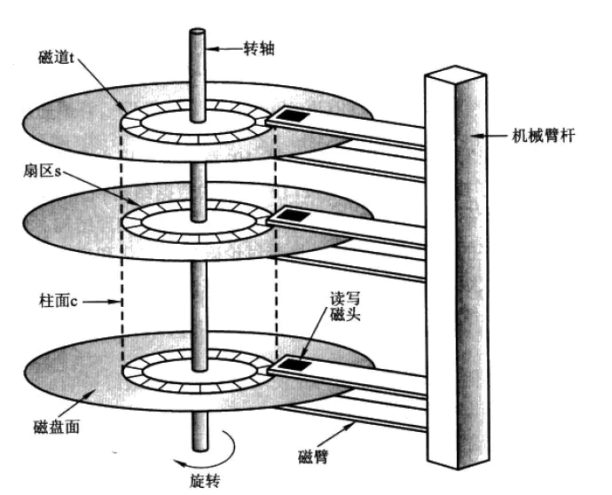
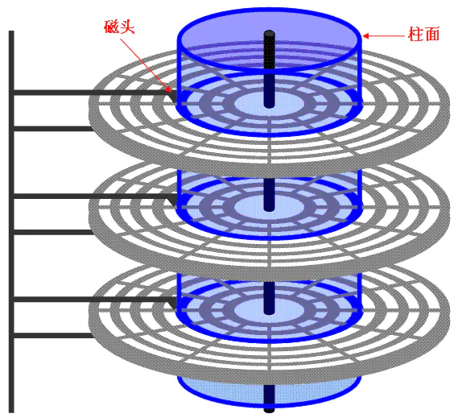
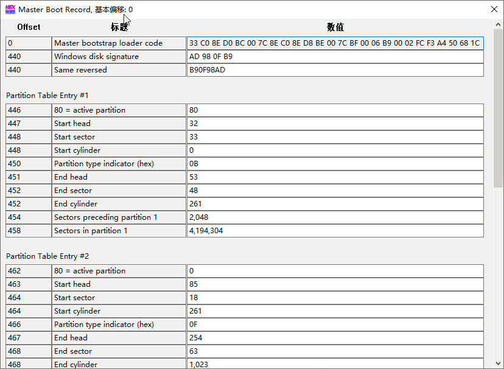
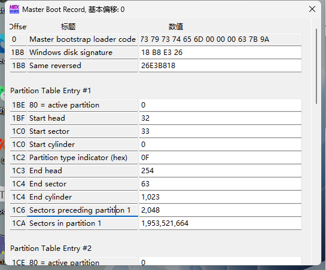
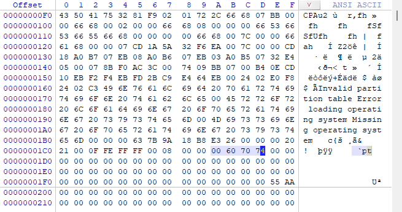
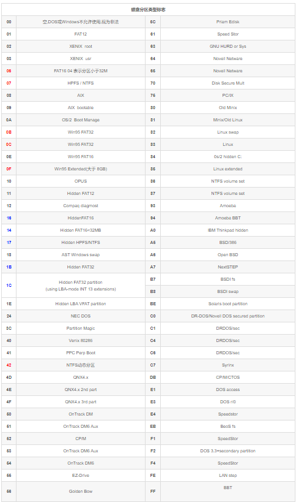
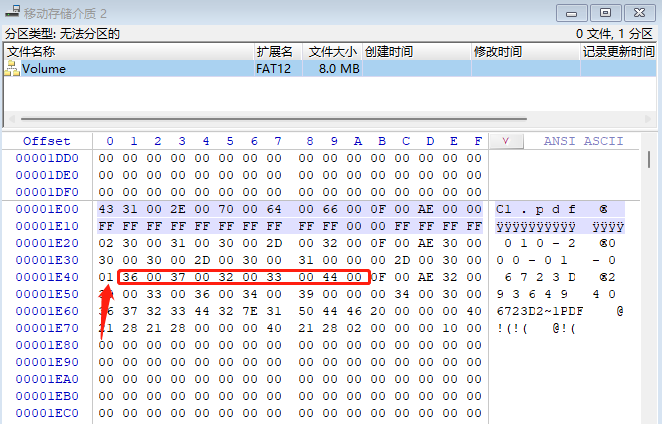

# fatfs

[TOC]

# 硬盘的物理结构：

### 概述

1. 盘片（platter）
2. 磁头（head）
3. 磁道（track）
4. 扇区（sector）
5. 柱面（cylinder）

### 盘片 片面 和 磁头

硬盘中一般会有多个盘片组成，每个盘片包含两个面，每个盘面都对应地有一个读/写磁头。受到硬盘整体体积和生产成本的限制，盘片数量都受到限制，一般都在5片以内。盘片的编号自下向上从0开始，如最下边的盘片有0面和1面，再上一个盘片就编号为2面和3面。
如下图：

图1

### 扇区 和 磁道

下图显示的是一个盘面，盘面中一圈圈灰色同心圆为一条条磁道，从圆心向外画直线，可以将磁道划分为若干个弧段，每个磁道上一个弧段被称之为一个扇区（图中绿色部分），对于老式磁盘，每个扇区存储容量是相同的（也就是每个磁道的容量是相同的，但不同磁道的数据密度是不同的，半径越小的磁道的密度越大，这个是怎么做到的，还不清楚，但我个人猜测是因为旋转角度，转动相同的角度，外部扇区移动的距离更长，而内部扇区移动距离短，就是通过磁头每次移动是固定角度的，但由于磁臂的长度不同，分别对应不同的磁道，那对于外围的扇区，由于磁臂较长，每次移动固定角度，则划过的弧线比内部的扇区划过的弧线要长），对于新式磁盘，所有磁道的数据密度相同，越是外围磁道，数据量越大，但是怎么定位，就不清楚了。扇区是磁盘的最小组成单元，通常是512字节。（由于不断提高磁盘的大小，部分厂商设定每个扇区的大小是4096字节）

图2

### 磁头 和 柱面

硬盘通常由重叠的一组盘片构成，每个盘面都被划分为数目相等的磁道，并从外缘的“0”开始编号，具有相同编号的磁道形成一个圆柱，称之为磁盘的柱面。磁盘的柱面数与一个盘面上的磁道数是相等的。由于每个盘面都有自己的磁头，因此，盘面数等于总的磁头数。 如下图

 

图3

### 磁盘容量计算

存储容量 ＝ 磁头数 × 磁道(柱面)数 × 每道扇区数 × 每扇区字节数

图3中磁盘是一个 3个圆盘6个磁头，7个柱面（每个盘片7个磁道） 的磁盘，图3中每条磁道有12个扇区，所以此磁盘的容量为：

存储容量 6 * 7 * 12 * 512 = 258048

> 每个磁道的扇区数一样是说的老的硬盘，外圈的密度小，内圈的密度大，每圈可存储的数据量是一样的。新的硬盘数据的密度都一致，这样磁道的周长越长，扇区就越多，存储的数据量就越大。

### 磁盘读取响应时间

1. 寻道时间：磁头从开始移动到数据所在磁道所需要的时间，寻道时间越短，I/O操作越快，目前磁盘的平均寻道时间一般在3－15ms，一般都在10ms左右。
2. 旋转延迟：盘片旋转将请求数据所在扇区移至读写磁头下方所需要的时间，旋转延迟取决于磁盘转速。普通硬盘一般都是7200rpm，慢的5400rpm。
3. 数据传输时间：完成传输所请求的数据所需要的时间。
   小结一下：从上面的指标来看、其实最重要的、或者说、我们最关心的应该只有两个：寻道时间；旋转延迟。

> 读写一次磁盘信息所需的时间可分解为：寻道时间、延迟时间、传输时间。为提高磁盘传输效率，软件应着重考虑减少寻道时间和延迟时间。

### 块/簇

概述

磁盘块/簇（虚拟出来的）。 块是操作系统中最小的逻辑存储单位。操作系统与磁盘打交道的最小单位是磁盘块。
通俗的来讲，在Windows下如NTFS等文件系统中叫做簇；在[Linux](https://so.csdn.net/so/search?q=Linux&spm=1001.2101.3001.7020)下如Ext4等文件系统中叫做块（block）。每个簇或者块可以包括2、4、8、16、32、64…2的n次方个扇区。

为什么存在磁盘块？

读取方便：由于扇区的数量比较小，数目众多在寻址时比较困难，所以操作系统就将相邻的扇区组合在一起，形成一个块，再对块进行整体的操作。

分离对底层的依赖：操作系统忽略对底层物理存储结构的设计。通过虚拟出来磁盘块的概念，在系统中认为块是最小的单位。

### page

操作系统经常与内存和硬盘这两种存储设备进行通信，类似于“块”的概念，都需要一种虚拟的基本单位。所以，与内存操作，是虚拟一个页的概念来作为最小单位。与硬盘打交道，就是以块为最小单位。

### 扇区、块/簇、page的关系

1. 扇区： 硬盘的最小读写单元
2. 块/簇： 是操作系统针对硬盘读写的最小单元
3. page： 是内存与操作系统之间操作的最小单元。

扇区 <= 块/簇 <= page

# 磁盘引导原理

## 3.1 MBR(master boot record)扇区：

1. 用winhex查看的一块希捷 120GB硬盘的mbr。
2. https://www.52pojie.cn/thread-1252078-1-1.html

### 打开磁盘：

 

 

 

 单击后：

 

### 查看mbr信息

> 3、系统在分区时，各分区都不允许跨柱面，即均以柱面为单位，这就是通
>
> 常所说的分区粒度。有时候我们分区是输入分区的大小为 7000M，分出来却是
>
> 6997M，就是这个原因。 偏移 2H和偏移 6H的扇区和柱面参数中,扇区占 6 位
>
> (bit)，柱面占 10 位(bit)，以偏移 6H为例，其低 6 位用作扇区数的二进制表
>
> 示。其高两位做柱面数 10 位中的高两位，偏移 7H组成的 8 位做柱面数 10 位中
>
> 的低 8 位。由此可知，实际上用这种方式表示的分区容量是有限的，柱面和磁
>
> 头从 0 开始编号,扇区从 1 开始编号,所以最多只能表示 1024 个柱面×63 个扇
>
> 区×256 个磁头×512byte=8455716864byte。即通常的 8.4GB(实际上应该是
>
> 7.8GB左右)限制。实际上磁头数通常只用到 255 个(由汇编语言的寻址寄存器决
>
> 定),即使把这 3 个字节按线性寻址，依然力不从心。 在后来的操作系统中，超
>
> 过 8.4GB的分区其实已经不通过C/H/S的方式寻址了。而是通过偏移CH～偏移FH
>
> 共 4 个字节 32 位线性扇区地址来表示分区所占用的扇区总数。可知通过 4 个字
>
> 节可以表示 2^32 个扇区，即 2TB=2048GB，目前对于大多数计算机而言，这已
>
> 经是个天文数字了。在未超过 8.4GB的分区上，C/H/S的表示方法和线性扇区的
>
> 表示方法所表示的分区大小是一致的。也就是说，两种表示方法是协调的。即
>
> 使不协调，也以线性寻址为准。(可能在某些系统中会提示出错)。超过 8.4GB
>
> 的分区结束C/H/S一般填充为FEH FFH FFH。即C/H/S所能表示的最大值。有时候
>
> 也会用柱面对 1024 的模来填充。不过这几个字节是什么其实都无关紧要了。 
>
>  虽然现在的系统均采用线性寻址的方式来处理分区的大小。但不可跨柱面
>
> 的原则依然没变。本分区的扇区总数加上与前一分区之间的保留扇区数目依然
>
> 必须是柱面容量的整数倍。(保留扇区中的第一个扇区就是存放分区表的MBR或
>
> 虚拟MBR的扇区，分区的扇区总数在线性表示方式上是不计入保留扇区的。如果
>
> 是第一个分区，保留扇区是本分区前的所有扇区。

### 分区类型标志

## 磁盘分区类型标志表

> 我们的操作系统是靠磁盘分区信息表上的分区类型标志来识别每一个磁盘分区的类型，下面是常见的各种分区类型标志，其中红色和蓝色是最常用的Windows系列操作系统所使用的分区类型，分区类型标志位标志与分区实际格式不符也是常见磁盘的故障，在数据恢复业务中会占到1-2%的比例。

>https://zh.wikipedia.org/wiki/%E5%88%86%E5%8C%BA%E7%B1%BB%E5%9E%8B

# FAT12 DBR

- 目录项从扇区15开始

## 目录项的长文件名解析

0x00~0x00：1 个字节，长文件名目录项的序列号，一个文件的第一个目录项序列号为 1，然后依次递增。如果是该文件的**最后一个长文件名目录项**，则将该目录项的序号与 0x40 进行“或（OR）运算”的结果写入该位置。如果该长文件名目录项对应的文件或子目录被删除，则将该字节设置成删除标志0xE5。 
0x01~0x0A：10 个字节，长文件名的第 1~5 个字符。长文件名使用 Unicode 码，每个字符需要两个字节的空间。如果文件名结束但还有未使用的字节，则会在文件名后先填充两个字节的“00”，然后开始使用 0xFF 填充。 
0x0B~0x0B：1 个字节，长目录项的属性标志，一定是 0x0F。 
0x0C~0x0C：保留。 
0x0D~0x0D：1 个字节，校验和。如果一个文件的长文件名需要几个长文件名目录项进行存储，则这些长文件名目录项具有相同的校验和。 
0x0E~0x19：12 个字节，文件名的第 6~11 个字符，未使用的字节用 0xFF 填充。
0x1A~0x1B：2 个字节，保留。
0x1C~0x1F：4 个字节，文件名的第 12~13 个字符，未使用的字节用 0xFF 填充。

> 1.5.1. 长文件目录项特点
>
> 
> 为了低版本的OS或程序能正确读取长文件名文件，系统自动为所有长文件名文件创建了一个对应的短文件名，使对应数据既可以用长文件名寻址，也可以用短文件名寻址。不支持长文件名的OS或程序会忽略它认为不合法的长文件名字段，而支持长文件名的OS或程序则会以长文件名为显式项来记录和编辑，并隐藏起短文件名。
> 长文件名的实现有赖于目录项偏移为0xB的属性字节，当此字节的属性为：只读、隐藏、系统、卷标，即其值为0FH时，DOS和WIN32会认为其不合法而忽略其存在。这正是长文件名存在的依据。
> 系统将长文件名以13个字符为单位进行切割，每一组占据一个目录项。所以可能一个文件需要多个目录项，这时长文件名的各个目录项按倒序排列在目录表中，以防与其他文件名混淆。长文件名的第一部分距离短文件名目录项是最近的。
> 系统在存储长文件名时，总是先按倒序填充长文件名目录项，然后紧跟其对应的短文件名。长文件名中并不存储对应文件的文件开始簇、文件大小、各种时间和日期属性。文件的这些属性还是存放在短文件名目录项中，一个长文件名总是和其相应的短文件名一一对应，短文件名没有了长文件名还可以读，但长文件名如果没有对应的短文件名，不管什么系统都将忽略其存在。所以短文件名是至关重要的。在不支持长文件名的环境中对短文件名中的文件名和扩展名字段作更改(包括删除，因为删除是对首字符改写E5H)，都会使长文件名形同虚设。
>
> 

- 所以该长文件名为: 从1序号开始获取名称,末尾的序号`0x03|0x40` = 0x43

